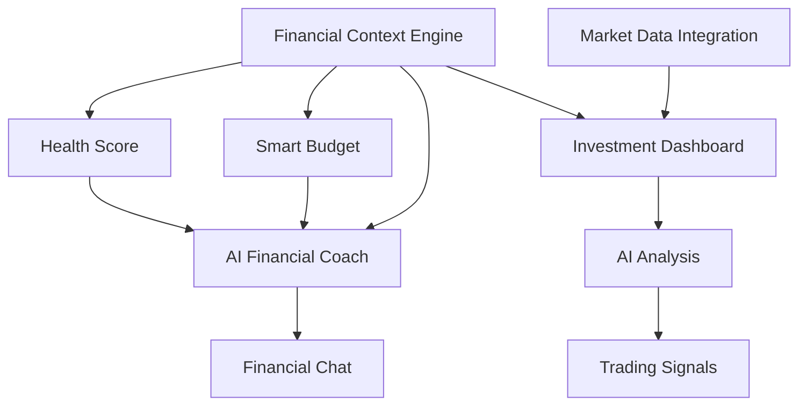

# CPFI Intelligent Financial Suite - Implementation Plan

## Executive Summary

This document outlines the systematic implementation of four major feature suites that will differentiate CPFI from Credit Karma by providing **intelligent banking tools** that work with users' existing accounts rather than creating new ones.

**Timeline**: 12 weeks | **Team Size**: 3-4 developers | **Priority**: P0-P2

---

## Table of Contents

1. [Feature Overview & Prioritization](#1-feature-overview--prioritization)
2. [Technical Architecture](#2-technical-architecture)
3. [Database Schema](#3-database-schema)
4. [API Design](#4-api-design)
5. [Required Integrations](#5-required-integrations)
6. [Screen Designs](#6-screen-designs)
7. [Implementation Timeline](#7-implementation-timeline)
8. [Dependencies & Prerequisites](#8-dependencies--prerequisites)

---

## 1. Feature Overview & Prioritization

### Suite 1: Intelligent Banking & Financial Management (Weeks 1-4)

| Feature | Priority | Complexity | Dependencies |
|---------|----------|------------|--------------|
| Account Aggregation Enhancement | P0 | Medium | Plaid (exists) |
| Smart Budgeting Engine | P0 | High | Account data |
| Savings Optimizer | P1 | Medium | Budgets, Goals |
| Financial Health Score | P0 | High | All financial data |
| Spending Intelligence | P0 | Medium | Transactions |
| Bill Negotiation AI | P2 | High | AI Orchestrator |

### Suite 2: AI Financial Coach (Weeks 3-6)

| Feature | Priority | Complexity | Dependencies |
|---------|----------|------------|--------------|
| Financial Profile Engine | P0 | High | All user data |
| Personalized Advice Generator | P0 | High | AI models |
| Goal Setting & Tracking | P0 | Medium | Database |
| Proactive Recommendations | P1 | High | ML models |
| Debt Strategy Optimizer | P0 | High | Debt data |

### Suite 3: Expert Asset Scanner & Investment Intelligence (Weeks 5-9)

| Feature | Priority | Complexity | Dependencies |
|---------|----------|------------|--------------|
| Multi-Asset Portfolio Tracker | P1 | High | Market APIs |
| AI Investment Analysis | P1 | Very High | AI + Market data |
| Portfolio Optimization | P2 | Very High | Analysis engine |
| Market Intelligence Alerts | P1 | Medium | Real-time data |
| Trading Signal Generator | P2 | Very High | AI models |

### Suite 4: Financial Chat Interface (Weeks 7-10)

| Feature | Priority | Complexity | Dependencies |
|---------|----------|------------|--------------|
| Financial Context Engine | P0 | High | All user data |
| Conversational Budget Management | P0 | High | AI + Budgets |
| Goal Chat Interface | P1 | Medium | Goals system |
| Financial Education AI | P1 | Medium | Content + AI |

---

## 2. Technical Architecture

### 2.1 High-Level Architecture

```
┌─────────────────────────────────────────────────────────────────────────┐
│                         CPFI Financial Intelligence Layer               │
├─────────────────────────────────────────────────────────────────────────┤
│                                                                         │
│  ┌──────────────┐  ┌──────────────┐  ┌──────────────┐  ┌─────────────┐ │
│  │  Smart       │  │  AI          │  │  Investment  │  │  Financial  │ │
│  │  Banking     │  │  Financial   │  │  Intelligence│  │  Chat       │ │
│  │  Suite       │  │  Coach       │  │  Suite       │  │  Interface  │ │
│  └──────┬───────┘  └──────┬───────┘  └──────┬───────┘  └──────┬──────┘ │
│         │                 │                 │                 │        │
│  ┌──────┴─────────────────┴─────────────────┴─────────────────┴──────┐ │
│  │                    Unified Financial Context Engine                │ │
│  │         (User's complete financial picture in real-time)          │ │
│  └───────────────────────────────┬───────────────────────────────────┘ │
│                                  │                                     │
│  ┌───────────────────────────────┼───────────────────────────────────┐ │
│  │                        Core Services Layer                        │ │
│  ├─────────────┬─────────────┬───┴───────┬─────────────┬────────────┤ │
│  │ Financial   │ Budget      │ AI        │ Investment  │ Notification│ │
│  │ Service     │ Engine      │ Orchestr. │ Engine      │ Service    │ │
│  └─────────────┴─────────────┴───────────┴─────────────┴────────────┘ │
│                                                                         │
│  ┌───────────────────────────────────────────────────────────────────┐ │
│  │                      Data Integration Layer                        │ │
│  ├─────────────┬─────────────┬───────────┬─────────────┬────────────┤ │
│  │ Plaid       │ Market Data │ AIML API  │ Supabase    │ Redis      │ │
│  │ (Banking)   │ (Alpha/Poly)│ (300+ AI) │ (Database)  │ (Cache)    │ │
│  └─────────────┴─────────────┴───────────┴─────────────┴────────────┘ │
└─────────────────────────────────────────────────────────────────────────┘
```

### 2.2 Financial Context Engine Architecture

```typescript
// src/lib/financial/financial-context-engine.ts
interface FinancialContext {
  user: UserProfile;
  accounts: AggregatedAccounts;
  transactions: CategorizedTransactions;
  budgets: BudgetStatus[];
  goals: FinancialGoal[];
  debts: DebtAnalysis;
  investments: PortfolioSummary;
  creditProfile: CreditSummary;
  healthScore: FinancialHealthScore;
  insights: AIInsight[];
  recommendations: Recommendation[];
}
```

---

## 3. Database Schema

### 3.1 New Tables Required

```sql
-- Financial Goals Table
CREATE TABLE financial_goals (
  id UUID PRIMARY KEY DEFAULT gen_random_uuid(),
  user_id UUID REFERENCES auth.users(id) ON DELETE CASCADE,
  name VARCHAR(255) NOT NULL,
  type VARCHAR(50) NOT NULL, -- 'emergency_fund', 'debt_payoff', 'savings', 'retirement', 'purchase'
  target_amount DECIMAL(12,2) NOT NULL,
  current_amount DECIMAL(12,2) DEFAULT 0,
  target_date DATE,
  priority INTEGER DEFAULT 1,
  auto_save_enabled BOOLEAN DEFAULT false,
  auto_save_amount DECIMAL(12,2),
  auto_save_frequency VARCHAR(20), -- 'weekly', 'biweekly', 'monthly'
  linked_account_id UUID,
  status VARCHAR(20) DEFAULT 'active', -- 'active', 'paused', 'completed', 'cancelled'
  ai_recommendations JSONB DEFAULT '[]'::jsonb,
  created_at TIMESTAMPTZ DEFAULT NOW(),
  updated_at TIMESTAMPTZ DEFAULT NOW()
);

-- Financial Health Scores Table
CREATE TABLE financial_health_scores (
  id UUID PRIMARY KEY DEFAULT gen_random_uuid(),
  user_id UUID REFERENCES auth.users(id) ON DELETE CASCADE,
  overall_score INTEGER NOT NULL, -- 0-100
  category_scores JSONB NOT NULL, -- {savings: 85, debt: 60, spending: 75, credit: 80, insurance: 50}
  factors JSONB NOT NULL, -- detailed breakdown
  recommendations JSONB NOT NULL,
  calculated_at TIMESTAMPTZ DEFAULT NOW(),
  UNIQUE(user_id, calculated_at::date)
);

-- AI Financial Insights Table
CREATE TABLE financial_insights (
  id UUID PRIMARY KEY DEFAULT gen_random_uuid(),
  user_id UUID REFERENCES auth.users(id) ON DELETE CASCADE,
  type VARCHAR(50) NOT NULL, -- 'spending_alert', 'savings_opportunity', 'bill_negotiation', 'goal_progress'
  category VARCHAR(50),
  title VARCHAR(255) NOT NULL,
  message TEXT NOT NULL,
  impact_amount DECIMAL(12,2),
  action_type VARCHAR(50),
  action_data JSONB,
  priority VARCHAR(20) DEFAULT 'medium',
  is_read BOOLEAN DEFAULT false,
  is_dismissed BOOLEAN DEFAULT false,
  expires_at TIMESTAMPTZ,
  created_at TIMESTAMPTZ DEFAULT NOW()
);

-- Bill Tracking & Negotiation Table
CREATE TABLE recurring_bills (
  id UUID PRIMARY KEY DEFAULT gen_random_uuid(),
  user_id UUID REFERENCES auth.users(id) ON DELETE CASCADE,
  name VARCHAR(255) NOT NULL,
  category VARCHAR(50) NOT NULL, -- 'utilities', 'subscriptions', 'insurance', 'phone', 'internet'
  provider VARCHAR(255),
  amount DECIMAL(12,2) NOT NULL,
  frequency VARCHAR(20) NOT NULL, -- 'monthly', 'quarterly', 'annual'
  due_day INTEGER,
  last_payment_date DATE,
  negotiation_status VARCHAR(20) DEFAULT 'none', -- 'none', 'in_progress', 'success', 'failed'
  negotiation_savings DECIMAL(12,2) DEFAULT 0,
  auto_pay_enabled BOOLEAN DEFAULT false,
  linked_transaction_pattern JSONB,
  created_at TIMESTAMPTZ DEFAULT NOW(),
  updated_at TIMESTAMPTZ DEFAULT NOW()
);

-- Investment Portfolio Table
CREATE TABLE investment_portfolios (
  id UUID PRIMARY KEY DEFAULT gen_random_uuid(),
  user_id UUID REFERENCES auth.users(id) ON DELETE CASCADE,
  name VARCHAR(255) DEFAULT 'Main Portfolio',
  total_value DECIMAL(14,2) DEFAULT 0,
  total_cost_basis DECIMAL(14,2) DEFAULT 0,
  total_gain_loss DECIMAL(14,2) DEFAULT 0,
  total_gain_loss_percent DECIMAL(8,4) DEFAULT 0,
  risk_score INTEGER, -- 1-10
  diversification_score INTEGER, -- 0-100
  last_synced_at TIMESTAMPTZ,
  created_at TIMESTAMPTZ DEFAULT NOW(),
  updated_at TIMESTAMPTZ DEFAULT NOW()
);

-- Investment Holdings Table
CREATE TABLE investment_holdings (
  id UUID PRIMARY KEY DEFAULT gen_random_uuid(),
  portfolio_id UUID REFERENCES investment_portfolios(id) ON DELETE CASCADE,
  user_id UUID REFERENCES auth.users(id) ON DELETE CASCADE,
  symbol VARCHAR(20) NOT NULL,
  name VARCHAR(255),
  asset_type VARCHAR(50) NOT NULL, -- 'stock', 'etf', 'crypto', 'bond', 'mutual_fund', 'option', 'future'
  quantity DECIMAL(18,8) NOT NULL,
  avg_cost_basis DECIMAL(14,4),
  current_price DECIMAL(14,4),
  current_value DECIMAL(14,2),
  gain_loss DECIMAL(14,2),
  gain_loss_percent DECIMAL(8,4),
  allocation_percent DECIMAL(5,2),
  sector VARCHAR(100),
  ai_analysis JSONB,
  last_updated_at TIMESTAMPTZ DEFAULT NOW(),
  created_at TIMESTAMPTZ DEFAULT NOW()
);

-- Investment Transactions Table
CREATE TABLE investment_transactions (
  id UUID PRIMARY KEY DEFAULT gen_random_uuid(),
  holding_id UUID REFERENCES investment_holdings(id) ON DELETE SET NULL,
  user_id UUID REFERENCES auth.users(id) ON DELETE CASCADE,
  symbol VARCHAR(20) NOT NULL,
  transaction_type VARCHAR(20) NOT NULL, -- 'buy', 'sell', 'dividend', 'split'
  quantity DECIMAL(18,8) NOT NULL,
  price DECIMAL(14,4) NOT NULL,
  total_amount DECIMAL(14,2) NOT NULL,
  fees DECIMAL(10,2) DEFAULT 0,
  executed_at TIMESTAMPTZ NOT NULL,
  notes TEXT,
  created_at TIMESTAMPTZ DEFAULT NOW()
);

-- AI Trading Signals Table
CREATE TABLE trading_signals (
  id UUID PRIMARY KEY DEFAULT gen_random_uuid(),
  user_id UUID REFERENCES auth.users(id) ON DELETE CASCADE,
  symbol VARCHAR(20) NOT NULL,
  signal_type VARCHAR(20) NOT NULL, -- 'buy', 'sell', 'hold', 'watch'
  confidence_score DECIMAL(5,2) NOT NULL, -- 0-100
  analysis_type VARCHAR(50) NOT NULL, -- 'technical', 'fundamental', 'sentiment', 'ai_composite'
  price_target DECIMAL(14,4),
  stop_loss DECIMAL(14,4),
  time_horizon VARCHAR(20), -- 'intraday', 'swing', 'position', 'long_term'
  reasoning TEXT NOT NULL,
  supporting_data JSONB,
  is_active BOOLEAN DEFAULT true,
  triggered_at TIMESTAMPTZ,
  outcome VARCHAR(20), -- 'pending', 'profitable', 'loss', 'expired'
  created_at TIMESTAMPTZ DEFAULT NOW(),
  expires_at TIMESTAMPTZ
);

-- Financial Chat Sessions Table
CREATE TABLE financial_chat_sessions (
  id UUID PRIMARY KEY DEFAULT gen_random_uuid(),
  user_id UUID REFERENCES auth.users(id) ON DELETE CASCADE,
  session_type VARCHAR(50) NOT NULL, -- 'general', 'budget', 'goals', 'investment', 'debt'
  title VARCHAR(255),
  context_snapshot JSONB, -- snapshot of financial context at session start
  is_active BOOLEAN DEFAULT true,
  created_at TIMESTAMPTZ DEFAULT NOW(),
  updated_at TIMESTAMPTZ DEFAULT NOW()
);

-- Financial Chat Messages Table
CREATE TABLE financial_chat_messages (
  id UUID PRIMARY KEY DEFAULT gen_random_uuid(),
  session_id UUID REFERENCES financial_chat_sessions(id) ON DELETE CASCADE,
  role VARCHAR(20) NOT NULL, -- 'user', 'assistant', 'system'
  content TEXT NOT NULL,
  actions_taken JSONB, -- actions performed by AI (created budget, set goal, etc.)
  referenced_data JSONB, -- financial data referenced in response
  model_used VARCHAR(100),
  tokens_used INTEGER,
  created_at TIMESTAMPTZ DEFAULT NOW()
);

-- Indexes for performance
CREATE INDEX idx_financial_goals_user ON financial_goals(user_id);
CREATE INDEX idx_financial_goals_status ON financial_goals(status);
CREATE INDEX idx_financial_insights_user ON financial_insights(user_id);
CREATE INDEX idx_financial_insights_unread ON financial_insights(user_id, is_read) WHERE NOT is_read;
CREATE INDEX idx_recurring_bills_user ON recurring_bills(user_id);
CREATE INDEX idx_investment_holdings_portfolio ON investment_holdings(portfolio_id);
CREATE INDEX idx_investment_holdings_symbol ON investment_holdings(symbol);
CREATE INDEX idx_trading_signals_user_active ON trading_signals(user_id, is_active) WHERE is_active;
CREATE INDEX idx_chat_sessions_user ON financial_chat_sessions(user_id);
CREATE INDEX idx_chat_messages_session ON financial_chat_messages(session_id);
```

---

## 4. API Design

### 4.1 Financial Context API

```typescript
// GET /api/financial/context
interface FinancialContextResponse {
  success: boolean;
  data: {
    summary: {
      netWorth: number;
      monthlyIncome: number;
      monthlyExpenses: number;
      savingsRate: number;
      debtToIncomeRatio: number;
      emergencyFundMonths: number;
    };
    accounts: AccountSummary[];
    budgetStatus: BudgetStatus[];
    goals: GoalProgress[];
    healthScore: FinancialHealthScore;
    insights: Insight[];
  };
}
```

### 4.2 AI Financial Coach API

```typescript
// POST /api/ai/financial-coach/analyze
interface CoachAnalysisRequest {
  focusArea?: 'overview' | 'debt' | 'savings' | 'spending';
  specificQuestion?: string;
}

// POST /api/ai/financial-coach/debt-strategy
interface DebtStrategyRequest {
  method: 'snowball' | 'avalanche' | 'ai_optimized';
  extraPayment?: number;
}
```

### 4.3 Investment Intelligence API

```typescript
// GET /api/investments/portfolio
interface PortfolioResponse {
  portfolio: { totalValue: number; holdings: Holding[]; };
  aiAnalysis: {
    overallRating: 'strong' | 'good' | 'fair' | 'weak';
    diversificationScore: number;
    recommendations: PortfolioRecommendation[];
  };
}

// GET /api/investments/signals
interface SignalsResponse {
  signals: TradingSignal[];
  marketSentiment: { overall: 'bullish' | 'neutral' | 'bearish'; };
}
```

### 4.4 Financial Chat API

```typescript
// POST /api/chat/financial
interface FinancialChatRequest {
  sessionId?: string;
  message: string;
  allowActions?: boolean;
}

interface FinancialChatResponse {
  sessionId: string;
  response: {
    message: string;
    suggestedActions?: SuggestedAction[];
    actionsTaken?: ActionTaken[];
  };
}
```

---

## 5. Required Integrations

### 5.1 Existing Integrations (Leverage)

| Integration | Status | Used For |
|-------------|--------|----------|
| **Plaid** | ✅ Implemented | Account aggregation, transactions |
| **AIML API** | ✅ Implemented | 300+ AI models |
| **Supabase** | ✅ Implemented | Database, Auth |
| **Stripe** | ✅ Implemented | Payments |

### 5.2 New Integrations Required

| Integration | Priority | Cost | Used For |
|-------------|----------|------|----------|
| **Alpha Vantage** | P1 | Free tier + $50/mo | Stock data, fundamentals |
| **Polygon.io** | P1 | $29-$199/mo | Real-time market data |
| **CoinGecko** | P1 | Free tier | Crypto prices |
| **Finnhub** | P2 | Free tier | News sentiment |
| **OpenFIGI** | P2 | Free | Asset identification |

### 5.3 Integration Architecture

```typescript
// src/lib/integrations/market-data-service.ts
export class MarketDataService {
  private alphaVantage: AlphaVantageClient;
  private polygon: PolygonClient;
  private coinGecko: CoinGeckoClient;

  async getQuote(symbol: string, assetType: AssetType): Promise<Quote> {
    switch (assetType) {
      case 'crypto':
        return this.coinGecko.getPrice(symbol);
      case 'stock':
      case 'etf':
        return this.polygon.getQuote(symbol) ??
               this.alphaVantage.getQuote(symbol);
      default:
        return this.alphaVantage.getQuote(symbol);
    }
  }

  async getHistoricalData(
    symbol: string,
    period: '1D' | '1W' | '1M' | '3M' | '1Y' | '5Y'
  ): Promise<OHLCV[]>;

  async getFundamentals(symbol: string): Promise<Fundamentals>;
  async getNews(symbol: string): Promise<NewsItem[]>;
  async getSentiment(symbol: string): Promise<SentimentScore>;
}
```

---

## 6. Screen Designs

### 6.1 Web Screens Required

| Screen | Route | Priority | Features |
|--------|-------|----------|----------|
| Financial Dashboard | `/financial` | P0 | Health score, accounts, insights |
| Smart Budget | `/financial/budget` | P0 | AI budgets, categories, tracking |
| Savings Goals | `/financial/goals` | P0 | Goal cards, progress, automation |
| Spending Analysis | `/financial/spending` | P0 | Categories, trends, AI insights |
| Bill Manager | `/financial/bills` | P1 | Bills, negotiation status |
| AI Financial Coach | `/financial/coach` | P0 | Chat, recommendations |
| Investment Dashboard | `/investments` | P1 | Portfolio, holdings, analysis |
| Asset Detail | `/investments/[symbol]` | P1 | Charts, AI analysis, signals |
| Portfolio Optimizer | `/investments/optimize` | P2 | Rebalancing, suggestions |
| Financial Chat | `/chat/financial` | P0 | Full chat interface |

### 6.2 Mobile Screens Required

| Screen | Route | Priority |
|--------|-------|----------|
| Financial Home | `/financial/index` | P0 |
| Smart Budget | `/financial/smart-budget` | P0 |
| Goals Manager | `/financial/goals-manager` | P0 |
| Spending Insights | `/financial/spending-insights` | P0 |
| Bill Negotiator | `/financial/bill-negotiator` | P1 |
| AI Coach | `/financial/ai-coach` | P0 |
| Investment Home | `/investments/index` | P1 |
| Asset Detail | `/investments/[symbol]` | P1 |
| Trading Signals | `/investments/signals` | P2 |
| Financial Chat | `/chat/financial` | P0 |

---

## 7. Implementation Timeline

### Week 1-2: Foundation & Financial Context Engine

**Goals:**
- Build unified Financial Context Engine
- Implement Financial Health Score algorithm
- Create database migrations

**Tasks:**
- [ ] Create `financial-context-engine.ts`
- [ ] Implement health score calculation
- [ ] Run Supabase migrations for new tables
- [ ] Build `/api/financial/context` endpoint
- [ ] Build `/api/financial/health-score` endpoint

### Week 3-4: Smart Banking Suite

**Goals:**
- Enhanced budgeting with AI
- Savings optimizer
- Spending intelligence

**Tasks:**
- [ ] AI-powered budget generation
- [ ] Automatic transaction categorization
- [ ] Spending pattern analysis
- [ ] Savings recommendations engine
- [ ] Web: Smart Budget screen
- [ ] Mobile: Smart Budget screen

### Week 5-6: AI Financial Coach

**Goals:**
- Personal financial AI assistant
- Debt optimization strategies
- Goal planning

**Tasks:**
- [ ] Financial coach AI prompt engineering
- [ ] Debt snowball/avalanche optimizer
- [ ] Goal setting and tracking system
- [ ] `/api/ai/financial-coach/*` endpoints
- [ ] Web: AI Coach screen
- [ ] Mobile: AI Coach screen

### Week 7-8: Investment Intelligence (Phase 1)

**Goals:**
- Portfolio tracking
- Basic AI analysis
- Market data integration

**Tasks:**
- [ ] Integrate Alpha Vantage / Polygon
- [ ] Portfolio tracker implementation
- [ ] Basic AI analysis for holdings
- [ ] Web: Investment Dashboard
- [ ] Mobile: Investment screens

### Week 9-10: Investment Intelligence (Phase 2)

**Goals:**
- Advanced analysis
- Trading signals
- Portfolio optimization

**Tasks:**
- [ ] Advanced AI analysis models
- [ ] Trading signal generator
- [ ] Portfolio optimizer
- [ ] Market sentiment analysis
- [ ] Alert system

### Week 11-12: Financial Chat & Polish

**Goals:**
- Full chat interface
- Integration testing
- Performance optimization

**Tasks:**
- [ ] Financial chat with context awareness
- [ ] Action execution from chat
- [ ] End-to-end testing
- [ ] Performance optimization
- [ ] Documentation

---

## 8. Dependencies & Prerequisites

### 8.1 Technical Prerequisites

| Prerequisite | Status | Notes |
|-------------|--------|-------|
| Plaid Integration | ✅ Ready | Already implemented |
| AIML API Access | ✅ Ready | 300+ models available |
| Supabase Database | ✅ Ready | Need migrations |
| User Authentication | ✅ Ready | JWT + sessions |
| Mobile App Shell | ✅ Ready | Expo Router setup |

### 8.2 External Dependencies

| Dependency | Required For | Setup Time |
|-----------|--------------|------------|
| Alpha Vantage API Key | Investment data | 1 day |
| Polygon.io API Key | Real-time quotes | 1 day |
| CoinGecko API | Crypto prices | Free, instant |

### 8.3 Task Dependencies



### 8.4 Risk Mitigation

| Risk | Impact | Mitigation |
|------|--------|------------|
| Market API rate limits | High | Implement caching, use multiple providers |
| AI model costs | Medium | Use model routing, cache responses |
| Plaid connection issues | High | Implement retry logic, fallback UI |
| Complex financial calculations | Medium | Unit test extensively |

---

## 9. Success Metrics

### 9.1 Key Performance Indicators

| Metric | Target | Measurement |
|--------|--------|-------------|
| User Engagement | 3x current | Daily active users |
| Feature Adoption | 60% | Users using new features |
| Financial Health Score Usage | 80% | Users checking score weekly |
| AI Coach Conversations | 5/user/week | Chat sessions |
| Investment Tracking | 40% | Users with portfolios |

### 9.2 Technical Metrics

| Metric | Target |
|--------|--------|
| API Response Time | < 200ms |
| AI Analysis Time | < 3s |
| Health Score Calculation | < 500ms |
| Portfolio Sync | < 2s |

---

## 10. File Structure

### 10.1 New Services

```
src/lib/
├── financial/
│   ├── financial-context-engine.ts    # NEW
│   ├── health-score-calculator.ts     # NEW
│   ├── smart-budget-engine.ts         # NEW
│   ├── savings-optimizer.ts           # NEW
│   ├── bill-negotiator.ts             # NEW
│   ├── financial-service.ts           # EXISTS
│   └── plaid-service.ts               # EXISTS
├── investments/
│   ├── portfolio-service.ts           # NEW
│   ├── market-data-service.ts         # NEW
│   ├── ai-analyst.ts                  # NEW
│   ├── signal-generator.ts            # NEW
│   └── portfolio-optimizer.ts         # NEW
├── ai/
│   ├── financial-coach.ts             # NEW
│   ├── financial-chat-engine.ts       # NEW
│   └── spending-analyzer.ts           # NEW
└── integrations/
    ├── alpha-vantage.ts               # NEW
    ├── polygon.ts                     # NEW
    └── coingecko.ts                   # NEW
```

### 10.2 New API Routes

```
src/app/api/
├── financial/
│   ├── context/route.ts               # NEW
│   ├── health-score/route.ts          # NEW
│   ├── goals/route.ts                 # NEW
│   ├── bills/route.ts                 # NEW
│   └── insights/route.ts              # NEW
├── investments/
│   ├── portfolio/route.ts             # NEW
│   ├── holdings/route.ts              # NEW
│   ├── analyze/[symbol]/route.ts      # NEW
│   └── signals/route.ts               # NEW
├── ai/
│   └── financial-coach/
│       ├── analyze/route.ts           # NEW
│       ├── plan/route.ts              # NEW
│       └── debt-strategy/route.ts     # NEW
└── chat/
    └── financial/route.ts             # NEW
```

### 10.3 New Web Pages

```
src/app/
├── financial/
│   ├── page.tsx                       # Enhanced dashboard
│   ├── smart-budget/page.tsx          # NEW
│   ├── goals/page.tsx                 # NEW
│   ├── spending/page.tsx              # Enhanced
│   ├── bills/page.tsx                 # NEW
│   └── coach/page.tsx                 # NEW
├── investments/
│   ├── page.tsx                       # NEW
│   ├── [symbol]/page.tsx              # NEW
│   ├── signals/page.tsx               # NEW
│   └── optimize/page.tsx              # NEW
└── chat/
    └── financial/page.tsx             # NEW
```

### 10.4 New Mobile Screens

```
mobile-app/app/
├── financial/
│   ├── smart-budget.tsx               # NEW
│   ├── goals-manager.tsx              # NEW
│   ├── spending-insights.tsx          # NEW
│   ├── bill-negotiator.tsx            # NEW
│   └── ai-coach.tsx                   # NEW
├── investments/
│   ├── index.tsx                      # NEW
│   ├── [symbol].tsx                   # NEW
│   ├── signals.tsx                    # NEW
│   └── optimize.tsx                   # NEW
└── chat/
    └── financial.tsx                  # NEW
```

---

## Summary

This implementation plan provides a comprehensive roadmap for building CPFI's Intelligent Financial Suite. The key differentiator from Credit Karma is our **AI-first approach** that works with users' existing bank accounts rather than trying to replace them.

**Total New Components:**
- 15+ new backend services
- 20+ new API endpoints
- 10+ new web pages
- 10+ new mobile screens
- 8 new database tables

**Competitive Advantages:**
1. AI-powered financial coaching (unique)
2. Hedge fund-quality investment analysis (unique)
3. Bill negotiation assistant (Rocket Money feature)
4. Unified financial context for all decisions
5. Conversational financial planning

**Next Steps:**
1. Review and approve plan
2. Set up new API integrations
3. Run database migrations
4. Begin Week 1 implementation
