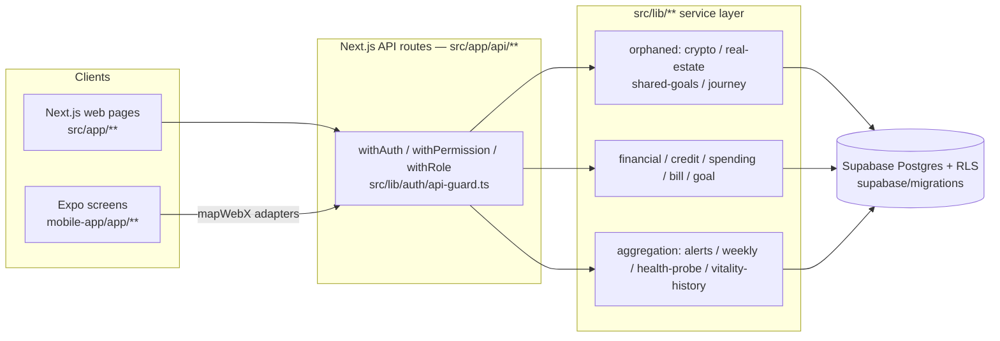

# Architecture — Backend Parity

> Target shape for the parity backend. Grounded against real code (`research-notes.md`). Every choice traces to a requirement in `product-spec.md`.

## System shape

- **No new architecture.** This is additive: new routes follow the existing `withAuth` + service-layer + Supabase pattern already used by 237 routes. Mobile consumes web routes via the established `mapWebX` adapter pattern (`mobile-app/src/services/api/**`).

## The mandatory route contract (every new route)

1. Wrap in `withAuth` (user data) / `withPermission("<domain>:<action>")` (RBAC) / `withRole("admin")` (admin). Never leave a data route unguarded.
2. `userId = user.id` from the guard — **never** from body/query.
3. Every query filters `.eq("user_id", user.id)` (or an ownership-join for child tables). RLS is defence-in-depth; the orphaned services use the **service-role key which bypasses RLS**, so the explicit filter is the real IDOR control.
4. Validate input at the boundary (Zod or the project validator).
5. Return the project's canonical `{ success, data, ... }` shape; honest error (503 on infra, 4xx on client), never a mock fallback.
6. No fabricated data. No source → empty-state / `[]` / `null`, never invented numbers.

## Migration reconciliation strategy (M0)

Root cause of items FR-001..006: **`CREATE TABLE IF NOT EXISTS` collisions** — an earlier migration's shape silently wins, the later richer definition is a no-op; and several tables were never migrated at all.

- **Reconcile, don't duplicate:** the canonical (first-run) table is authoritative; the later migration becomes an idempotent `ALTER TABLE … ADD COLUMN IF NOT EXISTS`. Never a second `CREATE`.
- **Ground new tables in reader+writer usage:** e.g. `transactions` columns come from the Plaid writer (`plaid-service.ts:411`) reconciled with the analyzer reader (`spending-analyzer.ts:77`) — resolve `category` to a single canonical type, pick one of `pending`/`is_pending`.
- **Additive only. RLS on every table. Register every table in the erasure cascade.** No `DROP`, no destructive `ALTER`. The build produces migration files; it does **not** run them against prod.

## Modules

| Module / route (new) | Track | Backs FR | Source of truth | Migration |
|---|---|---|---|---|
| `/api/journey` | 1 | 101 | `financial-journey-service.ts` | `financial_journeys` (1) |
| `/api/financial/crypto` | 1 | 102 | `crypto-wallet-service.ts` (+IDOR fix) | crypto_wallets/holdings/alerts (3) |
| `/api/financial/real-estate` | 1 | 103 | `real-estate-tracking-service.ts` (+IDOR fix) | properties/valuations/mortgages (3) |
| `/api/goals/shared` | 1 | 104 | `shared-goals-service.ts` (+atomic RPC) | shared_goals +4 (5) |
| `/api/credit-repair/cards` (exists) | 2 | 201 | `credit_cards` | — (wire only) |
| `/api/credit-repair/reports/[id]` (exists) | 2 | 202 | `credit_reports` | — (wire only) |
| `/api/credit-repair/accounts` (new) | 2 | 203 | `credit_accounts` | — |
| `/api/credit-repair/disputable-items` (new) | 2 | 204 | `credit_inquiries` ∪ `credit_accounts` | — |
| `/api/activity` (new) | 2 | 205 | `notifications` (+union) | — |
| `/api/profile` (expand) | 2 | 207 | `profiles` | +6 cols (FR-005) |
| `/api/documents` (+analysis) | 2 | 208 | `documents` + OCR pipeline | +analysis_result col |
| `/api/support` (new) | 2 | 209 | new | `support_tickets` (1) |
| `/api/financial/insights/weekly-summary` (new) | 3 | 301 | getSpendingAnalysis+budgets+goals | (uses reconciled `transactions`) |
| `/api/alerts` (new) | 3 | 302 | 4 signal services | spending_alerts/limits, budget_alerts (FR-006) |
| `/api/admin/health` (new) | 3 | 303 | 6 service probes | — |
| `/api/financial/vitality-score` (new) | 3 | 304 | health-score system (per ADR) | vitality history table |

## Cross-cutting concerns

- **IDOR:** service-role key bypasses RLS → explicit `user_id` scoping is mandatory; by-id orphaned-service methods must gain owner-scoping before routing. Every new route ships an IDOR + auth-negative test.
- **Money correctness:** shared-goals `current_amount` and any balance mutation via atomic Postgres RPC (reuse `increment_referral_use` pattern), never read-modify-write.
- **Honesty:** admin-health missing-env → degraded; aggregation with no data → empty; no placeholder scoring paths from `spending-analyzer`.
- **GDPR:** every new table added to the erasure cascade (FND-057).
- **Mobile:** `mapWebX` adapters; absent optionals stay `undefined`; missing → `null` + drop-renormalize, never coerce-to-0.

## Decision log (→ ADRs)

| Decision | Confidence | ADR |
|---|---|---|
| Reconcile drift via ALTER, forbid shadow CREATE | high | ADR-0001 migration-hygiene |
| shared-goals contributions via atomic RPC | high | ADR-0002 atomic-money-mutations |
| Unify the two health-score systems before wiring vitality history | medium | ADR-0003 health-score-unification |
| Register all new tables in GDPR erasure cascade | high | ADR-0004 erasure-cascade-coverage |
| Market-data vendor | low (owner) | ADR-0005 (Proposed) |
| Identity-monitoring vendor | low (owner) | ADR-0006 (Proposed) |
| Cards product direction | low (owner) | ADR-0007 (Proposed) |
| Marketplace route-guarding policy | medium (owner) | ADR-0008 (Proposed) |
| Credit simulators de-fab vs remove | medium (owner) | ADR-0009 (Proposed) |
