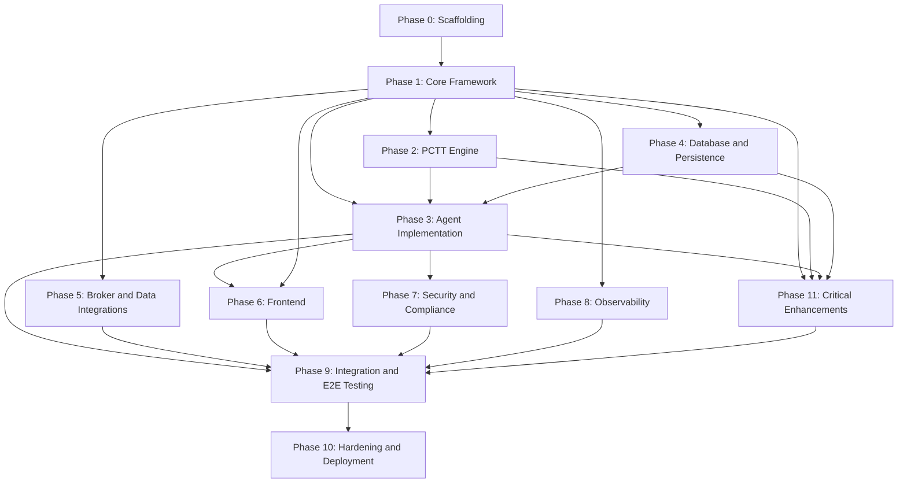

# Strativion PCTT Multi-Agent Trading Platform: Implementation Plan

## IMP-META-01: Plan Header

### .01 Version

| Field | Value |
|-------|-------|
| Version | 1.0.0 |
| Date | 2026-02-23 |
| Author | Kimal Honour Djam |
| System | Strativion PCTT Engine |
| SSOT Version | 1.0.0 |
| Total Tasks | 137 |
| Total Phases | 12 (Phase 0 through Phase 11) |
| Estimated Total Effort | 850 to 1050 hours |

### .02 Task Format Specification

Every task in this plan follows this exact template:

```
### IMP-Px-NNN  Task Title

**Complexity:** S/M/L/XL/XXL (S=1-2h, M=2-4h, L=4-8h, XL=8-16h, XXL=16+h)
**SSOT References:** SSOT-XX-NN, SSOT-YY-MM (all relevant SSOT tags)
**Architecture Source:** Part N, Section X.Y
**Depends On:** IMP-Px-NNN (task IDs this depends on)
**Blocks:** IMP-Px-NNN (task IDs blocked by this)

**Description:**
What to build. Specific enough for autonomous implementation.

**Input Files:**
- Files to read for context

**Output Files:**
- Files to create or modify

**Acceptance Criteria:**
1. Specific, testable, pass/fail criteria

**Test Commands:**
(bash commands to validate)

**Rollback:**
Recovery steps if task fails.
```

### .03 How an Agent Should Read This Plan

1. **Read the SSOT first.** Parse `SSOT.md`, `SSOT-batch1b.md`, and `SSOT-batch1c.md` sequentially.
2. **Check IMP-META-04** for the repository directory structure. Create it if it does not exist.
3. **Process phases in order.** Phase 0 must complete before Phase 1. See the dependency graph in IMP-META-05.
4. **Within each phase, check task dependencies.** A task cannot start until all tasks listed in its "Depends On" field have passed their acceptance criteria.
5. **For each task:** Read input files, implement output files, run test commands, verify acceptance criteria.
6. **If a task fails:** Execute the rollback steps, diagnose the issue, fix, and re-run acceptance criteria.
7. **After completing a task:** Mark it as DONE in the progress tracker at the bottom of this file.

### .04 Dependency Notation

- `IMP-Px-NNN` references a specific task: Phase x, task number NNN.
- `IMP-P0-*` means "all tasks in Phase 0."
- `NONE` means no dependencies (can start immediately).
- Multiple dependencies are comma-separated: `IMP-P1-001, IMP-P1-002`.

### .05 Complexity Scoring Scale

| Code | Hours | Description |
|------|-------|-------------|
| S | 1 to 2 | Single file, straightforward implementation |
| M | 2 to 4 | Multiple files, moderate logic |
| L | 4 to 8 | Complex logic, multiple integration points |
| XL | 8 to 16 | Major subsystem, extensive testing required |
| XXL | 16+ | Core engine, multi-file, heavy math or integration |

---

## IMP-META-02: Technology Decisions Register

| Technology | Version | Rationale |
|-----------|---------|-----------|
| Python | 3.11+ | Ecosystem compatibility with numpy, scipy, scikit-learn, asyncio. Not 3.14 due to library support gaps. |
| FastAPI | 0.109+ | Native async, WebSocket support, OpenAPI docs, dependency injection |
| uvicorn | 0.27+ | ASGI server for FastAPI with WebSocket support |
| Redis | 7.x | Event bus (Pub/Sub) and warm memory tier. Low latency, simple protocol. |
| PostgreSQL | 16 | Cold storage for trades, audit trail, reports. JSONB support for flexible schemas. |
| SQLite | 3.x | Local audit log via ToolAuditLog. Zero-config, append-only. |
| SQLAlchemy | 2.0+ | ORM for PostgreSQL. Async support via asyncpg. |
| asyncpg | 0.29+ | High-performance async PostgreSQL driver. |
| redis-py | 5.0+ | Async Redis client (redis.asyncio). |
| Electron | 28+ | Desktop shell for Windows. Spawns Python backend as child process. |
| React | 18 | Component-based UI with concurrent features. |
| Recoil | 0.7+ | Atom-based state management. Fine-grained subscriptions for real-time updates. |
| TradingView LWC | v5.0 | Lightweight Charts for OHLCV rendering with custom overlays. |
| pytest | 8.0+ | Test framework with fixtures, parametrize, async support. |
| hypothesis | 6.98+ | Property-based testing for math-heavy PCTT stages. |
| coverage | 7.4+ | Code coverage measurement. Target: 85% backend. |
| Vitest | 2.0+ | Frontend unit testing. Fast, Vite-native. |
| OpenTelemetry SDK | 1.22+ | Traces, spans, metrics. Vendor-neutral observability. |
| pybreaker | 1.2+ | Circuit breaker pattern for agent resilience. |
| tenacity | 8.2+ | Retry with exponential backoff and jitter. |
| numpy | 1.26+ | Numerical arrays for PCTT pipeline math. |
| scipy | 1.12+ | Huber regression, statistical tests, signal processing. |
| scikit-learn | 1.4+ | RANSAC estimator, robust regression. |
| pandas | 2.2+ | DataFrame operations for backtesting and analytics. |
| pydantic | 2.6+ | Configuration validation, settings management. |
| PyYAML | 6.0+ | YAML configuration file parsing. |
| aiohttp | 3.9+ | Async HTTP client for broker and data APIs. |
| websockets | 12.0+ | WebSocket protocol library (used by FastAPI). |

---

## IMP-META-03: Package Specifications

### Python: requirements.txt

```
# Core Framework
fastapi==0.109.2
uvicorn[standard]==0.27.1
websockets==12.0
pydantic==2.6.1
pydantic-settings==2.1.0
PyYAML==6.0.1

# Database
asyncpg==0.29.0
sqlalchemy[asyncio]==2.0.27
alembic==1.13.1
aiosqlite==0.20.0

# Redis
redis[hiredis]==5.0.1

# Numeric / Scientific
numpy==1.26.4
scipy==1.12.0
scikit-learn==1.4.0
pandas==2.2.0
statsmodels==0.14.1

# Broker / Data
aiohttp==3.9.3
polygon-api-client==1.13.4
ib_insync==0.9.86

# Observability
opentelemetry-api==1.22.0
opentelemetry-sdk==1.22.0
opentelemetry-exporter-otlp==1.22.0
opentelemetry-instrumentation-fastapi==0.43b0
prometheus-client==0.20.0
structlog==24.1.0

# Resilience
pybreaker==1.2.0
tenacity==8.2.3

# Testing
pytest==8.0.1
pytest-asyncio==0.23.4
pytest-cov==4.1.0
hypothesis==6.98.1
pytest-mock==3.12.0
respx==0.20.2

# Utilities
python-dateutil==2.8.2
pytz==2024.1
orjson==3.9.12
```

### Frontend: frontend/package.json

```json
{
  "name": "strativion-frontend",
  "version": "1.0.0",
  "private": true,
  "scripts": {
    "dev": "vite",
    "build": "tsc && vite build",
    "test": "vitest run",
    "test:watch": "vitest",
    "lint": "eslint src --ext .ts,.tsx",
    "format": "prettier --write src"
  },
  "dependencies": {
    "react": "^18.2.0",
    "react-dom": "^18.2.0",
    "recoil": "^0.7.7",
    "lightweight-charts": "^5.0.0",
    "clsx": "^2.1.0"
  },
  "devDependencies": {
    "@types/react": "^18.2.55",
    "@types/react-dom": "^18.2.19",
    "@vitejs/plugin-react": "^4.2.1",
    "eslint": "^8.56.0",
    "eslint-plugin-react-hooks": "^4.6.0",
    "prettier": "^3.2.5",
    "typescript": "^5.3.3",
    "vite": "^5.1.0",
    "vitest": "^2.0.0",
    "@testing-library/react": "^14.2.1",
    "@testing-library/jest-dom": "^6.4.2"
  }
}
```

### Electron: desktop/package.json

```json
{
  "name": "strativion-desktop",
  "version": "1.0.0",
  "main": "main.js",
  "scripts": {
    "start": "electron .",
    "build": "electron-builder --win",
    "dev": "electron . --dev"
  },
  "dependencies": {
    "electron-store": "^8.1.0"
  },
  "devDependencies": {
    "electron": "^28.2.0",
    "electron-builder": "^24.9.1"
  },
  "build": {
    "appId": "com.strativion.pctt",
    "productName": "Strativion PCTT",
    "win": {
      "target": "nsis",
      "icon": "icon.ico"
    },
    "files": [
      "main.js",
      "preload.js",
      "dist/**/*"
    ],
    "extraResources": [
      {
        "from": "../",
        "to": "backend",
        "filter": ["src/**/*", "config/**/*", "contexts/knowledge/**/*", "rules/**/*", "requirements.txt"]
      }
    ]
  }
}
```

### docker-compose.yml

```yaml
version: "3.9"
services:
  redis:
    image: redis:7-alpine
    ports:
      - "6379:6379"
    volumes:
      - redis_data:/data
    command: redis-server --appendonly yes
    healthcheck:
      test: ["CMD", "redis-cli", "ping"]
      interval: 10s
      timeout: 3s
      retries: 3

  postgres:
    image: postgres:16-alpine
    ports:
      - "5432:5432"
    environment:
      POSTGRES_DB: strativion
      POSTGRES_USER: strativion
      POSTGRES_PASSWORD: dev_password_change_me
    volumes:
      - postgres_data:/var/lib/postgresql/data
      - ./migrations/init.sql:/docker-entrypoint-initdb.d/init.sql
    healthcheck:
      test: ["CMD-SHELL", "pg_isready -U strativion"]
      interval: 10s
      timeout: 3s
      retries: 3

volumes:
  redis_data:
  postgres_data:
```

---

## IMP-META-04: Repository Structure

```
strativion/
├── src/
│   ├── __init__.py
│   ├── core/                          # Framework layer
│   │   ├── __init__.py
│   │   ├── enums.py                   # All enums (AgentLayer, AgentStatus, TradingMode, etc.)
│   │   ├── dataclasses.py             # Shared dataclasses (MessageEnvelope, Handoff, OHLCVBar, etc.)
│   │   ├── event_bus.py               # Redis Pub/Sub wrapper
│   │   ├── memory.py                  # MemoryInterface (3-tier)
│   │   ├── base_agent.py              # BaseAgent abstract class
│   │   ├── agent_registry.py          # Agent lifecycle management
│   │   ├── config_loader.py           # YAML config -> typed objects
│   │   ├── law_loader.py              # 30-law knowledge loader
│   │   ├── shared_state.py            # Cross-agent Redis state manager
│   │   ├── audit.py                   # AuditEntry + SQLite audit writer
│   │   ├── health.py                  # AgentHealthCheck
│   │   ├── circuit_breaker.py         # pybreaker + tenacity wrappers
│   │   └── exceptions.py              # Custom exception hierarchy
│   │
│   ├── contexts/agent-contexts/                        # 11 agent implementations
│   │   ├── __init__.py
│   │   ├── sentinel.py                # SentinelAgent
│   │   ├── regime.py                  # RegimeAgent
│   │   ├── signal.py                  # SignalAgent
│   │   ├── risk.py                    # RiskAgent
│   │   ├── orchestrator.py            # OrchestratorAgent
│   │   ├── execution.py               # ExecutionAgent
│   │   ├── journal.py                 # JournalAgent
│   │   ├── calibration.py             # CalibrationAgent
│   │   ├── research.py                # ResearchAgent
│   │   ├── strategy.py                # TechnicalStrategyAgent
│   │   └── reconciliation.py          # ReconciliationAgent
│   │
│   ├── pctt/                          # 12 pipeline stage implementations
│   │   ├── __init__.py
│   │   ├── stage01_pivots.py          # Adaptive zigzag pivot detection
│   │   ├── stage02_candidates.py      # Candidate line generation
│   │   ├── stage03_boundaries.py      # Huber + RANSAC boundary estimation
│   │   ├── stage04_qscore.py          # Q-Score sigmoid scoring
│   │   ├── stage05_confluence.py      # Multi-timeframe MACRO gate
│   │   ├── stage06_regime_gate.py     # Regime gate (ER + crossing count)
│   │   ├── stage07_break.py           # Two-stage break detection FSM
│   │   ├── stage08_freeze.py          # Line freezing
│   │   ├── stage09_retest.py          # Retest detection
│   │   ├── stage10_rejection.py       # 4-feature rejection scoring
│   │   ├── stage11_risk_geometry.py   # Risk geometry filter (dGeom)
│   │   ├── stage12_entry.py           # Entry signal generation
│   │   ├── pipeline.py                # PCTTPipeline (orchestrates all 12 stages)
│   │   ├── trailing_stop.py           # 5-phase hybrid trailing stop
│   │   └── types.py                   # Pipeline-specific dataclasses
│   │
│   ├── db/                            # Database layer
│   │   ├── __init__.py
│   │   ├── models.py                  # SQLAlchemy ORM models
│   │   ├── trade_repo.py              # Trade CRUD operations
│   │   ├── metrics_repo.py            # Metrics aggregation queries
│   │   ├── audit_repo.py              # SQLite audit log operations
│   │   ├── redis_keys.py              # Redis key schema + helpers
│   │   ├── session.py                 # Database session factory
│   │   └── parquet_archive.py         # Parquet archival pipeline
│   │
│   ├── integrations/                  # External system adapters
│   │   ├── __init__.py
│   │   ├── broker_base.py             # BrokerAdapter abstract class
│   │   ├── broker_ibkr.py             # IBKR TWS API adapter
│   │   ├── broker_alpaca.py           # Alpaca API adapter
│   │   ├── broker_paper.py            # Paper trading simulator
│   │   ├── data_polygon.py            # Polygon.io market data adapter
│   │   ├── data_replay.py             # Market data replay for backtesting
│   │   └── connection_health.py       # Connection health monitoring
│   │
│   ├── security/                      # Security and compliance
│   │   ├── __init__.py
│   │   ├── permissions.py             # Tool permission engine (4-level ACL)
│   │   ├── acl_matrix.py              # Per-agent ACL matrix (11 agents x 3 modes)
│   │   ├── escalation.py              # Permission escalation manager
│   │   ├── rate_limiter.py            # Tool rate limiter
│   │   ├── pdt_compliance.py          # PDT compliance rule
│   │   ├── wash_sale.py               # Wash sale detection
│   │   ├── concentration.py           # Concentration limit checker
│   │   ├── trading_hours.py           # Trading hours enforcement
│   │   ├── prop_firm.py               # Prop firm profile engine
│   │   └── injection_defense.py       # 9-layer injection defense pipeline
│   │
│   └── server/                        # API layer
│       ├── __init__.py
│       ├── app.py                     # FastAPI application factory
│       ├── ws_handler.py              # WebSocket handler
│       ├── ws_messages.py             # WebSocketMessage + MessageType enum
│       ├── rest_routes.py             # REST API endpoints
│       └── health_endpoint.py         # /health and /status endpoints
│
├── frontend/
│   ├── src/
│   │   ├── App.tsx                    # Root component
│   │   ├── main.tsx                   # Entry point
│   │   ├── state/                     # Recoil atoms and selectors
│   │   │   ├── atoms.ts
│   │   │   └── selectors.ts
│   │   ├── hooks/                     # Custom React hooks
│   │   │   ├── useWebSocket.ts
│   │   │   └── useAgent.ts
│   │   ├── components/                # UI components
│   │   │   ├── ChartBoard.tsx
│   │   │   ├── Sidebar.tsx
│   │   │   ├── PositionPanel.tsx
│   │   │   ├── NotificationPanel.tsx
│   │   │   ├── TopBar.tsx
│   │   │   ├── ApprovalDialog.tsx
│   │   │   ├── ChatInterface.tsx
│   │   │   └── SettingsPanel.tsx
│   │   └── styles/
│   │       └── global.css
│   ├── index.html
│   ├── tsconfig.json
│   ├── vite.config.ts
│   └── package.json
│
├── desktop/
│   ├── main.js                        # Electron main process
│   ├── preload.js                     # Preload script
│   └── package.json
│
├── config/                            # YAML configuration files
│   ├── master-config.yaml
│   ├── regime-thresholds.yaml
│   ├── position-sizing.yaml
│   ├── risk-limits.yaml
│   ├── market-hours.yaml
│   └── seasonal-patterns.yaml
│
├── contexts/knowledge/                         # Law knowledge files
│   ├── law-01-market-inertia.md
│   ├── ...                            # law-02 through law-30
│   ├── pctt-canonical-specification.md
│   ├── pctt-trading-guide.md
│   ├── regime-detection-guide.md
│   ├── position-sizing-guide.md
│   ├── risk-management-guide.md
│   ├── market-microstructure.md
│   └── crisis-playbook.md
│
├── rules/                             # Trading rules YAML
│   ├── the-30-laws.yaml
│   ├── entry-setups.yaml
│   ├── exit-rules.yaml
│   ├── crisis-protocols.yaml
│   ├── checklists.yaml
│   └── correlation-groups.yaml
│
├── implementations/python-formulas/                          # Existing formula modules (to be ported)
│   ├── __init__.py
│   ├── expectancy.py
│   ├── position_sizing.py
│   ├── risk_of_ruin.py
│   ├── drawdown_recovery.py
│   ├── regime_detector.py
│   └── statistical_significance.py
│
├── tests/
│   ├── conftest.py                    # Shared fixtures
│   ├── unit/
│   │   ├── core/                      # Mirror of src/core/
│   │   ├── contexts/agent-contexts/                    # Mirror of src/contexts/agent-contexts/
│   │   ├── pctt/                      # Mirror of src/pctt/
│   │   ├── db/                        # Mirror of src/db/
│   │   ├── integrations/              # Mirror of src/integrations/
│   │   ├── security/                  # Mirror of src/security/
│   │   └── server/                    # Mirror of src/server/
│   ├── integration/
│   │   ├── test_agent_pipeline.py
│   │   ├── test_event_bus.py
│   │   ├── test_memory_tiers.py
│   │   └── test_database.py
│   └── e2e/
│       ├── test_paper_trading.py
│       ├── test_chaos.py
│       └── test_compliance.py
│
├── migrations/
│   ├── init.sql                       # Initial PostgreSQL schema
│   ├── alembic.ini
│   └── versions/
│
├── scripts/
│   ├── validate_config.py             # Configuration validation tool
│   ├── run_dev.py                     # Development launcher
│   └── generate_test_data.py          # Synthetic data generator
│
├── docker-compose.yml
├── pyproject.toml
├── requirements.txt
├── SSOT.md
├── SSOT-batch1b.md
├── SSOT-batch1c.md
└── IMPLEMENTATION-PLAN.md
```

---

## IMP-META-05: Phase Dependency Graph



**ASCII Dependency Overview:**
```
P0 --> P1 --> P2 --> P3 --> P7 --> P9 --> P10
              |             |       ^
              +---> P4 -----+       |
              +---> P5 -------------+
              +-----------> P6 --> P9
              +---> P8 ----------> P9
       P1+P2+P3+P4 --> P11 ------> P9
```

**Critical Path:** P0 -> P1 -> P2 -> P3 -> P9 -> P10

**Parallel Tracks After Phase 1:**
- Track A (Core Pipeline): P2 -> P3 -> P9
- Track B (Data Layer): P4 -> P3 (merge)
- Track C (Integrations): P5 -> P9 (merge)
- Track D (Frontend): P6 -> P9 (merge)
- Track E (Security): P7 -> P9 (merge)
- Track F (Observability): P8 -> P9 (merge)
- Track G (Enhancements): P1 + P2 + P3 + P4 -> P11 -> P9 (merge)

## IMP-META-06: Task Dependency Summary (Critical Path)

| Task ID | Title | Complexity | Blocks |
|---------|-------|------------|--------|
| IMP-P0-001 | Initialize repository structure | S | All P0 tasks |
| IMP-P0-002 | Create requirements.txt | S | IMP-P1-* |
| IMP-P1-001 | Core enums | M | IMP-P1-002 through IMP-P1-015 |
| IMP-P1-004 | MemoryInterface | L | IMP-P1-005, IMP-P1-006, IMP-P1-014 |
| IMP-P1-005 | Event Bus | L | IMP-P1-006, IMP-P1-015 |
| IMP-P1-006 | BaseAgent | XL | All Phase 3 agent tasks |
| IMP-P2-011 | PCTTPipeline integration | XL | IMP-P3-003 |
| IMP-P3-005 | OrchestratorAgent | XL | IMP-P3-013, IMP-P3-014 |
| IMP-P9-001 | E2E paper trading simulation | XXL | IMP-P10-001 |

---

## Phase 0: Project Scaffolding

**Phase Goal:** Create the monorepo skeleton, install all dependencies, and configure tooling so that subsequent phases can immediately begin writing code.

**Depends On:** NONE
**Blocks:** Phase 1, Phase 2, Phase 3, Phase 4, Phase 5, Phase 6, Phase 7, Phase 8

---

### IMP-P0-001  Initialize Repository Structure

**Complexity:** S
**SSOT References:** SSOT-ARCH-01.05
**Architecture Source:** Part 1, Section 1
**Depends On:** NONE
**Blocks:** IMP-P0-002, IMP-P0-003, IMP-P0-004, IMP-P0-005, IMP-P0-006, IMP-P0-007, IMP-P0-008

**Description:**
Create the complete monorepo directory tree as specified in IMP-META-04. Create all `__init__.py` files for Python packages. Create placeholder files for every directory to ensure git tracks them.

**Input Files:**
- This document (IMP-META-04 section)

**Output Files:**
- All directories listed in IMP-META-04
- `__init__.py` in every Python package directory under `src/` and `tests/`
- `.gitkeep` in empty directories (migrations/versions/, scripts/)

**Acceptance Criteria:**
1. All directories from IMP-META-04 exist
2. All `__init__.py` files exist and are importable
3. `python -c "import src; import src.core; import src.agents; import src.pctt; import src.db; import src.integrations; import src.security; import src.server"` exits with code 0

**Test Commands:**
```bash
find src -type d | while read d; do test -f "$d/__init__.py" && echo "OK: $d" || echo "MISSING: $d/__init__.py"; done
python -c "import src.core; import src.agents; import src.pctt"
```

**Rollback:**
Delete the created directory tree and start over. No external state to clean up.

---

### IMP-P0-002  Create requirements.txt with Pinned Dependencies

**Complexity:** S
**SSOT References:** SSOT-ARCH-01.05
**Architecture Source:** Part 1, Section 1
**Depends On:** IMP-P0-001
**Blocks:** IMP-P1-001

**Description:**
Create `requirements.txt` as specified in IMP-META-03. Create a Python virtual environment and install all dependencies. Verify all packages install without conflict.

**Input Files:**
- IMP-META-03 (requirements.txt section)

**Output Files:**
- `requirements.txt`
- `.venv/` (virtual environment, gitignored)
- `.gitignore` (if not already present, add `.venv/`, `__pycache__/`, `*.pyc`, `.env`)

**Acceptance Criteria:**
1. `pip install -r requirements.txt` completes without errors
2. `python -c "import fastapi; import redis; import asyncpg; import numpy; import scipy; import sklearn"` exits with code 0
3. `pip check` reports no dependency conflicts

**Test Commands:**
```bash
python -m venv .venv
source .venv/Scripts/activate
pip install -r requirements.txt
pip check
python -c "import fastapi; import redis; import asyncpg; import numpy; import scipy; import sklearn; print('All imports OK')"
```

**Rollback:**
Delete `.venv/` and re-create. If dependency conflicts exist, adjust version pins in requirements.txt.

---

### IMP-P0-003  Create package.json for Frontend

**Complexity:** S
**SSOT References:** SSOT-ARCH-01.05
**Architecture Source:** Part 1, Section 1
**Depends On:** IMP-P0-001
**Blocks:** IMP-P6-001

**Description:**
Create `frontend/package.json` and `desktop/package.json` as specified in IMP-META-03. Run `npm install` in both directories. Create `frontend/tsconfig.json`, `frontend/vite.config.ts`, and `frontend/index.html` scaffolds.

**Input Files:**
- IMP-META-03 (package.json sections)

**Output Files:**
- `frontend/package.json`
- `frontend/tsconfig.json`
- `frontend/vite.config.ts`
- `frontend/index.html`
- `frontend/src/main.tsx` (minimal entry point)
- `frontend/src/App.tsx` (minimal root component)
- `desktop/package.json`
- `desktop/main.js` (minimal Electron entry)

**Acceptance Criteria:**
1. `cd frontend && npm install` completes without errors
2. `cd frontend && npx tsc --noEmit` exits with code 0
3. `cd desktop && npm install` completes without errors

**Test Commands:**
```bash
cd frontend && npm install && npx tsc --noEmit && echo "Frontend OK"
cd desktop && npm install && echo "Desktop OK"
```

**Rollback:**
Delete `node_modules/` in both directories and re-install.

---

### IMP-P0-004  Configure pytest, hypothesis, coverage

**Complexity:** S
**SSOT References:** SSOT-ARCH-01.05
**Architecture Source:** Part 1, Section 1
**Depends On:** IMP-P0-002
**Blocks:** IMP-P1-015

**Description:**
Create `pyproject.toml` with pytest configuration, coverage settings, and project metadata. Configure pytest markers for `unit`, `integration`, `e2e`, and `slow`. Configure hypothesis profiles for CI (max_examples=100) and local (max_examples=1000). Create `tests/conftest.py` with shared fixtures for Redis mock, PostgreSQL mock, and event bus mock.

**Input Files:**
- None (configuration from scratch)

**Output Files:**
- `pyproject.toml`
- `tests/conftest.py`

**Acceptance Criteria:**
1. `pytest --collect-only` discovers the conftest without errors
2. `pytest tests/ -v --co` shows proper test discovery structure
3. `pyproject.toml` contains `[tool.pytest.ini_options]`, `[tool.coverage.run]`, `[tool.coverage.report]`

**Test Commands:**
```bash
pytest --collect-only
python -c "import tomllib; c=tomllib.load(open('pyproject.toml','rb')); assert 'tool' in c; assert 'pytest' in c['tool']; print('Config OK')"
```

**Rollback:**
Rewrite `pyproject.toml` from the template in this task.

---

### IMP-P0-005  Configure ESLint, Prettier, Vitest for Frontend

**Complexity:** S
**SSOT References:** SSOT-ARCH-01.05
**Architecture Source:** Part 1, Section 1
**Depends On:** IMP-P0-003
**Blocks:** IMP-P6-012

**Description:**
Create ESLint config (`.eslintrc.cjs`), Prettier config (`.prettierrc`), and Vitest config inside `frontend/vite.config.ts`. Add a sample test file to verify Vitest works.

**Input Files:**
- `frontend/package.json`

**Output Files:**
- `frontend/.eslintrc.cjs`
- `frontend/.prettierrc`
- `frontend/vite.config.ts` (updated with Vitest config)
- `frontend/src/__tests__/sample.test.ts`

**Acceptance Criteria:**
1. `cd frontend && npx eslint src --ext .ts,.tsx` exits with code 0
2. `cd frontend && npx vitest run` passes the sample test

**Test Commands:**
```bash
cd frontend && npx eslint src --ext .ts,.tsx && npx vitest run
```

**Rollback:**
Delete config files and re-create from templates.

---

### IMP-P0-006  Create CI Pipeline Skeleton (GitHub Actions)

**Complexity:** S
**SSOT References:** SSOT-ARCH-01.05
**Architecture Source:** Part 1, Section 1
**Depends On:** IMP-P0-004, IMP-P0-005
**Blocks:** NONE

**Description:**
Create `.github/workflows/ci.yml` that runs on push and PR. Jobs: (1) Python lint + test with coverage, (2) Frontend lint + test. Use service containers for Redis and PostgreSQL in the test job.

**Input Files:**
- `pyproject.toml`
- `frontend/package.json`

**Output Files:**
- `.github/workflows/ci.yml`

**Acceptance Criteria:**
1. YAML is valid (parseable)
2. Workflow defines `backend-test` and `frontend-test` jobs
3. Backend job includes Redis and PostgreSQL services

**Test Commands:**
```bash
python -c "import yaml; yaml.safe_load(open('.github/workflows/ci.yml')); print('Valid YAML')"
```

**Rollback:**
Delete and recreate the workflow file.

---

### IMP-P0-007  Create docker-compose for Redis + PostgreSQL Dev

**Complexity:** S
**SSOT References:** SSOT-ARCH-01.05, SSOT-ARCH-03
**Architecture Source:** Part 1, Section 1
**Depends On:** IMP-P0-001
**Blocks:** IMP-P1-004, IMP-P1-005

**Description:**
Create `docker-compose.yml` as specified in IMP-META-03. Create `migrations/init.sql` with the initial PostgreSQL schema (empty database with extensions). Verify both services start and are reachable.

**Input Files:**
- IMP-META-03 (docker-compose section)

**Output Files:**
- `docker-compose.yml`
- `migrations/init.sql`

**Acceptance Criteria:**
1. `docker-compose up -d` starts both Redis and PostgreSQL
2. `redis-cli ping` returns PONG
3. `psql -h localhost -U strativion -d strativion -c "SELECT 1"` returns 1
4. `docker-compose down` stops cleanly

**Test Commands:**
```bash
docker-compose up -d
sleep 5
redis-cli ping
docker-compose exec postgres psql -U strativion -d strativion -c "SELECT 1"
docker-compose down
```

**Rollback:**
`docker-compose down -v` to remove containers and volumes.

---

### IMP-P0-008  Copy Existing Strativion Config, Rules, Knowledge, Formulas

**Complexity:** S
**SSOT References:** SSOT-ARCH-01, SSOT-AG-01 through SSOT-AG-11
**Architecture Source:** All Parts
**Depends On:** IMP-P0-001
**Blocks:** IMP-P1-012, IMP-P1-013, IMP-P3-012

**Description:**
Copy all existing files from the current Strativion directory into the new monorepo structure. This includes: `config/*.yaml`, `contexts/knowledge/*.md`, `rules/*.yaml`, `implementations/python-formulas/*.py`, `examples/*.yaml`, and PCTT-specific files from `implementations/pctt/config/`, `implementations/pctt/rules/`, `implementations/pctt/contexts/knowledge/`, `implementations/pctt/examples/`. Preserve directory structure. Do not copy `__pycache__`, `node_modules`, or `.zip` files.

**Input Files:**
- `C:\Users\khono\Laws of Trading Book\Strativion\config\*`
- `C:\Users\khono\Laws of Trading Book\Strativion\knowledge\*`
- `C:\Users\khono\Laws of Trading Book\Strativion\rules\*`
- `C:\Users\khono\Laws of Trading Book\Strativion\formulas\*.py`
- `C:\Users\khono\Laws of Trading Book\Strativion\examples\*`
- `C:\Users\khono\Laws of Trading Book\Strativion\PCTT\config\*`
- `C:\Users\khono\Laws of Trading Book\Strativion\PCTT\rules\*`
- `C:\Users\khono\Laws of Trading Book\Strativion\PCTT\knowledge\*.md`
- `C:\Users\khono\Laws of Trading Book\Strativion\PCTT\examples\*`

**Output Files:**
- `config/` directory populated with all YAML files
- `contexts/knowledge/` directory populated with all MD files
- `rules/` directory populated with all YAML files
- `implementations/python-formulas/` directory populated with all Python files
- `examples/` directory populated with sample data

**Acceptance Criteria:**
1. All 30 law knowledge files exist in `contexts/knowledge/`
2. All config YAML files are parseable
3. All formula Python files import without errors
4. `python -c "from formulas import expectancy, position_sizing, risk_of_ruin"` exits with code 0

**Test Commands:**
```bash
ls contexts/knowledge/law-*.md | wc -l  # Should be 30
python -c "import yaml; [yaml.safe_load(open(f)) for f in __import__('glob').glob('config/*.yaml')]"
python -c "from formulas import expectancy, position_sizing, risk_of_ruin; print('Formulas OK')"
```

**Rollback:**
Delete copied files and re-copy from source.

---

## Phase 1: Core Framework

**Phase Goal:** Implement the shared infrastructure that all agents depend on: enums, dataclasses, event bus, memory, base agent, audit, health checks, circuit breaker, WebSocket server, and configuration loader.

**Depends On:** Phase 0
**Blocks:** Phase 2, Phase 3, Phase 4, Phase 5, Phase 6, Phase 7, Phase 8

---

### IMP-P1-001  Implement Core Enums

**Complexity:** M
**SSOT References:** SSOT-ARCH-01.04, SSOT-ARCH-01.06, SSOT-DC-024, SSOT-DC-044
**Architecture Source:** Part 1 Section 1, Part 3 Section 15
**Depends On:** IMP-P0-002
**Blocks:** IMP-P1-002, IMP-P1-003, IMP-P1-004, IMP-P1-005, IMP-P1-006

**Description:**
Implement all enums in `src/core/enums.py`. This includes: `AgentLayer` (PERCEPTION, ANALYSIS, DECISION, ACTION, LEARNING), `AgentStatus` (INITIALIZING, READY, RUNNING, PAUSED, ERROR, STOPPED), `TradingMode` (MANUAL, SUPERVISED, AUTONOMOUS, HALTED), `MarketRegime` (TRENDING, MEAN_REVERTING, CHOPPY, VOLATILE), `SessionPhase` (PRE_MARKET, OPEN, LUNCH, POWER_HOUR, CLOSE, AFTER_HOURS), `CircuitBreakerStatus` (GREEN, YELLOW, RED), `ToolPermission` (READ_ONLY, READ_WRITE, ADMIN, SYSTEM), `Priority` (LOW, NORMAL, HIGH, CRITICAL), `TradeDirection` (LONG, SHORT), `SetupGrade` (A, B, SKIP), `FSMState` (IDLE, WAIT_RETEST, REJECTION, TIMEOUT, FAILURE, POST_TRADE), `BreakDirection` (UP, DOWN), `DriftCategory` (EXACT_MATCH, MINOR_DRIFT, MAJOR_DRIFT, MISSING_POSITION, PHANTOM_POSITION), `MessageType` (all 17 values from SSOT-DC-044), `VIXRegime` (LOW_VOL, NORMAL, ELEVATED, CRISIS), `OperatingMode` reusing TradingMode.

**Input Files:**
- `SSOT.md` (SSOT-ARCH-01.04, SSOT-ARCH-01.06)
- `SSOT-batch1c.md` (SSOT-DC-024, SSOT-DC-044)

**Output Files:**
- `src/core/enums.py`
- `tests/unit/core/test_enums.py`

**Acceptance Criteria:**
1. All enum classes listed above are defined
2. Each enum has a string value (for JSON serialization)
3. All enums are importable from `src.core.enums`
4. Unit tests verify all enum values match SSOT definitions
5. `TradingMode` has exactly 4 members
6. `MessageType` has exactly 17 members

**Test Commands:**
```bash
pytest tests/unit/core/test_enums.py -v
```

**Rollback:**
Rewrite `src/core/enums.py` from SSOT definitions.

---

### IMP-P1-002  Implement ToolSpec Dataclass with JSON Schema Validation

**Complexity:** M
**SSOT References:** SSOT-AG-01.tools through SSOT-AG-11.tools, SSOT-DC-REGISTRY
**Architecture Source:** Part 1 Section 3, Part 6 Section 25
**Depends On:** IMP-P1-001
**Blocks:** IMP-P1-006

**Description:**
Implement the `ToolSpec` dataclass in `src/core/dataclasses.py`. Each tool definition includes: `name` (str), `description` (str), `plugin` (str), `permission` (ToolPermission enum), `timeout_ms` (int), `retryable` (bool), `idempotent` (bool), `input_schema` (dict, JSON Schema), `output_type` (str). Also implement `ToolResult` dataclass: `tool_name`, `success` (bool), `result` (Any), `error` (Optional[str]), `duration_ms` (float), `audit_entry` (AuditEntry). Validate that input parameters match the JSON schema before tool execution.

**Input Files:**
- `SSOT.md` (all agent tool tables)
- `SSOT-batch1b.md` (AG-08 through AG-11 tool tables)

**Output Files:**
- `src/core/dataclasses.py` (ToolSpec, ToolResult, plus all shared dataclasses)
- `tests/unit/core/test_dataclasses.py`

**Acceptance Criteria:**
1. `ToolSpec` is a frozen dataclass with all listed fields
2. `ToolResult` is a dataclass with all listed fields
3. JSON Schema validation works on a sample tool input
4. Invalid inputs raise `ValidationError`
5. Serialization to dict/JSON works correctly

**Test Commands:**
```bash
pytest tests/unit/core/test_dataclasses.py -v
```

**Rollback:**
Rewrite from SSOT tool table definitions.

---

### IMP-P1-003  Implement Handoff Dataclass

**Complexity:** S
**SSOT References:** SSOT-ARCH-02.04
**Architecture Source:** Part 1 Section 4
**Depends On:** IMP-P1-001
**Blocks:** IMP-P1-006

**Description:**
Implement the `Handoff` dataclass in `src/core/dataclasses.py` exactly as defined in SSOT-ARCH-02.04. Fields: `source_agent` (str), `target_agent` (str), `payload` (Dict[str, Any]), `priority` (str, default "NORMAL"), `requires_response` (bool, default False), `correlation_id` (str, auto-generated UUID), `created_at` (str, auto-generated ISO-8601). Also implement `MessageEnvelope` exactly as defined in SSOT-ARCH-02.03. Fields: `message_id` (str, UUID), `source_agent` (str), `event_type` (str), `priority` (str), `payload` (Dict), `correlation_id` (str), `timestamp` (str), `schema_version` (str, "1.0"), `ttl_seconds` (int, default 0).

**Input Files:**
- `SSOT.md` (SSOT-ARCH-02.03, SSOT-ARCH-02.04)

**Output Files:**
- `src/core/dataclasses.py` (additions: MessageEnvelope, Handoff)
- `tests/unit/core/test_handoff.py`

**Acceptance Criteria:**
1. `Handoff.__post_init__` auto-generates `correlation_id` and `created_at`
2. `MessageEnvelope.__post_init__` auto-generates `message_id`, `timestamp`, and `correlation_id`
3. Both serialize to JSON via `orjson.dumps`
4. Round-trip serialization preserves all fields

**Test Commands:**
```bash
pytest tests/unit/core/test_handoff.py -v
```

**Rollback:**
Rewrite from SSOT-ARCH-02.03 and SSOT-ARCH-02.04 verbatim definitions.

---

### IMP-P1-004  Implement MemoryInterface (3-Tier)

**Complexity:** L
**SSOT References:** SSOT-ARCH-03.01 through SSOT-ARCH-03.06
**Architecture Source:** Part 1 Section 5
**Depends On:** IMP-P1-001, IMP-P0-007
**Blocks:** IMP-P1-005, IMP-P1-006, IMP-P1-014, IMP-P1-015

**Description:**
Implement `MemoryInterface` in `src/core/memory.py` exactly as defined in SSOT-ARCH-03.06. Three tiers: (1) Hot: Python dict, sub-millisecond, per-agent. Methods: `hot_get`, `hot_set`, `hot_delete`, `hot_clear`. (2) Warm: Redis 7.x, shared. Methods: `warm_get`, `warm_set`, `warm_delete`, `warm_publish`. All warm methods are async. (3) Cold: PostgreSQL 16. Methods: `cold_write`, `cold_query`. All cold methods are async. Add `initialize(redis_url, pg_dsn)` method to set up connections. Add `close()` method for graceful shutdown. Serialize all warm tier values as JSON using `orjson`. Add TTL support for warm tier keys.

**Input Files:**
- `SSOT.md` (SSOT-ARCH-03.01 through SSOT-ARCH-03.06)

**Output Files:**
- `src/core/memory.py`
- `tests/unit/core/test_memory.py`

**Acceptance Criteria:**
1. Hot tier operations complete in under 1ms (measured via pytest-benchmark or timeit)
2. Warm tier operations work with a real Redis instance (docker-compose)
3. Cold tier operations work with a real PostgreSQL instance (docker-compose)
4. `warm_publish` sends messages to Redis Pub/Sub channels
5. `warm_set` with TTL correctly expires keys
6. `cold_write` returns a record ID
7. `cold_query` returns a list of dicts
8. `close()` cleans up all connections
9. All methods handle connection errors gracefully (raise RuntimeError if not initialized)

**Test Commands:**
```bash
docker-compose up -d
pytest tests/unit/core/test_memory.py -v
docker-compose down
```

**Rollback:**
Rewrite `src/core/memory.py`. No persistent state to clean up beyond docker volumes.

---

### IMP-P1-005  Implement Event Bus (Redis Pub/Sub Wrapper)

**Complexity:** L
**SSOT References:** SSOT-ARCH-02.01 through SSOT-ARCH-02.05
**Architecture Source:** Part 1 Section 4
**Depends On:** IMP-P1-001, IMP-P1-003, IMP-P1-004
**Blocks:** IMP-P1-006, IMP-P1-015

**Description:**
Implement `EventBus` in `src/core/event_bus.py`. Wraps Redis Pub/Sub with the MessageEnvelope format. Channel naming follows `strativion.{agent}.{event_type}` pattern (SSOT-ARCH-02.02). Features: (1) `publish(channel, envelope)`: serialize envelope to JSON, publish to Redis channel. (2) `subscribe(channels, callback)`: subscribe to one or more channels, deserialize incoming messages to MessageEnvelope, invoke callback. (3) `subscribe_pattern(pattern, callback)`: subscribe to channel patterns (e.g., `strativion.risk.*`). (4) Priority handling: CRITICAL messages get processed immediately via a separate high-priority queue. (5) Event logging: every published message is also written to a PostgreSQL event log table (async, non-blocking). (6) Correlation tracking: maintain a dict of `correlation_id -> original_message` for request-response matching. (7) Latency monitoring: measure publish-to-receive latency, alert if > 200ms.

**Input Files:**
- `SSOT.md` (SSOT-ARCH-02.01 through SSOT-ARCH-02.05)
- `src/core/memory.py` (warm tier Redis client)
- `src/core/dataclasses.py` (MessageEnvelope)

**Output Files:**
- `src/core/event_bus.py`
- `tests/unit/core/test_event_bus.py`

**Acceptance Criteria:**
1. Publishing a message to a channel delivers it to all subscribers of that channel
2. MessageEnvelope is correctly serialized and deserialized
3. Pattern subscriptions work (e.g., `strativion.risk.*` receives `strativion.risk.approval`)
4. Correlation tracking correctly links request to response
5. Latency under 50ms for local Redis (measured in tests)
6. Event logging writes to PostgreSQL asynchronously
7. Graceful shutdown: all subscriptions are cleaned up on `close()`

**Test Commands:**
```bash
docker-compose up -d
pytest tests/unit/core/test_event_bus.py -v
docker-compose down
```

**Rollback:**
Rewrite `src/core/event_bus.py`. No persistent state beyond Redis channels (ephemeral).

---

### IMP-P1-006  Implement BaseAgent Abstract Class

**Complexity:** XL
**SSOT References:** SSOT-ARCH-01.04, SSOT-ARCH-01.08, SSOT-ARCH-01.09, SSOT-ARCH-02.04, SSOT-ARCH-03, SSOT-BASE-01
**Architecture Source:** Part 6 Section 25
**Depends On:** IMP-P1-001, IMP-P1-002, IMP-P1-003, IMP-P1-004, IMP-P1-005
**Blocks:** All Phase 3 agent tasks (IMP-P3-001 through IMP-P3-011)

**Description:**
Implement `BaseAgent` abstract class in `src/core/base_agent.py`. This is the hybrid LangGraph+Swarm+CrewAI+SK+OTel agent base that all 11 agents inherit from.

Required attributes: `agent_id` (str), `name` (str), `layer` (AgentLayer enum), `status` (AgentStatus enum), `tools` (List[ToolSpec]), `memory` (MemoryInterface), `event_bus` (EventBus), `config` (dict), `laws` (List[int]), `system_prompt` (str), `health` (AgentHealthCheck), `circuit_breaker` (CircuitBreaker).

Required lifecycle methods (abstract where noted):
- `async on_start()`: Initialize agent. Load persisted state from warm tier. Set status to READY. Abstract.
- `async on_stop()`: Flush buffers, persist state, close connections. Abstract.
- `async on_bar(bar: OHLCVBar)`: Process a new bar of data. Abstract.
- `async on_event(envelope: MessageEnvelope)`: Handle an incoming event bus message. Abstract.
- `async on_handoff(handoff: Handoff)`: Handle a handoff from another agent. Abstract.

Required concrete methods:
- `async execute_tool(tool_name: str, **kwargs) -> ToolResult`: Look up tool by name, validate inputs against schema, check permissions, execute with circuit breaker wrapping and retry (tenacity), log to audit trail, return ToolResult.
- `handoff_to(target_agent: str, payload: dict, priority: str, requires_response: bool) -> Handoff`: Create and return a Handoff object.
- `publish(event_type: str, payload: dict, priority: str)`: Publish a MessageEnvelope to the event bus.
- `subscribe(channels: List[str])`: Subscribe to event bus channels.
- `get_health() -> AgentHealthCheck`: Return current health status.
- `async run_loop()`: Main agent loop. Subscribe to events, process incoming messages, handle lifecycle.

OpenTelemetry integration: Every `execute_tool` call creates a span. Every `on_bar` call creates a span. Every `on_event` call creates a span. Spans include agent name, tool name, duration, success/failure.

Also implement `AgentRegistry` in `src/core/agent_registry.py`: manages all 11 agent instances. Methods: `register(agent)`, `start_all()`, `stop_all()`, `get_agent(name)`, `health_check_all()`. Health check loop runs every 30 seconds.

**Input Files:**
- `SSOT.md` (SSOT-ARCH-01.08, SSOT-ARCH-01.09 for startup/shutdown sequences)
- `SSOT-batch1b.md` (SSOT-BASE-01 if present in Part 6 Section 25)
- `src/core/enums.py`
- `src/core/dataclasses.py`
- `src/core/memory.py`
- `src/core/event_bus.py`

**Output Files:**
- `src/core/base_agent.py`
- `src/core/agent_registry.py`
- `tests/unit/core/test_base_agent.py`
- `tests/unit/core/test_agent_registry.py`

**Acceptance Criteria:**
1. `BaseAgent` is abstract (cannot be instantiated directly)
2. A concrete subclass implementing all abstract methods can be instantiated
3. `execute_tool` validates inputs, respects permissions, applies circuit breaker, writes audit entry
4. `handoff_to` creates a valid Handoff with auto-generated fields
5. `publish` sends a MessageEnvelope to the correct Redis channel
6. `AgentRegistry.start_all()` calls `on_start()` on all registered agents
7. `AgentRegistry.stop_all()` calls `on_stop()` on all registered agents in reverse order
8. `AgentRegistry.health_check_all()` returns health status for all agents
9. OpenTelemetry spans are created for tool execution (verified via mock tracer)
10. A mock agent can receive events via the event bus

**Test Commands:**
```bash
docker-compose up -d
pytest tests/unit/core/test_base_agent.py tests/unit/core/test_agent_registry.py -v
docker-compose down
```

**Rollback:**
Rewrite from SSOT definitions. This is a critical path component; ensure thorough review.

---

### IMP-P1-007  Implement AuditEntry and Audit Trail Writer (SQLite)

**Complexity:** M
**SSOT References:** SSOT-ARCH-01.02 (audit-everything principle)
**Architecture Source:** Part 1 Section 5
**Depends On:** IMP-P1-001
**Blocks:** IMP-P1-006

**Description:**
Implement `AuditEntry` dataclass and `AuditWriter` class in `src/core/audit.py`. AuditEntry fields: `entry_id` (UUID), `timestamp` (ISO-8601), `agent_name` (str), `action_type` (str: "tool_call", "event_publish", "event_receive", "handoff", "state_change", "error"), `tool_name` (Optional[str]), `input_summary` (str, truncated to 1000 chars), `output_summary` (str, truncated to 1000 chars), `success` (bool), `duration_ms` (float), `error_message` (Optional[str]), `correlation_id` (str). `AuditWriter` writes to SQLite asynchronously using aiosqlite. Methods: `write(entry)`, `query(filters)`, `flush()`, `close()`. Buffer entries in memory and flush every 100 entries or every 5 seconds (whichever comes first).

**Input Files:**
- SSOT-ARCH-01.02 (audit-everything principle)

**Output Files:**
- `src/core/audit.py`
- `tests/unit/core/test_audit.py`

**Acceptance Criteria:**
1. `AuditEntry` is a dataclass with all listed fields
2. `AuditWriter` creates SQLite database file on first write
3. Buffered writes flush correctly (100 entries or 5 second timeout)
4. `query` can filter by agent_name, action_type, time range
5. `flush()` writes all buffered entries immediately
6. `close()` flushes and closes the database connection

**Test Commands:**
```bash
pytest tests/unit/core/test_audit.py -v
```

**Rollback:**
Delete SQLite file and rewrite `src/core/audit.py`.

---

### IMP-P1-008  Implement AgentHealthCheck and Health Monitoring

**Complexity:** S
**SSOT References:** SSOT-ARCH-01.08 (startup sequence step 12)
**Architecture Source:** Part 1 Section 5
**Depends On:** IMP-P1-001
**Blocks:** IMP-P1-006

**Description:**
Implement `AgentHealthCheck` dataclass in `src/core/health.py`. Fields: `agent_name` (str), `status` (AgentStatus), `last_heartbeat` (str, ISO-8601), `uptime_seconds` (float), `tools_executed` (int), `tools_failed` (int), `events_published` (int), `events_received` (int), `memory_hot_keys` (int), `error_rate` (float), `avg_tool_latency_ms` (float), `circuit_breaker_state` (str). Implement `HealthMonitor` class that runs a 30-second polling loop, queries each agent via `get_health()`, publishes aggregated health status to the event bus, and alerts if any agent is in ERROR state.

**Input Files:**
- SSOT-ARCH-01.08

**Output Files:**
- `src/core/health.py`
- `tests/unit/core/test_health.py`

**Acceptance Criteria:**
1. `AgentHealthCheck` contains all listed fields
2. `HealthMonitor` can poll a list of agents
3. `HealthMonitor` detects ERROR state and publishes alert
4. `HealthMonitor` runs on a configurable interval (default 30 seconds)

**Test Commands:**
```bash
pytest tests/unit/core/test_health.py -v
```

**Rollback:**
Rewrite from scratch; no persistent state.

---

### IMP-P1-009  Implement Circuit Breaker Wrapper (pybreaker + tenacity)

**Complexity:** M
**SSOT References:** SSOT-ARCH-01.05
**Architecture Source:** Part 1 Section 5
**Depends On:** IMP-P1-001
**Blocks:** IMP-P1-006

**Description:**
Implement circuit breaker and retry wrappers in `src/core/circuit_breaker.py`. Wrap `pybreaker.CircuitBreaker` with configurable: `fail_max` (default 5), `reset_timeout` (default 60 seconds), `exclude` (list of exception types that do not count as failures). Wrap `tenacity.retry` with configurable: `max_attempts` (default 3), `wait` (exponential backoff with jitter, base 1 second, max 30 seconds), `retry_on` (list of exception types). Provide a decorator `@resilient(breaker_name, retryable, max_attempts)` that applies both circuit breaker and retry logic. Log state transitions (CLOSED -> OPEN -> HALF_OPEN -> CLOSED) to the audit trail.

**Input Files:**
- pybreaker documentation
- tenacity documentation

**Output Files:**
- `src/core/circuit_breaker.py`
- `tests/unit/core/test_circuit_breaker.py`

**Acceptance Criteria:**
1. Circuit breaker opens after `fail_max` consecutive failures
2. Circuit breaker enters HALF_OPEN after `reset_timeout`
3. Retry logic retries on specified exceptions with exponential backoff
4. `@resilient` decorator combines both behaviors
5. State transitions are logged
6. Non-retryable exceptions propagate immediately without retry

**Test Commands:**
```bash
pytest tests/unit/core/test_circuit_breaker.py -v
```

**Rollback:**
Rewrite; no persistent state.

---

### IMP-P1-010  Implement WebSocket Server (FastAPI + uvicorn)

**Complexity:** L
**SSOT References:** SSOT-DC-044, SSOT-DC-045, SSOT-DC-046
**Architecture Source:** Part 5
**Depends On:** IMP-P1-001, IMP-P1-003
**Blocks:** IMP-P1-011, IMP-P6-003

**Description:**
Implement the WebSocket server in `src/server/app.py` and `src/server/ws_handler.py`. FastAPI application with a WebSocket endpoint at `/ws`. On connection: send an INIT message with system state (InitPayload from SSOT-DC-046). Maintain a connection manager that tracks active WebSocket connections. Broadcast server-to-client messages (BAR_UPDATE, VIZ_EVENT, POSITION_UPDATE, AGENT_STATE, ALERT, APPROVAL_REQUEST, CHAT_RESPONSE, SYSTEM_STATUS, METRICS_UPDATE, MODE_CHANGE). Receive client-to-server messages (USER_COMMAND, APPROVAL_RESPONSE, CHAT_MESSAGE, CONFIG_UPDATE, LAYOUT_SAVE, CHART_INTERACTION). Route incoming messages to appropriate handlers. Include heartbeat ping/pong every 30 seconds.

**Input Files:**
- `SSOT-batch1c.md` (SSOT-DC-044 through SSOT-DC-046)

**Output Files:**
- `src/server/app.py`
- `src/server/ws_handler.py`
- `tests/unit/server/test_ws_handler.py`

**Acceptance Criteria:**
1. WebSocket endpoint accepts connections at `/ws`
2. On connect, sends INIT message with system state
3. Broadcasts to all connected clients
4. Receives and routes client messages
5. Heartbeat keeps connection alive
6. Graceful disconnect handling
7. Multiple simultaneous connections supported

**Test Commands:**
```bash
pytest tests/unit/server/test_ws_handler.py -v
```

**Rollback:**
Rewrite server files; no persistent state.

---

### IMP-P1-011  Implement WebSocketMessage Envelope and MessageType Enum

**Complexity:** S
**SSOT References:** SSOT-DC-044, SSOT-DC-045
**Architecture Source:** Part 5
**Depends On:** IMP-P1-001, IMP-P1-010
**Blocks:** IMP-P6-003

**Description:**
Implement `WebSocketMessage` dataclass and ensure `MessageType` enum (already in enums.py) is used consistently. `WebSocketMessage` fields from SSOT-DC-045: `type` (MessageType), `payload` (dict), `timestamp` (str), `sequence` (int, auto-incrementing per connection), `source` (str), `request_id` (Optional[str]), `agent` (Optional[str]). Implement serialization to JSON and deserialization from JSON. Implement `InitPayload` from SSOT-DC-046.

**Input Files:**
- `SSOT-batch1c.md` (SSOT-DC-044, SSOT-DC-045, SSOT-DC-046)

**Output Files:**
- `src/server/ws_messages.py`
- `tests/unit/server/test_ws_messages.py`

**Acceptance Criteria:**
1. `WebSocketMessage` serializes to JSON with orjson
2. `MessageType` enum values match SSOT-DC-044 exactly (17 values)
3. `InitPayload` contains all fields from SSOT-DC-046
4. Deserialization from JSON reconstructs the original object

**Test Commands:**
```bash
pytest tests/unit/server/test_ws_messages.py -v
```

**Rollback:**
Rewrite from SSOT definitions.

---

### IMP-P1-012  Implement Configuration Loader (YAML to Typed Objects)

**Complexity:** M
**SSOT References:** SSOT-AG-01.config through SSOT-AG-11.config
**Architecture Source:** Part 2 Section 13
**Depends On:** IMP-P1-001, IMP-P0-008
**Blocks:** IMP-P1-006, IMP-P3-001 through IMP-P3-011

**Description:**
Implement `ConfigLoader` in `src/core/config_loader.py`. Reads YAML configuration files and produces typed Pydantic models. Features: (1) Load master config (`config/master-config.yaml`). (2) Load instrument-specific overrides from market playbooks. (3) Merge configs with priority: command-line > environment variable > instrument override > master config > defaults. (4) Validate all config values against min/max ranges defined in SSOT pipeline parameter tables. (5) Hot-reload: watch config files for changes, re-validate, and publish `config_updated` event. Create Pydantic models for each config section: `SentinelConfig`, `RegimeConfig`, `SignalConfig`, `RiskConfig`, `ExecutionConfig`, `JournalConfig`, `CalibrationConfig`, `ResearchConfig`, `StrategyConfig`, `ReconciliationConfig`.

**Input Files:**
- All `config/*.yaml` files
- All SSOT agent `.config` sections

**Output Files:**
- `src/core/config_loader.py`
- `tests/unit/core/test_config_loader.py`

**Acceptance Criteria:**
1. Loads master-config.yaml and produces typed objects
2. Validates against ranges (e.g., `signal.pivot_left` must be in [1, 10])
3. Merges instrument overrides correctly
4. Invalid config values raise `ConfigValidationError`
5. All config keys from SSOT agent sections are represented

**Test Commands:**
```bash
pytest tests/unit/core/test_config_loader.py -v
```

**Rollback:**
Rewrite; config files are not modified.

---

### IMP-P1-013  Implement 30-Law Knowledge Loader

**Complexity:** M
**SSOT References:** SSOT-ARCH-01.02 (law-driven principle)
**Architecture Source:** Part 1 Section 1
**Depends On:** IMP-P1-001, IMP-P0-008
**Blocks:** IMP-P3-001 through IMP-P3-011

**Description:**
Implement `LawLoader` in `src/core/law_loader.py`. Reads all 30 law knowledge files from `contexts/knowledge/law-*.md` and `canonical/laws/law.catalog.yaml`. Produces a `LawRegistry` that maps law numbers to their definition, physics analogy, key concepts, and agent mappings. Each agent can query `LawRegistry.get_laws_for_agent(agent_name)` to get its relevant laws. Implement `LawReference` dataclass: `law_number` (int), `name` (str), `principle` (str), `physics_analogy` (str), `key_concepts` (List[str]), `primary_agents` (List[str]).

**Input Files:**
- `contexts/knowledge/law-01-market-inertia.md` through `contexts/knowledge/law-30-survival.md`
- `canonical/laws/law.catalog.yaml`

**Output Files:**
- `src/core/law_loader.py`
- `tests/unit/core/test_law_loader.py`

**Acceptance Criteria:**
1. All 30 laws are loaded and accessible by number
2. `get_laws_for_agent("sentinel")` returns laws 3, 8, 9, 24, 30
3. `get_laws_for_agent("risk")` returns laws 7, 21, 22, 23, 24, 29, 30
4. Each law has name, principle, and physics_analogy populated
5. Missing knowledge files produce a warning, not an error

**Test Commands:**
```bash
pytest tests/unit/core/test_law_loader.py -v
```

**Rollback:**
Rewrite; knowledge files are read-only.

---

### IMP-P1-014  Implement Shared State Manager (Cross-Agent Redis State)

**Complexity:** M
**SSOT References:** SSOT-ARCH-03.05
**Architecture Source:** Part 1 Section 5
**Depends On:** IMP-P1-004
**Blocks:** IMP-P3-001 through IMP-P3-011

**Description:**
Implement `SharedStateManager` in `src/core/shared_state.py`. Provides typed access to the shared Redis keys defined in SSOT-ARCH-03.05. Methods for each key pattern: `get_market_brief(date)`, `set_market_brief(date, brief)`, `get_regime(instrument)`, `set_regime(instrument, classification)`, `get_fsm_state(instrument)`, `set_fsm_state(instrument, state)`, `get_frozen_structure(instrument, break_bar)`, `set_frozen_structure(...)`, `get_position(position_id)`, `set_position(...)`, `get_portfolio_heat()`, `set_portfolio_heat(pct)`, `get_circuit_status()`, `set_circuit_status(status)`, `get_rolling_metrics()`, `set_rolling_metrics(metrics)`, `get_config_params(instrument)`, `get_session()`, `set_session(phase)`, `get_survival_score()`, `set_survival_score(score)`, `get_mode()`, `set_mode(mode)`, `get_watchlist()`, `set_watchlist(instruments)`. All methods are async. All values serialized as JSON via orjson.

**Input Files:**
- `SSOT.md` (SSOT-ARCH-03.05 shared memory key registry)

**Output Files:**
- `src/core/shared_state.py`
- `tests/unit/core/test_shared_state.py`

**Acceptance Criteria:**
1. All key patterns from SSOT-ARCH-03.05 have corresponding get/set methods
2. Keys follow the `strativion:{pattern}` convention
3. TTL is respected where specified
4. Serialization/deserialization round-trip works for all data types
5. Concurrent access from multiple agents does not corrupt state

**Test Commands:**
```bash
docker-compose up -d
pytest tests/unit/core/test_shared_state.py -v
docker-compose down
```

**Rollback:**
Rewrite; flush Redis keys with `FLUSHDB` if corrupted.

---

### IMP-P1-015  Phase 1 Integration Test (BaseAgent -> Event Bus -> Memory -> Audit)

**Complexity:** L
**SSOT References:** SSOT-ARCH-01 through SSOT-ARCH-03
**Architecture Source:** Part 1
**Depends On:** IMP-P1-004, IMP-P1-005, IMP-P1-006, IMP-P1-007, IMP-P1-008, IMP-P1-009
**Blocks:** IMP-P2-001, IMP-P3-001

**Description:**
Write an integration test that creates a mock agent (subclass of BaseAgent), registers it with AgentRegistry, starts it, publishes an event, verifies the agent receives it, executes a tool, verifies the tool result is logged to the audit trail, publishes a result event, verifies the result arrives on the event bus, and then shuts down cleanly. This validates that all Phase 1 components work together end-to-end.

**Input Files:**
- All Phase 1 source files

**Output Files:**
- `tests/integration/test_phase1_integration.py`

**Acceptance Criteria:**
1. Mock agent starts and reaches READY status
2. Published event is received by the mock agent's `on_event` handler
3. Tool execution creates an audit entry in SQLite
4. Tool execution creates an OpenTelemetry span (mock tracer)
5. Result event published by the mock agent is received by a test subscriber
6. AgentRegistry health check returns healthy for the mock agent
7. Graceful shutdown completes without errors
8. All assertions pass in under 10 seconds

**Test Commands:**
```bash
docker-compose up -d
pytest tests/integration/test_phase1_integration.py -v --timeout=30
docker-compose down
```

**Rollback:**
Fix the failing component (this is a test, not production code). Re-run after fix.

---

## Phase 2: PCTT Engine

**Phase Goal:** Implement the 12-stage Pivot-Constrained Trendline Trading pipeline, the hybrid trailing stop, and the non-repainting verification test suite. This is the mathematical core of the system.

**Depends On:** Phase 1 (IMP-P1-001 for enums and dataclasses)
**Blocks:** Phase 3 (IMP-P3-003 SignalAgent depends on the pipeline)

---

### IMP-P2-001  Implement Pivot Detection (Stage 1)

**Complexity:** L
**SSOT References:** SSOT-PCTT-01
**Architecture Source:** PCTT Canonical Specification Stage 1
**Depends On:** IMP-P1-001, IMP-P1-015
**Blocks:** IMP-P2-002, IMP-P2-011

**Description:**
Implement `detect_pivots()` in `src/pctt/stage01_pivots.py` exactly as specified in SSOT-PCTT-01. Compute ATR using TR formula. Detect pivot highs and pivot lows using left/right fractal confirmation. Pivots are confirmed only at bar i + R (right parameter). Filter pivots by ATR-normalized minimum distance. Classify pivots as HH, HL, LH, LL relative to their predecessors. Also define the `PivotPoint` dataclass in `src/pctt/types.py`: `bar_index` (int), `timestamp` (datetime), `price` (float), `pivot_type` (str: "HIGH" or "LOW"), `atr_at_detection` (float), `confirmed` (bool), `classification` (Optional[str]: "HH", "HL", "LH", "LL").

Use hypothesis for property-based testing: pivot detection on random price series should never return a pivot confirmed before bar i + R.

**Input Files:**
- `SSOT-batch1b.md` (SSOT-PCTT-01)

**Output Files:**
- `src/pctt/types.py` (PivotPoint and other stage dataclasses)
- `src/pctt/stage01_pivots.py`
- `tests/unit/pctt/test_stage01_pivots.py`

**Acceptance Criteria:**
1. All 5 test cases from SSOT-PCTT-01.tests pass
2. Pivot at bar i with right=R is confirmed at bar i + R (not before)
3. ATR computation matches standard formula
4. Flat price series returns no pivots
5. Pivots closer than `atr_thresh * ATR` are filtered out
6. Hypothesis test: no pivot confirmed before its confirmation bar (1000 random series)
7. Performance: processes 10000 bars in under 100ms

**Test Commands:**
```bash
pytest tests/unit/pctt/test_stage01_pivots.py -v --hypothesis-seed=42
```

**Rollback:**
Rewrite from SSOT-PCTT-01 mathematical specification.

---

### IMP-P2-002  Implement Candidate Line Generation (Stage 2)

**Complexity:** L
**SSOT References:** SSOT-PCTT-02
**Architecture Source:** PCTT Canonical Specification Stage 2
**Depends On:** IMP-P2-001
**Blocks:** IMP-P2-003, IMP-P2-011

**Description:**
Implement `generate_candidates()` in `src/pctt/stage02_candidates.py` exactly as specified in SSOT-PCTT-02. Generate all valid pivot-pair candidate lines within the lookback window. Apply filters: minimum pivot count (k >= 5), minimum span (>= 20 bars), minimum inlier touches (>= 3). Cap pivot usage to the last `pivot_cap` (default 12) pivots to keep O(K^2) complexity manageable. Sort candidates by touch count descending. Define `CandidateLine` dataclass from SSOT-DC-003. Touch tolerance uses `alpha * ATR` distance.

**Input Files:**
- `SSOT-batch1b.md` (SSOT-PCTT-02)
- `SSOT-batch1c.md` (SSOT-DC-003 CandidateLine)

**Output Files:**
- `src/pctt/stage02_candidates.py`
- `src/pctt/types.py` (add CandidateLine)
- `tests/unit/pctt/test_stage02_candidates.py`

**Acceptance Criteria:**
1. All 5 test cases from SSOT-PCTT-02.tests pass
2. Fewer than k_min pivots returns empty list
3. Span below min_span rejects candidate
4. Only last pivot_cap pivots are used when total exceeds cap
5. Candidates sorted by touch count descending
6. Touch tolerance correctly uses ATR-normalized distance

**Test Commands:**
```bash
pytest tests/unit/pctt/test_stage02_candidates.py -v
```

**Rollback:**
Rewrite from SSOT-PCTT-02.

---

### IMP-P2-003  Implement Boundary Estimation Huber + RANSAC (Stage 3)

**Complexity:** XL
**SSOT References:** SSOT-PCTT-03
**Architecture Source:** PCTT Canonical Specification Stage 3
**Depends On:** IMP-P2-002
**Blocks:** IMP-P2-004, IMP-P2-011

**Description:**
Implement `estimate_boundaries()` in `src/pctt/stage03_boundaries.py` as specified in SSOT-PCTT-03. Three methods tried in order: (1) Huber Loss robust regression with Elastic Net regularization using scipy/sklearn. (2) RANSAC consensus validation using sklearn.linear_model.RANSACRegressor. (3) Pairwise enumeration fallback for cases where the first two fail. Return the highest-scoring boundary estimate across all three methods. Clamp slope to max_slope. Compute upper and lower boundaries from residuals. Define `BoundaryEstimate` dataclass: `slope`, `intercept`, `upper_value`, `lower_value`, `method_used` (str), `inlier_count` (int), `r_squared` (float), `consensus_bonus` (float).

**Input Files:**
- `SSOT-batch1b.md` (SSOT-PCTT-03)

**Output Files:**
- `src/pctt/stage03_boundaries.py`
- `src/pctt/types.py` (add BoundaryEstimate)
- `tests/unit/pctt/test_stage03_boundaries.py`

**Acceptance Criteria:**
1. All 5 test cases from SSOT-PCTT-03.tests pass
2. Colinear pivots produce near-identical fits from Huber and RANSAC
3. Outlier pivot is downweighted by Huber and excluded by RANSAC
4. Slope exceeding m_max is clamped
5. Only 2 pivots falls back to pairwise enumeration
6. Only 1 pivot returns None
7. Huber epsilon parameter is configurable (default 1.35)
8. RANSAC max_trials is configurable (default 100)

**Test Commands:**
```bash
pytest tests/unit/pctt/test_stage03_boundaries.py -v --hypothesis-seed=42
```

**Rollback:**
Rewrite from SSOT-PCTT-03 mathematical specification.

---

### IMP-P2-004  Implement Q-Score Scoring with Sigmoid (Stage 4)

**Complexity:** L
**SSOT References:** SSOT-PCTT-04
**Architecture Source:** PCTT Canonical Specification Stage 4
**Depends On:** IMP-P2-003
**Blocks:** IMP-P2-011

**Description:**
Implement `calculate_q_score()` and `grade_setup()` in `src/pctt/stage04_qscore.py` as specified in SSOT-PCTT-04. Raw score = Touch_Reward + Span_Reward. Violation_Penalty. Touch reward uses weighted inlier touches. Span reward uses `omega_s * ln(1 + span)`. Violation penalty scans all bars and penalizes boundary breaches, capped at V_cap per bar. Q-Score = sigmoid(raw_score / sig_scale). Grading: A if Q >= 0.70 AND touches >= 3, B if Q >= 0.55 AND touches >= 2, SKIP otherwise. Define `QScoreResult` dataclass.

**Input Files:**
- `SSOT-batch1b.md` (SSOT-PCTT-04)

**Output Files:**
- `src/pctt/stage04_qscore.py`
- `src/pctt/types.py` (add QScoreResult)
- `tests/unit/pctt/test_stage04_qscore.py`

**Acceptance Criteria:**
1. All 7 test cases from SSOT-PCTT-04.tests pass
2. Score=0 produces Q=0.5 (sigmoid midpoint)
3. Score=6 produces Q approximately 0.88
4. Score=-6 produces Q approximately 0.12
5. Q=0.75, touches=4 grades as "A"
6. Q=0.60, touches=2 grades as "B"
7. Q=0.50, touches=3 grades as "SKIP"
8. Violation penalty capped at V_cap per bar

**Test Commands:**
```bash
pytest tests/unit/pctt/test_stage04_qscore.py -v
```

**Rollback:**
Rewrite from SSOT-PCTT-04.

---

### IMP-P2-005  Implement Regime Detection 6-Method Ensemble (Stage 5/6)

**Complexity:** XL
**SSOT References:** SSOT-PCTT-05, SSOT-PCTT-06, SSOT-AG-02
**Architecture Source:** PCTT Canonical Specification Stages 5 and 6, Part 1 Section 3.2
**Depends On:** IMP-P2-004
**Blocks:** IMP-P2-006, IMP-P2-011

**Description:**
Implement two modules. First, `src/pctt/stage05_confluence.py`: the MACRO gate that checks HTF slope alignment with trade direction (SSOT-PCTT-05). Second, `src/pctt/stage06_regime_gate.py`: the regime classification using ER + crossing count (SSOT-PCTT-06), plus the full 6-method ensemble from SSOT-AG-02 (Efficiency Ratio, Crossing Count, Hurst Exponent, Kalman Slope, CUSUM, Volatility Regime). Implement each method as a standalone function. Implement `run_ensemble()` that runs all 6 and aggregates votes. 4/6 agreement required for classification. Define `MacroGateResult`, `RegimeResult`, `RegimeClassification` dataclasses.

**Input Files:**
- `SSOT-batch1b.md` (SSOT-PCTT-05, SSOT-PCTT-06)
- `SSOT.md` (SSOT-AG-02 tools and prompt)

**Output Files:**
- `src/pctt/stage05_confluence.py`
- `src/pctt/stage06_regime_gate.py`
- `src/pctt/types.py` (add MacroGateResult, RegimeResult)
- `tests/unit/pctt/test_stage05_confluence.py`
- `tests/unit/pctt/test_stage06_regime_gate.py`

**Acceptance Criteria:**
1. All 4 MACRO gate test cases from SSOT-PCTT-05.tests pass
2. All 4 regime gate test cases from SSOT-PCTT-06.tests pass
3. ER computation: pure trend ER near 1.0, pure chop ER near 0.0
4. Hurst exponent: trending series H > 0.55, mean-reverting H < 0.45
5. CUSUM fires on synthetic regime change
6. Ensemble requires 4/6 agreement
7. CHOPPY classification blocks trading (trade_allowed=False)

**Test Commands:**
```bash
pytest tests/unit/pctt/test_stage05_confluence.py tests/unit/pctt/test_stage06_regime_gate.py -v
```

**Rollback:**
Rewrite from SSOT specifications.

---

### IMP-P2-006  Implement Break Detection FSM (Stages 6 and 7)

**Complexity:** L
**SSOT References:** SSOT-PCTT-07
**Architecture Source:** PCTT Canonical Specification Stage 7
**Depends On:** IMP-P2-005
**Blocks:** IMP-P2-007, IMP-P2-011

**Description:**
Implement `detect_break()` in `src/pctt/stage07_break.py` as specified in SSOT-PCTT-07. Two-stage break detection: (1) Penetration (wick-based): low penetrates support. beta_p * ATR or high penetrates resistance. beta_p * ATR. (2) Confirmation (close-based): close confirms beyond beta_c * ATR. All break detection uses past-only boundaries (projected from t-1 data). Implement the FSM: IDLE -> WAIT_RETEST on confirmed break. Define `BreakResult` and `FSMState` tracking. Enforce one-break-one-trade: after a break is consumed, the FSM enters POST_TRADE and does not re-enter WAIT_RETEST for the same structure.

**Input Files:**
- `SSOT-batch1b.md` (SSOT-PCTT-07)

**Output Files:**
- `src/pctt/stage07_break.py`
- `src/pctt/types.py` (add BreakResult)
- `tests/unit/pctt/test_stage07_break.py`

**Acceptance Criteria:**
1. All 4 test cases from SSOT-PCTT-07.tests pass
2. Penetration without confirmation returns penetration_only=True
3. Full break detected when both stages pass
4. Past-only boundaries enforced (boundary at t uses data from t-1)
5. One-break-one-trade: second break on same structure is ignored

**Test Commands:**
```bash
pytest tests/unit/pctt/test_stage07_break.py -v
```

**Rollback:**
Rewrite from SSOT-PCTT-07.

---

### IMP-P2-007  Implement Line Freezing (Stage 8)

**Complexity:** M
**SSOT References:** SSOT-PCTT-08
**Architecture Source:** PCTT Canonical Specification Stage 8
**Depends On:** IMP-P2-006
**Blocks:** IMP-P2-008, IMP-P2-011

**Description:**
Implement `freeze_lines()` in `src/pctt/stage08_freeze.py` as specified in SSOT-PCTT-08. At the confirmed break bar, snapshot the Action Line (broken boundary) and Safety Line (opposite boundary) with their slopes and intercepts. Provide a `project_forward(t)` method that extrapolates both lines from the frozen state. Once frozen, lines never recalculate. Define `FrozenLines` dataclass with `action_intercept`, `action_slope`, `safety_intercept`, `safety_slope`, `break_bar`, `break_direction`, and `project_action(t)` and `project_safety(t)` methods.

**Input Files:**
- `SSOT-batch1b.md` (SSOT-PCTT-08)

**Output Files:**
- `src/pctt/stage08_freeze.py`
- `src/pctt/types.py` (add FrozenLines)
- `tests/unit/pctt/test_stage08_freeze.py`

**Acceptance Criteria:**
1. All 3 test cases from SSOT-PCTT-08.tests pass
2. Action(105) = 50.0 + 0.01 * 5 = 50.05 for the given example
3. Safety(105) = 55.0 + 0.005 * 5 = 55.025 for the given example
4. Projecting 100 bars forward produces deterministic values
5. Frozen lines are immutable after creation (no setters)

**Test Commands:**
```bash
pytest tests/unit/pctt/test_stage08_freeze.py -v
```

**Rollback:**
Rewrite from SSOT-PCTT-08.

---

### IMP-P2-008  Implement Retest and Rejection Scoring (Stages 9 and 10)

**Complexity:** L
**SSOT References:** SSOT-PCTT-09, SSOT-PCTT-10
**Architecture Source:** PCTT Canonical Specification Stages 9 and 10
**Depends On:** IMP-P2-007
**Blocks:** IMP-P2-009, IMP-P2-011

**Description:**
Implement two modules. First, `src/pctt/stage09_retest.py`: `detect_retest()` as in SSOT-PCTT-09. Retest window M=12 bars. Retest detected when price within gamma * ATR of frozen Action Line. Failure if close moves too far wrong side. Timeout if M bars pass with no retest. Second, `src/pctt/stage10_rejection.py`: `score_rejection()` as in SSOT-PCTT-10. Four features for SHORT: CLV < -0.3, upper wick > 1.5x body, bearish close, close below Action Line. Four features for LONG (mirrored). Pass if 3/4 features satisfied. Define `RetestResult` and `RejectionResult` dataclasses.

**Input Files:**
- `SSOT-batch1b.md` (SSOT-PCTT-09, SSOT-PCTT-10)

**Output Files:**
- `src/pctt/stage09_retest.py`
- `src/pctt/stage10_rejection.py`
- `src/pctt/types.py` (add RetestResult, RejectionResult)
- `tests/unit/pctt/test_stage09_retest.py`
- `tests/unit/pctt/test_stage10_rejection.py`

**Acceptance Criteria:**
1. All 4 retest test cases from SSOT-PCTT-09.tests pass
2. All rejection feature calculations match SSOT-PCTT-10 definitions
3. Retest within window detected correctly
4. Timeout after M bars with no retest
5. Failure condition detected when close moves wrong side
6. Rejection scoring: 3/4 features = PASS, 2/4 features = FAIL
7. CLV calculation correct: (2*C - H - L) / (H - L)

**Test Commands:**
```bash
pytest tests/unit/pctt/test_stage09_retest.py tests/unit/pctt/test_stage10_rejection.py -v
```

**Rollback:**
Rewrite from SSOT-PCTT-09 and SSOT-PCTT-10.

---

### IMP-P2-009  Implement Risk Geometry Filter (Stage 11)

**Complexity:** M
**SSOT References:** SSOT-PCTT-11 (referenced in SSOT-AG-03)
**Architecture Source:** PCTT Canonical Specification Stage 11
**Depends On:** IMP-P2-008
**Blocks:** IMP-P2-011

**Description:**
Implement `check_risk_geometry()` in `src/pctt/stage11_risk_geometry.py`. dGeom = |entry_price. safety_line_value| / ATR. Filter: dGeom must be in [d_min, d_max] where d_min = 0.5 ATR and d_max = 2.5 ATR. If dGeom < d_min, stop is too tight (likely noise trade). If dGeom > d_max, stop is too wide (poor risk/reward). Define `RiskGeometryResult` dataclass: `d_geom` (float), `pass_filter` (bool), `rejection_reason` (Optional[str]).

**Input Files:**
- SSOT-AG-03.tools (risk_geometry tool specification)
- SSOT-AG-03.config (signal.d_geom_min, signal.d_geom_max)

**Output Files:**
- `src/pctt/stage11_risk_geometry.py`
- `src/pctt/types.py` (add RiskGeometryResult)
- `tests/unit/pctt/test_stage11_risk_geometry.py`

**Acceptance Criteria:**
1. dGeom = 1.5 with bounds [0.5, 2.5] passes
2. dGeom = 0.3 with bounds [0.5, 2.5] fails ("stop too tight")
3. dGeom = 3.0 with bounds [0.5, 2.5] fails ("stop too wide")
4. dGeom = 0.5 (exactly at min boundary) passes
5. dGeom = 2.5 (exactly at max boundary) passes
6. Bounds are configurable

**Test Commands:**
```bash
pytest tests/unit/pctt/test_stage11_risk_geometry.py -v
```

**Rollback:**
Rewrite; simple arithmetic, unlikely to fail.

---

### IMP-P2-010  Implement 5-Phase Hybrid Trailing Stop

**Complexity:** XL
**SSOT References:** SSOT-PCTT-TRAIL (from batch1b)
**Architecture Source:** PCTT Canonical Specification, Part 4 Section 19.1
**Depends On:** IMP-P2-007
**Blocks:** IMP-P2-011, IMP-P3-006

**Description:**
Implement the 5-phase hybrid trailing stop in `src/pctt/trailing_stop.py`. Phases: (1) Initial: stop at Safety Line value (widest). Held for first N bars or until 0.5R profit. (2) Breakeven: move stop to entry price + commission buffer once price reaches 1R in favor. (3) Lock Profit: trail at 1 ATR below price once 1.5R reached. (4) Aggressive: trail at 0.5 ATR below price once 2R reached. (5) Time Stop: if price has not reached 1R after T bars, close at market. Also implement fail-fast conditions: if price closes back through the Action Line within N bars of entry, exit immediately. Implement partial exit rules: take 1/3 at 1R, 1/3 at 2R, let remainder run. Define `TrailingStopManager` class that tracks current phase, computes stop price per bar, and signals exit when stop is hit. Define `TrailingStopState` dataclass.

**Input Files:**
- `SSOT-batch1b.md` (SSOT-PCTT-TRAIL if present)
- PCTT canonical specification trailing stop section
- SSOT-DC-041 (TrailingStopConfig)

**Output Files:**
- `src/pctt/trailing_stop.py`
- `src/pctt/types.py` (add TrailingStopState, TrailingStopPhase enum)
- `tests/unit/pctt/test_trailing_stop.py`

**Acceptance Criteria:**
1. Phase 1 (initial): stop remains at Safety Line
2. Phase 2 (breakeven): stop moves to entry + commission at 1R
3. Phase 3 (lock profit): trail at 1 ATR below at 1.5R
4. Phase 4 (aggressive): trail at 0.5 ATR below at 2R
5. Phase 5 (time stop): exits after T bars without reaching 1R
6. Fail-fast: immediate exit when close crosses Action Line wrong direction
7. Partial exits: 1/3 at 1R, 1/3 at 2R, 1/3 runs
8. Stop never moves backward (only tightens)
9. Phase transitions are logged

**Test Commands:**
```bash
pytest tests/unit/pctt/test_trailing_stop.py -v
```

**Rollback:**
Rewrite from PCTT canonical specification.

---

### IMP-P2-011  Integrate All Stages into PCTTPipeline Class (Stage 12)

**Complexity:** XL
**SSOT References:** SSOT-AG-03, SSOT-PCTT-01 through SSOT-PCTT-11, SSOT-PCTT-NONREPAINT
**Architecture Source:** PCTT Canonical Specification
**Depends On:** IMP-P2-001 through IMP-P2-010
**Blocks:** IMP-P2-012, IMP-P3-003

**Description:**
Implement `PCTTPipeline` class in `src/pctt/pipeline.py` that orchestrates all 12 stages in sequence. On each bar: (1) Detect pivots (Stage 1). (2) Generate candidates (Stage 2). (3) Estimate boundaries (Stage 3). (4) Score Q (Stage 4). (5) Check MACRO gate (Stage 5). (6) Check regime gate (Stage 6). (7) Detect break (Stage 7). (8) Freeze lines on break (Stage 8). (9) Detect retest (Stage 9). (10) Score rejection (Stage 10). (11) Check risk geometry (Stage 11). (12) Generate entry signal (Stage 12). Failure at any stage short-circuits the pipeline. Track pass/fail statistics per stage. Implement the FSM state machine (IDLE, WAIT_RETEST, REJECTION, TIMEOUT, FAILURE, POST_TRADE) per instrument. Enforce one-break-one-trade via consumed_breaks set. Define `PipelineResult` dataclass with stage results and final EntryProposal (or None).

Also implement `src/pctt/stage12_entry.py`: the final entry signal generation that packages all upstream results into an `EntryProposal` (SSOT-DC-040).

**Input Files:**
- All stage implementation files
- `SSOT.md` (SSOT-AG-03 workflow)
- `SSOT-batch1c.md` (SSOT-DC-040 EntryProposal)

**Output Files:**
- `src/pctt/stage12_entry.py`
- `src/pctt/pipeline.py`
- `src/pctt/types.py` (add PipelineResult, EntryProposal)
- `tests/unit/pctt/test_pipeline.py`

**Acceptance Criteria:**
1. Pipeline processes a bar through all 12 stages in sequence
2. Failure at Stage 4 (Q < 0.55) short-circuits (stages 5-12 not executed)
3. FSM correctly transitions IDLE -> WAIT_RETEST -> REJECTION
4. FSM timeout after 12 bars returns to IDLE
5. One-break-one-trade enforced
6. Stage pass/fail counters are accurate
7. EntryProposal contains all fields from SSOT-DC-040
8. Pipeline rejection rate > 99% on random price data (most bars produce no signal)

**Test Commands:**
```bash
pytest tests/unit/pctt/test_pipeline.py -v
```

**Rollback:**
Rewrite pipeline orchestration; individual stages are independent.

---

### IMP-P2-012  PCTT Engine Integration Test + Non-Repainting Verification

**Complexity:** L
**SSOT References:** SSOT-PCTT-NONREPAINT, SSOT-ARCH-01.10 (invariant 1)
**Architecture Source:** PCTT Canonical Specification
**Depends On:** IMP-P2-011
**Blocks:** IMP-P3-003

**Description:**
Write comprehensive integration tests for the PCTT engine. (1) Run the pipeline on a synthetic trending price series (1000 bars with clear trendlines) and verify it produces at least one entry signal. (2) Run on a choppy series and verify it produces zero signals. (3) Non-repainting verification: run the pipeline on the first 500 bars, record all signals. Then run on all 1000 bars. Verify that all signals from the 500-bar run appear identically in the 1000-bar run (no signals changed retroactively). (4) One-break-one-trade: inject two breaks on the same structure and verify only the first produces an entry. (5) Performance: pipeline processes 5000 bars in under 5 seconds.

**Input Files:**
- All PCTT stage files
- `src/pctt/pipeline.py`

**Output Files:**
- `tests/integration/test_pctt_engine.py`
- `tests/integration/test_non_repainting.py`

**Acceptance Criteria:**
1. Trending series produces at least 1 entry signal
2. Choppy series produces zero entry signals
3. Non-repainting: 500-bar signals identical to first 500 bars of 1000-bar run
4. One-break-one-trade enforced across multiple runs
5. Performance under 5 seconds for 5000 bars
6. All signals have valid EntryProposal fields (non-null, within bounds)

**Test Commands:**
```bash
pytest tests/integration/test_pctt_engine.py tests/integration/test_non_repainting.py -v --timeout=30
```

**Rollback:**
Fix pipeline bugs exposed by integration tests. Re-run.

---

## Phase 3: Agent Implementation

**Phase Goal:** Implement all 11 agents as subclasses of BaseAgent, with their tools, memory structures, guardrails, events, and workflows. Port existing formula modules.

**Depends On:** Phase 1 (BaseAgent), Phase 2 (PCTT pipeline for SignalAgent), Phase 4 (database for JournalAgent)
**Blocks:** Phase 6, Phase 7, Phase 9

---

### IMP-P3-001  Implement SentinelAgent

**Complexity:** XL
**SSOT References:** SSOT-AG-01
**Architecture Source:** Part 1 Section 3.1
**Depends On:** IMP-P1-006, IMP-P1-012, IMP-P1-013, IMP-P1-014
**Blocks:** IMP-P3-013, IMP-P3-014

**Description:**
Implement `SentinelAgent` in `src/contexts/agent-contexts/sentinel.py` as a subclass of `BaseAgent`. System prompt from SSOT-AG-01.prompt (verbatim). Implement all 9 tools from SSOT-AG-01.tools: `fetch_ohlcv`, `fetch_vix`, `fetch_calendar`, `fetch_news`, `compute_overnight_gap`, `check_session_time`, `publish_event`, `read_memory`, `write_memory`. Implement `SentinelMemory` dataclass from SSOT-AG-01.memory. Implement all guardrails from SSOT-AG-01.guardrails. Implement the workflow from SSOT-AG-01.workflow: wake T-90 min, fetch overnight futures, calculate gaps, scan calendar, check news, compute VIX regime, build MarketBrief, curate watchlist, enter session monitoring loop. Subscribe to events: `circuit_breaker`, `workflow_phase`, `regime_classification`. Publish events: `market_brief`, `session_change`, `crisis_alert`.

**Input Files:**
- `SSOT.md` (SSOT-AG-01 complete section)
- `src/core/base_agent.py`
- `src/core/config_loader.py`

**Output Files:**
- `src/contexts/agent-contexts/sentinel.py`
- `tests/unit/contexts/agent-contexts/test_sentinel.py`

**Acceptance Criteria:**
1. SentinelAgent starts and reaches READY status
2. Pre-market scan produces a valid MarketBrief
3. VIX > 35 triggers CRISIS_ALERT
4. Session phases transition correctly (PRE_MARKET -> OPEN -> LUNCH -> POWER_HOUR -> CLOSE)
5. Watchlist is populated from config
6. All 9 tools are registered and callable
7. All guardrails enforced (no trade signal generation, VIX alert, earnings flag)
8. Events publish to correct channels

**Test Commands:**
```bash
pytest tests/unit/contexts/agent-contexts/test_sentinel.py -v
```

**Rollback:**
Rewrite from SSOT-AG-01 specification.

---

### IMP-P3-002  Implement RegimeAgent

**Complexity:** XL
**SSOT References:** SSOT-AG-02
**Architecture Source:** Part 1 Section 3.2
**Depends On:** IMP-P1-006, IMP-P2-005
**Blocks:** IMP-P3-013, IMP-P3-014

**Description:**
Implement `RegimeAgent` in `src/contexts/agent-contexts/regime.py`. System prompt from SSOT-AG-02.prompt. Implement all 9 tools: `compute_efficiency_ratio`, `compute_crossing_count`, `compute_hurst_exponent`, `compute_kalman_slope`, `compute_cusum`, `compute_volatility_regime`, `run_ensemble`, `get_regime_parameters`, `publish_event`. Delegate the actual computation to functions in `src/pctt/stage06_regime_gate.py`. Implement `RegimeMemory` from SSOT-AG-02.memory. Enforce guardrails: 4/6 agreement, immediate CHOPPY publication, debounce 5 bars, multi-timeframe. Implement workflow: on new bar, run 6 ensemble methods, aggregate, classify, debounce transitions.

**Input Files:**
- `SSOT.md` (SSOT-AG-02 complete section)
- `src/pctt/stage06_regime_gate.py`

**Output Files:**
- `src/contexts/agent-contexts/regime.py`
- `tests/unit/contexts/agent-contexts/test_regime.py`

**Acceptance Criteria:**
1. Ensemble runs all 6 methods
2. 4/6 agreement produces classification
3. < 4/6 agreement produces CHOPPY
4. Debounce: regime does not change within 5 bars
5. CUSUM alarm publishes immediately
6. Regime-adaptive parameters published correctly
7. Per-instrument regime tracking works

**Test Commands:**
```bash
pytest tests/unit/contexts/agent-contexts/test_regime.py -v
```

**Rollback:**
Rewrite from SSOT-AG-02.

---

### IMP-P3-003  Implement SignalAgent

**Complexity:** XXL
**SSOT References:** SSOT-AG-03, SSOT-PCTT-01 through SSOT-PCTT-12
**Architecture Source:** Part 1 Section 3.3
**Depends On:** IMP-P1-006, IMP-P2-011, IMP-P2-012
**Blocks:** IMP-P3-013, IMP-P3-014

**Description:**
Implement `SignalAgent` in `src/contexts/agent-contexts/signal.py`. System prompt from SSOT-AG-03.prompt. Implement all 13 tools. The core tool `run_pipeline` delegates to `PCTTPipeline`. Implement `SignalMemory` from SSOT-AG-03.memory. FSM management per instrument. On each bar, for each watchlist instrument, run the 12-stage pipeline. Enforce all guardrails: t-1 boundary, frozen lines, one-break-one-trade, regime gate from event bus, macro gate, no signals during CHOPPY. Publish `entry_proposal`, `pipeline_status`, `fsm_transition`.

**Input Files:**
- `SSOT.md` (SSOT-AG-03 complete section)
- `src/pctt/pipeline.py`

**Output Files:**
- `src/contexts/agent-contexts/signal.py`
- `tests/unit/contexts/agent-contexts/test_signal.py`

**Acceptance Criteria:**
1. Pipeline runs on each bar for each watchlist instrument
2. Entry proposals are published to the event bus
3. FSM state transitions are tracked per instrument
4. One-break-one-trade enforced
5. Non-repainting guarantee maintained
6. Regime gate blocks signals during CHOPPY
7. Pipeline statistics logged
8. All 13 tools callable

**Test Commands:**
```bash
pytest tests/unit/contexts/agent-contexts/test_signal.py -v
```

**Rollback:**
Rewrite from SSOT-AG-03.

---

### IMP-P3-004  Implement RiskAgent

**Complexity:** XL
**SSOT References:** SSOT-AG-04
**Architecture Source:** Part 1 Section 3.4
**Depends On:** IMP-P1-006, IMP-P3-012
**Blocks:** IMP-P3-013, IMP-P3-014

**Description:**
Implement `RiskAgent` in `src/contexts/agent-contexts/risk.py`. System prompt from SSOT-AG-04.prompt. Implement all 9 tools: `calculate_position_size`, `compute_drawdown_scale`, `compute_portfolio_heat`, `check_correlation`, `compute_survival_score`, `check_circuit_breakers`, `kelly_criterion`, `compute_ruin_probability`, `publish_event`. Implement `RiskMemory`. On `entry_proposal` event: run the full risk validation workflow (circuit breakers -> survival score -> drawdown scale -> position size -> portfolio heat -> correlation check -> approve or veto). Publish `risk_approval` or `risk_veto`. Enforce hard limits: 2% max risk, 8% max heat, 5 max correlated, 20% drawdown halt.

**Input Files:**
- `SSOT.md` (SSOT-AG-04 complete section)
- `implementations/python-formulas/position_sizing.py`
- `implementations/python-formulas/risk_of_ruin.py`

**Output Files:**
- `src/contexts/agent-contexts/risk.py`
- `tests/unit/contexts/agent-contexts/test_risk.py`

**Acceptance Criteria:**
1. Position sizing: A-grade = 1.0%, B-grade = 0.5%
2. Drawdown scaling: S(DD=5%) = 0.75, S(DD=10%) = 0.50, S(DD=20%) = 0.00
3. Circuit breaker triggers on daily loss > 2%, consecutive losses >= 3, DD > 20%
4. Survival score computed from 5 components (0 to 10)
5. Portfolio heat check blocks when heat > 6%
6. Correlation check blocks when correlated positions > 3
7. Veto includes specific reason
8. Hard limits cannot be overridden

**Test Commands:**
```bash
pytest tests/unit/contexts/agent-contexts/test_risk.py -v
```

**Rollback:**
Rewrite from SSOT-AG-04.

---

### IMP-P3-005  Implement OrchestratorAgent

**Complexity:** XL
**SSOT References:** SSOT-AG-05, SSOT-ARCH-01.06, SSOT-ARCH-01.07
**Architecture Source:** Part 1 Section 3.5
**Depends On:** IMP-P1-006, IMP-P1-014
**Blocks:** IMP-P3-013, IMP-P3-014

**Description:**
Implement `OrchestratorAgent` in `src/contexts/agent-contexts/orchestrator.py`. System prompt from SSOT-AG-05.prompt. Implement all 11 tools: `present_proposal`, `get_human_decision`, `route_to_agent`, `set_system_mode`, `trigger_phase`, `resolve_conflict`, `send_notification`, `query_agent_status`, `publish_event`, `read_memory`, `write_memory`. Manage the 4 approval gates (SSOT-ARCH-01.07): G1 (trade entry), G2 (pyramiding), G3 (stop override), G4 (crisis). Implement operating mode management (SSOT-ARCH-01.06): mode transitions, automatic downgrades, upgrade requirements. Implement the conflict resolution hierarchy. Implement scheduling: startup sequence, session monitoring, shutdown.

**Input Files:**
- `SSOT.md` (SSOT-AG-05, SSOT-ARCH-01.06, SSOT-ARCH-01.07)

**Output Files:**
- `src/contexts/agent-contexts/orchestrator.py`
- `tests/unit/contexts/agent-contexts/test_orchestrator.py`

**Acceptance Criteria:**
1. G1 gate: presents proposal, awaits human decision, auto-expires after 2 bars
2. G4 gate: crisis triggers auto-halt
3. Mode transitions require meeting ModeTransitionRequirements
4. Automatic downgrades fire on specified conditions
5. Conflict resolution hierarchy: Risk veto is absolute
6. All 11 tools callable
7. Human communication includes all required context fields
8. Scheduling triggers pre-market, session, post-market phases

**Test Commands:**
```bash
pytest tests/unit/contexts/agent-contexts/test_orchestrator.py -v
```

**Rollback:**
Rewrite from SSOT-AG-05.

---

### IMP-P3-006  Implement ExecutionAgent

**Complexity:** XL
**SSOT References:** SSOT-AG-06
**Architecture Source:** Part 1 Section 3.6
**Depends On:** IMP-P1-006, IMP-P2-010
**Blocks:** IMP-P3-013, IMP-P3-014

**Description:**
Implement `ExecutionAgent` in `src/contexts/agent-contexts/execution.py`. System prompt from SSOT-AG-06. Implement tools for order management: `place_order`, `cancel_order`, `modify_order`, `get_position`, `close_position`, `manage_trailing_stop`, `check_fail_fast`, `execute_partial_exit`, `get_broker_status`, `publish_event`. Integrate the 5-phase trailing stop manager from `src/pctt/trailing_stop.py`. Implement `ExecutionMemory`. On `human_decision` (approved): place order via broker adapter. Track fills, slippage, commissions. Manage trailing stops on every bar. Implement fail-fast logic. Publish `order_placed`, `order_filled`, `position_update`, `stop_triggered`.

**Input Files:**
- `SSOT.md` (SSOT-AG-06)
- `src/pctt/trailing_stop.py`

**Output Files:**
- `src/contexts/agent-contexts/execution.py`
- `tests/unit/contexts/agent-contexts/test_execution.py`

**Acceptance Criteria:**
1. Order placement via broker adapter (mock)
2. Trailing stop phases transition correctly
3. Fail-fast triggers when price closes through Action Line
4. Partial exits at 1R and 2R
5. Time stop after T bars without reaching 1R
6. All orders have stops (system invariant 7)
7. Slippage tracking
8. Events published on fills and stops

**Test Commands:**
```bash
pytest tests/unit/contexts/agent-contexts/test_execution.py -v
```

**Rollback:**
Rewrite from SSOT-AG-06.

---

### IMP-P3-007  Implement JournalAgent

**Complexity:** XL
**SSOT References:** SSOT-AG-07
**Architecture Source:** Part 1 Section 3.7
**Depends On:** IMP-P1-006, IMP-P4-001
**Blocks:** IMP-P3-013, IMP-P3-014

**Description:**
Implement `JournalAgent` in `src/contexts/agent-contexts/journal.py`. System prompt from SSOT-AG-07. Implement tools: `record_trade`, `compute_r_multiple`, `compute_rolling_metrics`, `generate_daily_report`, `generate_weekly_report`, `detect_edge_decay`, `compute_expectancy`, `compute_profit_factor`, `track_law_violations`, `generate_speed_journal`, `publish_event`. Implement `JournalMemory`. On trade completion events: record full PCTTTradeRecord to cold storage. Compute R-multiples, rolling 20-trade metrics. Detect edge decay using 3 triggers: win rate decline, expectancy decline, average R decline. Publish `trade_recorded`, `daily_report`, `edge_decay_alert`.

**Input Files:**
- `SSOT.md` (SSOT-AG-07)
- `implementations/python-formulas/expectancy.py`
- `SSOT-batch1c.md` (SSOT-DC-005 PCTTTradeRecord, SSOT-DC-015 DailySpeedJournal)

**Output Files:**
- `src/contexts/agent-contexts/journal.py`
- `tests/unit/contexts/agent-contexts/test_journal.py`

**Acceptance Criteria:**
1. Trade recording writes full PCTTTradeRecord to PostgreSQL
2. R-multiple computed correctly: (exit - entry) / (entry - stop)
3. Rolling 20-trade metrics update on each trade
4. Edge decay detection fires when 2/3 triggers active
5. Daily report generation includes P&L, R-multiples, regime summary
6. System invariant 9: blocks next trade if previous not recorded
7. Speed journal produced at end of day

**Test Commands:**
```bash
docker-compose up -d
pytest tests/unit/contexts/agent-contexts/test_journal.py -v
docker-compose down
```

**Rollback:**
Rewrite from SSOT-AG-07.

---

### IMP-P3-008  Implement CalibrationAgent

**Complexity:** XL
**SSOT References:** SSOT-AG-08
**Architecture Source:** Part 6 Section 26
**Depends On:** IMP-P1-006
**Blocks:** IMP-P3-014

**Description:**
Implement `CalibrationAgent` in `src/contexts/agent-contexts/calibration.py`. System prompt from SSOT-AG-08.prompt. Implement all 10 tools from SSOT-AG-08.tools. Implement `CalibrationMemory`, `CalibrationRun`, `ParameterSnapshot` from SSOT-AG-08.memory. Implement the walk-forward optimization workflow. Enforce guardrails: human approval required, max 30% drift, min 100 trades, max 3 simultaneous params, p < 0.05, no market hours calibration, auto-rollback after 20-trade degradation.

**Input Files:**
- `SSOT-batch1b.md` (SSOT-AG-08 complete section)

**Output Files:**
- `src/contexts/agent-contexts/calibration.py`
- `tests/unit/contexts/agent-contexts/test_calibration.py`

**Acceptance Criteria:**
1. Walk-forward optimization splits data correctly (60/20/20)
2. Parameter drift capped at 30%
3. Human approval required before apply
4. Auto-rollback on 15% performance degradation
5. No calibration during market hours
6. Bootstrap significance test implemented
7. All 10 tools callable

**Test Commands:**
```bash
pytest tests/unit/contexts/agent-contexts/test_calibration.py -v
```

**Rollback:**
Rewrite from SSOT-AG-08.

---

### IMP-P3-009  Implement ResearchAgent

**Complexity:** L
**SSOT References:** SSOT-AG-09
**Architecture Source:** Part 6 Section 27
**Depends On:** IMP-P1-006
**Blocks:** IMP-P3-014

**Description:**
Implement `ResearchAgent` in `src/contexts/agent-contexts/research.py`. System prompt from SSOT-AG-09.prompt. Implement all 12 tools. Implement `ResearchMemory`, `ResearchFinding`, `EarningsCalendarEntry`, `SentimentSnapshot`. Implement confidence scoring (0.0 to 1.0) and freshness tracking (BREAKING, RECENT, STALE, EXPIRED). Enforce guardrails: no trade signals, always include confidence, cite sources, flag stale info.

**Input Files:**
- `SSOT-batch1b.md` (SSOT-AG-09 complete section)

**Output Files:**
- `src/contexts/agent-contexts/research.py`
- `tests/unit/contexts/agent-contexts/test_research.py`

**Acceptance Criteria:**
1. Confidence scoring applied to all findings
2. Freshness tracking with auto-expiry
3. No trade signals generated (guardrail)
4. Pre-market brief published by 09:15 ET
5. All 12 tools callable
6. Stale findings purged after 24 hours

**Test Commands:**
```bash
pytest tests/unit/contexts/agent-contexts/test_research.py -v
```

**Rollback:**
Rewrite from SSOT-AG-09.

---

### IMP-P3-010  Implement TechnicalStrategyAgent

**Complexity:** L
**SSOT References:** SSOT-AG-10
**Architecture Source:** Part 6 Section 28
**Depends On:** IMP-P1-006
**Blocks:** IMP-P3-014

**Description:**
Implement `TechnicalStrategyAgent` in `src/contexts/agent-contexts/strategy.py`. System prompt from SSOT-AG-10.prompt. Implement all 10 tools. Implement `StrategyMemory`, `StrategyHypothesis`, `BacktestResult`, `VariantComparison`, `RolloutState`. Implement the hypothesis framework and 4-stage rollout protocol. Enforce guardrails: 200+ trades per variant, p < 0.05, gradual rollout, max 1 concurrent hypothesis.

**Input Files:**
- `SSOT-batch1b.md` (SSOT-AG-10 complete section)

**Output Files:**
- `src/contexts/agent-contexts/strategy.py`
- `tests/unit/contexts/agent-contexts/test_strategy.py`

**Acceptance Criteria:**
1. Hypothesis creation and validation
2. Backtest comparison with statistical tests
3. 4-stage rollout tracked correctly
4. Auto-revert on 20% degradation
5. Only 1 structural modification at a time
6. All 10 tools callable

**Test Commands:**
```bash
pytest tests/unit/contexts/agent-contexts/test_strategy.py -v
```

**Rollback:**
Rewrite from SSOT-AG-10.

---

### IMP-P3-011  Implement ReconciliationAgent

**Complexity:** L
**SSOT References:** SSOT-AG-11
**Architecture Source:** Part 6 Section 29
**Depends On:** IMP-P1-006
**Blocks:** IMP-P3-014

**Description:**
Implement `ReconciliationAgent` in `src/contexts/agent-contexts/reconciliation.py`. System prompt from SSOT-AG-11.prompt. Implement all 12 tools. Implement `ReconciliationMemory`, `PositionRecord`, `BalanceRecord`, `DriftRecord`, `BrokerHealthMetrics`. Implement the reconciliation schedule (5 min during market, 15 min pre-market, 30 min after hours, 60 min overnight). Implement drift detection and auto-correction for MINOR_DRIFT only. Escalate MAJOR_DRIFT, MISSING_POSITION, PHANTOM_POSITION.

**Input Files:**
- `SSOT-batch1b.md` (SSOT-AG-11 complete section)

**Output Files:**
- `src/contexts/agent-contexts/reconciliation.py`
- `tests/unit/contexts/agent-contexts/test_reconciliation.py`

**Acceptance Criteria:**
1. Reconciliation runs on correct schedule
2. MINOR_DRIFT auto-corrected (< $10 or < 1 share)
3. MAJOR_DRIFT escalated immediately
4. MISSING_POSITION and PHANTOM_POSITION trigger CRITICAL alerts
5. > 5 auto-corrections per hour triggers systematic issue alert
6. Broker health monitoring with latency tracking
7. All 12 tools callable

**Test Commands:**
```bash
pytest tests/unit/contexts/agent-contexts/test_reconciliation.py -v
```

**Rollback:**
Rewrite from SSOT-AG-11.

---

### IMP-P3-012  Port Existing Formula Modules

**Complexity:** M
**SSOT References:** SSOT-AG-04 (risk math), SSOT-AG-07 (metrics)
**Architecture Source:** Existing codebase
**Depends On:** IMP-P1-001, IMP-P0-008
**Blocks:** IMP-P3-004, IMP-P3-007

**Description:**
Port existing formula modules from `implementations/python-formulas/` into `src/` namespace. Modules: `expectancy.py`, `position_sizing.py`, `risk_of_ruin.py`, `drawdown_recovery.py`, `regime_detector.py`, `statistical_significance.py`. Update imports to use the new package structure. Add type hints where missing. Add unit tests for each formula. Ensure compatibility with Python 3.11+ (original code may target 3.14).

**Input Files:**
- `implementations/python-formulas/*.py` (existing code)

**Output Files:**
- `src/pctt/implementations/python-formulas/` (new directory with ported modules)
- `tests/unit/pctt/test_formulas.py`

**Acceptance Criteria:**
1. All 6 formula modules import successfully
2. Expectancy calculation matches: E = (W * avg_win). ((1-W) * avg_loss)
3. Position sizing with Kelly fraction matches Risk Agent specification
4. Risk of ruin calculation produces probabilities in [0, 1]
5. All functions have type hints
6. Unit tests cover edge cases (zero division, negative inputs)

**Test Commands:**
```bash
pytest tests/unit/pctt/test_formulas.py -v
```

**Rollback:**
Re-copy from original `implementations/python-formulas/` directory.

---

### IMP-P3-013  Multi-Agent Pipeline Test

**Complexity:** L
**SSOT References:** SSOT-ARCH-01.08, SSOT-ARCH-02.05
**Architecture Source:** Part 1
**Depends On:** IMP-P3-001, IMP-P3-002, IMP-P3-003, IMP-P3-004, IMP-P3-005
**Blocks:** IMP-P3-014

**Description:**
Write an integration test that exercises the primary signal flow: Sentinel publishes MarketBrief -> Regime classifies regime -> Signal generates entry proposal -> Risk approves/vetoes -> Orchestrator presents to human (mock) -> Execution places order (mock broker). Verify all events flow correctly through the bus. Verify all agents receive and react to the correct events.

**Input Files:**
- All agent implementation files
- `src/core/agent_registry.py`

**Output Files:**
- `tests/integration/test_agent_pipeline.py`

**Acceptance Criteria:**
1. Sentinel publishes MarketBrief
2. Regime receives MarketBrief and publishes classification
3. Signal receives regime and runs pipeline on synthetic data
4. Risk receives entry proposal and publishes approval
5. Orchestrator receives approval and presents to mock human
6. Execution receives approved trade and calls mock broker
7. Journal records the trade
8. Full flow completes in under 30 seconds
9. All events logged to audit trail

**Test Commands:**
```bash
docker-compose up -d
pytest tests/integration/test_agent_pipeline.py -v --timeout=60
docker-compose down
```

**Rollback:**
Fix failing agents and re-run.

---

### IMP-P3-014  Full 11-Agent Integration Test

**Complexity:** XL
**SSOT References:** SSOT-ARCH-01 through SSOT-ARCH-03
**Architecture Source:** All Parts
**Depends On:** IMP-P3-001 through IMP-P3-013
**Blocks:** IMP-P9-001

**Description:**
Write an integration test that starts all 11 agents via AgentRegistry, runs a simulated trading day (pre-market through post-market), and verifies: all agents start, health checks pass, events flow, at least one trade proposal is generated on trending synthetic data, journal records trades, daily report is generated. Include the 4 extended agents (Calibration, Research, Strategy, Reconciliation) in passive mode (they receive events and update state but do not trigger active workflows).

**Input Files:**
- All agent and core files

**Output Files:**
- `tests/integration/test_full_11_agents.py`

**Acceptance Criteria:**
1. All 11 agents start and reach READY status
2. Health check reports all agents healthy
3. Startup sequence follows SSOT-ARCH-01.08 order
4. At least one event flows through the complete pipeline
5. Shutdown sequence follows SSOT-ARCH-01.09 order
6. No memory leaks (RSS delta < 50MB over test)
7. All agents stop cleanly

**Test Commands:**
```bash
docker-compose up -d
pytest tests/integration/test_full_11_agents.py -v --timeout=120
docker-compose down
```

**Rollback:**
Fix failing agents. This test is the quality gate for Phase 3.

---

## Phase 4: Database and Persistence

**Phase Goal:** Implement PostgreSQL schema, SQLAlchemy models, Redis key schema, SQLite audit log, Parquet archival, and CRUD repositories.

**Depends On:** Phase 1 (IMP-P1-004 MemoryInterface)
**Blocks:** Phase 3 (IMP-P3-007 JournalAgent needs trade repo)

---

### IMP-P4-001  PostgreSQL Schema

**Complexity:** L
**SSOT References:** SSOT-ARCH-03.04, SSOT-DC-005, SSOT-DC-015
**Architecture Source:** Part 1 Section 5, Part 2 Section 11
**Depends On:** IMP-P0-007
**Blocks:** IMP-P4-002, IMP-P4-006, IMP-P4-007

**Description:**
Create the initial PostgreSQL schema in `migrations/init.sql`. Tables: `trades` (full PCTTTradeRecord fields), `daily_metrics` (daily P&L, win rate, expectancy, regime distribution), `weekly_metrics`, `monthly_metrics`, `audit_events` (event bus messages for cold storage), `config_history` (parameter change log), `calibration_runs` (CalibrationRun records), `equity_curve` (daily equity snapshots), `instrument_profiles` (InstrumentProfile). All tables include `id` (UUID primary key), `created_at` (timestamptz), `updated_at` (timestamptz). Add indexes on frequently queried columns: `trades.instrument`, `trades.entry_time`, `trades.regime`, `audit_events.correlation_id`, `audit_events.timestamp`. Create Alembic migration for this initial schema.

**Input Files:**
- `SSOT-batch1c.md` (SSOT-DC-005 PCTTTradeRecord, SSOT-DC-015 DailySpeedJournal)
- `SSOT-batch1b.md` (SSOT-AG-08.memory CalibrationRun)

**Output Files:**
- `migrations/init.sql`
- `migrations/alembic.ini`
- `migrations/env.py`
- `migrations/versions/001_initial_schema.py`

**Acceptance Criteria:**
1. `migrations/init.sql` creates all listed tables
2. `alembic upgrade head` applies the migration without errors
3. All primary keys are UUID
4. All timestamp columns use `timestamptz`
5. Indexes exist on listed columns
6. Schema matches PCTTTradeRecord fields exactly

**Test Commands:**
```bash
docker-compose up -d
alembic upgrade head
docker-compose exec postgres psql -U strativion -d strativion -c "\dt" | grep -c "public"  # Should show table count
docker-compose down
```

**Rollback:**
`alembic downgrade base` to remove all tables.

---

### IMP-P4-002  SQLAlchemy Models

**Complexity:** M
**SSOT References:** SSOT-DC-005, SSOT-DC-015, SSOT-DC-REGISTRY
**Architecture Source:** Part 2 Section 11
**Depends On:** IMP-P4-001
**Blocks:** IMP-P4-006, IMP-P4-007

**Description:**
Implement SQLAlchemy 2.0 async models in `src/db/models.py` mapping to every PostgreSQL table from IMP-P4-001. Use `mapped_column()` with explicit types. Create `src/db/session.py` with async session factory using `create_async_engine` with asyncpg.

**Input Files:**
- `migrations/init.sql`
- `SSOT-batch1c.md` (all DC dataclasses)

**Output Files:**
- `src/db/models.py`
- `src/db/session.py`
- `tests/unit/db/test_models.py`

**Acceptance Criteria:**
1. All tables have corresponding SQLAlchemy models
2. Models can be used to create and query records
3. Async session factory connects to PostgreSQL
4. All model fields match schema columns
5. Relationships defined where appropriate

**Test Commands:**
```bash
docker-compose up -d
pytest tests/unit/db/test_models.py -v
docker-compose down
```

**Rollback:**
Rewrite models from schema.

---

### IMP-P4-003  Redis Key Schema Implementation

**Complexity:** M
**SSOT References:** SSOT-ARCH-03.05
**Architecture Source:** Part 1 Section 5
**Depends On:** IMP-P1-014
**Blocks:** IMP-P4-008

**Description:**
Implement `src/db/redis_keys.py` with constants and helper functions for all Redis key patterns from SSOT-ARCH-03.05. Include: key builders (functions that construct key strings from parameters), TTL constants, serialization helpers (JSON encode/decode), and key documentation. This complements the SharedStateManager (IMP-P1-014) by providing the low-level key management.

**Input Files:**
- `SSOT.md` (SSOT-ARCH-03.05)

**Output Files:**
- `src/db/redis_keys.py`
- `tests/unit/db/test_redis_keys.py`

**Acceptance Criteria:**
1. All key patterns from SSOT-ARCH-03.05 have builder functions
2. Key builders produce correctly formatted strings
3. TTL constants match SSOT specification
4. Serialization helpers round-trip correctly

**Test Commands:**
```bash
pytest tests/unit/db/test_redis_keys.py -v
```

**Rollback:**
Rewrite from SSOT key registry.

---

### IMP-P4-004  SQLite Audit Log (ToolAuditLog)

**Complexity:** M
**SSOT References:** SSOT-ARCH-01.02
**Architecture Source:** Part 1 Section 5
**Depends On:** IMP-P1-007
**Blocks:** IMP-P4-008

**Description:**
Implement `src/db/audit_repo.py` that provides a high-level interface over the AuditWriter from IMP-P1-007. Add methods: `log_tool_call(agent, tool, input, output, duration, success)`, `log_event(agent, event_type, payload)`, `log_handoff(source, target, payload)`, `log_state_change(agent, old_state, new_state)`, `query_by_agent(agent, time_range)`, `query_by_correlation(correlation_id)`, `export_to_csv(path, filters)`.

**Input Files:**
- `src/core/audit.py`

**Output Files:**
- `src/db/audit_repo.py`
- `tests/unit/db/test_audit_repo.py`

**Acceptance Criteria:**
1. All log methods write to SQLite via AuditWriter
2. Query methods return correctly filtered results
3. CSV export produces valid CSV
4. Correlation ID queries link related entries

**Test Commands:**
```bash
pytest tests/unit/db/test_audit_repo.py -v
```

**Rollback:**
Rewrite; delete SQLite file if corrupted.

---

### IMP-P4-005  Parquet Archival Pipeline

**Complexity:** M
**SSOT References:** SSOT-ARCH-03.04
**Architecture Source:** Part 1 Section 5
**Depends On:** IMP-P4-002
**Blocks:** IMP-P4-008

**Description:**
Implement `src/db/parquet_archive.py`. Archives completed trades and daily metrics from PostgreSQL to Parquet files for efficient columnar analytics. Methods: `archive_trades(date_range)` queries closed trades and writes to `archive/trades/YYYY-MM.parquet`. `archive_metrics(date_range)` writes to `archive/metrics/YYYY-MM.parquet`. `read_archive(path, filters)` reads Parquet files with optional column and row filters. Schedule: runs weekly, archives data older than 90 days.

**Input Files:**
- `src/db/models.py`

**Output Files:**
- `src/db/parquet_archive.py`
- `tests/unit/db/test_parquet_archive.py`

**Acceptance Criteria:**
1. Trades archived to Parquet with all PCTTTradeRecord fields
2. Parquet files are readable with pandas
3. Filters work on read (date range, instrument, regime)
4. Archive does not delete source data (copy only)

**Test Commands:**
```bash
pytest tests/unit/db/test_parquet_archive.py -v
```

**Rollback:**
Delete Parquet files; source data unchanged in PostgreSQL.

---

### IMP-P4-006  Trade CRUD Operations

**Complexity:** M
**SSOT References:** SSOT-DC-005, SSOT-AG-07
**Architecture Source:** Part 2 Section 11
**Depends On:** IMP-P4-002
**Blocks:** IMP-P3-007, IMP-P4-008

**Description:**
Implement `src/db/trade_repo.py`. Methods: `create_trade(trade_record) -> trade_id`, `get_trade(trade_id) -> PCTTTradeRecord`, `update_trade(trade_id, updates)`, `close_trade(trade_id, exit_data)`, `get_open_trades() -> List`, `get_trades_by_instrument(instrument, date_range) -> List`, `get_trades_by_regime(regime) -> List`, `get_rolling_n_trades(n) -> List`, `get_daily_trades(date) -> List`. All methods are async.

**Input Files:**
- `src/db/models.py`

**Output Files:**
- `src/db/trade_repo.py`
- `tests/unit/db/test_trade_repo.py`

**Acceptance Criteria:**
1. Create a trade and retrieve it by ID
2. Update partial fields (e.g., trailing stop phase)
3. Close trade updates exit data and marks as closed
4. Get open trades returns only unclosed trades
5. Rolling N trades returns most recent N closed trades
6. All queries are async and use connection pooling

**Test Commands:**
```bash
docker-compose up -d
pytest tests/unit/db/test_trade_repo.py -v
docker-compose down
```

**Rollback:**
Rewrite; test database is ephemeral.

---

### IMP-P4-007  Metrics Aggregation Queries

**Complexity:** M
**SSOT References:** SSOT-AG-07, SSOT-DC-015
**Architecture Source:** Part 2 Section 11
**Depends On:** IMP-P4-002
**Blocks:** IMP-P3-007, IMP-P4-008

**Description:**
Implement `src/db/metrics_repo.py`. Methods: `compute_daily_metrics(date) -> DailyMetrics`, `compute_weekly_metrics(week_start) -> WeeklyMetrics`, `compute_rolling_metrics(n_trades) -> RollingMetrics`, `get_equity_curve(date_range) -> List[EquityPoint]`, `compute_expectancy(trades) -> float`, `compute_profit_factor(trades) -> float`, `compute_sharpe(daily_returns) -> float`, `compute_sortino(daily_returns) -> float`, `compute_max_drawdown(equity_curve) -> float`. These are the analytical queries the Journal and Calibration agents use.

**Input Files:**
- `src/db/models.py`
- `implementations/python-formulas/expectancy.py`

**Output Files:**
- `src/db/metrics_repo.py`
- `tests/unit/db/test_metrics_repo.py`

**Acceptance Criteria:**
1. Daily metrics computed correctly from closed trades
2. Expectancy = (win_rate * avg_win). ((1 - win_rate) * avg_loss)
3. Profit factor = gross_profit / gross_loss
4. Sharpe and Sortino ratios match standard formulas
5. Max drawdown computed from equity curve peaks and troughs
6. Rolling metrics use last N closed trades

**Test Commands:**
```bash
docker-compose up -d
pytest tests/unit/db/test_metrics_repo.py -v
docker-compose down
```

**Rollback:**
Rewrite; no persistent side effects.

---

### IMP-P4-008  Database Integration Tests

**Complexity:** M
**SSOT References:** SSOT-ARCH-03
**Architecture Source:** Part 1 Section 5
**Depends On:** IMP-P4-001 through IMP-P4-007
**Blocks:** IMP-P9-001

**Description:**
Write integration tests that exercise the full database stack: create trade in PostgreSQL, update it, close it, archive to Parquet, read from Parquet. Test Redis key operations. Test SQLite audit logging. Verify all three tiers work together through the MemoryInterface.

**Input Files:**
- All Phase 4 files

**Output Files:**
- `tests/integration/test_database.py`

**Acceptance Criteria:**
1. Full trade lifecycle in PostgreSQL (create, update, close, query)
2. Redis keys set and retrieved correctly
3. SQLite audit entries written and queried
4. Parquet archive readable
5. All three tiers accessible through MemoryInterface

**Test Commands:**
```bash
docker-compose up -d
pytest tests/integration/test_database.py -v
docker-compose down
```

**Rollback:**
Clean test database; re-run migrations.

---

## Phase 5: Broker and Data Integrations

**Phase Goal:** Implement broker adapters and market data adapters.

**Depends On:** Phase 1
**Blocks:** Phase 9

---

### IMP-P5-001  Broker Adapter Abstract Class

**Complexity:** M
**SSOT References:** SSOT-DC-042 (OrderResult), SSOT-DC-043 (AccountState)
**Architecture Source:** Part 4 Section 19.2
**Depends On:** IMP-P1-001
**Blocks:** IMP-P5-002, IMP-P5-003, IMP-P5-005

**Description:**
Implement `BrokerAdapter` abstract class in `src/integrations/broker_base.py`. Abstract methods: `connect()`, `disconnect()`, `place_order(instrument, direction, quantity, order_type, price, stop_price) -> OrderResult`, `cancel_order(order_id) -> bool`, `modify_order(order_id, new_price, new_stop) -> OrderResult`, `get_positions() -> List[PositionRecord]`, `get_account() -> AccountState`, `get_order_status(order_id) -> OrderResult`, `is_connected() -> bool`, `get_latency_ms() -> float`. All methods async.

**Input Files:**
- `SSOT-batch1c.md` (SSOT-DC-042, SSOT-DC-043)

**Output Files:**
- `src/integrations/broker_base.py`
- `tests/unit/integrations/test_broker_base.py`

**Acceptance Criteria:**
1. Abstract class cannot be instantiated
2. All abstract methods defined with correct signatures
3. OrderResult and AccountState used as return types

**Test Commands:**
```bash
pytest tests/unit/integrations/test_broker_base.py -v
```

**Rollback:**
Rewrite from SSOT.

---

### IMP-P5-002  IBKR TWS API Adapter

**Complexity:** XL
**SSOT References:** SSOT-ARCH-01.05
**Architecture Source:** Part 4 Section 19.2
**Depends On:** IMP-P5-001
**Blocks:** IMP-P5-007, IMP-P9-005

**Description:**
Implement `IBKRAdapter` in `src/integrations/broker_ibkr.py` extending BrokerAdapter. Use `ib_insync` library. Implement all abstract methods. Handle connection management (IB Gateway / TWS), order placement with proper order types (LMT, STP, STP_LMT), position retrieval, account state, and reconnection on disconnect. Include rate limiting to respect IB API message limits.

**Input Files:**
- `src/integrations/broker_base.py`
- ib_insync documentation

**Output Files:**
- `src/integrations/broker_ibkr.py`
- `tests/unit/integrations/test_broker_ibkr.py`

**Acceptance Criteria:**
1. Connects to IB Gateway/TWS (mock for tests)
2. Places limit and stop orders
3. Retrieves positions with correct mapping
4. Handles disconnect and reconnect
5. Respects API rate limits
6. Maps IB order states to OrderResult

**Test Commands:**
```bash
pytest tests/unit/integrations/test_broker_ibkr.py -v
```

**Rollback:**
Rewrite; no persistent broker state in tests.

---

### IMP-P5-003  Alpaca API Adapter

**Complexity:** L
**SSOT References:** SSOT-ARCH-01.05
**Architecture Source:** Part 4 Section 19.2
**Depends On:** IMP-P5-001
**Blocks:** IMP-P5-007, IMP-P9-005

**Description:**
Implement `AlpacaAdapter` in `src/integrations/broker_alpaca.py` extending BrokerAdapter. Use aiohttp for REST API calls. Implement all abstract methods for Alpaca's trading API. Support paper and live trading endpoints.

**Input Files:**
- `src/integrations/broker_base.py`

**Output Files:**
- `src/integrations/broker_alpaca.py`
- `tests/unit/integrations/test_broker_alpaca.py`

**Acceptance Criteria:**
1. Connects to Alpaca API (mock for tests)
2. Places orders via REST API
3. Retrieves positions and account state
4. Handles API errors gracefully
5. Supports paper trading endpoint

**Test Commands:**
```bash
pytest tests/unit/integrations/test_broker_alpaca.py -v
```

**Rollback:**
Rewrite.

---

### IMP-P5-004  Polygon.io Market Data Adapter

**Complexity:** L
**SSOT References:** SSOT-ARCH-01.05
**Architecture Source:** Part 4 Section 19.2
**Depends On:** IMP-P1-001
**Blocks:** IMP-P5-006, IMP-P5-007

**Description:**
Implement `PolygonDataAdapter` in `src/integrations/data_polygon.py`. Use `polygon-api-client` library. Methods: `get_bars(instrument, timeframe, start, end) -> List[OHLCVBar]`, `stream_bars(instruments, callback)` (WebSocket real-time), `get_snapshot(instrument) -> dict`, `get_trades(instrument, date) -> List`, `get_quotes(instrument) -> dict`.

**Input Files:**
- `SSOT-batch1c.md` (SSOT-DC-001 OHLCVBar)

**Output Files:**
- `src/integrations/data_polygon.py`
- `tests/unit/integrations/test_data_polygon.py`

**Acceptance Criteria:**
1. Historical bars retrieved and mapped to OHLCVBar
2. WebSocket streaming delivers real-time bars
3. API errors handled with retry
4. Rate limiting respected

**Test Commands:**
```bash
pytest tests/unit/integrations/test_data_polygon.py -v
```

**Rollback:**
Rewrite.

---

### IMP-P5-005  Paper Trading Simulator (Mock Broker)

**Complexity:** L
**SSOT References:** SSOT-ARCH-01.06 (MANUAL mode)
**Architecture Source:** Part 4
**Depends On:** IMP-P5-001
**Blocks:** IMP-P9-001

**Description:**
Implement `PaperBrokerAdapter` in `src/integrations/broker_paper.py` extending BrokerAdapter. Simulates order fills with configurable slippage and commission models. Maintains in-memory position and account state. Supports all order types. Useful for backtesting and paper trading mode.

**Input Files:**
- `src/integrations/broker_base.py`

**Output Files:**
- `src/integrations/broker_paper.py`
- `tests/unit/integrations/test_broker_paper.py`

**Acceptance Criteria:**
1. Orders fill at price +/- configurable slippage
2. Commissions deducted from account
3. Position tracking accurate
4. Account P&L updates on fills
5. Stop orders trigger when price crosses stop level

**Test Commands:**
```bash
pytest tests/unit/integrations/test_broker_paper.py -v
```

**Rollback:**
Rewrite; no persistent state.

---

### IMP-P5-006  Market Data Replay for Backtesting

**Complexity:** M
**SSOT References:** SSOT-AG-08 (calibration uses historical data), SSOT-AG-10 (strategy backtesting)
**Architecture Source:** Part 6
**Depends On:** IMP-P5-004
**Blocks:** IMP-P9-001

**Description:**
Implement `DataReplay` in `src/integrations/data_replay.py`. Reads historical bars from Parquet or CSV files and replays them bar-by-bar, simulating real-time data delivery. Supports configurable replay speed and pause/resume. Integrates with the PCTT pipeline for backtesting.

**Input Files:**
- `src/integrations/data_polygon.py`

**Output Files:**
- `src/integrations/data_replay.py`
- `tests/unit/integrations/test_data_replay.py`

**Acceptance Criteria:**
1. Replays bars in chronological order
2. Configurable speed (1x, 10x, max)
3. Pause and resume work
4. Delivers bars to registered callbacks
5. EOF detection

**Test Commands:**
```bash
pytest tests/unit/integrations/test_data_replay.py -v
```

**Rollback:**
Rewrite.

---

### IMP-P5-007  Connection Health Monitoring

**Complexity:** S
**SSOT References:** SSOT-AG-11.prompt (broker health)
**Architecture Source:** Part 6 Section 29
**Depends On:** IMP-P5-002, IMP-P5-003, IMP-P5-004
**Blocks:** IMP-P9-005

**Description:**
Implement `ConnectionHealthMonitor` in `src/integrations/connection_health.py`. Monitors broker and data feed connections. Tracks latency (p50, p95, p99), error rate, timeout rate. Publishes health events when thresholds exceeded. Implements automatic failover trigger (e.g., IBKR -> Alpaca).

**Input Files:**
- `SSOT-batch1b.md` (SSOT-AG-11 BrokerHealthMetrics)

**Output Files:**
- `src/integrations/connection_health.py`
- `tests/unit/integrations/test_connection_health.py`

**Acceptance Criteria:**
1. Latency tracking with percentiles
2. Error rate computation
3. Health status classification (HEALTHY, DEGRADED, CRITICAL)
4. Event publishing on threshold breach

**Test Commands:**
```bash
pytest tests/unit/integrations/test_connection_health.py -v
```

**Rollback:**
Rewrite.

---

### IMP-P5-008  Integration Tests with Mock Broker

**Complexity:** M
**SSOT References:** SSOT-AG-06
**Architecture Source:** Part 4
**Depends On:** IMP-P5-001, IMP-P5-005
**Blocks:** IMP-P9-001

**Description:**
Write integration tests that use the PaperBrokerAdapter to simulate a full trade lifecycle: place order, receive fill, track position, update trailing stop, trigger stop, close position. Verify all events are published correctly.

**Input Files:**
- `src/integrations/broker_paper.py`

**Output Files:**
- `tests/integration/test_broker_integration.py`

**Acceptance Criteria:**
1. Full trade lifecycle completes
2. Position P&L accurate after fill
3. Trailing stop triggers at correct price
4. Account state updated after all operations

**Test Commands:**
```bash
pytest tests/integration/test_broker_integration.py -v
```

**Rollback:**
Fix and re-run.

---

## Phase 6: Frontend

**Phase Goal:** Build the Electron desktop shell with React UI, TradingView charts, and real-time WebSocket communication.

**Depends On:** Phase 1 (WebSocket server), Phase 3 (agent state for display)
**Blocks:** Phase 9

---

### IMP-P6-001  Electron Shell + Python Process Spawning

**Complexity:** L
**SSOT References:** SSOT-ARCH-01.05
**Architecture Source:** Part 5
**Depends On:** IMP-P0-003, IMP-P1-010
**Blocks:** IMP-P6-002 through IMP-P6-012

**Description:**
Implement Electron main process in `desktop/main.js`. On launch: spawn Python backend as a child process, wait for it to be ready (health endpoint), then open BrowserWindow loading the React app. Handle backend process lifecycle (restart on crash). Implement IPC for system tray notifications.

**Input Files:**
- `desktop/package.json`

**Output Files:**
- `desktop/main.js` (complete implementation)
- `desktop/preload.js`

**Acceptance Criteria:**
1. Electron window opens
2. Python backend spawns as child process
3. Window loads React app
4. Backend crash triggers restart
5. Graceful shutdown kills backend process

**Test Commands:**
```bash
cd desktop && npm start -- --test-mode  # Opens and closes after 5 seconds
```

**Rollback:**
Rewrite Electron main process.

---

### IMP-P6-002  React App Skeleton with Recoil State

**Complexity:** M
**SSOT References:** SSOT-ARCH-01.05
**Architecture Source:** Part 5
**Depends On:** IMP-P6-001
**Blocks:** IMP-P6-003 through IMP-P6-011

**Description:**
Implement React app skeleton with Recoil for state management. Create atoms for: `systemModeAtom`, `openPositionsAtom`, `agentStatusesAtom`, `portfolioHeatAtom`, `drawdownAtom`, `survivalScoreAtom`, `circuitBreakerAtom`, `activeInstrumentsAtom`, `regimeStatesAtom`, `dailyPnlAtom`, `rollingMetricsAtom`. Create selectors for derived state. Set up layout with CSS grid: chart area (70%), sidebar (30%), bottom panel (position/notification).

**Input Files:**
- `frontend/src/App.tsx`

**Output Files:**
- `frontend/src/state/atoms.ts`
- `frontend/src/state/selectors.ts`
- `frontend/src/App.tsx` (updated with layout)
- `frontend/src/styles/global.css`

**Acceptance Criteria:**
1. App renders with correct layout grid
2. All atoms defined with default values
3. Selectors compute derived state correctly
4. App mounts without errors

**Test Commands:**
```bash
cd frontend && npx vitest run
```

**Rollback:**
Rewrite state files.

---

### IMP-P6-003  WebSocket Hook (useWebSocket)

**Complexity:** M
**SSOT References:** SSOT-DC-044, SSOT-DC-045
**Architecture Source:** Part 5
**Depends On:** IMP-P1-010, IMP-P1-011, IMP-P6-002
**Blocks:** IMP-P6-004 through IMP-P6-011

**Description:**
Implement `useWebSocket` custom hook in `frontend/src/hooks/useWebSocket.ts`. Connects to the backend WebSocket, handles INIT message to populate Recoil atoms, routes incoming messages by MessageType to update appropriate atoms, provides `send(message)` function for client-to-server messages. Implements auto-reconnect with exponential backoff. Tracks connection status.

**Input Files:**
- `src/server/ws_messages.py` (message format reference)
- `frontend/src/state/atoms.ts`

**Output Files:**
- `frontend/src/hooks/useWebSocket.ts`
- `frontend/src/__tests__/useWebSocket.test.ts`

**Acceptance Criteria:**
1. Connects to WebSocket endpoint
2. INIT message populates all atoms
3. Subsequent messages update correct atoms
4. Auto-reconnect on disconnect
5. `send()` sends correctly formatted messages
6. Connection status tracked

**Test Commands:**
```bash
cd frontend && npx vitest run
```

**Rollback:**
Rewrite hook.

---

### IMP-P6-004  ChartBoard Component (TradingView LWC v5)

**Complexity:** XL
**SSOT References:** SSOT-DC-038, SSOT-DC-039
**Architecture Source:** Part 4 Section 18
**Depends On:** IMP-P6-003
**Blocks:** IMP-P6-012

**Description:**
Implement `ChartBoard` component using TradingView Lightweight Charts v5. Display OHLCV candlestick data. Overlay PCTT elements: pivot markers, candidate lines, scored lines (color by grade), frozen structures (Action Line solid, Safety Line dashed), retest zones, entry/exit markers, trailing stop trail, risk geometry bracket. Update in real-time from WebSocket BAR_UPDATE and VIZ_EVENT messages.

**Input Files:**
- `SSOT-batch1c.md` (SSOT-DC-038 VisualizationEvent, SSOT-DC-039 ChartVisualizationConfig)

**Output Files:**
- `frontend/src/components/ChartBoard.tsx`
- `frontend/src/__tests__/ChartBoard.test.ts`

**Acceptance Criteria:**
1. Candlestick chart renders with sample data
2. PCTT overlays render correctly (lines, markers, zones)
3. Real-time updates from WebSocket
4. Color coding: A-grade green, B-grade yellow, SKIP gray
5. Frozen lines distinguished from active lines
6. Entry/exit markers with P&L annotation

**Test Commands:**
```bash
cd frontend && npx vitest run
```

**Rollback:**
Rewrite component.

---

### IMP-P6-005  Sidebar (Agent Status Cards + Chat Panel)

**Complexity:** M
**SSOT References:** SSOT-DC-039
**Architecture Source:** Part 5
**Depends On:** IMP-P6-003
**Blocks:** IMP-P6-012

**Description:**
Implement `Sidebar` component with agent status cards showing each agent's name, status (colored dot), last action, and key metric. Include a collapsible chat panel at the bottom for human-agent communication.

**Input Files:**
- `frontend/src/state/atoms.ts`

**Output Files:**
- `frontend/src/components/Sidebar.tsx`

**Acceptance Criteria:**
1. All 11 agents displayed with status
2. Status colors: green=RUNNING, yellow=PAUSED, red=ERROR
3. Chat panel sends/receives messages

**Test Commands:**
```bash
cd frontend && npx vitest run
```

**Rollback:**
Rewrite.

---

### IMP-P6-006  PositionPanel

**Complexity:** M
**SSOT References:** SSOT-DC-005
**Architecture Source:** Part 5
**Depends On:** IMP-P6-003
**Blocks:** IMP-P6-012

**Description:**
Implement `PositionPanel` showing open positions table: instrument, direction, size, entry price, current price, unrealized P&L, R-multiple, trailing stop phase, time held. Color code P&L green/red. Include daily summary row.

**Input Files:**
- `frontend/src/state/atoms.ts`

**Output Files:**
- `frontend/src/components/PositionPanel.tsx`

**Acceptance Criteria:**
1. Positions table renders with correct columns
2. Real-time P&L updates from WebSocket
3. Color coding for profit/loss
4. Daily summary totals

**Test Commands:**
```bash
cd frontend && npx vitest run
```

**Rollback:**
Rewrite.

---

### IMP-P6-007  Notification/Alert Panel

**Complexity:** S
**SSOT References:** SSOT-DC-038
**Architecture Source:** Part 5
**Depends On:** IMP-P6-003
**Blocks:** IMP-P6-012

**Description:**
Implement `NotificationPanel` showing recent alerts and notifications: circuit breaker alerts, regime changes, entry proposals, trade completions, system mode changes. Sortable by time and severity.

**Output Files:**
- `frontend/src/components/NotificationPanel.tsx`

**Acceptance Criteria:**
1. Notifications display with timestamp and severity
2. CRITICAL notifications highlighted
3. Scrollable list with newest first

**Test Commands:**
```bash
cd frontend && npx vitest run
```

**Rollback:**
Rewrite.

---

### IMP-P6-008  TopBar

**Complexity:** S
**SSOT References:** SSOT-ARCH-01.06
**Architecture Source:** Part 5
**Depends On:** IMP-P6-003
**Blocks:** IMP-P6-012

**Description:**
Implement `TopBar` showing: account equity, daily P&L, portfolio heat gauge, drawdown percentage, survival score badge, circuit breaker status light, current operating mode selector, system clock.

**Output Files:**
- `frontend/src/components/TopBar.tsx`

**Acceptance Criteria:**
1. All fields display and update in real-time
2. Mode selector allows MANUAL/SUPERVISED/AUTONOMOUS toggle
3. Circuit breaker light: green/yellow/red

**Test Commands:**
```bash
cd frontend && npx vitest run
```

**Rollback:**
Rewrite.

---

### IMP-P6-009  Approval Dialog

**Complexity:** M
**SSOT References:** SSOT-ARCH-01.07
**Architecture Source:** Part 5
**Depends On:** IMP-P6-003
**Blocks:** IMP-P6-012

**Description:**
Implement `ApprovalDialog` modal for the 4 approval gates. Displays: trade direction, instrument, size, risk$, risk%, Q-Score, grade, regime, dGeom, survival score, portfolio heat. Three buttons: Approve, Modify, Reject. Modify allows adjusting size and stop. Timeout countdown bar. Auto-expire behavior.

**Output Files:**
- `frontend/src/components/ApprovalDialog.tsx`

**Acceptance Criteria:**
1. Dialog appears on APPROVAL_REQUEST message
2. All trade details displayed
3. Approve/Modify/Reject buttons send correct response
4. Timeout countdown visible
5. Auto-expire after timeout

**Test Commands:**
```bash
cd frontend && npx vitest run
```

**Rollback:**
Rewrite.

---

### IMP-P6-010  Chat Interface with Intent Classification

**Complexity:** M
**SSOT References:** SSOT-AG-05 (Orchestrator human interface)
**Architecture Source:** Part 5
**Depends On:** IMP-P6-003
**Blocks:** IMP-P6-012

**Description:**
Implement `ChatInterface` component. Text input sends CHAT_MESSAGE to backend. Displays responses from CHAT_RESPONSE messages. Basic intent classification on the backend side (implemented in Orchestrator): "what is the current regime?", "show open positions", "switch to manual mode", etc.

**Output Files:**
- `frontend/src/components/ChatInterface.tsx`

**Acceptance Criteria:**
1. Messages send and display
2. Response rendering with formatting
3. Scroll to bottom on new message

**Test Commands:**
```bash
cd frontend && npx vitest run
```

**Rollback:**
Rewrite.

---

### IMP-P6-011  Settings/Configuration Panel

**Complexity:** M
**SSOT References:** SSOT-AG-01.config through SSOT-AG-11.config
**Architecture Source:** Part 5
**Depends On:** IMP-P6-003
**Blocks:** IMP-P6-012

**Description:**
Implement `SettingsPanel` for viewing and editing configuration parameters. Group by agent. Show current value, default, min, max. Changes send CONFIG_UPDATE message. Require confirmation for changes to risk parameters.

**Output Files:**
- `frontend/src/components/SettingsPanel.tsx`

**Acceptance Criteria:**
1. All configurable parameters displayed
2. Editable with validation (min/max bounds)
3. Changes require confirmation
4. Risk parameter changes require extra confirmation

**Test Commands:**
```bash
cd frontend && npx vitest run
```

**Rollback:**
Rewrite.

---

### IMP-P6-012  Frontend Integration Tests

**Complexity:** M
**SSOT References:** SSOT-ARCH-01.05
**Architecture Source:** Part 5
**Depends On:** IMP-P6-004 through IMP-P6-011
**Blocks:** IMP-P9-004

**Description:**
Write Vitest integration tests for the complete frontend: WebSocket connection, state updates, component rendering, user interactions. Use mock WebSocket server.

**Output Files:**
- `frontend/src/__tests__/integration.test.ts`

**Acceptance Criteria:**
1. App renders all components without errors
2. Mock WebSocket messages update state correctly
3. Approval dialog workflow completes
4. All components render with sample data

**Test Commands:**
```bash
cd frontend && npx vitest run
```

**Rollback:**
Fix and re-run.

---

## Phase 7: Security and Compliance

**Phase Goal:** Implement tool permissions, compliance rules, and security defenses.

**Depends On:** Phase 3 (agents to apply permissions to)
**Blocks:** Phase 9

---

### IMP-P7-001  Tool Permission Engine (4-Level ACL)

**Complexity:** L
**SSOT References:** SSOT-AG-01.tools through SSOT-AG-11.tools (Permission column)
**Architecture Source:** Part 6 Section 25
**Depends On:** IMP-P1-001, IMP-P1-002
**Blocks:** IMP-P7-002, IMP-P7-003

**Description:**
Implement `PermissionEngine` in `src/security/permissions.py`. 4 levels: READ_ONLY, READ_WRITE, ADMIN, SYSTEM. Each tool has a required permission level. Each agent has a permission level per operating mode. Tool execution checks: `agent_permission >= tool_requirement`. Denied calls are logged and raise `PermissionDenied`.

**Output Files:**
- `src/security/permissions.py`
- `tests/unit/security/test_permissions.py`

**Acceptance Criteria:**
1. Permission hierarchy enforced (READ_ONLY < READ_WRITE < ADMIN < SYSTEM)
2. Agent with READ_ONLY cannot call READ_WRITE tool
3. Denied calls logged to audit trail
4. Permission checks are fast (< 1ms)

**Test Commands:**
```bash
pytest tests/unit/security/test_permissions.py -v
```

**Rollback:**
Rewrite.

---

### IMP-P7-002  Per-Agent ACL Matrix Loader

**Complexity:** M
**SSOT References:** SSOT-AG-01.tools through SSOT-AG-11.tools
**Architecture Source:** Part 6 Section 25
**Depends On:** IMP-P7-001
**Blocks:** IMP-P7-003

**Description:**
Implement `ACLMatrix` in `src/security/acl_matrix.py`. Loads the 11 agents x 3 modes permission matrix from YAML config. Each cell defines the maximum permission level for that agent in that mode. For example, in SUPERVISED mode the Execution agent has ADMIN but in MANUAL mode it has READ_ONLY.

**Output Files:**
- `src/security/acl_matrix.py`
- `config/acl-matrix.yaml`
- `tests/unit/security/test_acl_matrix.py`

**Acceptance Criteria:**
1. Matrix covers all 11 agents and 3 active modes
2. HALTED mode restricts all agents to READ_ONLY except Risk (manages stops)
3. Execution agent has ADMIN only in SUPERVISED and AUTONOMOUS
4. Matrix is configurable via YAML

**Test Commands:**
```bash
pytest tests/unit/security/test_acl_matrix.py -v
```

**Rollback:**
Rewrite.

---

### IMP-P7-003  Permission Escalation Manager

**Complexity:** S
**SSOT References:** SSOT-ARCH-01.07 (approval gates)
**Architecture Source:** Part 6
**Depends On:** IMP-P7-002
**Blocks:** NONE

**Description:**
Implement `EscalationManager` in `src/security/escalation.py`. When an agent needs a permission it does not have, it can request escalation through the Orchestrator. Orchestrator presents to human for approval. If approved, temporary elevated permission is granted for a single operation.

**Output Files:**
- `src/security/escalation.py`
- `tests/unit/security/test_escalation.py`

**Acceptance Criteria:**
1. Escalation request created and routed to Orchestrator
2. Approved escalation grants one-time elevated permission
3. Escalation expires after use
4. All escalations logged to audit trail

**Test Commands:**
```bash
pytest tests/unit/security/test_escalation.py -v
```

**Rollback:**
Rewrite.

---

### IMP-P7-004  Tool Rate Limiter

**Complexity:** S
**SSOT References:** SSOT-AG-09.guardrails (rate limit external APIs)
**Architecture Source:** Part 6
**Depends On:** IMP-P1-001
**Blocks:** NONE

**Description:**
Implement `RateLimiter` in `src/security/rate_limiter.py`. Token bucket algorithm per tool per agent. Configurable rates. Exceeding rate raises `RateLimitExceeded` and queues the request.

**Output Files:**
- `src/security/rate_limiter.py`
- `tests/unit/security/test_rate_limiter.py`

**Acceptance Criteria:**
1. Rate limiting enforced per tool
2. Burst capacity configurable
3. Exceeded calls queued or rejected
4. Rate state resets correctly

**Test Commands:**
```bash
pytest tests/unit/security/test_rate_limiter.py -v
```

**Rollback:**
Rewrite.

---

### IMP-P7-005  PDT Compliance Rule

**Complexity:** M
**SSOT References:** SSOT-ARCH-01.10 (system invariants)
**Architecture Source:** Regulatory requirement
**Depends On:** IMP-P1-001, IMP-P4-006
**Blocks:** IMP-P9-003

**Description:**
Implement PDT (Pattern Day Trader) compliance in `src/security/pdt_compliance.py`. Track day trades in a rolling 5-day window. If account equity < $25,000 and day trades >= 3 in 5 days, block the 4th day trade. Day trade = open and close same instrument same day.

**Output Files:**
- `src/security/pdt_compliance.py`
- `tests/unit/security/test_pdt_compliance.py`

**Acceptance Criteria:**
1. Day trades counted correctly in 5-day window
2. Block at 3 day trades when equity < $25K
3. No restriction when equity >= $25K
4. Rolling window advances correctly

**Test Commands:**
```bash
pytest tests/unit/security/test_pdt_compliance.py -v
```

**Rollback:**
Rewrite.

---

### IMP-P7-006  Wash Sale Detection

**Complexity:** M
**SSOT References:** Regulatory requirement
**Architecture Source:** Tax compliance
**Depends On:** IMP-P4-006
**Blocks:** IMP-P9-003

**Description:**
Implement `WashSaleDetector` in `src/security/wash_sale.py`. Track sales at a loss. If the same or substantially identical instrument is purchased within 30 days before or after the sale, flag as potential wash sale. Track ETF overlap (e.g., selling SPY at a loss and buying VOO).

**Output Files:**
- `src/security/wash_sale.py`
- `tests/unit/security/test_wash_sale.py`

**Acceptance Criteria:**
1. Detects repurchase within 61-day window (30 before + 30 after)
2. Flags substantially identical instruments
3. Does not block trades (warning only)
4. Tracks disallowed loss amounts

**Test Commands:**
```bash
pytest tests/unit/security/test_wash_sale.py -v
```

**Rollback:**
Rewrite.

---

### IMP-P7-007  Concentration Limit Checker

**Complexity:** S
**SSOT References:** SSOT-AG-04.guardrails
**Architecture Source:** Part 1 Section 3.4
**Depends On:** IMP-P1-001
**Blocks:** IMP-P9-003

**Description:**
Implement `ConcentrationChecker` in `src/security/concentration.py`. Check limits: max % of portfolio in single instrument, max % in single sector, max % in single asset class. Configurable thresholds.

**Output Files:**
- `src/security/concentration.py`
- `tests/unit/security/test_concentration.py`

**Acceptance Criteria:**
1. Single instrument limit enforced
2. Sector limit enforced
3. Asset class limit enforced
4. Exceeding limit blocks new position

**Test Commands:**
```bash
pytest tests/unit/security/test_concentration.py -v
```

**Rollback:**
Rewrite.

---

### IMP-P7-008  Trading Hours Enforcement

**Complexity:** S
**SSOT References:** SSOT-AG-01 (session management)
**Architecture Source:** Part 1 Section 3.1
**Depends On:** IMP-P1-001, IMP-P0-008
**Blocks:** IMP-P9-003

**Description:**
Implement `TradingHoursEnforcer` in `src/security/trading_hours.py`. Load market hours from `canonical/policy/policy.execution.yaml`. Block order placement outside trading hours. Handle holidays, half-days, and extended hours.

**Output Files:**
- `src/security/trading_hours.py`
- `tests/unit/security/test_trading_hours.py`

**Acceptance Criteria:**
1. Orders blocked outside market hours
2. Holiday detection
3. Half-day handling
4. Extended hours configurable

**Test Commands:**
```bash
pytest tests/unit/security/test_trading_hours.py -v
```

**Rollback:**
Rewrite.

---

### IMP-P7-009  Prop Firm Profile Engine

**Complexity:** M
**SSOT References:** SSOT-ARCH-01.06
**Architecture Source:** Part 3
**Depends On:** IMP-P1-001
**Blocks:** IMP-P9-003

**Description:**
Implement `PropFirmEngine` in `src/security/prop_firm.py`. Define profiles for common prop firms: FTMO, Topstep, Apex, 5%ers, and a custom profile. Each profile specifies: max daily loss %, max total drawdown %, max position size, max positions, allowed instruments, trailing drawdown rules, profit targets. Risk Agent queries the active prop firm profile to adjust its limits.

**Output Files:**
- `src/security/prop_firm.py`
- `config/prop-firm-profiles.yaml`
- `tests/unit/security/test_prop_firm.py`

**Acceptance Criteria:**
1. All 5 prop firm profiles loadable
2. Custom profile configurable
3. Limits correctly override default risk parameters
4. Trailing drawdown computed per firm rules

**Test Commands:**
```bash
pytest tests/unit/security/test_prop_firm.py -v
```

**Rollback:**
Rewrite.

---

### IMP-P7-010  9-Layer Injection Defense Pipeline

**Complexity:** L
**SSOT References:** SSOT-ARCH-01.02 (audit-everything)
**Architecture Source:** Part 6
**Depends On:** IMP-P1-001
**Blocks:** IMP-P9-003

**Description:**
Implement `InjectionDefense` in `src/security/injection_defense.py`. 9 layers: (1) Input sanitization (strip control characters). (2) SQL injection prevention (parameterized queries only). (3) Command injection prevention (no shell=True). (4) Path traversal prevention. (5) JSON schema validation on all inputs. (6) Rate limiting on external inputs. (7) Size limits on all payloads. (8) Type checking (no implicit coercion). (9) Audit logging of all rejected inputs.

**Output Files:**
- `src/security/injection_defense.py`
- `tests/unit/security/test_injection_defense.py`

**Acceptance Criteria:**
1. SQL injection attempts blocked
2. Command injection attempts blocked
3. Path traversal attempts blocked
4. Oversized payloads rejected
5. All rejections logged

**Test Commands:**
```bash
pytest tests/unit/security/test_injection_defense.py -v
```

**Rollback:**
Rewrite.

---

## Phase 8: Observability

**Phase Goal:** Instrument the system with OpenTelemetry traces, Prometheus metrics, structured logging, and health endpoints.

**Depends On:** Phase 1
**Blocks:** Phase 9

---

### IMP-P8-001  OpenTelemetry Instrumentation

**Complexity:** L
**SSOT References:** SSOT-ARCH-01.05, SSOT-ARCH-01.02
**Architecture Source:** Part 2 Section 12
**Depends On:** IMP-P1-006
**Blocks:** IMP-P8-003

**Description:**
Instrument the BaseAgent class with OpenTelemetry traces and spans. Every tool execution, every event publish/receive, every handoff creates a span. Span attributes include: agent_name, tool_name, event_type, duration_ms, success. Configure OTLP exporter. Create a tracer provider factory.

**Output Files:**
- `src/core/telemetry.py`
- `tests/unit/core/test_telemetry.py`

**Acceptance Criteria:**
1. Tool executions create spans with correct attributes
2. Spans nest correctly (agent span > tool span)
3. Trace context propagates through event bus
4. OTLP exporter configurable

**Test Commands:**
```bash
pytest tests/unit/core/test_telemetry.py -v
```

**Rollback:**
Rewrite.

---

### IMP-P8-002  Prometheus Metrics Export

**Complexity:** M
**SSOT References:** SSOT-ARCH-01.05
**Architecture Source:** Part 2 Section 12
**Depends On:** IMP-P1-010
**Blocks:** NONE

**Description:**
Implement Prometheus metrics in `src/server/metrics.py`. Counters: `tools_executed_total`, `events_published_total`, `trades_total`, `errors_total`. Histograms: `tool_latency_seconds`, `event_bus_latency_seconds`. Gauges: `open_positions`, `portfolio_heat_pct`, `drawdown_pct`, `survival_score`. Expose at `/metrics` endpoint.

**Output Files:**
- `src/server/metrics.py`
- `tests/unit/server/test_metrics.py`

**Acceptance Criteria:**
1. `/metrics` returns Prometheus-formatted text
2. All counters, histograms, and gauges present
3. Metrics update on relevant operations

**Test Commands:**
```bash
pytest tests/unit/server/test_metrics.py -v
```

**Rollback:**
Rewrite.

---

### IMP-P8-003  Jaeger/Tempo Trace Collection Setup

**Complexity:** S
**SSOT References:** SSOT-ARCH-01.05
**Architecture Source:** Part 2 Section 12
**Depends On:** IMP-P8-001
**Blocks:** NONE

**Description:**
Add Jaeger or Tempo service to `docker-compose.yml`. Configure OTLP exporter to send traces to the collector. Verify traces appear in the Jaeger UI.

**Output Files:**
- `docker-compose.yml` (updated with jaeger service)

**Acceptance Criteria:**
1. Jaeger UI accessible at http://localhost:16686
2. Traces from backend appear in Jaeger
3. Spans show correct parent-child relationships

**Test Commands:**
```bash
docker-compose up -d
curl -s http://localhost:16686/api/services | grep strativion
docker-compose down
```

**Rollback:**
Remove Jaeger from docker-compose.

---

### IMP-P8-004  Structured JSON Logging with Correlation IDs

**Complexity:** M
**SSOT References:** SSOT-ARCH-02.03 (correlation_id)
**Architecture Source:** Part 2 Section 12
**Depends On:** IMP-P1-001
**Blocks:** NONE

**Description:**
Implement structured logging using `structlog` in `src/core/logging_config.py`. JSON format with fields: timestamp, level, agent, correlation_id, message, extra data. Log rotation by size (100MB) and time (daily). Correlation IDs from MessageEnvelope propagate through all related log entries.

**Output Files:**
- `src/core/logging_config.py`
- `tests/unit/core/test_logging.py`

**Acceptance Criteria:**
1. All log entries are valid JSON
2. Correlation ID present in related log entries
3. Log levels: DEBUG, INFO, WARNING, ERROR, CRITICAL
4. Log rotation works

**Test Commands:**
```bash
pytest tests/unit/core/test_logging.py -v
```

**Rollback:**
Rewrite.

---

### IMP-P8-005  Prompt Management System

**Complexity:** M
**SSOT References:** SSOT-AG-01.prompt through SSOT-AG-11.prompt
**Architecture Source:** Part 6 Section 25
**Depends On:** IMP-P1-001
**Blocks:** NONE

**Description:**
Implement `PromptManager` in `src/core/prompt_manager.py`. Registry of all 11 agent system prompts. Versioning (each prompt has a version number). Composition (combine base prompt + law context + mode-specific instructions). A/B testing support (run variant prompts and track performance). Prompts loaded from YAML or embedded strings.

**Output Files:**
- `src/core/prompt_manager.py`
- `config/prompts.yaml`
- `tests/unit/core/test_prompt_manager.py`

**Acceptance Criteria:**
1. All 11 agent prompts registered
2. Version tracking per prompt
3. Composition produces valid combined prompt
4. Prompt retrieval by agent name

**Test Commands:**
```bash
pytest tests/unit/core/test_prompt_manager.py -v
```

**Rollback:**
Rewrite.

---

### IMP-P8-006  Health Dashboard Endpoint

**Complexity:** S
**SSOT References:** SSOT-ARCH-01.08
**Architecture Source:** Part 2 Section 12
**Depends On:** IMP-P1-008, IMP-P1-010
**Blocks:** NONE

**Description:**
Implement `/health` and `/status` REST endpoints in `src/server/health_endpoint.py`. `/health` returns simple OK/ERROR for load balancers. `/status` returns detailed JSON: all agent statuses, Redis connection, PostgreSQL connection, uptime, version, memory usage, open positions count, circuit breaker state.

**Output Files:**
- `src/server/health_endpoint.py`
- `tests/unit/server/test_health_endpoint.py`

**Acceptance Criteria:**
1. `/health` returns 200 when healthy, 503 when not
2. `/status` returns complete system state JSON
3. Includes all agent health checks
4. Includes database connection status

**Test Commands:**
```bash
pytest tests/unit/server/test_health_endpoint.py -v
```

**Rollback:**
Rewrite.

---

## Phase 9: Integration and E2E Testing

**Phase Goal:** Comprehensive end-to-end testing of the complete system.

**Depends On:** Phases 3, 5, 6, 7, 8
**Blocks:** Phase 10

---

### IMP-P9-001  End-to-End Paper Trading Simulation

**Complexity:** XXL
**SSOT References:** All SSOT sections
**Architecture Source:** All Parts
**Depends On:** IMP-P3-014, IMP-P4-008, IMP-P5-005, IMP-P5-006, IMP-P5-008
**Blocks:** IMP-P10-001

**Description:**
Simulate a full trading day using the paper broker and data replay. Start all 11 agents. Replay 1 day of historical data (500+ bars on 5-min timeframe). Verify: pre-market workflow, regime classification, pipeline processing, at least 1 trade proposal (using a trending data set), risk approval, mock human approval, order execution, trailing stop management, trade closure, journal recording, daily report generation, post-market shutdown.

**Output Files:**
- `tests/e2e/test_paper_trading.py`

**Acceptance Criteria:**
1. Full day simulation completes without errors
2. At least 1 trade opened and closed
3. Journal records all trades
4. Daily report generated
5. No memory leaks
6. No unhandled exceptions
7. Total simulation time < 5 minutes

**Test Commands:**
```bash
docker-compose up -d
pytest tests/e2e/test_paper_trading.py -v --timeout=300
docker-compose down
```

**Rollback:**
Fix and re-run. This is the system-level quality gate.

---

### IMP-P9-002  Multi-Agent Chaos Testing

**Complexity:** L
**SSOT References:** SSOT-ARCH-01.09 (emergency shutdown)
**Architecture Source:** Part 1
**Depends On:** IMP-P3-014
**Blocks:** IMP-P10-001

**Description:**
Test system resilience by randomly killing and restarting agents during a simulation. Verify: surviving agents continue operating, killed agents are detected by health monitor, restarted agents rebuild state from warm tier, no data loss, system degrades gracefully.

**Output Files:**
- `tests/e2e/test_chaos.py`

**Acceptance Criteria:**
1. System survives killing any single agent
2. Health monitor detects agent death within 30 seconds
3. Restarted agent rebuilds state
4. No orphaned positions or orders
5. Audit trail continuous through disruption

**Test Commands:**
```bash
docker-compose up -d
pytest tests/e2e/test_chaos.py -v --timeout=300
docker-compose down
```

**Rollback:**
Fix resilience issues.

---

### IMP-P9-003  Compliance Rule Verification Suite

**Complexity:** M
**SSOT References:** IMP-P7-005 through IMP-P7-009
**Architecture Source:** Phase 7
**Depends On:** IMP-P7-005, IMP-P7-006, IMP-P7-007, IMP-P7-008, IMP-P7-009
**Blocks:** NONE

**Description:**
Test all compliance rules: PDT rule blocks 4th day trade under $25K. Wash sale detection flags repurchase within 61 days. Concentration limits block over-allocation. Trading hours block after-hours orders. Prop firm limits enforced.

**Output Files:**
- `tests/e2e/test_compliance.py`

**Acceptance Criteria:**
1. PDT rule blocks correctly
2. Wash sale flagged correctly
3. Concentration limits enforced
4. Trading hours enforced
5. Prop firm limits enforced

**Test Commands:**
```bash
pytest tests/e2e/test_compliance.py -v
```

**Rollback:**
Fix compliance rules.

---

### IMP-P9-004  WebSocket Stress Test

**Complexity:** M
**SSOT References:** SSOT-DC-044
**Architecture Source:** Part 5
**Depends On:** IMP-P6-012
**Blocks:** NONE

**Description:**
Stress test the WebSocket server with 10 concurrent connections receiving 100+ messages per second each. Verify: no dropped messages, latency under 100ms at p99, no memory leaks over 5-minute test duration.

**Output Files:**
- `tests/e2e/test_ws_stress.py`

**Acceptance Criteria:**
1. 10 concurrent connections handled
2. 1000+ messages/sec throughput
3. p99 latency < 100ms
4. No dropped messages
5. Memory stable over 5 minutes

**Test Commands:**
```bash
pytest tests/e2e/test_ws_stress.py -v --timeout=360
```

**Rollback:**
Optimize WebSocket handler.

---

### IMP-P9-005  Broker Failover Test

**Complexity:** M
**SSOT References:** SSOT-AG-11 (connection health)
**Architecture Source:** Part 6
**Depends On:** IMP-P5-002, IMP-P5-003, IMP-P5-007
**Blocks:** NONE

**Description:**
Simulate IBKR connection failure and verify automatic notification. Test that the system detects the disconnect, alerts the human, and transitions to SUPERVISED mode. Verify open positions are still managed with trailing stops.

**Output Files:**
- `tests/e2e/test_broker_failover.py`

**Acceptance Criteria:**
1. Disconnect detected within 30 seconds
2. Alert published to human
3. Mode transitions to SUPERVISED
4. Existing positions still managed
5. No new orders placed

**Test Commands:**
```bash
pytest tests/e2e/test_broker_failover.py -v
```

**Rollback:**
Fix failover logic.

---

### IMP-P9-006  Circuit Breaker Cascade Test

**Complexity:** M
**SSOT References:** SSOT-AG-04.guardrails
**Architecture Source:** Part 1 Section 3.4
**Depends On:** IMP-P3-004
**Blocks:** NONE

**Description:**
Simulate 3 consecutive losses and verify the circuit breaker cascade: consecutive loss pause, daily loss circuit breaker, system mode downgrade. Verify all agents receive the circuit breaker event and react appropriately.

**Output Files:**
- `tests/e2e/test_circuit_breaker_cascade.py`

**Acceptance Criteria:**
1. 3 consecutive losses triggers pause
2. Daily loss > 2% triggers circuit breaker
3. All agents receive circuit breaker event
4. Signal agent stops generating proposals
5. Mode downgrades as specified

**Test Commands:**
```bash
docker-compose up -d
pytest tests/e2e/test_circuit_breaker_cascade.py -v
docker-compose down
```

**Rollback:**
Fix cascade logic.

---

### IMP-P9-007  Non-Repainting Verification Regression Suite

**Complexity:** L
**SSOT References:** SSOT-PCTT-NONREPAINT, SSOT-ARCH-01.10 (invariant 1)
**Architecture Source:** PCTT Canonical Specification
**Depends On:** IMP-P2-012
**Blocks:** NONE

**Description:**
Comprehensive regression suite for non-repainting guarantee. Run the PCTT pipeline on 10 different historical datasets (various regimes, instruments, timeframes). For each dataset: run on first 50%, record all signals. Run on full dataset. Verify no signal from the 50% run changed in the full run. Also verify: frozen lines never recalculate, one-break-one-trade enforced, boundary estimates use t-1 data only.

**Output Files:**
- `tests/e2e/test_non_repainting_regression.py`
- `tests/fixtures/historical_data/` (10 test datasets)

**Acceptance Criteria:**
1. All 10 datasets pass non-repainting verification
2. Zero signals changed between partial and full runs
3. All frozen lines immutable
4. One-break-one-trade verified
5. t-1 boundary verification passes

**Test Commands:**
```bash
pytest tests/e2e/test_non_repainting_regression.py -v --timeout=120
```

**Rollback:**
Fix repainting bug (critical severity).

---

### IMP-P9-008  Coverage Report Generation

**Complexity:** S
**SSOT References:** SSOT-ARCH-01.05
**Architecture Source:** General
**Depends On:** All previous test tasks
**Blocks:** IMP-P10-001

**Description:**
Generate coverage reports for backend (pytest-cov) and frontend (vitest coverage). Verify targets: 85% backend, 70% frontend. Identify uncovered paths and add tests if needed.

**Output Files:**
- `coverage_report/` (HTML reports)

**Acceptance Criteria:**
1. Backend coverage >= 85%
2. Frontend coverage >= 70%
3. No critical path uncovered (all pipeline stages, all agent workflows)
4. Coverage report generated in HTML format

**Test Commands:**
```bash
pytest tests/ -v --cov=src --cov-report=html:coverage_report/backend
cd frontend && npx vitest run --coverage
```

**Rollback:**
Add missing tests to increase coverage.

---

## Phase 10: Hardening and Deployment

**Phase Goal:** Optimize performance, fix leaks, package for distribution, and validate the complete system.

**Depends On:** Phase 9
**Blocks:** NONE (final phase)

---

### IMP-P10-001  Performance Profiling and Hot-Path Optimization

**Complexity:** L
**SSOT References:** SSOT-ARCH-01.05
**Architecture Source:** General
**Depends On:** IMP-P9-001, IMP-P9-008
**Blocks:** IMP-P10-003

**Description:**
Profile the system under load. Identify hot paths (PCTT pipeline per-bar processing, event bus latency, Redis operations). Optimize: use numpy vectorization for pipeline stages, minimize Redis round-trips with pipelining, pre-compute ATR and other rolling indicators. Target: pipeline processes 1 bar in under 10ms.

**Output Files:**
- `scripts/profile_pipeline.py`
- Optimized source files

**Acceptance Criteria:**
1. Pipeline per-bar processing < 10ms
2. Event bus publish-to-receive < 50ms
3. Redis get/set < 5ms
4. No hot-path allocations

**Test Commands:**
```bash
python scripts/profile_pipeline.py
```

**Rollback:**
Revert optimizations that break correctness.

---

### IMP-P10-002  Memory Leak Detection and Fix

**Complexity:** M
**SSOT References:** General
**Architecture Source:** General
**Depends On:** IMP-P9-001
**Blocks:** IMP-P10-003

**Description:**
Run the full system simulation for 4+ hours (simulated) and monitor RSS memory. Identify and fix any memory leaks. Common sources: unbounded lists in agent memory, Redis key accumulation, event bus subscription leaks, unclosed database connections.

**Output Files:**
- `scripts/memory_leak_test.py`
- Fixed source files

**Acceptance Criteria:**
1. RSS memory stable over 4-hour simulation (< 10% growth)
2. No Redis key accumulation (key count stable)
3. All database connections properly pooled and returned
4. Event bus subscriptions cleaned up on agent stop

**Test Commands:**
```bash
python scripts/memory_leak_test.py
```

**Rollback:**
Fix identified leaks.

---

### IMP-P10-003  Electron Build and Packaging (Windows Installer)

**Complexity:** L
**SSOT References:** SSOT-ARCH-01.05
**Architecture Source:** Part 5
**Depends On:** IMP-P10-001, IMP-P10-002
**Blocks:** IMP-P10-006

**Description:**
Build the Electron app with bundled Python backend. Create a Windows installer using electron-builder. Bundle: Python runtime (embedded), all Python dependencies (pip install to local directory), frontend build output, config files, knowledge files, rules files.

**Output Files:**
- `dist/Strativion-PCTT-Setup.exe`

**Acceptance Criteria:**
1. Installer runs on clean Windows 10+ machine
2. Application launches and connects to backend
3. Python backend starts without external dependencies
4. All config/contexts/knowledge/rules files bundled
5. Uninstaller cleans up completely

**Test Commands:**
```bash
cd desktop && npm run build
# Manual test: run installer on clean VM
```

**Rollback:**
Fix build configuration and rebuild.

---

### IMP-P10-004  Configuration Validation Tool

**Complexity:** S
**SSOT References:** SSOT-AG-01.config through SSOT-AG-11.config
**Architecture Source:** General
**Depends On:** IMP-P1-012
**Blocks:** NONE

**Description:**
Implement `scripts/validate_config.py` that validates all YAML configuration files against their schemas. Reports: missing required keys, values out of range, type mismatches, unknown keys.

**Output Files:**
- `scripts/validate_config.py`

**Acceptance Criteria:**
1. Validates all config files without false positives
2. Detects missing required keys
3. Detects out-of-range values
4. Reports clear error messages

**Test Commands:**
```bash
python scripts/validate_config.py config/
```

**Rollback:**
Fix validation tool.

---

### IMP-P10-005  Deployment Documentation

**Complexity:** M
**SSOT References:** SSOT-INF-05, All
**Architecture Source:** All
**Depends On:** IMP-P10-003
**Blocks:** IMP-P10-006

**Description:**
Create deployment documentation covering: system requirements, installation steps, configuration guide, first-run checklist, broker connection setup (IBKR, Alpaca), troubleshooting common issues, backup and restore procedures. Must cover all 4 deployment phases from SSOT-INF-05 (Local Dev, Local Production, Cloud Single-Tenant, Cloud Multi-Tenant).

**Output Files:**
- `docs/deployment-guide.md`
- `docs/configuration-guide.md`
- `docs/troubleshooting.md`
- `docs/cloud-deployment-guide.md`

**Acceptance Criteria:**
1. A new user can install and configure the system following the guide
2. All configuration options documented
3. Troubleshooting covers top 10 common issues
4. Broker setup documented for IBKR and Alpaca
5. Cloud deployment guide covers Hetzner/DigitalOcean setup with Docker Compose
6. Backup and restore procedures documented for all data stores

**Test Commands:**
```bash
# Manual review
```

**Rollback:**
Revise documentation.

---

### IMP-P10-007  Production Docker Compose and Dockerfiles

**Complexity:** M
**SSOT References:** SSOT-INF-05, SSOT-INF-01
**Architecture Source:** SSOT-INF-05 Phase C
**Depends On:** IMP-P10-003
**Blocks:** IMP-P10-008

**Description:**
Create production-grade Docker Compose configuration and Dockerfiles per SSOT-INF-05 Phase C spec. Includes: multi-stage Python Dockerfile (build + runtime), production docker-compose.yml with Redis, PostgreSQL, Jaeger, Grafana, and Watchtower, Docker secrets management for passwords, health checks on all services, volume mounts for persistent data, restart policies.

**Output Files:**
- `Dockerfile`
- `docker-compose.yml` (dev, already exists in SSOT-INF-01)
- `docker-compose.prod.yml` (production per SSOT-INF-05)
- `secrets/.gitkeep` (secrets directory, contents excluded from git)
- `.dockerignore`

**Acceptance Criteria:**
1. `docker-compose -f docker-compose.prod.yml up` starts all services cleanly
2. All services pass health checks within 30 seconds
3. Redis, PostgreSQL, and Parquet data persist across restarts
4. Secrets are not baked into images or committed to git
5. Watchtower auto-updates pctt-backend image daily
6. Grafana accessible on port 3000 with monitoring dashboards

**Test Commands:**
```bash
docker-compose -f docker-compose.prod.yml up -d
docker-compose -f docker-compose.prod.yml ps
docker-compose -f docker-compose.prod.yml exec redis redis-cli ping
docker-compose -f docker-compose.prod.yml exec postgres pg_isready -U strativion
```

**Rollback:**
Fix Dockerfile or Compose configuration and rebuild.

---

### IMP-P10-008  Backup and Monitoring Setup

**Complexity:** M
**SSOT References:** SSOT-INF-05, SSOT-INF-04
**Architecture Source:** SSOT-INF-05 Backup Strategy
**Depends On:** IMP-P10-007
**Blocks:** IMP-P10-006

**Description:**
Implement automated backup scripts and monitoring configuration per SSOT-INF-05 Backup Strategy. Includes: PostgreSQL daily pg_dump script with compression and rotation (30 days), Redis RDB snapshot every 6 hours, Parquet weekly rsync to remote storage, Grafana dashboard provisioning with pre-configured panels for agent health, event bus depth, WebSocket latency, P&L, and system resources (CPU/RAM/disk). Alerting rules for: agent down > 30s, Redis memory > 80%, disk > 90%.

**Output Files:**
- `scripts/backup_postgres.sh`
- `scripts/backup_redis.sh`
- `scripts/backup_parquet.sh`
- `scripts/restore_postgres.sh`
- `config/grafana/provisioning/dashboards/pctt-overview.json`
- `config/grafana/provisioning/datasources/prometheus.yml`
- `crontab.example` (example cron entries for backups)

**Acceptance Criteria:**
1. PostgreSQL backup creates compressed dump and cleans up files > 30 days
2. Redis snapshot triggers BGSAVE and copies RDB file
3. Restore script successfully restores PostgreSQL from backup
4. Grafana dashboard loads with all panels on fresh deployment
5. Alert rules fire correctly when thresholds exceeded (tested with mock data)

**Test Commands:**
```bash
bash scripts/backup_postgres.sh
bash scripts/restore_postgres.sh backups/latest.sql.gz
```

**Rollback:**
Fix scripts and re-test.

---

### IMP-P10-009  Cloud Deployment Automation (Hetzner/DigitalOcean)

**Complexity:** L
**SSOT References:** SSOT-INF-05 Phase C
**Architecture Source:** SSOT-INF-05
**Depends On:** IMP-P10-007, IMP-P10-008
**Blocks:** NONE

**Description:**
Create a one-command cloud deployment script for SSOT-INF-05 Phase C (Cloud Single-Tenant). The script provisions a fresh server, installs Docker, clones the repository, configures secrets, starts all services via docker-compose.prod.yml, sets up Cloudflare Tunnel for secure remote access, and configures UFW firewall rules. Supports Hetzner and DigitalOcean. Includes a teardown script for clean removal.

**Output Files:**
- `scripts/deploy-cloud.sh` (interactive setup script)
- `scripts/teardown-cloud.sh`
- `scripts/setup-cloudflare-tunnel.sh`
- `scripts/setup-firewall.sh`
- `docs/cloud-deployment-guide.md` (step-by-step walkthrough)

**Acceptance Criteria:**
1. Fresh Ubuntu 22.04 server is fully configured in under 10 minutes
2. All services running and healthy after deployment
3. Cloudflare Tunnel provides encrypted WebSocket access
4. UFW blocks all inbound except SSH and Cloudflare
5. Teardown script cleanly removes all containers, volumes, and configuration
6. Documentation covers both Hetzner and DigitalOcean with screenshots

**Test Commands:**
```bash
# Test on fresh VM
bash scripts/deploy-cloud.sh
docker-compose -f docker-compose.prod.yml ps
curl -s http://localhost:8765/health
```

**Rollback:**
Run teardown script and re-deploy.

---

### IMP-P10-006  Final System Validation Checklist

**Complexity:** M
**SSOT References:** SSOT-ARCH-01.10 (10 system invariants)
**Architecture Source:** All Parts
**Depends On:** IMP-P10-001 through IMP-P10-005
**Blocks:** NONE

**Description:**
Run the final validation checklist. For each of the 10 system invariants from SSOT-ARCH-01.10, verify with a specific test: (1) Non-repainting is absolute. (2) One-break-one-trade. (3) Max risk 2%. (4) Max heat 8%. (5) Max correlated 5. (6) Drawdown halt at 20%. (7) Every position has a stop. (8) Human approval in SUPERVISED. (9) Trade recording mandatory. (10) Law 30 overrides all. Also verify: all 11 agents start, all tests pass, coverage targets met, no critical bugs.

**Output Files:**
- `tests/e2e/test_system_invariants.py`
- `VALIDATION-REPORT.md` (generated)

**Acceptance Criteria:**
1. All 10 system invariants verified
2. All tests pass (unit, integration, e2e)
3. Coverage targets met (85% backend, 70% frontend)
4. No critical or high-severity bugs
5. Performance targets met (pipeline < 10ms/bar)
6. Validation report generated and reviewed

**Test Commands:**
```bash
docker-compose up -d
pytest tests/ -v --cov=src --cov-report=html
pytest tests/e2e/test_system_invariants.py -v
docker-compose down
```

**Rollback:**
Fix all failing invariants before declaring the system ready.

---

## Phase 11: Critical Enhancements (Expert Review Fixes)

**Phase Goal:** Address all critical, high, and moderate gaps identified by the expert review panel (architecture review, implementation plan review, and PCTT pipeline/formula review).

**Duration Estimate:** 120 to 180 hours
**Depends On:** Phase 1 (Core Framework), Phase 2 (PCTT Engine), Phase 3 (Agents), Phase 4 (Database)
**Blocks:** Phase 9 (Integration and E2E Testing)
**SSOT Source:** SSOT-enhancements.md

### Phase 11 Dependency Graph

```
P1 + P2 ------> IMP-P11-001 (Transaction Cost Model)
P1 + P2 ------> IMP-P11-003 (Q-Score Calibration)
P3 ------------> IMP-P11-004 (Adaptive Risk Feedback)
P2 ------------> IMP-P11-010 (Trailing Stop Enhancements)
P2 ------------> IMP-P11-013 (Boundary Re-estimation Protocol)
P3 + P4 ------> IMP-P11-005 (Overnight Stress Test)
P3 ------------> IMP-P11-007 (Edge Decay Detection)
P2 + P3 ------> IMP-P11-008 (Regime Enhancement)
P3 ------------> IMP-P11-012 (Statistical Calibration)
P1 ------------> IMP-P11-014 (Data Pipeline)
P3 ------------> IMP-P11-017 (Incident Response)
P2 ------------> IMP-P11-019 (HTF Alignment)
```

---

### IMP-P11-001  Implement Transaction Cost Model

**Complexity:** L (4-8h)
**SSOT References:** SSOT-FRM-09, SSOT-AG-04.tools
**Depends On:** IMP-P1-001, IMP-P1-002, IMP-P2-009
**Blocks:** IMP-P11-002

**Description:**
Implement a comprehensive transaction cost model that accounts for commissions, slippage (time-of-day and regime-dependent), market impact above threshold, and liquidity filtering. The model produces a cost estimate that adjusts position sizing before entry.

**Input Files:**
- Strativion/implementations/pctt/SSOT-enhancements.md (SSOT-FRM-09)

**Output Files:**
- src/risk/transaction_costs.py
- tests/unit/test_transaction_costs.py

**Acceptance Criteria:**
1. TransactionCostConfig dataclass with all 10 parameters from SSOT-FRM-09
2. Time-of-day slippage multiplier returns correct values for all 7 time slots
3. Regime slippage factors applied correctly for all 4 regime types
4. Liquidity filter rejects trades below min_daily_dollar_volume
5. Market impact calculation triggers only above threshold
6. 95%+ test coverage on transaction cost module

**Test Commands:**
```bash
pytest tests/unit/test_transaction_costs.py -v
```

**Rollback:**
Delete src/risk/transaction_costs.py

---

### IMP-P11-002  Integrate Transaction Costs into Risk Agent

**Complexity:** M (2-4h)
**SSOT References:** SSOT-FRM-09, SSOT-AG-04
**Depends On:** IMP-P11-001, IMP-P3-004
**Blocks:** IMP-P9-001

**Description:**
Wire the transaction cost model into the Risk Agent so that all position sizing passes through cost estimation before entry proposals are finalized. Liquidity rejections must be logged and published as events.

**Input Files:**
- src/risk/transaction_costs.py
- src/contexts/agent-contexts/risk_agent.py

**Output Files:**
- src/contexts/agent-contexts/risk_agent.py (modified)
- tests/integration/test_risk_with_costs.py

**Acceptance Criteria:**
1. Risk Agent calls estimate_transaction_costs() before position sizing
2. Adjusted size replaces raw size in all entry proposals
3. Liquidity rejections logged and published as events
4. Existing risk tests still pass
5. Integration test proves cost-adjusted sizing is smaller than raw sizing

**Test Commands:**
```bash
pytest tests/integration/test_risk_with_costs.py -v
```

**Rollback:**
Revert risk_agent.py changes.

---

### IMP-P11-003  Implement Q-Score Empirical Calibration

**Complexity:** XL (8-16h)
**SSOT References:** SSOT-FRM-10, SSOT-PCTT-04
**Depends On:** IMP-P2-004, IMP-P4-001
**Blocks:** IMP-P11-012

**Description:**
Replace the fixed sigmoid scaling (scale=3.0) with empirical Platt scaling calibration. Fit parameters (a, b) via gradient descent on historical Q-Score vs. outcome data. Validate with Brier score and calibration slope. Fall back to isotonic regression if Platt fails. Recalibrate every 500 trades or on edge_decay_alert.

**Input Files:**
- Strativion/implementations/pctt/SSOT-enhancements.md (SSOT-FRM-10)

**Output Files:**
- src/pctt/qscore_calibration.py
- tests/unit/test_qscore_calibration.py

**Acceptance Criteria:**
1. Platt scaling fits parameters (a, b) via gradient descent
2. Brier score validation < 0.20 on holdout set
3. Calibration slope between 0.8 and 1.2
4. Fallback to isotonic regression if Platt fails validation
5. Grade threshold derivation produces A/B thresholds from calibrated probabilities
6. Recalibration triggers every 500 trades or on edge_decay_alert
7. All code syntactically valid Python

**Test Commands:**
```bash
pytest tests/unit/test_qscore_calibration.py -v
```

**Rollback:**
Delete src/pctt/qscore_calibration.py, revert to fixed sigmoid scale=3.0.

---

### IMP-P11-004  Implement Adaptive Risk Feedback

**Complexity:** L (4-8h)
**SSOT References:** SSOT-FRM-11, SSOT-AG-04
**Depends On:** IMP-P3-004, IMP-P3-007
**Blocks:** IMP-P11-005

**Description:**
Build an adaptive risk module that computes a dynamic adaptation_factor from rolling win rate and Sharpe ratio. The factor scales risk DOWN during drawdowns but never UP beyond base risk. Integrates with the Risk Agent to replace fixed fractional sizing when enabled.

**Input Files:**
- Strativion/implementations/pctt/SSOT-enhancements.md (SSOT-FRM-11)

**Output Files:**
- src/risk/adaptive_risk.py
- tests/unit/test_adaptive_risk.py

**Acceptance Criteria:**
1. Computes adaptation_factor from rolling win rate and Sharpe
2. Never scales risk UP beyond base (adaptation_factor <= 1.0)
3. Floor at 25% of base risk (adaptation_factor >= 0.25)
4. Regime multipliers applied correctly
5. Drawdown scale integrated with adaptive factor
6. Integration with Risk Agent: adaptive risk replaces fixed risk when enabled

**Test Commands:**
```bash
pytest tests/unit/test_adaptive_risk.py -v
```

**Rollback:**
Delete src/risk/adaptive_risk.py, revert to fixed fractional.

---

### IMP-P11-005  Implement Overnight Gap Stress Test

**Complexity:** L (4-8h)
**SSOT References:** SSOT-RISK-OVERNIGHT, SSOT-AG-04
**Depends On:** IMP-P3-004, IMP-P4-001, IMP-P11-004
**Blocks:** IMP-P9-001

**Description:**
Implement an overnight gap stress test that runs 3 gap scenarios (mild, moderate, severe) against all open positions. Earnings calendar integration doubles gap scenarios for earnings stocks. Auto-reduce triggers when margin falls below 25%, and flatten recommendation fires when portfolio loss exceeds 8%.

**Input Files:**
- Strativion/implementations/pctt/SSOT-enhancements.md (SSOT-RISK-OVERNIGHT)

**Output Files:**
- src/risk/overnight_stress.py
- tests/unit/test_overnight_stress.py

**Acceptance Criteria:**
1. Runs 3 gap scenarios (mild/moderate/severe) for all open positions
2. Earnings calendar integration doubles gap scenarios for earnings stocks
3. Margin ratio calculation correct for each scenario
4. Auto-reduce action triggers when margin < 25%
5. Flatten recommendation when portfolio loss > 8%
6. Scheduled execution at 15:55 ET via event bus timer

**Test Commands:**
```bash
pytest tests/unit/test_overnight_stress.py -v
```

**Rollback:**
Delete src/risk/overnight_stress.py

---

### IMP-P11-006  Integrate Overnight Stress with Sentinel Agent

**Complexity:** S (1-2h)
**SSOT References:** SSOT-RISK-OVERNIGHT, SSOT-AG-01
**Depends On:** IMP-P11-005, IMP-P3-001
**Blocks:** IMP-P9-001

**Description:**
Wire the overnight stress test into the Sentinel Agent so it fires daily at 15:55 ET. Stress results are published as events on the risk channel. CRITICAL actions auto-downgrade to MANUAL mode. Results are visible in the UI NotificationPanel.

**Input Files:**
- src/risk/overnight_stress.py
- src/contexts/agent-contexts/sentinel_agent.py

**Output Files:**
- src/contexts/agent-contexts/sentinel_agent.py (modified)

**Acceptance Criteria:**
1. Sentinel triggers overnight stress test at 15:55 ET daily
2. Stress results published as events on risk channel
3. CRITICAL actions auto-downgrade to MANUAL mode
4. Stress results visible in UI NotificationPanel

**Test Commands:**
```bash
pytest tests/integration/test_sentinel_overnight.py -v
```

**Rollback:**
Revert sentinel_agent.py changes.

---

### IMP-P11-007  Implement Edge Decay Detection

**Complexity:** M (2-4h)
**SSOT References:** SSOT-AG-EDGE-DECAY, SSOT-AG-07
**Depends On:** IMP-P3-007
**Blocks:** IMP-P11-003, IMP-P11-004

**Description:**
Build three independent edge decay detectors (win rate, expectancy, profit factor). Alert fires when 2 of 3 detectors trigger. Consecutive loss gate: soft pause at 3, hard halt at 5. Consecutive losses reset on any profitable trade. Edge decay alert publishes to event bus and auto-downgrades AUTONOMOUS to SUPERVISED.

**Input Files:**
- Strativion/implementations/pctt/SSOT-enhancements.md (SSOT-AG-EDGE-DECAY)

**Output Files:**
- src/contexts/agent-contexts/edge_decay.py
- tests/unit/test_edge_decay.py

**Acceptance Criteria:**
1. Three independent detectors: win rate, expectancy, profit factor
2. Alert fires when 2 of 3 detectors trigger
3. Consecutive loss gate: soft pause at 3, hard halt at 5
4. Consecutive losses reset on any profitable trade
5. Edge decay alert publishes to event bus with severity and metrics
6. Auto mode downgrade: AUTONOMOUS to SUPERVISED on alert

**Test Commands:**
```bash
pytest tests/unit/test_edge_decay.py -v
```

**Rollback:**
Delete src/contexts/agent-contexts/edge_decay.py

---

### IMP-P11-008  Implement Weighted Regime Ensemble

**Complexity:** L (4-8h)
**SSOT References:** SSOT-REGIME-ENHANCED, SSOT-AG-02
**Depends On:** IMP-P3-002
**Blocks:** IMP-P11-009

**Description:**
Replace the simple majority vote regime ensemble with a weighted 7-method ensemble. Add an ACF detector as the 7th method. Weighted vote with configurable consensus threshold (default 0.55). Compute regime confidence from weighted agreement and transition probability from regime history.

**Input Files:**
- Strativion/implementations/pctt/SSOT-enhancements.md (SSOT-REGIME-ENHANCED)

**Output Files:**
- src/regime/weighted_ensemble.py
- src/regime/acf_detector.py
- tests/unit/test_weighted_ensemble.py

**Acceptance Criteria:**
1. 7 methods with configurable weights (sum to 1.0)
2. ACF detector implemented and tested
3. Weighted vote replaces simple majority vote
4. Consensus threshold configurable (default 0.55)
5. Regime confidence computed from weighted agreement
6. Transition probability computed from regime history

**Test Commands:**
```bash
pytest tests/unit/test_weighted_ensemble.py -v
```

**Rollback:**
Revert to original 6-method equal-weight ensemble.

---

### IMP-P11-009  Integrate Regime Confidence with Risk Sizing

**Complexity:** S (1-2h)
**SSOT References:** SSOT-REGIME-ENHANCED, SSOT-AG-04
**Depends On:** IMP-P11-008, IMP-P3-004
**Blocks:** IMP-P9-001

**Description:**
Pass regime confidence from the Regime Agent to the Risk Agent via event. Low confidence reduces position size, moderate reduces partially, high confidence applies no reduction. Transition probability tightens trailing stop when elevated.

**Input Files:**
- src/regime/weighted_ensemble.py
- src/contexts/agent-contexts/risk_agent.py

**Output Files:**
- src/contexts/agent-contexts/risk_agent.py (modified)

**Acceptance Criteria:**
1. Regime confidence passed from Regime Agent to Risk Agent via event
2. Low confidence (< 60%) reduces position size by 50%
3. Moderate confidence (60-75%) reduces by 25%
4. High confidence (75%+) no reduction
5. Transition probability tightens trailing stop when > 50%

**Test Commands:**
```bash
pytest tests/integration/test_regime_risk.py -v
```

**Rollback:**
Revert risk_agent.py changes.

---

### IMP-P11-010  Implement Trailing Stop Enhancements

**Complexity:** XL (8-16h)
**SSOT References:** SSOT-PCTT-TRAILING-ENHANCED, SSOT-PCTT-TRAIL
**Depends On:** IMP-P2-010, IMP-P2-011
**Blocks:** IMP-P9-007

**Description:**
Build trailing stop v2 with phase transition priority order (7 levels), same-bar simultaneous trigger handling, regime-dependent time stops and partial exit percentages, precise favorable extreme definitions, minimum remainder size checks, and ATR compression safeguards on monotonic enforcement.

**Input Files:**
- Strativion/implementations/pctt/SSOT-enhancements.md (SSOT-PCTT-TRAILING-ENHANCED)

**Output Files:**
- src/pctt/trailing_stop_v2.py
- tests/unit/test_trailing_stop_v2.py

**Acceptance Criteria:**
1. Phase transition priority order enforced (7 levels)
2. Same-bar simultaneous triggers handled (skip lower priority)
3. Regime-dependent time stop: T_max varies by regime
4. Favorable extreme defined precisely (bar high/low comparison)
5. Regime-dependent partial exit percentages
6. Minimum remainder size check (skip partial if < 10 shares or < $500)
7. ATR compression safeguard on monotonic enforcement
8. All edge cases tested: same-bar +0.8R and +1.0R, no pivot in 20 bars, ATR doubling

**Test Commands:**
```bash
pytest tests/unit/test_trailing_stop_v2.py -v
```

**Rollback:**
Revert to original trailing stop implementation.

---

### IMP-P11-011  Partial Exit Mechanics Enhancement

**Complexity:** M (2-4h)
**SSOT References:** SSOT-PCTT-TRAILING-ENHANCED
**Depends On:** IMP-P11-010
**Blocks:** IMP-P9-001

**Description:**
Implement enhanced partial exit mechanics with remainder stop levels, regime-dependent partial exit percentages, minimum remainder checks, FIFO lot selection, and commission impact analysis for partial vs full exit decisions.

**Input Files:**
- src/pctt/trailing_stop_v2.py

**Output Files:**
- src/pctt/partial_exit.py
- tests/unit/test_partial_exit.py

**Acceptance Criteria:**
1. Remainder stop at Entry + 0.5R (standard) or Entry + 0.3R (volatile)
2. Regime-dependent partial exit: 50% (trending), 60% (MR), 70% (choppy)
3. Minimum remainder check enforced
4. FIFO lot selection for partial exits
5. Commission impact computed for partial vs full exit decision

**Test Commands:**
```bash
pytest tests/unit/test_partial_exit.py -v
```

**Rollback:**
Delete src/pctt/partial_exit.py

---

### IMP-P11-012  Statistical Calibration Enhancements

**Complexity:** M (2-4h)
**SSOT References:** SSOT-STAT-ENHANCED, SSOT-AG-08
**Depends On:** IMP-P3-008, IMP-P11-003
**Blocks:** IMP-P9-001

**Description:**
Enhance the statistical calibration module: increase bootstrap samples to 100,000, switch to Sortino ratio as primary objective function, implement Benjamini-Hochberg FDR correction for multiple comparisons, and include adjusted p-values in results.

**Input Files:**
- Strativion/implementations/pctt/SSOT-enhancements.md (SSOT-STAT-ENHANCED)

**Output Files:**
- src/calibration/stats_enhanced.py
- tests/unit/test_stats_enhanced.py

**Acceptance Criteria:**
1. Bootstrap samples increased to 100,000
2. Sortino ratio as primary objective function
3. Benjamini-Hochberg FDR correction implemented
4. Multiple comparison correction applied to all parameter tuning
5. Results include adjusted p-values

**Test Commands:**
```bash
pytest tests/unit/test_stats_enhanced.py -v
```

**Rollback:**
Revert to original bootstrap_samples=10000 and Sharpe objective.

---

### IMP-P11-013  Implement Boundary Re-estimation Protocol

**Complexity:** L (4-8h)
**SSOT References:** SSOT-PCTT-BOUNDARY-PROTOCOL, SSOT-PCTT-03
**Depends On:** IMP-P2-003, IMP-P2-001
**Blocks:** IMP-P9-007

**Description:**
Implement the boundary re-estimation protocol: boundaries re-estimated only on new confirmed pivots (not every bar), ATR constraint uses ATR at estimation time, candidate pool is append-only, boundary version tracking increments on each re-estimation, frozen lines on break never change, and non-repainting verification passes on historical datasets.

**Input Files:**
- Strativion/implementations/pctt/SSOT-enhancements.md (SSOT-PCTT-BOUNDARY-PROTOCOL)

**Output Files:**
- src/pctt/boundary_protocol.py
- tests/unit/test_boundary_protocol.py

**Acceptance Criteria:**
1. Boundaries re-estimated ONLY on new confirmed pivot (not every bar)
2. ATR constraint uses ATR at estimation time, not current ATR
3. Candidate pool is append-only (never shrinks)
4. Boundary version tracking increments on each re-estimation
5. Frozen lines on break never change
6. Non-repainting verification test passes on 10 historical datasets

**Test Commands:**
```bash
pytest tests/unit/test_boundary_protocol.py -v
```

**Rollback:**
Delete src/pctt/boundary_protocol.py

---

### IMP-P11-014  Build Historical Data Acquisition Pipeline

**Complexity:** XL (8-16h)
**SSOT References:** SSOT-DATA-PIPELINE
**Depends On:** IMP-P1-012, IMP-P5-004
**Blocks:** IMP-P11-015, IMP-P11-016

**Description:**
Build a historical data acquisition pipeline that fetches OHLCV data from Polygon.io REST API across multiple timeframes. Includes data quality validation (missing bars, OHLC violations), corporate action handling (splits, dividends, mergers), Parquet storage, and API rate limiting.

**Input Files:**
- Strativion/implementations/pctt/SSOT-enhancements.md (SSOT-DATA-PIPELINE)

**Output Files:**
- src/data/historical_fetcher.py
- src/data/data_validator.py
- tests/unit/test_data_pipeline.py

**Acceptance Criteria:**
1. Fetch historical OHLCV from Polygon.io REST API
2. Support 1min, 5min, 1H, 1D timeframes
3. Data quality validation: missing bars < 1%, no OHLC violations
4. Corporate action handling: splits, dividends, mergers
5. Store validated data as Parquet files
6. Rate limiting respects Polygon.io API limits

**Test Commands:**
```bash
pytest tests/unit/test_data_pipeline.py -v
```

**Rollback:**
Delete src/data/ directory.

---

### IMP-P11-015  Build Bar Consolidation System

**Complexity:** M (2-4h)
**SSOT References:** SSOT-DATA-PIPELINE
**Depends On:** IMP-P11-014
**Blocks:** IMP-P11-019

**Description:**
Build a bar consolidation system that converts 1min bars into higher timeframes (5min, 15min, 1H, 4H, Daily). Handles gaps in source data and uses timezone-aware consolidation (ET for US equities).

**Input Files:**
- src/data/historical_fetcher.py

**Output Files:**
- src/data/bar_consolidator.py
- tests/unit/test_bar_consolidator.py

**Acceptance Criteria:**
1. Consolidate 1min bars to 5min, 15min, 1H, 4H, Daily
2. OHLCV consolidation rules correct (open=first, high=max, low=min, close=last, vol=sum)
3. Handle gaps in source data (missing 1min bars)
4. Timezone-aware consolidation (ET for US equities)

**Test Commands:**
```bash
pytest tests/unit/test_bar_consolidator.py -v
```

**Rollback:**
Delete src/data/bar_consolidator.py

---

### IMP-P11-016  Build Market Calendar System

**Complexity:** M (2-4h)
**SSOT References:** SSOT-DATA-PIPELINE, SSOT-OPS-INCIDENT
**Depends On:** IMP-P11-014
**Blocks:** IMP-P3-001, IMP-P7-008

**Description:**
Build a market calendar system with NYSE holiday calendar (2024 to 2030), half-day detection, session boundary computation (premarket, open, lunch, power hour, close), and helper functions for trading day and market open checks.

**Input Files:**
- Strativion/implementations/pctt/SSOT-enhancements.md

**Output Files:**
- src/data/market_calendar.py
- canonical/policy/policy.execution.yaml
- tests/unit/test_market_calendar.py

**Acceptance Criteria:**
1. NYSE holiday calendar for 2024 to 2030
2. Half-day detection (day before July 4, Black Friday, Christmas Eve)
3. Session boundary computation (premarket, open, lunch, power hour, close)
4. is_trading_day() and is_market_open() functions
5. market-hours.yaml with session times

**Test Commands:**
```bash
pytest tests/unit/test_market_calendar.py -v
```

**Rollback:**
Delete src/data/market_calendar.py

---

### IMP-P11-017  Implement Incident Response Framework

**Complexity:** L (4-8h)
**SSOT References:** SSOT-OPS-INCIDENT
**Depends On:** IMP-P1-003, IMP-P1-005, IMP-P3-001
**Blocks:** IMP-P9-002

**Description:**
Implement an incident response framework with six automated detection rules (broker disconnect, data stale, agent crash, position mismatch, memory exhaustion, Redis down). Severity classification P0 through P3. Auto-actions execute within 1 second. P0 events trigger immediate MANUAL mode downgrade. All incidents logged to audit trail.

**Input Files:**
- Strativion/implementations/pctt/SSOT-enhancements.md (SSOT-OPS-INCIDENT)

**Output Files:**
- src/ops/incident_manager.py
- src/ops/health_rules.py
- tests/unit/test_incident_manager.py

**Acceptance Criteria:**
1. Six automated detection rules (broker disconnect, data stale, agent crash, position mismatch, memory exhaustion, Redis down)
2. Severity classification P0 through P3
3. Auto-actions execute within 1 second of detection
4. P0 events trigger immediate mode downgrade to MANUAL
5. All incidents logged to audit trail
6. Incident history queryable

**Test Commands:**
```bash
pytest tests/unit/test_incident_manager.py -v
```

**Rollback:**
Delete src/ops/ directory.

---

### IMP-P11-018  Implement Pre-Market Validation Checklist

**Complexity:** M (2-4h)
**SSOT References:** SSOT-OPS-INCIDENT
**Depends On:** IMP-P11-017, IMP-P3-001
**Blocks:** IMP-P9-001

**Description:**
Implement a pre-market validation checklist that runs all 12 pre-market checks at T-90 minutes before market open. ALL checks must pass for SUPERVISED or AUTONOMOUS mode. Failed checks keep the system in MANUAL mode. Results are published as events and displayed in the UI.

**Input Files:**
- src/ops/incident_manager.py
- src/contexts/agent-contexts/sentinel_agent.py

**Output Files:**
- src/ops/premarket_checklist.py
- tests/unit/test_premarket_checklist.py

**Acceptance Criteria:**
1. All 12 pre-market checks implemented
2. Runs at T-90 minutes before market open
3. ALL checks must pass for SUPERVISED/AUTONOMOUS mode
4. Failed checks keep system in MANUAL mode
5. Checklist results published as event and displayed in UI

**Test Commands:**
```bash
pytest tests/unit/test_premarket_checklist.py -v
```

**Rollback:**
Delete src/ops/premarket_checklist.py

---

### IMP-P11-019  Implement Multi-Timeframe Alignment Gate

**Complexity:** L (4-8h)
**SSOT References:** SSOT-TRAIL-HTF, SSOT-PCTT-05
**Depends On:** IMP-P2-005, IMP-P11-015
**Blocks:** IMP-P9-007

**Description:**
Implement a multi-timeframe alignment gate that computes the higher timeframe (4x primary) trend direction via 20-period EMA slope. Aligned signals pass at full size, misaligned signals are reduced by 50% (or skipped in strict mode). HTF alignment score is included in signal event payload.

**Input Files:**
- Strativion/implementations/pctt/SSOT-enhancements.md (SSOT-TRAIL-HTF)

**Output Files:**
- src/pctt/htf_alignment.py
- tests/unit/test_htf_alignment.py

**Acceptance Criteria:**
1. HTF computed as 4x primary timeframe
2. 20-period EMA slope for HTF trend direction
3. Aligned signals pass through at full size
4. Misaligned signals reduced by 50% (or skipped in strict mode)
5. HTF alignment score included in signal event payload

**Test Commands:**
```bash
pytest tests/unit/test_htf_alignment.py -v
```

**Rollback:**
Delete src/pctt/htf_alignment.py

---

### IMP-P11-020  Phase 11 Integration Tests

**Complexity:** XL (8-16h)
**SSOT References:** All SSOT-enhancement sections
**Depends On:** IMP-P11-001 through IMP-P11-019
**Blocks:** IMP-P10-006

**Description:**
Comprehensive integration tests verifying that all Phase 11 modules work together correctly and integrate properly with the existing system. Covers transaction cost impact, Q-Score calibration, adaptive risk, overnight stress, edge decay, regime ensemble, trailing stop v2, boundary protocol, HTF alignment, pre-market checklist, incident response, and full E2E paper trading simulation with all enhancements active.

**Input Files:**
- All Phase 11 source files

**Output Files:**
- tests/integration/test_phase11_integration.py

**Acceptance Criteria:**
1. Transaction costs reduce position sizes vs baseline (verified)
2. Q-Score calibration produces valid Platt parameters on test data
3. Adaptive risk scales down during simulated drawdown
4. Overnight stress test fires alerts on gapped positions
5. Edge decay detection triggers on degraded win rate sequence
6. Weighted regime ensemble produces different results than equal-weight
7. Trailing stop v2 handles same-bar simultaneous triggers
8. Boundary protocol passes non-repainting verification
9. HTF alignment rejects misaligned signals
10. Pre-market checklist blocks AUTONOMOUS mode when checks fail
11. Incident manager responds to simulated broker disconnect
12. All Phase 11 modules work together in E2E paper trading sim

**Test Commands:**
```bash
pytest tests/integration/test_phase11_integration.py -v --timeout=600
```

**Rollback:**
Delete tests/integration/test_phase11_integration.py

---

### IMP-P11-021  Implement TransactionCost and OvernightStress UI Widgets

**Complexity:** L (4-8h)
**SSOT References:** SSOT-UI-05, SSOT-FRM-09, SSOT-RISK-OVERNIGHT
**Depends On:** IMP-P6-009, IMP-P11-001, IMP-P11-005
**Blocks:** IMP-P11-026

**Description:**
Build React components for displaying transaction cost breakdowns in the ApprovalOverlay dialog and overnight stress test results in a new collapsible panel below PositionPanel.

**Input Files:**
- Strativion/implementations/pctt/SSOT-enhancements.md (SSOT-UI-05)

**Output Files:**
- frontend/src/components/risk/TransactionCostWidget.tsx
- frontend/src/components/risk/OvernightStressPanel.tsx
- tests/frontend/test_risk_widgets.tsx

**Acceptance Criteria:**
1. TransactionCostWidget renders cost breakdown (entry slippage, exit slippage, spread, commission, total)
2. Cost color coding: green < 1%, yellow 1-2%, red > 2% of risk
3. Liquidity cap badge displays when position was size-reduced
4. OvernightStressPanel auto-shows after 15:30 ET
5. Stress scenarios display with color-coded action column
6. Earnings exposure section highlights stocks with earnings tomorrow

**Test Commands:**
```bash
npx vitest run tests/frontend/test_risk_widgets.tsx
```

**Rollback:**
Delete the two new component files

---

### IMP-P11-022  Implement EdgeDecay, RegimeConfidence, and IncidentBanner

**Complexity:** L (4-8h)
**SSOT References:** SSOT-UI-05, SSOT-AG-EDGE-DECAY, SSOT-REGIME-ENHANCED, SSOT-OPS-INCIDENT
**Depends On:** IMP-P6-002, IMP-P6-008, IMP-P11-007, IMP-P11-008, IMP-P11-017
**Blocks:** IMP-P11-026

**Description:**
Build three status components: EdgeDecayIndicator for BottomBar showing 3 detector states, RegimeConfidencePopover showing 7-method weighted votes on regime badge click, and IncidentBanner for P0/P1 incidents with auto-action countdown.

**Input Files:**
- Strativion/implementations/pctt/SSOT-enhancements.md (SSOT-UI-05)

**Output Files:**
- frontend/src/components/status/EdgeDecayIndicator.tsx
- frontend/src/components/status/RegimeConfidencePopover.tsx
- frontend/src/components/incidents/IncidentBanner.tsx
- tests/frontend/test_status_components.tsx

**Acceptance Criteria:**
1. EdgeDecayIndicator shows WR, Expectancy, PF with green check or red exclamation per detector
2. Triggers counter color: green (0), yellow (1), red (2-3)
3. Consecutive loss display with severity colors
4. RegimeConfidencePopover shows all 7 methods with weights, votes, and agreement
5. Confidence meter: green >= 80%, yellow 60-79%, red < 60%
6. IncidentBanner renders above TopBar for P0/P1 with pulsing animation
7. Auto-action countdown timer visible

**Test Commands:**
```bash
npx vitest run tests/frontend/test_status_components.tsx
```

**Rollback:**
Delete the three new component files

---

### IMP-P11-023  Implement Chart Overlays for Phase 11

**Complexity:** XL (8-16h)
**SSOT References:** SSOT-UI-06
**Depends On:** IMP-P6-004, IMP-P11-008, IMP-P11-010, IMP-P11-013, IMP-P11-019
**Blocks:** IMP-P9-007

**Description:**
Build 6 new TradingView LWC overlay layers: HTF alignment badge, boundary version diamond markers, trailing stop phase labels, regime confidence opacity bands, edge decay warning zone, and overnight stress vertical lines.

**Input Files:**
- Strativion/implementations/pctt/SSOT-enhancements.md (SSOT-UI-06)

**Output Files:**
- frontend/src/components/chart/HtfAlignmentLayer.tsx
- frontend/src/components/chart/BoundaryVersionLayer.tsx
- frontend/src/components/chart/TrailingStopPhaseLayer.tsx
- frontend/src/components/chart/EdgeDecayOverlay.tsx
- frontend/src/components/chart/OvernightStressLayer.tsx
- tests/frontend/test_chart_overlays.tsx

**Acceptance Criteria:**
1. HTF badge renders top-right with green/red/gray based on alignment
2. Boundary diamonds appear on re-estimation bars in purple
3. Stop line shows phase label with phase-specific color
4. Regime background opacity scales with confidence (0.08, 0.04, 0.02)
5. Edge decay red tint + watermark appears when alert active, disappears when cleared
6. Overnight stress vertical lines at 15:55 ET colored by risk level
7. All overlays togglable via visualization config

**Test Commands:**
```bash
npx vitest run tests/frontend/test_chart_overlays.tsx
```

**Rollback:**
Delete the five new layer files

---

### IMP-P11-024  Implement Risk Dynamics Dashboard Tab

**Complexity:** L (4-8h)
**SSOT References:** SSOT-UI-07, SSOT-FRM-11
**Depends On:** IMP-P6-005, IMP-P11-004
**Blocks:** IMP-P9-001

**Description:**
Build a new "Risk Dynamics" tab in the AgentSidebar showing real-time adaptive risk parameters with progress bars, a sparkline of effective risk over last 50 trades, and transaction cost budget summary.

**Input Files:**
- Strativion/implementations/pctt/SSOT-enhancements.md (SSOT-UI-07)

**Output Files:**
- frontend/src/components/sidebar/RiskDynamicsPanel.tsx
- frontend/src/components/shared/Sparkline.tsx
- tests/frontend/test_risk_dynamics.tsx

**Acceptance Criteria:**
1. Panel shows base risk, adaptation factor, regime multiplier, drawdown scale, effective risk
2. Progress bars for each factor with color coding
3. Sparkline renders last 50 effective risk values (200x40px)
4. Effective risk updates in real-time via ADAPTIVE_RISK_UPDATE WebSocket message
5. Transaction cost budget shows avg cost/trade and liquidity cap rate

**Test Commands:**
```bash
npx vitest run tests/frontend/test_risk_dynamics.tsx
```

**Rollback:**
Delete the two new component files

---

### IMP-P11-025  Implement Trade History and Performance Panel

**Complexity:** XL (8-16h)
**SSOT References:** SSOT-UI-08, SSOT-AG-07
**Depends On:** IMP-P6-002, IMP-P4-006, IMP-P3-007
**Blocks:** IMP-P9-001

**Description:**
Build a full-screen overlay with three sub-views: sortable/filterable trade history table, equity curve with drawdown shading, and performance statistics broken down by regime, time-of-day, and Q-score grade.

**Input Files:**
- Strativion/implementations/pctt/SSOT-enhancements.md (SSOT-UI-08)

**Output Files:**
- frontend/src/components/history/TradeHistoryPanel.tsx
- frontend/src/components/history/EquityCurve.tsx
- frontend/src/components/history/PerformanceStats.tsx
- tests/frontend/test_trade_history.tsx

**Acceptance Criteria:**
1. Trade table sortable by all columns, filterable by date range, symbol, direction, regime, Q-grade
2. CSV export downloads complete filtered dataset
3. Click row loads trade on chart with PCTT overlay replay
4. Equity curve shows blue line, dashed HWM, red drawdown shading
5. Regime color bands in equity curve background
6. Performance stats: by regime (4 rows), by time-of-day (3 rows), by Q-grade (2 rows)
7. Period selector: Last 7d, 30d, 90d, All Time

**Test Commands:**
```bash
npx vitest run tests/frontend/test_trade_history.tsx
```

**Rollback:**
Delete the three new component files

---

### IMP-P11-026  PreMarket Checklist Dialog and Phase 11 Recoil Atoms

**Complexity:** M (2-4h)
**SSOT References:** SSOT-UI-05, SSOT-OPS-INCIDENT
**Depends On:** IMP-P6-002, IMP-P11-018, IMP-P11-021, IMP-P11-022
**Blocks:** IMP-P9-001

**Description:**
Build the pre-market checklist modal dialog that auto-shows at T-90 minutes before market open, and define all 9 new Recoil atoms for Phase 11 state management with WebSocket message handlers.

**Input Files:**
- Strativion/implementations/pctt/SSOT-enhancements.md (SSOT-UI-05)

**Output Files:**
- frontend/src/components/ops/PreMarketChecklistDialog.tsx
- frontend/src/state/phase11Atoms.ts
- tests/frontend/test_premarket.tsx

**Acceptance Criteria:**
1. Dialog auto-shows at T-90 minutes, can be dismissed
2. 12 checks displayed with green checkmark or red X
3. Failed checks show red background with detail text
4. Override button only visible if <= 2 non-critical checks fail
5. Mode restriction enforced (MANUAL if any critical check fails)
6. All 9 Phase 11 Recoil atoms defined with correct types and defaults
7. WebSocket handler processes all 10 new message types (13-22)
8. Atoms update correctly on incoming messages

**Test Commands:**
```bash
npx vitest run tests/frontend/test_premarket.tsx
```

**Rollback:**
Delete the two new files

---

### Phase 11 Summary

| Task | Name | Complexity | Status |
|------|------|-----------|--------|
| IMP-P11-001 | Transaction Cost Model | L | TODO |
| IMP-P11-002 | Integrate Costs into Risk Agent | M | TODO |
| IMP-P11-003 | Q-Score Empirical Calibration | XL | TODO |
| IMP-P11-004 | Adaptive Risk Feedback | L | TODO |
| IMP-P11-005 | Overnight Gap Stress Test | L | TODO |
| IMP-P11-006 | Integrate Overnight with Sentinel | S | TODO |
| IMP-P11-007 | Edge Decay Detection | M | TODO |
| IMP-P11-008 | Weighted Regime Ensemble | L | TODO |
| IMP-P11-009 | Integrate Regime Confidence | S | TODO |
| IMP-P11-010 | Trailing Stop Enhancements | XL | TODO |
| IMP-P11-011 | Partial Exit Mechanics | M | TODO |
| IMP-P11-012 | Statistical Calibration | M | TODO |
| IMP-P11-013 | Boundary Re-estimation Protocol | L | TODO |
| IMP-P11-014 | Historical Data Pipeline | XL | TODO |
| IMP-P11-015 | Bar Consolidation System | M | TODO |
| IMP-P11-016 | Market Calendar System | M | TODO |
| IMP-P11-017 | Incident Response Framework | L | TODO |
| IMP-P11-018 | Pre-Market Validation Checklist | M | TODO |
| IMP-P11-019 | Multi-Timeframe Alignment Gate | L | TODO |
| IMP-P11-020 | Phase 11 Integration Tests | XL | TODO |
| IMP-P11-021 | TransactionCost and OvernightStress UI Widgets | L | TODO |
| IMP-P11-022 | EdgeDecay, RegimeConfidence, IncidentBanner | L | TODO |
| IMP-P11-023 | Chart Overlays for Phase 11 | XL | TODO |
| IMP-P11-024 | Risk Dynamics Dashboard Tab | L | TODO |
| IMP-P11-025 | Trade History and Performance Panel | XL | TODO |
| IMP-P11-026 | PreMarket Checklist Dialog and Phase 11 Recoil Atoms | M | TODO |

**Phase 11 Total: 26 tasks (20 backend + 6 frontend), estimated 160 to 220 hours**
**Updated Project Total: 134 tasks, estimated 850 to 1050 hours**

---

## Progress Tracker

| Task ID | Title | Status | Completed Date |
|---------|-------|--------|---------------|
| IMP-P0-001 | Initialize repository structure | TODO | |
| IMP-P0-002 | Create requirements.txt | TODO | |
| IMP-P0-003 | Create package.json for frontend | TODO | |
| IMP-P0-004 | Configure pytest, hypothesis, coverage | TODO | |
| IMP-P0-005 | Configure ESLint, Prettier, Vitest | TODO | |
| IMP-P0-006 | Create CI pipeline skeleton | TODO | |
| IMP-P0-007 | Create docker-compose for dev | TODO | |
| IMP-P0-008 | Copy existing Strativion files | TODO | |
| IMP-P1-001 | Core enums | TODO | |
| IMP-P1-002 | ToolSpec dataclass | TODO | |
| IMP-P1-003 | Handoff dataclass | TODO | |
| IMP-P1-004 | MemoryInterface 3-tier | TODO | |
| IMP-P1-005 | Event Bus | TODO | |
| IMP-P1-006 | BaseAgent abstract class | TODO | |
| IMP-P1-007 | AuditEntry and audit writer | TODO | |
| IMP-P1-008 | AgentHealthCheck | TODO | |
| IMP-P1-009 | Circuit breaker wrapper | TODO | |
| IMP-P1-010 | WebSocket server | TODO | |
| IMP-P1-011 | WebSocketMessage envelope | TODO | |
| IMP-P1-012 | Configuration loader | TODO | |
| IMP-P1-013 | 30-law knowledge loader | TODO | |
| IMP-P1-014 | Shared state manager | TODO | |
| IMP-P1-015 | Phase 1 integration test | TODO | |
| IMP-P2-001 | Pivot detection (Stage 1) | TODO | |
| IMP-P2-002 | Candidate line generation (Stage 2) | TODO | |
| IMP-P2-003 | Boundary estimation (Stage 3) | TODO | |
| IMP-P2-004 | Q-Score scoring (Stage 4) | TODO | |
| IMP-P2-005 | Regime detection ensemble (Stages 5/6) | TODO | |
| IMP-P2-006 | Break detection FSM (Stage 7) | TODO | |
| IMP-P2-007 | Line freezing (Stage 8) | TODO | |
| IMP-P2-008 | Retest and rejection (Stages 9/10) | TODO | |
| IMP-P2-009 | Risk geometry filter (Stage 11) | TODO | |
| IMP-P2-010 | 5-phase hybrid trailing stop | TODO | |
| IMP-P2-011 | PCTTPipeline integration (Stage 12) | TODO | |
| IMP-P2-012 | PCTT engine integration test | TODO | |
| IMP-P3-001 | SentinelAgent | TODO | |
| IMP-P3-002 | RegimeAgent | TODO | |
| IMP-P3-003 | SignalAgent | TODO | |
| IMP-P3-004 | RiskAgent | TODO | |
| IMP-P3-005 | OrchestratorAgent | TODO | |
| IMP-P3-006 | ExecutionAgent | TODO | |
| IMP-P3-007 | JournalAgent | TODO | |
| IMP-P3-008 | CalibrationAgent | TODO | |
| IMP-P3-009 | ResearchAgent | TODO | |
| IMP-P3-010 | TechnicalStrategyAgent | TODO | |
| IMP-P3-011 | ReconciliationAgent | TODO | |
| IMP-P3-012 | Port existing formula modules | TODO | |
| IMP-P3-013 | Multi-agent pipeline test | TODO | |
| IMP-P3-014 | Full 11-agent integration test | TODO | |
| IMP-P4-001 | PostgreSQL schema | TODO | |
| IMP-P4-002 | SQLAlchemy models | TODO | |
| IMP-P4-003 | Redis key schema | TODO | |
| IMP-P4-004 | SQLite audit log | TODO | |
| IMP-P4-005 | Parquet archival | TODO | |
| IMP-P4-006 | Trade CRUD operations | TODO | |
| IMP-P4-007 | Metrics aggregation queries | TODO | |
| IMP-P4-008 | Database integration tests | TODO | |
| IMP-P5-001 | Broker adapter abstract class | TODO | |
| IMP-P5-002 | IBKR TWS API adapter | TODO | |
| IMP-P5-003 | Alpaca API adapter | TODO | |
| IMP-P5-004 | Polygon.io data adapter | TODO | |
| IMP-P5-005 | Paper trading simulator | TODO | |
| IMP-P5-006 | Market data replay | TODO | |
| IMP-P5-007 | Connection health monitoring | TODO | |
| IMP-P5-008 | Integration tests with mock broker | TODO | |
| IMP-P6-001 | Electron shell | TODO | |
| IMP-P6-002 | React app skeleton with Recoil | TODO | |
| IMP-P6-003 | WebSocket hook | TODO | |
| IMP-P6-004 | ChartBoard component | TODO | |
| IMP-P6-005 | Sidebar | TODO | |
| IMP-P6-006 | PositionPanel | TODO | |
| IMP-P6-007 | NotificationPanel | TODO | |
| IMP-P6-008 | TopBar | TODO | |
| IMP-P6-009 | ApprovalDialog | TODO | |
| IMP-P6-010 | ChatInterface | TODO | |
| IMP-P6-011 | SettingsPanel | TODO | |
| IMP-P6-012 | Frontend integration tests | TODO | |
| IMP-P7-001 | Tool permission engine | TODO | |
| IMP-P7-002 | Per-agent ACL matrix | TODO | |
| IMP-P7-003 | Permission escalation | TODO | |
| IMP-P7-004 | Tool rate limiter | TODO | |
| IMP-P7-005 | PDT compliance | TODO | |
| IMP-P7-006 | Wash sale detection | TODO | |
| IMP-P7-007 | Concentration limits | TODO | |
| IMP-P7-008 | Trading hours enforcement | TODO | |
| IMP-P7-009 | Prop firm profile engine | TODO | |
| IMP-P7-010 | 9-layer injection defense | TODO | |
| IMP-P8-001 | OpenTelemetry instrumentation | TODO | |
| IMP-P8-002 | Prometheus metrics export | TODO | |
| IMP-P8-003 | Jaeger/Tempo trace collection | TODO | |
| IMP-P8-004 | Structured JSON logging | TODO | |
| IMP-P8-005 | Prompt management system | TODO | |
| IMP-P8-006 | Health dashboard endpoint | TODO | |
| IMP-P9-001 | E2E paper trading simulation | TODO | |
| IMP-P9-002 | Multi-agent chaos testing | TODO | |
| IMP-P9-003 | Compliance rule verification | TODO | |
| IMP-P9-004 | WebSocket stress test | TODO | |
| IMP-P9-005 | Broker failover test | TODO | |
| IMP-P9-006 | Circuit breaker cascade test | TODO | |
| IMP-P9-007 | Non-repainting regression suite | TODO | |
| IMP-P9-008 | Coverage report generation | TODO | |
| IMP-P10-001 | Performance profiling | TODO | |
| IMP-P10-002 | Memory leak detection | TODO | |
| IMP-P10-003 | Electron build and packaging | TODO | |
| IMP-P10-004 | Configuration validation tool | TODO | |
| IMP-P10-005 | Deployment documentation | TODO | |
| IMP-P10-006 | Final system validation | TODO | |
| IMP-P10-007 | Production Docker Compose and Dockerfiles | TODO | |
| IMP-P10-008 | Backup and monitoring setup | TODO | |
| IMP-P10-009 | Cloud deployment automation (Hetzner/DO) | TODO | |
| IMP-P11-001 | Transaction Cost Model | TODO | |
| IMP-P11-002 | Integrate Costs into Risk Agent | TODO | |
| IMP-P11-003 | Q-Score Empirical Calibration | TODO | |
| IMP-P11-004 | Adaptive Risk Feedback | TODO | |
| IMP-P11-005 | Overnight Gap Stress Test | TODO | |
| IMP-P11-006 | Integrate Overnight with Sentinel | TODO | |
| IMP-P11-007 | Edge Decay Detection | TODO | |
| IMP-P11-008 | Weighted Regime Ensemble | TODO | |
| IMP-P11-009 | Integrate Regime Confidence | TODO | |
| IMP-P11-010 | Trailing Stop Enhancements | TODO | |
| IMP-P11-011 | Partial Exit Mechanics | TODO | |
| IMP-P11-012 | Statistical Calibration | TODO | |
| IMP-P11-013 | Boundary Re-estimation Protocol | TODO | |
| IMP-P11-014 | Historical Data Pipeline | TODO | |
| IMP-P11-015 | Bar Consolidation System | TODO | |
| IMP-P11-016 | Market Calendar System | TODO | |
| IMP-P11-017 | Incident Response Framework | TODO | |
| IMP-P11-018 | Pre-Market Validation Checklist | TODO | |
| IMP-P11-019 | Multi-Timeframe Alignment Gate | TODO | |
| IMP-P11-020 | Phase 11 Integration Tests | TODO | |
| IMP-P11-021 | TransactionCost and OvernightStress UI Widgets | TODO | |
| IMP-P11-022 | EdgeDecay, RegimeConfidence, IncidentBanner | TODO | |
| IMP-P11-023 | Chart Overlays for Phase 11 | TODO | |
| IMP-P11-024 | Risk Dynamics Dashboard Tab | TODO | |
| IMP-P11-025 | Trade History and Performance Panel | TODO | |
| IMP-P11-026 | PreMarket Checklist Dialog and Phase 11 Recoil Atoms | TODO | |
