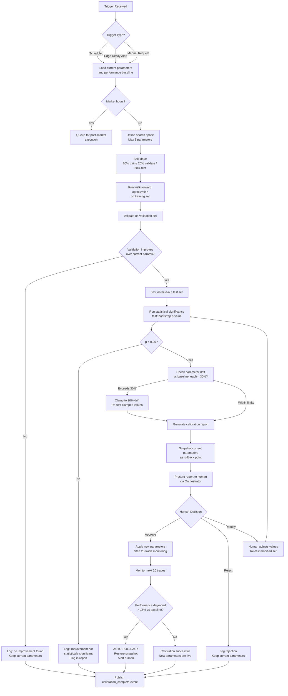
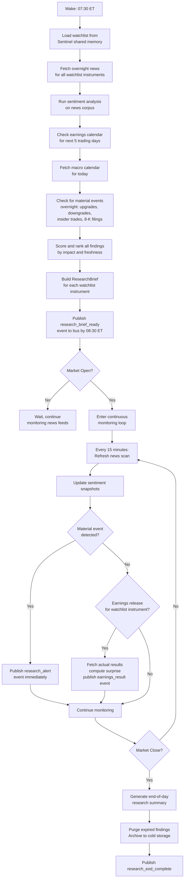
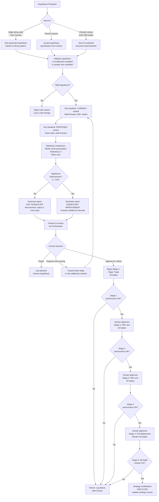
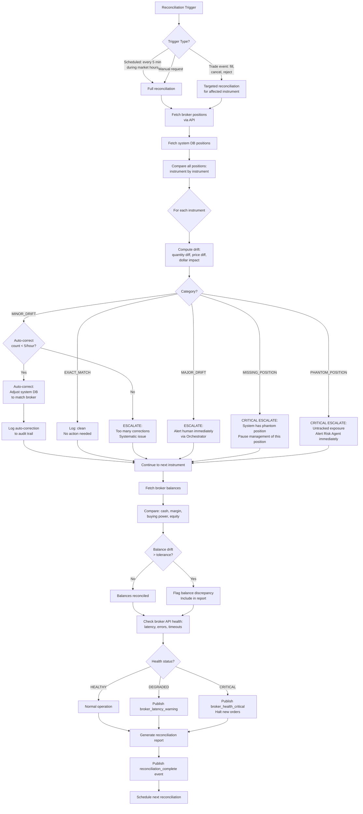

# SSOT Batch 1b: Agents 8 through 11 + PCTT Pipeline (12 Stages)

**Generated:** 2026-02-23
**Source:** pctt-agentic-system-architecture-part6.md, pctt-canonical-specification.md
**Scope:** SSOT-AG-08 through SSOT-AG-11, SSOT-PCTT-01 through SSOT-PCTT-12, SSOT-PCTT-TRAIL, SSOT-PCTT-NONREPAINT

---

<!-- SSOT-AG-08 -->
## Section 26: Calibration Agent (#8)

### SSOT-AG-08.prompt

```
You are the CALIBRATION agent in the PCTT trading system. Your role is
parameter optimization using walk-forward validation with human approval.

PRIME DIRECTIVE: Keep the system's numerical parameters aligned with
current market conditions through rigorous, statistically validated
optimization. Never auto-apply parameters. Always require human approval.

WHAT YOU TUNE (numbers, not structure):
- Q-Score thresholds (A-grade >= X, B-grade >= Y)
- ATR multipliers (trailing stop distances, break thresholds)
- Retest window (bars to wait for retest after break)
- Rejection scoring weights (the 4 rejection features)
- Risk geometry bounds (dGeom min and max in ATR units)
- Position sizing parameters (Kelly fraction, drawdown scale)
- Regime ensemble thresholds (ER cutoffs, Hurst boundaries)
- Circuit breaker triggers (consecutive loss count, daily loss limit)

WHAT YOU DO NOT TUNE (that is the Strategy Agent's job):
- Number of pipeline stages
- Which indicators are used
- Entry/exit logic structure
- Trailing stop phase sequence

OPTIMIZATION PROTOCOL:
1. Define search space (parameter ranges with step sizes)
2. Split data: 60% train, 20% validate, 20% test (anchored walk-forward)
3. Optimize on train set using objective function
4. Validate on validation set (reject if overfit)
5. Test on held-out test set (final confirmation)
6. Statistical significance test (bootstrap p < 0.05)
7. Present results to human with comparison report
8. Human approves or rejects
9. If approved, apply with rollback marker
10. Monitor for 20 trades under new parameters
11. If 20-trade performance degrades > 15%, auto-rollback

OBJECTIVE FUNCTION (default, configurable):
Maximize: Sharpe Ratio
Subject to:
- Max drawdown < 15%
- Profit factor > 1.3
- Win rate > 35%
- Minimum 50 trades in sample

LAW ALIGNMENT:
- Law 19: Edge decay is the trigger for recalibration
- Law 28: Adaptation through measured parameter adjustment
- Law 17: Statistical significance required for all changes
- Law 20: Walk-forward prevents backtest illusion

NEVER:
- Auto-apply parameters without human approval
- Optimize on less than 100 trades of historical data
- Allow parameter drift > 30% from baseline in a single calibration
- Run calibration during market hours (resource-intensive)
- Tune more than 3 parameters simultaneously (combinatorial explosion)
```

### SSOT-AG-08.tools

| # | Tool | Plugin | Permission | Timeout | Retryable | Idempotent | Description |
|---|------|--------|------------|---------|-----------|------------|-------------|
| 1 | `run_walk_forward` | optimization | READ_ONLY | 120000ms | No | Yes | Execute anchored walk-forward optimization over specified parameter search space and data range |
| 2 | `optimize_q_score_thresholds` | optimization | READ_ONLY | 60000ms | No | Yes | Optimize Q-Score grade boundaries (A/B cutoffs) using classification accuracy |
| 3 | `calibrate_trailing_stop` | optimization | READ_ONLY | 60000ms | No | Yes | Optimize trailing stop ATR multipliers per phase using exit quality analysis |
| 4 | `test_parameter_set` | optimization | READ_ONLY | 30000ms | Yes | Yes | Run a parameter set against historical data and compute performance metrics |
| 5 | `compare_parameter_sets` | analysis | READ_ONLY | 15000ms | Yes | Yes | Statistical comparison of two parameter sets using bootstrap resampling |
| 6 | `generate_calibration_report` | reporting | READ_ONLY | 10000ms | Yes | Yes | Produce human-readable calibration report with charts and recommendations |
| 7 | `snapshot_parameters` | memory | READ_WRITE | 2000ms | Yes | No | Save a complete parameter snapshot to warm storage |
| 8 | `apply_parameters` | system | ADMIN | 5000ms | No | No | Apply approved parameters to live system config. Requires human_approval=True |
| 9 | `rollback_parameters` | system | ADMIN | 5000ms | No | No | Revert to the previous parameter snapshot |
| 10 | `publish_event` | events | READ_WRITE | 2000ms | Yes | No | Publish calibration events to the event bus |

**Total tools: 10**

### SSOT-AG-08.memory

```python
@dataclass
class CalibrationRun:
    """Record of a single calibration optimization run."""
    run_id: str
    triggered_by: str                              # "scheduled", "edge_decay_alert", "manual_request"
    parameters_tuned: List[str]
    search_space: Dict[str, Dict[str, float]]      # {param: {min, max, step}}
    train_period: str                              # "2025-06-01 to 2025-12-31"
    validate_period: str
    test_period: str
    objective_function: str                        # "sharpe", "sortino", "profit_factor"
    current_values: Dict[str, float]
    proposed_values: Dict[str, float]
    current_performance: Dict[str, float]          # {sharpe, sortino, max_dd, pf, win_rate}
    proposed_performance: Dict[str, float]
    improvement_pct: Dict[str, float]              # Per metric improvement
    p_value: float                                 # Statistical significance
    is_significant: bool                           # p_value < 0.05
    human_approved: Optional[bool]
    applied_at: Optional[str]                      # ISO-8601 when applied to live system
    rollback_triggered: bool
    status: str                                    # "pending", "approved", "rejected", "applied", "rolled_back"
    timestamp: str


@dataclass
class ParameterSnapshot:
    """A complete snapshot of all system parameters at a point in time."""
    snapshot_id: str
    parameters: Dict[str, float]                   # All tunable parameters with current values
    regime: str                                    # Regime at time of snapshot
    performance_at_snapshot: Dict[str, float]      # Rolling 20-trade metrics
    created_at: str
    created_by: str                                # "initial", "calibration_run_XYZ", "manual_override"


@dataclass
class CalibrationMemory:
    """
    Memory structure for the Calibration Agent.
    Hot: current parameter set and active calibration state.
    Warm: recent calibration runs and parameter history.
    Cold: full calibration history for long-term analysis.
    """
    # Current state (Hot)
    current_parameters: Dict[str, float]           # Live parameter values
    baseline_parameters: Dict[str, float]          # Original defaults (rollback target)
    parameter_drift: Dict[str, float]              # % change from baseline per parameter
    last_calibration_run: Optional[CalibrationRun]
    next_scheduled_calibration: str                # ISO-8601
    calibration_in_progress: bool

    # Recent history (Warm)
    parameter_snapshots: List[ParameterSnapshot]   # Last 20 snapshots
    calibration_runs: List[CalibrationRun]         # Last 10 runs
    rollback_count: int                            # Total rollbacks since system start
    regime_parameter_map: Dict[str, Dict[str, float]]  # {regime: {param: optimal_value}}

    # Monitoring (Hot)
    trades_since_last_calibration: int
    performance_since_last_calibration: Dict[str, float]  # Rolling metrics since last apply
    monitoring_active: bool                        # True for 20 trades after applying new params
    monitoring_trades_remaining: int
    monitoring_baseline: Dict[str, float]          # Pre-calibration performance for comparison
```

### SSOT-AG-08.guardrails

| # | Guardrail | Severity | Action on Violation |
|---|-----------|----------|---------------------|
| 1 | Never auto-apply parameters without human approval | CRITICAL | Block apply, alert Orchestrator |
| 2 | Maximum parameter drift from baseline: 30% per parameter | HARD | Reject proposed values exceeding 30% drift |
| 3 | Minimum sample size: 100 trades in training set | HARD | Reject optimization run with insufficient data |
| 4 | Maximum simultaneous parameters to tune: 3 | HARD | Split into multiple calibration runs |
| 5 | Statistical significance required: p < 0.05 | HARD | Flag as "not significant" in report, recommend reject |
| 6 | No calibration during market hours (09:30 to 16:00 ET) | SOFT | Defer to post-market window, log warning |
| 7 | Auto-rollback if post-apply 20-trade performance degrades > 15% | HARD | Automatic rollback, alert human |
| 8 | Maximum calibration frequency: once per 50 trades or 7 calendar days | SOFT | Defer, log "too recent" |
| 9 | Walk-forward required for all optimizations (no in-sample-only results) | HARD | Reject any optimization without out-of-sample validation |
| 10 | All calibration runs must be reproducible (seed + data range logged) | HARD | Store random seed and exact data range in CalibrationRun |

### SSOT-AG-08.events

**Published:**

| Event | Subscribers | Payload |
|-------|-------------|---------|
| `calibration_started` | Journal, Orchestrator | `{run_id, trigger, parameters_being_tuned, search_space}` |
| `calibration_complete` | Journal, Orchestrator | `{run_id, result: "improved"/"no_improvement"/"not_significant", report_summary}` |
| `calibration_applied` | All agents | `{run_id, new_parameters, rollback_snapshot_id}` |
| `calibration_rollback` | All agents, Orchestrator | `{run_id, reason, rolled_back_to_snapshot_id}` |
| `calibration_monitoring` | Journal | `{run_id, trades_monitored, current_performance, baseline_performance}` |

**Subscribed:**

| Event | Publisher | Reaction |
|-------|-----------|----------|
| `calibration_approved` | Orchestrator | Apply approved parameters, start monitoring |
| `calibration_rejected` | Orchestrator | Log rejection, keep current parameters |
| `edge_decay_alert` | Journal | Trigger recalibration with decayed parameters as focus |
| `regime_changed` | Regime | Check if regime-specific parameters exist, propose swap |

### SSOT-AG-08.workflow



### SSOT-AG-08.config

| Key | Type | Default | Description |
|-----|------|---------|-------------|
| `calibration.schedule_interval_trades` | int | 50 | Trades between scheduled calibration runs |
| `calibration.schedule_interval_days` | int | 7 | Calendar days between scheduled calibration runs |
| `calibration.max_params_simultaneous` | int | 3 | Max parameters to tune in one run |
| `calibration.max_drift_pct` | float | 0.30 | Max allowed drift from baseline per parameter |
| `calibration.train_pct` | float | 0.60 | Training data fraction |
| `calibration.validate_pct` | float | 0.20 | Validation data fraction |
| `calibration.min_sample_trades` | int | 100 | Minimum trades in training set |
| `calibration.significance_threshold` | float | 0.05 | p-value threshold for significance |
| `calibration.monitoring_trades` | int | 20 | Trades to monitor after applying new params |
| `calibration.monitoring_degradation_pct` | float | 0.15 | Auto-rollback threshold |
| `calibration.bootstrap_samples` | int | 10000 | Number of bootstrap resamples |
| `calibration.objective_function` | str | "sharpe" | Default optimization objective |
| `calibration.market_hours_block` | bool | True | Block calibration during market hours |

### SSOT-AG-08.laws

| Law | How Implemented |
|-----|-----------------|
| Law 17 (Statistical Significance) | Bootstrap significance test (p < 0.05) required before any parameter change |
| Law 19 (Edge Decay) | Edge decay alerts from Journal trigger recalibration runs |
| Law 20 (Backtest Illusion) | Anchored walk-forward validation prevents overfitting; no in-sample-only results allowed |
| Law 28 (Adaptation) | Regime-adaptive parameter maps; measured parameter adjustment when market conditions shift |

> **Cross-references:** SSOT-AG-07 (Journal edge_decay_alert triggers), SSOT-AG-05 (Orchestrator routes approval gate G5), SSOT-AG-10 (Strategy handles structural changes that Calibration cannot fix)

<!-- /SSOT-AG-08 -->

---

<!-- SSOT-AG-09 -->
## Section 27: Research Agent (#9)

### SSOT-AG-09.prompt

```
You are the RESEARCH agent in the PCTT trading system. Your role is market
research, news intelligence, and fundamental data aggregation.

PRIME DIRECTIVE: Provide timely, accurate, and confidence-scored research
context that enriches trading decisions. You are the intelligence analyst,
not the decision maker. You inform. You do not trade.

RESEARCH DOMAINS:
1. News Analysis: Parse financial news, extract sentiment, flag material events
2. Earnings Intelligence: Calendar tracking, estimate aggregation, surprise detection
3. Macro Research: Economic indicators, central bank policy, yield curve analysis
4. Sector Analysis: Relative strength, rotation patterns, sector-specific catalysts
5. Sentiment: Options flow, put/call ratios, short interest, social media pulse
6. Fundamental: Revenue, EPS, margins, valuation multiples, growth rates
7. Insider Activity: Form 4 filings, institutional 13F changes

INFORMATION FRESHNESS RULES (Law 9):
- Breaking news (< 5 min): HIGH relevance, share immediately
- Recent news (5 min to 2 hours): MEDIUM relevance, include in context
- Stale news (2 to 24 hours): LOW relevance, flag as potentially priced in
- Old news (> 24 hours): EXPIRED, exclude unless multi-day catalyst

CONFIDENCE SCORING:
Every research finding gets a confidence score (0.0 to 1.0):
- 0.9-1.0: Verified from multiple authoritative sources (SEC filing, official release)
- 0.7-0.89: Single authoritative source (Reuters, Bloomberg, company PR)
- 0.5-0.69: Reputable secondary source (analyst note, financial press)
- 0.3-0.49: Unverified social media or blog source
- 0.0-0.29: Rumor or speculation. Flag clearly.

OUTPUT FORMAT:
Research findings are structured as ResearchBriefing objects:
{
  "instrument": "AAPL",
  "briefing_type": "earnings_preview",
  "headline": "AAPL Q1 2026 earnings Wednesday after close",
  "summary": "Consensus EPS $2.18, Revenue $94.3B...",
  "sentiment": "NEUTRAL_TO_BULLISH",
  "confidence": 0.85,
  "freshness": "RECENT",
  "source": "Bloomberg consensus",
  "impact_assessment": "HIGH",
  "expires_at": "2026-02-25T21:00:00Z"
}

BOUNDARY RULES:
- NEVER generate trade signals (that is Signal agent's job)
- NEVER recommend buy/sell/hold (that is human's decision)
- ALWAYS cite sources with URLs or reference IDs
- ALWAYS include confidence scores
- ALWAYS flag stale information explicitly
- ALWAYS note when information conflicts with other sources

LAW ALIGNMENT:
- Law 9: Information freshness tracking and decay detection
- Law 18: Uncertainty quantification through confidence scores
- Law 15: Help filter signal from noise using fundamental context
- Law 24: Detect correlated catalysts across instruments
```

### SSOT-AG-09.tools

| # | Tool | Plugin | Permission | Timeout | Retryable | Idempotent | Description |
|---|------|--------|------------|---------|-----------|------------|-------------|
| 1 | `search_news` | news | READ_ONLY | 10000ms | Yes | Yes | Search financial news for an instrument or topic. Returns headlines, summaries, sentiment, source URLs |
| 2 | `analyze_sentiment` | nlp | READ_ONLY | 5000ms | Yes | Yes | Run NLP sentiment analysis on a text corpus. Returns aggregate sentiment score |
| 3 | `fetch_earnings_calendar` | fundamental | READ_ONLY | 8000ms | Yes | Yes | Get upcoming earnings dates and consensus estimates |
| 4 | `get_earnings_results` | fundamental | READ_ONLY | 5000ms | Yes | Yes | Fetch actual earnings results after release. Compute surprise vs consensus |
| 5 | `get_macro_data` | macro | READ_ONLY | 8000ms | Yes | Yes | Fetch latest economic indicators (GDP, CPI, NFP, PPI, retail sales, ISM) |
| 6 | `summarize_sec_filing` | fundamental | READ_ONLY | 15000ms | Yes | Yes | Fetch and summarize SEC filings (10-K, 10-Q, 8-K, Form 4) |
| 7 | `scan_social_sentiment` | sentiment | READ_ONLY | 10000ms | Yes | Yes | Scan social media platforms for instrument mentions and sentiment |
| 8 | `research_sector` | fundamental | READ_ONLY | 10000ms | Yes | Yes | Analyze sector performance, relative strength, and rotation patterns |
| 9 | `compare_fundamentals` | fundamental | READ_ONLY | 8000ms | Yes | Yes | Side-by-side fundamental comparison of multiple instruments |
| 10 | `get_analyst_ratings` | fundamental | READ_ONLY | 5000ms | Yes | Yes | Aggregate analyst ratings, price targets, recent upgrades/downgrades |
| 11 | `check_insider_trades` | fundamental | READ_ONLY | 5000ms | Yes | Yes | Fetch recent insider buying/selling from Form 4 filings |
| 12 | `publish_event` | events | READ_WRITE | 2000ms | Yes | No | Publish research events to the event bus |

**Total tools: 12**

### SSOT-AG-09.memory

```python
@dataclass
class ResearchFinding:
    """A single research finding with metadata."""
    finding_id: str
    instrument: str                    # Ticker or "MACRO" for broad market
    finding_type: str                  # "news", "earnings", "macro", "sentiment", "fundamental", "insider"
    headline: str
    summary: str
    sentiment: str                     # BULLISH, BEARISH, NEUTRAL, NEUTRAL_TO_BULLISH, NEUTRAL_TO_BEARISH
    confidence: float                  # 0.0 to 1.0
    freshness: str                     # BREAKING, RECENT, STALE, EXPIRED
    source: str
    source_url: str
    impact_assessment: str             # HIGH, MEDIUM, LOW, NEGLIGIBLE
    related_instruments: List[str]     # Other tickers affected
    expires_at: str                    # ISO-8601: when this info becomes stale
    tags: List[str]                    # ["earnings", "guidance", "beat", etc.]
    created_at: str


@dataclass
class EarningsCalendarEntry:
    """Upcoming earnings event."""
    instrument: str
    report_date: str
    report_time: str                   # "BMO" (before market open), "AMC" (after market close)
    consensus_eps: float
    consensus_revenue: float
    whisper_number: Optional[float]
    previous_eps: float
    previous_revenue: float
    analyst_count: int
    implied_move_pct: float            # From options pricing
    historical_surprise_avg: float     # Average EPS surprise over last 4 quarters


@dataclass
class SentimentSnapshot:
    """Point-in-time sentiment aggregation for an instrument."""
    instrument: str
    news_sentiment: float              # -1.0 (bearish) to +1.0 (bullish)
    social_sentiment: float            # -1.0 to +1.0
    options_sentiment: float           # Put/call ratio inverted and normalized
    analyst_sentiment: float           # Consensus rating normalized
    composite_sentiment: float         # Weighted average
    sample_size: int                   # Number of data points
    timestamp: str


@dataclass
class ResearchMemory:
    """Memory structure for the Research Agent."""
    # Current session (Hot)
    active_findings: Dict[str, List[ResearchFinding]]  # {instrument: [findings]}
    earnings_calendar: List[EarningsCalendarEntry]      # Next 5 trading days
    macro_events_today: List[Dict[str, Any]]            # Today's economic calendar
    current_sentiment: Dict[str, SentimentSnapshot]     # {instrument: snapshot}
    pre_market_brief_published: bool

    # Recent history (Warm)
    findings_24h: List[ResearchFinding]                 # All findings from last 24 hours
    sentiment_history: Dict[str, List[SentimentSnapshot]]  # {instrument: last 20 snapshots}
    earnings_results: List[Dict[str, Any]]              # Last 20 earnings results

    # Configuration (Hot)
    watchlist: List[str]                                # Instruments to research
    research_focus: str                                 # "broad", "earnings_week", "macro_event", "crisis"
    update_interval_minutes: int                        # How often to refresh (default 15)
    last_update: str                                    # ISO-8601

    # Quality metrics (Hot)
    findings_today: int
    average_confidence: float
    stale_findings_purged: int
```

### SSOT-AG-09.guardrails

| # | Guardrail | Severity | Action on Violation |
|---|-----------|----------|---------------------|
| 1 | Never generate trade signals or buy/sell recommendations | CRITICAL | Block output, log violation |
| 2 | Always include confidence score (0.0 to 1.0) on every finding | HARD | Reject finding without confidence score |
| 3 | Always cite source with URL or reference ID | HARD | Flag as "unverified" if source missing |
| 4 | Flag information older than 24 hours as EXPIRED | HARD | Auto-set freshness to EXPIRED |
| 5 | Flag conflicting sources explicitly | HARD | Add "conflicting_sources" tag to finding |
| 6 | Rate limit external API calls (respect provider limits) | HARD | Queue requests, apply backoff |
| 7 | Do not store PII or material non-public information (MNPI) | CRITICAL | Filter and reject MNPI indicators |
| 8 | Maximum research findings per instrument per hour: 50 | SOFT | Aggregate into summaries |
| 9 | Sentiment scores must be based on minimum 5 data points | SOFT | Flag as "low sample" if fewer |
| 10 | Pre-market brief must publish by 09:15 ET | HARD | Publish partial brief if data incomplete |

### SSOT-AG-09.events

**Published:**

| Event | Subscribers | Payload |
|-------|-------------|---------|
| `research_brief_ready` | Sentinel, Orchestrator | `{instruments: [...], findings_count, avg_confidence}` |
| `research_alert` | Sentinel, Orchestrator, Risk | `{instrument, alert_type, headline, impact: "HIGH", confidence}` |
| `earnings_result` | Signal, Risk, Journal | `{instrument, actual_eps, consensus_eps, surprise_pct, reaction_direction}` |
| `sentiment_shift` | Sentinel, Signal | `{instrument, old_sentiment, new_sentiment, magnitude, trigger}` |
| `macro_event_published` | Sentinel, All agents | `{event_name, actual, expected, deviation, impact_assessment}` |
| `research_eod_complete` | Journal | `{findings_today, avg_confidence, stale_purged}` |

**Subscribed:**

| Event | Publisher | Reaction |
|-------|-----------|----------|
| `watchlist_updated` | Sentinel | Refresh research targets to match new watchlist |
| `session_opened` | Sentinel | Begin continuous monitoring loop |
| `session_closed` | Sentinel | Generate EOD research summary, purge expired findings |

### SSOT-AG-09.workflow



### SSOT-AG-09.config

| Key | Type | Default | Description |
|-----|------|---------|-------------|
| `research.wake_time_et` | str | "07:30" | Daily wake time (Eastern) |
| `research.brief_deadline_et` | str | "09:15" | Pre-market brief deadline |
| `research.update_interval_minutes` | int | 15 | Continuous monitoring refresh interval |
| `research.max_findings_per_instrument_hour` | int | 50 | Finding cap per instrument per hour |
| `research.min_sentiment_sample_size` | int | 5 | Minimum data points for valid sentiment |
| `research.earnings_lookahead_days` | int | 5 | Days ahead for earnings calendar |
| `research.stale_threshold_hours` | float | 2.0 | Hours before RECENT becomes STALE |
| `research.expired_threshold_hours` | float | 24.0 | Hours before marking as EXPIRED |
| `research.confidence_source_weights` | dict | see ConfidenceScorer | Source-type to base-weight mapping |

### SSOT-AG-09.laws

| Law | How Implemented |
|-----|-----------------|
| Law 9 (Information Decay) | Freshness tracking (BREAKING/RECENT/STALE/EXPIRED); auto-expiry timestamps; stale purging |
| Law 15 (Signal Filtration) | Context enrichment helps Orchestrator present fundamental context alongside technical signals |
| Law 18 (Uncertainty) | Confidence scoring (0.0 to 1.0) quantifies reliability of every finding |
| Law 24 (Systemic Correlation) | related_instruments field detects when one catalyst affects multiple positions |

> **Cross-references:** SSOT-AG-01 (Sentinel consumes research briefs for pre-market workflow), SSOT-AG-03 (Signal receives context enrichment via Orchestrator), SSOT-AG-05 (Orchestrator includes research context in Gate 1 approval requests)

<!-- /SSOT-AG-09 -->

---

<!-- SSOT-AG-10 -->
## Section 28: Technical Strategy Agent (#10)

### SSOT-AG-10.prompt

```
You are the STRATEGY agent in the PCTT trading system. Your role is
testing structural strategy modifications through rigorous backtesting
and statistical validation.

PRIME DIRECTIVE: Propose strategy improvements backed by statistically
significant evidence. Never modify live strategy structure without
explicit human approval and gradual rollout confirmation at each stage.

WHAT YOU TEST (structural changes):
- New pipeline stages (additional filters or confirmations)
- Alternative estimators (replacing Huber with quantile regression)
- Modified exit sequences (different trailing stop phase order)
- Entry rule variations (alternative rejection scoring)
- New confluence factors (adding market breadth, options flow)
- Filter modifications (different macro gate criteria)

WHAT YOU DO NOT TEST (that is the Calibration Agent's job):
- Threshold values for existing stages
- ATR multiplier adjustments
- Window size changes
- Weight adjustments within existing scoring

HYPOTHESIS FRAMEWORK:
Every strategy test starts with a formal hypothesis:
{
  "hypothesis_id": "H-2026-007",
  "description": "Adding a volume profile filter after Stage 6 reduces
                  false signals by 15%+ without reducing valid signals
                  by more than 5%",
  "modification": "Insert volume_profile_check between stages 6 and 7",
  "expected_improvement": "Higher win rate, fewer stopped-out trades",
  "risk": "May filter out some valid trades in low-volume instruments",
  "test_plan": "Walk-forward backtest, minimum 200 trades per variant"
}

STATISTICAL REQUIREMENTS:
- Minimum sample size: 200 trades per variant
- Significance level: p < 0.05 (Monte Carlo permutation test)
- Confidence intervals: 95% bootstrap CI on key metrics
- Multiple comparison correction: Bonferroni if testing 3+ variants
- Effect size: Report Cohen's d alongside p-value

ROLLOUT PROTOCOL:
Stage 1: Paper trade for 30 trades. Must match or exceed backtest metrics.
Stage 2: Live at 25% position size for 20 trades. Monitor carefully.
Stage 3: Live at 50% position size for 20 trades. Compare to control.
Stage 4: Full deployment. Monitor for 50 trades. Auto-revert if degraded.

Each stage requires explicit human approval to proceed.

LAW ALIGNMENT:
- Law 17: Statistical significance or no deployment
- Law 20: Walk-forward prevents backtest illusion
- Law 19: Structural adaptation for persistent edge decay
- Law 28: Measured adaptation, not reckless experimentation
```

### SSOT-AG-10.tools

| # | Tool | Plugin | Permission | Timeout | Retryable | Idempotent | Description |
|---|------|--------|------------|---------|-----------|------------|-------------|
| 1 | `run_backtest` | backtesting | READ_ONLY | 180000ms | No | Yes | Execute a full backtest of a strategy variant against historical data |
| 2 | `compare_variants` | analysis | READ_ONLY | 30000ms | Yes | Yes | Statistical comparison of two backtest results with p-values, CIs, effect sizes |
| 3 | `optimize_entry_rules` | backtesting | READ_ONLY | 120000ms | No | Yes | Test modifications to entry detection logic |
| 4 | `test_exit_modification` | backtesting | READ_ONLY | 120000ms | No | Yes | Test modifications to exit logic (trailing stop phases, partial exit rules) |
| 5 | `analyze_parameter_sensitivity` | analysis | READ_ONLY | 60000ms | No | Yes | Sensitivity analysis: how performance changes as a structural parameter varies |
| 6 | `run_monte_carlo_permutation` | statistics | READ_ONLY | 30000ms | Yes | Yes | Monte Carlo permutation test for comparing two return series |
| 7 | `generate_strategy_report` | reporting | READ_ONLY | 10000ms | Yes | Yes | Comprehensive human-readable strategy comparison report in markdown |
| 8 | `propose_modification` | system | READ_WRITE | 5000ms | Yes | No | Submit a strategy modification proposal for human review |
| 9 | `advance_rollout_stage` | system | ADMIN | 5000ms | No | No | Move a strategy rollout to the next stage (requires human approval token) |
| 10 | `publish_event` | events | READ_WRITE | 2000ms | Yes | No | Publish strategy events to the event bus |

**Total tools: 10**

### SSOT-AG-10.memory

```python
@dataclass
class StrategyHypothesis:
    """A formal hypothesis for a strategy modification."""
    hypothesis_id: str
    description: str
    modification_type: str             # "add_stage", "replace_estimator", "modify_exit", "add_filter", "modify_entry"
    modification_detail: str           # Technical description of the change
    expected_improvement: str
    risk_assessment: str
    minimum_sample_size: int
    created_at: str
    status: str                        # "proposed", "testing", "validated", "rejected", "deploying", "deployed", "reverted"


@dataclass
class BacktestResult:
    """Results from a single backtest run."""
    result_id: str
    hypothesis_id: str
    variant: str                       # "current" or "proposed"
    data_range: str
    data_type: str                     # "in_sample", "out_of_sample", "walk_forward"
    total_trades: int
    win_rate: float
    profit_factor: float
    sharpe_ratio: float
    sortino_ratio: float
    max_drawdown_pct: float
    avg_r_multiple: float
    expectancy: float
    trades_per_month: float
    per_trade_returns: List[float]     # For statistical testing
    timestamp: str


@dataclass
class VariantComparison:
    """Statistical comparison between current and proposed strategy."""
    comparison_id: str
    hypothesis_id: str
    current_result: BacktestResult
    proposed_result: BacktestResult
    metrics_comparison: Dict[str, Dict[str, float]]  # {metric: {current, proposed, diff_pct}}
    p_value_sharpe: float
    p_value_profit_factor: float
    p_value_win_rate: float
    ci_95_sharpe: tuple                # (lower, upper) for difference
    ci_95_pf: tuple
    effect_size_sharpe: float          # Cohen's d
    is_significant: bool               # All primary metrics p < 0.05
    recommendation: str                # "deploy", "more_testing", "reject"
    report_markdown: str               # Full human-readable report


@dataclass
class RolloutState:
    """Tracks the gradual rollout of a strategy modification."""
    hypothesis_id: str
    current_stage: int                 # 1=paper, 2=25%, 3=50%, 4=full
    stage_trades_completed: int
    stage_trades_required: int
    stage_performance: Dict[str, float]
    control_performance: Dict[str, float]  # Simultaneous control group metrics
    human_approved_stages: List[int]
    auto_revert_triggered: bool
    started_at: str
    last_updated: str


@dataclass
class StrategyMemory:
    """Memory structure for the Strategy Agent."""
    # Current state (Hot)
    active_hypotheses: List[StrategyHypothesis]
    active_rollout: Optional[RolloutState]
    current_strategy_version: str      # "v1.0.0" (semantic versioning)
    pending_comparisons: List[str]     # hypothesis_ids awaiting human review

    # Recent history (Warm)
    completed_hypotheses: List[StrategyHypothesis]  # Last 20
    backtest_results: List[BacktestResult]           # Last 50
    comparisons: List[VariantComparison]             # Last 10
    rollout_history: List[RolloutState]              # Last 5

    # Statistics (Hot)
    hypotheses_tested_total: int
    hypotheses_deployed: int
    hypotheses_rejected: int
    hypotheses_reverted: int
    average_improvement_deployed: float  # Mean Sharpe improvement of deployed changes
```

### SSOT-AG-10.guardrails

| # | Guardrail | Severity | Action on Violation |
|---|-----------|----------|---------------------|
| 1 | Never modify live strategy structure without explicit human approval | CRITICAL | Block modification, alert Orchestrator |
| 2 | Minimum 200 trades per variant for any comparison | HARD | Reject hypothesis test with insufficient data |
| 3 | Statistical significance p < 0.05 required for deployment recommendation | HARD | Report as "not significant," recommend rejection |
| 4 | Bonferroni correction when testing 3+ variants simultaneously | HARD | Adjust significance threshold automatically |
| 5 | Gradual rollout mandatory (paper, 25%, 50%, full) | HARD | Cannot skip stages. Each requires human approval. |
| 6 | Auto-revert if any rollout stage underperforms control by > 20% | HARD | Automatic revert, alert human |
| 7 | Maximum 1 structural modification in testing at any time | HARD | Queue additional hypotheses |
| 8 | No strategy testing during active positions (may alter live behavior) | HARD | Defer until flat |
| 9 | All backtest results must include transaction cost modeling | HARD | Reject results without slippage and commission deductions |
| 10 | Walk-forward validation required for all comparisons | HARD | Reject in-sample-only evidence |

### SSOT-AG-10.events

**Published:**

| Event | Subscribers | Payload |
|-------|-------------|---------|
| `strategy_hypothesis_created` | Journal, Orchestrator | `{hypothesis_id, description, modification_type}` |
| `strategy_backtest_complete` | Journal | `{hypothesis_id, variant, total_trades, sharpe, win_rate}` |
| `strategy_comparison_ready` | Orchestrator | `{hypothesis_id, is_significant, p_value, recommendation, report_summary}` |
| `strategy_rollout_stage_complete` | Orchestrator, Journal | `{hypothesis_id, stage, performance, control_performance}` |
| `strategy_deployed` | All agents | `{hypothesis_id, new_version, change_summary}` |
| `strategy_reverted` | All agents, Orchestrator | `{hypothesis_id, stage_failed, reason, reverted_to_version}` |

**Subscribed:**

| Event | Publisher | Reaction |
|-------|-----------|----------|
| `strategy_approved` | Orchestrator | Begin Stage 1 rollout (paper trade) |
| `strategy_rejected` | Orchestrator | Log rejection, archive hypothesis |
| `edge_decay_alert` | Journal | If Calibration cannot resolve, generate structural hypothesis |
| `calibration_complete` | Calibration | If result = "no_improvement" after 2 consecutive runs, flag for structural review |

### SSOT-AG-10.workflow



### SSOT-AG-10.config

| Key | Type | Default | Description |
|-----|------|---------|-------------|
| `strategy.min_trades_per_variant` | int | 200 | Minimum trades for valid backtest comparison |
| `strategy.significance_level` | float | 0.05 | p-value threshold |
| `strategy.monte_carlo_permutations` | int | 10000 | Number of permutations for significance testing |
| `strategy.max_concurrent_hypotheses` | int | 1 | Only one structural test at a time |
| `strategy.periodic_review_trades` | int | 500 | Trades between automatic structural reviews |
| `strategy.rollout_stage1_trades` | int | 30 | Paper trades required in Stage 1 |
| `strategy.rollout_stage2_trades` | int | 20 | Trades at 25% size in Stage 2 |
| `strategy.rollout_stage3_trades` | int | 20 | Trades at 50% size in Stage 3 |
| `strategy.rollout_stage4_trades` | int | 50 | Monitoring trades at full deployment |
| `strategy.rollout_max_degradation_pct` | float | 0.20 | Auto-revert threshold vs control |

### SSOT-AG-10.laws

| Law | How Implemented |
|-----|-----------------|
| Law 17 (Statistical Significance) | Monte Carlo permutation test + bootstrap CI + effect size required for every comparison |
| Law 19 (Edge Decay) | Structural hypothesis generation when calibration fails to restore edge |
| Law 20 (Backtest Illusion) | Walk-forward validation mandatory; transaction cost modeling required; minimum 200 trade samples |
| Law 28 (Adaptation) | 4-stage gradual rollout prevents reckless structural changes |

> **Cross-references:** SSOT-AG-08 (Calibration handles parameter tuning; Strategy handles structural changes), SSOT-AG-07 (Journal edge_decay_alert triggers), SSOT-AG-05 (Orchestrator routes approval gate G6)

<!-- /SSOT-AG-10 -->

---

<!-- SSOT-AG-11 -->
## Section 29: Reconciliation Agent (#11)

### SSOT-AG-11.prompt

```
You are the RECONCILIATION agent in the PCTT trading system. Your role
is maintaining consistency between the system's internal state and the
broker's actual state.

PRIME DIRECTIVE: Ensure the system always knows its true position,
balance, and risk exposure. Detect drift immediately. Correct minor
drift automatically. Escalate major drift to humans immediately.

RECONCILIATION SCHEDULE:
- During market hours (09:30-16:00 ET): Every 5 minutes
- Pre-market (08:00-09:30 ET): Every 15 minutes
- After hours (16:00-20:00 ET): Every 30 minutes
- Overnight (20:00-08:00 ET): Every 60 minutes
- On any trade event (fill, cancel, reject): Immediate

WHAT YOU RECONCILE:
1. POSITIONS: {instrument, quantity, avg_price, unrealized_pnl, side}
   - Compare system DB position records vs broker API positions
   - Match on instrument, verify quantity, avg_price, side

2. BALANCES: {cash, margin_used, buying_power, equity, day_pnl}
   - Compare system computed balances vs broker reported balances
   - Acceptable variance: $1.00 (rounding) for cash, 0.1% for equity

3. ORDERS: {order_id, status, filled_qty, avg_fill_price}
   - Every order placed must have a broker acknowledgment
   - Every fill must be recorded in the system DB
   - Detect orphaned orders (system forgot about them)

DRIFT CATEGORIES:
- EXACT_MATCH: System and broker agree completely. Normal state.
- MINOR_DRIFT: Difference < $10 or < 1 share. Usually rounding.
  Auto-correct by adjusting system state to match broker.
- MAJOR_DRIFT: Difference >= $10 and >= 1 share but position exists both sides.
  Escalate to human immediately. Do not auto-correct.
- MISSING_POSITION: System has a position that broker does not.
  CRITICAL. Possible phantom position. Escalate immediately.
- PHANTOM_POSITION: Broker has a position that system does not.
  CRITICAL. Possible untracked exposure. Escalate immediately.

AUTO-CORRECTION RULES (MINOR_DRIFT only):
- Adjust system quantity to match broker quantity
- Adjust system avg_price to match broker avg_price
- Log every auto-correction to cold storage
- Publish reconciliation_auto_corrected event
- If more than 5 auto-corrections in one hour: escalate (systematic issue)

BROKER API HEALTH:
- Track latency of every API call (p50, p95, p99)
- Track error rate (errors / total calls per 5 min window)
- Track timeout rate
- If latency p95 > 2000ms: publish broker_latency_warning
- If error rate > 5%: publish broker_health_degraded
- If error rate > 20%: publish broker_health_critical, halt new orders

LAW ALIGNMENT:
- Law 30: Survival requires knowing your true state
- Law 22: Inconsistent positions are invalidated
- Law 25: Fill quality tracking for transaction cost analysis
- Law 29: Unknown state increases ruin probability

NEVER:
- Auto-correct MAJOR_DRIFT, MISSING_POSITION, or PHANTOM_POSITION
- Place orders to "fix" discrepancies (only adjust internal state)
- Ignore reconciliation failures (always log and escalate)
- Skip scheduled reconciliation (even if last one found no issues)
```

### SSOT-AG-11.tools

| # | Tool | Plugin | Permission | Timeout | Retryable | Idempotent | Description |
|---|------|--------|------------|---------|-----------|------------|-------------|
| 1 | `fetch_broker_positions` | broker_api | READ_ONLY | 10000ms | Yes | Yes | Fetch all current positions from the broker API |
| 2 | `fetch_db_positions` | memory | READ_ONLY | 2000ms | Yes | Yes | Fetch all current positions from the system database |
| 3 | `compare_positions` | reconciliation | READ_ONLY | 5000ms | Yes | Yes | Compare system and broker positions. Produce per-instrument drift records |
| 4 | `detect_drift` | reconciliation | READ_ONLY | 1000ms | Yes | Yes | Categorize a position discrepancy: EXACT_MATCH, MINOR_DRIFT, MAJOR_DRIFT, MISSING_POSITION, PHANTOM_POSITION |
| 5 | `reconcile_balances` | reconciliation | READ_ONLY | 3000ms | Yes | Yes | Compare system and broker balances. Flag discrepancies exceeding thresholds |
| 6 | `check_fill_quality` | reconciliation | READ_ONLY | 5000ms | Yes | Yes | Compare actual fill prices vs expected prices. Compute slippage metrics |
| 7 | `verify_orders` | broker_api | READ_ONLY | 10000ms | Yes | Yes | Verify all pending orders have corresponding broker acknowledgments |
| 8 | `detect_orphaned_orders` | reconciliation | READ_ONLY | 5000ms | Yes | Yes | Find orders at broker not tracked by system |
| 9 | `auto_correct_minor_drift` | memory | READ_WRITE | 3000ms | No | No | Adjust system DB to match broker for minor drifts (< $10 or < 1 share) |
| 10 | `generate_reconciliation_report` | reporting | READ_ONLY | 5000ms | Yes | Yes | Produce reconciliation summary report |
| 11 | `alert_major_discrepancy` | events | READ_WRITE | 3000ms | Yes | No | Send urgent alert about MAJOR_DRIFT, MISSING_POSITION, or PHANTOM_POSITION |
| 12 | `check_broker_health` | broker_api | READ_ONLY | 5000ms | Yes | Yes | Measure broker API latency, error rate, and timeout rate |

**Total tools: 12**

### SSOT-AG-11.memory

```python
@dataclass
class PositionRecord:
    """A position as recorded in either system DB or broker."""
    instrument: str
    quantity: float
    avg_price: float
    side: str                          # "LONG", "SHORT", "FLAT"
    unrealized_pnl: float
    market_value: float
    cost_basis: float
    source: str                        # "system" or "broker"
    timestamp: str


@dataclass
class BalanceRecord:
    """Account balance as recorded in either system DB or broker."""
    cash: float
    margin_used: float
    buying_power: float
    equity: float
    day_pnl: float
    source: str                        # "system" or "broker"
    timestamp: str


@dataclass
class DriftRecord:
    """A detected discrepancy between system and broker."""
    drift_id: str
    instrument: str
    category: str                      # EXACT_MATCH, MINOR_DRIFT, MAJOR_DRIFT, MISSING_POSITION, PHANTOM_POSITION
    system_quantity: Optional[float]
    broker_quantity: Optional[float]
    quantity_diff: float
    system_avg_price: Optional[float]
    broker_avg_price: Optional[float]
    price_diff: float
    dollar_impact: float               # Estimated $ impact of the discrepancy
    auto_corrected: bool
    escalated: bool
    resolution: str                    # "auto_corrected", "human_resolved", "pending", "ignored_exact"
    detected_at: str
    resolved_at: Optional[str]


@dataclass
class BrokerHealthMetrics:
    """Real-time broker API health tracking."""
    latency_p50_ms: float
    latency_p95_ms: float
    latency_p99_ms: float
    error_count_5min: int
    total_calls_5min: int
    error_rate_pct: float
    timeout_count_5min: int
    health_status: str                 # "HEALTHY", "DEGRADED", "CRITICAL"
    last_successful_call: str
    last_error: Optional[str]
    last_error_at: Optional[str]


@dataclass
class ReconciliationMemory:
    """Memory structure for the Reconciliation Agent."""
    # Current state (Hot)
    last_reconciliation_at: str
    last_reconciliation_result: str    # "clean", "minor_drift", "major_drift", "critical"
    positions_system: Dict[str, PositionRecord]    # {instrument: record}
    positions_broker: Dict[str, PositionRecord]    # {instrument: record}
    balance_system: BalanceRecord
    balance_broker: BalanceRecord
    active_drifts: List[DriftRecord]               # Unresolved drifts
    broker_health: BrokerHealthMetrics

    # Recent history (Warm)
    drift_history_24h: List[DriftRecord]           # All drifts detected in last 24 hours
    auto_corrections_today: int                    # Count for escalation threshold
    reconciliation_run_count_today: int
    broker_health_history: List[BrokerHealthMetrics]  # Last 50 health snapshots

    # Statistics (Hot)
    total_reconciliations: int
    total_drifts_detected: int
    total_auto_corrections: int
    total_escalations: int
    avg_reconciliation_latency_ms: float
    worst_drift_ever: Optional[DriftRecord]
```

### SSOT-AG-11.guardrails

| # | Guardrail | Severity | Action on Violation |
|---|-----------|----------|---------------------|
| 1 | Auto-correct only MINOR_DRIFT (< $10 or < 1 share) | CRITICAL | Block auto-correction for anything larger |
| 2 | Escalate MAJOR_DRIFT, MISSING_POSITION, PHANTOM_POSITION immediately | CRITICAL | Alert Orchestrator and human within 30 seconds |
| 3 | Never place orders to fix discrepancies (adjust internal state only) | CRITICAL | Block any attempt to place corrective orders |
| 4 | If > 5 auto-corrections per hour, escalate as systematic issue | HARD | Alert human: "Frequent minor drift indicates deeper problem" |
| 5 | If broker API health is CRITICAL (error rate > 20%), halt new orders | HARD | Publish broker_health_critical to Orchestrator |
| 6 | Never skip scheduled reconciliation | HARD | Log missed reconciliation, alert if 2+ consecutive misses |
| 7 | All auto-corrections must be logged to cold storage (audit trail) | HARD | Block correction if audit write fails |
| 8 | Balance reconciliation tolerance: $1.00 cash, 0.1% equity | HARD | Anything beyond tolerance is a drift |
| 9 | Reconciliation must complete within 30 seconds | SOFT | Log slow reconciliation, investigate |
| 10 | After any CRITICAL drift, force full reconciliation on next cycle | HARD | Override normal schedule with immediate full recheck |

### SSOT-AG-11.events

**Published:**

| Event | Subscribers | Payload |
|-------|-------------|---------|
| `reconciliation_complete` | Journal, Orchestrator | `{status: "clean"/"drift_found", positions_checked, drifts: [...], balances_ok}` |
| `reconciliation_auto_corrected` | Journal | `{instrument, old_system_qty, new_system_qty, broker_qty, dollar_impact}` |
| `reconciliation_major_drift` | Orchestrator, Risk, Human | `{instrument, drift_record, recommended_action}` |
| `reconciliation_missing_position` | Orchestrator, Risk, Execution, Human | `{instrument, system_position, investigation_needed}` |
| `reconciliation_phantom_position` | Orchestrator, Risk, Human | `{instrument, broker_position, untracked_exposure}` |
| `broker_health_degraded` | Orchestrator, Execution | `{latency_p95, error_rate, recommendation: "monitor"}` |
| `broker_health_critical` | Orchestrator, Execution, Human | `{error_rate, recommendation: "halt_new_orders"}` |
| `reconciliation_systematic_issue` | Orchestrator, Human | `{auto_corrections_this_hour, pattern, recommendation: "investigate"}` |

**Subscribed:**

| Event | Publisher | Reaction |
|-------|-----------|----------|
| `order_filled` | Execution | Trigger immediate targeted reconciliation for affected instrument |
| `order_cancelled` | Execution | Verify cancellation reflected in both system and broker |
| `order_rejected` | Execution | Verify rejection reflected; check for orphaned state |
| `session_opened` | Sentinel | Switch to market-hours reconciliation interval (5 min) |
| `session_closed` | Sentinel | Switch to after-hours interval (30 min); run full reconciliation |

### SSOT-AG-11.workflow



### SSOT-AG-11.config

| Key | Type | Default | Description |
|-----|------|---------|-------------|
| `reconciliation.market_hours_interval_sec` | int | 300 | Reconciliation interval during market hours (5 min) |
| `reconciliation.pre_market_interval_sec` | int | 900 | Pre-market interval (15 min) |
| `reconciliation.after_hours_interval_sec` | int | 1800 | After-hours interval (30 min) |
| `reconciliation.overnight_interval_sec` | int | 3600 | Overnight interval (60 min) |
| `reconciliation.on_trade_event` | bool | True | Trigger immediate reconciliation on fills |
| `reconciliation.minor_drift_threshold_dollars` | float | 10.0 | Dollar threshold for MINOR vs MAJOR drift |
| `reconciliation.minor_drift_threshold_shares` | float | 1.0 | Share threshold for MINOR vs MAJOR drift |
| `reconciliation.balance_tolerance_cash` | float | 1.0 | Cash balance tolerance in dollars |
| `reconciliation.balance_tolerance_equity_pct` | float | 0.001 | Equity tolerance as decimal (0.1%) |
| `reconciliation.max_auto_corrections_per_hour` | int | 5 | Escalation threshold for systematic issues |
| `reconciliation.max_duration_sec` | int | 30 | Max seconds for a reconciliation run |
| `reconciliation.broker_latency_warning_p95_ms` | float | 2000.0 | p95 latency threshold for DEGRADED |
| `reconciliation.broker_error_rate_degraded_pct` | float | 5.0 | Error rate threshold for DEGRADED |
| `reconciliation.broker_error_rate_critical_pct` | float | 20.0 | Error rate threshold for CRITICAL |

### SSOT-AG-11.laws

| Law | How Implemented |
|-----|-----------------|
| Law 22 (Invalidation) | Inconsistent positions are flagged and paused until reconciled |
| Law 25 (Transaction Costs) | Fill quality verification (actual vs expected slippage tracking) |
| Law 29 (Probability of Ruin) | Unknown state increases ruin probability; reconciliation reduces unknown to near zero |
| Law 30 (Survival) | Survival requires knowing true risk exposure at all times; reconciliation ensures this |

> **Cross-references:** SSOT-AG-04 (Risk Agent receives phantom_position alerts for exposure recalculation), SSOT-AG-05 (Orchestrator receives all major drift escalations), SSOT-AG-06 (Execution halts new orders on broker_health_critical)

<!-- /SSOT-AG-11 -->

---

<!-- SSOT-PCTT-01 -->
## PCTT Pipeline Stage 1: Adaptive Zigzag Pivot Detection

### SSOT-PCTT-01.math

**ATR normalization:**

```
TR_t = max(H_t - L_t, |H_t - C_{t-1}|, |L_t - C_{t-1}|)
ATR_t = (1/n) * SUM(TR_{t-i}, i=0..n-1)       [default n = 14]
```

**Pivot low** at bar i with left parameter L and right parameter R:

```
PL_i exists if L_i = min(L_{i-L}, ..., L_i, ..., L_{i+R})
```

**Pivot high** at bar i:

```
PH_i exists if H_i = max(H_{i-L}, ..., H_i, ..., H_{i+R})
```

Pivot PL_i is confirmed only at bar i + R. This delay is the foundation of the non-repainting guarantee.

**Pivot classification:** Higher-High (HH), Higher-Low (HL), Lower-High (LH), Lower-Low (LL) by comparing successive pivots of the same type. Used for CHOCH/MSS detection and regime context.

### SSOT-PCTT-01.params

| Parameter | Symbol | Default | Range | Unit |
|-----------|--------|---------|-------|------|
| Pivot left bars | L | 2 | [1, 10] | bars |
| Pivot right bars | R | 2 | [1, 10] | bars |
| ATR period | n_atr | 14 | [7, 30] | bars |
| ATR threshold (adaptive filtering) | atr_thresh | 1.0 | [0.5, 3.0] | ATR multiplier |

### SSOT-PCTT-01.code

```python
def detect_pivots(
    highs: List[float],
    lows: List[float],
    closes: List[float],
    left: int = 2,
    right: int = 2,
    atr_period: int = 14,
    atr_thresh: float = 1.0,
) -> Tuple[List[PivotPoint], List[float]]:
    """
    Detect ATR-normalized pivot highs and lows from confirmed fractals.

    Args:
        highs: High prices per bar.
        lows: Low prices per bar.
        closes: Close prices per bar.
        left: Number of bars to the left for fractal confirmation.
        right: Number of bars to the right for fractal confirmation.
        atr_period: Period for ATR calculation.
        atr_thresh: Minimum ATR-normalized distance between pivots.

    Returns:
        Tuple of (list of confirmed PivotPoint objects, ATR series).
        Pivots are confirmed at bar index i + right.
    """
    ...
```

### SSOT-PCTT-01.tests

| # | Input | Expected Output |
|---|-------|-----------------|
| 1 | 5 bars with clear V-bottom at bar 2 (L=1, R=1) | PivotLow at index 2, confirmed at index 3 |
| 2 | 5 bars with clear peak at bar 2 (L=1, R=1) | PivotHigh at index 2, confirmed at index 3 |
| 3 | Flat price series (all bars identical) | No pivots detected |
| 4 | L=2, R=2, pivot at bar 5 | Pivot confirmed at bar 7 (5 + R) |
| 5 | Two pivots closer than atr_thresh * ATR | Second pivot filtered out |

> **Cross-references:** SSOT-PCTT-NONREPAINT (confirmation delay = R bars), SSOT-AG-03 (Signal Agent Stage 1)

<!-- /SSOT-PCTT-01 -->

---

<!-- SSOT-PCTT-02 -->
## PCTT Pipeline Stage 2: Candidate Line Generation

### SSOT-PCTT-02.math

For pivot-pair (t_a, p_a) and (t_b, p_b) with t_a < t_b, define candidate line:

```
l(t) = p_a + m * (t - t_a),  where m = (p_b - p_a) / (t_b - t_a)
```

**Touch tolerance:**

```
tau = alpha * ATR_t,  where alpha in [0.10, 0.30] (default 0.30 ATR)
```

**Minimum requirements:**

| Condition | Minimum |
|-----------|---------|
| Confirmed pivots available | k >= 5 |
| Span between defining pivots | >= 20 bars |
| Inlier touches (RANSAC) | >= 3 |
| Total bars in lookback | n >= 50 |

**Candidate cap:** Last 8 to 12 pivots to keep O(K^2) complexity Pine-feasible.

### SSOT-PCTT-02.params

| Parameter | Symbol | Default | Range | Unit |
|-----------|--------|---------|-------|------|
| Lookback window | N | 200 | [50, 500] | bars |
| Touch tolerance | alpha | 0.30 | [0.10, 0.30] | ATR multiplier |
| Min pivots for estimation | k_min | 5 | [3, 10] | pivots |
| Min span | span_min | 20 | [10, 50] | bars |
| Min inlier touches | touch_min | 3 | [2, 5] | touches |
| Max pivot cap | pivot_cap | 12 | [8, 20] | pivots |

### SSOT-PCTT-02.code

```python
def generate_candidates(
    pivots: List[PivotPoint],
    atr_series: List[float],
    lookback: int = 200,
    alpha: float = 0.30,
    min_pivots: int = 5,
    min_span: int = 20,
    min_touches: int = 3,
    pivot_cap: int = 12,
) -> List[CandidateLine]:
    """
    Generate all valid pivot-pair candidate lines within the lookback window.

    Args:
        pivots: Confirmed pivot points from Stage 1.
        atr_series: ATR values per bar.
        lookback: Maximum lookback window in bars.
        alpha: Touch tolerance as ATR multiplier.
        min_pivots: Minimum confirmed pivots required.
        min_span: Minimum bars between defining pivots.
        min_touches: Minimum inlier touches for a valid candidate.
        pivot_cap: Maximum recent pivots to consider (limits complexity).

    Returns:
        List of CandidateLine objects sorted by touch count descending.
    """
    ...
```

### SSOT-PCTT-02.tests

| # | Input | Expected Output |
|---|-------|-----------------|
| 1 | 3 confirmed pivots (below k_min=5) | Empty list (insufficient pivots) |
| 2 | 2 pivots 10 bars apart (below min_span=20) | Candidate rejected for insufficient span |
| 3 | 5 colinear pivots over 50 bars | 1+ candidate with touch_count >= 5 |
| 4 | 20 pivots (above pivot_cap=12) | Only last 12 pivots used for generation |
| 5 | Valid pair with 2 touches (below min_touches=3) | Candidate rejected |

> **Cross-references:** SSOT-PCTT-01 (receives pivots from Stage 1), SSOT-PCTT-03 (feeds candidates to boundary estimation)

<!-- /SSOT-PCTT-02 -->

---

<!-- SSOT-PCTT-03 -->
## PCTT Pipeline Stage 3: Boundary Estimation (Huber + RANSAC)

### SSOT-PCTT-03.math

**Method 1: Huber Loss Robust Regression**

```
L_delta(r) = (1/2) * r^2                    if |r| <= delta
L_delta(r) = delta * (|r| - delta/2)         otherwise
```

With Elastic Net regularization on slope m:

```
theta_hat = argmin { SUM(L_delta(r_i)) + alpha * rho * |m| + alpha * (1-rho)/2 * m^2 }
```

**Method 2: RANSAC Consensus Validation**

1. Randomly select subset of pivots (min_samples = 2).
2. Fit candidate line to subset.
3. Count inlier pivots within residual_threshold = 1.0 * ATR.
4. Repeat for max_trials = 100 iterations.
5. Select line with largest inlier set; refit on all inliers.
6. Add consensus bonus: 0.5 * (n_inliers / n_total_pivots).

**Method 3: Pairwise Enumeration (fallback)**

Enumerate all pivot pairs, score each, select highest-scoring line meeting minimum touch requirement.

**Boundaries:** Upper boundary = max(residuals from fit), Lower boundary = min(residuals from fit). Slope constraint: |m| <= 0.02 * ATR per bar.

### SSOT-PCTT-03.params

| Parameter | Symbol | Default | Range | Unit |
|-----------|--------|---------|-------|------|
| Huber epsilon | delta_huber | 1.35 | [1.0, 2.0] | sigma units |
| Elastic Net alpha | alpha_reg | 0.01 | [0.001, 0.1] | scalar |
| Elastic Net l1_ratio | rho | 0.5 | [0.0, 1.0] | ratio |
| Max slope per bar | m_max | 0.02 | [0.005, 0.05] | ATR/bar |
| RANSAC min samples | ransac_min | 2 | [2, 3] | pivots |
| RANSAC max trials | ransac_trials | 100 | [50, 500] | iterations |
| RANSAC residual threshold | ransac_thresh | 1.0 | [0.5, 2.0] | ATR multiplier |

### SSOT-PCTT-03.code

```python
def estimate_boundaries(
    candidate: CandidateLine,
    pivot_prices: List[float],
    pivot_indices: List[int],
    atr_series: List[float],
    huber_epsilon: float = 1.35,
    alpha_reg: float = 0.01,
    l1_ratio: float = 0.5,
    max_slope: float = 0.02,
    ransac_min_samples: int = 2,
    ransac_max_trials: int = 100,
    ransac_residual_threshold: float = 1.0,
) -> BoundaryEstimate:
    """
    Estimate optimal boundaries using robust regression (Huber + RANSAC + Elastic Net).

    Tries three methods and returns the highest-scoring boundary estimate:
    1. Huber Loss with Elastic Net regularization
    2. RANSAC consensus validation
    3. Pairwise enumeration fallback

    Args:
        candidate: The candidate line from Stage 2.
        pivot_prices: Pivot price values.
        pivot_indices: Pivot bar indices.
        atr_series: ATR values per bar.
        huber_epsilon: Huber loss threshold parameter.
        alpha_reg: Elastic Net regularization strength.
        l1_ratio: Elastic Net L1/L2 ratio.
        max_slope: Maximum allowed slope in ATR per bar.
        ransac_min_samples: Minimum pivots for RANSAC subset.
        ransac_max_trials: Maximum RANSAC iterations.
        ransac_residual_threshold: Inlier threshold in ATR.

    Returns:
        BoundaryEstimate with upper/lower boundaries, slope, intercept,
        method used, and inlier count.
    """
    ...
```

### SSOT-PCTT-03.tests

| # | Input | Expected Output |
|---|-------|-----------------|
| 1 | 5 colinear pivots, no outliers | Huber and RANSAC produce near-identical fits |
| 2 | 5 pivots with 1 extreme outlier | Huber downweights outlier; RANSAC excludes it |
| 3 | Slope exceeding m_max | Slope clamped to m_max value |
| 4 | Only 2 pivots available | Pairwise fallback used (insufficient for RANSAC refit) |
| 5 | All methods fail (e.g., 1 pivot) | Returns None / empty BoundaryEstimate |

> **Cross-references:** SSOT-PCTT-02 (receives candidates), SSOT-PCTT-04 (feeds boundaries to Q-Score)

<!-- /SSOT-PCTT-03 -->

---

<!-- SSOT-PCTT-04 -->
## PCTT Pipeline Stage 4: Q-Score Scoring (Sigmoid Normalization)

### SSOT-PCTT-04.math

**Raw Score:**

```
Score(l) = Touch_Reward + Span_Reward - Violation_Penalty
```

Where:

```
Touch_Reward = SUM over pivots k: w_k * 1{touch}(k)
w_k = 1 - (distance_k / tau_k)                       [weight in 0..1]
Span_Reward  = omega_s * ln(1 + span)                 [omega_s = 0.2]
Violation_Penalty = lambda * SUM over bars u: V_u     [lambda = 2.0]
```

**One-sided touch definition (support):**

```
Touch_L(t_k) = 1 iff 0 <= PL_{t_k} - l(t_k) <= tau_{t_k}
```

**One-sided violation severity (support):**

```
V_t^L = (l(t) - L_t) / ATR_t   if L_t < l(t) - tau_t, else 0
Capped at 3.0 ATR maximum per violation.
```

Mirror definitions for resistance.

**Q-Score (sigmoid normalization to [0, 1]):**

```
Q = 1 / (1 + e^{-Score/3})
```

**Grading:**

| Grade | Condition | Risk Allocation |
|-------|-----------|-----------------|
| A | Q >= 0.70 AND touches >= 3 | 1.0% equity risk |
| B | Q >= 0.55 AND touches >= 2 | 0.5% equity risk |
| SKIP | Q < 0.55 | No trade |

### SSOT-PCTT-04.params

| Parameter | Symbol | Default | Range | Unit |
|-----------|--------|---------|-------|------|
| Violation penalty weight | lambda | 2.0 | [1.0, 4.0] | scalar |
| Span reward weight | omega_s | 0.2 | [0.1, 0.5] | scalar |
| Sigmoid scale factor | sig_scale | 3.0 | [2.0, 5.0] | scalar |
| Q-Score A threshold | Q_A | 0.70 | [0.60, 0.85] | [0, 1] |
| Q-Score B threshold | Q_B | 0.55 | [0.40, 0.70] | [0, 1] |
| Min touches for A grade | touch_A | 3 | [2, 5] | touches |
| Min touches for B grade | touch_B | 2 | [2, 4] | touches |
| Max violation per bar | V_cap | 3.0 | [2.0, 5.0] | ATR |

### SSOT-PCTT-04.code

```python
def calculate_q_score(
    boundary: BoundaryEstimate,
    pivot_prices: List[float],
    pivot_indices: List[int],
    bar_lows: List[float],
    bar_highs: List[float],
    atr_series: List[float],
    touch_tolerance: float = 0.30,
    violation_weight: float = 2.0,
    span_weight: float = 0.2,
    sigmoid_scale: float = 3.0,
) -> QScoreResult:
    """
    Score a boundary and map to Q-Score via sigmoid normalization.

    Args:
        boundary: BoundaryEstimate from Stage 3.
        pivot_prices: Pivot price values for touch detection.
        pivot_indices: Pivot bar indices.
        bar_lows: Low prices per bar for violation detection.
        bar_highs: High prices per bar for violation detection.
        atr_series: ATR values per bar.
        touch_tolerance: Touch detection tolerance (ATR multiplier).
        violation_weight: Penalty weight for boundary violations.
        span_weight: Reward weight for line span.
        sigmoid_scale: Denominator in sigmoid normalization.

    Returns:
        QScoreResult with raw_score, q_score, grade, touch_count,
        violation_count, and component breakdown.
    """
    ...


def grade_setup(
    q_score: float,
    touch_count: int,
    q_threshold_a: float = 0.70,
    q_threshold_b: float = 0.55,
    min_touches_a: int = 3,
    min_touches_b: int = 2,
) -> str:
    """
    Grade a setup as 'A', 'B', or 'SKIP' based on Q-Score and touch count.

    Returns:
        'A', 'B', or 'SKIP'.
    """
    ...
```

### SSOT-PCTT-04.tests

| # | Input | Expected Output |
|---|-------|-----------------|
| 1 | Score = 0 | Q = 0.5 (sigmoid midpoint) |
| 2 | Score = 6 (strongly positive) | Q ~ 0.88 |
| 3 | Score = -6 (strongly negative) | Q ~ 0.12 |
| 4 | Q = 0.75, touches = 4 | Grade "A" |
| 5 | Q = 0.60, touches = 2 | Grade "B" |
| 6 | Q = 0.50, touches = 3 | Grade "SKIP" |
| 7 | Q = 0.75, touches = 1 | Grade "SKIP" (insufficient touches for A; check B: touches >= 2 fails) |

> **Cross-references:** SSOT-AG-08 (Calibration tunes Q thresholds), SSOT-PCTT-03 (receives boundaries)

<!-- /SSOT-PCTT-04 -->

---

<!-- SSOT-PCTT-05 -->
## PCTT Pipeline Stage 5: Multi-Timeframe Confluence (MACRO Gate)

### SSOT-PCTT-05.math

The MACRO gate checks that the higher-timeframe (HTF) trend direction agrees with the proposed trade direction. The Signal Agent receives `htf_slope` from the Regime Agent via shared memory.

**Gate logic:**

```
MACRO_PASS_long  = htf_slope > 0    [HTF trend is bullish]
MACRO_PASS_short = htf_slope < 0    [HTF trend is bearish]
```

If the HTF slope is flat (within a deadband), the gate is NEUTRAL and the trade may proceed with reduced confidence (B-grade maximum).

**Deadband:**

```
|htf_slope| < slope_deadband  =>  NEUTRAL (trade allowed, capped at B-grade)
```

### SSOT-PCTT-05.params

| Parameter | Symbol | Default | Range | Unit |
|-----------|--------|---------|-------|------|
| HTF slope deadband | slope_deadband | 0.001 | [0.0005, 0.005] | price/bar |
| HTF timeframe | htf_tf | "4H" | ["1H", "4H", "D"] | timeframe string |

### SSOT-PCTT-05.code

```python
def check_macro_gate(
    trade_direction: str,
    htf_slope: float,
    slope_deadband: float = 0.001,
) -> MacroGateResult:
    """
    Multi-timeframe confluence gate. Checks that higher-timeframe
    trend aligns with proposed trade direction.

    Args:
        trade_direction: 'LONG' or 'SHORT'.
        htf_slope: Higher-timeframe trend slope from Regime Agent.
        slope_deadband: Threshold for neutral zone.

    Returns:
        MacroGateResult with passed (bool), alignment ('ALIGNED',
        'OPPOSING', 'NEUTRAL'), and max_grade_allowed ('A' or 'B').
    """
    ...
```

### SSOT-PCTT-05.tests

| # | Input | Expected Output |
|---|-------|-----------------|
| 1 | direction=LONG, htf_slope=0.005 | PASS, alignment=ALIGNED, max_grade=A |
| 2 | direction=LONG, htf_slope=-0.005 | FAIL, alignment=OPPOSING |
| 3 | direction=SHORT, htf_slope=-0.005 | PASS, alignment=ALIGNED, max_grade=A |
| 4 | direction=LONG, htf_slope=0.0005 (within deadband) | PASS, alignment=NEUTRAL, max_grade=B |

> **Cross-references:** SSOT-AG-02 (Regime Agent provides htf_slope via shared memory)

<!-- /SSOT-PCTT-05 -->

---

<!-- SSOT-PCTT-06 -->
## PCTT Pipeline Stage 6: Regime Gate

### SSOT-PCTT-06.math

**Efficiency Ratio (ER):**

```
ER_t = |C_t - C_{t-n}| / SUM(|C_{t-i+1} - C_{t-i}|, i=1..n)
```

ER approaches 1 in strong trends, 0 in chop.

**Crossing Count (midline chop detector):**

```
mu_t = (L_hat_t + U_hat_t) / 2            [midline of boundaries]
Cross_t = SUM over i=1..n: 1{(P_{t-i} - mu_{t-i}) * (P_{t-i+1} - mu_{t-i+1}) < 0}
```

**Regime classification:**

```
TRENDING:       ER_t >= 0.40 AND Cross_t <= theta_cross_max
MEAN_REVERTING: ER_t <= 0.25 OR Cross_t >= theta_cross_min
CHOPPY/TRANSITION: otherwise
```

**Strategy activation:** Allow break-retest logic only in TRENDING or TRANSITION regimes. Block in MEAN_REVERTING.

### SSOT-PCTT-06.params

| Parameter | Symbol | Default | Range | Unit |
|-----------|--------|---------|-------|------|
| ER trend threshold | theta_ER | 0.40 | [0.30, 0.55] | [0, 1] |
| ER range threshold | theta_ER_low | 0.25 | [0.15, 0.35] | [0, 1] |
| ER lookback | n_er | 14 | [7, 30] | bars |
| Cross count max for trending | theta_cross_max | 4 | [2, 8] | count |
| Cross count min for mean-reverting | theta_cross_min | 8 | [5, 12] | count |

### SSOT-PCTT-06.code

```python
def classify_regime(
    closes: List[float],
    upper_boundary: List[float],
    lower_boundary: List[float],
    er_lookback: int = 14,
    er_trend_threshold: float = 0.40,
    er_range_threshold: float = 0.25,
    cross_max: int = 4,
    cross_min: int = 8,
) -> RegimeResult:
    """
    Classify market regime as TRENDING, MEAN_REVERTING, or TRANSITION.

    Args:
        closes: Close prices.
        upper_boundary: Upper boundary estimates per bar.
        lower_boundary: Lower boundary estimates per bar.
        er_lookback: Lookback for Efficiency Ratio.
        er_trend_threshold: ER above this = trending.
        er_range_threshold: ER below this = mean reverting.
        cross_max: Max midline crosses for trending.
        cross_min: Min midline crosses for mean reverting.

    Returns:
        RegimeResult with regime label, ER value, cross count,
        and trade_allowed boolean.
    """
    ...
```

### SSOT-PCTT-06.tests

| # | Input | Expected Output |
|---|-------|-----------------|
| 1 | Strong uptrend (ER=0.75, crosses=2) | TRENDING, trade_allowed=True |
| 2 | Choppy range (ER=0.15, crosses=10) | MEAN_REVERTING, trade_allowed=False |
| 3 | ER=0.35, crosses=5 | TRANSITION, trade_allowed=True |
| 4 | ER=0.45, crosses=9 | Depends on which condition triggers first; cross_min dominates => MEAN_REVERTING |

> **Cross-references:** SSOT-AG-02 (Regime Agent performs ensemble detection including ER), SSOT-AG-08 (Calibration tunes ER thresholds)

<!-- /SSOT-PCTT-06 -->

---

<!-- SSOT-PCTT-07 -->
## PCTT Pipeline Stage 7: Two-Stage Break Detection (Penetration + Confirmation)

### SSOT-PCTT-07.math

All break detection uses **past-only boundaries**: the boundary at time t is estimated from data available at t-1, projected forward.

```
L_hat_{t-1}(t) = b_{t-1}^L + m_{t-1}^L * (t - t_anchor)
```

**Stage 1, Penetration (wick-based):**

```
Penetrate_down_t = L_t < L_hat_{t-1}(t) - beta_p * ATR_t
```

**Stage 2, Confirmation (close-based):**

```
Break_down_t = Penetrate_down_t AND C_t < L_hat_{t-1}(t) - beta_c * ATR_t
```

Mirror definitions for upward breaks through resistance.

**State transitions:** IDLE -> WAIT_RETEST (on confirmed break). One-Break-One-Trade rule: FSM enters POST_TRADE after entry, failure, or timeout, preventing re-entry on the same break.

### SSOT-PCTT-07.params

| Parameter | Symbol | Default | Range | Unit |
|-----------|--------|---------|-------|------|
| Penetration buffer | beta_p | 0.075 | [0.05, 0.10] | ATR multiplier |
| Confirmation buffer | beta_c | 0.15 | [0.10, 0.20] | ATR multiplier |

### SSOT-PCTT-07.code

```python
def detect_break(
    bar_low: float,
    bar_high: float,
    bar_close: float,
    projected_support: float,
    projected_resistance: float,
    atr: float,
    beta_penetration: float = 0.075,
    beta_confirmation: float = 0.15,
) -> BreakResult:
    """
    Two-stage break detection: penetration (wick) then confirmation (close).

    Uses past-only boundary projections to maintain non-repainting guarantee.

    Args:
        bar_low: Current bar's low price.
        bar_high: Current bar's high price.
        bar_close: Current bar's close price.
        projected_support: Support boundary projected from t-1 data.
        projected_resistance: Resistance boundary projected from t-1 data.
        atr: Current ATR value.
        beta_penetration: Penetration buffer (ATR multiplier).
        beta_confirmation: Confirmation buffer (ATR multiplier).

    Returns:
        BreakResult with break_detected (bool), direction ('DOWN', 'UP', None),
        penetration_only (bool), and fsm_transition string.
    """
    ...
```

### SSOT-PCTT-07.tests

| # | Input | Expected Output |
|---|-------|-----------------|
| 1 | Low penetrates support but close above confirmation level | penetration_only=True, break_detected=False |
| 2 | Low penetrates and close confirms below support | break_detected=True, direction='DOWN' |
| 3 | High penetrates resistance and close confirms above | break_detected=True, direction='UP' |
| 4 | Price within boundaries (no penetration) | break_detected=False, penetration_only=False |

> **Cross-references:** SSOT-PCTT-NONREPAINT (past-only boundary projection), SSOT-PCTT-08 (line freezing on confirmed break)

<!-- /SSOT-PCTT-07 -->

---

<!-- SSOT-PCTT-08 -->
## PCTT Pipeline Stage 8: Line Freezing

### SSOT-PCTT-08.math

At break bar t_0:

**Action Line** (the broken boundary, frozen):

```
A_0 = L_{t_0}  (or U_{t_0} for upward break)
m_A = slope of broken boundary at t_0
Action(t) = A_0 + m_A * (t - t_0)
```

**Safety Line** (the opposite boundary, frozen):

```
S_0 = U_{t_0}  (or L_{t_0} for upward break)
m_S = slope of opposite boundary at t_0
Safety(t) = S_0 + m_S * (t - t_0)
```

**Non-repainting guarantee:** Once frozen, both lines are extrapolated forward from their frozen slope and intercept. They never recalculate regardless of subsequent price action.

### SSOT-PCTT-08.params

| Parameter | Symbol | Default | Range | Unit |
|-----------|--------|---------|-------|------|
| (No tunable parameters) | | | | Line freezing is deterministic given the break bar |

### SSOT-PCTT-08.code

```python
def freeze_lines(
    break_bar_index: int,
    broken_boundary_value: float,
    broken_boundary_slope: float,
    opposite_boundary_value: float,
    opposite_boundary_slope: float,
    break_direction: str,
) -> FrozenLines:
    """
    Freeze Action Line and Safety Line at break bar.
    Project forward from frozen slope and intercept.

    Args:
        break_bar_index: Index of the confirmed break bar (t_0).
        broken_boundary_value: Value of the broken boundary at t_0.
        broken_boundary_slope: Slope of the broken boundary at t_0.
        opposite_boundary_value: Value of the opposite boundary at t_0.
        opposite_boundary_slope: Slope of the opposite boundary at t_0.
        break_direction: 'DOWN' (support broken) or 'UP' (resistance broken).

    Returns:
        FrozenLines with action_line (intercept, slope), safety_line
        (intercept, slope), break_bar, and project_forward(t) method.
    """
    ...
```

### SSOT-PCTT-08.tests

| # | Input | Expected Output |
|---|-------|-----------------|
| 1 | Break at bar 100, support=50.0, slope=0.01 | Action(105) = 50.0 + 0.01 * 5 = 50.05 |
| 2 | Safety line at break, resistance=55.0, slope=0.005 | Safety(105) = 55.0 + 0.005 * 5 = 55.025 |
| 3 | Project 100 bars forward | Lines continue deterministically (never recalculate) |

> **Cross-references:** SSOT-PCTT-NONREPAINT (frozen lines never recalculate), SSOT-PCTT-09 (retest detection uses Action Line)

<!-- /SSOT-PCTT-08 -->

---

<!-- SSOT-PCTT-09 -->
## PCTT Pipeline Stage 9: Retest Detection

### SSOT-PCTT-09.math

**Retest window:** M = 12 bars after break confirmation.

**Retest detection:**

```
Retest_t = (t - t_0 <= M) AND |P_t - Action(t)| <= gamma * ATR_t
```

where gamma (retest buffer) = 0.15 to 0.25 ATR.

**Failure condition:**

```
Fail_t (after bearish break) = C_t > Action(t) + delta * ATR_t
Fail_t (after bullish break) = C_t < Action(t) - delta * ATR_t
```

**Timeout:** If no retest within M bars, FSM returns to IDLE.

### SSOT-PCTT-09.params

| Parameter | Symbol | Default | Range | Unit |
|-----------|--------|---------|-------|------|
| Retest window | M | 12 | [6, 20] | bars |
| Retest buffer | gamma | 0.20 | [0.15, 0.25] | ATR multiplier |
| Failure threshold | delta | 0.30 | [0.20, 0.50] | ATR multiplier |

### SSOT-PCTT-09.code

```python
def detect_retest(
    current_bar_index: int,
    break_bar_index: int,
    current_price: float,
    current_close: float,
    action_line_value: float,
    atr: float,
    retest_window: int = 12,
    retest_buffer: float = 0.20,
    failure_threshold: float = 0.30,
    break_direction: str = "DOWN",
) -> RetestResult:
    """
    Detect retest of the frozen Action Line within the retest window.

    Args:
        current_bar_index: Current bar index.
        break_bar_index: Index of confirmed break bar.
        current_price: Current bar's price (high for bearish, low for bullish).
        current_close: Current bar's close.
        action_line_value: Projected Action Line value at current bar.
        atr: Current ATR.
        retest_window: Maximum bars after break for valid retest.
        retest_buffer: Distance tolerance for retest detection (ATR mult).
        failure_threshold: Distance beyond Action Line that invalidates setup.
        break_direction: 'DOWN' or 'UP'.

    Returns:
        RetestResult with retest_detected (bool), failure_detected (bool),
        timeout (bool), bars_since_break.
    """
    ...
```

### SSOT-PCTT-09.tests

| # | Input | Expected Output |
|---|-------|-----------------|
| 1 | Price touches Action Line at bar 5 after break (within M=12) | retest_detected=True |
| 2 | Price touches at bar 15 after break (beyond M=12) | timeout=True |
| 3 | After bearish break, close rallies far above Action Line | failure_detected=True |
| 4 | Price stays far from Action Line for 12 bars | timeout=True |

> **Cross-references:** SSOT-PCTT-08 (uses frozen Action Line), SSOT-PCTT-10 (rejection scoring on retest bar)

<!-- /SSOT-PCTT-09 -->

---

<!-- SSOT-PCTT-10 -->
## PCTT Pipeline Stage 10: Rejection Scoring (4-Feature)

### SSOT-PCTT-10.math

**For SHORT entry (bearish rejection at retested support-turned-resistance):**

| # | Feature | Condition |
|---|---------|-----------|
| 1 | CLV | CLV_t = (2*C_t - H_t - L_t)/(H_t - L_t) < -0.3 |
| 2 | Wick/Body ratio | Upper wick > 1.5x body |
| 3 | Candle direction | C_t < O_t (bearish close) |
| 4 | Close vs Action Line | C_t < Action(t) |

**For LONG entry (bullish rejection at retested resistance-turned-support):**

| # | Feature | Condition |
|---|---------|-----------|
| 1 | CLV | CLV_t > 0.3 |
| 2 | Wick/Body ratio | Lower wick > 1.5x body |
| 3 | Candle direction | C_t > O_t (bullish close) |
| 4 | Close vs Action Line | C_t > Action(t) |

**Pass condition:**

```
Reject_t = (SUM of satisfied features) >= 3
```

### SSOT-PCTT-10.params

| Parameter | Symbol | Default | Range | Unit |
|-----------|--------|---------|-------|------|
| CLV threshold | clv_thresh | 0.3 | [0.2, 0.5] | ratio |
| Wick/body ratio | wick_ratio | 1.5 | [1.0, 2.5] | multiplier |
| Min features required | min_features | 3 | [2, 4] | count |

### SSOT-PCTT-10.code

```python
def score_rejection(
    open_price: float,
    high_price: float,
    low_price: float,
    close_price: float,
    action_line_value: float,
    break_direction: str,
    clv_threshold: float = 0.3,
    wick_body_ratio: float = 1.5,
    min_features: int = 3,
) -> RejectionResult:
    """
    Score rejection quality using 4 candle features.

    Args:
        open_price: Bar open.
        high_price: Bar high.
        low_price: Bar low.
        close_price: Bar close.
        action_line_value: Projected Action Line at this bar.
        break_direction: 'DOWN' (test for bearish rejection) or 'UP' (bullish).
        clv_threshold: Close Location Value threshold.
        wick_body_ratio: Minimum wick to body ratio.
        min_features: Minimum features needed to pass.

    Returns:
        RejectionResult with passed (bool), features_satisfied (int),
        feature_details (dict of each feature: bool), clv_value.
    """
    ...
```

### SSOT-PCTT-10.tests

| # | Input | Expected Output |
|---|-------|-----------------|
| 1 | Bearish pin bar (long upper wick, bearish close, CLV=-0.6, close below Action) | 4/4 features, passed=True |
| 2 | Bullish candle after bearish break (bullish close, CLV=+0.5) | 0/4 features, passed=False |
| 3 | 3 of 4 features met | passed=True (meets minimum 3) |
| 4 | 2 of 4 features met | passed=False |
| 5 | Doji bar (body = 0) | Wick/body ratio = infinity; feature 2 passes. Handle division carefully. |

> **Cross-references:** SSOT-PCTT-09 (only scored on retest bars), SSOT-PCTT-11 (risk geometry filter on confirmed rejection)

<!-- /SSOT-PCTT-10 -->

---

<!-- SSOT-PCTT-11 -->
## PCTT Pipeline Stage 11: Risk Geometry Filter (dGeom)

### SSOT-PCTT-11.math

**Risk Geometry Filter:**

```
dGeom = |P_entry - Safety(t_entry)| / ATR_{t_entry}
```

Trade is allowed ONLY if:

```
dGeom <= d_max        [default d_max = 2.5]
```

This prevents entries where the structural stop (Safety Line) is excessively far, creating hidden outsized risk.

**Stop loss:** Safety Line value at entry time.

```
Stop = Safety(t_entry)
```

**Position sizing (fixed fractional):**

```
Size = (Equity * Risk%) / |P_entry - Stop|
```

Risk% determined by grade: A-Grade = 1.0%, B-Grade = 0.5%.

### SSOT-PCTT-11.params

| Parameter | Symbol | Default | Range | Unit |
|-----------|--------|---------|-------|------|
| Risk geometry max | d_max | 2.5 | [1.5, 4.0] | ATR units |
| A-Grade risk | r_A | 1.0% | [0.5%, 2.0%] | equity |
| B-Grade risk | r_B | 0.5% | [0.25%, 1.0%] | equity |

### SSOT-PCTT-11.code

```python
def risk_geometry_filter(
    entry_price: float,
    safety_line_value: float,
    atr: float,
    d_max: float = 2.5,
) -> RiskGeometryResult:
    """
    Risk Geometry Filter. Prevents entries where structural stop is too far.

    Args:
        entry_price: Proposed entry price (close of rejection bar).
        safety_line_value: Safety Line value at entry bar.
        atr: Current ATR value.
        d_max: Maximum allowed distance in ATR units.

    Returns:
        RiskGeometryResult with d_geom (float), passed (bool),
        stop_price (float), and risk_per_share (float).
    """
    ...


def calculate_position_size(
    equity: float,
    entry_price: float,
    stop_price: float,
    grade: str,
    risk_a_pct: float = 0.01,
    risk_b_pct: float = 0.005,
) -> PositionSizeResult:
    """
    Fixed-fractional position sizing based on grade.

    Args:
        equity: Current account equity.
        entry_price: Entry price.
        stop_price: Stop loss price (Safety Line).
        grade: 'A' or 'B'.
        risk_a_pct: Risk percentage for A-grade (default 1.0%).
        risk_b_pct: Risk percentage for B-grade (default 0.5%).

    Returns:
        PositionSizeResult with shares (int), risk_dollars (float),
        risk_pct (float), and r_value (float).
    """
    ...
```

### SSOT-PCTT-11.tests

| # | Input | Expected Output |
|---|-------|-----------------|
| 1 | entry=100, safety=95, ATR=2.5, d_max=2.5 | dGeom=2.0, passed=True |
| 2 | entry=100, safety=90, ATR=2.5, d_max=2.5 | dGeom=4.0, passed=False |
| 3 | equity=100000, entry=100, stop=97.5, grade=A | size = (100000*0.01)/2.5 = 400 shares |
| 4 | equity=100000, entry=100, stop=97.5, grade=B | size = (100000*0.005)/2.5 = 200 shares |

> **Cross-references:** SSOT-AG-04 (Risk Agent validates sizing), SSOT-PCTT-08 (Safety Line from frozen lines)

<!-- /SSOT-PCTT-11 -->

---

<!-- SSOT-PCTT-12 -->
## PCTT Pipeline Stage 12: Entry Signal Generation

### SSOT-PCTT-12.math

**Entry:** On the close of the rejection confirmation bar, if all 11 prior stages pass.

The entry signal is a complete proposal object containing:

```
EntrySignal = {
    instrument, direction, entry_price, stop_price (Safety Line),
    q_score, grade, d_geom, position_size, risk_dollars,
    regime, htf_alignment, rejection_features_count,
    frozen_action_line, frozen_safety_line,
    break_bar_index, retest_bar_index, rejection_bar_index
}
```

This signal is handed off to the Risk Agent for final validation and then to the Orchestrator for human approval (Gate 1).

### SSOT-PCTT-12.params

| Parameter | Symbol | Default | Range | Unit |
|-----------|--------|---------|-------|------|
| (No additional parameters) | | | | Entry is deterministic given all prior stages pass |

### SSOT-PCTT-12.code

```python
def generate_entry_signal(
    instrument: str,
    direction: str,
    entry_price: float,
    stop_price: float,
    q_score: float,
    grade: str,
    d_geom: float,
    position_size: int,
    risk_dollars: float,
    regime: str,
    htf_alignment: str,
    rejection_features: int,
    frozen_action_line: FrozenLine,
    frozen_safety_line: FrozenLine,
    break_bar_index: int,
    retest_bar_index: int,
    rejection_bar_index: int,
    consumed_breaks: Set[str],
) -> Optional[EntrySignal]:
    """
    Generate final entry signal if all 12 stages pass.
    Enforces One-Break-One-Trade rule via consumed_breaks set.

    Args:
        instrument: Ticker symbol.
        direction: 'LONG' or 'SHORT'.
        entry_price: Close of rejection bar.
        stop_price: Safety Line value at rejection bar.
        q_score: Quality score from Stage 4.
        grade: 'A' or 'B'.
        d_geom: Risk geometry distance from Stage 11.
        position_size: Shares from Stage 11.
        risk_dollars: Dollar risk from Stage 11.
        regime: Current regime from Stage 6.
        htf_alignment: MACRO gate result from Stage 5.
        rejection_features: Features satisfied from Stage 10.
        frozen_action_line: From Stage 8.
        frozen_safety_line: From Stage 8.
        break_bar_index: From Stage 7.
        retest_bar_index: From Stage 9.
        rejection_bar_index: From Stage 10.
        consumed_breaks: Set of structure_ids already traded (One-Break-One-Trade).

    Returns:
        EntrySignal if One-Break-One-Trade not violated, else None.
        Adds structure_id to consumed_breaks on generation.
    """
    ...
```

### SSOT-PCTT-12.tests

| # | Input | Expected Output |
|---|-------|-----------------|
| 1 | All 11 stages pass, break not consumed | EntrySignal generated, structure_id added to consumed_breaks |
| 2 | All stages pass but break already in consumed_breaks | None (One-Break-One-Trade rule) |
| 3 | Grade=A, valid signal | risk_dollars = equity * 0.01 |
| 4 | Grade=B, valid signal | risk_dollars = equity * 0.005 |

> **Cross-references:** SSOT-AG-03 (Signal Agent publishes signal), SSOT-AG-04 (Risk Agent validates), SSOT-AG-05 (Orchestrator routes to Gate 1)

<!-- /SSOT-PCTT-12 -->

---

<!-- SSOT-PCTT-TRAIL -->
## PCTT Hybrid Trailing Stop (5 Phases)

All stops are **monotonic** (never loosen: longs only raise, shorts only lower).

### Phase 1: Structural Stop

```
Stop_0 = Safety(t_entry) +/- epsilon * ATR      [initial structural stop]
```

Default epsilon = 0.0 (stop at exact Safety Line value).

### Phase 2: Break-Even Lock (at +0.8R profit)

```
Stop_BE = P_entry +/- epsilon_BE * ATR
Triggers when unrealized profit >= 0.8 * |P_entry - Stop_0|
```

Default epsilon_BE = 0.05 ATR (tiny buffer past break-even).

### Phase 3: Partial Profit (at +1.0R)

```
Close 50-70% of position (default 60%)
Trail remainder with tighter stop
```

### Phase 4: Pivot Trailing (after +1.0R on remainder)

```
Stop_trail_long  = PL_last - epsilon_trail * ATR     [trail behind last pivot low]
Stop_trail_short = PH_last + epsilon_trail * ATR     [trail above last pivot high]
Updated only when a new confirmed pivot forms; monotonic enforcement.
```

Default epsilon_trail = 0.10 ATR.

### Phase 5: Time Stop

```
Exit if trade has not reached +1.0R within T_max bars   [default T_max = 20]
```

### Trailing Stop Parameters

| Parameter | Symbol | Default | Range | Unit |
|-----------|--------|---------|-------|------|
| Structural epsilon | epsilon | 0.0 | [0.0, 0.5] | ATR multiplier |
| Break-even trigger | be_trigger | 0.8 | [0.5, 1.0] | R-multiple |
| Break-even buffer | epsilon_BE | 0.05 | [0.0, 0.20] | ATR multiplier |
| Partial profit trigger | pp_trigger | 1.0 | [0.8, 1.5] | R-multiple |
| Partial close percentage | pp_pct | 0.60 | [0.50, 0.70] | fraction |
| Pivot trail buffer | epsilon_trail | 0.10 | [0.05, 0.25] | ATR multiplier |
| Time stop max bars | T_max | 20 | [10, 40] | bars |

### Trailing Stop Code Signature

```python
def update_trailing_stop(
    current_phase: int,
    entry_price: float,
    current_price: float,
    current_stop: float,
    safety_line_value: float,
    atr: float,
    initial_risk: float,
    position_remaining_pct: float,
    last_pivot_price: Optional[float],
    bars_in_trade: int,
    direction: str,
    be_trigger: float = 0.8,
    be_buffer: float = 0.05,
    pp_trigger: float = 1.0,
    pp_close_pct: float = 0.60,
    trail_buffer: float = 0.10,
    time_stop_bars: int = 20,
) -> TrailingStopUpdate:
    """
    Update the hybrid trailing stop. Returns new phase, new stop,
    and any partial exit instruction.

    Monotonic enforcement: new stop is always max(current_stop, proposed)
    for longs or min(current_stop, proposed) for shorts.

    Returns:
        TrailingStopUpdate with new_phase, new_stop, partial_exit_pct (0 or pp_close_pct),
        exit_reason (None, 'time_stop', 'stop_hit'), and is_final_exit.
    """
    ...
```

> **Cross-references:** SSOT-AG-06 (Execution Agent manages trailing stops), SSOT-AG-08 (Calibration tunes trailing stop ATR multipliers)

<!-- /SSOT-PCTT-TRAIL -->

---

<!-- SSOT-PCTT-NONREPAINT -->
## PCTT Non-Repainting Guarantee Specification

### Formal Guarantee

The PCTT system guarantees that no signal, once emitted, will retroactively change due to future price data. Formally:

```
dL_hat_t / dP_s = 0   for all s >= t
```

The boundary estimate at time t has zero sensitivity to any price observed at time s >= t.

### Five Layers of Non-Repainting Protection

**Layer 1: Pivot Confirmation Delay.**
Pivots are confirmed only after R bars pass. No future data can alter a confirmed pivot. A pivot detected at bar i is not usable until bar i + R.

**Layer 2: Past-Only Boundary Estimation.**
Boundaries are scored using only data available at scoring time (past-only window ending at t-1). The current bar's price does not influence the boundary it is being compared against.

**Layer 3: Past-Only Break Detection.**
Break detection uses L_hat_{t-1}(t), the boundary estimated from t-1 data projected to t. The break candle itself does not influence the boundary it breaks.

**Layer 4: Monotone FSM State Progression.**
FSM transitions follow a strict progression: IDLE -> WAIT_RETEST -> RETEST -> REJECT/FAIL/TIMEOUT -> POST_TRADE -> IDLE. No backward state changes are permitted. Once a state is entered, it cannot return to a prior state in the same structure cycle.

**Layer 5: Frozen Lines.**
Once Action and Safety lines are frozen at break bar, they never recalculate. They project forward from their frozen slope and intercept regardless of any subsequent price action.

### Implementation Checklist

| Layer | What to Verify | Test Method |
|-------|----------------|-------------|
| 1 | Pivot at bar i not available until bar i+R | Assert pivot list at bar i+R-1 excludes it; at bar i+R includes it |
| 2 | Boundary at bar t uses only bars [0, t-1] | Modify bar t price; verify boundary unchanged |
| 3 | Break signal at bar t uses projected boundary from t-1 | Modify bar t; verify break threshold unchanged |
| 4 | FSM never moves backward | Log all transitions; assert monotone ordering |
| 5 | Frozen lines unchanged after break | Project Action/Safety lines 100 bars forward; verify no recalculation |

### Backtest Validation Protocol

When backtesting, verify non-repainting by running the pipeline twice:
1. Forward pass: process bars 1 through N sequentially.
2. Reverse verification: for each signal at bar t, re-run the pipeline on bars [0, t] only. Signal must be identical.

If any signal differs, the system has a repainting bug.

> **Cross-references:** SSOT-PCTT-01 (pivot confirmation delay), SSOT-PCTT-07 (past-only break detection), SSOT-PCTT-08 (line freezing)

<!-- /SSOT-PCTT-NONREPAINT -->

---

**Batch 1b Status: COMPLETE**

All sections written:
- SSOT-AG-08 (Calibration Agent): prompt, tools, memory, guardrails, events, workflow, config, laws
- SSOT-AG-09 (Research Agent): prompt, tools, memory, guardrails, events, workflow, config, laws
- SSOT-AG-10 (Technical Strategy Agent): prompt, tools, memory, guardrails, events, workflow, config, laws
- SSOT-AG-11 (Reconciliation Agent): prompt, tools, memory, guardrails, events, workflow, config, laws
- SSOT-PCTT-01 through SSOT-PCTT-12: math, params, code, tests for all 12 pipeline stages
- SSOT-PCTT-TRAIL: Hybrid Trailing Stop (5 phases) with parameters and code signature
- SSOT-PCTT-NONREPAINT: Non-Repainting Guarantee specification with 5 layers and validation protocol
