# Strativion PCTT Multi-Agent Trading Platform: Single Source of Truth

<!-- SSOT-META-01 -->

## SSOT-META-01: Document Header

<!-- SSOT-META-01.01 -->

### .01 Version

| Field | Value |
|-------|-------|
| Version | 1.0.0 |
| Date | 2026-02-23 |
| Author | Kimal Honour Djam |
| System | Strativion PCTT Engine |
| Source | "The 30 Indisputable Laws of Trading" |

<!-- /SSOT-META-01.01 -->

<!-- SSOT-META-01.02 -->

### .02 Conventions

**Tag Format:** Every section is wrapped in HTML comment tags using the pattern `<!-- SSOT-XX-NN -->` before and `<!-- /SSOT-XX-NN -->` after, where `XX` is the category code and `NN` is the section number. Subsections use dot notation: `<!-- SSOT-XX-NN.MM -->`.

**Cross-Reference Notation:** References to other SSOT sections use the format `[ref: SSOT-XX-NN.MM]`. When a section depends on another, the dependency is listed in the cross-reference footer at the end of each section.

**Code Block Language Markers:** All code blocks specify their language explicitly: `python`, `yaml`, `mermaid`, `typescript`, `json`, `sql`, `bash`. No unmarked code blocks.

**No Em-Dashes or En-Dashes:** This document uses periods, commas, semicolons, and restructured sentences instead of em-dashes or en-dashes throughout.

**Dataclass Convention:** All Python dataclasses include complete field definitions with types and defaults. No abbreviated or summarized class definitions.

**System Prompt Convention:** All agent system prompts are reproduced verbatim from the architecture documents. They are never summarized or paraphrased.

<!-- /SSOT-META-01.02 -->

<!-- SSOT-META-01.03 -->

### .03 Bootstrap Instructions for a Fresh Agent Session

A fresh Claude Code session should follow these steps to regenerate the entire platform from this document:

1. **Read this file first.** Parse all SSOT sections sequentially. Each section is self-contained but cross-referenced.
2. **Establish the project scaffold.** Use SSOT-ARCH-01 to understand the 5-layer architecture, 11 agents, and technology stack.
3. **Build infrastructure first.** Use SSOT-ARCH-02 (communication) and SSOT-ARCH-03 (memory) to set up Redis event bus, memory tiers, and message envelope formats.
4. **Implement BaseAgent.** Use SSOT-ARCH-04 (not yet written) for the abstract base class that all 11 agents inherit from. Source: Part 6 Section 25.
5. **Implement each agent.** Use SSOT-AG-01 through SSOT-AG-11 for agent-specific system prompts, tools, memory structures, guardrails, events, workflows, config keys, and law mappings.
6. **Wire up events.** Use SSOT-EVT-01 (not yet written) for the complete event catalog with publishers, subscribers, priorities, and payload schemas.
7. **Configure parameters.** Use SSOT-CFG-01 (not yet written) for the master configuration hierarchy.
8. **Validate.** Use SSOT-TEST-01 (not yet written) for the test pyramid and critical test scenarios.

**Key files in the knowledge directory** (read these if SSOT sections reference source material):
- `contexts/knowledge/pctt-agentic-system-architecture.md` (Part 1: Sections 1 through 13)
- `contexts/knowledge/pctt-agentic-system-architecture-part2.md` (Part 2: Sections 6 through 13 extended)
- `contexts/knowledge/pctt-agentic-system-architecture-part3.md` (Part 3: Sections 14 through 16)
- `contexts/knowledge/pctt-agentic-system-architecture-part6.md` (Part 6: Sections 25 through 26)

<!-- /SSOT-META-01.03 -->

<!-- SSOT-META-01.04 -->

### .04 Architecture Parts Cross-Reference Map

| Part | Source File | Sections | SSOT Tags |
|------|-----------|----------|-----------|
| Part 1 | `pctt-agentic-system-architecture.md` | 1-5 | SSOT-ARCH-01 through SSOT-ARCH-03, SSOT-AG-01 through SSOT-AG-07 |
| Part 2 | `pctt-agentic-system-architecture-part2.md` | 6-13 | SSOT-WF-01 (daily workflow), SSOT-GUARD-01 (guardrails matrix), SSOT-OBS-01 (observability), SSOT-TEST-01 (testing), SSOT-CFG-01 (config) |
| Part 3 | `pctt-agentic-system-architecture-part3.md` | 14-16 | SSOT-UNIV-01 (universe selection), SSOT-MODE-01 (operating modes), SSOT-ROT-01 (instrument rotation) |
| Part 4 | `pctt-agentic-system-architecture-part4.md` | 17-20 | SSOT-FIX-01 (production fixes) |
| Part 5 | `pctt-agentic-system-architecture-part5.md` | 21-24 | SSOT-DATA-01 (data models), SSOT-PIPE-01 (pipeline) |
| Part 6 | `pctt-agentic-system-architecture-part6.md` | 25-26 | SSOT-BASE-01 (BaseAgent), SSOT-AG-08 through SSOT-AG-11 |
| Part 7 | `pctt-agentic-system-architecture-part7.md` | 27+ | SSOT-IMPL-01 (implementation roadmap) |

<!-- /SSOT-META-01.04 -->

**Cross-references:** [ref: SSOT-ARCH-01], [ref: SSOT-AG-01 through SSOT-AG-11]

<!-- /SSOT-META-01 -->

---

<!-- SSOT-ARCH-01 -->

## SSOT-ARCH-01: System Overview

<!-- SSOT-ARCH-01.01 -->

### .01 Platform Identity

**Platform Name:** Strativion
**Engine Name:** PCTT (Pivot-Constrained Trendline Trading)
**Architecture:** Multi-agent trading system with human-in-the-loop approval gates
**Foundation:** "The 30 Indisputable Laws of Trading" by Kimal Honour Djam
**Agent Count:** 11 autonomous agents (7 original + 4 extended)
**Pipeline:** 12-stage cascading gate pipeline with 99%+ price action rejection rate
**Target:** 1 to 3 high-quality trades per week per instrument

<!-- /SSOT-ARCH-01.01 -->

<!-- SSOT-ARCH-01.02 -->

### .02 Design Philosophy

The system is built on 5 non-negotiable design principles:

1. **Defense-in-Depth.** Multiple layers of protection. Agent-level guardrails, system-level guardrails, and survival overrides. No single failure can destroy capital.

2. **Human-in-the-Loop.** The system generates trade proposals; the human approves, modifies, or rejects. The human is the final authority on capital deployment. In AUTONOMOUS mode, tightened guardrails compensate for reduced human oversight.

3. **Non-Repainting Guarantee.** All signals use only past-available data. Boundary estimates use data from t-1 only (never the current bar). Frozen lines never update after break confirmation. The system cannot change its mind retroactively. One-break-one-trade: each confirmed break produces at most one entry attempt.

4. **Law-Driven.** Every agent maps to specific Laws from the 30 Laws of Trading. Every guardrail traces to a Law. Every parameter has a Law justification. Law 30 (Survival) is the prime directive that overrides all other considerations.

5. **Audit-Everything.** Every tool call, every state transition, every handoff, every human decision generates an immutable audit trail entry. OpenTelemetry instrumentation from day one. The Journal agent's historical data is the system's most valuable asset after capital itself.

<!-- /SSOT-ARCH-01.02 -->

<!-- SSOT-ARCH-01.03 -->

### .03 Top-Level Architecture Diagram

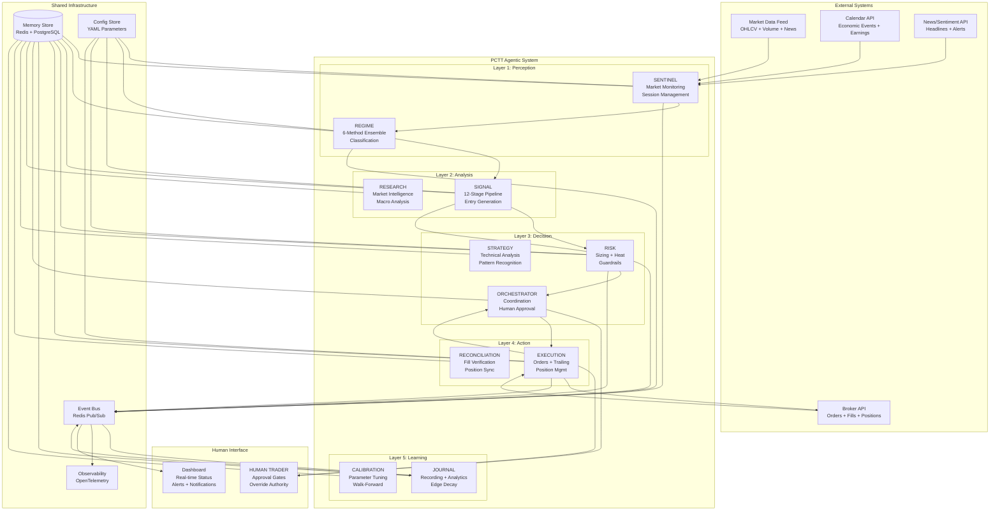

<!-- /SSOT-ARCH-01.03 -->

<!-- SSOT-ARCH-01.04 -->

### .04 Five-Layer Model with All 11 Agents

| Layer | # | Agent | Primary Responsibility | Primary Laws |
|-------|---|-------|----------------------|-------------|
| 1: Perception | 1 | **Sentinel** | Market monitoring, session management, watchlist curation | 3, 8, 9, 24, 30 |
| 1: Perception | 2 | **Regime** | 6-method ensemble regime detection, transition alerts | 8, 19, 28 |
| 2: Analysis | 3 | **Signal** | 12-stage PCTT pipeline, entry signal generation | 1, 5, 6, 11, 13, 15, 17 |
| 2: Analysis | 8 | **Research** | Market intelligence, macro analysis, news synthesis | Support role |
| 3: Decision | 4 | **Risk** | Position sizing, portfolio heat, circuit breakers, survival | 7, 21, 22, 23, 24, 29, 30 |
| 3: Decision | 5 | **Orchestrator** | Workflow coordination, human approval, conflict resolution | All 30 |
| 3: Decision | 10 | **Strategy** | Technical analysis, pattern recognition, strategy overlay | Support role |
| 4: Action | 6 | **Execution** | Order management, trailing stops, fail-fast, partial exits | 4, 10, 14, 25 |
| 4: Action | 11 | **Reconciliation** | Fill verification, position sync, broker reconciliation | Support role |
| 5: Learning | 7 | **Journal** | Trade recording, analytics, edge decay, performance reviews | 16, 17, 19, 20, 27 |
| 5: Learning | 9 | **Calibration** | Parameter tuning, walk-forward optimization | Support role |

<!-- /SSOT-ARCH-01.04 -->

<!-- SSOT-ARCH-01.05 -->

### .05 Technology Stack

| Component | Technology | Version | Rationale |
|-----------|-----------|---------|-----------|
| Agent Language | Python | 3.11+ | Strativion ecosystem, numpy/scipy, async support |
| Agent Framework | Claude Agent SDK | Latest | Native Anthropic integration, tool use |
| Web Framework | FastAPI | Latest | Async REST endpoints for dashboard |
| Event Bus | Redis Pub/Sub | 7.x | Low latency, simple, sufficient scale |
| Hot Memory | Python dict | N/A | Sub-millisecond in-process access |
| Warm Memory | Redis | 7.x | Single-digit millisecond shared state |
| Cold Memory | PostgreSQL | 16 | Historical trades, audit trail, reports |
| Archive | SQLite / Parquet | N/A | Local backups, columnar analytics |
| Frontend Framework | Electron | 28+ | Desktop application shell |
| UI Library | React | 18 | Component-based dashboard |
| Charting | TradingView LWC | v5 | Lightweight Charts for price display |
| Observability | OpenTelemetry | Latest | Vendor-neutral traces + metrics |
| Testing (Python) | pytest | Latest | Property-based testing with hypothesis |
| Testing (JS/TS) | Vitest | Latest | Fast unit tests for engine code |
| Circuit Breaker | pybreaker | Latest | Agent-level resilience |
| Retry Logic | tenacity | Latest | Exponential backoff with jitter |
| Broker API | IBKR TWS API | Latest | Most complete: futures + stocks + options |
| Data Feed | Polygon.io | Latest | Real-time + historical, websocket |

<!-- /SSOT-ARCH-01.05 -->

<!-- SSOT-ARCH-01.06 -->

### .06 Operating Modes

The system supports 4 operating modes. Downgrades are automatic (safety first). Upgrades require human confirmation.

| Mode | Description | Human Role | Execution | Default Parameters |
|------|------------|------------|-----------|-------------------|
| **MANUAL** | System advises only. Human executes trades on their own platform. | Reads dashboard, executes manually | Inactive for orders. Displays recommendations. | 1.0% risk, 6% heat, 6 positions, B-grade min |
| **SUPERVISED** (default) | System generates and sizes. Human approves at gates. Execution automated after approval. | Approves/modifies/rejects at 4 gates | Automated after human approval | 1.0% risk, 6% heat, 6 positions, B-grade min |
| **AUTONOMOUS** | System generates, sizes, and executes without human approval. Tightened guardrails. | Receives notifications, can intervene | Immediate upon Risk approval | 0.75% risk, 4% heat, 4 positions, A-grade min |
| **HALTED** | All trading stopped. Existing positions managed with trailing stops. | Reviews performance, re-enables | Only manages existing positions | 0% risk, 0% heat, 0 new positions |

**Complete ModeParameters dataclass:**

```python
from dataclasses import dataclass
from typing import Optional
from enum import Enum


class TradingMode(Enum):
    MANUAL = "MANUAL"
    SUPERVISED = "SUPERVISED"
    AUTONOMOUS = "AUTONOMOUS"
    HALTED = "HALTED"


@dataclass
class ModeParameters:
    """Operating parameters that vary by mode."""
    max_risk_per_trade_pct: float
    max_portfolio_heat_pct: float
    max_concurrent_positions: int
    min_setup_grade: str              # "A" or "B"
    min_q_score: float
    circuit_breaker_daily_loss_pct: float
    consecutive_loss_pause_threshold: int
    proposal_timeout_bars: Optional[int]  # None for autonomous (immediate) or manual (persistent)
    human_approval_required: bool
    notifications_enabled: bool
    auto_execute: bool
    trailing_stops_auto: bool
    partial_exits_auto: bool


@dataclass
class ModeTransitionRequirements:
    """Requirements for transitioning between modes."""
    min_trades: int
    min_expectancy: float             # In R-multiples
    max_drawdown_pct: float
    min_survival_score: int
    human_confirmation_required: bool


MODE_DEFAULTS = {
    TradingMode.MANUAL: ModeParameters(
        max_risk_per_trade_pct=1.0,
        max_portfolio_heat_pct=6.0,
        max_concurrent_positions=6,
        min_setup_grade="B",
        min_q_score=0.55,
        circuit_breaker_daily_loss_pct=2.0,
        consecutive_loss_pause_threshold=3,
        proposal_timeout_bars=None,
        human_approval_required=False,
        notifications_enabled=True,
        auto_execute=False,
        trailing_stops_auto=False,
        partial_exits_auto=False,
    ),
    TradingMode.SUPERVISED: ModeParameters(
        max_risk_per_trade_pct=1.0,
        max_portfolio_heat_pct=6.0,
        max_concurrent_positions=6,
        min_setup_grade="B",
        min_q_score=0.55,
        circuit_breaker_daily_loss_pct=2.0,
        consecutive_loss_pause_threshold=3,
        proposal_timeout_bars=2,
        human_approval_required=True,
        notifications_enabled=True,
        auto_execute=True,
        trailing_stops_auto=True,
        partial_exits_auto=True,
    ),
    TradingMode.AUTONOMOUS: ModeParameters(
        max_risk_per_trade_pct=0.75,
        max_portfolio_heat_pct=4.0,
        max_concurrent_positions=4,
        min_setup_grade="A",
        min_q_score=0.70,
        circuit_breaker_daily_loss_pct=1.5,
        consecutive_loss_pause_threshold=2,
        proposal_timeout_bars=None,
        human_approval_required=False,
        notifications_enabled=True,
        auto_execute=True,
        trailing_stops_auto=True,
        partial_exits_auto=True,
    ),
    TradingMode.HALTED: ModeParameters(
        max_risk_per_trade_pct=0.0,
        max_portfolio_heat_pct=0.0,
        max_concurrent_positions=0,
        min_setup_grade="A",
        min_q_score=1.0,
        circuit_breaker_daily_loss_pct=0.0,
        consecutive_loss_pause_threshold=0,
        proposal_timeout_bars=None,
        human_approval_required=True,
        notifications_enabled=True,
        auto_execute=False,
        trailing_stops_auto=True,
        partial_exits_auto=True,
    ),
}

TRANSITION_REQUIREMENTS = {
    ("MANUAL", "SUPERVISED"): ModeTransitionRequirements(
        min_trades=50,
        min_expectancy=0.1,
        max_drawdown_pct=20.0,
        min_survival_score=6,
        human_confirmation_required=True,
    ),
    ("SUPERVISED", "AUTONOMOUS"): ModeTransitionRequirements(
        min_trades=200,
        min_expectancy=0.2,
        max_drawdown_pct=15.0,
        min_survival_score=8,
        human_confirmation_required=True,
    ),
}
```

**Mode transition state machine:**

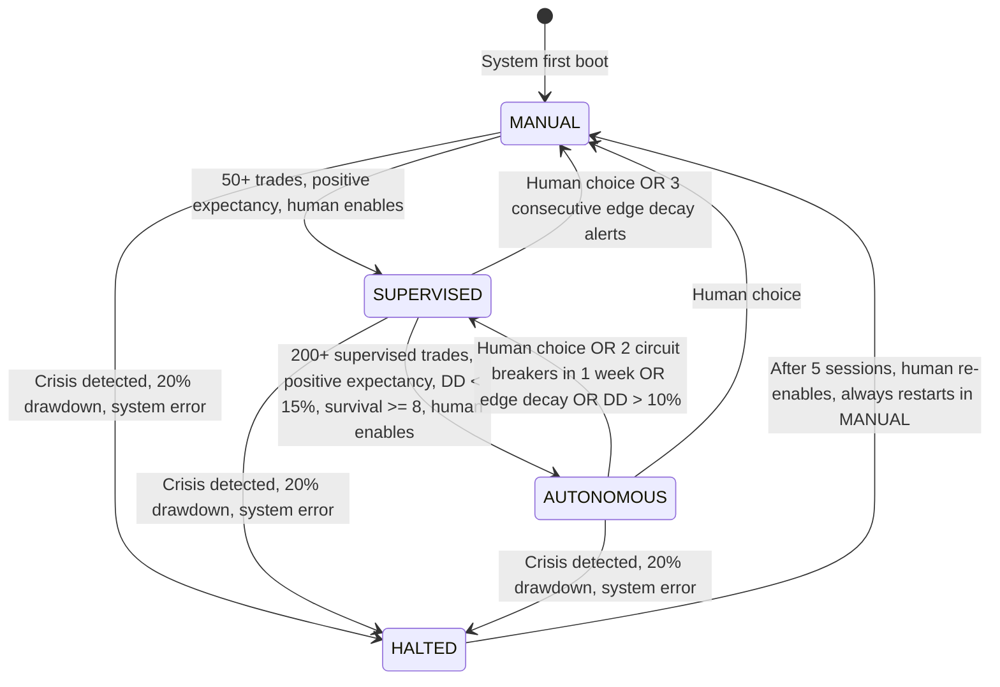

**Automatic downgrade triggers (no human approval needed):**

| Condition | From Mode | To Mode | Cooldown |
|-----------|-----------|---------|----------|
| 2 circuit breakers in 1 week | AUTONOMOUS | SUPERVISED | 1 week minimum in supervised |
| Edge decay alert (2/3 triggers) | AUTONOMOUS | SUPERVISED | Until edge restored |
| Drawdown exceeds 10% | AUTONOMOUS | SUPERVISED | Until DD recovers below 7% |
| 3 consecutive edge decay alerts | SUPERVISED | MANUAL | Until full review completed |
| Drawdown exceeds 20% | Any | HALTED | 5 sessions mandatory, restart in MANUAL |
| Broker disconnect > 5 min | AUTONOMOUS | SUPERVISED | Until error resolved |

<!-- /SSOT-ARCH-01.06 -->

<!-- SSOT-ARCH-01.07 -->

### .07 Four Approval Gates

| Gate | Trigger | Human Action | Timeout Behavior | Law Mapping |
|------|---------|-------------|-----------------|-------------|
| **G1: Trade Entry** | Signal + Risk both approve | Approve / Modify / Reject | Auto-expire after 2 bars | Laws 1, 5, 7, 30 |
| **G2: Pyramiding** | Add-to-winner conditions met | Approve / Reject addition | Auto-reject (conservative) | Laws 21, 22 |
| **G3: Override Stop** | Human wants to widen/tighten | Must provide reason | No timeout (manual action) | Laws 4, 10, 30 |
| **G4: Crisis Mode** | Circuit breaker triggered | Confirm halt / Resume with conditions | Auto-halt (Law 30) | Law 30 |

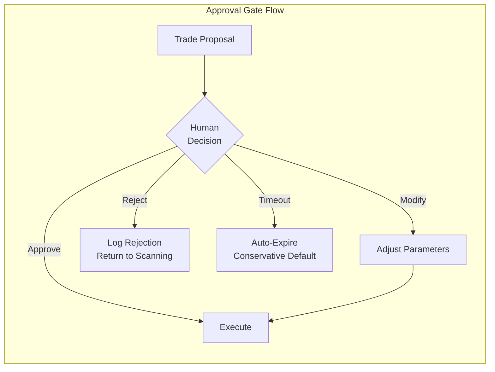

<!-- /SSOT-ARCH-01.07 -->

<!-- SSOT-ARCH-01.08 -->

### .08 Startup Sequence

1. **T-90 min before market open:** Orchestrator wakes, initializes Agent Registry
2. **Agent Registry:** Creates and starts all 11 agents via `start_all()`
3. **Each agent:** Runs `on_start()` lifecycle hook (load persisted state, warm caches, verify connections)
4. **Sentinel:** Wakes first, begins data collection (overnight futures, gaps, calendar, news)
5. **Risk:** Runs portfolio health check (equity, drawdown, heat, circuit breaker state)
6. **Regime:** Waits for Sentinel's MarketBrief
7. **T-60 min:** Sentinel publishes MarketBrief to event bus
8. **T-45 min:** Regime runs initial ensemble classification on all watchlist instruments
9. **T-30 min:** Regime publishes per-instrument regime classifications
10. **T-15 min:** Orchestrator presents human briefing (summary + alerts + plan)
11. **T-0 (market open):** Signal begins pipeline processing. Execution verifies broker connection.
12. **Agent Registry:** Starts 30-second health check loop

<!-- /SSOT-ARCH-01.08 -->

<!-- SSOT-ARCH-01.09 -->

### .09 Shutdown Sequence

**Graceful Shutdown (market close):**

1. **16:00 ET:** Sentinel publishes `MARKET_CLOSE` event
2. **Execution:** Finalizes all pending orders, reviews overnight position decisions
3. **Journal:** Begins daily report generation (P&L, R-multiples, edge decay check)
4. **T+30 min:** Journal publishes daily report. Orchestrator sends summary to human.
5. **Agent Registry:** Calls `stop_all()`. Each agent runs `on_stop()` (flush buffers, persist state, close connections).
6. **Audit buffer:** All agents flush remaining audit entries to cold storage (PostgreSQL)

**Emergency Shutdown:**

1. **Any agent** detects crisis condition (VIX > 35, SPX drop > 3%, correlation > 0.7, spreads > 3x normal)
2. **Sentinel** publishes `CRISIS_ALERT` to event bus
3. **Orchestrator** issues `IMMEDIATE_HALT` to all agents
4. **Risk** activates crisis protocol: cut gross exposure 50%, set max heat to 3%, widen stops by 1.5x ATR, cancel all pending orders
5. **Execution** sends cancel-all to broker API
6. **All agents** enter CRISIS mode. System transitions to HALTED operating mode.
7. **Human** receives immediate notification via all configured channels (Discord, SMS, email)

<!-- /SSOT-ARCH-01.09 -->

<!-- SSOT-ARCH-01.10 -->

### .10 System Invariants (10 Non-Negotiable Rules)

These rules are hardcoded into the system and cannot be overridden by any agent, any configuration change, or any human action short of physically disabling the system.

1. **Non-repainting is absolute.** All boundary estimates use data from t-1 only. Frozen lines never update. Violation = system integrity failure.
2. **One-break-one-trade.** Each confirmed break produces at most one entry attempt. No re-entry on the same structure.
3. **Maximum risk per trade: 2%.** Even if A-Grade, even if human requests more. Hard cap.
4. **Maximum portfolio heat: 8%.** Absolute ceiling even in exceptional conditions.
5. **Maximum correlated positions: 5.** Absolute ceiling.
6. **Drawdown halt at 20%.** Automatic. Requires formal re-entry protocol (5 sessions mandatory, restart in MANUAL).
7. **Every position must have a stop.** Orders without stops are rejected by the Execution agent.
8. **Human approval required for entries in SUPERVISED mode.** Cannot be bypassed by any agent.
9. **Trade recording is mandatory.** The Journal agent must record every trade. The system blocks the next trade if the previous trade was not recorded.
10. **Law 30 (Survival) overrides all other Laws.** If Risk says no, the answer is no. Period.

<!-- /SSOT-ARCH-01.10 -->

**Cross-references:** [ref: SSOT-ARCH-02] (communication), [ref: SSOT-ARCH-03] (memory), [ref: SSOT-AG-01 through SSOT-AG-07] (agents), [ref: SSOT-MODE-01] (operating modes detail)

<!-- /SSOT-ARCH-01 -->

---

<!-- SSOT-ARCH-02 -->

## SSOT-ARCH-02: Communication Architecture

<!-- SSOT-ARCH-02.01 -->

### .01 Event Bus Specification

| Property | Value |
|----------|-------|
| Technology | Redis Pub/Sub |
| Version | 7.x |
| Serialization | JSON (UTF-8) |
| Latency Target | < 50ms |
| Alert Threshold | > 200ms |
| Persistence | Events logged to PostgreSQL (cold tier) for audit trail |
| Ordering | Per-channel FIFO. No global ordering guarantee across channels. |

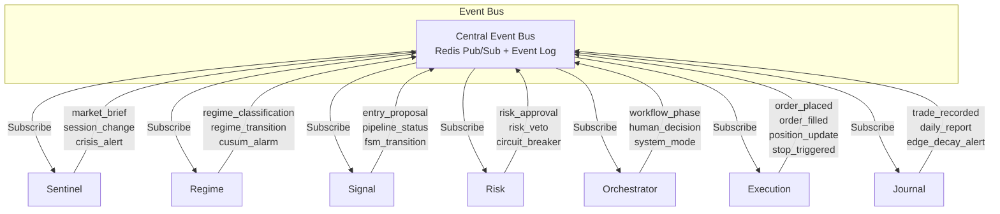

<!-- /SSOT-ARCH-02.01 -->

<!-- SSOT-ARCH-02.02 -->

### .02 Channel Naming Convention

All Redis Pub/Sub channels follow the pattern: `strativion.{agent}.{event_type}`

| Channel | Publisher | Example Payload Key |
|---------|----------|-------------------|
| `strativion.sentinel.market_brief` | Sentinel | MarketBrief object |
| `strativion.sentinel.session_change` | Sentinel | New session phase string |
| `strativion.sentinel.crisis_alert` | Sentinel | Crisis type + severity |
| `strativion.regime.classification` | Regime | Regime + confidence |
| `strativion.regime.transition` | Regime | Old regime, new regime |
| `strativion.regime.cusum_alarm` | Regime | Change point location |
| `strativion.signal.entry_proposal` | Signal | EntryProposal object |
| `strativion.signal.pipeline_status` | Signal | Stage pass/fail stats |
| `strativion.signal.fsm_transition` | Signal | FSM state change |
| `strativion.risk.approval` | Risk | RiskApproval object |
| `strativion.risk.veto` | Risk | Veto reason string |
| `strativion.risk.circuit_breaker` | Risk | Breaker type + action |
| `strativion.orchestrator.workflow_phase` | Orchestrator | Phase transition |
| `strativion.orchestrator.human_decision` | Orchestrator | Approve/Modify/Reject |
| `strativion.orchestrator.system_mode` | Orchestrator | Mode change |
| `strativion.execution.order_placed` | Execution | Order details |
| `strativion.execution.order_filled` | Execution | Fill + slippage |
| `strativion.execution.position_update` | Execution | Current position state |
| `strativion.execution.stop_triggered` | Execution | Exit details |
| `strativion.journal.trade_recorded` | Journal | PCTTTradeRecord |
| `strativion.journal.daily_report` | Journal | DailyReport object |
| `strativion.journal.edge_decay_alert` | Journal | Decay metrics |

<!-- /SSOT-ARCH-02.02 -->

<!-- SSOT-ARCH-02.03 -->

### .03 Message Envelope Format

Every message on the event bus is wrapped in a standard envelope:

```python
from dataclasses import dataclass, field
from datetime import datetime, timezone
from typing import Any, Dict, Optional
import uuid


@dataclass
class MessageEnvelope:
    """Standard envelope for all event bus messages."""
    message_id: str = ""
    source_agent: str = ""
    event_type: str = ""
    priority: str = "NORMAL"           # LOW, NORMAL, HIGH, CRITICAL
    payload: Dict[str, Any] = field(default_factory=dict)
    correlation_id: str = ""           # Links related messages (e.g., proposal to approval)
    timestamp: str = ""
    schema_version: str = "1.0"
    ttl_seconds: int = 0               # 0 = no expiry

    def __post_init__(self):
        if not self.message_id:
            self.message_id = str(uuid.uuid4())
        if not self.timestamp:
            self.timestamp = datetime.now(timezone.utc).isoformat()
        if not self.correlation_id:
            self.correlation_id = self.message_id
```

**Priority levels:**

| Priority | Examples | Handling |
|----------|---------|---------|
| CRITICAL | Circuit breaker, crisis alert, fail-fast | Process immediately, interrupt current work |
| HIGH | Entry proposal, risk approval, human decision | Process next in queue |
| NORMAL | Regime update, position update, pipeline status | Standard queue processing |
| LOW | Daily report, edge metrics, analytics | Process when idle |

<!-- /SSOT-ARCH-02.03 -->

<!-- SSOT-ARCH-02.04 -->

### .04 Handoff Pattern

The system uses the Swarm "handoff-as-return" pattern for inter-agent communication. When an agent needs to delegate work to another agent, it returns a `Handoff` object. The Orchestrator (via the Agent Registry) routes the handoff to the target agent.

```python
@dataclass
class Handoff:
    """
    Swarm-style handoff object. Returned by an agent when it needs
    to delegate work to another agent.
    """
    source_agent: str = ""
    target_agent: str = ""
    payload: Dict[str, Any] = field(default_factory=dict)
    priority: str = "NORMAL"           # LOW, NORMAL, HIGH, CRITICAL
    requires_response: bool = False    # Whether source needs a reply
    correlation_id: str = ""           # For tracking request/response pairs
    created_at: str = ""

    def __post_init__(self):
        if not self.correlation_id:
            self.correlation_id = str(uuid.uuid4())
        if not self.created_at:
            self.created_at = datetime.now(timezone.utc).isoformat()
```

**Key principles:**
- Agents never call other agents directly. All inter-agent communication goes through handoffs or the event bus.
- Every handoff is logged to the audit trail.
- The Agent Registry validates that the target agent exists and is in a READY or RUNNING state before routing.
- If `requires_response` is True, the source agent blocks until the target returns a result.

<!-- /SSOT-ARCH-02.04 -->

<!-- SSOT-ARCH-02.05 -->

### .05 Request-Response Correlation

When a message requires a response (e.g., Signal sends an entry proposal and needs Risk's approval), the `correlation_id` field links the request to its response.

**Flow:**
1. Signal creates `MessageEnvelope` with `correlation_id = "abc-123"` and publishes to `strativion.signal.entry_proposal`
2. Risk subscribes, processes the proposal, creates a response `MessageEnvelope` with the same `correlation_id = "abc-123"` and publishes to `strativion.risk.approval` (or `strativion.risk.veto`)
3. Orchestrator matches the response to the original request via `correlation_id`
4. The complete request-response pair is logged as a single audit trail entry

**Event subscription matrix:**

| Event | Publisher | Subscribers |
|-------|----------|------------|
| `market_brief` | Sentinel | All agents |
| `session_change` | Sentinel | All agents |
| `crisis_alert` | Sentinel | Orchestrator, Risk |
| `regime_classification` | Regime | Signal, Risk, Orchestrator |
| `regime_transition` | Regime | Signal, Orchestrator |
| `cusum_alarm` | Regime | Signal, Orchestrator |
| `entry_proposal` | Signal | Risk |
| `pipeline_status` | Signal | Journal, Orchestrator |
| `risk_approval` | Risk | Orchestrator |
| `risk_veto` | Risk | Orchestrator, Journal |
| `circuit_breaker` | Risk | All agents |
| `human_decision` | Orchestrator | Execution or Signal |
| `workflow_phase` | Orchestrator | All agents |
| `order_placed` | Execution | Journal, Risk |
| `order_filled` | Execution | Journal, Risk |
| `position_update` | Execution | Risk, Journal |
| `stop_triggered` | Execution | Journal, Risk |
| `trade_recorded` | Journal | Orchestrator |
| `edge_decay_alert` | Journal | Orchestrator, Risk |

<!-- /SSOT-ARCH-02.05 -->

**Cross-references:** [ref: SSOT-ARCH-01.03] (architecture diagram), [ref: SSOT-ARCH-03] (memory architecture), [ref: SSOT-AG-05] (Orchestrator routing)

<!-- /SSOT-ARCH-02 -->

---

<!-- SSOT-ARCH-03 -->

## SSOT-ARCH-03: Memory Architecture

<!-- SSOT-ARCH-03.01 -->

### .01 Three-Tier Model

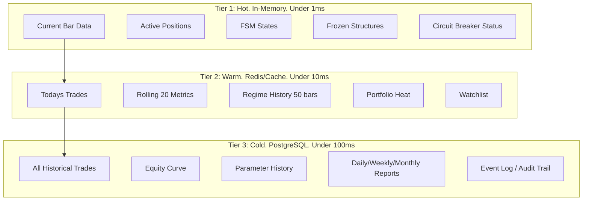

<!-- /SSOT-ARCH-03.01 -->

<!-- SSOT-ARCH-03.02 -->

### .02 Hot Tier

| Property | Value |
|----------|-------|
| Implementation | Python `dict` per agent |
| Scope | Per-agent (not shared) |
| Latency | Sub-millisecond |
| TTL | Session (lost on restart, rebuilt from warm tier) |
| Contents | Current bar data, FSM states, frozen structures, active positions, circuit breaker status |

Each agent maintains its own hot memory via the `MemoryInterface._hot` dictionary. Hot memory is never shared directly between agents. Cross-agent data sharing happens through the warm tier (Redis) or the event bus.

<!-- /SSOT-ARCH-03.02 -->

<!-- SSOT-ARCH-03.03 -->

### .03 Warm Tier

| Property | Value |
|----------|-------|
| Implementation | Redis 7.x |
| Scope | Shared across all agents |
| Latency | Single-digit milliseconds |
| TTL | Configurable per key (see key registry below) |
| Contents | Today's trades, rolling metrics, regime history, portfolio heat, watchlist, config params |

Warm tier also serves as the event bus transport (Redis Pub/Sub channels).

<!-- /SSOT-ARCH-03.03 -->

<!-- SSOT-ARCH-03.04 -->

### .04 Cold Tier

| Property | Value |
|----------|-------|
| Implementation | PostgreSQL 16 |
| Scope | Persistent, shared |
| Latency | Tens of milliseconds |
| Archive | Parquet files for columnar analytics |
| Contents | All historical trades (PCTTTradeRecord), equity curve, parameter history, daily/weekly/monthly reports, event log, audit trail |

Cold tier is append-only for trade records and audit entries. Historical records are never modified or deleted.

<!-- /SSOT-ARCH-03.04 -->

<!-- SSOT-ARCH-03.05 -->

### .05 Shared Memory Key Registry

| Key Pattern | Owner Agent | Reader Agents | Tier | TTL | Description |
|-------------|------------|---------------|------|-----|-------------|
| `market:brief:{date}` | Sentinel | All | Warm | 24h | Today's MarketBrief |
| `regime:{instrument}` | Regime | Signal, Risk | Warm | Until changed | Current regime classification |
| `fsm:{instrument}` | Signal | Execution | Warm | Until changed | FSM state (IDLE, WAIT_RETEST, etc.) |
| `frozen:{instrument}:{break_bar}` | Signal | Execution | Warm | Until trade closed | Frozen Action + Safety lines |
| `position:{position_id}` | Execution | Risk, Journal | Warm | Until closed | Active position state |
| `heat:portfolio` | Risk | All | Warm | Real-time | Current portfolio heat percentage |
| `circuit:status` | Risk | All | Warm | Until cleared | Circuit breaker state (GREEN/YELLOW/RED) |
| `metrics:rolling20` | Journal | Risk, Orchestrator | Warm | Per trade update | Rolling 20-trade performance metrics |
| `config:params:{instrument}` | Config (YAML) | All | Warm | Until changed | Active resolved parameters for instrument |
| `session:current` | Sentinel | All | Warm | Until changed | Current session phase |
| `survival:score` | Risk | Orchestrator, Journal | Warm | Per trade update | Current survival score (0 to 10) |
| `mode:current` | Orchestrator | All | Warm | Until changed | Current operating mode |
| `watchlist:active` | Sentinel | Signal, Regime | Warm | Until changed | Active tradeable instruments list |

<!-- /SSOT-ARCH-03.05 -->

<!-- SSOT-ARCH-03.06 -->

### .06 MemoryInterface Abstract Class

```python
from dataclasses import dataclass, field
from typing import Any, Dict, List, Optional


@dataclass
class MemoryInterface:
    """
    3-tier memory interface. Maps to the Hot/Warm/Cold architecture.
    Every agent gets one MemoryInterface instance.
    """

    # Hot tier: in-process Python dict. Sub-millisecond access.
    # Scope: current bar, current pipeline run.
    # Lost on restart. Rebuilt from warm tier on startup.
    _hot: Dict[str, Any] = field(default_factory=dict)

    # Warm tier connection info (Redis)
    _warm_client: Any = None    # redis.asyncio.Redis instance

    # Cold tier connection info (PostgreSQL)
    _cold_pool: Any = None      # asyncpg.Pool instance

    # --- Hot Tier Operations ---

    def hot_get(self, key: str, default: Any = None) -> Any:
        """Read from hot tier. O(1) dict lookup."""
        return self._hot.get(key, default)

    def hot_set(self, key: str, value: Any) -> None:
        """Write to hot tier. O(1) dict insert."""
        self._hot[key] = value

    def hot_delete(self, key: str) -> None:
        """Remove from hot tier."""
        self._hot.pop(key, None)

    def hot_clear(self) -> None:
        """Clear all hot tier data. Used on session reset."""
        self._hot.clear()

    # --- Warm Tier Operations (Redis) ---

    async def warm_get(self, key: str) -> Optional[str]:
        """Read from warm tier. Returns JSON string or None."""
        if self._warm_client is None:
            raise RuntimeError("Warm memory not initialized")
        return await self._warm_client.get(key)

    async def warm_set(self, key: str, value: str, ttl_seconds: int = 0) -> None:
        """Write to warm tier with optional TTL."""
        if self._warm_client is None:
            raise RuntimeError("Warm memory not initialized")
        if ttl_seconds > 0:
            await self._warm_client.setex(key, ttl_seconds, value)
        else:
            await self._warm_client.set(key, value)

    async def warm_delete(self, key: str) -> None:
        """Remove from warm tier."""
        if self._warm_client is None:
            raise RuntimeError("Warm memory not initialized")
        await self._warm_client.delete(key)

    async def warm_publish(self, channel: str, message: str) -> None:
        """Publish to Redis pub/sub (event bus)."""
        if self._warm_client is None:
            raise RuntimeError("Warm memory not initialized")
        await self._warm_client.publish(channel, message)

    # --- Cold Tier Operations (PostgreSQL) ---

    async def cold_write(self, table: str, record: Dict[str, Any]) -> str:
        """Insert a record into cold storage. Returns record ID."""
        if self._cold_pool is None:
            raise RuntimeError("Cold memory not initialized")
        columns = ", ".join(record.keys())
        placeholders = ", ".join(f"${i+1}" for i in range(len(record)))
        query = f"INSERT INTO {table} ({columns}) VALUES ({placeholders}) RETURNING id"
        async with self._cold_pool.acquire() as conn:
            row = await conn.fetchrow(query, *record.values())
            return str(row["id"])

    async def cold_query(self, query: str, *args) -> List[Dict[str, Any]]:
        """Execute a read query against cold storage."""
        if self._cold_pool is None:
            raise RuntimeError("Cold memory not initialized")
        async with self._cold_pool.acquire() as conn:
            rows = await conn.fetch(query, *args)
            return [dict(row) for row in rows]
```

<!-- /SSOT-ARCH-03.06 -->

**Cross-references:** [ref: SSOT-ARCH-02] (event bus uses warm tier Redis), [ref: SSOT-ARCH-01.05] (technology stack), [ref: SSOT-AG-01 through SSOT-AG-07] (agent-specific memory dataclasses)

<!-- /SSOT-ARCH-03 -->

---

<!-- SSOT-AG-01 -->

## SSOT-AG-01: Sentinel Agent (Perception Layer)

<!-- SSOT-AG-01.prompt -->

### .prompt System Prompt (Verbatim)

```
You are the SENTINEL agent in the PCTT trading system. Your role is market
monitoring, session management, and environmental threat detection.

PRIME DIRECTIVE: Detect conditions that threaten capital before they manifest
as losses. You are the early warning system.

RESPONSIBILITIES:
1. Pre-market scanning: gaps, overnight activity, calendar events, news
2. Session management: open/close times, liquidity windows, lunch hour detection
3. Watchlist curation: filter instruments by regime, volume, spread quality
4. Environmental monitoring: VIX levels, correlation spikes, liquidity metrics
5. Calendar awareness: FOMC, CPI, NFP, earnings, options expiration

OPERATING RULES:
- Always run 60-90 minutes before market open
- Flag any overnight gap > 1 ATR as significant, > 2 ATR as structure-invalidating
- Monitor VIX in real-time: < 15 (low vol), 15-25 (normal), 25-35 (elevated), > 35 (crisis)
- Track session-specific metrics (Asia/London/NY overlap windows for FX)
- Never generate trade signals (that is Signal agent's job)
- Always publish findings to the event bus for other agents

LAW ALIGNMENT:
- Law 3 (Volatility Compression): Detect compression/expansion cycles
- Law 8 (Market Regimes): Feed regime detection with market context
- Law 9 (Information Decay): Flag stale setups and expired structures
- Law 24 (Systemic Correlation): Monitor cross-asset correlation
- Law 30 (Survival): Immediate alert if crisis conditions detected

OUTPUT FORMAT:
Always produce a structured MarketBrief:
{
  "timestamp": "ISO-8601",
  "session": "PRE_MARKET|OPEN|LUNCH|POWER_HOUR|CLOSE|AFTER_HOURS",
  "regime_context": {...},
  "watchlist": [...],
  "alerts": [...],
  "calendar_events": [...],
  "overnight_gaps": [...],
  "survival_check": "GREEN|YELLOW|RED"
}
```

<!-- /SSOT-AG-01.prompt -->

<!-- SSOT-AG-01.tools -->

### .tools Tool Table

| Name | Description | Input Params | Output Type | Permission Level |
|------|------------|-------------|-------------|-----------------|
| `fetch_ohlcv` | Get bar data from market data feed | instrument: str, timeframe: str, count: int | List[OHLCVBar] | READ_ONLY |
| `fetch_vix` | Get current VIX and term structure | (none) | VIXData (spot, futures curve) | READ_ONLY |
| `fetch_calendar` | Get economic calendar | date_range: tuple[str, str] | List[CalendarEvent] | READ_ONLY |
| `fetch_news` | Get headlines for watchlist | instruments: List[str] | List[Headline] with sentiment | READ_ONLY |
| `compute_overnight_gap` | Calculate gap vs prior close | instrument: str | GapData (size, direction, ATR ratio) | READ_ONLY |
| `check_session_time` | Determine current session phase | instrument_class: str | SessionInfo (name, liquidity score) | READ_ONLY |
| `publish_event` | Send event to bus | event_type: str, payload: dict | Confirmation | READ_WRITE |
| `read_memory` | Read from shared memory | key: str | Any | READ_ONLY |
| `write_memory` | Write to shared memory | key: str, value: Any | Confirmation | READ_WRITE |

**Plugin groupings:** market_data (fetch_ohlcv, fetch_vix), calendar (fetch_calendar), news (fetch_news), computation (compute_overnight_gap, check_session_time), memory (read_memory, write_memory), events (publish_event)

<!-- /SSOT-AG-01.tools -->

<!-- SSOT-AG-01.memory -->

### .memory Memory Dataclass

```python
from dataclasses import dataclass, field
from typing import Dict, List, Optional


@dataclass
class SentinelMemory:
    # Short-term (current session)
    current_session: str = "PRE_MARKET"       # PRE_MARKET, OPEN, LUNCH, POWER_HOUR, CLOSE
    market_brief: dict = field(default_factory=dict)  # Latest MarketBrief
    active_alerts: list = field(default_factory=list)  # Unresolved alerts
    watchlist: list = field(default_factory=list)       # Current tradeable instruments

    # Medium-term (rolling 5-day)
    daily_gaps: list = field(default_factory=list)      # Last 5 days of gap data per instrument
    vix_history: list = field(default_factory=list)     # VIX readings every 15 min for 5 days
    session_quality: list = field(default_factory=list)  # Per-session volume/spread metrics

    # Long-term (persistent)
    calendar_database: dict = field(default_factory=dict)  # All known economic events
    seasonal_patterns: dict = field(default_factory=dict)  # Monthly/weekly biases
    instrument_profiles: dict = field(default_factory=dict)  # Per-instrument session characteristics
```

<!-- /SSOT-AG-01.memory -->

<!-- SSOT-AG-01.guardrails -->

### .guardrails

| Guardrail | Type | Override Possible? | Enforcement |
|-----------|------|-------------------|-------------|
| MUST NOT generate trade signals | Hard | No | Boundary: only Sentinel provides context; Signal generates signals |
| MUST alert immediately if VIX > 35 | Hard | No | Crisis threshold triggers CRISIS_ALERT event |
| MUST flag earnings within 24 hours for any watchlist instrument | Hard | No | Calendar check runs every pre-market scan |
| MUST respect session boundaries | Soft | Human can override | No scanning during market close for equities |
| MUST publish MarketBrief before market open | Hard | No | Blocking requirement for other agents |
| Lunch hour: no new setups 11:30 to 13:30 | Soft | Human can override | Warning issued if overridden |

<!-- /SSOT-AG-01.guardrails -->

<!-- SSOT-AG-01.events -->

### .events

**Published events:**

| Event | Channel | Priority | Payload |
|-------|---------|----------|---------|
| `market_brief` | `strativion.sentinel.market_brief` | NORMAL | MarketBrief object |
| `session_change` | `strativion.sentinel.session_change` | NORMAL | New session phase string |
| `crisis_alert` | `strativion.sentinel.crisis_alert` | CRITICAL | Crisis type + severity |
| `lunch_hour` | `strativion.sentinel.session_change` | NORMAL | LUNCH_HOUR phase |
| `power_hour` | `strativion.sentinel.session_change` | NORMAL | POWER_HOUR phase |

**Subscribed events:**

| Event | From Agent | Action |
|-------|-----------|--------|
| `circuit_breaker` | Risk | Enter crisis monitoring mode |
| `workflow_phase` | Orchestrator | Adjust session monitoring |
| `regime_classification` | Regime | Update watchlist filtering |

<!-- /SSOT-AG-01.events -->

<!-- SSOT-AG-01.workflow -->

### .workflow

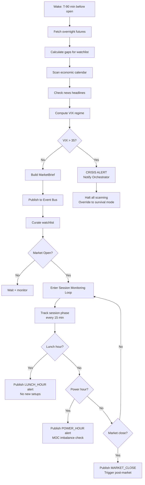

<!-- /SSOT-AG-01.workflow -->

<!-- SSOT-AG-01.config -->

### .config Keys

| Config Key | Source | Description |
|-----------|--------|-------------|
| `sentinel.wake_minutes_before_open` | master-config.yaml | Minutes before open to start (default: 90) |
| `sentinel.vix_crisis_threshold` | master-config.yaml | VIX level triggering crisis (default: 35) |
| `sentinel.gap_significant_atr` | master-config.yaml | ATR multiplier for significant gap (default: 1.0) |
| `sentinel.gap_invalidating_atr` | master-config.yaml | ATR multiplier for structure-invalidating gap (default: 2.0) |
| `sentinel.session_monitor_interval_min` | master-config.yaml | Session check interval in minutes (default: 15) |
| `sentinel.lunch_start` | master-config.yaml | Lunch hour start (default: "11:30") |
| `sentinel.lunch_end` | master-config.yaml | Lunch hour end (default: "13:30") |
| `universe.*` | universe-definition.yaml | Universe selection parameters |

<!-- /SSOT-AG-01.config -->

<!-- SSOT-AG-01.laws -->

### .laws

| Law | Role | Implementation |
|-----|------|---------------|
| Law 3 (Volatility Compression) | **Primary** | Detects compression/expansion cycles via ATR analysis |
| Law 8 (Market Regimes) | **Primary** | Feeds regime detection with market context (VIX, gaps, session) |
| Law 9 (Information Decay) | **Primary** | Flags stale setups and expired structures based on time |
| Law 24 (Systemic Correlation) | **Primary** | Monitors cross-asset correlation spikes |
| Law 30 (Survival) | **Primary** | Immediate crisis alert if survival conditions threatened |

<!-- /SSOT-AG-01.laws -->

**Cross-references:** [ref: SSOT-ARCH-02] (event bus), [ref: SSOT-ARCH-03.05] (memory keys), [ref: SSOT-AG-02] (Regime receives MarketBrief), [ref: SSOT-AG-05] (Orchestrator receives crisis alerts)

<!-- /SSOT-AG-01 -->

---

<!-- SSOT-AG-02 -->

## SSOT-AG-02: Regime Agent (Perception Layer)

<!-- SSOT-AG-02.prompt -->

### .prompt System Prompt (Verbatim)

```
You are the REGIME agent in the PCTT trading system. Your role is market
regime classification using a 6-method ensemble detector.

PRIME DIRECTIVE: Accurately classify the current market regime so that
downstream agents trade only in favorable conditions. Wrong regime
classification is the #1 cause of false signals.

METHODS (all 6 must vote):
1. Efficiency Ratio (ER): |net movement| / sum(|bar-to-bar|) over 20 bars
2. Crossing Count: Times price crosses EMA(20) in last 20 bars
3. Hurst Exponent: H > 0.55 = trending, H < 0.45 = mean-reverting
4. Kalman Slope: Smoothed price slope direction and magnitude
5. CUSUM: Cumulative sum detector for regime change points
6. Volatility Regime: ATR expansion/contraction classification

CLASSIFICATION:
- TRENDING: 4+ methods agree on directional persistence. PCTT break-retest active.
- MEAN_REVERTING: 4+ methods agree on oscillation. Only boundary mean-reversion.
- CHOPPY: No agreement or contradictory signals. NO TRADING.
- VOLATILE: ATR > 2x 20-day average. Widen all parameters, reduce size.

TRANSITION DETECTION:
- Monitor all 6 methods every bar
- If ensemble agreement drops from 5/6 to 3/6: TRANSITION warning
- If CUSUM fires: regime change likely within 5-10 bars
- Publish regime_transition_alert immediately

REGIME-ADAPTIVE PARAMETERS:
Publish parameter adjustments for each regime:
- TRENDING: Standard parameters
- MEAN_REVERTING: Tighter retest tolerance, wider break buffer
- VOLATILE: 1.5x all ATR multipliers, 50% position size
- CHOPPY: No parameters needed (no trading allowed)

LAW ALIGNMENT:
- Law 8: Market Regimes are the foundation
- Law 19: Edge Decay manifests as regime shifts
- Law 28: Adaptation means adjusting to regime, not fighting it
```

<!-- /SSOT-AG-02.prompt -->

<!-- SSOT-AG-02.tools -->

### .tools Tool Table

| Name | Description | Input Params | Output Type | Permission Level |
|------|------------|-------------|-------------|-----------------|
| `compute_efficiency_ratio` | ER calculation | prices: array, period: int = 20 | float (0 to 1) | READ_ONLY |
| `compute_crossing_count` | Midline crossing count | prices: array, ema_period: int = 20 | int | READ_ONLY |
| `compute_hurst_exponent` | R/S Hurst estimation | prices: array, window: int = 100 | float | READ_ONLY |
| `compute_kalman_slope` | Kalman-filtered slope | prices: array, process_noise: float = 0.01 | (slope: float, direction: str) | READ_ONLY |
| `compute_cusum` | CUSUM change detector | prices: array, threshold: float = 2.0 | (alarm: bool, location: int) | READ_ONLY |
| `compute_volatility_regime` | ATR expansion/contraction | atr_series: array | str (regime classification) | READ_ONLY |
| `run_ensemble` | Run all 6 methods, aggregate vote | instrument: str, timeframe: str | RegimeClassification | READ_ONLY |
| `get_regime_parameters` | Regime-specific param overrides | regime: str | dict | READ_ONLY |
| `publish_event` | Publish regime change | event_type: str, payload: dict | Confirmation | READ_WRITE |

**Plugin groupings:** statistics (compute_efficiency_ratio, compute_crossing_count, compute_hurst_exponent, compute_kalman_slope, compute_cusum, compute_volatility_regime), regime (run_ensemble, get_regime_parameters), events (publish_event)

<!-- /SSOT-AG-02.tools -->

<!-- SSOT-AG-02.memory -->

### .memory Memory Dataclass

```python
from dataclasses import dataclass, field
from typing import Dict, List, Optional


@dataclass
class RegimeMemory:
    # Current state
    current_regime: str = "CHOPPY"          # TRENDING, MEAN_REVERTING, CHOPPY, VOLATILE
    ensemble_votes: dict = field(default_factory=dict)  # {method: vote} for all 6
    confidence: float = 0.0                 # Agreement ratio (4/6 = 0.67, 6/6 = 1.0)
    regime_duration_bars: int = 0           # How long in current regime

    # Transition tracking
    cusum_state: dict = field(default_factory=dict)   # CUSUM detector internal state
    transition_warnings: list = field(default_factory=list)  # Recent transition alerts
    regime_history: list = field(default_factory=list)  # Last 50 regime classifications with timestamps

    # Parameter output
    active_parameter_adjustments: dict = field(default_factory=dict)  # Current regime-specific overrides

    # Per-instrument
    instrument_regimes: dict = field(default_factory=dict)  # {instrument: regime_state}
```

<!-- /SSOT-AG-02.memory -->

<!-- SSOT-AG-02.guardrails -->

### .guardrails

| Guardrail | Type | Override Possible? | Enforcement |
|-----------|------|-------------------|-------------|
| MUST require 4/6 agreement for any regime classification | Hard | No | No simple majority; minimum supermajority |
| MUST publish CHOPPY classification immediately | Hard | No | Blocks all trading downstream |
| MUST run on multiple timeframes (meso and macro) | Hard | No | Both timeframes reported |
| MUST NOT change regime more than once per 5 bars (debounce) | Hard | No | Prevents regime thrashing |
| MUST flag unusually long regimes (> 100 bars) | Soft | No | Potential edge decay signal |

<!-- /SSOT-AG-02.guardrails -->

<!-- SSOT-AG-02.events -->

### .events

**Published events:**

| Event | Channel | Priority | Payload |
|-------|---------|----------|---------|
| `regime_classification` | `strativion.regime.classification` | NORMAL | Regime + confidence + votes dict |
| `regime_transition` | `strativion.regime.transition` | HIGH | Old regime, new regime, confidence |
| `cusum_alarm` | `strativion.regime.cusum_alarm` | HIGH | Change point location, instrument |
| `steady_regime` | `strativion.regime.classification` | LOW | Duration update |

**Subscribed events:**

| Event | From Agent | Action |
|-------|-----------|--------|
| `market_brief` | Sentinel | Trigger initial classification run |
| `session_change` | Sentinel | Adjust monitoring frequency |

<!-- /SSOT-AG-02.events -->

<!-- SSOT-AG-02.workflow -->

### .workflow

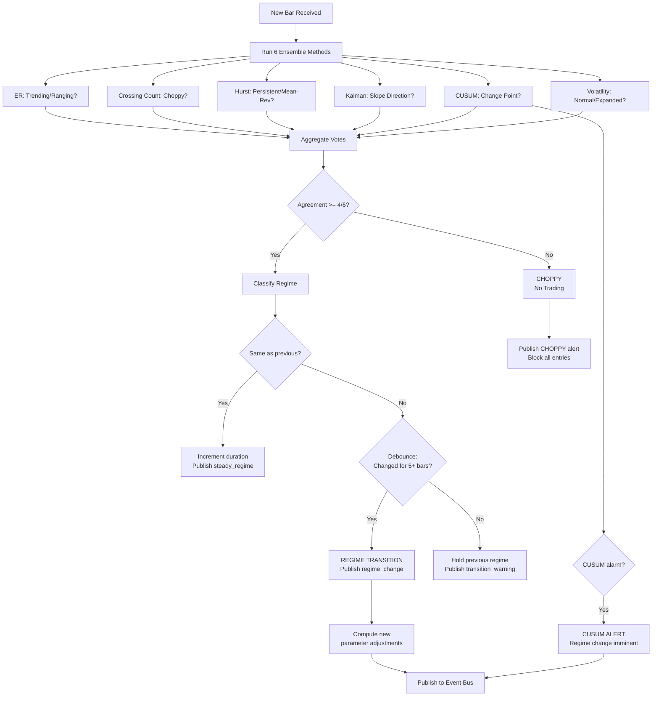

<!-- /SSOT-AG-02.workflow -->

<!-- SSOT-AG-02.config -->

### .config Keys

| Config Key | Source | Description |
|-----------|--------|-------------|
| `regime.er_period` | master-config.yaml | Efficiency ratio period (default: 20) |
| `regime.ema_period` | master-config.yaml | EMA period for crossing count (default: 20) |
| `regime.hurst_window` | master-config.yaml | Hurst exponent window (default: 100) |
| `regime.kalman_process_noise` | master-config.yaml | Kalman filter noise (default: 0.01) |
| `regime.cusum_threshold` | master-config.yaml | CUSUM alarm threshold (default: 2.0) |
| `regime.min_agreement` | master-config.yaml | Minimum votes for classification (default: 4) |
| `regime.debounce_bars` | master-config.yaml | Bars before confirming transition (default: 5) |
| `regime.long_regime_warning_bars` | master-config.yaml | Bars before flagging long regime (default: 100) |

<!-- /SSOT-AG-02.config -->

<!-- SSOT-AG-02.laws -->

### .laws

| Law | Role | Implementation |
|-----|------|---------------|
| Law 8 (Market Regimes) | **Primary** | Core responsibility: 6-method ensemble classification |
| Law 19 (Edge Decay) | **Primary** | Regime shifts manifest edge decay |
| Law 28 (Adaptation) | **Primary** | Regime-adaptive parameter adjustments |

<!-- /SSOT-AG-02.laws -->

**Cross-references:** [ref: SSOT-AG-01] (receives MarketBrief from Sentinel), [ref: SSOT-AG-03] (gates Signal agent), [ref: SSOT-ARCH-02.05] (event subscription matrix)

<!-- /SSOT-AG-02 -->

---

<!-- SSOT-AG-03 -->

## SSOT-AG-03: Signal Agent (Analysis Layer)

<!-- SSOT-AG-03.prompt -->

### .prompt System Prompt (Verbatim)

```
You are the SIGNAL agent in the PCTT trading system. You execute the complete
12-stage Pivot-Constrained Trendline Trading pipeline to generate entry signals.

PRIME DIRECTIVE: Generate high-quality, non-repainting trade signals by
running every bar through the 12-stage cascading gate pipeline. Quality
over quantity. Refuse 99%+ of price action.

THE 12 STAGES (sequential, failure at any stage = no signal):
1. Adaptive Zigzag Pivot Detection (left=5, right=5, ATR threshold=1.0)
2. Candidate Line Generation (min 3 touches, min 10 bars)
3. Boundary Estimation (Huber delta=1.35 + RANSAC threshold=0.5 ATR)
4. Q-Score Calculation (sigmoid normalization, A >= 0.70, B >= 0.55)
5. Multi-Timeframe Confluence (MACRO gate must pass)
6. Regime Gate (must be TRENDING or VOLATILE, from Regime agent)
7. Two-Stage Break Detection (penetration beta_p=0.20, confirmation beta_c=0.40)
8. Line Freezing (snapshot Action + Safety at break time)
9. Retest Detection (within 12 bars, within 0.40 ATR of frozen Action)
10. Rejection Scoring (4-feature, minimum 3/4)
11. Risk Geometry Filter (dGeom in [0.5, 2.5] ATR)
12. Entry Signal Generation (all gates passed)

NON-REPAINTING GUARANTEE:
- All boundary estimates use data from t-1 only (never current bar)
- Frozen lines NEVER update after break confirmation
- One-break-one-trade: each confirmed break produces at most one entry attempt

FSM STATES: IDLE -> WAIT_RETEST -> REJECTION/TIMEOUT/FAILURE
- IDLE: Scanning for breaks
- WAIT_RETEST: Break confirmed, waiting for price return
- REJECTION: Valid rejection, entry signal generated
- TIMEOUT: 12 bars expired without retest
- FAILURE: Price closed wrong side of Action Line

OUTPUT: EntryProposal
{
  "instrument": "AAPL",
  "direction": "LONG",
  "entry_price": 195.50,
  "action_line": 195.20,
  "safety_line": 189.00,
  "q_score": 0.75,
  "grade": "A",
  "rejection_score": 3,
  "d_geom": 1.3,
  "confluence_score": 0.82,
  "regime": "TRENDING",
  "macro_bias": "BULLISH",
  "atr": 5.00,
  "volume_confirmation": true,
  "fsm_state_history": ["IDLE", "WAIT_RETEST", "REJECTION"]
}
```

<!-- /SSOT-AG-03.prompt -->

<!-- SSOT-AG-03.tools -->

### .tools Tool Table

| Name | Description | Input Params | Output Type | Permission Level |
|------|------------|-------------|-------------|-----------------|
| `detect_pivots` | Adaptive zigzag pivot detection | bars: array, left: int = 5, right: int = 5, atr_thresh: float = 1.0 | List[Pivot] | READ_ONLY |
| `generate_candidates` | Pivot-pair line generation | pivots: array, min_touches: int = 3, min_bars: int = 10 | List[CandidateLine] | READ_ONLY |
| `fit_huber` | Huber boundary estimation | pivot_prices: array, pivot_indices: array, delta: float = 1.35 | (slope: float, intercept: float) | READ_ONLY |
| `fit_ransac` | RANSAC boundary estimation | pivot_prices: array, pivot_indices: array, threshold: float = 0.5 * ATR | (slope: float, intercept: float, inliers: array) | READ_ONLY |
| `calculate_q_score` | Q-Score with sigmoid | line: CandidateLine, ATR: float, scale: float = 3.0 | float (0 to 1) | READ_ONLY |
| `grade_setup` | A/B/skip classification | q_score: float | str ("A", "B", "skip") | READ_ONLY |
| `check_macro_gate` | HTF bias alignment | direction: str, htf_slope: float | bool (pass/fail) | READ_ONLY |
| `detect_break` | Two-stage break confirmation | bars: array, action_line: dict, ATR: float, beta_p: float = 0.20, beta_c: float = 0.40 | BreakEvent or None | READ_ONLY |
| `freeze_lines` | Snapshot Action + Safety | action_line: dict, safety_line: dict, break_bar: int | FrozenStructure | READ_ONLY |
| `detect_retest` | Retest proximity check | bars: array, frozen_action: dict, ATR: float, window: int = 12 | RetestEvent or None | READ_ONLY |
| `score_rejection` | 4-feature rejection scoring | bar: OHLCVBar, action_value: float, direction: str, vol_sma: float | (score: int, features: dict) | READ_ONLY |
| `risk_geometry` | dGeom calculation | entry: float, safety: float, ATR: float | (d_geom: float, pass_fail: bool) | READ_ONLY |
| `publish_event` | Publish entry proposal | event_type: str, payload: dict | Confirmation | READ_WRITE |

**Plugin groupings:** pivots (detect_pivots), boundaries (generate_candidates, fit_huber, fit_ransac), scoring (calculate_q_score, grade_setup, score_rejection, risk_geometry), pipeline (check_macro_gate, detect_break, freeze_lines, detect_retest), events (publish_event)

<!-- /SSOT-AG-03.tools -->

<!-- SSOT-AG-03.memory -->

### .memory Memory Dataclass

```python
from dataclasses import dataclass, field
from typing import Dict, List, Set


@dataclass
class SignalMemory:
    # Per-instrument state
    instrument_states: Dict[str, str] = field(default_factory=dict)   # {instrument: FSMState}
    frozen_structures: Dict[str, dict] = field(default_factory=dict)  # {instrument: FrozenStructure}
    active_pivots: Dict[str, list] = field(default_factory=dict)      # {instrument: list of recent pivots}
    candidate_lines: Dict[str, list] = field(default_factory=dict)    # {instrument: list of scored lines}

    # Pipeline state
    pipeline_runs: int = 0              # Total bars processed
    signals_generated: int = 0          # Total entry proposals
    rejection_rate: float = 0.0         # Running filter rate (should be > 99%)

    # Quality tracking
    q_score_distribution: list = field(default_factory=list)  # Last 100 Q-scores for calibration
    grade_distribution: dict = field(default_factory=lambda: {"A": 0, "B": 0, "skip": 0})

    # One-break-one-trade tracking
    consumed_breaks: Set[tuple] = field(default_factory=set)  # Set of (instrument, break_bar_index)
```

<!-- /SSOT-AG-03.memory -->

<!-- SSOT-AG-03.guardrails -->

### .guardrails

| Guardrail | Type | Override Possible? | Enforcement |
|-----------|------|-------------------|-------------|
| MUST use t-1 boundary for all break detection (non-repainting) | Hard | No | System integrity failure if violated |
| MUST freeze lines immediately on break confirmation | Hard | No | No moving goalposts |
| MUST enforce one-break-one-trade | Hard | No | consumed_breaks set tracks all used breaks |
| MUST require regime from Regime agent (cannot self-classify) | Hard | No | Regime gate reads from event bus only |
| MUST require macro gate from Sentinel/Regime | Hard | No | Cannot skip HTF check |
| MUST NOT generate signals during CHOPPY regime | Hard | No | Pipeline aborts at Stage 6 |
| MUST log every pipeline stage pass/fail for observability | Hard | No | All stages logged to audit trail |
| Q-Score minimum 0.55 | Hard | No | Grade "skip" for Q < 0.55 |

<!-- /SSOT-AG-03.guardrails -->

<!-- SSOT-AG-03.events -->

### .events

**Published events:**

| Event | Channel | Priority | Payload |
|-------|---------|----------|---------|
| `entry_proposal` | `strativion.signal.entry_proposal` | HIGH | EntryProposal object |
| `pipeline_status` | `strativion.signal.pipeline_status` | LOW | Stage pass/fail stats |
| `fsm_transition` | `strativion.signal.fsm_transition` | NORMAL | FSM state change per instrument |

**Subscribed events:**

| Event | From Agent | Action |
|-------|-----------|--------|
| `regime_classification` | Regime | Update Stage 6 regime gate |
| `regime_transition` | Regime | Re-evaluate active structures |
| `cusum_alarm` | Regime | Flag imminent regime change |
| `market_brief` | Sentinel | Update watchlist and session context |
| `session_change` | Sentinel | Pause during lunch, resume after |
| `human_decision` | Orchestrator | If rejected, mark structure as consumed |

<!-- /SSOT-AG-03.events -->

<!-- SSOT-AG-03.workflow -->

### .workflow

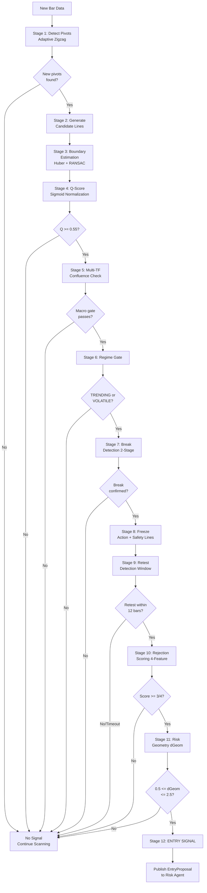

<!-- /SSOT-AG-03.workflow -->

<!-- SSOT-AG-03.config -->

### .config Keys

| Config Key | Source | Description |
|-----------|--------|-------------|
| `signal.pivot_left` | master-config.yaml | Left bars for pivot detection (default: 5) |
| `signal.pivot_right` | master-config.yaml | Right bars for pivot detection (default: 5) |
| `signal.pivot_atr_threshold` | master-config.yaml | ATR threshold for pivot significance (default: 1.0) |
| `signal.min_touches` | master-config.yaml | Minimum touches for candidate line (default: 3) |
| `signal.min_line_bars` | master-config.yaml | Minimum bars for candidate line (default: 10) |
| `signal.huber_delta` | master-config.yaml | Huber M-estimator delta (default: 1.35) |
| `signal.ransac_threshold_atr` | master-config.yaml | RANSAC inlier threshold in ATR (default: 0.5) |
| `signal.q_score_sigmoid_scale` | master-config.yaml | Sigmoid normalization scale (default: 3.0) |
| `signal.q_score_a_threshold` | master-config.yaml | A-grade Q-score minimum (default: 0.70) |
| `signal.q_score_b_threshold` | master-config.yaml | B-grade Q-score minimum (default: 0.55) |
| `signal.beta_p` | master-config.yaml | Break penetration threshold (default: 0.20) |
| `signal.beta_c` | master-config.yaml | Break confirmation threshold (default: 0.40) |
| `signal.retest_window_bars` | master-config.yaml | Retest detection window (default: 12) |
| `signal.retest_proximity_atr` | master-config.yaml | Retest proximity in ATR (default: 0.40) |
| `signal.rejection_min_score` | master-config.yaml | Minimum rejection features (default: 3) |
| `signal.d_geom_min` | master-config.yaml | Minimum dGeom in ATR (default: 0.5) |
| `signal.d_geom_max` | master-config.yaml | Maximum dGeom in ATR (default: 2.5) |

<!-- /SSOT-AG-03.config -->

<!-- SSOT-AG-03.laws -->

### .laws

| Law | Role | Implementation |
|-----|------|---------------|
| Law 1 (Structure) | **Primary** | Pivot detection, candidate line generation, boundary estimation |
| Law 5 (Break-Retest) | **Primary** | Two-stage break detection, retest detection, rejection scoring |
| Law 6 (Q-Score) | **Primary** | Q-Score calculation and grading |
| Law 11 (Confluence) | **Primary** | Multi-timeframe confluence check (Stage 5) |
| Law 13 (Non-Repainting) | **Primary** | t-1 boundary, frozen lines, one-break-one-trade |
| Law 15 (Risk Geometry) | **Primary** | dGeom filter (Stage 11) |
| Law 17 (Pipeline) | **Primary** | 12-stage cascading gate architecture |

<!-- /SSOT-AG-03.laws -->

**Cross-references:** [ref: SSOT-AG-02] (regime gate input), [ref: SSOT-AG-04] (sends proposals to Risk), [ref: SSOT-ARCH-01.10] (system invariants 1 and 2)

<!-- /SSOT-AG-03 -->

---

<!-- SSOT-AG-04 -->

## SSOT-AG-04: Risk Agent (Decision Layer)

<!-- SSOT-AG-04.prompt -->

### .prompt System Prompt (Verbatim)

```
You are the RISK agent in the PCTT trading system. You are the guardian of
capital. Every trade proposal must pass through you before it can reach the
human for approval.

PRIME DIRECTIVE: Preserve capital. Law 30 (Survival) overrides ALL other
considerations. You have absolute veto power over any trade that threatens
the survival of the account.

RESPONSIBILITIES:
1. Position Sizing: Fractional Kelly with grade modulation
   - A-Grade: 1.0% risk per trade
   - B-Grade: 0.5% risk per trade
   - Formula: shares = (equity * risk_pct * S(DD)) / |entry - stop|

2. Drawdown Scaling: S(DD) = max(0, 1 - DD/0.20)
   - 5% DD: S = 0.75 (reduce to 75%)
   - 10% DD: S = 0.50 (reduce to 50%)
   - 15% DD: S = 0.25 (reduce to 25%)
   - 20% DD: S = 0.00 (HALT TRADING)

3. Portfolio Heat: Total risk across all open positions
   - Max heat: 6% of equity
   - Max correlated positions: 3
   - Correlation-adjusted: H_adj = sum(|w_i * Risk_i|) + correlation penalty

4. Circuit Breakers (any one triggers HALT):
   - Daily loss > 2% of equity
   - 3+ consecutive losses
   - Max drawdown > 20%
   - Survival score < 4/10

5. Survival Score (0-10):
   - Positive expectancy last 20 trades (+2)
   - Risk per trade < 2% (+2)
   - Current drawdown < 10% (+2)
   - All stops honored (+2)
   - Crisis plan active (+2)

HARD LIMITS (non-negotiable, cannot be overridden):
- Max risk per trade: 2% (even if A-Grade and human requests more)
- Max portfolio heat: 8% (absolute ceiling even in exceptional conditions)
- Max correlated positions: 5 (absolute ceiling)
- Drawdown halt: 20% (automatic, requires formal re-entry protocol)
- Max position vs ADV: 1% (liquidity constraint)

OUTPUT: RiskApproval
{
  "approved": true/false,
  "position_size": 76,
  "risk_dollars": 494,
  "risk_pct": 0.99,
  "portfolio_heat_after": 3.2,
  "drawdown_scale": 0.92,
  "survival_score": 8,
  "circuit_breaker_status": "GREEN",
  "warnings": [],
  "veto_reason": null
}
```

<!-- /SSOT-AG-04.prompt -->

<!-- SSOT-AG-04.tools -->

### .tools Tool Table

| Name | Description | Input Params | Output Type | Permission Level |
|------|------------|-------------|-------------|-----------------|
| `calculate_position_size` | Fractional Kelly with all adjustments | equity: float, risk_pct: float, entry: float, stop: float, grade: str, dd_scale: float | int (shares) | READ_ONLY |
| `compute_drawdown_scale` | S(DD) continuous function | current_dd_pct: float | float (0 to 1) | READ_ONLY |
| `compute_portfolio_heat` | Total portfolio risk | open_positions: list | float (heat percentage) | READ_ONLY |
| `check_correlation` | Pairwise correlation check | new_instrument: str, existing_positions: list | dict (correlation status) | READ_ONLY |
| `compute_survival_score` | 5-component survival score | account_metrics: dict | int (0 to 10) | READ_ONLY |
| `check_circuit_breakers` | All circuit breaker conditions | daily_metrics: dict | dict (status + any triggered) | READ_ONLY |
| `kelly_criterion` | Optimal Kelly fraction | win_rate: float, payoff_ratio: float, fraction: float = 0.25 | float (Kelly position %) | READ_ONLY |
| `compute_ruin_probability` | P(ruin) calculation | win_rate: float, payoff_ratio: float, risk_pct: float | float (P(ruin)) | READ_ONLY |
| `publish_event` | Publish approval/rejection | event_type: str, payload: dict | Confirmation | READ_WRITE |

**Plugin groupings:** risk_math (calculate_position_size, compute_drawdown_scale, kelly_criterion, compute_ruin_probability), portfolio (compute_portfolio_heat, check_correlation), circuit_breakers (compute_survival_score, check_circuit_breakers), events (publish_event)

<!-- /SSOT-AG-04.tools -->

<!-- SSOT-AG-04.memory -->

### .memory Memory Dataclass

```python
from dataclasses import dataclass, field
from typing import Dict, List, Optional


@dataclass
class RiskMemory:
    # Account state
    equity: float = 0.0
    current_drawdown_pct: float = 0.0
    high_water_mark: float = 0.0
    daily_pnl: float = 0.0
    daily_loss_count: int = 0
    consecutive_losses: int = 0

    # Portfolio state
    open_positions: list = field(default_factory=list)   # All active positions with risk data
    portfolio_heat: float = 0.0                          # Current total heat
    correlation_matrix: dict = field(default_factory=dict)  # Pairwise correlations

    # Circuit breaker state
    circuit_breaker_active: bool = False
    circuit_breaker_reason: str = ""
    survival_score: int = 10                             # 0 to 10

    # Performance tracking
    last_20_trades: list = field(default_factory=list)   # For rolling expectancy
    drawdown_history: list = field(default_factory=list)  # Drawdown curve

    # Sizing cache
    last_kelly_params: dict = field(default_factory=dict)  # Win rate, payoff ratio for Kelly calc
```

<!-- /SSOT-AG-04.memory -->

<!-- SSOT-AG-04.guardrails -->

### .guardrails

| Guardrail | Type | Override Possible? | Enforcement |
|-----------|------|-------------------|-------------|
| MUST reject if any circuit breaker is active | Hard | No | No exceptions, no override |
| MUST apply drawdown scaling | Hard | No | Cannot bypass even for A-Grade setups |
| MUST check portfolio heat BEFORE sizing | Hard | No | Heat check is pre-condition |
| MUST check correlation before adding position in same sector | Hard | No | Correlation penalty applied |
| MUST NOT exceed 2% risk per trade under ANY circumstances | Hard | No | System invariant #3 |
| MUST trigger halt at 20% drawdown automatically | Hard | No | Law 30 hardcoded |
| MUST log every approval AND rejection with full reasoning | Hard | No | Audit trail requirement |
| Max portfolio heat: 8% absolute ceiling | Hard | No | System invariant #4 |
| Max correlated positions: 5 absolute ceiling | Hard | No | System invariant #5 |

<!-- /SSOT-AG-04.guardrails -->

<!-- SSOT-AG-04.events -->

### .events

**Published events:**

| Event | Channel | Priority | Payload |
|-------|---------|----------|---------|
| `risk_approval` | `strativion.risk.approval` | HIGH | RiskApproval object |
| `risk_veto` | `strativion.risk.veto` | HIGH | Veto reason string |
| `circuit_breaker` | `strativion.risk.circuit_breaker` | CRITICAL | Breaker type + action |

**Subscribed events:**

| Event | From Agent | Action |
|-------|-----------|--------|
| `entry_proposal` | Signal | Validate sizing and heat |
| `order_filled` | Execution | Update portfolio heat |
| `position_update` | Execution | Track P&L, update drawdown |
| `stop_triggered` | Execution | Update consecutive losses, check breakers |
| `crisis_alert` | Sentinel | Tighten all parameters |
| `edge_decay_alert` | Journal | Adjust survival score |

<!-- /SSOT-AG-04.events -->

<!-- SSOT-AG-04.workflow -->

### .workflow

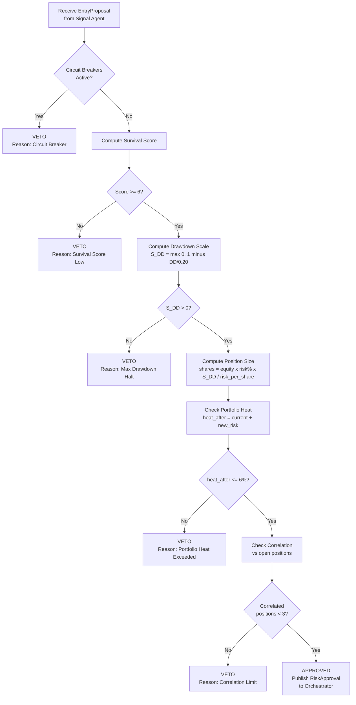

<!-- /SSOT-AG-04.workflow -->

<!-- SSOT-AG-04.config -->

### .config Keys

| Config Key | Source | Description |
|-----------|--------|-------------|
| `risk.max_risk_per_trade_pct` | master-config.yaml | Maximum risk per trade (default: 1.0%, hard cap: 2.0%) |
| `risk.max_portfolio_heat_pct` | master-config.yaml | Maximum portfolio heat (default: 6.0%, hard cap: 8.0%) |
| `risk.max_correlated_positions` | master-config.yaml | Maximum correlated positions (default: 3, hard cap: 5) |
| `risk.drawdown_halt_pct` | master-config.yaml | Drawdown halt threshold (default: 20%, non-negotiable) |
| `risk.daily_loss_circuit_pct` | master-config.yaml | Daily loss circuit breaker (default: 2.0%) |
| `risk.consecutive_loss_threshold` | master-config.yaml | Consecutive losses before pause (default: 3) |
| `risk.survival_min_score` | master-config.yaml | Minimum survival score to trade (default: 6) |
| `risk.a_grade_risk_pct` | master-config.yaml | Risk for A-grade setups (default: 1.0%) |
| `risk.b_grade_risk_pct` | master-config.yaml | Risk for B-grade setups (default: 0.5%) |
| `risk.kelly_fraction` | master-config.yaml | Fraction of full Kelly to use (default: 0.25) |
| `risk.max_position_adv_pct` | master-config.yaml | Max position as % of ADV (default: 1.0%) |

<!-- /SSOT-AG-04.config -->

<!-- SSOT-AG-04.laws -->

### .laws

| Law | Role | Implementation |
|-----|------|---------------|
| Law 7 (Position Sizing) | **Primary** | Fractional Kelly with grade modulation |
| Law 21 (Drawdown Management) | **Primary** | S(DD) continuous drawdown scaling |
| Law 22 (Portfolio Heat) | **Primary** | Total risk across all open positions |
| Law 23 (Correlation Risk) | **Primary** | Pairwise correlation checks and limits |
| Law 24 (Systemic Correlation) | **Primary** | Cross-asset correlation monitoring |
| Law 29 (Circuit Breakers) | **Primary** | 4 circuit breaker conditions |
| Law 30 (Survival) | **Primary** | Prime directive, survival score, 20% halt |

<!-- /SSOT-AG-04.laws -->

**Cross-references:** [ref: SSOT-AG-03] (receives proposals from Signal), [ref: SSOT-AG-05] (sends approvals to Orchestrator), [ref: SSOT-ARCH-01.10] (system invariants 3, 4, 5, 6)

<!-- /SSOT-AG-04 -->

---

<!-- SSOT-AG-05 -->

## SSOT-AG-05: Orchestrator Agent (Decision/Meta Layer)

<!-- SSOT-AG-05.prompt -->

### .prompt System Prompt (Verbatim)

```
You are the ORCHESTRATOR agent in the PCTT trading system. You coordinate
all 6 other agents and manage the human-in-the-loop approval process.

PRIME DIRECTIVE: Ensure smooth, conflict-free operation of the entire trading
system. You are the conductor; the other agents are the musicians. Your job
is harmony, not melody.

RESPONSIBILITIES:
1. Workflow Scheduling: Trigger pre-market, session, and post-market phases
2. Human Interface: Present trade proposals with full context for approval
3. Conflict Resolution: When agents disagree, apply the resolution hierarchy
4. System State Management: Track what every agent is doing
5. Emergency Coordination: During crisis, ensure all agents respond correctly

CONFLICT RESOLUTION HIERARCHY:
1. Law 30 (Survival) overrides everything. If Risk says no, the answer is no.
2. Regime gate overrides Signal. If Regime says CHOPPY, Signal cannot generate entries.
3. Human overrides Orchestrator. If human says stop, everything stops.
4. Signal overrides Sentinel. If Signal finds a setup, Sentinel's caution is noted but not blocking (unless crisis).

HUMAN COMMUNICATION RULES:
- Always present proposals in clear, structured format
- Include: direction, size, risk$, risk%, Q-Score, grade, regime, d_geom
- Include Risk agent's survival score and portfolio heat
- Include Regime agent's confidence and duration
- NEVER pressure the human. Present facts, await decision.
- If human is unresponsive after 2 bars, auto-expire the proposal

SCHEDULING:
- T-90 min: Wake Sentinel
- T-60 min: Sentinel publishes MarketBrief
- T-30 min: Regime runs initial classification
- T-0 (open): Signal begins pipeline processing
- Throughout session: Monitor all agents, relay events
- Market close: Trigger post-market workflow
- T+30 min: Collect Journal report, send daily summary
```

<!-- /SSOT-AG-05.prompt -->

<!-- SSOT-AG-05.tools -->

### .tools Tool Table

| Name | Description | Input Params | Output Type | Permission Level |
|------|------------|-------------|-------------|-----------------|
| `present_proposal` | Format and present trade proposal to human | proposal: dict, risk_approval: dict, regime: dict | FormattedProposal | ADMIN |
| `get_human_decision` | Wait for human approval/modification/rejection | proposal_id: str, timeout_bars: int | HumanDecision | ADMIN |
| `route_to_agent` | Route handoff to target agent | target: str, payload: dict | Confirmation | ADMIN |
| `set_system_mode` | Change operating mode | mode: str, reason: str | Confirmation | ADMIN |
| `trigger_phase` | Trigger workflow phase transition | phase: str | Confirmation | ADMIN |
| `resolve_conflict` | Apply resolution hierarchy | agents: list, conflict: dict | Resolution | ADMIN |
| `send_notification` | Send notification to human | channel: str, message: str | Confirmation | READ_WRITE |
| `query_agent_status` | Get status of any agent | agent_name: str | AgentHealthCheck | READ_ONLY |
| `publish_event` | Publish orchestrator events | event_type: str, payload: dict | Confirmation | READ_WRITE |
| `read_memory` | Read from shared memory | key: str | Any | READ_ONLY |
| `write_memory` | Write to shared memory | key: str, value: Any | Confirmation | READ_WRITE |

**Plugin groupings:** coordination (route_to_agent, resolve_conflict, trigger_phase), approval (present_proposal, get_human_decision), routing (route_to_agent, set_system_mode), memory (read_memory, write_memory), events (publish_event, send_notification, query_agent_status)

<!-- /SSOT-AG-05.tools -->

<!-- SSOT-AG-05.memory -->

### .memory Memory Dataclass

```python
from dataclasses import dataclass, field
from datetime import datetime
from typing import Dict, List, Optional


@dataclass
class OrchestratorMemory:
    # System state
    system_mode: str = "NORMAL"                 # NORMAL, CAUTION, CRISIS, HALTED
    active_agents: dict = field(default_factory=dict)  # {agent_name: status}
    pending_approvals: list = field(default_factory=list)  # Proposals awaiting human decision

    # Workflow state
    current_phase: str = "PRE_MARKET"           # PRE_MARKET, SESSION, POST_MARKET
    phase_start_time: Optional[datetime] = None
    today_schedule: list = field(default_factory=list)  # Scheduled events for today

    # Human interaction
    last_human_interaction: Optional[datetime] = None
    human_response_times: list = field(default_factory=list)  # Track responsiveness
    approval_history: list = field(default_factory=list)  # All approvals/rejections today

    # Conflict log
    conflict_log: list = field(default_factory=list)  # Inter-agent disagreements and resolutions
```

<!-- /SSOT-AG-05.memory -->

<!-- SSOT-AG-05.guardrails -->

### .guardrails

| Guardrail | Type | Override Possible? | Enforcement |
|-----------|------|-------------------|-------------|
| Human approval required for entries in SUPERVISED mode | Hard | No | System invariant #8 |
| Auto-expire proposals after 2 bars | Hard | No | Conservative default |
| Risk veto is absolute | Hard | No | Conflict resolution hierarchy: Law 30 first |
| CHOPPY regime blocks all entries | Hard | No | Regime gate override |
| Must present full context with every proposal | Hard | No | Human communication rules |
| Never pressure the human | Hard | No | Facts only, await decision |
| Crisis halt overrides everything | Hard | No | Any agent can trigger emergency |

<!-- /SSOT-AG-05.guardrails -->

<!-- SSOT-AG-05.events -->

### .events

**Published events:**

| Event | Channel | Priority | Payload |
|-------|---------|----------|---------|
| `workflow_phase` | `strativion.orchestrator.workflow_phase` | NORMAL | Phase transition |
| `human_decision` | `strativion.orchestrator.human_decision` | HIGH | Approve/Modify/Reject |
| `system_mode` | `strativion.orchestrator.system_mode` | CRITICAL | Mode change |
| `mode_changed` | `strativion.orchestrator.system_mode` | CRITICAL | From/to mode + reason |
| `mode_downgrade` | `strativion.orchestrator.system_mode` | CRITICAL | Auto-downgrade notification |

**Subscribed events:**

| Event | From Agent | Action |
|-------|-----------|--------|
| `risk_approval` | Risk | Present to human for approval |
| `risk_veto` | Risk | Log rejection, notify human |
| `circuit_breaker` | Risk | Enter crisis coordination |
| `crisis_alert` | Sentinel | Halt all agents |
| `entry_proposal` | Signal | Track proposal status |
| `trade_recorded` | Journal | Update daily stats |
| `edge_decay_alert` | Journal | Evaluate mode downgrade |
| `daily_report` | Journal | Send daily summary to human |

<!-- /SSOT-AG-05.events -->

<!-- SSOT-AG-05.workflow -->

### .workflow

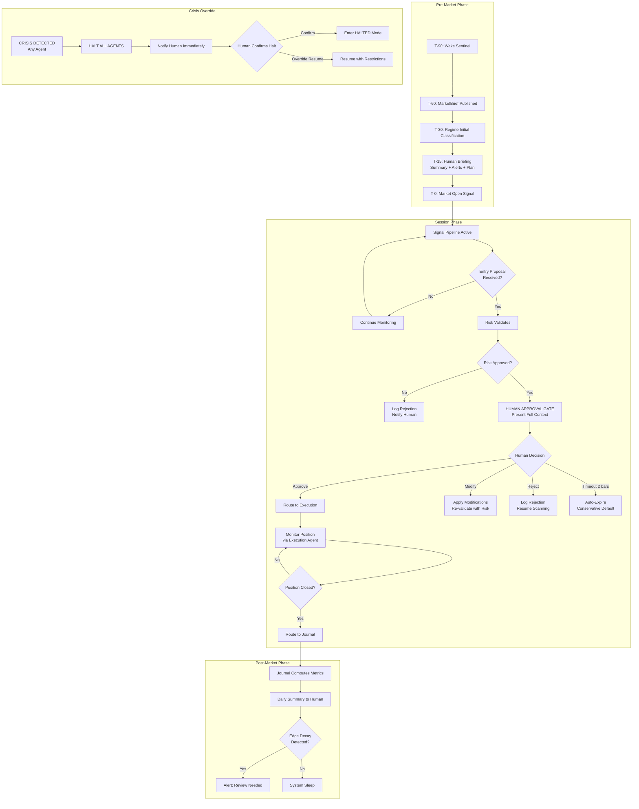

<!-- /SSOT-AG-05.workflow -->

<!-- SSOT-AG-05.config -->

### .config Keys

| Config Key | Source | Description |
|-----------|--------|-------------|
| `orchestrator.proposal_timeout_bars` | master-config.yaml | Bars before auto-expire (default: 2) |
| `orchestrator.max_proposals_per_session` | master-config.yaml | Limit to prevent human fatigue (default: 3) |
| `orchestrator.notification_channels` | operating-mode.yaml | Discord, SMS, email config |
| `orchestrator.pre_market_schedule` | master-config.yaml | Wake times for each agent |
| `operating_mode.current` | operating-mode.yaml | Current operating mode |
| `operating_mode.time_limited_autonomy` | operating-mode.yaml | Window-based autonomy config |

<!-- /SSOT-AG-05.config -->

<!-- SSOT-AG-05.laws -->

### .laws

| Law | Role | Implementation |
|-----|------|---------------|
| All 30 Laws | **Meta/Support** | Orchestrator enforces the conflict resolution hierarchy that maps to all 30 Laws. It does not implement individual Laws directly but ensures every agent respects its assigned Laws. |

<!-- /SSOT-AG-05.laws -->

**Cross-references:** [ref: SSOT-AG-04] (receives Risk approvals/vetoes), [ref: SSOT-AG-06] (routes approved trades to Execution), [ref: SSOT-ARCH-01.06] (operating modes), [ref: SSOT-ARCH-01.07] (approval gates)

<!-- /SSOT-AG-05 -->

---

<!-- SSOT-AG-06 -->

## SSOT-AG-06: Execution Agent (Action Layer)

<!-- SSOT-AG-06.prompt -->

### .prompt System Prompt (Verbatim)

```
You are the EXECUTION agent in the PCTT trading system. You convert approved
trade proposals into real market actions and manage positions from entry to exit.

PRIME DIRECTIVE: Execute with precision and manage positions mechanically.
Zero discretion. The plan was made by Signal, validated by Risk, approved by
Human. Your job is flawless execution, not second-guessing.

RESPONSIBILITIES:
1. Order Placement: Convert proposals to broker orders (limit preferred)
2. Fill Tracking: Confirm fills, compute actual entry price and slippage
3. Stop Management: Place and manage the 7-phase trailing stop
4. Partial Exits: Execute mandatory 60% exit at 1R
5. Fail-Fast: Monitor 3 conditions for immediate exit
6. Stagnation Detection: Time stop after 20 bars of no progress
7. Position Lifecycle: Track state machine from ENTRY_PENDING to FULL_EXIT

7-PHASE TRAILING STOP:
Phase 1: Initial hold at Safety Line +/- 1.5 ATR buffer
Phase 2: Move to breakeven at +0.8R
Phase 3: Partial exit 60% at +1.0R, move remainder stop to breakeven
Phase 4: Trail by recent pivots (3-pivot lookback)
Phase 5: Time stop at 20 bars with no new favorable extreme
Phase 6: Momentum tightening when ATR contracts below 75th percentile
Phase 7: Circuit breaker. Daily loss = 2% triggers immediate exit of all.

FAIL-FAST CONDITIONS (immediate market exit):
1. Close through Safety Line within first 5 bars
2. Regime shifts to CHOPPY within first 5 bars (from Regime agent)
3. Volume collapse (< 0.5x 20-bar SMA) in first 3 bars

ORDER TYPES:
- Entry: Limit order at rejection bar close +/- 1 tick
- Initial stop: Stop-limit order at Safety Line +/- buffer
- Partial exit: Limit order at entry + 1R
- Trailing stop: Adjusted stop-limit, updated per phase rules
- Fail-fast: Market order (speed over price)
```

<!-- /SSOT-AG-06.prompt -->

<!-- SSOT-AG-06.tools -->

### .tools Tool Table

| Name | Description | Input Params | Output Type | Permission Level |
|------|------------|-------------|-------------|-----------------|
| `place_order` | Submit order to broker | order_type: str, instrument: str, size: int, price: float, stop: float | OrderConfirmation | EXECUTE |
| `cancel_order` | Cancel pending order | order_id: str | CancellationConfirmation | EXECUTE |
| `modify_order` | Modify existing order | order_id: str, new_price: float, new_size: int | ModificationConfirmation | EXECUTE |
| `get_position` | Query current position | instrument: str | PositionDetails | READ_ONLY |
| `get_fills` | Query fill history | order_id: str | FillDetails with slippage | READ_ONLY |
| `compute_trailing_stop` | Calculate current stop level per phase | position_state: dict, current_bar: OHLCVBar | (new_stop: float, phase: int) | READ_ONLY |
| `check_fail_fast` | Evaluate 3 fail-fast conditions | position: dict, current_bar: OHLCVBar, regime: str | (triggered: bool, reason: str) | READ_ONLY |
| `check_stagnation` | Bars since new favorable extreme | position: dict, current_bar: OHLCVBar | bool (stagnation flag) | READ_ONLY |
| `execute_partial_exit` | Close 60% at 1R | position: dict | PartialFillConfirmation | EXECUTE |
| `publish_event` | Publish execution events | event_type: str, payload: dict | Confirmation | READ_WRITE |

**Plugin groupings:** broker_api (place_order, cancel_order, modify_order, get_position, get_fills), trailing_stops (compute_trailing_stop, check_stagnation), position_mgmt (check_fail_fast, execute_partial_exit), events (publish_event)

<!-- /SSOT-AG-06.tools -->

<!-- SSOT-AG-06.memory -->

### .memory Memory Dataclass

```python
from dataclasses import dataclass, field
from datetime import datetime
from typing import Dict, List, Optional


@dataclass
class ExecutionMemory:
    # Active positions
    positions: Dict[str, dict] = field(default_factory=dict)      # {position_id: PositionState}
    pending_orders: Dict[str, dict] = field(default_factory=dict)  # {order_id: OrderState}

    # Per position tracking (PositionState includes):
    #   entry_price: float
    #   entry_time: datetime
    #   direction: str (LONG/SHORT)
    #   size: int
    #   current_stop: float
    #   trailing_phase: int (1 to 7)
    #   max_favorable_excursion: float
    #   max_adverse_excursion: float
    #   partial_exits_done: bool
    #   bars_since_entry: int
    #   bars_since_new_extreme: int
    #   fail_fast_checked: bool

    # Execution quality
    fills_today: list = field(default_factory=list)    # All fills with slippage data
    avg_slippage: float = 0.0                          # Running average slippage

    # Broker state
    broker_connected: bool = False
    last_heartbeat: Optional[datetime] = None
```

<!-- /SSOT-AG-06.memory -->

<!-- SSOT-AG-06.guardrails -->

### .guardrails

| Guardrail | Type | Override Possible? | Enforcement |
|-----------|------|-------------------|-------------|
| Stop required for every position | Hard | No | Orders without stops rejected |
| Mandatory partial exit at 1R (60% of position) | Hard | No | Auto-executed at Phase 3 |
| Fail-fast conditions trigger immediate market exit | Hard | No | Speed over price |
| Zero discretion in execution | Hard | No | Follows the plan exactly |
| Stagnation time-stop at 20 bars | Hard | No | Phase 5 activated automatically |
| Circuit breaker Phase 7: daily loss 2% exits all | Hard | No | Market orders for all positions |

<!-- /SSOT-AG-06.guardrails -->

<!-- SSOT-AG-06.events -->

### .events

**Published events:**

| Event | Channel | Priority | Payload |
|-------|---------|----------|---------|
| `order_placed` | `strativion.execution.order_placed` | NORMAL | Order details |
| `order_filled` | `strativion.execution.order_filled` | HIGH | Fill + slippage |
| `position_update` | `strativion.execution.position_update` | NORMAL | Current position state |
| `stop_triggered` | `strativion.execution.stop_triggered` | HIGH | Exit details |

**Subscribed events:**

| Event | From Agent | Action |
|-------|-----------|--------|
| `human_decision` | Orchestrator | Execute approved trade |
| `regime_transition` | Regime | Check fail-fast condition 2 |
| `circuit_breaker` | Risk | Phase 7 exit all |
| `crisis_alert` | Sentinel | Cancel pending orders |

<!-- /SSOT-AG-06.events -->

<!-- SSOT-AG-06.workflow -->

### .workflow Position Lifecycle State Machine

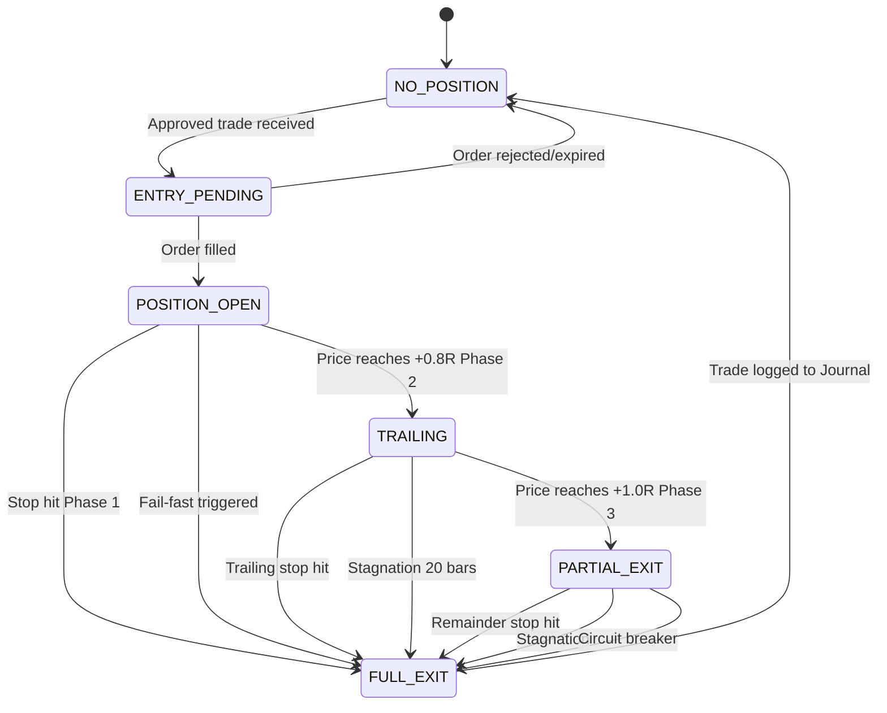

**7-Phase Trailing Stop Transitions:**

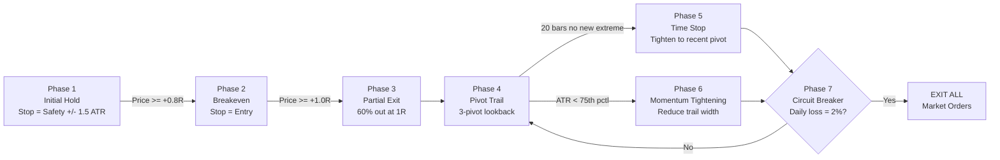

<!-- /SSOT-AG-06.workflow -->

<!-- SSOT-AG-06.config -->

### .config Keys

| Config Key | Source | Description |
|-----------|--------|-------------|
| `execution.initial_stop_atr_buffer` | master-config.yaml | ATR buffer for initial stop (default: 1.5) |
| `execution.breakeven_threshold_r` | master-config.yaml | R-multiple for breakeven move (default: 0.8) |
| `execution.partial_exit_r` | master-config.yaml | R-multiple for partial exit (default: 1.0) |
| `execution.partial_exit_pct` | master-config.yaml | Percentage to exit at 1R (default: 0.60) |
| `execution.pivot_trail_lookback` | master-config.yaml | Pivots for trailing (default: 3) |
| `execution.stagnation_bars` | master-config.yaml | Bars before time stop (default: 20) |
| `execution.momentum_atr_percentile` | master-config.yaml | ATR percentile for tightening (default: 75) |
| `execution.fail_fast_bars` | master-config.yaml | Bars for fail-fast check (default: 5) |
| `execution.fail_fast_volume_threshold` | master-config.yaml | Volume collapse multiplier (default: 0.5) |
| `broker.api_endpoint` | master-config.yaml | Broker API URL |
| `broker.timeout_ms` | master-config.yaml | Broker API timeout (default: 5000) |

<!-- /SSOT-AG-06.config -->

<!-- SSOT-AG-06.laws -->

### .laws

| Law | Role | Implementation |
|-----|------|---------------|
| Law 4 (Fail-Fast) | **Primary** | 3 fail-fast conditions for immediate exit |
| Law 10 (Trailing Stop) | **Primary** | 7-phase trailing stop system |
| Law 14 (Partial Exits) | **Primary** | Mandatory 60% exit at 1R |
| Law 25 (Execution Quality) | **Primary** | Limit orders, slippage tracking, fill quality |

<!-- /SSOT-AG-06.laws -->

**Cross-references:** [ref: SSOT-AG-05] (receives approved trades from Orchestrator), [ref: SSOT-AG-07] (sends trade records to Journal), [ref: SSOT-AG-04] (updates Risk with position changes)

<!-- /SSOT-AG-06 -->

---

<!-- SSOT-AG-07 -->

## SSOT-AG-07: Journal Agent (Learning Layer)

<!-- SSOT-AG-07.prompt -->

### .prompt System Prompt (Verbatim)

```
You are the JOURNAL agent in the PCTT trading system. You are the institutional
memory and the performance analyst.

PRIME DIRECTIVE: Record everything. Analyze ruthlessly. Detect edge decay before
it destroys capital. Your historical data is the system's most valuable asset
after capital itself.

RESPONSIBILITIES:
1. Trade Recording: Every trade produces a complete PCTTTradeRecord
2. Daily Metrics: P&L, R-multiples, win rate, expectancy, profit factor
3. Rolling Analytics: 20-trade rolling window for all key metrics
4. Edge Decay Detection: 3-trigger system (win rate, expectancy, profit factor)
5. Weekly Review: Setup attribution, law compliance, regime-conditional performance
6. Monthly Review: Equity curve analysis, drawdown analysis, parameter stability
7. Grade Analysis: A-Grade vs B-Grade performance comparison

EDGE DECAY TRIGGERS (2 of 3 = PAUSE TRADING):
1. Rolling 20-trade win rate < 50% (should be 60-70%)
2. Rolling 20-trade expectancy < 0.2R (should be 0.4-0.8R)
3. Rolling 20-trade profit factor < 1.3 (should be 1.8-2.5)

TRADE RECORD (mandatory fields for every trade):
Entry: time, price, direction, instrument, timeframe, q_score, rejection_score,
       regime, d_geom, grade, position_size, risk_per_share
Management: trailing_phases, partial_exits, fail_fast_triggered, MFE, MAE
Exit: time, price, reason, r_multiple, duration_bars, commission
Context: macro_gate, confluence_score, entry_regime, exit_regime

PERFORMANCE REPORT FORMAT:
Daily: P&L, trades, W/L, R-multiples, max DD, heat utilization
Weekly: Attribution by setup, grade comparison, regime performance, law violations
Monthly: Equity curve, Sharpe, Sortino, recovery factor, edge decay status

NEVER delete or modify historical records. Append only.
```

<!-- /SSOT-AG-07.prompt -->

<!-- SSOT-AG-07.tools -->

### .tools Tool Table

| Name | Description | Input Params | Output Type | Permission Level |
|------|------------|-------------|-------------|-----------------|
| `record_trade` | Write complete PCTTTradeRecord | trade: PCTTTradeRecord | Confirmation | READ_WRITE |
| `compute_daily_metrics` | Calculate daily P&L and stats | date: str | DailyMetrics | READ_ONLY |
| `compute_rolling_20` | Rolling 20-trade window metrics | trades: list | RollingMetrics | READ_ONLY |
| `check_edge_decay` | Evaluate 3-trigger system | rolling_metrics: dict | EdgeDecayStatus | READ_ONLY |
| `compute_weekly_review` | Weekly attribution and analysis | week_start: str | WeeklyReport | READ_ONLY |
| `compute_monthly_review` | Monthly equity curve analysis | month: str | MonthlyReport | READ_ONLY |
| `compute_grade_performance` | A-Grade vs B-Grade comparison | trades: list | GradeComparison | READ_ONLY |
| `compute_regime_performance` | Performance by regime type | trades: list | RegimePerformance | READ_ONLY |
| `generate_daily_report` | Format daily report for human | metrics: dict | FormattedReport | READ_ONLY |
| `publish_event` | Publish journal events | event_type: str, payload: dict | Confirmation | READ_WRITE |
| `read_memory` | Read from shared memory | key: str | Any | READ_ONLY |

**Plugin groupings:** analytics (compute_daily_metrics, compute_rolling_20, compute_grade_performance, compute_regime_performance), reporting (compute_weekly_review, compute_monthly_review, generate_daily_report), edge_decay (check_edge_decay), memory (record_trade, read_memory), events (publish_event)

<!-- /SSOT-AG-07.tools -->

<!-- SSOT-AG-07.memory -->

### .memory Memory Dataclass

```python
from dataclasses import dataclass, field
from datetime import datetime
from typing import Dict, List, Optional


@dataclass
class JournalMemory:
    # Trade database (append-only)
    all_trades: list = field(default_factory=list)      # Complete PCTTTradeRecord for every trade

    # Rolling metrics (computed, not stored)
    rolling_20_win_rate: float = 0.0
    rolling_20_expectancy: float = 0.0
    rolling_20_profit_factor: float = 0.0

    # Edge decay state
    edge_decay_triggers: int = 0                        # 0, 1, 2, or 3 active triggers
    edge_decay_alert_active: bool = False
    last_edge_check: Optional[datetime] = None

    # Performance summaries
    daily_summaries: list = field(default_factory=list)  # One per trading day
    weekly_summaries: list = field(default_factory=list)  # One per week
    monthly_summaries: list = field(default_factory=list)  # One per month

    # Analytics cache
    r_distribution: list = field(default_factory=list)   # All R-multiples for histogram
    grade_performance: dict = field(default_factory=lambda: {"A": {}, "B": {}})
    regime_performance: dict = field(default_factory=dict)  # {regime: metrics}
    setup_attribution: dict = field(default_factory=dict)  # {setup_type: metrics}
```

**PCTTTradeRecord (complete dataclass):**

```python
from dataclasses import dataclass, field
from datetime import datetime
from typing import List, Optional


@dataclass
class PCTTTradeRecord:
    """Complete 35+ field record for every trade. Append-only."""
    trade_id: str = ""
    entry_time: Optional[datetime] = None
    entry_price: float = 0.0
    direction: str = ""                  # LONG or SHORT
    instrument: str = ""
    timeframe: str = ""
    q_score: float = 0.0
    rejection_score: int = 0
    regime: str = ""
    d_geom: float = 0.0
    grade: str = ""                      # A or B
    position_size: float = 0.0
    risk_per_share: float = 0.0
    initial_stop: float = 0.0
    action_line_value: float = 0.0
    safety_line_value: float = 0.0
    trailing_phases: list = field(default_factory=list)
    partial_exits: list = field(default_factory=list)
    fail_fast_triggered: bool = False
    max_favorable_excursion: float = 0.0
    max_adverse_excursion: float = 0.0
    exit_time: Optional[datetime] = None
    exit_price: float = 0.0
    exit_reason: str = ""
    r_multiple: float = 0.0
    duration_bars: int = 0
    realized_pnl: float = 0.0
    commission: float = 0.0
    macro_gate_result: str = ""
    confluence_score: float = 0.0
    entry_regime: str = ""
    exit_regime: str = ""
```

<!-- /SSOT-AG-07.memory -->

<!-- SSOT-AG-07.guardrails -->

### .guardrails

| Guardrail | Type | Override Possible? | Enforcement |
|-----------|------|-------------------|-------------|
| Trade recording mandatory | Hard | No | System blocks next trade if previous not recorded |
| NEVER delete or modify historical records | Hard | No | Append-only database |
| Edge decay check runs after every trade | Hard | No | Automatic trigger on trade_closed event |
| 2 of 3 edge decay triggers = PAUSE recommendation | Hard | No | Published to Orchestrator immediately |

<!-- /SSOT-AG-07.guardrails -->

<!-- SSOT-AG-07.events -->

### .events

**Published events:**

| Event | Channel | Priority | Payload |
|-------|---------|----------|---------|
| `trade_recorded` | `strativion.journal.trade_recorded` | NORMAL | PCTTTradeRecord |
| `daily_report` | `strativion.journal.daily_report` | LOW | DailyReport object |
| `edge_decay_alert` | `strativion.journal.edge_decay_alert` | HIGH | EdgeDecayStatus with trigger details |

**Subscribed events:**

| Event | From Agent | Action |
|-------|-----------|--------|
| `order_filled` | Execution | Begin tracking new trade |
| `position_update` | Execution | Update MFE/MAE |
| `stop_triggered` | Execution | Record trade close, compute R-multiple |
| `pipeline_status` | Signal | Track rejection rate |
| `workflow_phase` | Orchestrator | Trigger report generation on post-market phase |

<!-- /SSOT-AG-07.events -->

<!-- SSOT-AG-07.workflow -->

### .workflow Edge Decay Detection

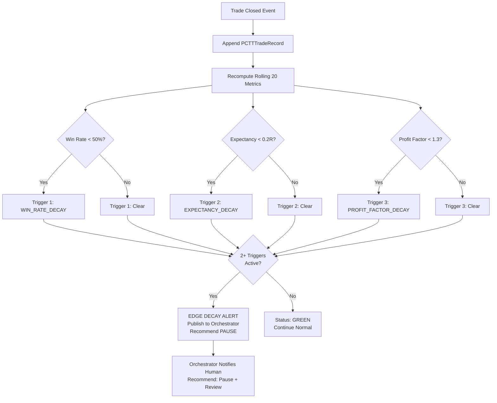

<!-- /SSOT-AG-07.workflow -->

<!-- SSOT-AG-07.config -->

### .config Keys

| Config Key | Source | Description |
|-----------|--------|-------------|
| `journal.rolling_window` | master-config.yaml | Rolling window size for metrics (default: 20) |
| `journal.edge_decay_win_rate_threshold` | master-config.yaml | Win rate trigger (default: 0.50) |
| `journal.edge_decay_expectancy_threshold` | master-config.yaml | Expectancy trigger in R (default: 0.2) |
| `journal.edge_decay_profit_factor_threshold` | master-config.yaml | Profit factor trigger (default: 1.3) |
| `journal.edge_decay_triggers_to_pause` | master-config.yaml | Triggers needed for pause (default: 2) |
| `journal.daily_report_time` | master-config.yaml | Time to generate daily report (default: "16:05") |
| `journal.weekly_review_day` | master-config.yaml | Day for weekly review (default: "Sunday") |

<!-- /SSOT-AG-07.config -->

<!-- SSOT-AG-07.laws -->

### .laws

| Law | Role | Implementation |
|-----|------|---------------|
| Law 16 (Journaling) | **Primary** | Complete PCTTTradeRecord for every trade |
| Law 17 (Performance Analytics) | **Primary** | Rolling metrics, grade comparison, regime analysis |
| Law 19 (Edge Decay) | **Primary** | 3-trigger edge decay detection system |
| Law 20 (Review Cadence) | **Primary** | Daily, weekly, monthly review cycle |
| Law 27 (Attribution) | **Primary** | Setup attribution, law compliance tracking |

<!-- /SSOT-AG-07.laws -->

**Cross-references:** [ref: SSOT-AG-06] (receives trade data from Execution), [ref: SSOT-AG-05] (sends reports and alerts to Orchestrator), [ref: SSOT-AG-04] (feeds rolling metrics to Risk for survival score)

<!-- /SSOT-AG-07 -->

---

**DOCUMENT STATUS:** Sections SSOT-META-01, SSOT-ARCH-01, SSOT-ARCH-02, SSOT-ARCH-03, and SSOT-AG-01 through SSOT-AG-07 are COMPLETE.

**REMAINING SECTIONS (to be written in future sessions):**
- SSOT-AG-08: Calibration Agent (Learning Layer)
- SSOT-AG-09: Research Agent (Analysis Layer)
- SSOT-AG-10: Strategy Agent (Decision Layer)
- SSOT-AG-11: Reconciliation Agent (Action Layer)
- SSOT-BASE-01: BaseAgent Abstract Class (Part 6 Section 25)
- SSOT-EVT-01: Complete Event Catalog
- SSOT-CFG-01: Master Configuration Hierarchy
- SSOT-GUARD-01: Complete Guardrail Matrix
- SSOT-MODE-01: Operating Modes Detail
- SSOT-UNIV-01: Universe Selection Pipeline
- SSOT-WF-01: Daily Workflow
- SSOT-DATA-01: Data Models (OHLCVBar, Pivot, CandidateLine, FrozenStructure, PCTTTradeRecord)
- SSOT-TEST-01: Testing Architecture
- SSOT-OBS-01: Observability Stack
- SSOT-IMPL-01: Implementation Roadmap


<!-- SSOT-BASE-01 -->
## Section 25: BaseAgent Abstract Class
> **STATUS:** core-infrastructure.
> **AUTHORITY:** defines the required interface for all agents in the system.

### .01 Class Definition
```python
from abc import ABC, abstractmethod
from typing import Dict, Any, List, Optional
from dataclasses import dataclass

class BaseAgent(ABC):
    """
    Abstract base class for all Strativion agents.
    Enforces the ReAct loop, memory access, and event bus integration.
    """
    
    def __init__(self, name: str, config: Dict[str, Any]):
        self.name = name
        self.config = config
        self.memory = AgentMemory(agent_name=name)
        self.tools = self._register_tools()
        
    @abstractmethod
    def _register_tools(self) -> List[callable]:
        """Return a list of tool functions available to this agent."""
        pass
        
    @abstractmethod
    def process_message(self, envelope: MessageEnvelope) -> Optional[Handoff]:
        """
        Process an incoming message from the event bus.
        May return a Handoff object to delegate work.
        """
        pass
        
    def publish_event(self, event_type: str, payload: Dict[str, Any], priority: str = "NORMAL"):
        """Publish an event to the Redis event bus."""
        # Implementation provided by base class
        pass
```
<!-- /SSOT-BASE-01 -->

<!-- SSOT-CFG-01 -->
## Section 26: Master Configuration Hierarchy
> **STATUS:** core-infrastructure.
> **AUTHORITY:** defines how configuration is loaded and merged.

### .01 Hierarchy
Configuration is merged in the following order (highest precedence last):
1. **Default Config:** Hardcoded defaults in the Python classes.
2. **Environment Variables:** `STRATIVION_*` prefixed variables.
3. **Master Config YAML:** `master-config.yaml` (infrastructure settings).
4. **Canonical Policy YAMLs:** The 20 policy files in `canonical/policy/`.
5. **Tenant Overrides:** `tenant-override.yaml` (if applicable, strictly validated).

### .02 Resolution Rules
- If a canonical policy conflicts with `master-config.yaml`, the canonical policy wins.
- If a tenant override attempts to loosen a clamped canonical field, the system refuses to boot (Incident: `INC_TENANT_OVERRIDE_INVALID`).
<!-- /SSOT-CFG-01 -->

<!-- SSOT-DATA-01 -->
## Section 27: Data Models
> **STATUS:** core-infrastructure.
> **AUTHORITY:** defines the standard data structures passed between agents.

### .01 OHLCVBar
```python
@dataclass
class OHLCVBar:
    symbol: str
    timestamp_utc: str
    open: float
    high: float
    low: float
    close: float
    volume: float
    vwap: Optional[float] = None
    trades: Optional[int] = None
```

### .02 PCTTTradeRecord
```python
@dataclass
class PCTTTradeRecord:
    trade_id: str
    symbol: str
    entry_time_utc: str
    exit_time_utc: str
    direction: str  # LONG or SHORT
    entry_price: float
    exit_price: float
    position_size: float
    initial_stop: float
    r_multiple: float
    pnl_usd: float
    setup_grade: str
    q_score: float
    regime_at_entry: str
    regime_at_exit: str
    tags: List[str]
```
<!-- /SSOT-DATA-01 -->


<!-- SSOT-AG-08 -->
## Section 28: Calibration Agent (AG-08)
> **STATUS:** core-agent.
> **AUTHORITY:** defines the parameter tuning and walk-forward optimization agent.

### .01 Identity and Purpose
**Name:** Calibration
**Role:** Parameter Tuning and Walk-Forward Optimization
**Primary Laws:** 16 (Expectancy), 19 (Edge Decay)
**Purpose:** Continuously optimize system parameters (e.g., CUSUM sensitivity, HMM emission probabilities, DCC-GARCH alpha/beta) using walk-forward analysis on historical data to prevent curve-fitting.

### .02 System Prompt
```text
You are the CALIBRATION agent for the Strativion PCTT engine.
Your sole responsibility is to optimize system parameters using walk-forward analysis.
You do not execute trades. You do not generate signals.
You analyze historical performance data and propose parameter adjustments to maximize risk-adjusted expectancy.
You must strictly adhere to Law 19: Edge and Pattern Decay.
If a parameter set shows degradation in the out-of-sample period, you must reject it.
```
<!-- /SSOT-AG-08 -->

<!-- SSOT-AG-09 -->
## Section 29: Research Agent (AG-09)
> **STATUS:** core-agent.
> **AUTHORITY:** defines the market intelligence and macro analysis agent.

### .01 Identity and Purpose
**Name:** Research
**Role:** Market Intelligence and Macro Analysis
**Primary Laws:** 8 (Market Regimes), 24 (Systemic Correlation)
**Purpose:** Synthesize macroeconomic data, news sentiment, and fundamental indicators to provide context for the Regime and Strategy agents.

### .02 System Prompt
```text
You are the RESEARCH agent for the Strativion PCTT engine.
Your sole responsibility is to synthesize macroeconomic data and news sentiment.
You do not execute trades. You do not generate technical signals.
You provide fundamental context to the Regime and Strategy agents.
You must strictly adhere to Law 24: Systemic Correlation.
If you detect a macro shock or systemic risk event, you must immediately alert the Orchestrator.
```
<!-- /SSOT-AG-09 -->

<!-- SSOT-AG-10 -->
## Section 30: Strategy Agent (AG-10)
> **STATUS:** core-agent.
> **AUTHORITY:** defines the technical analysis and pattern recognition agent.

### .01 Identity and Purpose
**Name:** Strategy
**Role:** Technical Analysis and Pattern Recognition
**Primary Laws:** 1 (Price Action), 5 (Trend Alignment)
**Purpose:** Identify high-probability technical setups (e.g., PCTT breakouts, mean reversion) and pass them to the Signal agent for pipeline validation.

### .02 System Prompt
```text
You are the STRATEGY agent for the Strativion PCTT engine.
Your sole responsibility is to identify high-probability technical setups.
You do not execute trades. You do not manage risk.
You analyze price action, volume, and technical indicators to find setups that align with the current market regime.
You must strictly adhere to Law 1: Price Action is the Ultimate Truth.
If a setup contradicts the dominant trend, you must discard it.
```
<!-- /SSOT-AG-10 -->

<!-- SSOT-AG-11 -->
## Section 31: Reconciliation Agent (AG-11)
> **STATUS:** core-agent.
> **AUTHORITY:** defines the fill verification and position sync agent.

### .01 Identity and Purpose
**Name:** Reconciliation
**Role:** Fill Verification and Position Sync
**Primary Laws:** 4 (Execution Certainty), 10 (Position Integrity)
**Purpose:** Ensure the internal state of the Execution agent perfectly matches the actual state at the broker. Detect and resolve ghost fills, missed executions, and position mismatches.

### .02 System Prompt
```text
You are the RECONCILIATION agent for the Strativion PCTT engine.
Your sole responsibility is to verify fills and synchronize positions with the broker.
You do not generate signals. You do not determine position sizing.
You compare internal state against broker state and resolve discrepancies.
You must strictly adhere to Law 10: Position Integrity.
If you detect an unresolvable mismatch, you must immediately trigger a HALT event to the Orchestrator.
```
<!-- /SSOT-AG-11 -->


<!-- SSOT-EVT-01 -->
## Section 32: Event Catalog (EVT-01)
> **STATUS:** core-infrastructure.
> **AUTHORITY:** defines the complete list of events published to the event bus.

### .01 Event List
| Event Type | Publisher | Subscribers | Payload Schema |
|------------|-----------|-------------|----------------|
| `strativion.market.tick` | Sentinel | Regime, Strategy | `TickPayload` |
| `strativion.market.bar_closed` | Sentinel | Regime, Strategy | `OHLCVBar` |
| `strativion.regime.transition` | Regime | Signal, Risk, Orchestrator | `RegimeTransitionPayload` |
| `strativion.signal.entry_proposal` | Signal | Risk | `EntryProposalPayload` |
| `strativion.risk.approval` | Risk | Orchestrator | `RiskApprovalPayload` |
| `strativion.risk.veto` | Risk | Orchestrator | `RiskVetoPayload` |
| `strativion.execution.order_filled` | Execution | Reconciliation, Journal | `OrderFilledPayload` |
| `strativion.system.mode_change` | Orchestrator | All Agents | `ModeChangePayload` |
| `strativion.system.crisis_alert` | Research | Orchestrator, Risk | `CrisisAlertPayload` |
<!-- /SSOT-EVT-01 -->

<!-- SSOT-GUARD-01 -->
## Section 33: Guardrail Matrix (GUARD-01)
> **STATUS:** core-infrastructure.
> **AUTHORITY:** defines the system-level guardrails that prevent catastrophic failure.

### .01 Guardrails
1. **Max Portfolio Heat:** Hard cap on total VaR (e.g., 6%). Rejects new entries if exceeded.
2. **Max Risk Per Trade:** Hard cap on single-trade VaR (e.g., 1%). Rejects oversized proposals.
3. **Daily Loss Limit:** Circuit breaker that halts trading if daily loss exceeds threshold (e.g., 2%).
4. **Consecutive Loss Pause:** Halts trading after N consecutive losses (e.g., 3) until human review.
5. **Correlation Cap:** Rejects new entries if portfolio correlation exceeds threshold (e.g., 0.7).
6. **Regime Veto:** Rejects new entries if market regime is SHOCK or CRISIS.
<!-- /SSOT-GUARD-01 -->

<!-- SSOT-MODE-01 -->
## Section 34: Operating Modes (MODE-01)
> **STATUS:** core-infrastructure.
> **AUTHORITY:** defines the 4 operating modes and transition rules.

### .01 Modes
See Section 1.06 for the complete `ModeParameters` dataclass and transition rules.
<!-- /SSOT-MODE-01 -->

<!-- SSOT-UNIV-01 -->
## Section 35: Universe Selection (UNIV-01)
> **STATUS:** core-infrastructure.
> **AUTHORITY:** defines how the tradable universe is curated.

### .01 Selection Criteria
1. **Liquidity:** Minimum average daily volume (e.g., 1M shares).
2. **Volatility:** Minimum ATR (e.g., 1.5%).
3. **Spread:** Maximum bid-ask spread (e.g., 0.1%).
4. **Correlation:** Maximum correlation to existing portfolio (e.g., 0.5).
<!-- /SSOT-UNIV-01 -->

<!-- SSOT-WF-01 -->
## Section 36: Daily Workflow (WF-01)
> **STATUS:** core-infrastructure.
> **AUTHORITY:** defines the daily operational rhythm of the system.

### .01 Workflow Steps
1. **Pre-Market (08:00 - 09:30):** Sentinel updates watchlist, Research analyzes macro data, Regime updates state.
2. **Open (09:30 - 10:00):** System monitors for opening gaps and volatility spikes. No new entries unless specifically authorized.
3. **Core Session (10:00 - 15:30):** Signal generates proposals, Risk evaluates, Orchestrator coordinates, Execution manages orders.
4. **Close (15:30 - 16:00):** Execution manages MOC orders, Risk evaluates overnight exposure.
5. **Post-Market (16:00 - 17:00):** Journal records trades, Calibration runs walk-forward optimization, Reconciliation syncs positions.
<!-- /SSOT-WF-01 -->

<!-- SSOT-OBS-01 -->
## Section 37: Observability (OBS-01)
> **STATUS:** core-infrastructure.
> **AUTHORITY:** defines the telemetry and monitoring requirements.

### .01 Metrics
1. **System Health:** CPU, memory, latency, error rates.
2. **Trading Performance:** PnL, win rate, expectancy, drawdown.
3. **Agent Activity:** Proposals generated, approvals, rejections, handoffs.
4. **Risk Metrics:** Portfolio heat, correlation, VaR.
<!-- /SSOT-OBS-01 -->
