# PCTT Agentic System Architecture (Part 2)

## 6. A Day in the Life: Complete Daily Workflow

This section maps the agentic system's daily workflow to the book's practical routines from Chapters 25-31 (Section 6: The Trader's Day).

### 6.1 Daily Timeline Overview

```mermaid
gantt
    title PCTT Agentic System Daily Schedule (US Equities)
    dateFormat HH:mm
    axisFormat %H:%M

    section Sentinel
    Wake + Data Collection      :s1, 08:00, 30min
    Gap Analysis + News Scan    :s2, after s1, 15min
    MarketBrief Publication     :s3, after s2, 15min
    Session Monitoring          :s4, 09:30, 390min
    Post-Market Wind Down       :s5, 16:00, 30min

    section Regime
    Initial Classification      :r1, 08:45, 15min
    Continuous Monitoring        :r2, 09:30, 390min

    section Signal
    Pre-scan Structures          :sg1, 09:00, 30min
    Pipeline Active              :sg2, 09:35, 385min

    section Risk
    Portfolio Health Check       :rk1, 08:30, 15min
    Continuous Validation        :rk2, 09:30, 390min

    section Orchestrator
    Wake All Agents              :o1, 08:00, 5min
    Human Briefing               :o2, 09:15, 15min
    Session Coordination         :o3, 09:30, 390min
    Trigger Post-Market          :o4, 16:00, 5min

    section Execution
    Verify Broker Connection     :e1, 09:20, 10min
    Position Management          :e2, 09:30, 390min
    EOD Position Review          :e3, 15:45, 15min

    section Journal
    Load Yesterday's State       :j1, 08:00, 10min
    Real-time Recording          :j2, 09:30, 390min
    Daily Report Generation      :j3, 16:05, 25min
    Report to Human              :j4, after j3, 5min

    section Human
    Review MarketBrief           :h1, 09:15, 15min
    Session: Approve/Reject      :h2, 09:30, 390min
    Review Daily Report          :h3, 16:30, 15min
```

### 6.2 Phase 1: Pre-Market (08:00-09:30 ET)

**Book Reference:** Chapter 25 "Before the Bell: Pre-Market Preparation Protocol"

The book prescribes a 25-35 minute pre-market routine. The agentic system automates and extends this to 90 minutes, starting at 08:00 ET.

#### 6.2.1 Sentinel Pre-Market Workflow (08:00-08:45)

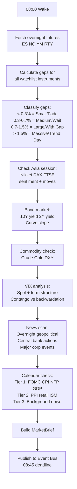

**Automated Pre-Market Preparation Worksheet (from Chapter 25):**

```python
@dataclass
class PreMarketWorksheet:
    # Step 1: Overnight futures
    es_gap_pct: float
    nq_gap_pct: float
    gap_classification: str  # SMALL, MEDIUM, LARGE, MASSIVE

    # Step 2: Global sentiment
    asia_direction: str  # BULLISH, BEARISH, MIXED
    europe_direction: str

    # Step 3: Bond market
    yield_10y: float
    yield_2y: float
    curve_slope: float  # Positive = normal, negative = inverted

    # Step 4: VIX regime
    vix_level: float
    vix_regime: str  # LOW_VOL, NORMAL, ELEVATED, CRISIS
    vix_direction: str  # RISING, FALLING, FLAT
    term_structure: str  # CONTANGO, BACKWARDATION

    # Step 5: Commodities
    crude_direction: str
    gold_direction: str
    dxy_direction: str

    # Step 6: Calendar
    tier_1_events: list  # [{event, time, expected_impact}]
    earnings_today: list  # [{ticker, time, pre/post}]
    fed_speakers: list

    # Step 7: Regime assessment
    adx_reading: float
    overnight_range_vs_20day: float  # Percentage
    regime_summary: str  # TRENDING, RANGING, TRANSITIONAL, CRISIS

    # Step 8: Key levels (top 3 above, top 3 below)
    resistance_levels: list  # [price, source, timeframe]
    support_levels: list

    # Step 9: Today's plan
    bias: str  # LONG, SHORT, NEUTRAL
    max_trades: int
    position_size_adjustment: float  # 1.0 = normal, 0.5 = reduced
```

#### 6.2.2 Regime Initial Classification (08:45-09:00)

After receiving MarketBrief, Regime agent runs initial ensemble on all watchlist instruments.

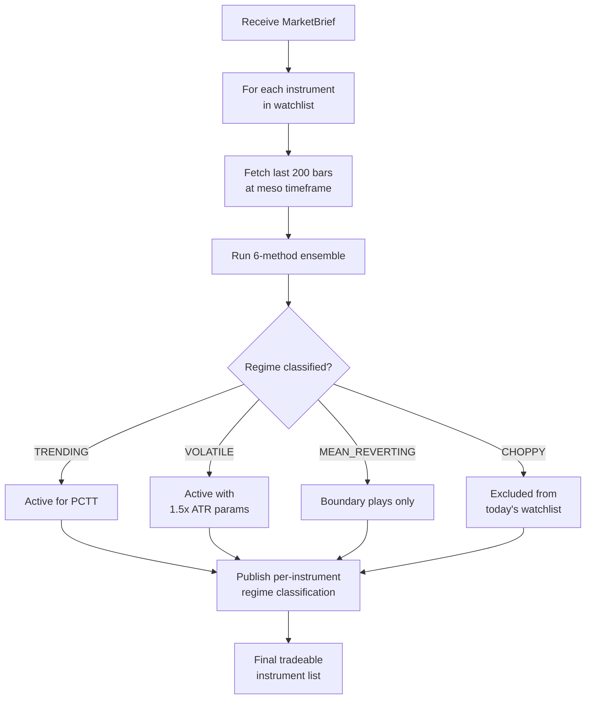

#### 6.2.3 Human Briefing (09:15-09:30)

The Orchestrator presents the human with a concise morning briefing:

```
========================================
PCTT MORNING BRIEFING - [Date]
========================================

MARKET ENVIRONMENT:
  VIX: 18.5 (NORMAL) | Direction: Flat
  ES Gap: +0.4% (MEDIUM) | NQ Gap: +0.6% (MEDIUM)
  Bond: 10Y 4.32% (+2bp) | Curve: +42bp (normal)
  DXY: 104.2 (flat) | Oil: $78.50 (+0.3%)

REGIME STATUS:
  Portfolio Regime: TRENDING (5/6 agreement)
  CUSUM: No alarms

TRADEABLE INSTRUMENTS (6 of 12 watchlist):
  AAPL: TRENDING (ER=0.52) - Active frozen structure from yesterday
  MSFT: TRENDING (ER=0.48) - No active structures
  NVDA: VOLATILE (ER=0.61) - Break pending confirmation
  ES:   TRENDING (ER=0.55) - Clean, no structures
  EUR/USD: MEAN_REVERTING - Boundary plays only
  BTC:  TRENDING (ER=0.47) - Active frozen structure

EXCLUDED (CHOPPY):
  AMZN, GOOGL, TSLA, NQ, GBP/USD, ETH

CALENDAR:
  10:00 AM: ISM Services (Tier 2)
  No Tier 1 events today
  No earnings for watchlist instruments

PORTFOLIO STATUS:
  Equity: $102,340 | DD: 2.1% | Heat: 1.8% (1 open position)
  Survival Score: 9/10
  Open: AAPL LONG 50 shares, +0.6R, Phase 4 trailing

PLAN:
  Bias: LONG (HTF trend intact)
  Max new positions: 2
  Focus: AAPL retest opportunity, NVDA break confirmation
========================================
[Approve Plan] [Modify] [No Trading Today]
```

### 6.3 Phase 2: Market Session (09:30-16:00 ET)

**Book Reference:** Chapter 26 (First 30 Minutes), Chapter 27 (Mid-Session Management), Chapter 28 (The Close)

#### 6.3.1 First 30 Minutes (09:30-10:00)

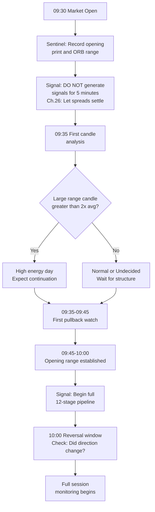

#### 6.3.2 Core Session Loop (10:00-15:00)

Every bar, the system executes this loop:

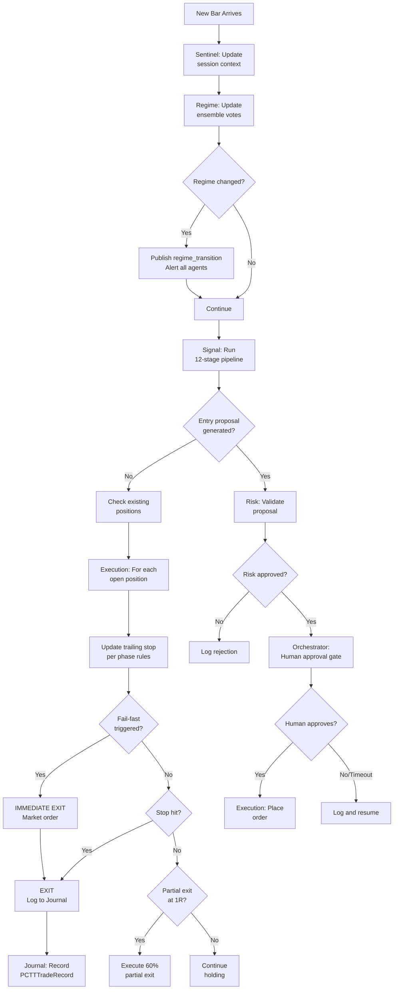

#### 6.3.3 Lunch Hour Protocol (11:30-13:30)

**Book Reference:** Chapter 27 "The Lunch Hour Trap"

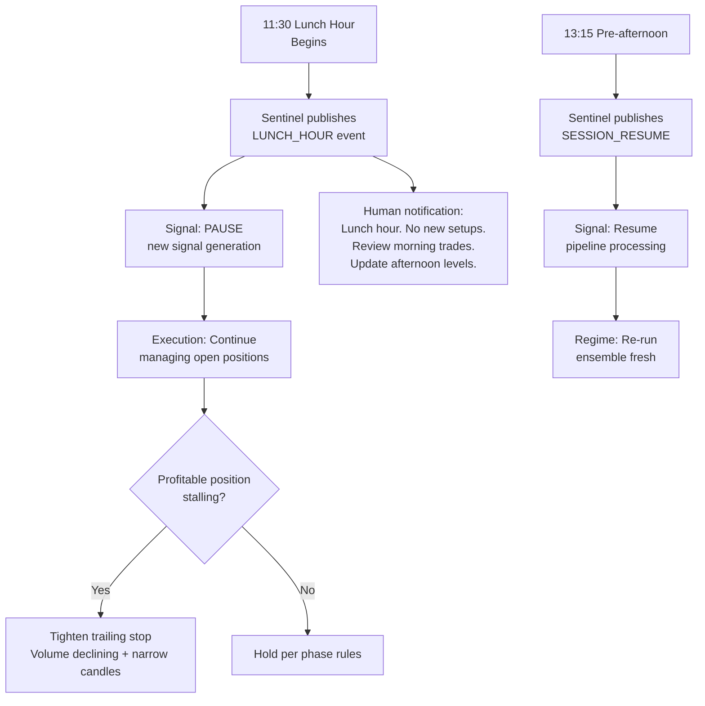

**Book quote from Ch.27:** "Volume drops 40-60% during lunch vs. first 90 min. False breakout rate rises to 68%. Do NOT initiate new positions 11:30-13:30."

#### 6.3.4 Power Hour Protocol (15:00-16:00)

**Book Reference:** Chapter 28 "Power Hour"

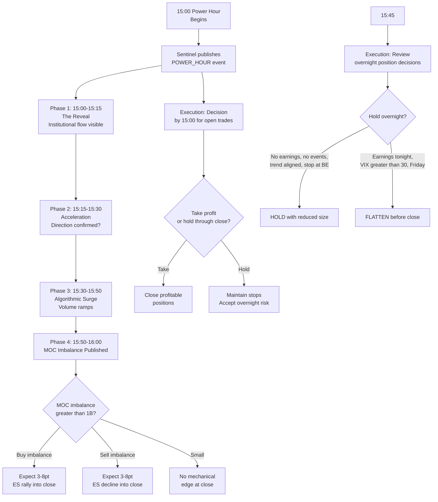

### 6.4 Phase 3: Post-Market (16:00-17:00 ET)

**Book Reference:** Chapter 28 (Post-Market Journaling), Chapter 29 (Trading Journal)

#### 6.4.1 Post-Market Workflow

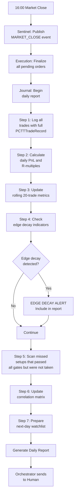

#### 6.4.2 The 5-Minute Speed Journal (from Chapter 29)

The Journal agent produces this automatically:

```python
@dataclass
class DailySpeedJournal:
    date: str
    market_regime: str  # Low Vol / Normal / Elevated / Crisis
    vix_close: float
    sp500_change_pct: float
    trades_taken: int
    wins: int
    losses: int
    total_pnl: float
    best_trade: dict  # {setup, r_multiple}
    worst_trade: dict  # {setup, r_multiple}
    laws_violated: list  # Any law violations detected
    system_emotional_state: str  # Disciplined / Cautious / Aggressive
    one_sentence_summary: str  # Auto-generated
```

**Book quote from Ch.29:** "The one-sentence summary is most critical. After 30 days, 30 sentences reveal patterns invisible in the moment."

#### 6.4.3 Weekly Review (Sunday, 30 minutes)

**Book Reference:** Chapter 29 (Weekly Review Protocol), Chapter 31 (Weekly Rhythm)

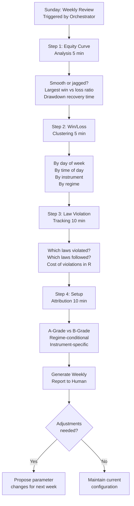

### 6.5 Crisis Workflow

**Book Reference:** Chapter 28 (Crisis Protocols), Strativion crisis-protocols.yaml

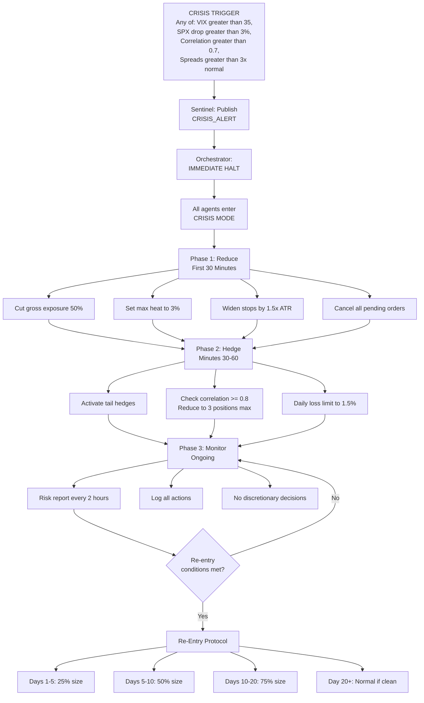

**Re-entry conditions (ALL must be met):**
1. VIX peaked and declined, closed below 25 for 5 consecutive sessions
2. Portfolio correlation returned below 0.5
3. Spreads normalized (< 1.5x pre-crisis)
4. No circuit breakers in prior 10 sessions
5. ADX shows identifiable regime

---

## 7. Guardrails Architecture

### 7.1 Three Layers of Protection

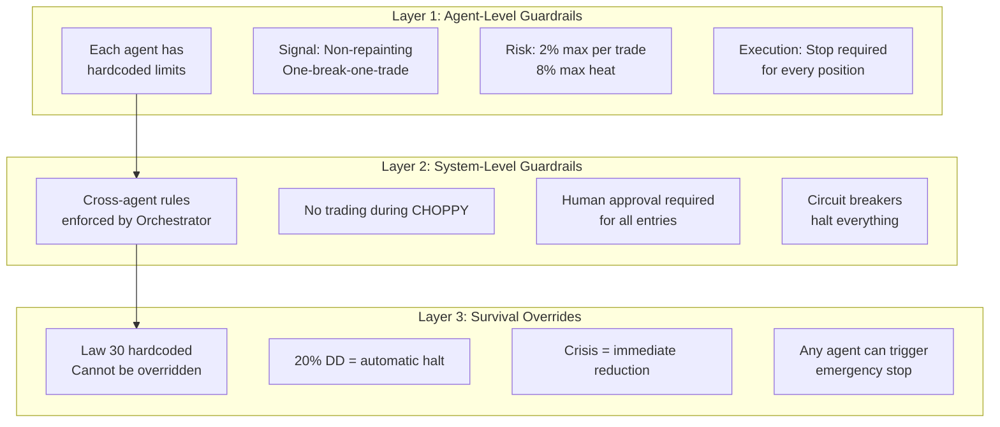

### 7.2 Complete Guardrail Matrix

| Guardrail | Agent | Type | Override Possible? | Consequence of Violation |
|-----------|-------|------|-------------------|------------------------|
| Non-repainting | Signal | Hard | No | System integrity failure |
| One-break-one-trade | Signal | Hard | No | Skip duplicate entry |
| Q-Score minimum 0.55 | Signal | Hard | No | Trade not generated |
| Regime gate | Signal + Regime | Hard | No | No signals in CHOPPY |
| Max risk 2% per trade | Risk | Hard | No | Position size capped |
| Max portfolio heat 8% | Risk | Hard | No | New trade rejected |
| Max correlated positions 5 | Risk | Hard | No | New trade rejected |
| Drawdown halt at 20% | Risk | Hard | No | All trading stops |
| Circuit breaker 2% daily loss | Risk | Hard | Human can resume | Session halted |
| Circuit breaker 3 consecutive losses | Risk | Soft | Human can override | Size reduced 50% |
| Human approval for entries | Orchestrator | Hard | No | Trade requires approval |
| Stop required for every position | Execution | Hard | No | Order rejected |
| Mandatory partial at 1R | Execution | Hard | No | Auto-executed |
| Fail-fast conditions | Execution | Hard | No | Immediate market exit |
| Trade recording mandatory | Journal | Hard | No | System blocks next trade |
| Lunch hour no new entries | Sentinel | Soft | Human can override | Warning issued |
| Session boundary respect | Sentinel | Soft | Human can override | Warning issued |

---

## 8. Observability & Monitoring

### 8.1 Observability Stack

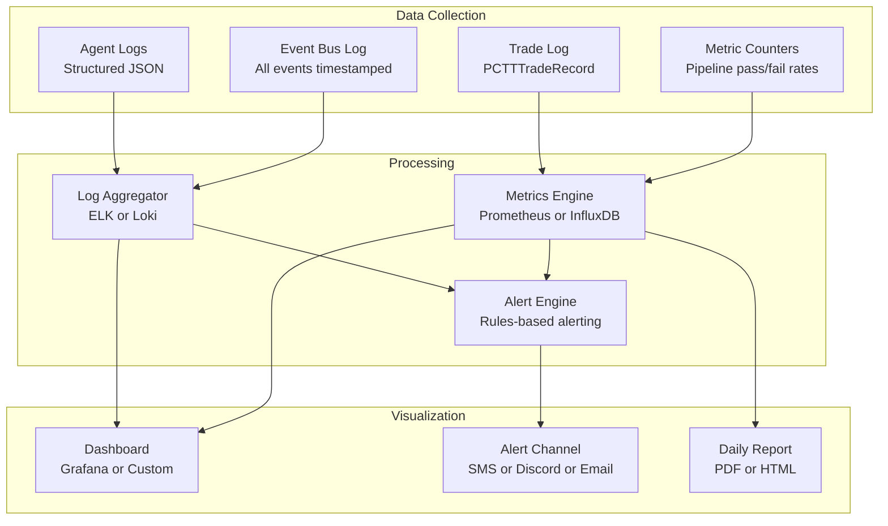

### 8.2 Key Metrics to Monitor

| Metric | Source | Threshold | Alert Level |
|--------|--------|-----------|-------------|
| Pipeline rejection rate | Signal | Should be > 99% | Warning if < 98% |
| Signal generation rate | Signal | 1-3 per week per instrument | Warning if > 5/week |
| Regime classification confidence | Regime | Should be 4/6+ | Alert if 3/6 |
| Average fill slippage | Execution | < 0.1 ATR | Alert if > 0.2 ATR |
| Trailing stop phase distribution | Execution | Majority should reach Phase 3+ | Warning if > 50% exit Phase 1 |
| Portfolio heat utilization | Risk | Average 2-4% of 6% max | Warning if consistently > 5% |
| Circuit breaker activations | Risk | < 1 per month | Alert on every activation |
| Edge decay triggers | Journal | 0 of 3 triggers | Alert at 1, Pause at 2 |
| Human response time | Orchestrator | < 30 seconds | Warning if > 60s average |
| Broker connection uptime | Execution | 99.9% | Alert on any disconnection |
| Event bus latency | All | < 50ms | Alert if > 200ms |
| Memory store latency | All | < 10ms | Alert if > 100ms |

### 8.3 Dashboard Layout

```
+------------------------------------------------------+
| PCTT TRADING SYSTEM DASHBOARD                         |
+--------------+---------------+-----------------------+
| SYSTEM STATE | PORTFOLIO     | TODAY'S PERFORMANCE    |
| * NORMAL     | Equity: $102K | P&L: +$340 (+0.33%)   |
| Regime: TREND| DD: 2.1%     | Trades: 1W 0L          |
| VIX: 18.5   | Heat: 1.8%   | R-Total: +1.2R         |
| Session: OPEN| Survival: 9  | Win Rate: 100% (1/1)   |
+--------------+---------------+-----------------------+
| ACTIVE POSITIONS                                      |
| +-----+------+-------+------+-------+----+----------+|
| |Inst |Dir   |Entry  |Stop  |Phase  |R   |Heat      ||
| +-----+------+-------+------+-------+----+----------+|
| |AAPL |LONG  |195.50 |195.50|P4:Piv |+1.2|1.0%      ||
| |NVDA |      |PENDING|      |Signal |    |0.8%(est) ||
| +-----+------+-------+------+-------+----+----------+|
+------------------------------------------------------+
| AGENT STATUS                                          |
| Sentinel: * Active (session monitoring)               |
| Regime:   * Active (TRENDING 5/6, 47 bars)           |
| Signal:   * Active (NVDA in WAIT_RETEST state)       |
| Risk:     * Active (heat OK, no breakers)            |
| Executor: * Active (managing AAPL Phase 4)           |
| Journal:  * Active (recording)                       |
| Orchestr: * Active (NVDA proposal pending human)     |
+------------------------------------------------------+
| RECENT EVENTS                                         |
| 10:42 Signal: NVDA entry proposal (LONG, Q=0.72, A) |
| 10:42 Risk: APPROVED (76 shares, 0.98% risk)        |
| 10:42 Orchestrator: Awaiting human approval...       |
| 10:15 Execution: AAPL stop moved to BE (Phase 2->4) |
| 09:55 Regime: TRENDING confirmed (5/6, ER=0.52)     |
| 08:45 Sentinel: MarketBrief published                |
+------------------------------------------------------+
```

---

## 9. Testing Architecture

### 9.1 Test Pyramid

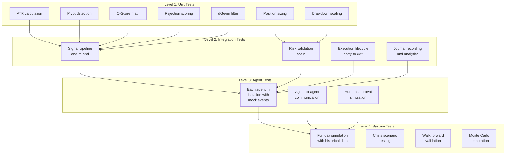

### 9.2 Critical Test Scenarios

| Scenario | What It Tests | Expected Behavior |
|----------|--------------|-------------------|
| Break without retest | Signal FSM timeout | FSM returns to IDLE after 12 bars |
| 20% drawdown | Risk circuit breaker | All trading halted immediately |
| VIX spike to 40 | Sentinel crisis detection | System enters CRISIS mode |
| Regime flip mid-trade | Execution fail-fast | Position closed if within 5 bars |
| Human unresponsive | Orchestrator timeout | Proposal auto-expires after 2 bars |
| Broker disconnection | Execution resilience | Alert + queue orders for reconnect |
| Correlated position attempt | Risk correlation check | New trade rejected |
| B-Grade at A-Grade size | Risk grade validation | Size capped at 0.5% |
| Same break re-entry | Signal one-break-one-trade | Entry blocked |
| Look-ahead in boundary | Signal non-repainting | t-1 data only used |
| Lunch hour signal | Sentinel session guard | Signal suppressed with warning |
| 3 consecutive losses | Risk circuit breaker | Size reduced 50% |
| Edge decay 2/3 triggers | Journal detection | System recommends pause |
| Flash crash | Crisis playbook 1 | 5-minute wait, then assess |
| MOC imbalance > $1B | Sentinel power hour | Alert published |

### 9.3 Backtesting Validation

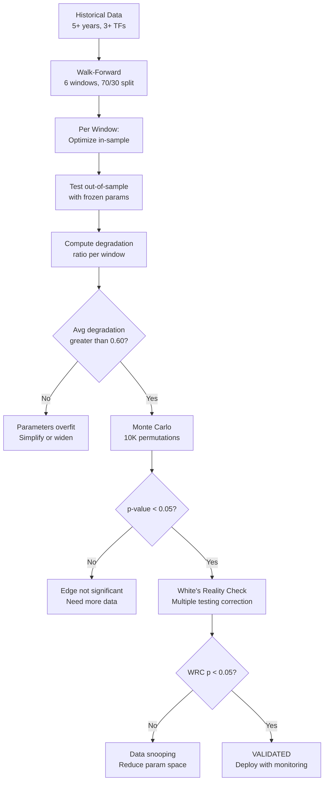

---

## 10. Configuration Architecture

### 10.1 Configuration Hierarchy

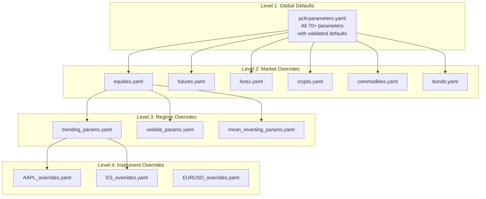

### 10.2 Parameter Resolution

```python
def resolve_parameters(instrument: str, regime: str) -> dict:
    """
    Resolve parameters using the 4-level hierarchy:
    1. Start with global defaults
    2. Apply market-class overrides (equities, forex, etc.)
    3. Apply regime-specific overrides (trending, volatile, etc.)
    4. Apply instrument-specific overrides (AAPL, ES, etc.)

    Later levels override earlier ones. Missing keys fall through
    to the previous level.
    """
    params = load_yaml("pctt-parameters.yaml")  # Global defaults

    market_class = classify_instrument(instrument)  # e.g., "equities"
    market_overrides = load_yaml(f"{market_class}.yaml")
    params.update(market_overrides)

    regime_overrides = load_yaml(f"{regime.lower()}_params.yaml")
    params.update(regime_overrides)

    instrument_file = f"{instrument}_overrides.yaml"
    if exists(instrument_file):
        params.update(load_yaml(instrument_file))

    return params
```

---

## 11. Data Architecture

### 11.1 Data Flow

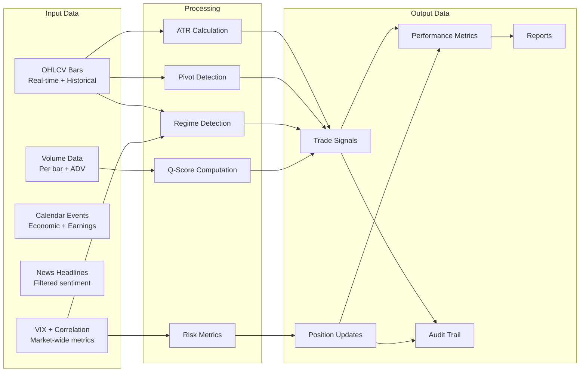

### 11.2 Data Storage Schema

```python
# Core data models
@dataclass
class OHLCVBar:
    timestamp: datetime
    open: float
    high: float
    low: float
    close: float
    volume: float
    instrument: str
    timeframe: str  # 1m, 5m, 15m, 1h, 4h, D, W

@dataclass
class Pivot:
    bar_index: int
    timestamp: datetime
    price: float
    pivot_type: str  # HIGH, LOW
    atr_at_detection: float
    confirmed: bool

@dataclass
class CandidateLine:
    line_id: str
    line_type: str  # SUPPORT, RESISTANCE
    slope: float
    intercept: float
    touches: int
    length_bars: int
    q_score: float
    grade: str  # A, B, None
    instrument: str
    timeframe: str

@dataclass
class FrozenStructure:
    structure_id: str
    action_line_slope: float
    action_line_intercept: float
    safety_line_slope: float
    safety_line_intercept: float
    break_bar_index: int
    break_time: datetime
    direction: str  # LONG, SHORT
    instrument: str
    consumed: bool  # One-break-one-trade flag

@dataclass
class PCTTTradeRecord:
    # (Complete 35+ field record as defined in the pamphlet)
    trade_id: str
    entry_time: datetime
    entry_price: float
    direction: str
    instrument: str
    timeframe: str
    q_score: float
    rejection_score: int
    regime: str
    d_geom: float
    grade: str
    position_size: float
    risk_per_share: float
    initial_stop: float
    action_line_value: float
    safety_line_value: float
    trailing_phases: list
    partial_exits: list
    fail_fast_triggered: bool
    max_favorable_excursion: float
    max_adverse_excursion: float
    exit_time: datetime
    exit_price: float
    exit_reason: str
    r_multiple: float
    duration_bars: int
    realized_pnl: float
    commission: float
    macro_gate_result: str
    confluence_score: float
    entry_regime: str
    exit_regime: str
```

---

## 12. Implementation Roadmap

### 12.1 Phase Sequence

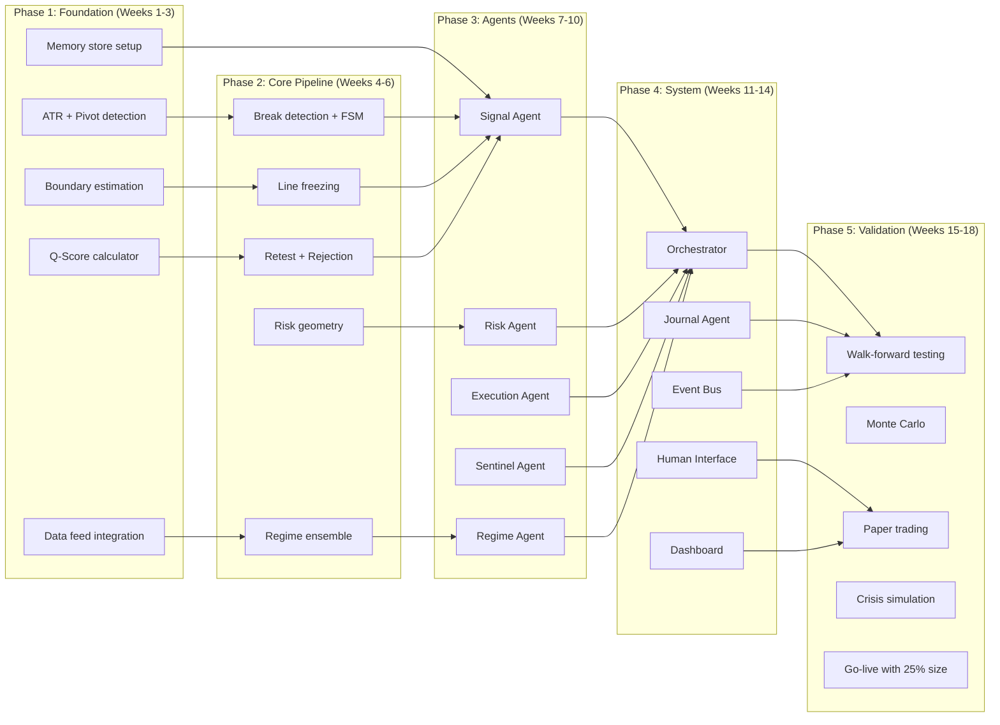

### 12.2 Technology Stack Recommendations

| Component | Recommended | Alternative | Rationale |
|-----------|------------|-------------|-----------|
| Agent Framework | Claude Agent SDK | LangGraph, CrewAI | Native Anthropic integration, tool use |
| Language | Python 3.11+ | TypeScript (PCTT engine) | Strativion ecosystem, numpy/scipy |
| Event Bus | Redis Pub/Sub | RabbitMQ, Kafka | Low latency, simple, sufficient scale |
| Memory Store | Redis + SQLite | PostgreSQL | Hot data in Redis, cold in SQLite |
| Broker API | IBKR TWS API | Alpaca, TD Ameritrade | Most complete, futures+stocks+options |
| Data Feed | Polygon.io | Alpha Vantage, IBKR | Real-time + historical, websocket |
| Dashboard | Streamlit | Grafana, custom React | Rapid prototyping, Python native |
| Monitoring | Prometheus + Grafana | Datadog, custom | Industry standard, free |
| Alerting | Discord webhook | Slack, SMS, Email | Real-time, mobile, free |
| Config | YAML files | etcd, Consul | Already in Strativion ecosystem |
| Testing | pytest + hypothesis | unittest | Property-based testing for math |
| CI/CD | GitHub Actions | GitLab CI | Standard, free tier sufficient |

---

## 13. Key Recommendations

### 13.1 Start Small, Scale Carefully

1. **Week 1-2:** Build the Signal agent alone with paper trading. Validate the 12-stage pipeline produces reasonable signals.
2. **Week 3-4:** Add Risk agent. Validate sizing and circuit breakers on historical data.
3. **Week 5-6:** Add Execution agent. Paper trade the full entry-to-exit lifecycle.
4. **Week 7-8:** Add Sentinel, Regime, and Journal agents. Run full daily workflow in simulation.
5. **Week 9-10:** Add Orchestrator with human-in-the-loop. Practice the approval flow.
6. **Week 11-14:** Walk-forward validation on 5+ years of data.
7. **Week 15-18:** Paper trade live markets for 4 weeks minimum.
8. **Week 19+:** Go live with 25% of target sizing. Scale up over 4 weeks if metrics hold.

### 13.2 Critical Success Factors

1. **Non-repainting is non-negotiable.** Test every calculation for look-ahead bias. One bug here invalidates all backtests.
2. **The human must remain engaged.** The system presents, the human decides. If the human starts rubber-stamping approvals, the system degrades to full automation without the safety net.
3. **Law 30 overrides everything.** The Risk agent's survival checks cannot be bypassed, even by the human. The only exception is the human physically disabling the system.
4. **Journal everything.** The Journal agent's data becomes the system's most valuable asset after 100+ trades. Edge decay detection saves accounts.
5. **Test crisis scenarios.** Paper trade through historical crises (March 2020, August 2024 Japan unwind, SVB March 2023). Verify the system behaves correctly.

### 13.3 Common Failure Modes to Avoid

| Failure Mode | Cause | Prevention |
|-------------|-------|------------|
| Over-trading | Signal agent too loose | Monitor rejection rate (should be > 99%) |
| Under-trading | Signal agent too strict | Track missed setups in Journal |
| Regime thrashing | Ensemble debounce too short | Require 5-bar persistence for transitions |
| Human fatigue | Too many approval requests | Limit to 3 proposals per session |
| Slippage erosion | Limit orders too tight | Monitor fill rate, adjust if < 70% |
| Edge decay blindness | Journal checks too infrequent | Run edge checks after every trade |
| Configuration drift | Manual parameter changes | Version control all YAML, require approval |
| Single point of failure | Broker disconnection | Alert within 5 seconds, queue orders |

---

*End of PCTT Agentic Trading System Architecture.*

*This document provides the complete blueprint for building, testing, and deploying a 7-agent automated trading system with human-in-the-loop based on the PCTT method and the 30 Laws of Trading. Every component is designed for deterministic, non-repainting, survival-first operation.*
