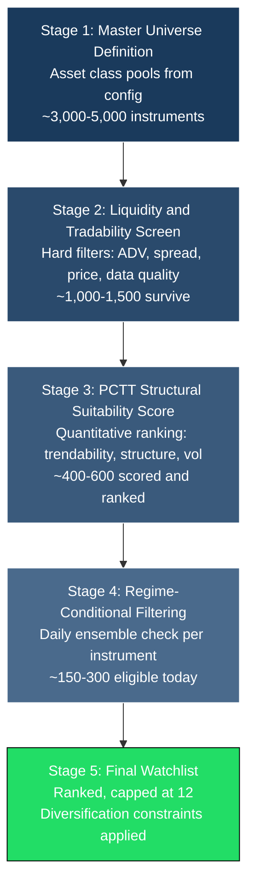
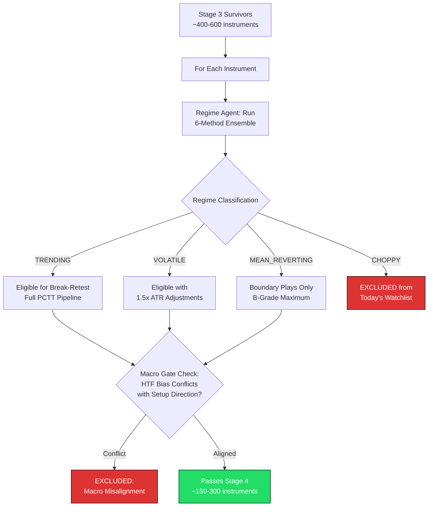
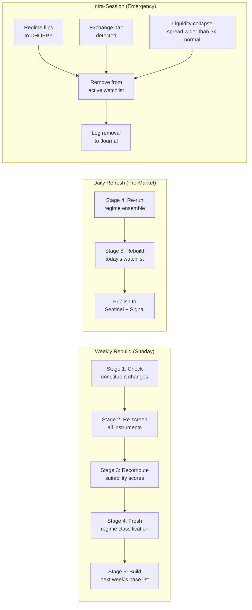
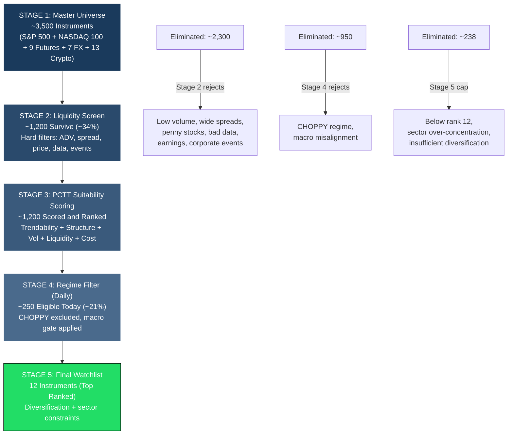
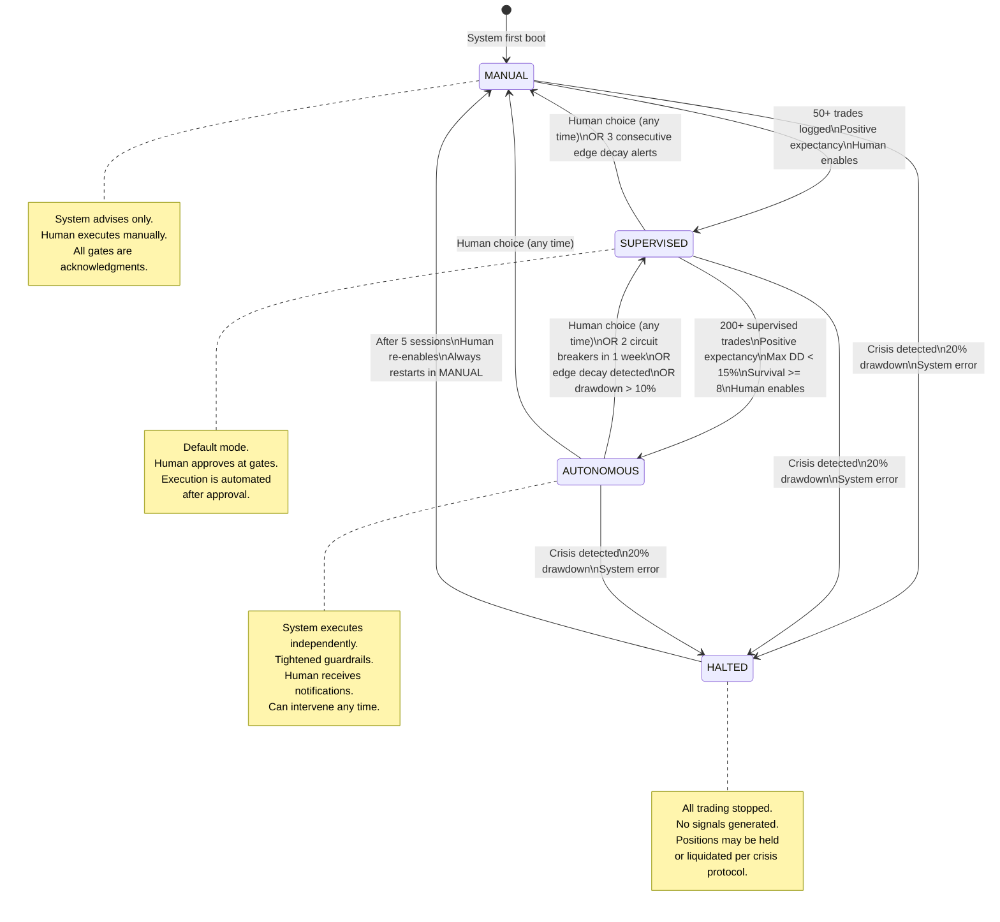
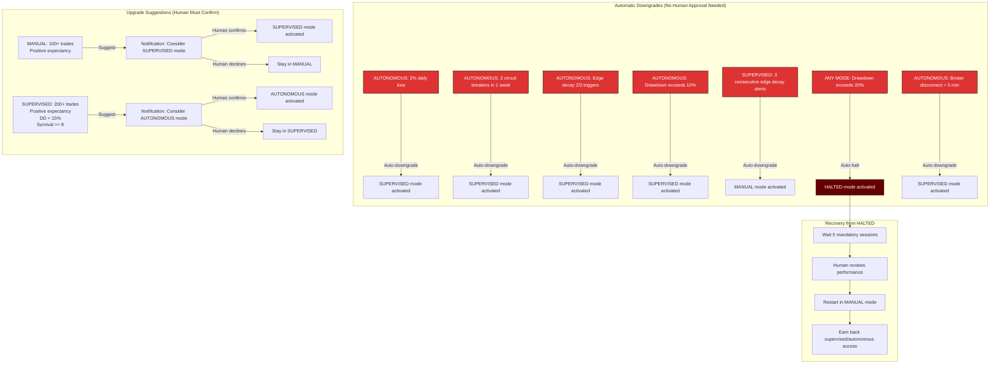
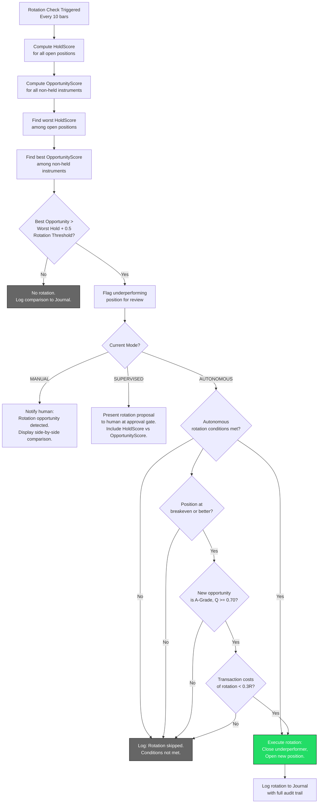
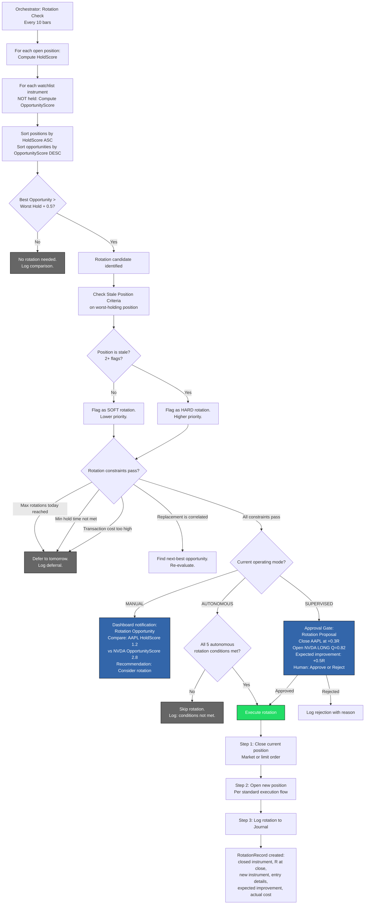
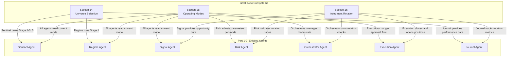

# PCTT Agentic System Architecture (Part 3)

## Universe Selection, Operating Modes, and Dynamic Instrument Rotation

**Version:** 1.0
**Author:** Kimal Honour Djam
**Extends:** Parts 1 and 2 (Sections 1-13)
**Scope:** Three critical subsystems that bridge the gap between a static prototype and a production-grade trading engine.

---

## 14. Universe Selection & Instrument Ranking Engine

### 14.1 The Problem

Parts 1 and 2 define seven agents, a 12-stage pipeline, four approval gates, and a complete daily workflow. But they all start with a silent assumption: the watchlist already exists. Nowhere does the architecture specify HOW instruments enter the watchlist, WHY those instruments and not others, or WHEN the watchlist should change.

This is not a minor gap. In practice, instrument selection determines 40-60% of a systematic trader's returns. Renaissance Technologies, the most successful quantitative fund in history, has attributed a substantial portion of its edge to universe construction and filtering. Jim Simons told MIT in 2010 that "choosing what to trade is half the battle."

The PCTT system needs a complete pipeline that starts with "every tradeable instrument in the world" and ends with "5-12 instruments the system trades today." This section designs that pipeline. The Sentinel Agent owns the process with support from the Regime Agent (Stage 4 filtering) and the Journal Agent (performance-based rebalancing).

### 14.2 Universe Construction Pipeline

The pipeline has five stages. Each stage applies progressively finer filters, narrowing thousands of instruments down to a ranked watchlist of 12 or fewer.



#### Stage 1: Master Universe Definition

The master universe defines the eligible pool of instruments per asset class. This is a configuration-level decision, updated quarterly or when the trader expands into new markets.

```yaml
# config/universe-definition.yaml
universe:
  equities:
    enabled: true
    pools:
      - name: "S&P 500"
        source: "sp500_constituents"
        update_frequency: "quarterly"
      - name: "NASDAQ 100"
        source: "nasdaq100_constituents"
        update_frequency: "quarterly"
      - name: "Russell 1000"
        source: "russell1000_constituents"
        update_frequency: "annually"
        enabled: false  # Disabled by default, too many instruments
    max_from_class: 8  # Max equities on final watchlist

  futures:
    enabled: true
    instruments:
      - symbol: "ES"
        name: "E-mini S&P 500"
        exchange: "CME"
        tick_size: 0.25
        tick_value: 12.50
      - symbol: "NQ"
        name: "E-mini NASDAQ 100"
        exchange: "CME"
        tick_size: 0.25
        tick_value: 5.00
      - symbol: "YM"
        name: "E-mini Dow"
        exchange: "CBOT"
        tick_size: 1.0
        tick_value: 5.00
      - symbol: "RTY"
        name: "E-mini Russell 2000"
        exchange: "CME"
        tick_size: 0.10
        tick_value: 5.00
      - symbol: "CL"
        name: "Crude Oil"
        exchange: "NYMEX"
        tick_size: 0.01
        tick_value: 10.00
      - symbol: "GC"
        name: "Gold"
        exchange: "COMEX"
        tick_size: 0.10
        tick_value: 10.00
      - symbol: "SI"
        name: "Silver"
        exchange: "COMEX"
        tick_size: 0.005
        tick_value: 25.00
      - symbol: "ZB"
        name: "30-Year Treasury Bond"
        exchange: "CBOT"
        tick_size: 0.03125
        tick_value: 31.25
      - symbol: "ZN"
        name: "10-Year Treasury Note"
        exchange: "CBOT"
        tick_size: 0.015625
        tick_value: 15.625
    max_from_class: 4

  forex:
    enabled: true
    pairs:
      - "EUR/USD"
      - "GBP/USD"
      - "USD/JPY"
      - "AUD/USD"
      - "USD/CHF"
      - "USD/CAD"
      - "NZD/USD"
    max_from_class: 3

  crypto:
    enabled: true
    instruments:
      - symbol: "BTC"
        name: "Bitcoin"
        min_market_cap: null  # Always included
      - symbol: "ETH"
        name: "Ethereum"
        min_market_cap: null
      - symbol: "SOL"
        name: "Solana"
        min_market_cap: null
    dynamic_pool:
      source: "top_10_by_market_cap"
      update_frequency: "monthly"
      exclude: ["stablecoins", "wrapped_tokens"]
    max_from_class: 3

  options:
    enabled: false  # Options used as hedging overlays only, not primary instruments
    note: "Options are managed by the Risk agent for hedging, not traded directly"

  global:
    max_watchlist_size: 12
    min_asset_classes: 2  # Diversification floor
    max_per_sector: 5     # Sector concentration ceiling
```

**Approximate instrument count at Stage 1:** 3,000-5,000 (primarily from equity pools).

#### Stage 2: Liquidity and Tradability Screen

Hard filters eliminate instruments that cannot be traded efficiently within the PCTT framework. These are binary pass/fail criteria. No scoring, no ranking. If an instrument fails any single filter, it is excluded.

```python
from dataclasses import dataclass
from datetime import datetime, timedelta
from typing import Optional


@dataclass
class LiquidityScreenConfig:
    """Hard filter thresholds per asset class."""
    # Equities
    equity_min_adv_dollars: float = 10_000_000  # $10M minimum average daily volume
    equity_min_price: float = 10.00              # No penny stocks
    equity_max_spread_pct: float = 0.05          # < 0.05% bid-ask spread
    equity_min_market_cap: float = 2_000_000_000 # $2B minimum market cap
    equity_requires_weekly_options: bool = True   # Must have liquid weekly options chain

    # Futures
    futures_min_adv_contracts: int = 10_000       # Minimum daily contract volume
    futures_max_spread_ticks: int = 2             # Max spread in ticks

    # Forex
    forex_max_spread_pct: float = 0.02            # < 0.02% spread
    forex_min_daily_volume_usd: float = 1_000_000_000  # $1B daily turnover

    # Crypto
    crypto_max_spread_pct: float = 0.10           # < 0.10% spread
    crypto_min_adv_dollars: float = 50_000_000    # $50M daily volume
    crypto_min_market_cap: float = 1_000_000_000  # $1B market cap

    # Universal
    min_history_days: int = 365                   # 1 year clean OHLCV required
    max_data_gaps_pct: float = 2.0                # < 2% missing bars
    earnings_exclusion_sessions: int = 2          # Exclude if reporting within 2 sessions
    corporate_event_exclusion_days: int = 5       # Exclude if merger/delisting/split within 5 days


@dataclass
class LiquidityScreenResult:
    """Result of Stage 2 screening for one instrument."""
    instrument: str
    asset_class: str
    passed: bool
    adv_dollars: float
    spread_pct: float
    market_cap: Optional[float]
    price: float
    data_quality_score: float  # 0-1, percentage of clean bars
    has_options_chain: bool
    pending_corporate_event: bool
    earnings_within_window: bool
    failure_reasons: list  # Empty if passed


def screen_liquidity(instrument: str, market_data: dict, config: LiquidityScreenConfig) -> LiquidityScreenResult:
    """
    Apply Stage 2 hard filters to a single instrument.
    Returns a LiquidityScreenResult with pass/fail and failure reasons.
    """
    failures = []
    asset_class = market_data["asset_class"]

    adv = market_data.get("average_daily_volume_dollars", 0)
    spread = market_data.get("average_spread_pct", 1.0)
    price = market_data.get("last_price", 0)
    mcap = market_data.get("market_cap", None)
    history_days = market_data.get("clean_history_days", 0)
    data_gaps = market_data.get("data_gap_pct", 100.0)
    has_options = market_data.get("has_weekly_options", False)
    pending_event = market_data.get("pending_corporate_event", False)
    earnings_soon = market_data.get("earnings_within_sessions", 999)

    # Universal filters
    if history_days < config.min_history_days:
        failures.append(f"Insufficient history: {history_days} days (need {config.min_history_days})")
    if data_gaps > config.max_data_gaps_pct:
        failures.append(f"Data quality: {data_gaps:.1f}% gaps (max {config.max_data_gaps_pct}%)")
    if pending_event:
        failures.append("Pending corporate event within exclusion window")
    if earnings_soon <= config.earnings_exclusion_sessions:
        failures.append(f"Earnings in {earnings_soon} sessions (excluded)")

    # Asset-class-specific filters
    if asset_class == "equities":
        if adv < config.equity_min_adv_dollars:
            failures.append(f"ADV ${adv:,.0f} below ${config.equity_min_adv_dollars:,.0f}")
        if price < config.equity_min_price:
            failures.append(f"Price ${price:.2f} below ${config.equity_min_price:.2f}")
        if spread > config.equity_max_spread_pct:
            failures.append(f"Spread {spread:.3f}% above {config.equity_max_spread_pct}%")
        if mcap is not None and mcap < config.equity_min_market_cap:
            failures.append(f"Market cap ${mcap:,.0f} below ${config.equity_min_market_cap:,.0f}")
        if config.equity_requires_weekly_options and not has_options:
            failures.append("No liquid weekly options chain")

    elif asset_class == "forex":
        if spread > config.forex_max_spread_pct:
            failures.append(f"Spread {spread:.3f}% above {config.forex_max_spread_pct}%")
        if adv < config.forex_min_daily_volume_usd:
            failures.append(f"Daily volume ${adv:,.0f} below ${config.forex_min_daily_volume_usd:,.0f}")

    elif asset_class == "crypto":
        if spread > config.crypto_max_spread_pct:
            failures.append(f"Spread {spread:.3f}% above {config.crypto_max_spread_pct}%")
        if adv < config.crypto_min_adv_dollars:
            failures.append(f"ADV ${adv:,.0f} below ${config.crypto_min_adv_dollars:,.0f}")
        if mcap is not None and mcap < config.crypto_min_market_cap:
            failures.append(f"Market cap ${mcap:,.0f} below ${config.crypto_min_market_cap:,.0f}")

    elif asset_class == "futures":
        contracts = market_data.get("average_daily_contracts", 0)
        spread_ticks = market_data.get("average_spread_ticks", 99)
        if contracts < config.futures_min_adv_contracts:
            failures.append(f"ADV {contracts} contracts below {config.futures_min_adv_contracts}")
        if spread_ticks > config.futures_max_spread_ticks:
            failures.append(f"Spread {spread_ticks} ticks above {config.futures_max_spread_ticks}")

    data_quality = max(0, 1.0 - (data_gaps / 100.0))

    return LiquidityScreenResult(
        instrument=instrument,
        asset_class=asset_class,
        passed=len(failures) == 0,
        adv_dollars=adv,
        spread_pct=spread,
        market_cap=mcap,
        price=price,
        data_quality_score=data_quality,
        has_options_chain=has_options,
        pending_corporate_event=pending_event,
        earnings_within_window=earnings_soon <= config.earnings_exclusion_sessions,
        failure_reasons=failures,
    )
```

**Approximate survival rate:** 30-40% of Stage 1 instruments pass. For a starting universe of ~3,500 equities + 9 futures + 7 forex + 10 crypto, roughly 1,000-1,500 survive.

#### Stage 3: PCTT Structural Suitability Score

For each instrument surviving Stage 2, compute a composite score that measures how well the instrument's recent price behavior suits the PCTT methodology. This is the core ranking engine.

**Five Scoring Components:**

| Component | Weight | What It Measures | Ideal Value |
|-----------|--------|-----------------|-------------|
| Trendability | 30% | Efficiency Ratio averaged over 60 days | Higher = more trending = better for PCTT |
| Structure Clarity | 25% | Average Q-Score of top 3 candidate lines over 60 days | Higher = cleaner trendlines |
| Volatility Consistency | 20% | ATR coefficient of variation over 60 days | Lower = more predictable risk sizing |
| Liquidity Depth | 15% | Average daily volume / typical position size ratio | Higher = less market impact |
| Cost Efficiency | 10% | Spread + commission as percentage of ATR | Lower = less friction per trade |

```python
from dataclasses import dataclass, field
import numpy as np
from typing import List


@dataclass
class PCTTSuitabilityComponents:
    """Individual scoring components before weighting."""
    trendability_raw: float      # ER averaged over lookback
    structure_clarity_raw: float # Avg Q-Score of best lines
    vol_consistency_raw: float   # 1 - CV(ATR) (inverted: lower CV = higher score)
    liquidity_depth_raw: float   # ADV / typical_position_size
    cost_efficiency_raw: float   # 1 - (cost_as_pct_of_atr) (inverted)


@dataclass
class PCTTSuitabilityScore:
    """Complete suitability score for one instrument."""
    instrument: str
    asset_class: str
    composite_score: float         # 0-1, weighted composite
    components: PCTTSuitabilityComponents
    trendability_normalized: float # 0-1 after normalization
    structure_normalized: float
    vol_consistency_normalized: float
    liquidity_normalized: float
    cost_efficiency_normalized: float
    lookback_days: int
    computed_at: str               # ISO-8601 timestamp
    rank: int = 0                  # Filled after sorting


def normalize_to_01(values: np.ndarray) -> np.ndarray:
    """Min-max normalize an array to [0, 1] range."""
    v_min = np.min(values)
    v_max = np.max(values)
    if v_max == v_min:
        return np.full_like(values, 0.5)
    return (values - v_min) / (v_max - v_min)


def compute_trendability(prices: np.ndarray, period: int = 20, lookback_days: int = 60) -> float:
    """
    Average Efficiency Ratio over the lookback window.
    ER = |net movement over period| / sum(|bar-to-bar changes|) over period.
    A high ER indicates persistent trending behavior.
    """
    if len(prices) < lookback_days + period:
        return 0.0

    er_values = []
    for i in range(lookback_days):
        end_idx = len(prices) - i
        start_idx = end_idx - period
        if start_idx < 0:
            break
        segment = prices[start_idx:end_idx]
        net_movement = abs(segment[-1] - segment[0])
        bar_changes = np.sum(np.abs(np.diff(segment)))
        if bar_changes == 0:
            er_values.append(0.0)
        else:
            er_values.append(net_movement / bar_changes)

    return float(np.mean(er_values)) if er_values else 0.0


def compute_structure_clarity(q_scores_top3: List[float]) -> float:
    """
    Average Q-Score of the top 3 candidate lines over the lookback period.
    Run the PCTT pivot detection and line generation on the lookback window,
    take the best 3 lines by Q-Score, and average them.
    If fewer than 3 lines exist, pad with 0.
    """
    if not q_scores_top3:
        return 0.0
    padded = list(q_scores_top3[:3])
    while len(padded) < 3:
        padded.append(0.0)
    return float(np.mean(padded))


def compute_vol_consistency(atr_series: np.ndarray, lookback_days: int = 60) -> float:
    """
    Coefficient of variation of ATR over the lookback window.
    Lower CV = more predictable volatility = easier to size positions.
    Returns 1 - CV so that higher is better.
    """
    recent_atr = atr_series[-lookback_days:]
    if len(recent_atr) < 10:
        return 0.0
    mean_atr = np.mean(recent_atr)
    if mean_atr == 0:
        return 0.0
    cv = np.std(recent_atr) / mean_atr
    return float(max(0, 1.0 - cv))


def compute_liquidity_depth(avg_daily_volume: float, typical_position_dollars: float) -> float:
    """
    Ratio of average daily volume to typical position size.
    Higher ratio = less market impact.
    """
    if typical_position_dollars <= 0:
        return 0.0
    return avg_daily_volume / typical_position_dollars


def compute_cost_efficiency(spread_dollars: float, commission_per_share: float,
                            typical_shares: int, atr_dollars: float) -> float:
    """
    Total round-trip cost as a percentage of ATR.
    Lower is better. Returns 1 - ratio so that higher is better.
    """
    if atr_dollars <= 0:
        return 0.0
    entry_cost = spread_dollars + (commission_per_share * typical_shares)
    exit_cost = spread_dollars + (commission_per_share * typical_shares)
    total_cost = entry_cost + exit_cost
    cost_ratio = total_cost / (atr_dollars * typical_shares)
    return float(max(0, 1.0 - cost_ratio))


def compute_pctt_suitability(
    instrument: str,
    asset_class: str,
    prices: np.ndarray,
    atr_series: np.ndarray,
    q_scores_top3: List[float],
    avg_daily_volume: float,
    typical_position_dollars: float,
    spread_dollars: float,
    commission_per_share: float,
    typical_shares: int,
    atr_dollars: float,
    lookback_days: int = 60,
    weights: dict = None,
) -> PCTTSuitabilityScore:
    """
    Compute the PCTT Structural Suitability Score for one instrument.

    Weights default: trendability=0.30, structure=0.25, vol_consistency=0.20,
                     liquidity=0.15, cost_efficiency=0.10

    Each component is computed raw, then normalized to 0-1 across the universe
    (normalization happens externally after all instruments are scored).
    For a single instrument, raw values are used.
    """
    if weights is None:
        weights = {
            "trendability": 0.30,
            "structure": 0.25,
            "vol_consistency": 0.20,
            "liquidity": 0.15,
            "cost_efficiency": 0.10,
        }

    trend_raw = compute_trendability(prices, period=20, lookback_days=lookback_days)
    struct_raw = compute_structure_clarity(q_scores_top3)
    vol_raw = compute_vol_consistency(atr_series, lookback_days=lookback_days)
    liq_raw = compute_liquidity_depth(avg_daily_volume, typical_position_dollars)
    cost_raw = compute_cost_efficiency(
        spread_dollars, commission_per_share, typical_shares, atr_dollars
    )

    components = PCTTSuitabilityComponents(
        trendability_raw=trend_raw,
        structure_clarity_raw=struct_raw,
        vol_consistency_raw=vol_raw,
        liquidity_depth_raw=liq_raw,
        cost_efficiency_raw=cost_raw,
    )

    # For single-instrument scoring, raw values serve as normalized values.
    # Cross-universe normalization is applied in batch after all instruments are scored.
    composite = (
        weights["trendability"] * trend_raw
        + weights["structure"] * struct_raw
        + weights["vol_consistency"] * vol_raw
        + weights["liquidity"] * min(liq_raw, 1.0)  # Cap at 1.0 for scoring
        + weights["cost_efficiency"] * cost_raw
    )

    from datetime import datetime

    return PCTTSuitabilityScore(
        instrument=instrument,
        asset_class=asset_class,
        composite_score=composite,
        components=components,
        trendability_normalized=trend_raw,
        structure_normalized=struct_raw,
        vol_consistency_normalized=vol_raw,
        liquidity_normalized=min(liq_raw, 1.0),
        cost_efficiency_normalized=cost_raw,
        lookback_days=lookback_days,
        computed_at=datetime.utcnow().isoformat(),
    )


def normalize_universe_scores(scores: List[PCTTSuitabilityScore]) -> List[PCTTSuitabilityScore]:
    """
    After computing raw scores for all instruments, normalize each component
    across the universe to 0-1 using min-max scaling, then recompute composites.
    """
    if not scores:
        return scores

    weights = {
        "trendability": 0.30,
        "structure": 0.25,
        "vol_consistency": 0.20,
        "liquidity": 0.15,
        "cost_efficiency": 0.10,
    }

    trend_vals = np.array([s.components.trendability_raw for s in scores])
    struct_vals = np.array([s.components.structure_clarity_raw for s in scores])
    vol_vals = np.array([s.components.vol_consistency_raw for s in scores])
    liq_vals = np.array([s.components.liquidity_depth_raw for s in scores])
    cost_vals = np.array([s.components.cost_efficiency_raw for s in scores])

    trend_norm = normalize_to_01(trend_vals)
    struct_norm = normalize_to_01(struct_vals)
    vol_norm = normalize_to_01(vol_vals)
    liq_norm = normalize_to_01(liq_vals)
    cost_norm = normalize_to_01(cost_vals)

    for i, s in enumerate(scores):
        s.trendability_normalized = float(trend_norm[i])
        s.structure_normalized = float(struct_norm[i])
        s.vol_consistency_normalized = float(vol_norm[i])
        s.liquidity_normalized = float(liq_norm[i])
        s.cost_efficiency_normalized = float(cost_norm[i])
        s.composite_score = (
            weights["trendability"] * s.trendability_normalized
            + weights["structure"] * s.structure_normalized
            + weights["vol_consistency"] * s.vol_consistency_normalized
            + weights["liquidity"] * s.liquidity_normalized
            + weights["cost_efficiency"] * s.cost_efficiency_normalized
        )

    # Sort by composite descending and assign ranks
    scores.sort(key=lambda x: x.composite_score, reverse=True)
    for rank, s in enumerate(scores, start=1):
        s.rank = rank

    return scores
```

#### Stage 4: Regime-Conditional Filtering

This stage runs daily during the pre-market phase. The Regime Agent runs its 6-method ensemble on each Stage 3 survivor and classifies the current regime. Instruments in unfavorable regimes are excluded from today's watchlist.



**Regime eligibility rules:**

| Regime | Eligible Strategy | Grade Limit | ATR Multiplier | Position Size Multiplier |
|--------|------------------|-------------|----------------|-------------------------|
| TRENDING | Full break-retest | A and B | 1.0x | 1.0x |
| VOLATILE | Full break-retest | A and B | 1.5x | 0.5x |
| MEAN_REVERTING | Boundary plays only | B max | 1.0x | 0.5x |
| CHOPPY | None (excluded) | N/A | N/A | N/A |

#### Stage 5: Final Watchlist Construction

The final stage ranks all Stage 4 survivors, applies regime bonuses, enforces diversification constraints, and caps the watchlist at 12 instruments.

```python
@dataclass
class WatchlistEntry:
    """A single instrument on the final watchlist."""
    instrument: str
    asset_class: str
    sector: str  # For equities: Technology, Healthcare, etc.
    pctt_suitability: float
    regime: str
    regime_bonus: float
    final_score: float  # suitability * regime_bonus
    rank: int
    eligible_strategies: list  # ["break_retest", "boundary"]
    max_grade: str  # "A" or "B"
    atr_multiplier: float
    size_multiplier: float
    human_override: bool  # True if manually added/kept


@dataclass
class FinalWatchlist:
    """The complete daily watchlist."""
    date: str
    instruments: list  # List[WatchlistEntry]
    total_scored: int   # How many instruments were scored at Stage 3
    regime_filtered: int  # How many passed Stage 4
    final_count: int
    asset_class_distribution: dict  # {"equities": 5, "futures": 3, ...}
    sector_distribution: dict       # {"Technology": 3, "Energy": 1, ...}
    human_overrides: list           # Instruments added/removed by human
    rebuild_type: str               # "FULL" (weekly) or "REFRESH" (daily)


REGIME_BONUS_MULTIPLIERS = {
    "TRENDING": 1.5,
    "VOLATILE": 1.2,
    "MEAN_REVERTING": 0.8,
}


def build_final_watchlist(
    scored_instruments: list,  # List[PCTTSuitabilityScore]
    regime_classifications: dict,  # {instrument: regime_str}
    sector_map: dict,  # {instrument: sector_str}
    config: dict,
    human_additions: list = None,
    human_removals: list = None,
) -> FinalWatchlist:
    """
    Build the final watchlist from Stage 3 scores and Stage 4 regimes.

    Rules:
    1. Exclude CHOPPY instruments
    2. Apply regime bonus multiplier
    3. Rank by final_score = pctt_suitability * regime_bonus
    4. Cap at max_watchlist_size (default 12)
    5. Enforce min_asset_classes (default 2)
    6. Enforce max_per_sector (default 5)
    7. Apply human overrides with logging
    """
    max_size = config.get("max_watchlist_size", 12)
    min_classes = config.get("min_asset_classes", 2)
    max_sector = config.get("max_per_sector", 5)
    human_additions = human_additions or []
    human_removals = human_removals or []

    # Filter and score
    candidates = []
    for score in scored_instruments:
        regime = regime_classifications.get(score.instrument, "CHOPPY")
        if regime == "CHOPPY":
            continue
        if score.instrument in human_removals:
            continue

        bonus = REGIME_BONUS_MULTIPLIERS.get(regime, 1.0)
        final = score.composite_score * bonus

        eligible = ["break_retest"]
        max_grade = "A"
        atr_mult = 1.0
        size_mult = 1.0

        if regime == "MEAN_REVERTING":
            eligible = ["boundary"]
            max_grade = "B"
            size_mult = 0.5
        elif regime == "VOLATILE":
            atr_mult = 1.5
            size_mult = 0.5

        candidates.append(WatchlistEntry(
            instrument=score.instrument,
            asset_class=score.asset_class,
            sector=sector_map.get(score.instrument, "Unknown"),
            pctt_suitability=score.composite_score,
            regime=regime,
            regime_bonus=bonus,
            final_score=final,
            rank=0,
            eligible_strategies=eligible,
            max_grade=max_grade,
            atr_multiplier=atr_mult,
            size_multiplier=size_mult,
            human_override=False,
        ))

    # Sort by final score descending
    candidates.sort(key=lambda x: x.final_score, reverse=True)

    # Apply constraints
    selected = []
    asset_classes_seen = set()
    sector_counts = {}

    for c in candidates:
        if len(selected) >= max_size:
            break
        sector_count = sector_counts.get(c.sector, 0)
        if sector_count >= max_sector:
            continue
        selected.append(c)
        asset_classes_seen.add(c.asset_class)
        sector_counts[c.sector] = sector_count + 1

    # Enforce minimum asset class diversity
    if len(asset_classes_seen) < min_classes:
        # Find candidates from missing asset classes
        missing_classes = set()
        all_classes = set(c.asset_class for c in candidates)
        for ac in all_classes:
            if ac not in asset_classes_seen:
                missing_classes.add(ac)
        for c in candidates:
            if c.asset_class in missing_classes and c not in selected:
                if len(selected) >= max_size:
                    # Replace lowest-ranked from over-represented class
                    selected.pop()
                selected.append(c)
                asset_classes_seen.add(c.asset_class)
                if len(asset_classes_seen) >= min_classes:
                    break

    # Add human overrides
    override_list = []
    for inst in human_additions:
        if inst not in [s.instrument for s in selected]:
            override_entry = WatchlistEntry(
                instrument=inst,
                asset_class="manual",
                sector="manual",
                pctt_suitability=0.0,
                regime="MANUAL_OVERRIDE",
                regime_bonus=1.0,
                final_score=0.0,
                rank=0,
                eligible_strategies=["break_retest"],
                max_grade="A",
                atr_multiplier=1.0,
                size_multiplier=1.0,
                human_override=True,
            )
            selected.append(override_entry)
            override_list.append(inst)

    # Assign ranks
    selected.sort(key=lambda x: x.final_score, reverse=True)
    for rank, entry in enumerate(selected, start=1):
        entry.rank = rank

    ac_dist = {}
    sec_dist = {}
    for s in selected:
        ac_dist[s.asset_class] = ac_dist.get(s.asset_class, 0) + 1
        sec_dist[s.sector] = sec_dist.get(s.sector, 0) + 1

    from datetime import date
    return FinalWatchlist(
        date=date.today().isoformat(),
        instruments=selected,
        total_scored=len(scored_instruments),
        regime_filtered=len(candidates),
        final_count=len(selected),
        asset_class_distribution=ac_dist,
        sector_distribution=sec_dist,
        human_overrides=override_list + human_removals,
        rebuild_type="FULL",
    )
```

### 14.3 Watchlist Rebalancing Schedule

The watchlist is not static. Different stages of the pipeline refresh on different schedules.

| Schedule | Stages Refreshed | Trigger | Duration | Notes |
|----------|-----------------|---------|----------|-------|
| **Weekly (Sunday)** | Stages 1-5 complete rebuild | Scheduled cron | ~15-30 min | Universe re-scanned, new constituents added, dead instruments removed |
| **Daily (Pre-market)** | Stages 4-5 refresh only | T-60 min before open | ~5-10 min | Regime re-classified, final watchlist rebuilt with fresh scores |
| **Intra-session** | Emergency removal only | Event-driven | Immediate | Instrument removed if: regime flips to CHOPPY, trading halted by exchange, liquidity collapse detected |



### 14.4 Cross-Asset Allocation Framework

Selecting instruments is half the problem. The other half is deciding how to allocate capital across asset classes. The system uses three allocation layers.

**Layer 1: Core Allocation by Regime Environment**

The macro regime (determined by the Sentinel Agent using VIX, yield curve, and cross-asset correlation) sets the baseline allocation.

| Macro Regime | Equities | Futures (Index) | Bonds | Gold | Forex | Crypto |
|-------------|----------|-----------------|-------|------|-------|--------|
| **Risk-On** | 50% | 20% | 5% | 5% | 10% | 10% |
| **Risk-Off** | 15% | 10% | 30% | 25% | 15% | 5% |
| **Transition** | 30% | 15% | 20% | 15% | 15% | 5% |
| **Crisis** | 5% | 5% | 40% | 35% | 15% | 0% |

**Layer 2: Correlation-Based Constraint**

No single asset class may exceed 60% of deployed capital regardless of regime allocation. If equities are generating all the signals, the system enforces a cap to prevent concentration risk.

**Layer 3: Performance-Based Tilt**

Instruments with a positive rolling 20-trade expectancy receive a 1.5x allocation weight. Instruments with negative rolling expectancy get 0.5x weight. The Journal Agent computes these tilts weekly.

```python
@dataclass
class AssetAllocation:
    """Cross-asset allocation decision for the portfolio."""
    macro_regime: str  # RISK_ON, RISK_OFF, TRANSITION, CRISIS
    base_allocation: dict  # {asset_class: pct}
    correlation_adjusted: dict  # After 60% cap enforcement
    performance_tilted: dict  # After expectancy-based tilting
    final_allocation: dict  # The allocation used for sizing
    total_deployed_pct: float  # Should be <= 100%
    cash_reserve_pct: float  # Remainder held as cash


CORE_ALLOCATIONS = {
    "RISK_ON": {"equities": 0.50, "futures": 0.20, "bonds": 0.05, "gold": 0.05, "forex": 0.10, "crypto": 0.10},
    "RISK_OFF": {"equities": 0.15, "futures": 0.10, "bonds": 0.30, "gold": 0.25, "forex": 0.15, "crypto": 0.05},
    "TRANSITION": {"equities": 0.30, "futures": 0.15, "bonds": 0.20, "gold": 0.15, "forex": 0.15, "crypto": 0.05},
    "CRISIS": {"equities": 0.05, "futures": 0.05, "bonds": 0.40, "gold": 0.35, "forex": 0.15, "crypto": 0.00},
}
MAX_SINGLE_CLASS = 0.60


def compute_asset_allocation(
    macro_regime: str,
    instrument_expectancies: dict,  # {instrument: {asset_class, expectancy_20}}
) -> AssetAllocation:
    """
    Compute final asset allocation using 3-layer framework.
    """
    # Layer 1: Base allocation
    base = CORE_ALLOCATIONS.get(macro_regime, CORE_ALLOCATIONS["TRANSITION"]).copy()

    # Layer 2: Correlation cap
    corr_adjusted = base.copy()
    for ac, pct in corr_adjusted.items():
        if pct > MAX_SINGLE_CLASS:
            excess = pct - MAX_SINGLE_CLASS
            corr_adjusted[ac] = MAX_SINGLE_CLASS
            # Redistribute excess proportionally to other classes
            other_classes = [k for k in corr_adjusted if k != ac and corr_adjusted[k] > 0]
            if other_classes:
                per_class = excess / len(other_classes)
                for oc in other_classes:
                    corr_adjusted[oc] += per_class

    # Layer 3: Performance tilt
    class_expectancy = {}
    for inst, data in instrument_expectancies.items():
        ac = data["asset_class"]
        exp = data["expectancy_20"]
        if ac not in class_expectancy:
            class_expectancy[ac] = []
        class_expectancy[ac].append(exp)

    tilted = corr_adjusted.copy()
    for ac in tilted:
        if ac in class_expectancy:
            avg_exp = sum(class_expectancy[ac]) / len(class_expectancy[ac])
            if avg_exp > 0:
                tilted[ac] *= 1.5
            elif avg_exp < 0:
                tilted[ac] *= 0.5

    # Renormalize so total does not exceed 1.0
    total = sum(tilted.values())
    if total > 1.0:
        for ac in tilted:
            tilted[ac] /= total

    deployed = sum(tilted.values())

    return AssetAllocation(
        macro_regime=macro_regime,
        base_allocation=base,
        correlation_adjusted=corr_adjusted,
        performance_tilted=tilted,
        final_allocation=tilted,
        total_deployed_pct=deployed,
        cash_reserve_pct=1.0 - deployed,
    )
```

### 14.5 Instrument Ranking Dataclass and Tools

**Complete InstrumentProfile dataclass:**

```python
@dataclass
class InstrumentProfile:
    """
    Complete profile for a single instrument in the universe.
    Maintained by the Sentinel Agent, updated per rebalance schedule.
    """
    # Identity
    instrument: str
    asset_class: str  # equities, futures, forex, crypto
    sector: str       # Technology, Energy, etc. (equities only)
    exchange: str
    currency: str

    # Liquidity (Stage 2)
    avg_daily_volume_dollars: float
    avg_daily_volume_shares: float
    avg_spread_pct: float
    market_cap: float
    has_weekly_options: bool
    liquidity_screen_passed: bool
    liquidity_failure_reasons: list

    # PCTT Suitability (Stage 3)
    pctt_suitability_score: float
    trendability: float
    structure_clarity: float
    vol_consistency: float
    liquidity_depth: float
    cost_efficiency: float
    suitability_rank: int  # Rank among all scored instruments

    # Regime (Stage 4)
    current_regime: str
    regime_confidence: float
    regime_duration_bars: int
    regime_bonus: float

    # Final Watchlist (Stage 5)
    on_watchlist: bool
    watchlist_rank: int
    final_score: float  # suitability * regime_bonus
    eligible_strategies: list
    max_grade: str

    # Performance (from Journal)
    rolling_20_win_rate: float
    rolling_20_expectancy: float
    rolling_20_avg_r: float
    total_trades: int
    avg_hold_duration_bars: float

    # Metadata
    last_full_scan: str     # ISO-8601
    last_daily_refresh: str
    human_override: bool
    notes: str
```

**Sentinel Agent Universe Selection Tools:**

| Tool | Description | Input | Output |
|------|------------|-------|--------|
| `load_master_universe` | Load all instruments from config | universe_config_path | List of instrument symbols |
| `screen_liquidity_batch` | Run Stage 2 filters on instrument batch | instruments, market_data | List of LiquidityScreenResult |
| `compute_suitability_batch` | Run Stage 3 scoring on all survivors | instruments, price_data, atr_data | List of PCTTSuitabilityScore |
| `request_regime_batch` | Ask Regime Agent to classify batch | instruments | Dict of regime classifications |
| `build_watchlist` | Run Stage 5 final watchlist construction | scores, regimes, config | FinalWatchlist |
| `apply_human_override` | Add or remove instrument from watchlist | instrument, action, reason | Updated watchlist |
| `get_instrument_profile` | Retrieve full InstrumentProfile | instrument | InstrumentProfile |
| `publish_watchlist` | Publish final watchlist to event bus | watchlist | Confirmation |
| `log_universe_stats` | Log funnel statistics to Journal | stage_counts | Confirmation |

### 14.6 Universe Funnel Diagram



---

## 15. Three Operating Modes (Manual, Supervised, Autonomous)

### 15.1 The Problem

Parts 1 and 2 define a single operating mode: human-in-the-loop supervised trading. The human must approve every trade at Gate 1, every pyramid at Gate 2, and every stop override at Gate 3. This works well for active traders during market hours.

But real-world trading demands flexibility. A trader learning the PCTT system needs a mode where the system advises without executing. A portfolio manager monitoring multiple systems needs a mode where the system executes autonomously with tightened guardrails. A trader who works a day job cannot approve signals in real-time during market hours.

Without multiple operating modes, the system forces a one-size-fits-all workflow that excludes large segments of its potential user base.

### 15.2 Mode Definitions

Three modes address three distinct use cases. Each mode changes how the system interacts with the human and how much autonomy the agents have.

#### Mode A: MANUAL

The system is a powerful advisor. It generates signals, computes sizing, identifies setups, and presents complete analysis. But it does NOT place orders. The human reads the dashboard, sees the proposals, and manually enters trades on their own broker platform.

**Key characteristics:**
- Signal, Risk, and Regime agents operate normally. Full 12-stage pipeline runs.
- Entry proposals are displayed as RECOMMENDATIONS with complete context.
- Trailing stop phases are displayed as SUGGESTIONS (e.g., "Move your stop to $195.50 for breakeven").
- The human enters trades manually through their broker.
- Trades can be imported into the system via broker API sync or manual entry.
- Journal agent still records everything (including trades the human took that the system did not recommend).
- All 4 approval gates remain, but they function as "acknowledge" buttons, not "approve" buttons.

**Use cases:**
- Learning the PCTT system for the first time
- Building trust before granting execution authority
- Regulatory environments where automated execution is not permitted
- Traders who prefer manual order entry for psychological reasons

#### Mode B: SUPERVISED (Default)

This is the current architecture as defined in Parts 1 and 2. The system generates signals, sizes positions, and prepares orders. The human must APPROVE each action at the approval gates. Once approved, the Execution Agent handles order management automatically.

**Key characteristics:**
- Full pipeline with human approval required at Gates 1 (entry), 2 (pyramid), and 3 (stop override).
- Once approved, trailing stops execute automatically per phase rules.
- Human can intervene at any time: close positions, modify stops, override parameters.
- Proposal timeout: if the human does not respond within 2 bars, the proposal auto-expires (conservative default).
- Gate 4 (crisis) triggers automatic halt regardless of human response.

**Use cases:**
- Active traders who want system intelligence combined with human judgment
- Traders who are available during market hours to respond to proposals
- The recommended mode for the first 200+ trades on the system

#### Mode C: AUTONOMOUS

The system generates signals, sizes positions, and EXECUTES without waiting for human approval. The human receives notifications of all actions taken and can intervene at any time.

**Key characteristics:**
- All approval gates are bypassed. The Orchestrator routes approved proposals directly to the Execution Agent.
- Human receives push notifications (SMS, Discord, email) for every action: entry, stop move, partial exit, full exit.
- Human can intervene at any time: close positions, halt the system, modify parameters, force mode downgrade.
- Guardrails are TIGHTENED to compensate for the absence of human judgment at entry.

**Autonomous mode guardrail tightening:**

| Parameter | Supervised Value | Autonomous Value | Rationale |
|-----------|-----------------|------------------|-----------|
| Max risk per trade | 1.0% | 0.75% | Less human oversight requires lower risk |
| Max portfolio heat | 6.0% | 4.0% | Reduced exposure ceiling |
| Max concurrent positions | 6 | 4 | Fewer positions to monitor without human |
| Minimum setup grade | B (Q >= 0.55) | A only (Q >= 0.70) | Only highest quality setups |
| Circuit breaker daily loss | 2.0% | 1.5% | Earlier halt without human judgment |
| Consecutive loss pause | 3 | 2 | Faster cooldown |
| Proposal timeout | 2 bars | N/A (immediate execution) | No waiting |

**Unlock requirements:** Autonomous mode is not available by default. To unlock it:
1. Minimum 200 trades in supervised mode
2. Positive expectancy over those 200 trades
3. Maximum drawdown during supervised period < 15%
4. Survival score >= 8/10 at time of mode switch
5. Human explicitly enables autonomous mode in configuration

**Time-limited autonomy:** The system supports partial autonomy. For example, autonomous during US market hours (09:30-16:00) but supervised for pre-market and after-hours trading, or autonomous for equities but supervised for crypto.

**Use cases:**
- Portfolio managers monitoring multiple trading systems simultaneously
- Overnight sessions where the human is unavailable (forex, crypto)
- Experienced traders who have validated the system over 200+ supervised trades
- Situations where human response latency would cause missed entries

### 15.3 Mode Switching

Mode transitions are governed by strict rules. Not every transition is allowed at all times. Some transitions require performance thresholds. Others happen automatically when conditions deteriorate.



**Automatic mode downgrades (cannot be overridden):**

| Condition | From Mode | To Mode | Cooldown |
|-----------|-----------|---------|----------|
| 2 circuit breakers in 1 week | AUTONOMOUS | SUPERVISED | 1 week minimum in supervised |
| Edge decay alert (2/3 triggers) | AUTONOMOUS | SUPERVISED | Until edge restored |
| Drawdown exceeds 10% | AUTONOMOUS | SUPERVISED | Until DD recovers below 7% |
| 3 consecutive edge decay alerts | SUPERVISED | MANUAL | Until full review completed |
| Drawdown exceeds 20% | Any | HALTED | 5 sessions mandatory, restart in MANUAL |
| System error (broker disconnect > 5 min, data feed failure) | AUTONOMOUS | SUPERVISED | Until error resolved |

**Automatic mode upgrade suggestions (human must confirm):**

| Condition | Suggestion | Requirement |
|-----------|-----------|-------------|
| 100+ profitable trades in MANUAL | "Consider upgrading to SUPERVISED" | Human confirms |
| 200+ trades in SUPERVISED with positive expectancy | "Consider upgrading to AUTONOMOUS" | Human confirms + threshold check |

### 15.4 Mode Configuration

```python
from dataclasses import dataclass, field
from typing import Optional, List
from enum import Enum


class TradingMode(Enum):
    MANUAL = "MANUAL"
    SUPERVISED = "SUPERVISED"
    AUTONOMOUS = "AUTONOMOUS"
    HALTED = "HALTED"


@dataclass
class ModeParameters:
    """Operating parameters that vary by mode."""
    max_risk_per_trade_pct: float
    max_portfolio_heat_pct: float
    max_concurrent_positions: int
    min_setup_grade: str  # "A" or "B"
    min_q_score: float
    circuit_breaker_daily_loss_pct: float
    consecutive_loss_pause_threshold: int
    proposal_timeout_bars: Optional[int]  # None for autonomous
    human_approval_required: bool
    notifications_enabled: bool
    auto_execute: bool
    trailing_stops_auto: bool
    partial_exits_auto: bool


@dataclass
class ModeTransitionRequirements:
    """Requirements for transitioning between modes."""
    min_trades: int
    min_expectancy: float  # In R-multiples
    max_drawdown_pct: float
    min_survival_score: int
    human_confirmation_required: bool


@dataclass
class OperatingMode:
    """Complete operating mode configuration."""
    current_mode: TradingMode
    mode_parameters: ModeParameters
    mode_since: str  # ISO-8601 timestamp
    trades_in_current_mode: int
    automatic_downgrade_enabled: bool
    time_limited_autonomy: Optional[dict]  # {"start": "09:30", "end": "16:00", "timezone": "US/Eastern"}

    # Transition history
    mode_history: list  # [{from, to, reason, timestamp}]

    # Upgrade eligibility
    upgrade_eligible: bool
    upgrade_requirements_met: dict  # {requirement: bool}


# Default parameters per mode
MODE_DEFAULTS = {
    TradingMode.MANUAL: ModeParameters(
        max_risk_per_trade_pct=1.0,
        max_portfolio_heat_pct=6.0,
        max_concurrent_positions=6,
        min_setup_grade="B",
        min_q_score=0.55,
        circuit_breaker_daily_loss_pct=2.0,
        consecutive_loss_pause_threshold=3,
        proposal_timeout_bars=None,  # No timeout, proposals persist
        human_approval_required=False,  # No approval needed, human executes manually
        notifications_enabled=True,
        auto_execute=False,
        trailing_stops_auto=False,  # Displayed as recommendations
        partial_exits_auto=False,
    ),
    TradingMode.SUPERVISED: ModeParameters(
        max_risk_per_trade_pct=1.0,
        max_portfolio_heat_pct=6.0,
        max_concurrent_positions=6,
        min_setup_grade="B",
        min_q_score=0.55,
        circuit_breaker_daily_loss_pct=2.0,
        consecutive_loss_pause_threshold=3,
        proposal_timeout_bars=2,
        human_approval_required=True,
        notifications_enabled=True,
        auto_execute=True,  # After human approval
        trailing_stops_auto=True,
        partial_exits_auto=True,
    ),
    TradingMode.AUTONOMOUS: ModeParameters(
        max_risk_per_trade_pct=0.75,
        max_portfolio_heat_pct=4.0,
        max_concurrent_positions=4,
        min_setup_grade="A",
        min_q_score=0.70,
        circuit_breaker_daily_loss_pct=1.5,
        consecutive_loss_pause_threshold=2,
        proposal_timeout_bars=None,  # Immediate execution
        human_approval_required=False,
        notifications_enabled=True,
        auto_execute=True,
        trailing_stops_auto=True,
        partial_exits_auto=True,
    ),
    TradingMode.HALTED: ModeParameters(
        max_risk_per_trade_pct=0.0,
        max_portfolio_heat_pct=0.0,
        max_concurrent_positions=0,
        min_setup_grade="A",
        min_q_score=1.0,  # Impossible to meet, no trades
        circuit_breaker_daily_loss_pct=0.0,
        consecutive_loss_pause_threshold=0,
        proposal_timeout_bars=None,
        human_approval_required=True,
        notifications_enabled=True,
        auto_execute=False,
        trailing_stops_auto=True,  # Existing positions still managed
        partial_exits_auto=True,
    ),
}


# Transition requirements
TRANSITION_REQUIREMENTS = {
    ("MANUAL", "SUPERVISED"): ModeTransitionRequirements(
        min_trades=50,
        min_expectancy=0.1,
        max_drawdown_pct=20.0,
        min_survival_score=6,
        human_confirmation_required=True,
    ),
    ("SUPERVISED", "AUTONOMOUS"): ModeTransitionRequirements(
        min_trades=200,
        min_expectancy=0.2,
        max_drawdown_pct=15.0,
        min_survival_score=8,
        human_confirmation_required=True,
    ),
}
```

**YAML configuration example:**

```yaml
# config/operating-mode.yaml
operating_mode:
  current: "SUPERVISED"

  time_limited_autonomy:
    enabled: false
    autonomous_windows:
      - start: "09:30"
        end: "16:00"
        timezone: "US/Eastern"
        asset_classes: ["equities", "futures"]
    supervised_windows:
      - start: "16:00"
        end: "09:30"
        timezone: "US/Eastern"
        asset_classes: ["crypto", "forex"]

  autonomous_overrides:
    max_risk_per_trade_pct: 0.75
    max_portfolio_heat_pct: 4.0
    max_concurrent_positions: 4
    min_q_score: 0.70

  notifications:
    channels:
      - type: "discord"
        webhook_url: "${DISCORD_WEBHOOK}"
        events: ["trade_opened", "trade_closed", "circuit_breaker", "mode_change"]
      - type: "sms"
        phone: "${PHONE_NUMBER}"
        events: ["circuit_breaker", "crisis_alert", "mode_change"]
      - type: "email"
        address: "${EMAIL}"
        events: ["daily_report", "weekly_report", "edge_decay"]
```

### 15.5 Per-Mode Agent Behavior Table

Each agent adjusts its behavior based on the current operating mode.

| Agent | MANUAL Mode | SUPERVISED Mode | AUTONOMOUS Mode |
|-------|-------------|-----------------|-----------------|
| **Signal** | Full 12-stage pipeline. Generates proposals. Labels them as "RECOMMENDATION." | Full 12-stage pipeline. Generates proposals. Routes to Risk for validation. | Full 12-stage pipeline. Only A-Grade (Q >= 0.70) proposals generated. Routes to Risk. |
| **Risk** | Computes sizing and heat as information. Displays "suggested size" to human. Does not block. | Validates sizing, heat, correlation. Has veto power. Must approve before human sees proposal. | Validates with TIGHTENED parameters: 0.75% max risk, 4% max heat, 4 max positions. Has veto power. |
| **Orchestrator** | Displays proposals on dashboard. No approval gate enforcement. Logs human acknowledgments. | Manages all 4 approval gates. Presents proposals. Enforces timeout at 2 bars. Routes approved trades to Execution. | Bypasses Gates 1-3. Routes Risk-approved proposals directly to Execution. Gate 4 (crisis) still enforced. Sends notifications for every action. |
| **Execution** | INACTIVE for order placement. Displays trailing stop recommendations on dashboard. Imports human's manual trades via broker API. | Places orders after human approval. Manages full 7-phase trailing stop. Executes partial exits automatically. | Places orders immediately upon Risk approval. Manages full 7-phase trailing stop. Executes partial exits automatically. No human delay. |
| **Sentinel** | Full monitoring. MarketBrief generation. Crisis detection. Universe selection. | Same as MANUAL. No behavioral difference. | Same as MANUAL. Additional responsibility: monitors for automatic mode downgrade conditions. |
| **Regime** | Full 6-method ensemble. Classification published as information. | Full 6-method ensemble. Classification gates Signal agent. | Same as SUPERVISED. No behavioral difference. |
| **Journal** | Records all trades (system recommendations AND human's actual trades). Tracks divergence between system proposals and human actions. | Records all system-executed trades with full PCTTTradeRecord. Edge decay detection active. | Same as SUPERVISED. Additionally tracks autonomous-specific metrics: fill quality without human timing, rotation decisions, autonomous-only performance. |

### 15.6 Mode Escalation and De-escalation

The system automatically manages mode transitions based on performance signals. Downgrades happen without human approval (safety first). Upgrades require human confirmation.



---

## 16. Dynamic Instrument Rotation and Opportunity Cost Management

### 16.1 The Problem

Consider a realistic scenario: the system holds a LONG position in AAPL that has gained +0.3R over 15 bars. Progress is slow. Volume is declining. Meanwhile, NVDA just generated an A-Grade signal with Q = 0.82 and the Regime Agent classifies it as TRENDING with 5/6 confidence. The system has hit its maximum concurrent position limit. Should it close AAPL to take the NVDA setup?

Parts 1 and 2 provide no mechanism for this decision. The Orchestrator coordinates workflow. The Risk Agent manages sizing and heat. The Signal Agent generates proposals. But no agent compares the opportunity cost of holding underperforming positions against the opportunity cost of missing new setups.

This is not a theoretical gap. In 2023, Citadel's global equities division attributed 12% of their annual alpha to systematic position rotation, replacing stale positions with higher-conviction opportunities. Systematic rotation, done correctly, can add 0.2-0.5R per trade to portfolio expectancy.

Done incorrectly, it becomes churning. The system needs a principled framework.

### 16.2 Opportunity Cost Quantification

Every instrument, whether currently held or not, has an Opportunity Score that captures its current value to the portfolio.

```python
from dataclasses import dataclass
from datetime import datetime
from typing import Optional


@dataclass
class OpportunityScoreComponents:
    """Breakdown of an instrument's opportunity score."""
    pctt_suitability: float
    regime_bonus: float
    active_setup_bonus: float
    raw_score: float
    final_score: float


def compute_opportunity_score(
    pctt_suitability: float,
    regime_bonus: float,
    has_active_setup: bool = False,
    q_score: Optional[float] = None,
    grade: Optional[str] = None,
    has_frozen_structure: bool = False,
) -> OpportunityScoreComponents:
    """
    Compute the Opportunity Score for an instrument not currently held.

    OpportunityScore = PCTT_Suitability * RegimeBonus * (1 + ActiveSetupBonus)

    ActiveSetupBonus values:
    - No active setup: 0.0
    - Entry proposal exists: Q_Score * GradeMultiplier
    - Frozen structure pending retest: 0.5 * Q_Score
    """
    grade_multipliers = {"A": 1.5, "B": 1.0}

    active_bonus = 0.0
    if has_active_setup and q_score is not None and grade is not None:
        active_bonus = q_score * grade_multipliers.get(grade, 1.0)
    elif has_frozen_structure and q_score is not None:
        active_bonus = 0.5 * q_score

    raw = pctt_suitability * regime_bonus
    final = raw * (1.0 + active_bonus)

    return OpportunityScoreComponents(
        pctt_suitability=pctt_suitability,
        regime_bonus=regime_bonus,
        active_setup_bonus=active_bonus,
        raw_score=raw,
        final_score=final,
    )
```

### 16.3 Position Performance Scoring (Real-Time)

For each open position, the system computes a HoldScore that measures how worthwhile it is to continue holding the position.

```python
@dataclass
class HoldScoreComponents:
    """Breakdown of a position's hold score."""
    current_r: float
    recency_weight: float
    momentum_score: float
    regime_alignment: float
    raw_hold_score: float


def compute_hold_score(
    current_r: float,
    r_history_last_5_bars: list,
    current_regime: str,
    entry_regime: str,
    regime_transitioning: bool = False,
) -> HoldScoreComponents:
    """
    Compute the HoldScore for an open position.

    HoldScore = current_R * RecencyWeight + MomentumScore + RegimeAlignment

    RecencyWeight:
    - 1.0 if R is gaining over last 5 bars
    - 0.7 if R is flat (< 0.05R change)
    - 0.4 if R is declining

    MomentumScore:
    - 1.0 if rate of R change is positive
    - 0.5 if rate of R change is zero
    - 0.0 if rate of R change is negative

    RegimeAlignment:
    - 1.0 if current regime still supports the trade
    - 0.5 if regime is transitioning
    - 0.0 if regime has flipped against the trade
    """
    # Recency weight
    if len(r_history_last_5_bars) >= 2:
        r_change = r_history_last_5_bars[-1] - r_history_last_5_bars[0]
        if r_change > 0.05:
            recency = 1.0
        elif r_change < -0.05:
            recency = 0.4
        else:
            recency = 0.7
    else:
        recency = 0.7

    # Momentum score
    if len(r_history_last_5_bars) >= 2:
        rate = (r_history_last_5_bars[-1] - r_history_last_5_bars[0]) / max(len(r_history_last_5_bars), 1)
        if rate > 0.01:
            momentum = 1.0
        elif rate < -0.01:
            momentum = 0.0
        else:
            momentum = 0.5
    else:
        momentum = 0.5

    # Regime alignment
    favorable_regimes = {"TRENDING", "VOLATILE"}
    if current_regime in favorable_regimes and not regime_transitioning:
        regime_align = 1.0
    elif regime_transitioning:
        regime_align = 0.5
    elif current_regime == "CHOPPY" or current_regime == "MEAN_REVERTING":
        regime_align = 0.0
    else:
        regime_align = 0.5

    raw = current_r * recency + momentum + regime_align

    return HoldScoreComponents(
        current_r=current_r,
        recency_weight=recency,
        momentum_score=momentum,
        regime_alignment=regime_align,
        raw_hold_score=raw,
    )
```

### 16.4 Rotation Decision Framework

The Orchestrator runs a rotation check every N bars (default: every 10 bars, configurable). This check compares the worst-performing open position against the best available opportunity.



**Rotation decision rules for autonomous mode (all must be true):**

1. Current position is at breakeven or better (do not realize a loss to rotate).
2. New opportunity is A-Grade with Q >= 0.70.
3. Transaction costs of the rotation (closing current + opening new) are less than 0.3R.
4. The rotation does not violate any Risk Agent guardrails (heat, correlation, position count).
5. The new instrument is not correlated (r > 0.70) with any other open position.

### 16.5 Stale Position Detection

A position is classified as "stale" when it shows signs of exhaustion without reaching meaningful profit targets. Stale positions consume portfolio heat and mental bandwidth without generating returns.

**Stale Position Criteria (any 2 of 4 flags the position as ROTATION_CANDIDATE):**

| Criterion | Threshold | What It Indicates |
|-----------|-----------|-------------------|
| Duration without progress | Held > 20 bars with R < 0.5 | Not reaching targets at an acceptable pace |
| Volume decay | Volume declining for 5+ consecutive bars | Institutional interest fading |
| Regime drift | Regime transitioning away from entry regime | Market conditions no longer support the thesis |
| Structure exhaustion | No new favorable pivot formed in 10+ bars | Price action lacks conviction |

```python
@dataclass
class StalePositionCheck:
    """Result of stale position analysis."""
    position_id: str
    instrument: str
    is_stale: bool
    stale_flags: int  # Count of flags triggered (2+ = stale)
    duration_flag: bool
    volume_flag: bool
    regime_flag: bool
    structure_flag: bool
    bars_held: int
    current_r: float
    volume_decline_bars: int
    regime_at_entry: str
    regime_current: str
    bars_since_favorable_pivot: int
    recommendation: str  # "HOLD", "ROTATION_CANDIDATE", "URGENT_REVIEW"


def check_stale_position(
    position_id: str,
    instrument: str,
    bars_held: int,
    current_r: float,
    volume_series_last_10: list,
    regime_at_entry: str,
    regime_current: str,
    regime_transitioning: bool,
    bars_since_favorable_pivot: int,
    stale_bar_threshold: int = 20,
    stale_r_threshold: float = 0.5,
    volume_decline_threshold: int = 5,
    pivot_staleness_threshold: int = 10,
) -> StalePositionCheck:
    """
    Check whether an open position meets stale criteria.
    2 or more flags = ROTATION_CANDIDATE.
    3 or more flags = URGENT_REVIEW.
    """
    flags = 0

    # Flag 1: Duration without progress
    duration_flag = bars_held > stale_bar_threshold and current_r < stale_r_threshold
    if duration_flag:
        flags += 1

    # Flag 2: Volume decay
    volume_decline_bars = 0
    if len(volume_series_last_10) >= 2:
        for i in range(1, len(volume_series_last_10)):
            if volume_series_last_10[i] < volume_series_last_10[i - 1]:
                volume_decline_bars += 1
            else:
                volume_decline_bars = 0  # Reset on any uptick
    volume_flag = volume_decline_bars >= volume_decline_threshold
    if volume_flag:
        flags += 1

    # Flag 3: Regime drift
    regime_flag = (
        regime_current != regime_at_entry
        or regime_transitioning
        or regime_current in ("CHOPPY", "MEAN_REVERTING")
    )
    if regime_flag:
        flags += 1

    # Flag 4: Structure exhaustion
    structure_flag = bars_since_favorable_pivot >= pivot_staleness_threshold
    if structure_flag:
        flags += 1

    # Determine recommendation
    if flags >= 3:
        recommendation = "URGENT_REVIEW"
    elif flags >= 2:
        recommendation = "ROTATION_CANDIDATE"
    else:
        recommendation = "HOLD"

    return StalePositionCheck(
        position_id=position_id,
        instrument=instrument,
        is_stale=flags >= 2,
        stale_flags=flags,
        duration_flag=duration_flag,
        volume_flag=volume_flag,
        regime_flag=regime_flag,
        structure_flag=structure_flag,
        bars_held=bars_held,
        current_r=current_r,
        volume_decline_bars=volume_decline_bars,
        regime_at_entry=regime_at_entry,
        regime_current=regime_current,
        bars_since_favorable_pivot=bars_since_favorable_pivot,
        recommendation=recommendation,
    )
```

### 16.6 Rotation Constraints

Rotation without constraints becomes churning. These constraints prevent the system from over-rotating and ensure that every rotation adds expected value.

| Constraint | Value | Rationale |
|-----------|-------|-----------|
| Max rotations per day | 2 | Prevent churning and excessive transaction costs |
| Min hold time before rotation eligible | 5 bars | Give positions time to develop before judging |
| Correlated replacement blocked | r > 0.70 | Rotating AAPL for MSFT defeats the purpose |
| Transaction cost test | Round-trip cost < expected R improvement | Net benefit must be positive after friction |
| One-break-one-trade preserved | Cannot rotate back into same structure | PCTT rule is absolute |
| Position count constraint | Rotation is swap, not add. Count stays same or decreases. | Heat stays constant or drops |
| Mode constraint (MANUAL) | Rotation is a suggestion only | Human decides |
| Mode constraint (SUPERVISED) | Rotation requires human approval at Gate 1 | Human approves the swap |
| Mode constraint (AUTONOMOUS) | All 5 autonomous conditions must be met | Stricter bar for unattended rotation |

### 16.7 Instrument Performance Tracking for Rotation

The Journal Agent maintains rolling per-instrument metrics that feed the rotation decision framework.

```python
@dataclass
class InstrumentPerformance:
    """Per-instrument rolling performance metrics for rotation decisions."""
    instrument: str
    asset_class: str
    rolling_20_win_rate: float       # Win rate over last 20 trades on this instrument
    rolling_20_expectancy: float     # Average R over last 20 trades
    rolling_20_avg_r: float          # Mean R-multiple of closed trades
    rolling_20_profit_factor: float  # Gross profit / gross loss
    avg_hold_duration_bars: float    # Average bars held
    total_trades: int                # Total trades ever on this instrument
    pctt_suitability_score: float    # Current suitability score
    last_trade_date: str             # ISO-8601
    last_updated: datetime
    rank: int                        # Current rank in universe
    rotation_candidate: bool         # Flagged for potential removal
    removal_scheduled: bool          # Scheduled for removal at next rebalance


@dataclass
class InstrumentRotationHistory:
    """Track all rotation decisions for one instrument."""
    instrument: str
    rotations_into: int     # Times this instrument replaced another
    rotations_out_of: int   # Times this instrument was replaced
    avg_r_at_rotation_out: float  # Average R when rotated out
    avg_r_of_replacement: float   # Average R of what replaced it
    net_rotation_value: float     # Did rotations help or hurt?
```

**Weekly rebalancing protocol:**

1. Re-rank all instruments by PCTT Suitability Score (Stage 3).
2. Bottom 20% are flagged as candidates for replacement in the next weekly rebuild.
3. If any of the bottom 20% also have negative rolling 20-trade expectancy, they are marked for immediate removal from the watchlist.
4. Replacements come from the top of the Stage 3 ranking that are not already on the watchlist.

**Monthly review protocol:**

1. If an instrument has negative expectancy over 20+ trades, remove it from the master watchlist.
2. If an instrument has been on the watchlist for 3+ months with zero trades, investigate why (either conditions never align, or the instrument is structurally unsuitable for PCTT).
3. Generate an instrument performance comparison report for human review.

### 16.8 Cross-Instrument Signal Comparison

When two instruments simultaneously generate entry proposals but portfolio heat or position count limits allow only one, the system needs a principled method for choosing.

```python
@dataclass
class SignalComparison:
    """Side-by-side comparison of two competing entry proposals."""
    instrument_a: str
    instrument_b: str
    signal_score_a: float
    signal_score_b: float
    correlation: float
    decision: str  # "TAKE_A", "TAKE_B", "TAKE_BOTH", "TAKE_NEITHER"
    reason: str


def compare_signals(
    proposal_a: dict,
    proposal_b: dict,
    correlation: float,
    portfolio_heat_remaining: float,
    max_positions_remaining: int,
) -> SignalComparison:
    """
    Compare two competing entry proposals and decide which to take.

    SignalScore = Q_Score * GradeMultiplier * RegimeBonus * (1 / dGeom_normalized)

    Decision rules:
    1. If portfolio allows both AND correlation < 0.70: take both
    2. If only one allowed: take higher SignalScore
    3. If correlated (r > 0.70): take only the higher SignalScore
    4. Log the comparison and decision for Journal
    """
    grade_multipliers = {"A": 1.5, "B": 1.0}
    regime_bonuses = {"TRENDING": 1.5, "VOLATILE": 1.2, "MEAN_REVERTING": 0.8}

    def signal_score(proposal):
        q = proposal["q_score"]
        grade_mult = grade_multipliers.get(proposal["grade"], 1.0)
        regime_mult = regime_bonuses.get(proposal["regime"], 1.0)
        d_geom = proposal["d_geom"]
        # Normalize dGeom: ideal is 1.0-1.5 ATR. Penalize extremes.
        d_geom_norm = max(0.1, d_geom / 2.5)  # Normalize to ~0-1 range
        return q * grade_mult * regime_mult * (1.0 / d_geom_norm)

    score_a = signal_score(proposal_a)
    score_b = signal_score(proposal_b)

    risk_a = proposal_a.get("risk_pct", 1.0)
    risk_b = proposal_b.get("risk_pct", 1.0)
    combined_risk = risk_a + risk_b

    can_take_both = (
        combined_risk <= portfolio_heat_remaining
        and max_positions_remaining >= 2
        and correlation < 0.70
    )

    if can_take_both:
        decision = "TAKE_BOTH"
        reason = (
            f"Portfolio allows both. Heat remaining: {portfolio_heat_remaining:.1f}%. "
            f"Correlation: {correlation:.2f}. Both signals valid."
        )
    elif correlation >= 0.70:
        if score_a >= score_b:
            decision = "TAKE_A"
            reason = (
                f"Correlated instruments (r={correlation:.2f}). "
                f"Taking {proposal_a['instrument']} (score {score_a:.3f} vs {score_b:.3f})."
            )
        else:
            decision = "TAKE_B"
            reason = (
                f"Correlated instruments (r={correlation:.2f}). "
                f"Taking {proposal_b['instrument']} (score {score_b:.3f} vs {score_a:.3f})."
            )
    elif max_positions_remaining == 1 or portfolio_heat_remaining < combined_risk:
        if score_a >= score_b:
            decision = "TAKE_A"
            reason = (
                f"Only room for 1 position. "
                f"Taking {proposal_a['instrument']} (score {score_a:.3f} vs {score_b:.3f})."
            )
        else:
            decision = "TAKE_B"
            reason = (
                f"Only room for 1 position. "
                f"Taking {proposal_b['instrument']} (score {score_b:.3f} vs {score_a:.3f})."
            )
    else:
        decision = "TAKE_BOTH"
        reason = "Both fit within portfolio constraints."

    return SignalComparison(
        instrument_a=proposal_a["instrument"],
        instrument_b=proposal_b["instrument"],
        signal_score_a=score_a,
        signal_score_b=score_b,
        correlation=correlation,
        decision=decision,
        reason=reason,
    )
```

### 16.9 Complete Rotation Decision Flow

This diagram shows the full rotation lifecycle from detection through execution and recording.



### 16.10 Rotation Performance Metrics

The Journal Agent tracks whether rotation decisions add value over time. Without measurement, rotation could silently destroy returns through churning.

```python
@dataclass
class RotationRecord:
    """Complete record of a single rotation event."""
    rotation_id: str
    timestamp: str  # ISO-8601
    mode: str  # MANUAL, SUPERVISED, AUTONOMOUS

    # Closed position
    closed_instrument: str
    closed_direction: str
    closed_r_at_rotation: float
    closed_hold_score: float
    closed_bars_held: int
    closed_stale_flags: int

    # Opened position
    opened_instrument: str
    opened_direction: str
    opened_q_score: float
    opened_grade: str
    opened_opportunity_score: float

    # Costs
    close_transaction_cost: float  # Commission + slippage
    open_transaction_cost: float
    total_rotation_cost_r: float  # Total cost in R-multiples

    # Outcome (filled post-hoc when new position closes)
    new_position_r: Optional[float] = None  # R-multiple of replacement position
    rotation_added_value: Optional[float] = None  # new_R - cost - projected_old_R
    outcome_recorded: bool = False


@dataclass
class RotationMetrics:
    """Aggregate rotation performance metrics."""
    total_rotations: int
    rotations_with_outcome: int  # Where replacement position has closed

    # Hit rate
    rotation_hit_rate: float  # % of rotations where new position R > old position R at rotation
    rotation_miss_rate: float  # 1 - hit_rate

    # R improvement
    avg_r_improvement: float  # Average (new_R - old_R_at_rotation)
    median_r_improvement: float
    best_rotation_r: float
    worst_rotation_r: float

    # Cost analysis
    avg_rotation_cost_r: float  # Average transaction cost of rotation
    total_rotation_cost_r: float  # Cumulative cost

    # Net value
    net_rotation_value_r: float  # Total R improvement minus total cost
    avg_net_value_per_rotation: float

    # By mode
    autonomous_rotation_count: int
    autonomous_hit_rate: float
    supervised_rotation_count: int
    supervised_hit_rate: float

    # Trend
    rolling_10_hit_rate: float  # Last 10 rotations
    rotation_value_trending: str  # "IMPROVING", "STABLE", "DECLINING"


def compute_rotation_metrics(rotation_records: list) -> RotationMetrics:
    """
    Compute aggregate rotation performance metrics from history.
    Only records with outcome_recorded=True contribute to R improvement metrics.
    """
    total = len(rotation_records)
    if total == 0:
        return RotationMetrics(
            total_rotations=0, rotations_with_outcome=0,
            rotation_hit_rate=0.0, rotation_miss_rate=0.0,
            avg_r_improvement=0.0, median_r_improvement=0.0,
            best_rotation_r=0.0, worst_rotation_r=0.0,
            avg_rotation_cost_r=0.0, total_rotation_cost_r=0.0,
            net_rotation_value_r=0.0, avg_net_value_per_rotation=0.0,
            autonomous_rotation_count=0, autonomous_hit_rate=0.0,
            supervised_rotation_count=0, supervised_hit_rate=0.0,
            rolling_10_hit_rate=0.0, rotation_value_trending="STABLE",
        )

    completed = [r for r in rotation_records if r.outcome_recorded]
    num_completed = len(completed)

    # Transaction costs
    all_costs = [r.total_rotation_cost_r for r in rotation_records]
    total_cost = sum(all_costs)
    avg_cost = total_cost / total if total > 0 else 0.0

    if num_completed == 0:
        return RotationMetrics(
            total_rotations=total, rotations_with_outcome=0,
            rotation_hit_rate=0.0, rotation_miss_rate=0.0,
            avg_r_improvement=0.0, median_r_improvement=0.0,
            best_rotation_r=0.0, worst_rotation_r=0.0,
            avg_rotation_cost_r=avg_cost, total_rotation_cost_r=total_cost,
            net_rotation_value_r=-total_cost, avg_net_value_per_rotation=-avg_cost,
            autonomous_rotation_count=sum(1 for r in rotation_records if r.mode == "AUTONOMOUS"),
            autonomous_hit_rate=0.0,
            supervised_rotation_count=sum(1 for r in rotation_records if r.mode == "SUPERVISED"),
            supervised_hit_rate=0.0,
            rolling_10_hit_rate=0.0, rotation_value_trending="STABLE",
        )

    # R improvements
    improvements = [r.rotation_added_value for r in completed if r.rotation_added_value is not None]
    hits = [v for v in improvements if v > 0]
    hit_rate = len(hits) / len(improvements) if improvements else 0.0

    import statistics
    avg_improvement = statistics.mean(improvements) if improvements else 0.0
    median_improvement = statistics.median(improvements) if improvements else 0.0
    best = max(improvements) if improvements else 0.0
    worst = min(improvements) if improvements else 0.0

    net_value = sum(improvements) - total_cost
    avg_net = net_value / total if total > 0 else 0.0

    # By mode
    auto_records = [r for r in completed if r.mode == "AUTONOMOUS"]
    auto_hits = [r for r in auto_records if r.rotation_added_value is not None and r.rotation_added_value > 0]
    auto_hit_rate = len(auto_hits) / len(auto_records) if auto_records else 0.0

    sup_records = [r for r in completed if r.mode == "SUPERVISED"]
    sup_hits = [r for r in sup_records if r.rotation_added_value is not None and r.rotation_added_value > 0]
    sup_hit_rate = len(sup_hits) / len(sup_records) if sup_records else 0.0

    # Rolling 10
    last_10 = completed[-10:] if len(completed) >= 10 else completed
    last_10_improvements = [r.rotation_added_value for r in last_10 if r.rotation_added_value is not None]
    last_10_hits = [v for v in last_10_improvements if v > 0]
    rolling_10_hr = len(last_10_hits) / len(last_10_improvements) if last_10_improvements else 0.0

    # Trend detection
    if len(completed) >= 20:
        first_half = completed[:len(completed) // 2]
        second_half = completed[len(completed) // 2:]
        first_avg = statistics.mean(
            [r.rotation_added_value for r in first_half if r.rotation_added_value is not None] or [0]
        )
        second_avg = statistics.mean(
            [r.rotation_added_value for r in second_half if r.rotation_added_value is not None] or [0]
        )
        if second_avg > first_avg + 0.1:
            trending = "IMPROVING"
        elif second_avg < first_avg - 0.1:
            trending = "DECLINING"
        else:
            trending = "STABLE"
    else:
        trending = "STABLE"

    return RotationMetrics(
        total_rotations=total,
        rotations_with_outcome=num_completed,
        rotation_hit_rate=hit_rate,
        rotation_miss_rate=1.0 - hit_rate,
        avg_r_improvement=avg_improvement,
        median_r_improvement=median_improvement,
        best_rotation_r=best,
        worst_rotation_r=worst,
        avg_rotation_cost_r=avg_cost,
        total_rotation_cost_r=total_cost,
        net_rotation_value_r=net_value,
        avg_net_value_per_rotation=avg_net,
        autonomous_rotation_count=sum(1 for r in rotation_records if r.mode == "AUTONOMOUS"),
        autonomous_hit_rate=auto_hit_rate,
        supervised_rotation_count=sum(1 for r in rotation_records if r.mode == "SUPERVISED"),
        supervised_hit_rate=sup_hit_rate,
        rolling_10_hit_rate=rolling_10_hr,
        rotation_value_trending=trending,
    )
```

### 16.11 Rotation Configuration

```yaml
# config/rotation.yaml
rotation:
  enabled: true
  check_interval_bars: 10  # Run rotation check every N bars
  rotation_threshold: 0.5  # OpportunityScore must exceed HoldScore by this much

  constraints:
    max_rotations_per_day: 2
    min_hold_bars_before_rotation: 5
    max_correlation_for_replacement: 0.70
    max_transaction_cost_r: 0.3  # Rotation cost must be < 0.3R

  stale_position:
    duration_threshold_bars: 20
    r_progress_threshold: 0.5
    volume_decline_bars: 5
    pivot_staleness_bars: 10
    flags_for_stale: 2  # 2+ flags = stale

  autonomous_rotation:
    require_breakeven_or_better: true
    require_a_grade: true
    require_min_q_score: 0.70
    require_cost_below_r: 0.3

  weekly_rebalance:
    bottom_pct_for_review: 20  # Bottom 20% by suitability are candidates
    negative_expectancy_removal: true  # Remove if 20+ trades and negative expectancy

  monthly_review:
    min_trades_for_removal: 20
    zero_trade_investigation_months: 3
```

---

## Cross-Reference: How Sections 14-16 Connect to Existing Architecture

The three subsystems in Part 3 integrate with the existing 7-agent architecture at specific touchpoints.

### Integration Map



### New Shared Memory Keys

| Key Pattern | Owner | Readers | TTL | Section |
|-------------|-------|---------|-----|---------|
| `universe:watchlist:{date}` | Sentinel | All | 24h | 14 |
| `universe:suitability:{instrument}` | Sentinel | Signal, Orchestrator | Until rebuild | 14 |
| `universe:profile:{instrument}` | Sentinel | All | Until rebuild | 14 |
| `allocation:asset_class` | Sentinel | Risk | 24h | 14 |
| `mode:current` | Orchestrator | All | Until changed | 15 |
| `mode:parameters` | Orchestrator | All | Until changed | 15 |
| `mode:history` | Orchestrator | Journal | Persistent | 15 |
| `rotation:hold_scores` | Orchestrator | Journal | Per check | 16 |
| `rotation:opportunity_scores` | Orchestrator | Journal | Per check | 16 |
| `rotation:stale_positions` | Orchestrator | Execution, Journal | Until resolved | 16 |
| `rotation:metrics` | Journal | Orchestrator | Weekly | 16 |
| `performance:instrument:{sym}` | Journal | Sentinel, Orchestrator | Rolling | 16 |

### New Event Types

| Event | Publisher | Subscribers | Section |
|-------|----------|------------|---------|
| `watchlist_rebuilt` | Sentinel | All | 14 |
| `instrument_added` | Sentinel | Signal, Journal | 14 |
| `instrument_removed` | Sentinel | Signal, Execution, Journal | 14 |
| `allocation_updated` | Sentinel | Risk | 14 |
| `mode_changed` | Orchestrator | All | 15 |
| `mode_downgrade` | Orchestrator | All | 15 |
| `mode_upgrade_suggested` | Orchestrator | Human | 15 |
| `rotation_opportunity` | Orchestrator | Human (MANUAL/SUPERVISED), Execution (AUTONOMOUS) | 16 |
| `rotation_executed` | Execution | Journal, Risk | 16 |
| `rotation_rejected` | Orchestrator | Journal | 16 |
| `position_stale` | Orchestrator | Journal, Human | 16 |

---

*End of PCTT Agentic Trading System Architecture, Part 3.*

*This document extends the core architecture with three production-critical subsystems: universe selection and instrument ranking (Section 14), three operating modes for different user contexts (Section 15), and dynamic instrument rotation with opportunity cost management (Section 16). Together with Parts 1 and 2, the architecture now covers the complete lifecycle from instrument discovery through trade execution, position rotation, and performance measurement across manual, supervised, and autonomous operating modes.*
