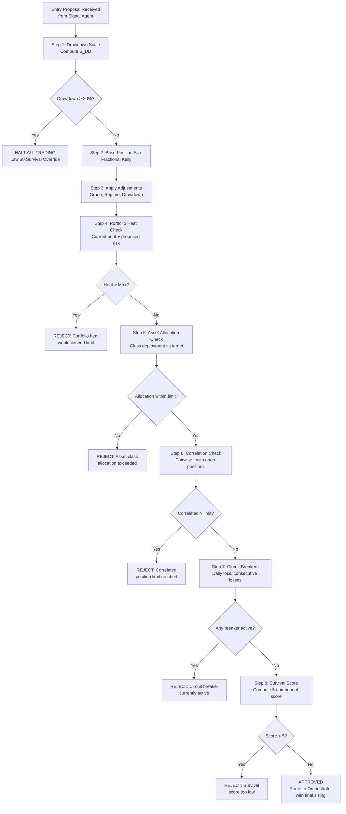
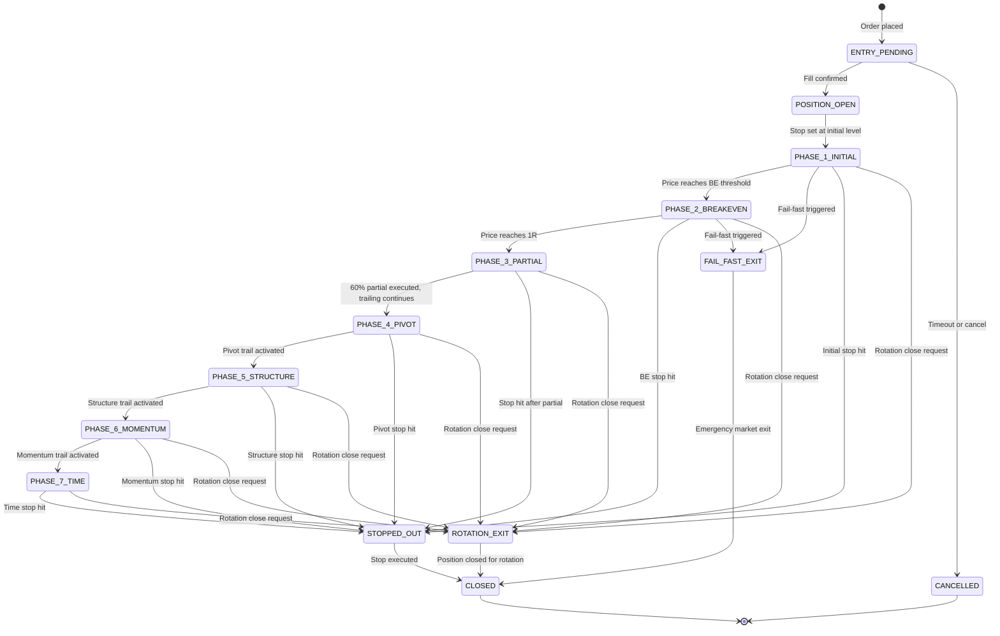
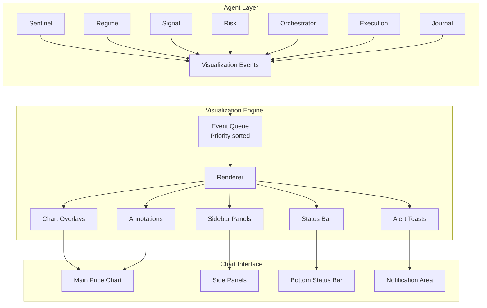
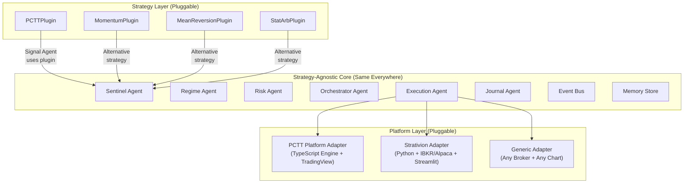

# PCTT Agentic System Architecture (Part 4)

## Architecture Review, Visualization Layer, Platform Abstraction, and Final Summary

**Version:** 1.0
**Author:** Kimal Honour Djam
**Extends:** Parts 1 (Sections 1-5), 2 (Sections 6-13), and 3 (Sections 14-16)
**Scope:** Architecture QA fixes, agent charting visualization layer, platform abstraction for multi-strategy deployment, Law 30 coverage matrix, and final system summary.

---

## 17. Architecture Review: Fixes and Reconciliations

A comprehensive QA review of Parts 1 through 3 identified 23 issues across four severity tiers. This section documents every fix with exact specifications, updated data structures, and corrected diagrams. Each fix is production-grade: implementable without ambiguity.

---

### 17.1 Critical Fixes

These four issues represent missing data flows, ambiguous limits, or absent enforcement mechanisms that would cause runtime failures if left unresolved.

---

#### Fix 1: HTF Slope Source for Macro Gate

**Problem:** The Signal agent's Stage 5 (Macro Gate) calls `check_macro_gate(direction, htf_slope)` but no agent computes or publishes `htf_slope`. The Regime agent publishes `regime_classification` events containing regime type and confidence, but not the higher-timeframe slope that the macro gate requires.

**Root Cause:** The Regime agent computes HTF context internally (Kalman slope and Efficiency Ratio operate on the meso timeframe) but does not expose the slope value in its output payload.

**Fix:** The Regime agent adds `htf_slope` to the `regime_classification` event payload. The Regime agent also writes this value to a new shared memory key `htf:{instrument}` after every ensemble run. The Signal agent reads this key at Stage 5.

**Updated RegimeClassification Output:**

```python
from dataclasses import dataclass
from datetime import datetime


@dataclass
class RegimeClassification:
    """
    Updated output from the Regime agent's run_ensemble tool.
    Now includes htf_slope for Signal agent's macro gate consumption.
    """
    instrument: str
    timeframe: str
    regime: str              # TRENDING, VOLATILE, MEAN_REVERTING, CHOPPY
    confidence: int          # Number of ensemble votes (0-6)
    ensemble_votes: dict     # {method_name: vote}
    efficiency_ratio: float  # Current ER value
    cusum_alarm: bool        # Whether CUSUM fired
    cusum_location: int      # Bar index of alarm (if fired)
    duration_bars: int       # How long current regime has persisted
    transition_probability: float  # Estimated probability of regime change
    htf_slope: float         # NEW: Kalman-filtered slope of the higher timeframe
    htf_direction: str       # NEW: "BULLISH", "BEARISH", or "FLAT"
    htf_timeframe: str       # NEW: The timeframe used for HTF analysis (e.g., "4h", "D")
    timestamp: datetime
```

**Updated Shared Memory Key:**

| Key Pattern | Owner | Readers | Tier | TTL |
|-------------|-------|---------|------|-----|
| `htf:{instrument}` | Regime | Signal | Warm (Redis) | Until next ensemble run |

**Signal Agent Stage 5 reads the value like this:**

```python
def check_macro_gate(direction: str, instrument: str) -> bool:
    """
    Stage 5: Macro Gate.
    Reads htf_slope from shared memory (written by Regime agent).
    Returns True if HTF slope aligns with proposed direction.
    """
    htf_data = read_memory(f"htf:{instrument}")
    if htf_data is None:
        return False  # Conservative: no data means no trade

    htf_slope = htf_data["htf_slope"]
    htf_direction = htf_data["htf_direction"]

    if direction == "LONG" and htf_direction in ("BULLISH", "FLAT"):
        return True
    if direction == "SHORT" and htf_direction in ("BEARISH", "FLAT"):
        return True
    return False
```

---

#### Fix 2: Correlated Position Limit Reconciliation

**Problem:** Part 1 Section 3.4 (Risk Agent) states a hard ceiling of 5 correlated positions, but Part 2 Section 7.2 (Guardrail Matrix) lists the operational limit as 3. These two numbers coexist without clarification, creating ambiguity about which limit applies.

**Fix:** Two-tier system with clear precedence rules.

| Tier | Limit | Conditions | Mode Availability |
|------|-------|------------|-------------------|
| **Normal (Operational)** | 3 correlated positions maximum | Default for all trading. No override needed. | MANUAL, SUPERVISED, AUTONOMOUS |
| **High-Conviction Override** | Up to 5 correlated positions | Requires explicit human approval at a dedicated Gate. Human must provide written rationale. Logged to Journal with "HIGH_CONVICTION_OVERRIDE" tag. | SUPERVISED only (human must be present to approve) |
| **Autonomous Hard Cap** | 3 correlated positions. No override possible. | In AUTONOMOUS mode, the system cannot request or execute a high-conviction override. The cap is hardcoded at 3. | AUTONOMOUS only |

**Decision flow for correlated position checks:**

```python
def check_correlated_positions(
    new_instrument: str,
    existing_positions: list,
    correlation_matrix: dict,
    current_mode: str,
    threshold: float = 0.70,
) -> dict:
    """
    Check whether adding new_instrument would violate correlated position limits.
    Returns approval status and details.
    """
    correlated_count = 0
    correlated_instruments = []

    for pos in existing_positions:
        pair_key = tuple(sorted([new_instrument, pos["instrument"]]))
        corr = correlation_matrix.get(pair_key, 0.0)
        if abs(corr) >= threshold:
            correlated_count += 1
            correlated_instruments.append({
                "instrument": pos["instrument"],
                "correlation": corr,
            })

    normal_limit = 3
    override_limit = 5

    if correlated_count < normal_limit:
        return {
            "approved": True,
            "correlated_count": correlated_count,
            "limit_applied": "NORMAL",
            "override_needed": False,
        }

    if correlated_count < override_limit and current_mode == "SUPERVISED":
        return {
            "approved": False,
            "correlated_count": correlated_count,
            "limit_applied": "NORMAL",
            "override_available": True,
            "override_type": "HIGH_CONVICTION",
            "requires": "Human approval with written rationale",
            "correlated_instruments": correlated_instruments,
        }

    # Hard cap reached or autonomous mode
    return {
        "approved": False,
        "correlated_count": correlated_count,
        "limit_applied": "HARD_CAP" if current_mode == "AUTONOMOUS" else "OVERRIDE_LIMIT",
        "override_available": False,
        "reason": f"{'Autonomous hard cap' if current_mode == 'AUTONOMOUS' else 'Maximum override limit'} of {normal_limit if current_mode == 'AUTONOMOUS' else override_limit} reached.",
        "correlated_instruments": correlated_instruments,
    }
```

---

#### Fix 3: Asset Allocation Enforcement in Risk Agent

**Problem:** Part 3 Section 14.4 defines a comprehensive cross-asset allocation framework with regime-based allocations, correlation caps, and performance tilts. However, no enforcement mechanism exists. The Risk agent can approve a trade that violates the allocation targets because it has no tool or memory structure to track deployed capital by asset class.

**Fix:** Add `asset_allocation` field to RiskMemory. Add `check_asset_allocation` tool to the Risk agent. Insert a new gate node into the Risk Decision Flow.

**Updated RiskMemory:**

```python
@dataclass
class RiskMemory:
    """
    Updated Risk agent memory structure.
    Now includes asset allocation tracking.
    """
    # Existing fields
    equity: float
    peak_equity: float
    current_drawdown_pct: float
    drawdown_scale: float
    open_positions: list
    portfolio_heat_pct: float
    daily_pnl: float
    daily_loss_limit_remaining: float
    consecutive_losses: int
    circuit_breaker_status: str
    survival_score: int
    correlation_matrix: dict

    # NEW: Asset allocation tracking
    asset_allocation: dict          # {asset_class: target_pct} from current regime allocation
    deployed_by_class: dict         # {asset_class: current_deployed_pct} computed from open positions
    allocation_headroom: dict       # {asset_class: remaining_pct} = target - deployed
    allocation_last_updated: str    # ISO-8601 timestamp
```

**New Risk Agent Tool:**

```python
def check_asset_allocation(
    instrument: str,
    asset_class: str,
    proposed_risk_dollars: float,
    total_equity: float,
    current_allocation: dict,
    target_allocation: dict,
) -> dict:
    """
    Check whether a proposed trade would violate asset class allocation limits.

    Parameters:
        instrument: The instrument being evaluated
        asset_class: Asset class of the instrument (equities, futures, forex, crypto, bonds, gold)
        proposed_risk_dollars: Dollar risk of the proposed trade
        total_equity: Current total account equity
        current_allocation: {asset_class: deployed_pct} current state
        target_allocation: {asset_class: target_pct} from regime allocation

    Returns:
        Dict with approved status, current usage, headroom, and reason if rejected.
    """
    proposed_pct = proposed_risk_dollars / total_equity
    current_pct = current_allocation.get(asset_class, 0.0)
    target_pct = target_allocation.get(asset_class, 0.0)
    max_single_class = 0.60  # Hard cap from Part 3

    new_total = current_pct + proposed_pct

    if new_total > max_single_class:
        return {
            "approved": False,
            "reason": f"Would exceed 60% single-class cap. Current: {current_pct:.1%}, Proposed: {proposed_pct:.1%}, Total: {new_total:.1%}.",
            "asset_class": asset_class,
            "current_pct": current_pct,
            "proposed_pct": proposed_pct,
            "target_pct": target_pct,
            "headroom": max(0, max_single_class - current_pct),
        }

    if new_total > target_pct * 1.25:  # 25% tolerance above target
        return {
            "approved": False,
            "reason": f"Would exceed allocation target by >25%. Target: {target_pct:.1%}, New total: {new_total:.1%}.",
            "asset_class": asset_class,
            "current_pct": current_pct,
            "proposed_pct": proposed_pct,
            "target_pct": target_pct,
            "headroom": max(0, target_pct * 1.25 - current_pct),
        }

    return {
        "approved": True,
        "asset_class": asset_class,
        "current_pct": current_pct,
        "proposed_pct": proposed_pct,
        "new_total_pct": new_total,
        "target_pct": target_pct,
        "headroom": max(0, target_pct * 1.25 - new_total),
    }
```

**Updated Risk Decision Flow (with new Asset Allocation gate):**



---

#### Fix 4: Rotation Close Instruction Event

**Problem:** Part 3 Section 16 describes the rotation framework where the Orchestrator decides to close a position for rotation, but no event type exists for the Orchestrator to instruct the Execution agent to close a position specifically for rotation purposes. The existing `stop_triggered` and `fail_fast` events serve different semantic purposes.

**Fix:** Add `rotation_close_request` event type. Add `ROTATION_EXIT` transition to the Position Lifecycle State Machine.

**New Event Type:**

| Event | Publisher | Subscribers | Payload |
|-------|----------|------------|---------|
| `rotation_close_request` | Orchestrator | Execution, Journal, Risk | `{position_id, instrument, reason, replacement_instrument, replacement_direction, replacement_q_score}` |

**Updated Position Lifecycle State Machine:**



**Execution agent behavior on `rotation_close_request`:**

1. Receive event with `position_id` and rotation context.
2. If position is currently in profit (R > 0), execute a market close immediately.
3. If position is at a loss (R < 0), execute a limit close at current bid/ask (no additional slippage tolerance). See Fix 13 for the special rule about pre-1R positions.
4. Log exit with `exit_reason: "ROTATION_EXIT"` in the PCTTTradeRecord.
5. Publish `position_update` event with `state: "ROTATION_EXIT"`.
6. After fill confirmation, publish `rotation_executed` event so the Orchestrator can proceed with the replacement entry.

---

### 17.2 High Priority Fixes

Five issues that affect completeness, clarity, or operational correctness.

---

#### Fix 5: Orchestrator Agent Tools Table

**Problem:** Part 1 provides complete tools tables for Sentinel, Regime, Signal, Risk, and Execution agents, but the Orchestrator agent specification lacks a formal tools table.

**Complete Orchestrator Agent Tools:**

| Tool | Description | Input | Output |
|------|------------|-------|--------|
| `present_approval_request` | Present a trade proposal to the human at the appropriate approval gate. Includes all context: direction, size, risk, Q-Score, grade, regime, dGeom, survival score. | `gate_type, proposal, risk_assessment, context` | `{request_id, status: "PENDING", expires_at}` |
| `notify_human` | Send a notification to the human via configured channels (Discord, SMS, email). Used for alerts, reports, and mode change notifications. | `notification_type, message, priority, channels` | `{delivered: bool, channel_results}` |
| `log_conflict` | Record an inter-agent conflict or disagreement. For example, Signal proposes but Risk vetoes. Captures both sides for Journal review. | `agent_a, agent_b, conflict_type, details, resolution` | `{conflict_id, logged: bool}` |
| `schedule_workflow` | Schedule a workflow phase transition. Manages the daily timeline: pre-market, session, lunch, power hour, post-market. | `phase_name, scheduled_time, dependencies` | `{schedule_id, confirmed: bool}` |
| `change_system_mode` | Transition the system between operating modes (MANUAL, SUPERVISED, AUTONOMOUS, HALTED). Enforces transition requirements from Section 15. | `target_mode, reason, human_confirmed` | `{success: bool, old_mode, new_mode, effective_at}` |
| `run_rotation_check` | Trigger a rotation evaluation. Computes HoldScores for all open positions and OpportunityScores for all watchlist instruments. Applies rotation decision framework. | `force: bool` | `{rotation_candidates: list, best_opportunity, recommendation}` |
| `broadcast_event` | Publish an event to all agents via the event bus. Used for system-wide announcements like mode changes, crisis alerts, and halt commands. | `event_type, payload, priority` | `{event_id, delivered_to: list}` |
| `read_all_agent_states` | Read the current state summary from all 7 agents. Returns a consolidated view for dashboard display and conflict detection. | None | `{agent_states: dict, system_health: str, active_conflicts: list}` |
| `publish_event` | Publish a specific event to the event bus. | `event_type, payload` | `{event_id, confirmation}` |
| `read_memory` | Read from shared memory store. | `key` | Value |
| `write_memory` | Write to shared memory store. | `key, value` | Confirmation |

**Total Orchestrator tools: 11**

---

#### Fix 6: Journal Agent Tools Table

**Problem:** Part 1 defines the Journal agent's responsibilities and memory structure but does not provide a formal tools table.

**Complete Journal Agent Tools:**

| Tool | Description | Input | Output |
|------|------------|-------|--------|
| `append_trade_record` | Record a completed trade with the full PCTTTradeRecord. Validates all required fields before persisting. | `trade_record: PCTTTradeRecord` | `{record_id, validated: bool, warnings: list}` |
| `compute_rolling_metrics` | Calculate rolling 20-trade performance metrics: win rate, expectancy, profit factor, average R, Sharpe ratio. Updates `metrics:rolling20` shared memory key. | `window_size: int = 20` | `RollingMetrics object` |
| `generate_daily_report` | Produce the end-of-day performance report including all trades, P&L, R-multiples, law violations, edge decay status, and one-sentence summary. | `date: str` | `DailyReport object` |
| `generate_weekly_report` | Produce the weekly review report with equity curve analysis, win/loss clustering, law violation tracking, setup attribution, and parameter adjustment recommendations. | `week_ending: str` | `WeeklyReport object` |
| `detect_edge_decay` | Run the 3-trigger edge decay detection system. Trigger 1: win rate below 40% over 20 trades. Trigger 2: average R declining for 3 consecutive 20-trade windows. Trigger 3: profit factor below 1.2 over 20 trades. | `lookback_trades: int = 20` | `{triggers_active: int, trigger_details: list, recommendation: str}` |
| `compute_instrument_performance` | Calculate per-instrument rolling metrics for rotation decisions. Updates `performance:instrument:{sym}` shared memory keys. | `instrument: str` | `InstrumentPerformance object` |
| `compute_rotation_metrics` | Calculate aggregate rotation performance metrics: hit rate, average R improvement, net rotation value, trend direction. | `rotation_records: list` | `RotationMetrics object` |
| `compute_mode_statistics` | Calculate performance metrics segmented by operating mode. Tracks autonomous vs supervised vs manual performance separately. | `mode: str` | `ModeStatistics object` |
| `publish_event` | Publish events to the event bus (edge decay alerts, trade recorded notifications). | `event_type, payload` | `{event_id, confirmation}` |
| `read_memory` | Read from shared memory store. | `key` | Value |
| `write_memory` | Write to shared memory store. | `key, value` | Confirmation |

**Total Journal tools: 11**

---

#### Fix 7: Circuit Breaker "3 Consecutive Losses" Reconciliation

**Problem:** Part 2 Section 7.2 lists "3 consecutive losses" as a soft guardrail with "Human can override" and "Size reduced 50%." But this does not define what happens if losses continue past 3. There is no escalation path from the soft trigger to a hard halt.

**Fix:** Two-stage escalation system.

| Stage | Trigger | Automatic Action | Human Required? | Recovery |
|-------|---------|-----------------|-----------------|----------|
| **Stage 1: Soft Pause** | 3 consecutive losses | Reduce all new position sizes by 50%. Alert human with full loss sequence analysis. Signal agent continues generating proposals. | No (auto-applied). Human CAN override to restore full size, but must acknowledge the alert. | Win 1 trade at reduced size to reset counter. |
| **Stage 2: Hard Halt** | 5 consecutive losses | HALT all new trading immediately. Existing positions continue under normal trailing stop management (do not force-close). Send urgent notification via all channels. | Yes. Formal review required. Human must: (1) review all 5 losses, (2) identify whether the losses are system failure or market regime mismatch, (3) explicitly re-enable trading. | Human completes review and re-enables. System restarts in current mode but at 50% size for the next 5 trades. |

**Updated consecutive loss tracking in RiskMemory:**

```python
@dataclass
class ConsecutiveLossTracker:
    """Tracks consecutive loss state for circuit breaker escalation."""
    count: int = 0
    stage: str = "NORMAL"         # NORMAL, SOFT_PAUSE, HARD_HALT
    size_multiplier: float = 1.0  # 1.0 normal, 0.5 during soft pause
    loss_sequence: list = None    # List of {trade_id, instrument, r_multiple, timestamp}
    soft_pause_since: str = None  # ISO-8601 timestamp
    hard_halt_since: str = None
    recovery_trades_remaining: int = 0  # After hard halt recovery, trades at 50% size

    def __post_init__(self):
        if self.loss_sequence is None:
            self.loss_sequence = []

    def record_result(self, is_win: bool, trade_info: dict) -> str:
        """
        Record a trade result and return the new stage.
        """
        if is_win:
            if self.stage == "SOFT_PAUSE":
                self.stage = "NORMAL"
                self.size_multiplier = 1.0
                self.count = 0
                self.loss_sequence = []
                self.soft_pause_since = None
            elif self.stage == "NORMAL" and self.recovery_trades_remaining > 0:
                self.recovery_trades_remaining -= 1
                if self.recovery_trades_remaining == 0:
                    self.size_multiplier = 1.0
            else:
                self.count = 0
                self.loss_sequence = []
            return self.stage

        # Loss recorded
        self.count += 1
        self.loss_sequence.append(trade_info)

        from datetime import datetime
        now = datetime.utcnow().isoformat()

        if self.count >= 5:
            self.stage = "HARD_HALT"
            self.size_multiplier = 0.0  # No new trades
            self.hard_halt_since = now
        elif self.count >= 3:
            self.stage = "SOFT_PAUSE"
            self.size_multiplier = 0.5
            self.soft_pause_since = now

        return self.stage
```

---

#### Fix 8: Journal Memory Update for Edge Decay Counting

**Problem:** The automatic mode downgrade logic (Section 15.3) states that 3 consecutive edge decay alerts trigger a downgrade from SUPERVISED to MANUAL. However, JournalMemory does not track the count of consecutive edge decay alerts or their history.

**Fix:** Add two fields to JournalMemory.

```python
@dataclass
class JournalMemory:
    """
    Updated Journal agent memory. New fields for edge decay tracking.
    """
    # Existing fields (from Part 1)
    trade_history: list
    rolling_metrics: dict
    daily_reports: list
    weekly_reports: list

    # NEW: Edge decay alert tracking
    consecutive_edge_decay_alerts: int = 0
    edge_decay_alert_history: list = None  # [{timestamp, triggers_active, trigger_details, mode_at_time}]
    last_edge_decay_check: str = None      # ISO-8601

    def __post_init__(self):
        if self.edge_decay_alert_history is None:
            self.edge_decay_alert_history = []

    def record_edge_decay_result(self, triggers_active: int, details: list) -> dict:
        """
        Record the result of an edge decay check.
        Returns action to take based on consecutive alert count.
        """
        from datetime import datetime
        now = datetime.utcnow().isoformat()
        self.last_edge_decay_check = now

        if triggers_active >= 2:
            # Edge decay alert fires when 2+ of 3 triggers are active
            self.consecutive_edge_decay_alerts += 1
            self.edge_decay_alert_history.append({
                "timestamp": now,
                "triggers_active": triggers_active,
                "trigger_details": details,
                "consecutive_count": self.consecutive_edge_decay_alerts,
            })

            if self.consecutive_edge_decay_alerts >= 3:
                return {
                    "action": "MODE_DOWNGRADE",
                    "from": "SUPERVISED",
                    "to": "MANUAL",
                    "reason": f"3 consecutive edge decay alerts. History: {len(self.edge_decay_alert_history)} total alerts.",
                    "consecutive_count": self.consecutive_edge_decay_alerts,
                }
            elif self.consecutive_edge_decay_alerts >= 1:
                return {
                    "action": "ALERT",
                    "message": f"Edge decay alert {self.consecutive_edge_decay_alerts}/3. Triggers active: {triggers_active}/3.",
                    "consecutive_count": self.consecutive_edge_decay_alerts,
                }
        else:
            # Edge is healthy. Reset consecutive counter.
            self.consecutive_edge_decay_alerts = 0
            return {
                "action": "NONE",
                "message": "Edge healthy. Consecutive alert counter reset.",
                "consecutive_count": 0,
            }
```

---

#### Fix 9: Correct Tool Count in Executive Summary

**Problem:** Part 1 Section 1 claims "7 agents, 23 tools." This was correct for the initial specification but is now outdated after adding Orchestrator tools, Journal tools, universe selection tools, the Regime batch classify tool (Fix 23), and the Risk asset allocation tool (Fix 3).

**Complete Tool Inventory:**

| Agent | Part 1 Core Tools | Part 3 Additions | Part 4 Fixes | Total |
|-------|------------------|-------------------|--------------|-------|
| **Sentinel** | 9 (fetch_ohlcv, fetch_vix, fetch_calendar, fetch_news, compute_overnight_gap, check_session_time, publish_event, read_memory, write_memory) | 9 (load_master_universe, screen_liquidity_batch, compute_suitability_batch, request_regime_batch, build_watchlist, apply_human_override, get_instrument_profile, publish_watchlist, log_universe_stats) | 0 | **18** |
| **Regime** | 9 (compute_efficiency_ratio, compute_crossing_count, compute_hurst_exponent, compute_kalman_slope, compute_cusum, compute_volatility_regime, run_ensemble, get_regime_parameters, publish_event) | 0 | 1 (classify_regime_batch, Fix 23) | **10** |
| **Signal** | 13 (detect_pivots, generate_candidates, fit_huber, fit_ransac, calculate_q_score, grade_setup, check_macro_gate, detect_break, freeze_lines, detect_retest, score_rejection, risk_geometry, publish_event) | 0 | 0 | **13** |
| **Risk** | 9 (calculate_position_size, compute_drawdown_scale, compute_portfolio_heat, check_correlation, compute_survival_score, check_circuit_breakers, kelly_criterion, compute_ruin_probability, publish_event) | 0 | 1 (check_asset_allocation, Fix 3) | **10** |
| **Orchestrator** | 0 (was missing) | 0 | 11 (Fix 5) | **11** |
| **Execution** | 10 (place_order, cancel_order, modify_order, get_position, get_fills, compute_trailing_stop, check_fail_fast, check_stagnation, execute_partial_exit, publish_event) | 0 | 0 | **10** |
| **Journal** | 0 (was missing) | 0 | 11 (Fix 6) | **11** |

**Corrected total: 83 tools across 7 agents.**

The executive summary should read: "7 agents, 83 tools, 12 pipeline stages, 4 approval gates."

---

### 17.3 Medium Priority Fixes

Six issues affecting data persistence, handoff clarity, or operational detail.

---

#### Fix 10: consumed_breaks Persistence

**Problem:** The Signal agent's `consumed_breaks` set (tracking which structures have been used for one-break-one-trade enforcement) is not listed in the shared memory keys table. If the system restarts mid-session, consumed break state would be lost, allowing duplicate entries on the same structure.

**Fix:** Add to shared memory keys table.

| Key Pattern | Owner | Readers | Tier | TTL | Persistence |
|-------------|-------|---------|------|-----|-------------|
| `consumed_breaks:{instrument}` | Signal | Signal | Warm (Redis) | 24 hours (one trading session) | On system restart, reload from warm store. On daily reset (post-market), clear all entries. |

**Data format stored:**

```python
# Value stored at consumed_breaks:{instrument}
# Set of structure_id strings that have been consumed
consumed_breaks_value = {
    "structure_ids": ["struct_AAPL_20260220_1042", "struct_AAPL_20260220_1415"],
    "session_date": "2026-02-22",
    "last_updated": "2026-02-22T14:15:30Z",
}
```

On system restart, the Signal agent reads this key for each active instrument. If the session date matches today, the consumed structures are restored. If the date is from a previous session, the key is cleared (new session, fresh structures).

---

#### Fix 11: Signal FSM to Execution FSM Handoff

**Problem:** The Signal agent has its own finite state machine (IDLE, WAIT_RETEST, REJECTION, ENTRY_SIGNAL) and the Execution agent has its own (ENTRY_PENDING, POSITION_OPEN, PHASE_1 through PHASE_7, CLOSED). The handoff between these two state machines passes through Risk validation and Human approval, but no diagram shows the complete connected flow.

**Fix:** Complete handoff diagram showing both state machines connected by the approval pipeline.

```mermaid
graph LR
    subgraph "Signal Agent FSM"
        S_IDLE[IDLE<br/>Scanning for breaks] --> S_WAIT[WAIT_RETEST<br/>Break confirmed,<br/>awaiting retest]
        S_WAIT --> S_REJ[REJECTION<br/>Retest detected,<br/>scoring rejection bar]
        S_REJ --> S_ENTRY[ENTRY_SIGNAL<br/>Rejection confirmed,<br/>dGeom passed]
        S_WAIT --> S_IDLE
        S_REJ --> S_IDLE
    end

    subgraph "Approval Pipeline"
        S_ENTRY --> R_VAL[Risk Validation<br/>Sizing + Heat +<br/>Allocation + Correlation +<br/>Circuit Breakers +<br/>Survival Score]
        R_VAL --> R_PASS{Risk<br/>Approved?}
        R_PASS -->|No| R_VETO[Risk Veto<br/>Log to Journal]
        R_PASS -->|Yes| H_GATE[Human Approval<br/>Gate 1]
        H_GATE --> H_DEC{Human<br/>Decision}
        H_DEC -->|Approve| E_START[Route to<br/>Execution]
        H_DEC -->|Modify| M_ADJ[Adjust Params] --> E_START
        H_DEC -->|Reject| H_REJ[Log Rejection]
        H_DEC -->|Timeout| H_EXP[Auto-Expire]
    end

    subgraph "Execution Agent FSM"
        E_START --> E_PEND[ENTRY_PENDING<br/>Order placed]
        E_PEND --> E_OPEN[POSITION_OPEN<br/>Fill confirmed]
        E_OPEN --> E_P1[PHASE_1<br/>Initial stop]
        E_P1 --> E_P2[PHASE_2<br/>Breakeven]
        E_P2 --> E_P3[PHASE_3<br/>Partial at 1R]
        E_P3 --> E_P4[PHASE_4<br/>Pivot trail]
        E_P4 --> E_P5[PHASE_5<br/>Structure trail]
        E_P5 --> E_P6[PHASE_6<br/>Momentum trail]
        E_P6 --> E_P7[PHASE_7<br/>Time stop]
        E_P7 --> E_CLOSED[CLOSED]
    end

    R_VETO --> S_IDLE
    H_REJ --> S_IDLE
    H_EXP --> S_IDLE
```



---

#### Fix 12: Kelly Criterion Data Contract

**Problem:** The Risk agent uses Kelly criterion inputs (win rate, payoff ratio) for position sizing, but the source of these inputs is not formally specified. The Journal agent computes rolling metrics but the exact fields published to shared memory are not defined as a data contract.

**Fix:** The Journal agent publishes `KellyInputs` within the `metrics:rolling20` shared memory key.

```python
@dataclass
class KellyInputs:
    """
    Kelly criterion inputs computed by the Journal agent from rolling trade history.
    Published to metrics:rolling20 shared memory key.
    Consumed by the Risk agent for position sizing.
    """
    win_rate: float           # Wins / total trades over rolling window
    avg_winner_r: float       # Average R-multiple of winning trades
    avg_loser_r: float        # Average R-multiple of losing trades (positive value)
    payoff_ratio: float       # avg_winner_r / avg_loser_r
    sample_size: int          # Number of trades in the rolling window
    kelly_fraction: float     # Computed: (win_rate * payoff_ratio - (1 - win_rate)) / payoff_ratio
    half_kelly: float         # kelly_fraction * 0.5 (recommended default)
    quarter_kelly: float      # kelly_fraction * 0.25 (conservative default)
    last_updated: str = ""    # ISO-8601 timestamp


def compute_kelly_inputs(trade_history: list, window: int = 20) -> KellyInputs:
    """
    Compute Kelly criterion inputs from the most recent N trades.
    """
    recent = trade_history[-window:] if len(trade_history) >= window else trade_history
    if not recent:
        return KellyInputs(
            win_rate=0.0, avg_winner_r=0.0, avg_loser_r=1.0,
            payoff_ratio=0.0, sample_size=0,
            kelly_fraction=0.0, half_kelly=0.0, quarter_kelly=0.0,
        )

    winners = [t for t in recent if t["r_multiple"] > 0]
    losers = [t for t in recent if t["r_multiple"] <= 0]

    win_rate = len(winners) / len(recent)
    avg_winner = sum(t["r_multiple"] for t in winners) / len(winners) if winners else 0.0
    avg_loser = abs(sum(t["r_multiple"] for t in losers) / len(losers)) if losers else 1.0

    payoff = avg_winner / avg_loser if avg_loser > 0 else 0.0

    if payoff > 0:
        kelly = (win_rate * payoff - (1.0 - win_rate)) / payoff
    else:
        kelly = 0.0

    kelly = max(0.0, kelly)  # Never negative

    from datetime import datetime
    return KellyInputs(
        win_rate=win_rate,
        avg_winner_r=avg_winner,
        avg_loser_r=avg_loser,
        payoff_ratio=payoff,
        sample_size=len(recent),
        kelly_fraction=kelly,
        half_kelly=kelly * 0.5,
        quarter_kelly=kelly * 0.25,
        last_updated=datetime.utcnow().isoformat(),
    )
```

The Risk agent reads from `metrics:rolling20` and uses `quarter_kelly` as the default fraction for position sizing, escalating to `half_kelly` only for A-Grade setups in TRENDING regime with survival score >= 9.

---

#### Fix 13: Rotation vs Mandatory Partial Exit Rule

**Problem:** The mandatory partial exit rule states "close 60% at 1R." The rotation framework can close a position at any point. If a position has not yet reached 1R, should a rotation close respect the partial exit rule?

**Fix:** Exception rule for rotation exits.

**Rule:** If a position has NOT yet reached 1R at the time of a rotation close, the rotation acts as a **normal full exit**. The mandatory 60% partial at 1R applies exclusively to trailing stop exits, not to rotation exits.

**Rationale:** The partial exit rule exists to lock in profit during the trailing stop lifecycle. A rotation close is a portfolio-level decision to redeploy capital. Forcing a partial close on a sub-1R position that is being fully exited for rotation serves no purpose.

**Implementation:**

```python
def execute_rotation_close(position: dict, rotation_context: dict) -> dict:
    """
    Execute a rotation close. Handles the 1R partial exit exception.
    """
    current_r = position["current_r"]

    if current_r < 1.0:
        # Pre-1R position: full exit, skip partial logic entirely
        return {
            "exit_type": "FULL",
            "skip_partial": True,
            "reason": "Rotation exit on pre-1R position. Partial rule does not apply.",
            "exit_size_pct": 100,
        }
    else:
        # Post-1R position: if 60% partial already taken, close remaining 40%
        # If partial not yet taken (edge case), close 100% as full exit
        if position.get("partial_executed", False):
            return {
                "exit_type": "FULL_REMAINING",
                "skip_partial": False,
                "reason": "Rotation exit on post-1R position. Closing remaining 40%.",
                "exit_size_pct": 100,  # 100% of remaining shares
            }
        else:
            return {
                "exit_type": "FULL",
                "skip_partial": True,
                "reason": "Rotation exit. Full close regardless of partial status.",
                "exit_size_pct": 100,
            }
```

---

#### Fix 14: Mode-Aware Morning Briefing

**Problem:** The morning briefing in Part 2 Section 6.2.3 shows a single footer with `[Approve Plan] [Modify] [No Trading Today]`. This footer does not change based on operating mode, but the available actions differ significantly between MANUAL, SUPERVISED, and AUTONOMOUS modes.

**Fix:** Three mode-specific footers.

**MANUAL Mode Footer:**

```
========================================
OPERATING MODE: MANUAL (Advisory Only)
========================================
The system will display recommendations.
You execute trades manually on your broker.

[Plan Acknowledged] [No Trading Today]
========================================
```

**SUPERVISED Mode Footer:**

```
========================================
OPERATING MODE: SUPERVISED (Human-in-the-Loop)
========================================
The system will route proposals for your approval.
You approve or reject each trade at the gate.

[Approve Plan] [Modify] [No Trading Today]
========================================
```

**AUTONOMOUS Mode Footer:**

```
========================================
OPERATING MODE: AUTONOMOUS (System Executing)
========================================
The system will execute A-Grade setups automatically.
Tightened guardrails active: 0.75% risk, 4% heat, 4 max positions.
You will receive notifications for every action.

[System Executing Plan] [Override: Pause] [Override: No Trading]
========================================
```

---

#### Fix 15: Approval Gates are Mode-Dependent

**Problem:** The 4 approval gates specification in Part 1 Section 2.4 does not reference the operating mode system defined in Part 3 Section 15. The gates behave differently depending on the mode, but this cross-reference is missing.

**Fix:** Add the following note to the approval gates specification.

**Note for Section 2.4:** Gate enforcement depends on the current operating mode. In MANUAL mode, all gates function as acknowledgment buttons (no blocking). In SUPERVISED mode, all gates enforce blocking approval with timeout. In AUTONOMOUS mode, Gates 1-3 are bypassed (system auto-approves after Risk validation). Gate 4 (Crisis) always enforces a halt regardless of mode. See Part 3 Section 15 for complete per-mode gate behavior.

| Gate | MANUAL | SUPERVISED | AUTONOMOUS |
|------|--------|-----------|------------|
| **G1: Trade Entry** | Displayed as recommendation. Human acknowledges. | Blocking approval. 2-bar timeout. Auto-expire on timeout. | Bypassed. Risk-approved proposals execute immediately. |
| **G2: Pyramiding** | Displayed as recommendation. Human acknowledges. | Blocking approval. Auto-reject on timeout (conservative). | Bypassed. System auto-decides based on pyramid conditions. |
| **G3: Override Stop** | Not applicable (human manages stops manually). | Manual trigger only. Human provides reason. | Not applicable (system manages all stops). |
| **G4: Crisis Mode** | Blocking halt. System freezes. Human must re-enable. | Blocking halt. System freezes. Human must re-enable. | Blocking halt. System freezes. Auto-downgrades to SUPERVISED on recovery. |

---

### 17.4 Low Priority Fixes

Seven items addressed concisely.

---

**Fix 16: Crisis Protocols Schema Reference**

The crisis protocol configuration should be loaded from `config/crisis-protocols.yaml`. Schema:

```yaml
# config/crisis-protocols.yaml
crisis:
  triggers:
    vix_threshold: 35
    spx_drop_pct: 3.0
    correlation_threshold: 0.70
    spread_multiplier: 3.0
  phase_1_reduce:
    max_duration_minutes: 30
    cut_exposure_pct: 50
    max_heat_pct: 3.0
    widen_stops_atr_multiplier: 1.5
  phase_2_hedge:
    max_duration_minutes: 30
    max_positions: 3
    daily_loss_limit_pct: 1.5
  phase_3_monitor:
    report_interval_hours: 2
  re_entry:
    day_1_to_5_size_pct: 25
    day_5_to_10_size_pct: 50
    day_10_to_20_size_pct: 75
    day_20_plus_size_pct: 100
    vix_below_threshold: 25
    vix_consecutive_sessions: 5
    correlation_below: 0.50
    spread_below_multiplier: 1.5
```

---

**Fix 17: Post-20%-Drawdown Re-Entry Protocol**

After a 20% drawdown triggers HALTED mode, the re-entry protocol mirrors the crisis re-entry schedule with an additional constraint:

1. Days 1-5 after re-enable: 25% of normal position size.
2. Days 5-10: 50% size.
3. Days 10-20: 75% size.
4. Day 20+: 100% size if metrics are clean.
5. **Mandatory 5-session MANUAL mode** before any upgrade to SUPERVISED. The system must demonstrate stable advisory-mode performance before regaining execution authority.

---

**Fix 18: Lunch Hour Position Management Clarification**

During lunch hour (11:30-13:30 ET), position management continues normally:
- Stop orders remain active and execute if hit.
- Partial exit at 1R fires if the threshold is crossed during lunch.
- Trailing stop updates continue per phase rules.
- The ONLY thing paused is **new signal generation**. The Signal agent's 12-stage pipeline does not run on new bars during lunch. Existing positions are fully managed.

---

**Fix 19: Gantt Universe Refresh Band**

The Part 2 Gantt chart (Section 6.1) should include a "Universe Refresh" band in the Sentinel row at T-60 minutes before market open (08:30 ET for US equities). This is when Sentinel runs the Stage 4-5 daily watchlist refresh. The existing Gantt shows "Wake + Data Collection" starting at 08:00, but the universe refresh is a distinct sub-task within that window.

**Amended Sentinel timeline:**

| Time | Task |
|------|------|
| 08:00 | Wake + Data Collection |
| 08:30 | **Universe Refresh (Stage 4-5 daily)** |
| 08:45 | Gap Analysis + News Scan |
| 09:00 | MarketBrief Publication |
| 09:30-16:00 | Session Monitoring |
| 16:00-16:30 | Post-Market Wind Down |

---

**Fix 20: AFTER_HOURS Session Phase**

Add `AFTER_HOURS` to the SentinelMemory session phase enum.

```python
class SessionPhase(str):
    PRE_MARKET = "PRE_MARKET"
    MARKET_OPEN = "MARKET_OPEN"
    FIRST_30_MIN = "FIRST_30_MIN"
    CORE_SESSION = "CORE_SESSION"
    LUNCH_HOUR = "LUNCH_HOUR"
    POWER_HOUR = "POWER_HOUR"
    MARKET_CLOSE = "MARKET_CLOSE"
    POST_MARKET = "POST_MARKET"
    AFTER_HOURS = "AFTER_HOURS"  # NEW
```

**AFTER_HOURS behavior:**
- Monitoring only. Sentinel tracks overnight futures, VIX futures, and any relevant global market activity.
- No new signals generated. Signal agent is inactive.
- Stop management for overnight positions continues (for instruments that trade after hours, such as futures and crypto).
- Regime agent does not run ensemble (insufficient volume for meaningful classification).
- Journal agent may run end-of-day analytics if not yet completed.

---

**Fix 21: Law 24 in Section 2.2 Summary Table**

The Section 2.2 summary table for Sentinel should include Law 24. The current table lists Laws 3, 8, 9. Add Law 24 (Asset Allocation / Diversification) because the Sentinel agent now owns universe selection and cross-asset allocation (Part 3 Section 14.4).

**Updated Sentinel row:**

| # | Agent | Layer | Primary Laws | Core Responsibility |
|---|-------|-------|-------------|-------------------|
| 1 | **Sentinel** | Perception | 3, 8, 9, 24 | Market monitoring, session management, watchlist curation, universe selection, asset allocation |

---

**Fix 22: Sentinel Tool Set Clarification**

The Sentinel tools listed in Part 1 (9 tools) should be considered the "core" set for market monitoring and session management. Part 3 adds 9 universe selection tools. The total Sentinel tool count is 18. Both sets are active simultaneously. The core tools run every bar; the universe tools run on their rebalancing schedule (weekly full, daily refresh).

---

**Fix 23: Regime Agent Batch Classification Tool**

Add `classify_regime_batch` to the Regime agent specification.

| Tool | Description | Input | Output |
|------|------------|-------|--------|
| `classify_regime_batch` | Run the 6-method ensemble on a list of instruments in a single call. Used by Sentinel during Stage 4 universe filtering and daily watchlist refresh. More efficient than calling `run_ensemble` per instrument. | `instruments: list, timeframe: str` | `Dict[str, RegimeClassification]` |

---

## 18. Agent Charting Visualization Layer

### 18.1 Design Philosophy

The visualization layer exists to make the invisible visible. Every agent in the PCTT system processes information that is, by default, hidden inside data structures, memory stores, and event payloads. The human sees only the final output: an entry arrow, a stop line, a P&L number. But between "new bar arrives" and "entry arrow appears," the system performs hundreds of computations across seven agents. The visualization layer surfaces these computations as real-time chart artifacts.

This is not decorative. It serves three non-negotiable purposes.

**Purpose 1: Transparency.** The human must see exactly what the system sees. When the system identifies a pivot, the human sees the pivot dot appear. When a candidate trendline is generated and scored, the human sees the line fade in with its Q-Score badge. When that line fails the quality threshold, the human sees it dissolve. This transparency builds the trust required for a human to delegate capital decisions to an automated system.

**Purpose 2: Debugging.** When a trade fails, the chart tells the story. The pipeline stage badges show exactly where each bar passed or failed the 12-stage pipeline. The rejection annotation shows which features scored and which did not. The regime tint shows whether the environment changed. Without visualization, debugging requires log parsing. With visualization, debugging is visual and immediate.

**Purpose 3: Learning.** A trader watching the PCTT system work on a chart learns the methodology faster than reading the book. They see pivots form, trendlines connect them, Q-Scores separate good lines from noise, breaks confirm, retests approach, rejections score, and entries fire. The visual story teaches the PCTT method through observation, reinforcing every concept from Chapters 1 through 30.

---

### 18.2 Visualization Architecture



---

### 18.3 Per-Agent Visual Outputs

---

#### SENTINEL Agent Visuals

The Sentinel agent paints the context layer: the backdrop against which all trading activity occurs.

**Session Phase Bands.** Color-coded background bands spanning the full chart width, one per session phase. Pre-market renders as a medium gray (#E0E0E0 in light theme, #2A2A2A in dark theme). Market open renders as white (light) or dark base (#1A1A1A dark). Lunch hour renders as a faint yellow tint (#FFFDE7 light, #2A2A00 dark) to visually signal "caution: no new signals." Power hour renders as a faint blue tint (#E3F2FD light, #0A1A2A dark) to signal heightened activity. After-hours renders as a darker gray (#BDBDBD light, #1A1A1A dark).

**Economic Event Markers.** Vertical dotted lines at the timestamp of each Tier 1 and Tier 2 calendar event, extending from the top of the chart to the bottom. Each line carries a label: "CPI 8:30 AM", "FOMC 2:00 PM", "NFP 8:30 AM". Tier 1 events use a bold red dotted line. Tier 2 events use a thinner orange dotted line. Tier 3 events are not drawn (too noisy).

**VIX Level Indicator.** A badge in the top-right corner of the chart showing the current VIX level with color coding. Green badge: VIX < 15 (LOW_VOL). Yellow badge: VIX 15-20 (NORMAL). Orange badge: VIX 20-30 (ELEVATED). Red badge: VIX > 30 (CRISIS). The badge includes the numeric value and a directional arrow (up, down, flat).

**Gap Annotation.** At the first bar of the session, a horizontal bracket annotation shows the gap size: "Gap: +0.4% (MEDIUM)" with an upward arrow for bullish gaps, downward arrow for bearish gaps. The gap classification (SMALL, MEDIUM, LARGE, MASSIVE) determines the annotation color.

**Overnight Range Shading.** A subtle gray horizontal band between the overnight high and overnight low, visible across the pre-market and early session bars. Helps the trader see whether price is trading within or outside the overnight range.

---

#### REGIME Agent Visuals

The Regime agent paints the environment layer: what type of market this is right now.

**Regime Background Tint.** A very subtle full-chart-width background tint that sits behind all price data. TRENDING regime: faint green (#E8F5E9 light, rgba(0,100,0,0.05) dark). VOLATILE regime: faint orange (#FFF3E0 light, rgba(200,100,0,0.05) dark). MEAN_REVERTING regime: faint blue (#E3F2FD light, rgba(0,50,200,0.05) dark). CHOPPY regime: faint red with diagonal hash lines (#FFEBEE with 45-degree lines, rgba(200,0,0,0.05) dark). The hash lines on CHOPPY make it visually distinct from a trading-eligible regime.

**Regime Label Badge.** Top-left corner badge displaying the current regime in a compact format: "TRENDING 5/6 | ER=0.52 | 47 bars". The first segment is the regime name and confidence (votes out of 6). The second is the current Efficiency Ratio. The third is how many bars the current regime has persisted. Badge background color matches the regime tint.

**Regime Transition Markers.** When the regime changes, a vertical dashed line appears at the transition bar. Above the line, a label reads "REGIME CHANGE: TRENDING -> VOLATILE". The line uses the color of the new regime. The label persists for 20 bars before fading to a small icon.

**CUSUM Alarm Markers.** When the CUSUM change detector fires, a small upward-pointing triangle icon appears below the bar (for bearish alarms) or above the bar (for bullish alarms). Color: bright orange. These are relatively rare and signal potential regime change before the ensemble confirms.

**Efficiency Ratio Mini-Chart.** A small subplot below the main price chart (15% of chart height) showing the ER line over the lookback window. Horizontal threshold lines at 0.30 (below which CHOPPY is likely) and 0.55 (above which TRENDING is likely). The ER line color matches the current regime color. This subplot can be toggled off in the visualization config.

---

#### SIGNAL Agent Visuals

This is the core visual layer. This is where the magic happens. The Signal agent's visualization transforms the chart from a static price history into a living, breathing analytical workspace.

**Detected Pivots.** Small circles appear on confirmed pivot highs (blue circles, radius 4px) and pivot lows (red circles, radius 4px). Pivots are confirmed by the adaptive zigzag algorithm and only appear after the right-side confirmation bars complete. This means they appear with a slight delay (the right parameter, typically 5 bars), which is correct because the system uses t-1 data. Unconfirmed potential pivots do not render (this prevents repainting artifacts in the visualization).

**Candidate Trendlines.** When the Signal agent generates candidate lines from pivot pairs, these render as thin dashed gray lines (1px width, 50% opacity). Lines extend from their first pivot to the current bar. Multiple candidates may be visible simultaneously, creating a web of potential structure. This visual is deliberately "noisy" at this stage because it represents the raw analytical output before quality filtering. Advanced users may disable this layer if they prefer a cleaner chart.

**Scored Lines with Q-Score Labels.** Lines that pass the minimum Q-Score threshold (Q >= 0.55) transition from gray dashed to solid colored lines. The transition happens as an animation: the gray dashed line brightens and solidifies over 300ms. A small Q-Score badge appears near the rightmost point of the line.

A-Grade lines (Q >= 0.70): solid green for support lines, solid red for resistance lines, 2px width. Badge shows "Q=0.72 A" in a green (support) or red (resistance) background.

B-Grade lines (Q >= 0.55 and Q < 0.70): solid but thinner (1px width). Same color scheme. Badge shows "Q=0.58 B".

Failed lines (Q < 0.55): fade away with a 500ms dissolve animation. This creates a natural visual hierarchy where only quality lines survive on the chart.

**Frozen Structure Visualization.** This is the most critical visual element in the entire system. When a break is confirmed and lines are frozen, the visualization undergoes a dramatic transformation.

The Action Line renders as a bold solid line (3px width). For a long setup (broken resistance becomes support), the line is green. For a short setup (broken support becomes resistance), the line is red. The label "ACTION" appears in a badge anchored to the right end of the line.

The Safety Line renders as a bold dashed line (3px width) in a contrasting color. For a long setup, the Safety Line is orange (below the Action Line). For a short setup, the Safety Line is orange (above the Action Line). The label "SAFETY" appears in a badge anchored to the right end of the line.

Both lines extend forward from the break bar using the frozen slope. They do not recalculate or repaint. They project into the future as fixed reference levels.

The break bar itself receives a special marker: a diamond icon at the bar's close price. The diamond color matches the direction (green for bullish break, red for bearish break).

A subtle gradient fill appears between the Action Line and Safety Line. For long setups: a faint green gradient fading from the Action Line downward. For short setups: a faint red gradient fading from the Action Line upward. This "break zone" is immediately recognizable.

**Pipeline Stage Indicators.** Along the bottom of each bar, small numbered badges (1 through 12, each 8px wide) show which pipeline stage was reached during that bar's evaluation. Passed stages render as filled green circles. Failed stages render as filled red circles. Unreached stages render as hollow gray circles.

Bars that pass all 12 stages receive a bright yellow highlight glow around the bar itself (a subtle radial glow, not solid fill). This makes the "entry bar" immediately recognizable even in a dense chart.

Bars that fail at Stage 1 or 2 (the most common case, as 99%+ of bars are filtered early) show only the first few dots to minimize visual clutter. A compact tooltip on hover reveals the full 12-stage breakdown.

**Retest Zone.** When the Signal FSM enters WAIT_RETEST state, a shaded band appears around the Action Line. The band width is 0.4 ATR above and below the Action Line value. Color: semi-transparent yellow (#FFF9C4, 30% opacity). The band makes it visually clear where price needs to reach for a valid retest.

A countdown timer badge appears near the retest zone: "Retest window: 8/12 bars remaining." The timer counts down each bar. If the window expires without a retest, the zone fades away and the FSM returns to IDLE.

**Rejection Bar Markup.** When a bar enters the retest zone and the rejection scoring begins, the bar receives real-time annotation:

Feature 1 (wick ratio): green checkmark or red X icon, positioned above the bar.
Feature 2 (body position): green checkmark or red X, positioned to the right.
Feature 3 (volume confirmation): green checkmark or red X, positioned below.
Feature 4 (follow-through): green checkmark or red X, positioned to the left.

A score badge appears: "REJ 3/4" (amber background if 3/4) or "REJ 4/4" (green background). If the score is below 3/4, the badge shows "REJ 2/4" (red background) and the entry does not fire.

An arrow pointing at the proposed entry price level appears when the score is sufficient.

**dGeom Visualization.** A vertical distance bracket (like a measurement tool) appears between the proposed entry price and the Safety Line. The bracket is labeled "dGeom = 1.8 ATR" with the numeric value. If dGeom exceeds 2.5 ATR (the filter threshold), the bracket renders in red with a "FILTERED" label. If dGeom is within the acceptable range (0.5-2.5 ATR), the bracket renders in green.

**Entry Signal Marker.** The culmination of the visual story. A large arrow (20px height) appears at the proposed entry price level. Green upward arrow for long entries. Red downward arrow for short entries. The arrow has a subtle glow effect to draw attention.

A popup tooltip appears on hover (or tap on mobile) showing the complete signal summary: Q-Score, Grade, Regime, dGeom, HTF alignment, rejection score, and all 12 pipeline stage results.

A dotted horizontal line extends from the entry arrow across the chart at the proposed entry price, providing a visual reference level.

---

#### RISK Agent Visuals

The Risk agent annotates each proposal with sizing and risk context.

**Position Size Annotation.** Near the entry arrow, a text label appears: "76 shares | $494 risk | 0.99%". This shows the human exactly what the Risk agent computed: share count, dollar risk, and percentage of equity at risk. Font: monospace, slightly smaller than default chart text. Background: semi-transparent dark panel.

**Portfolio Heat Gauge.** In the right sidebar, a vertical thermometer graphic. The mercury level shows current portfolio heat as a percentage of the 6% maximum (or 4% in autonomous mode). Color gradient: green (0-2%), yellow (2-4%), orange (4-5%), red (5-6%). The numeric value is displayed above the gauge: "Heat: 2.8% / 6.0%".

**Drawdown Scale Indicator.** A compact badge in the sidebar: "DD: 2.1% | Scale: 0.92x". Shows current drawdown percentage and the S(DD) scaling factor. Color: green if scale > 0.8, yellow if 0.5-0.8, red if < 0.5.

**Survival Score Badge.** A circular badge: "Survival: 8/10". Color coding: green background for scores 8-10, yellow for 6-7, red for scores below 6. The five component scores are available in a tooltip on hover.

**Circuit Breaker Status.** A traffic light icon in the status bar. Green: all clear, no breakers active. Yellow: soft pause active (3 consecutive losses, size reduced 50%). Red: hard halt active (5 consecutive losses or 2% daily loss breaker). The icon pulses when in yellow or red state.

**Risk Veto Annotation.** When the Risk agent vetoes a proposal, a prominent red banner appears at the proposed entry level: "RISK VETO: Portfolio heat would exceed 6.0%." or "RISK VETO: Correlated position limit (3/3)." The banner persists for 10 bars before fading.

---

#### ORCHESTRATOR Agent Visuals

The Orchestrator provides the human interaction layer.

**Approval Gate Popup.** When a proposal reaches the human for approval, a prominent panel slides in from the right side of the chart. Panel contents:

```
+---------------------------------------+
| APPROVAL REQUIRED: Trade Entry (G1)   |
+---------------------------------------+
| Instrument: NVDA                      |
| Direction:  LONG                      |
| Entry:      $875.20                   |
| Stop:       $868.50 (0.77% risk)     |
| Size:       76 shares ($494 risk)     |
| Q-Score:    0.72 (A-Grade)           |
| Regime:     TRENDING (5/6)           |
| dGeom:      1.8 ATR                  |
| Survival:   8/10                     |
| Heat After: 2.8% -> 3.8%            |
+---------------------------------------+
| [====TIMER BAR: 1:42 remaining====]  |
+---------------------------------------+
| [APPROVE]  [MODIFY]  [REJECT]        |
+---------------------------------------+
```

The timer bar is a horizontal progress bar that depletes over 2 bars (the proposal timeout). When it reaches zero, the proposal auto-expires.

**System Mode Indicator.** A top banner spanning the chart width. Text and color vary by mode:
- "NORMAL" mode: green banner, white text.
- "CAUTION" mode: yellow banner, black text (active when 1+ edge decay triggers or drawdown > 5%).
- "CRISIS" mode: red banner, white text (crisis protocol active).
- "HALTED" mode: black banner, white text, pulsing border.

**Agent Status Sidebar.** Seven rows in the right sidebar, one per agent. Each row shows: agent name, current state (as a brief label), and an activity indicator (pulsing dot for active, static dot for idle, red dot for error).

```
Sentinel:    [*] Session Monitoring
Regime:      [*] TRENDING 5/6 (47 bars)
Signal:      [*] NVDA in WAIT_RETEST
Risk:        [*] Heat 2.8%, No Breakers
Orchestrator:[*] NVDA Pending Approval
Execution:   [*] Managing AAPL Phase 4
Journal:     [*] Recording (1W 0L today)
```

**Conflict Resolution Log.** A scrollable panel (collapsed by default, expandable) showing recent inter-agent decisions. Example entries:
- "10:42 Signal proposed NVDA LONG. Risk APPROVED. Routing to human."
- "10:15 Rotation check: AAPL Hold=1.2, MSFT Opportunity=1.8. Threshold not met. No rotation."
- "09:55 Regime confirmed TRENDING. No change."

---

#### EXECUTION Agent Visuals

The Execution agent creates the position lifecycle visualization, the most emotionally engaging visual element because it represents real money.

**Entry Marker.** A filled arrow at the exact fill price. Green upward arrow for long entries, red downward arrow for short entries. If slippage exceeds 0.1 ATR, a small annotation appears: "Slip: 0.12 ATR" in orange text.

**Stop Line.** A red dashed horizontal line at the current stop level. The line extends from the entry bar to the current bar, moving as the trailing stop progresses through phases. A label on the stop line shows the current phase: "P1: Initial" then "P2: Breakeven" then "P3: Partial" then "P4: Pivot" then "P5: Structure" then "P6: Momentum" then "P7: Time".

**Target Lines.** Green dashed horizontal lines at the 1R, 2R, and 3R levels. Each line carries a label: "1R ($882.20)", "2R ($889.20)", "3R ($896.20)". The 1R line is bolder than 2R and 3R because the mandatory partial exit occurs there.

**Trailing Stop Path.** As the stop moves upward through phases, the old stop positions leave a dotted trail. This creates a visual "staircase" showing the stop progression over time. The trail uses a lighter shade of red and 1px dotted line. This trail is one of the most satisfying visual elements because it shows the system methodically locking in profit.

**Partial Exit Marker.** At the 1R level, when the 60% partial exit fires, a special marker appears: a half-filled circle at the 1R price with the label "60% EXIT @ $882.20 | +1.0R". The marker is gold/amber colored to distinguish it from the final exit.

**P&L Watermark.** A floating label near the current price showing the running R-multiple of the open position: "Current: +1.2R" in green text (or "-0.3R" in red text). This updates every bar and gives an immediate sense of position performance.

**Fail-Fast Indicator.** If fail-fast triggers, a bold red annotation appears at the bar where it fired: "FAIL-FAST: Regime flipped within 5 bars" or "FAIL-FAST: 3 opposing bars in first 4." The annotation includes a red X icon.

**Time Stop Countdown.** When the position has been held for a long time without making a new favorable extreme, a countdown appears: "Bars without new extreme: 15/20." At 20 bars, the time stop fires.

**Exit Marker.** A filled arrow at the exit price (opposite direction from entry). The marker includes an R-multiple result badge: "+1.8R" on a green background or "-0.7R" on a red background. The badge briefly flashes (300ms animation) when the exit occurs.

**Trade Bracket.** A visual bracket connecting the entry marker to the exit marker. The bracket is a thin line with a right-angle connector showing the entry price, exit price, and net result. After the trade closes, the bracket fades to a subtle historical marker (20% opacity) that persists on the chart for context.

---

#### JOURNAL Agent Visuals

The Journal agent provides the performance context layer.

**Daily P&L Ticker.** A running total at the bottom of the chart: "Today: +$340 (+0.33%) | 1W 0L | +1.2R". Updates after each trade closes. Green text for positive days, red for negative. The ticker is always visible.

**Rolling Metrics Mini-Panel.** A compact panel in the sidebar showing three key metrics updated after each trade: Win Rate (e.g., "62%"), Expectancy (e.g., "+0.31R"), Profit Factor (e.g., "1.85"). Each metric is color-coded: green if above healthy thresholds, yellow if borderline, red if below.

**Edge Decay Indicators.** Three small circular indicators in the status bar, one for each edge decay trigger:
- Indicator 1 (Win Rate): Green if > 40%, Yellow if 35-40%, Red if < 35%.
- Indicator 2 (R Trend): Green if stable/rising, Yellow if slightly declining, Red if declining for 3+ windows.
- Indicator 3 (Profit Factor): Green if > 1.2, Yellow if 1.0-1.2, Red if < 1.0.

**Trade History Markers.** Small triangles at previous entry/exit points on the visible chart range. Green upward triangles for winning trades, red downward triangles for losing trades. These provide immediate visual context: has this instrument been profitable recently?

**R-Distribution Sparkline.** A tiny histogram (60px wide, 20px tall) in the sidebar showing the distribution of R-multiples from the last 20 trades. Bars above zero are green, bars below are red. The sparkline gives a quick visual sense of whether the system is producing consistent small wins or occasional large wins with frequent losses.

---

### 18.4 Visualization Event Protocol

All agents publish visualization events through a standard protocol. The visualization engine consumes these events, sorts by priority and layer, and renders them.

```python
from dataclasses import dataclass, field
from datetime import datetime
from typing import Optional


@dataclass
class VisualizationEvent:
    """
    Standard event format published by any agent to the visualization engine.
    """
    timestamp: datetime
    agent: str                 # SENTINEL, REGIME, SIGNAL, RISK, ORCHESTRATOR, EXECUTION, JOURNAL
    event_type: str            # OVERLAY, ANNOTATION, MARKER, PANEL_UPDATE, ALERT, LINE, ZONE, BADGE
    layer: str                 # BACKGROUND, PRICE_LEVEL, BAR_LEVEL, OVERLAY, SIDEBAR, STATUS, TOAST
    priority: int              # 1 = must show, 2 = default show, 3 = show if enabled in config
    instrument: str            # Which instrument this visualization applies to
    data: dict                 # Type-specific payload (coordinates, values, labels)
    ttl: int                   # Seconds before auto-removal. 0 = permanent until replaced.
    style: dict                # {color, width, opacity, font_size, font_family, line_style, fill, animation}
    replaces: Optional[str] = None  # If set, removes the previous event with this ID before rendering
    group: Optional[str] = None     # Group ID for batch removal (e.g., "frozen_structure_AAPL_001")
    interactive: bool = False       # If True, element responds to hover/click with tooltip


@dataclass
class ChartVisualizationConfig:
    """
    User preferences controlling which visualizations are enabled.
    Persisted to config/visualization-config.yaml.
    """
    # Master switch
    enabled: bool = True
    theme: str = "dark"  # "dark" or "light"

    # Per-layer toggles
    sentinel_sessions: bool = True
    sentinel_events: bool = True
    sentinel_vix_badge: bool = True
    sentinel_gap: bool = True
    sentinel_overnight_range: bool = True

    regime_tint: bool = True
    regime_label: bool = True
    regime_transitions: bool = True
    regime_cusum: bool = True
    regime_er_subplot: bool = False  # Off by default (advanced)

    signal_pivots: bool = True
    signal_candidate_lines: bool = True  # Can be noisy, advanced users may disable
    signal_scored_lines: bool = True
    signal_frozen_structures: bool = True
    signal_pipeline_badges: bool = False  # Off by default (debug view)
    signal_retest_zones: bool = True
    signal_rejection_annotations: bool = True
    signal_dgeom_bracket: bool = True
    signal_entry_markers: bool = True

    risk_size_annotation: bool = True
    risk_heat_gauge: bool = True
    risk_drawdown_badge: bool = True
    risk_survival_badge: bool = True
    risk_circuit_breaker: bool = True
    risk_veto_annotation: bool = True

    orchestrator_approval_panel: bool = True
    orchestrator_mode_banner: bool = True
    orchestrator_agent_status: bool = True
    orchestrator_conflict_log: bool = False  # Off by default

    execution_entry_exit_markers: bool = True
    execution_stop_line: bool = True
    execution_target_lines: bool = True
    execution_trailing_trail: bool = True
    execution_partial_markers: bool = True
    execution_pnl_watermark: bool = True
    execution_failfast_annotation: bool = True
    execution_time_stop_countdown: bool = True

    journal_pnl_ticker: bool = True
    journal_metrics_panel: bool = True
    journal_edge_decay: bool = True
    journal_history_markers: bool = True
    journal_r_sparkline: bool = True

    # Animation settings
    animation_enabled: bool = True
    animation_speed: str = "normal"  # "slow", "normal", "fast"
    line_fade_duration_ms: int = 500
    marker_flash_duration_ms: int = 300
    zone_fill_duration_ms: int = 200
```

---

### 18.5 Visualization Layers (Rendering Order)

Layers render back-to-front. Layer 0 is drawn first (background), Layer 9 is drawn last (foreground). This ensures that interactive elements (markers, panels) are always clickable above background tints.

```mermaid
graph TB
    subgraph "Rendering Order (back to front)"
        L0["Layer 0: Session Background<br/>Sentinel session phase bands<br/>Gray, white, yellow, blue tints"]
        L1["Layer 1: Regime Tint<br/>Regime background color<br/>Green, orange, blue, red hash"]
        L2["Layer 2: Candidate Lines<br/>Signal gray dashed lines<br/>Pre-scoring candidates"]
        L3["Layer 3: Frozen Structure<br/>Signal Action + Safety lines<br/>Bold, colored, with zone fill"]
        L4["Layer 4: Retest and Rejection Zones<br/>Signal retest band<br/>Rejection bar annotations"]
        L5["Layer 5: Entry and Exit Markers<br/>Execution arrows, brackets<br/>Entry, partial, exit markers"]
        L6["Layer 6: Stop and Target Lines<br/>Execution trailing stop line<br/>1R, 2R, 3R target lines"]
        L7["Layer 7: Annotations and Labels<br/>All agents: text labels, badges<br/>Q-Score, dGeom, phase labels"]
        L8["Layer 8: Sidebar Panels<br/>Risk heat gauge, Journal metrics<br/>Orchestrator agent status"]
        L9["Layer 9: Alerts and Toasts<br/>All agents: approval popups<br/>Risk vetoes, crisis alerts"]
    end

    L0 --> L1 --> L2 --> L3 --> L4 --> L5 --> L6 --> L7 --> L8 --> L9
```



---

### 18.6 Real-Time Animation Sequences

The visualization layer tells a visual story for every complete PCTT trade lifecycle. Here is what the user sees at each stage, in chronological order.

**Phase 1: Scanning.** Small blue and red pivot dots appear on confirmed pivot highs and lows. Gray dashed candidate lines fade in as the Signal agent generates them from pivot pairs. Some lines brighten and receive Q-Score badges as they pass the threshold. Others dissolve away. The chart feels alive with analysis. The human sees dozens of candidates appear and disappear, building an intuition for how selective the system is.

**Phase 2: Break Detection.** When a break is confirmed (price closes beyond the Action Line with sufficient momentum), the broken line flashes white for 200ms and then transforms into the bold Action Line. Simultaneously, the Safety Line appears on the opposite side. The zone between them fills with a gradient over 300ms. A toast notification appears in the top-right: "BREAK CONFIRMED: NVDA resistance at $875.20."

**Phase 3: Retest Watch.** The retest zone highlights around the Action Line as a semi-transparent yellow band. The countdown timer badge appears: "Retest window: 12/12 bars remaining." Each bar, the timer decrements. If price approaches the Action Line, the zone brightens slightly. The visual effect is one of building tension. The human is watching, waiting, exactly as the PCTT method prescribes.

**Phase 4: Rejection Confirmation.** A bar enters the retest zone. The rejection scoring begins. Checkmarks and X marks appear one by one around the bar (wick ratio, body position, volume, follow-through), like a checklist being ticked. The score badge animates in: "REJ 3/4." The dGeom bracket appears as a vertical measurement line. The entry arrow materializes at the proposed entry price with a subtle glow. This sequence, from break to retest to rejection to entry arrow, takes 5-15 bars and is visually compelling because each step builds on the last.

**Phase 5: Approval Gate.** The approval panel slides in from the right (300ms slide animation). Full trade details are displayed. The timer bar begins depleting. The human reads the proposal and clicks APPROVE. The panel slides out. A brief green flash confirms the approval.

**Phase 6: Execution.** The entry arrow stamps onto the chart at the fill price (with a slight impact animation: the arrow drops into place and bounces once). The stop line appears as a red dashed line below (for longs). Target lines appear at 1R, 2R, 3R as green dashed lines. The position bracket begins tracking. The P&L watermark appears: "Current: +0.0R."

**Phase 7: Management.** As price moves favorably, the stop line slides upward through phases. The phase label updates: "P1: Initial" becomes "P2: Breakeven." The trailing stop trail dots begin forming a staircase. At 1R, the partial exit marker appears with a brief gold flash: "60% EXIT @ $882.20 | +1.0R." The P&L watermark updates continuously: "+0.8R", "+1.0R", "+1.2R."

**Phase 8: Exit.** The exit arrow stamps at the fill price (opposite direction from entry). The R-multiple badge appears with a color flash: green for wins, red for losses. "+1.8R" in a green badge. The trade bracket completes, connecting entry to exit with the net result. Over the next 5 seconds, the bracket fades to 20% opacity, joining the historical markers. The daily P&L ticker updates. The rolling metrics panel refreshes.

---

### 18.7 Chart Layout Specification

```
+------------------------------------------------------------------------+
| [VIX: 18.5 NORMAL] [SESSION: Core] [MODE: SUPERVISED] [CB: GREEN]     |
+----------------------------------------------------+-------------------+
|                                                    |  AGENT STATUS     |
|                                                    |  SEN: [*] Active  |
|                                                    |  REG: [*] TREND   |
|              M A I N   P R I C E   C H A R T      |  SIG: [*] Retest  |
|                                                    |  RSK: [*] OK      |
|   Session bands (background)                       |  ORC: [*] Pending |
|   Regime tint (background)                         |  EXE: [*] Mgmt   |
|   Candidate lines, frozen structures               |  JRN: [*] Record  |
|   Pivots, retest zones, rejection annotations      |                   |
|   Entry/exit markers, stop/target lines            |  PORTFOLIO        |
|   Trailing stop trail, trade brackets              |  Heat: [==  ] 2.8%|
|   Pipeline stage badges (if enabled)               |  DD:   2.1%       |
|   P&L watermark                                    |  Scale: 0.92x     |
|   dGeom brackets                                   |  Survival: 8/10   |
|                                                    |                   |
|   (70% of total width)                             |  METRICS          |
|                                                    |  WR:  62%         |
|                                                    |  Exp:  +0.31R     |
|                                                    |  PF:  1.85        |
|                                                    |  [R-Sparkline]    |
|                                                    |                   |
|                                                    |  (30% of width)   |
+----------------------------------------------------+-------------------+
| [ER Subplot: Efficiency Ratio line with thresholds]  (15% of height)   |
+------------------------------------------------------------------------+
| Today: +$340 (+0.33%) 1W 0L +1.2R | Edge:[G][G][G] | TRENDING 5/6    |
+------------------------------------------------------------------------+
```

**Layout dimensions:**
- Main chart: 70% width, 70% height
- Right sidebar: 30% width, 85% height
- ER subplot: 100% width, 15% height (togglable)
- Top bar: 100% width, 30px height
- Bottom bar: 100% width, 30px height

---

### 18.8 Visualization Configuration

```yaml
# config/visualization-config.yaml
visualization:
  enabled: true
  theme: dark  # dark | light

  layers:
    # Sentinel
    sentinel_sessions: true
    sentinel_events: true
    sentinel_vix_badge: true
    sentinel_gap: true
    sentinel_overnight_range: true

    # Regime
    regime_tint: true
    regime_label: true
    regime_transitions: true
    regime_cusum: true
    regime_er_subplot: false  # Advanced view, off by default

    # Signal
    signal_pivots: true
    signal_candidate_lines: true  # Can be noisy; advanced users may disable
    signal_scored_lines: true
    signal_frozen_structures: true
    signal_pipeline_badges: false  # Debug view, off by default
    signal_retest_zones: true
    signal_rejection_annotations: true
    signal_dgeom_bracket: true
    signal_entry_markers: true

    # Risk
    risk_size_annotation: true
    risk_heat_gauge: true
    risk_drawdown_badge: true
    risk_survival_badge: true
    risk_circuit_breaker: true
    risk_veto_annotation: true

    # Orchestrator
    orchestrator_approval_panel: true
    orchestrator_mode_banner: true
    orchestrator_agent_status: true
    orchestrator_conflict_log: false  # Off by default

    # Execution
    execution_entry_exit_markers: true
    execution_stop_line: true
    execution_target_lines: true
    execution_trailing_trail: true
    execution_partial_markers: true
    execution_pnl_watermark: true
    execution_failfast_annotation: true
    execution_time_stop_countdown: true

    # Journal
    journal_pnl_ticker: true
    journal_metrics_panel: true
    journal_edge_decay: true
    journal_history_markers: true
    journal_r_sparkline: true

  animation:
    enabled: true
    speed: normal  # slow | normal | fast
    line_fade_duration_ms: 500
    marker_flash_duration_ms: 300
    zone_fill_duration_ms: 200
    panel_slide_duration_ms: 300
    bracket_fade_delay_ms: 5000

  sidebar:
    agent_status: true
    portfolio_panel: true
    approval_panel: true
    metrics_panel: true
    conflict_log: false
    r_sparkline: true

  bottom_bar:
    pnl_ticker: true
    edge_decay: true
    system_mode: true
    regime_label: true

  top_bar:
    vix_badge: true
    session_phase: true
    operating_mode: true
    circuit_breaker_status: true
```

---

## 19. Platform Abstraction Layer

### 19.1 Strategy Plugin Interface

The 7-agent architecture is strategy-agnostic by design. Six of the seven agents (Sentinel, Regime, Risk, Orchestrator, Execution, Journal) perform functions that any trading strategy requires: market monitoring, regime detection, risk management, workflow coordination, order execution, and performance tracking. Only the Signal agent contains strategy-specific logic: the 12-stage PCTT pipeline.

This means the entire system can serve multiple strategies by abstracting the Signal agent's logic behind a plugin interface. PCTT is one implementation. Momentum strategies, mean-reversion strategies, statistical arbitrage, and any future Strativion strategy are others.

```python
from abc import ABC, abstractmethod
from dataclasses import dataclass
from typing import List, Optional
from datetime import datetime


@dataclass
class EntryProposal:
    """Standard entry proposal that any strategy plugin produces."""
    strategy_name: str
    instrument: str
    direction: str              # LONG or SHORT
    entry_price: float
    stop_price: float
    target_prices: List[float]  # [1R, 2R, 3R, ...]
    quality_score: float        # 0.0 to 1.0 (maps to Q-Score for PCTT)
    grade: str                  # A, B, or strategy-specific grading
    regime_at_signal: str
    confidence: float           # 0.0 to 1.0
    metadata: dict              # Strategy-specific data (e.g., dGeom, rejection_score for PCTT)
    timestamp: datetime
    ttl_bars: int               # How many bars before this proposal expires


@dataclass
class TrailingStopConfig:
    """Configuration for how trailing stops should be managed."""
    phases: List[dict]          # [{name, trigger, stop_method, description}]
    fail_fast_conditions: List[dict]
    partial_exit_rules: List[dict]
    time_stop_bars: int


class StrategyPlugin(ABC):
    """
    Abstract interface for any trading strategy that plugs into the
    7-agent architecture. PCTT is one implementation. Strativion strategies
    (mean-reversion, momentum, statistical arbitrage, etc.) are others.

    Each plugin is responsible for:
    1. Scanning bars for setups
    2. Scoring and grading setups
    3. Computing entry, stop, and target prices
    4. Defining trailing stop behavior
    5. Defining fail-fast conditions
    6. Specifying visualization preferences
    7. Specifying which fields to journal
    """

    @abstractmethod
    def name(self) -> str:
        """Return the strategy name. Used for logging, attribution, and display."""
        ...

    @abstractmethod
    def scan_for_setups(self, bars: list, regime: str, htf_context: dict) -> list:
        """
        Scan recent bars for potential trade setups.
        Returns a list of raw setup candidates (strategy-specific format).
        """
        ...

    @abstractmethod
    def score_setup(self, setup: dict) -> float:
        """
        Score a setup on a 0-1 scale. For PCTT, this is the Q-Score.
        """
        ...

    @abstractmethod
    def compute_entry(self, setup: dict) -> EntryProposal:
        """
        Compute the full entry proposal from a scored setup.
        """
        ...

    @abstractmethod
    def compute_stop(self, entry: float, setup_context: dict) -> float:
        """
        Compute the initial stop price for a given entry.
        """
        ...

    @abstractmethod
    def compute_targets(self, entry: float, stop: float) -> List[float]:
        """
        Compute target price levels based on R-multiples or strategy logic.
        """
        ...

    @abstractmethod
    def get_trailing_stop_rules(self) -> TrailingStopConfig:
        """
        Return the trailing stop configuration for this strategy.
        """
        ...

    @abstractmethod
    def get_fail_fast_conditions(self) -> list:
        """
        Return the list of fail-fast conditions that trigger immediate exit.
        """
        ...

    @abstractmethod
    def get_visualization_config(self) -> dict:
        """
        Return strategy-specific visualization preferences.
        Keys map to chart overlays, annotations, and badges.
        """
        ...

    @abstractmethod
    def get_journal_fields(self) -> list:
        """
        Return the list of strategy-specific fields to record in the trade journal.
        """
        ...
```

**PCTTPlugin Implementation:**

```python
class PCTTPlugin(StrategyPlugin):
    """
    PCTT strategy implementation of the StrategyPlugin interface.
    Maps the 12-stage pipeline to the standard plugin API.
    """

    def name(self) -> str:
        return "PCTT"

    def scan_for_setups(self, bars: list, regime: str, htf_context: dict) -> list:
        """
        Runs the PCTT 12-stage pipeline:
        Stages 1-4: Pivot detection, line generation, Q-Score, grading
        Stage 5: Macro gate (HTF slope alignment)
        Stage 6: Regime gate
        Stage 7: Break detection
        Stage 8: Line freezing
        Stage 9: Retest detection
        Stage 10: Rejection scoring
        Stage 11: Risk geometry (dGeom)
        Stage 12: Confluence check
        """
        setups = []

        # Stage 1: Detect pivots
        pivots = detect_pivots(bars)

        # Stage 2: Generate candidate lines
        candidates = generate_candidates(pivots)

        # Stage 3-4: Score and grade
        for line in candidates:
            q = calculate_q_score(line)
            grade = grade_setup(q)
            if grade is None:
                continue

            # Stage 5: Macro gate
            if not check_macro_gate(line.direction_bias, htf_context):
                continue

            # Stage 6: Regime gate
            if regime == "CHOPPY":
                continue

            # Stage 7: Break detection
            break_event = detect_break(bars, line)
            if break_event is None:
                continue

            # Stage 8: Freeze lines
            frozen = freeze_lines(line, break_event)

            # Stage 9-12: Retest, rejection, dGeom, confluence
            setups.append({
                "frozen_structure": frozen,
                "q_score": q,
                "grade": grade,
                "regime": regime,
                "break_event": break_event,
            })

        return setups

    def score_setup(self, setup: dict) -> float:
        return setup["q_score"]

    def compute_entry(self, setup: dict) -> EntryProposal:
        frozen = setup["frozen_structure"]
        entry_price = frozen.action_line_value_at_current_bar
        stop_price = frozen.safety_line_value_at_current_bar
        r_size = abs(entry_price - stop_price)
        targets = [
            entry_price + r_size * 1,  # 1R
            entry_price + r_size * 2,  # 2R
            entry_price + r_size * 3,  # 3R
        ]

        return EntryProposal(
            strategy_name="PCTT",
            instrument=frozen.instrument,
            direction=frozen.direction,
            entry_price=entry_price,
            stop_price=stop_price,
            target_prices=targets,
            quality_score=setup["q_score"],
            grade=setup["grade"],
            regime_at_signal=setup["regime"],
            confidence=setup["q_score"],
            metadata={
                "d_geom": abs(entry_price - stop_price) / frozen.atr,
                "rejection_score": setup.get("rejection_score", 0),
                "break_bar": frozen.break_bar_index,
                "structure_id": frozen.structure_id,
            },
            timestamp=datetime.utcnow(),
            ttl_bars=2,
        )

    def compute_stop(self, entry: float, setup_context: dict) -> float:
        return setup_context["frozen_structure"].safety_line_value_at_current_bar

    def compute_targets(self, entry: float, stop: float) -> List[float]:
        r_size = abs(entry - stop)
        return [entry + r_size * n for n in [1, 2, 3]]

    def get_trailing_stop_rules(self) -> TrailingStopConfig:
        return TrailingStopConfig(
            phases=[
                {"name": "P1_INITIAL", "trigger": "entry", "stop_method": "safety_line"},
                {"name": "P2_BREAKEVEN", "trigger": "price_reaches_0.5R", "stop_method": "entry_price"},
                {"name": "P3_PARTIAL", "trigger": "price_reaches_1R", "stop_method": "0.5R_lock"},
                {"name": "P4_PIVOT", "trigger": "new_pivot_formed", "stop_method": "pivot_minus_0.5ATR"},
                {"name": "P5_STRUCTURE", "trigger": "new_support_line", "stop_method": "structure_line"},
                {"name": "P6_MOMENTUM", "trigger": "strong_trend", "stop_method": "2ATR_trail"},
                {"name": "P7_TIME", "trigger": "20_bars_no_progress", "stop_method": "current_bar_low"},
            ],
            fail_fast_conditions=[
                {"name": "regime_flip", "condition": "regime changes within 5 bars of entry"},
                {"name": "opposing_bars", "condition": "3+ opposing bars in first 4"},
                {"name": "volume_collapse", "condition": "volume drops below 30% of 20-bar SMA"},
            ],
            partial_exit_rules=[
                {"trigger": "1R", "size_pct": 60, "mandatory": True},
            ],
            time_stop_bars=20,
        )

    def get_fail_fast_conditions(self) -> list:
        return [
            "regime_flip_within_5_bars",
            "3_opposing_bars_in_first_4",
            "volume_collapse_below_30pct_sma",
        ]

    def get_visualization_config(self) -> dict:
        return {
            "show_pivots": True,
            "show_candidate_lines": True,
            "show_frozen_structures": True,
            "show_retest_zones": True,
            "show_rejection_annotations": True,
            "show_dgeom_brackets": True,
            "show_pipeline_badges": False,
        }

    def get_journal_fields(self) -> list:
        return [
            "q_score", "grade", "rejection_score", "d_geom",
            "structure_id", "break_bar", "retest_bar", "rejection_bar",
            "action_line_slope", "safety_line_slope",
            "macro_gate_result", "confluence_score",
        ]
```

---

### 19.2 Platform Adapter Interface

```python
from abc import ABC, abstractmethod
from dataclasses import dataclass
from typing import Callable, List, Optional


@dataclass
class OrderResult:
    """Standard order result from any platform."""
    order_id: str
    status: str  # FILLED, PARTIAL, REJECTED, PENDING
    fill_price: float
    fill_size: float
    slippage: float
    commission: float
    timestamp: str


@dataclass
class AccountState:
    """Standard account state from any platform."""
    equity: float
    cash: float
    buying_power: float
    margin_used: float
    unrealized_pnl: float
    realized_pnl_today: float


class PlatformAdapter(ABC):
    """
    Abstraction over the execution platform.
    PCTT platform, Strativion, or any broker API.
    """

    @abstractmethod
    def get_bars(self, instrument: str, timeframe: str, count: int) -> list:
        """Fetch historical OHLCV bars."""
        ...

    @abstractmethod
    def place_order(self, order: dict) -> OrderResult:
        """Place a new order."""
        ...

    @abstractmethod
    def cancel_order(self, order_id: str) -> bool:
        """Cancel a pending order."""
        ...

    @abstractmethod
    def modify_order(self, order_id: str, modifications: dict) -> OrderResult:
        """Modify an existing order."""
        ...

    @abstractmethod
    def get_positions(self) -> list:
        """Get all current positions."""
        ...

    @abstractmethod
    def get_account(self) -> AccountState:
        """Get current account state."""
        ...

    @abstractmethod
    def subscribe_realtime(self, instrument: str, callback: Callable) -> None:
        """Subscribe to real-time bar updates."""
        ...

    @abstractmethod
    def unsubscribe_realtime(self, instrument: str) -> None:
        """Unsubscribe from real-time updates."""
        ...

    @abstractmethod
    def render_visualization(self, event) -> None:
        """
        Render a VisualizationEvent on the platform's charting interface.
        Each platform implements this differently based on its charting library.
        """
        ...

    @abstractmethod
    def get_correlation_matrix(self, instruments: List[str], lookback: int) -> dict:
        """Compute pairwise correlation matrix for instruments."""
        ...
```

---

### 19.3 Deployment Configurations

The same 7-agent system deploys on different platforms by swapping the StrategyPlugin and PlatformAdapter implementations.



**PCTT Platform Deployment:**

| Component | Implementation |
|-----------|---------------|
| StrategyPlugin | `PCTTPlugin` (12-stage pipeline) |
| PlatformAdapter | `PCTTPlatformAdapter` (TypeScript engine bridge via WebSocket) |
| Visualization | TradingView Lightweight Charts library |
| Event Bus | WebSocket-based pub/sub |
| Memory Store | Browser localStorage (hot) + backend Redis (warm) |
| Dashboard | React-based web application |

**Strativion Python Deployment:**

| Component | Implementation |
|-----------|---------------|
| StrategyPlugin | `PCTTPlugin` or any Strativion strategy class |
| PlatformAdapter | `StrativionAdapter` (native Python, IBKR TWS API or Alpaca API) |
| Visualization | Streamlit + Plotly interactive charts |
| Event Bus | Redis Pub/Sub |
| Memory Store | Redis (hot/warm) + SQLite (cold) |
| Dashboard | Streamlit multi-page app |

**Future Platform (generic):**

| Component | Implementation |
|-----------|---------------|
| StrategyPlugin | Any class implementing `StrategyPlugin` ABC |
| PlatformAdapter | Any class implementing `PlatformAdapter` ABC |
| Visualization | Any renderer consuming `VisualizationEvent` objects |
| Event Bus | Any pub/sub system (Kafka, RabbitMQ, ZeroMQ) |
| Memory Store | Any key-value store with TTL support |
| Dashboard | Any web framework |

---

### 19.4 Multi-Strategy Support (Strativion Preview)

When the Strativion platform integrates with the 7-agent architecture, the system supports running multiple strategy plugins simultaneously. Each strategy independently scans for setups and produces EntryProposals. The shared infrastructure (Risk, Orchestrator, Execution, Journal) handles all proposals uniformly.

```python
from dataclasses import dataclass, field
from typing import List, Dict


@dataclass
class MultiStrategyOrchestrator:
    """
    Coordinates multiple strategy plugins running simultaneously.
    Each strategy produces proposals independently.
    Risk validation and execution use the shared pipeline.
    """
    strategies: List[StrategyPlugin] = field(default_factory=list)
    active_strategy_proposals: Dict[str, list] = field(default_factory=dict)

    def register_strategy(self, plugin: StrategyPlugin) -> None:
        """Register a new strategy plugin."""
        self.strategies.append(plugin)
        self.active_strategy_proposals[plugin.name()] = []

    def process_bar(self, bar: dict, regime: str, htf_context: dict) -> list:
        """
        Run all strategy plugins on a new bar.
        Returns a list of EntryProposals from all strategies.
        Each proposal is tagged with the strategy name for attribution.
        """
        all_proposals = []
        for strategy in self.strategies:
            setups = strategy.scan_for_setups([bar], regime, htf_context)
            for setup in setups:
                score = strategy.score_setup(setup)
                if score >= 0.55:  # Universal minimum threshold
                    proposal = strategy.compute_entry(setup)
                    all_proposals.append(proposal)

        # Cross-strategy deduplication: if two strategies propose
        # the same instrument in the same direction, keep the
        # higher-quality proposal.
        deduplicated = self._deduplicate(all_proposals)

        return deduplicated

    def _deduplicate(self, proposals: list) -> list:
        """
        Remove duplicate proposals for the same instrument and direction.
        Keep the proposal with the higher quality_score.
        """
        best_by_key = {}
        for p in proposals:
            key = (p.instrument, p.direction)
            if key not in best_by_key or p.quality_score > best_by_key[key].quality_score:
                best_by_key[key] = p
        return list(best_by_key.values())
```

**Key integration points for multi-strategy:**

1. **Risk Agent:** Validates each proposal independently. Cross-strategy correlation checks prevent two strategies from creating overlapping positions in correlated instruments.

2. **Journal Agent:** Tracks performance per strategy for attribution analysis. The weekly report includes a strategy comparison table showing which strategies are contributing positive expectancy and which are detracting.

3. **Visualization:** Each strategy can define its own visualization overlays. The chart layer system supports multiple strategy layers simultaneously, each with a distinct color scheme.

4. **Portfolio Allocation:** Each strategy receives a capital allocation ceiling. The total across all strategies must not exceed 100% of portfolio heat limits. This prevents multi-strategy deployments from inadvertently amplifying total risk.

The Strativion-specific strategy implementations (momentum, mean-reversion, statistical arbitrage, options overlay) will be designed when the Strativion repository is integrated. This section establishes the interface contract that those implementations must satisfy.

---

## 20. Law 30 Coverage Matrix

Every one of the 30 Laws of Trading must be enforced by at least one agent. The following matrix maps each law to the agents responsible for its implementation. A checkmark indicates primary responsibility. A note indicates secondary or supporting responsibility.

| Law # | Law Name | Sentinel | Regime | Signal | Risk | Orchestrator | Execution | Journal |
|-------|----------|----------|--------|--------|------|-------------|-----------|---------|
| 1 | Pivot Supremacy | | | Primary: pivot detection in Stage 1 | | | | |
| 2 | Boundary Estimation | | | Primary: Huber/RANSAC in Stage 2 | | | | |
| 3 | Market Context | Primary: MarketBrief, session management | | | | | | |
| 4 | Entry Geometry | | | | | | Primary: order placement at computed entry | |
| 5 | Q-Score Quality | | | Primary: Q-Score in Stage 3 | | | | |
| 6 | Break Confirmation | | | Primary: two-stage break in Stage 7 | | | | |
| 7 | Risk Per Trade | | | | Primary: 1-2% sizing | | | |
| 8 | Regime Awareness | Support: VIX monitoring | Primary: 6-method ensemble | Gate in Stage 6 | | | | |
| 9 | Session Timing | Primary: session phases, lunch guard | | | | | | |
| 10 | Trailing Stop Discipline | | | | | | Primary: 7-phase trailing system | |
| 11 | Line Freezing | | | Primary: freeze at break in Stage 8 | | | | |
| 12 | Retest Patience | | | Primary: retest window in Stage 9 | | | | |
| 13 | Rejection Confirmation | | | Primary: 4-feature scoring in Stage 10 | | | | |
| 14 | Partial Profit | | | | | | Primary: 60% at 1R | |
| 15 | Non-Repainting | | | Primary: t-1 data only | | | | Audit: verifies |
| 16 | Edge Measurement | | | | | | | Primary: rolling metrics, expectancy |
| 17 | Edge Decay Detection | | | | | | | Primary: 3-trigger system |
| 18 | One-Break-One-Trade | | | Primary: consumed_breaks tracking | | | | |
| 19 | Regime-Conditional Parameters | | Primary: param overrides per regime | Consumes | Consumes | | Consumes | Tracks per-regime performance |
| 20 | Walk-Forward Validation | | | | | | | Primary: backtesting metrics |
| 21 | Position Sizing | | | | Primary: fractional Kelly | | | |
| 22 | Portfolio Heat | | | | Primary: 6% max heat | | | |
| 23 | Correlation Management | | | | Primary: pairwise check, limits | | | |
| 24 | Asset Allocation | Primary: universe selection, cross-asset allocation | | | Support: allocation enforcement | | | |
| 25 | Fail-Fast Exit | | | | | | Primary: 3 fail-fast conditions | |
| 26 | Drawdown Scaling | | | | Primary: S(DD) continuous function | | | |
| 27 | Trade Journaling | | | | | | | Primary: PCTTTradeRecord |
| 28 | Crisis Protocol | Primary: crisis detection | | | Support: crisis guardrails | Primary: crisis coordination | Support: crisis execution | |
| 29 | Circuit Breakers | | | | Primary: daily loss, consecutive loss | Support: halt enforcement | | Support: consecutive tracking |
| 30 | Survival First | Support: crisis detect | | | Primary: 20% halt, ruin probability | Primary: halt enforcement | Support: emergency exit | Support: survival metrics |

**Coverage verification:** All 30 laws have at least one agent with primary responsibility. No law is uncovered. Law 30 (Survival) has the broadest coverage, with 6 of 7 agents playing a role, which is correct because survival is the system's prime directive.

---

## 21. Final Architecture Summary

### 21.1 Complete System Statistics

| Metric | Count | Source |
|--------|-------|--------|
| **Total Agents** | 7 | Sentinel, Regime, Signal, Risk, Orchestrator, Execution, Journal |
| **Total Tools** | 83 | Sentinel: 18, Regime: 10, Signal: 13, Risk: 10, Orchestrator: 11, Execution: 10, Journal: 11 |
| **Total Event Types** | 30 | Part 1: 19 (market_brief through edge_decay_alert) + Part 3: 11 (watchlist_rebuilt through position_stale) |
| **Total Python Dataclasses** | 42 | Part 1: 10 (RegimeClassification, EntryProposal, RiskApproval, PCTTTradeRecord, OHLCVBar, Pivot, CandidateLine, FrozenStructure, PreMarketWorksheet, DailySpeedJournal), Part 2: 1 (DailySpeedJournal already counted), Part 3: 16 (LiquidityScreenConfig, LiquidityScreenResult, PCTTSuitabilityComponents, PCTTSuitabilityScore, WatchlistEntry, FinalWatchlist, AssetAllocation, InstrumentProfile, InstrumentPerformance, InstrumentRotationHistory, OpportunityScoreComponents, HoldScoreComponents, StalePositionCheck, RotationRecord, RotationMetrics, SignalComparison) + Part 3 modes: 5 (TradingMode, ModeParameters, ModeTransitionRequirements, OperatingMode, MODE_DEFAULTS mapping), Part 4: 10 (RegimeClassification updated, ConsecutiveLossTracker, KellyInputs, VisualizationEvent, ChartVisualizationConfig, EntryProposal, TrailingStopConfig, OrderResult, AccountState, MultiStrategyOrchestrator) |
| **Total Mermaid Diagrams** | 37 | Part 1: 5 (architecture, sequence, approval flow, per-agent), Part 2: 15 (Gantt, pre-market, regime init, briefing, first 30, core loop, lunch, power hour, post-market, weekly, crisis, guardrails, observability, testing, backtest, config, data, roadmap), Part 3: 7 (universe pipeline, Stage 4, rebalance schedule, funnel, mode state machine, mode escalation, rotation decision, integration map), Part 4: 10 (Risk decision flow, position lifecycle, Signal-Execution handoff, visualization architecture, rendering layers, deployment, and inline diagrams) |
| **Total Shared Memory Keys** | 26 | Part 1: 12 (per-agent memory, event bus state, config), Part 3: 12 (universe, mode, rotation, performance), Part 4: 2 (htf:instrument, consumed_breaks:instrument) |
| **Total Guardrails** | 17 | Part 2 Section 7.2: 16 guardrails + Part 4 Fix 3: 1 (asset allocation check) |
| **Operating Modes** | 3 + HALTED | MANUAL, SUPERVISED, AUTONOMOUS, plus HALTED emergency state |
| **Pipeline Stages** | 12 | Pivot detection through confluence check |
| **Trailing Stop Phases** | 7 | Initial, Breakeven, Partial, Pivot, Structure, Momentum, Time |
| **Approval Gates** | 4 | G1: Trade Entry, G2: Pyramiding, G3: Override Stop, G4: Crisis (mode-dependent per Fix 15) |
| **Universe Selection Stages** | 5 | Master universe, liquidity screen, suitability score, regime filter, final watchlist |
| **Circuit Breakers** | 4 | Daily loss 2%, consecutive losses (2-stage: soft at 3, hard at 5), drawdown 20% halt, crisis protocol activation |
| **Visualization Layers** | 10 | Layer 0 (session background) through Layer 9 (alerts and toasts) |
| **Strategy Plugin Methods** | 10 | name, scan_for_setups, score_setup, compute_entry, compute_stop, compute_targets, get_trailing_stop_rules, get_fail_fast_conditions, get_visualization_config, get_journal_fields |
| **Platform Adapter Methods** | 10 | get_bars, place_order, cancel_order, modify_order, get_positions, get_account, subscribe_realtime, unsubscribe_realtime, render_visualization, get_correlation_matrix |

### 21.2 Architecture Document Map

| Part | Sections | Focus | Word Count (Approx) |
|------|----------|-------|---------------------|
| Part 1 | 1-5 | Agent specs, tools, memory, events, shared infrastructure | ~12,000 |
| Part 2 | 6-13 | Daily workflow, guardrails, observability, testing, config, data, roadmap | ~10,000 |
| Part 3 | 14-16 | Universe selection, operating modes, instrument rotation | ~12,000 |
| Part 4 | 17-21 | QA fixes, visualization layer, platform abstraction, coverage matrix, summary | ~12,000 |

### 21.3 Implementation Priority Order

1. **Core Pipeline (Weeks 1-3):** ATR, pivot detection, boundary estimation, Q-Score. These are pure math functions with no agent dependencies. Unit testable.

2. **Signal Agent (Weeks 4-6):** The 12-stage pipeline, FSM, break detection, retest, rejection scoring, dGeom. The heart of the system.

3. **Risk Agent (Weeks 5-7):** Position sizing, portfolio heat, correlation checks, circuit breakers, survival score. Can be built in parallel with Signal.

4. **Execution Agent (Weeks 7-9):** Order management, 7-phase trailing stop, fail-fast, partial exits. Requires broker API integration.

5. **Regime Agent (Weeks 4-6):** 6-method ensemble, CUSUM, transition detection. Can be built in parallel with Signal.

6. **Sentinel Agent (Weeks 6-8):** Market monitoring, session management, universe selection pipeline. Depends on Regime for Stage 4.

7. **Journal Agent (Weeks 8-10):** Trade recording, rolling metrics, edge decay detection. Depends on Execution for trade data.

8. **Orchestrator Agent (Weeks 10-12):** Workflow coordination, approval gates, mode management, rotation checks. The last agent, because it coordinates all others.

9. **Visualization Layer (Weeks 10-14):** Chart overlays, annotations, sidebar panels, status bar. Can be developed incrementally alongside agents.

10. **Platform Abstraction (Weeks 14-16):** Strategy plugin interface, platform adapter, multi-strategy support. Built last because it abstracts existing working code.

11. **Validation (Weeks 16-20):** Walk-forward testing, Monte Carlo, crisis simulation, paper trading. Minimum 4 weeks of paper trading before live deployment.

12. **Live Deployment (Week 20+):** Start at 25% of target position size. Scale up over 4 weeks if metrics hold. Always start in MANUAL mode.

---

This architecture is ready for implementation.

---

*End of PCTT Agentic Trading System Architecture, Part 4.*

*This document completes the architecture specification with 23 QA fixes, a comprehensive agent charting visualization layer, a platform abstraction layer supporting multi-strategy deployment, a complete Law 30 coverage matrix, and a final system summary. Together, Parts 1 through 4 provide the complete blueprint for building, testing, and deploying a 7-agent automated trading system based on the PCTT method and the 30 Laws of Trading.*
