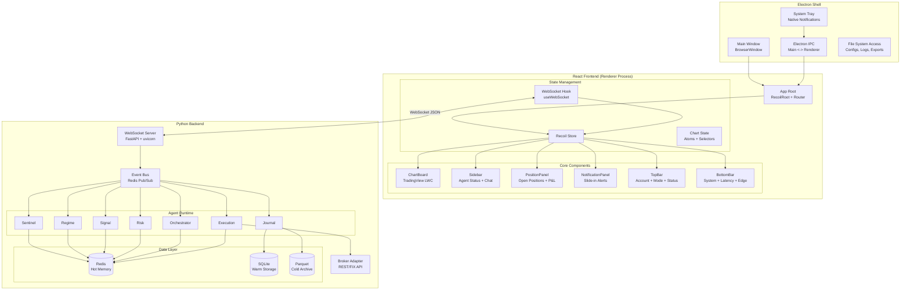
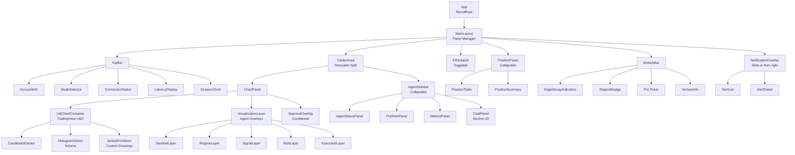
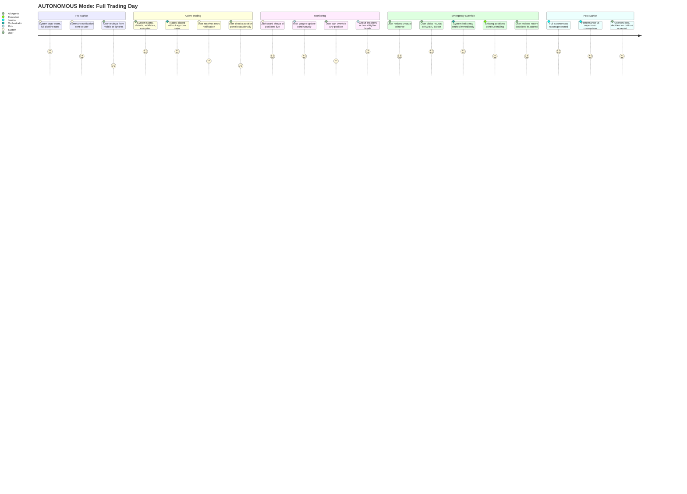
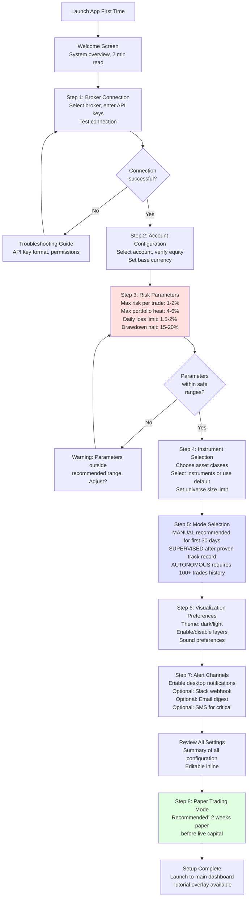
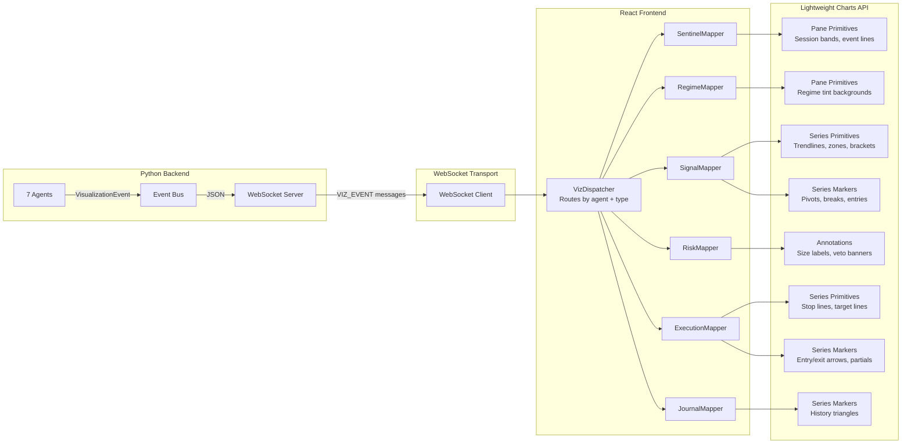
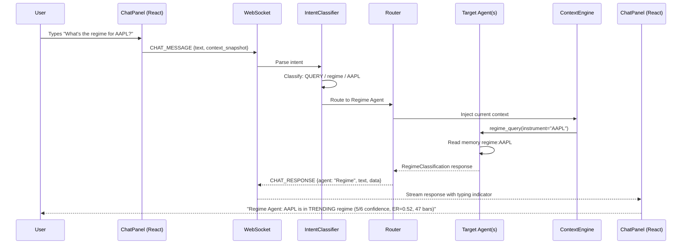
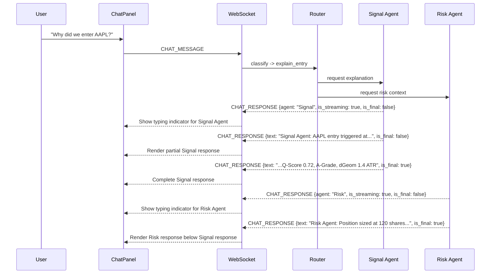
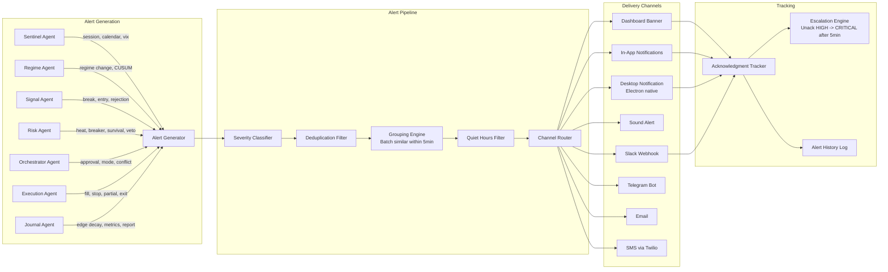
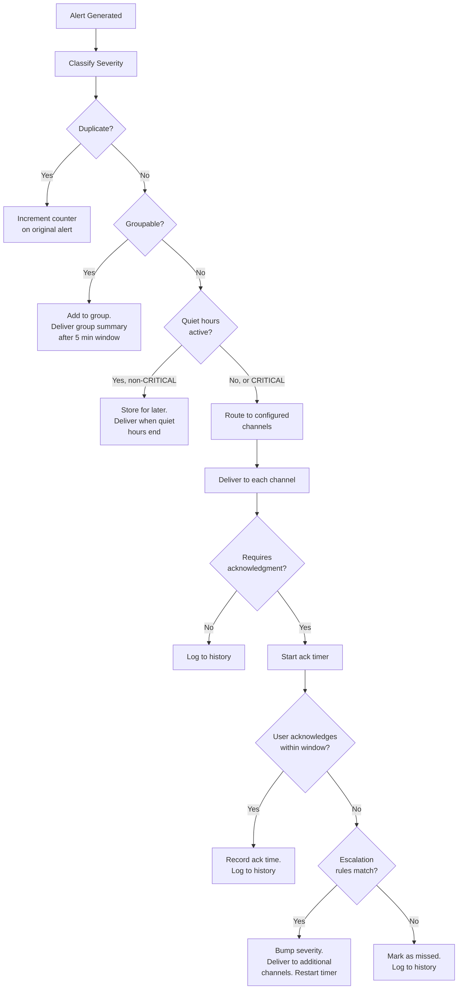

# PCTT Agentic System Architecture (Part 5)

## UI/UX, User Journey, Chat Interface, and Alert System

**Version:** 1.0
**Author:** Kimal Honour Djam
**Extends:** Parts 1-4 (Sections 1-21)
**Scope:** Comprehensive UI/UX design on TradingView Lightweight Charts, conversational chat interface, and multi-channel alert system.

---

## 22. Comprehensive UI/UX and User Journey

### 22.1 Application Architecture

The PCTT desktop application is an Electron shell wrapping a React frontend that communicates with a Python backend over WebSocket. This architecture provides native desktop capabilities (system tray, notifications, multi-monitor support, local file access) while leveraging the web ecosystem for rapid UI development. TradingView Lightweight Charts renders the primary charting surface. All agent computations run in the Python backend, and visualization events stream to the frontend through a persistent WebSocket channel.

**Why Electron.** The system requires native desktop features that browsers cannot provide: system tray presence for background monitoring, native OS notifications that survive browser tab closure, multi-monitor window management, direct filesystem access for configuration and trade logs, and low-latency IPC with the Python backend running on the same machine. A pure web application would sacrifice these capabilities. A pure native application would sacrifice the React component ecosystem and TradingView Lightweight Charts (which is a JavaScript library). Electron bridges both worlds.

**Why React.** The UI contains dozens of independently updating components: chart overlays, sidebar panels, position tables, alert feeds, metrics displays. React's component model with fine-grained state management (via Recoil) ensures that a position P&L update does not trigger a full chart re-render. The virtual DOM diffing algorithm keeps frame rates smooth even when multiple agents publish visualization events simultaneously.

**Why WebSocket over REST.** The system produces a continuous stream of events: new bars every second during active sessions, agent state changes, position updates, alert notifications. Polling via REST would introduce unacceptable latency and overhead. A single persistent WebSocket connection carries all bidirectional traffic: visualization events from backend to frontend, user commands from frontend to backend. The protocol is JSON over WebSocket with message type discrimination.



**Process Model.** The Electron main process manages window lifecycle, system tray, and native notifications. The renderer process hosts the React application. The Python backend runs as a child process spawned by Electron on startup, communicating over a local WebSocket (typically `ws://127.0.0.1:8765`). On application close, Electron sends a graceful shutdown signal to the Python process, which flushes all pending writes to SQLite and Parquet before terminating.

**Startup Sequence:**

1. Electron main process launches.
2. Main process spawns the Python backend as a child process.
3. Python backend initializes Redis connection, loads configuration, starts all 7 agents.
4. Python backend opens WebSocket server on `127.0.0.1:8765`.
5. Electron opens the main BrowserWindow, loading the React application.
6. React application connects to the WebSocket.
7. Backend sends an `INIT` message containing current system state: open positions, active regime, system mode, agent statuses, visualization config.
8. React hydrates all Recoil atoms from the INIT payload.
9. Chart renders with current data. Sidebar populates. System is live.

**Python Backend Server (FastAPI):**

```python
from dataclasses import dataclass, field
from datetime import datetime
from typing import Optional, List
from enum import Enum
import json


class MessageType(str, Enum):
    """All WebSocket message types between frontend and backend."""
    # Backend -> Frontend
    INIT = "INIT"
    BAR_UPDATE = "BAR_UPDATE"
    VIZ_EVENT = "VIZ_EVENT"
    POSITION_UPDATE = "POSITION_UPDATE"
    AGENT_STATE = "AGENT_STATE"
    ALERT = "ALERT"
    APPROVAL_REQUEST = "APPROVAL_REQUEST"
    CHAT_RESPONSE = "CHAT_RESPONSE"
    SYSTEM_STATUS = "SYSTEM_STATUS"
    METRICS_UPDATE = "METRICS_UPDATE"
    MODE_CHANGE = "MODE_CHANGE"

    # Frontend -> Backend
    USER_COMMAND = "USER_COMMAND"
    APPROVAL_RESPONSE = "APPROVAL_RESPONSE"
    CHAT_MESSAGE = "CHAT_MESSAGE"
    CONFIG_UPDATE = "CONFIG_UPDATE"
    LAYOUT_SAVE = "LAYOUT_SAVE"
    CHART_INTERACTION = "CHART_INTERACTION"


@dataclass
class WebSocketMessage:
    """
    Standard message envelope for all WebSocket communication.
    Every message between frontend and backend uses this structure.
    """
    type: str                        # MessageType value
    payload: dict                    # Type-specific data
    timestamp: str                   # ISO-8601
    sequence: int                    # Monotonically increasing per connection
    source: str                      # "backend" or "frontend"
    request_id: Optional[str] = None # For request-response correlation
    agent: Optional[str] = None      # Which agent produced this message (backend only)


@dataclass
class InitPayload:
    """
    Payload sent on WebSocket connection establishment.
    Contains full system state for frontend hydration.
    """
    system_mode: str                 # MANUAL, SUPERVISED, AUTONOMOUS, HALTED
    open_positions: List[dict]       # Current open positions with live P&L
    active_instruments: List[str]    # Instruments on the watchlist
    regime_states: dict              # {instrument: RegimeClassification}
    agent_statuses: dict             # {agent_name: {state, last_update, health}}
    portfolio_heat: float            # Current portfolio heat percentage
    drawdown_pct: float              # Current drawdown percentage
    survival_score: int              # Current survival score (0-10)
    circuit_breaker_status: str      # NORMAL, SOFT_PAUSE, HARD_HALT
    rolling_metrics: dict            # {win_rate, expectancy, profit_factor}
    daily_pnl: float                 # Today's P&L in dollars
    daily_trades: int                # Number of trades today
    visualization_config: dict       # Current ChartVisualizationConfig
    pending_approvals: List[dict]    # Any unanswered approval requests
    recent_alerts: List[dict]        # Last 50 alerts
    broker_connected: bool           # Broker connection status
    data_feed_connected: bool        # Market data feed status
    server_time: str                 # ISO-8601 server time for clock sync
```

**TypeScript Interfaces for Frontend:**

```typescript
// src/types/websocket.ts

export enum MessageType {
  // Backend -> Frontend
  INIT = "INIT",
  BAR_UPDATE = "BAR_UPDATE",
  VIZ_EVENT = "VIZ_EVENT",
  POSITION_UPDATE = "POSITION_UPDATE",
  AGENT_STATE = "AGENT_STATE",
  ALERT = "ALERT",
  APPROVAL_REQUEST = "APPROVAL_REQUEST",
  CHAT_RESPONSE = "CHAT_RESPONSE",
  SYSTEM_STATUS = "SYSTEM_STATUS",
  METRICS_UPDATE = "METRICS_UPDATE",
  MODE_CHANGE = "MODE_CHANGE",

  // Frontend -> Backend
  USER_COMMAND = "USER_COMMAND",
  APPROVAL_RESPONSE = "APPROVAL_RESPONSE",
  CHAT_MESSAGE = "CHAT_MESSAGE",
  CONFIG_UPDATE = "CONFIG_UPDATE",
  LAYOUT_SAVE = "LAYOUT_SAVE",
  CHART_INTERACTION = "CHART_INTERACTION",
}

export interface WebSocketMessage {
  type: MessageType;
  payload: Record<string, unknown>;
  timestamp: string;
  sequence: number;
  source: "backend" | "frontend";
  request_id?: string;
  agent?: string;
}

export interface InitPayload {
  system_mode: "MANUAL" | "SUPERVISED" | "AUTONOMOUS" | "HALTED";
  open_positions: PositionState[];
  active_instruments: string[];
  regime_states: Record<string, RegimeState>;
  agent_statuses: Record<string, AgentStatus>;
  portfolio_heat: number;
  drawdown_pct: number;
  survival_score: number;
  circuit_breaker_status: "NORMAL" | "SOFT_PAUSE" | "HARD_HALT";
  rolling_metrics: RollingMetrics;
  daily_pnl: number;
  daily_trades: number;
  visualization_config: VisualizationConfig;
  pending_approvals: ApprovalRequest[];
  recent_alerts: Alert[];
  broker_connected: boolean;
  data_feed_connected: boolean;
  server_time: string;
}

export interface AgentStatus {
  name: string;
  state: string;
  health: "HEALTHY" | "DEGRADED" | "ERROR";
  last_update: string;
  current_activity: string;
}

export interface RegimeState {
  regime: "TRENDING" | "VOLATILE" | "MEAN_REVERTING" | "CHOPPY";
  confidence: number;
  efficiency_ratio: number;
  duration_bars: number;
}

export interface RollingMetrics {
  win_rate: number;
  expectancy: number;
  profit_factor: number;
  avg_r: number;
  sharpe: number;
  total_trades: number;
}

export interface PositionState {
  position_id: string;
  instrument: string;
  direction: "LONG" | "SHORT";
  entry_price: number;
  current_price: number;
  stop_price: number;
  size: number;
  remaining_size: number;
  unrealized_pnl: number;
  unrealized_r: number;
  phase: string;
  entry_time: string;
  bars_held: number;
  q_score: number;
  grade: string;
}
```

---

### 22.2 Screen Layout (Multi-Panel Design)

The application uses a panel-based layout with resizable boundaries. The default configuration allocates screen real estate to maximize chart visibility while keeping critical information accessible without scrolling. Every panel is collapsible. Power users can hide panels they do not need. First-time users see all panels at default sizes.

**ASCII Layout (Default Single-Monitor, 1920x1080):**

```
+==============================================================================+
| TOP BAR (40px)                                                               |
| [PCTT] Account: $50,240 | Mode: [SUPERVISED v] | Broker: [*] | Data: [*]   |
| Latency: 12ms | Next: Regime check in 0:42 | Clock: 10:42:15 ET            |
+============================================+=================================+
|                                            |  AGENT SIDEBAR (320px)          |
|                                            |  [Collapse <<]                  |
|                                            |                                 |
|                                            |  --- AGENT STATUS ---           |
|                                            |  SEN [*] Core Session           |
|                                            |  REG [*] TRENDING 5/6           |
|                                            |  SIG [*] NVDA WAIT_RETEST       |
|                                            |  RSK [*] Heat 2.8% OK           |
|         MAIN CHART PANEL                   |  ORC [*] Pending Approval       |
|         TradingView Lightweight Charts     |  EXE [*] AAPL Phase 4           |
|                                            |  JRN [*] 1W 0L today            |
|         Session bands (background)         |                                 |
|         Regime tint (background)           |  --- PORTFOLIO ---              |
|         All agent overlays from Sec 18     |  Heat: [====    ] 2.8%/6.0%     |
|         Pivots, trendlines, zones          |  DD:   [==      ] 2.1%          |
|         Entry/exit markers                 |  Scale: 0.92x                   |
|         Stop/target lines                  |  Survival: [8/10] GREEN         |
|         Trailing stop trail                |  CB: [GREEN] All Clear           |
|                                            |                                 |
|         (Resizable: min 60%, max 85%)      |  --- METRICS (Rolling 20) ---   |
|                                            |  Win Rate:  62% [G]             |
|                                            |  Expectancy: +0.31R [G]         |
|                                            |  Profit Factor: 1.85 [G]        |
|                                            |  Avg R: +0.42                   |
|                                            |  [R-Distribution Sparkline]     |
|                                            |                                 |
|                                            |  --- CHAT ---                   |
|                                            |  [Chat interface, Sec 23]       |
|                                            |  > What regime is AAPL in?      |
|                                            |  Regime: AAPL is TRENDING...    |
|                                            |  [input field] [Send]           |
|                                            |  (Resizable: min 240px,         |
|                                            |   max 480px)                    |
+============================================+=================================+
| ER SUBPLOT (togglable, 15% height)                                           |
| [Efficiency Ratio line] ---- 0.55 threshold ---- 0.30 threshold ----        |
+==============================================================================+
| POSITION PANEL (collapsible, 160px height)                                   |
| Sym  | Dir  | Entry   | Current | Stop    | Size | P&L      | R     | Phase |
| AAPL | LONG | $182.40 | $185.60 | $183.80 | 120  | +$384.00 | +1.8R | P4   |
| NVDA | LONG | $875.20 | $878.10 | $868.50 | 76   | +$220.40 | +0.4R | P1   |
| ---- | ---- | ------- | ------- | ------- | ---- | -------- | ----- | ---- |
| Total Heat: 2.8% | Portfolio P&L: +$604.40 (+1.2%) | Today: 1W 0L          |
+==============================================================================+
| BOTTOM BAR (32px)                                                            |
| Edge:[G][G][G] | TRENDING 5/6 47bars | Today: +$604 1W 0L | v1.0.0         |
+==============================================================================+
```

**Component Tree:**



**Panel Resize Configuration:**

```python
from dataclasses import dataclass
from typing import Optional


@dataclass
class PanelLayout:
    """
    Persisted layout configuration for the multi-panel UI.
    Saved to config/layout.yaml on change. Restored on startup.
    """
    # Main chart area
    chart_width_pct: float = 70.0       # Percentage of horizontal space
    chart_min_width_pct: float = 55.0
    chart_max_width_pct: float = 85.0

    # Sidebar
    sidebar_width_px: int = 320
    sidebar_min_px: int = 240
    sidebar_max_px: int = 480
    sidebar_collapsed: bool = False

    # Position panel
    position_panel_height_px: int = 160
    position_panel_min_px: int = 80
    position_panel_max_px: int = 300
    position_panel_collapsed: bool = False

    # ER subplot
    er_subplot_visible: bool = False
    er_subplot_height_pct: float = 15.0

    # Top and bottom bars
    top_bar_height_px: int = 40
    bottom_bar_height_px: int = 32

    # Notification panel
    notification_width_px: int = 380
    notification_visible: bool = False

    # Chat panel (within sidebar)
    chat_height_pct: float = 35.0       # Percentage of sidebar height
    chat_min_height_pct: float = 20.0
    chat_max_height_pct: float = 60.0

    # Window state
    window_x: Optional[int] = None
    window_y: Optional[int] = None
    window_width: int = 1920
    window_height: int = 1080
    window_maximized: bool = True
    monitor_index: int = 0


@dataclass
class LayoutPreset:
    """Named layout preset that users can save and restore."""
    name: str
    description: str
    layout: PanelLayout
    created_at: str       # ISO-8601
    is_default: bool = False
```

**Layout YAML Configuration:**

```yaml
# config/layout.yaml
layout:
  presets:
    default:
      name: "Default"
      description: "Standard single-monitor layout with all panels visible"
      chart_width_pct: 70.0
      sidebar_width_px: 320
      sidebar_collapsed: false
      position_panel_height_px: 160
      position_panel_collapsed: false
      er_subplot_visible: false
      chat_height_pct: 35.0
      window_maximized: true

    compact:
      name: "Compact"
      description: "Maximized chart with collapsed sidebar and position panel"
      chart_width_pct: 95.0
      sidebar_width_px: 240
      sidebar_collapsed: true
      position_panel_height_px: 80
      position_panel_collapsed: true
      er_subplot_visible: false
      chat_height_pct: 0.0

    analysis:
      name: "Analysis"
      description: "Expanded sidebar with ER subplot and chat visible"
      chart_width_pct: 60.0
      sidebar_width_px: 480
      sidebar_collapsed: false
      position_panel_height_px: 200
      position_panel_collapsed: false
      er_subplot_visible: true
      chat_height_pct: 45.0

  active_preset: "default"

  window:
    remember_position: true
    remember_size: true
    start_maximized: true
```

---

### 22.3 User Journey Maps

Each operating mode creates a distinct user experience. The following journey maps trace every interaction from session start to session end, identifying where the user acts, where the system acts, and where approval gates create deliberate handoffs.

---

#### 22.3.1 MANUAL Mode Journey

In MANUAL mode, the system observes and annotates. The user makes every trading decision. The system provides analysis, highlights setups, and warns about risk violations, but never places an order without explicit human instruction.

```mermaid
journey
    title MANUAL Mode: Full Trading Day
    section Pre-Market (6:00-9:30 ET)
      Launch application: 5: User
      Review overnight gaps on chart: 4: User
      Read MarketBrief in sidebar: 4: User, Sentinel
      Check economic calendar markers: 3: User, Sentinel
      Review watchlist regime states: 4: User, Regime
      Set focus instruments for the day: 5: User
    section Market Open (9:30-10:00)
      Watch price action unfold: 3: User
      Observe pivot dots appearing: 4: Signal
      See candidate trendlines form: 4: Signal
      Notice Q-Score badges on quality lines: 4: Signal
      Regime tint updates: 3: Regime
    section Core Session (10:00-11:30)
      Break alert appears on chart: 5: Signal
      Review frozen structure visuals: 4: User
      Watch retest zone highlight: 4: Signal
      Rejection bar scores display: 4: Signal
      Entry arrow appears with proposal: 5: Signal
      Read full proposal in sidebar: 4: User
      Check risk annotation (size, heat): 4: Risk
      Decide to take the trade: 5: User
      Click chart entry arrow to confirm: 5: User
      Order placed, fill confirmed: 5: Execution
      Monitor trailing stop progression: 3: User, Execution
    section Lunch (11:30-13:00)
      Reduced monitoring, system quiet: 2: User
      Lunch guard active, no new signals: 3: Sentinel
    section Power Hour (15:00-16:00)
      Review position P&L in panel: 4: User
      Decide to let trailing stop manage: 3: User
      Partial exit at 1R fires: 4: Execution
    section Post-Market (16:00+)
      Review daily P&L summary: 4: User, Journal
      Check rolling metrics update: 3: Journal
      Review any edge decay warnings: 3: Journal
      Close application: 2: User
```

**Key MANUAL mode behaviors:**

The system never places orders without the user clicking a confirmation button. Entry arrows on the chart are clickable. When the user clicks an entry arrow, a compact confirmation dialog appears: "Confirm LONG NVDA 76 shares at $875.20? [Yes] [No]". Only after "Yes" does the Execution agent place the order. Stop management after entry is automatic (the 7-phase trailing system runs), but the user can override any stop level by right-clicking the stop line and entering a new price. All overrides are logged to the Journal.

---

#### 22.3.2 SUPERVISED Mode Journey

In SUPERVISED mode, the system scans, proposes, and executes after receiving human approval at each gate. This is the recommended mode for live trading. The system does the analytical heavy lifting. The human provides judgment and final authority.

```mermaid
journey
    title SUPERVISED Mode: Full Trading Day
    section Pre-Market (6:00-9:30 ET)
      Application auto-starts at 6:00: 5: System
      Pre-market workflow runs: 5: Sentinel
      MarketBrief generated: 5: Sentinel
      Regime classification for all watchlist: 4: Regime
      Desktop notification with summary: 4: System
      User reviews summary on phone or desktop: 3: User
    section Market Open (9:30-10:00)
      System monitors automatically: 5: Sentinel, Regime
      Signal agent scanning for breaks: 5: Signal
      User observes chart activity passively: 3: User
    section Signal Detection (variable)
      Break detected on NVDA: 5: Signal
      Toast notification with sound: 5: System
      Retest window opens, timer visible: 4: Signal
      Rejection scores, entry conditions met: 5: Signal
      Risk agent validates sizing and heat: 5: Risk
      Approval panel slides in from right: 5: Orchestrator
      User reads full trade context: 4: User
      User clicks APPROVE: 5: User
      Order placed automatically: 5: Execution
      Fill confirmed, chart markers appear: 5: Execution
    section Position Management (automatic)
      Trailing stop managed by Execution: 5: Execution
      Phase transitions happen automatically: 5: Execution
      Partial exit at 1R fires automatically: 5: Execution
      User observes via P&L watermark: 3: User
    section Exit (automatic)
      Stop triggered at Phase 4 pivot: 5: Execution
      Exit marker and R-multiple badge: 5: Execution
      Trade recorded to Journal: 5: Journal
      Metrics panel updates: 4: Journal
    section Post-Market (automatic)
      Daily report generated: 5: Journal
      Edge decay check runs: 5: Journal
      Summary notification sent: 4: System
      User reviews at convenience: 3: User
```

**Key SUPERVISED mode behaviors:**

The system auto-starts at the configured pre-market time. The user does not need to be at the screen for analysis. When a trade proposal is ready, the system sends a notification through all configured channels (desktop, Slack, sound). The approval panel includes a timer bar. If the user does not respond within the configured timeout (default: 2 bars, configurable), the proposal expires. The user can approve, modify (adjust size, move stop), or reject. After approval, execution is fully automatic: order placement, trailing stop management, partial exits, and final exit all happen without further user input.

---

#### 22.3.3 AUTONOMOUS Mode Journey

In AUTONOMOUS mode, the system operates independently. The user's role is monitoring and emergency override. All gates auto-approve if risk checks pass. The user can intervene at any time by clicking "PAUSE TRADING" or switching to SUPERVISED mode.



**Key AUTONOMOUS mode behaviors:**

Approval gates auto-approve when all risk checks pass. The system uses tighter guardrails in autonomous mode: portfolio heat cap drops from 6% to 4%, correlated position limit is hard-capped at 3 (no override possible), and the daily loss circuit breaker is 1.5% instead of 2%. These tighter limits compensate for the absence of human judgment at the approval gate. The user receives a notification for every trade entry and exit. The "PAUSE TRADING" button in the top bar is always visible and always active. One click halts all new entries system-wide.

---

#### 22.3.4 First-Time Setup Journey

A new user must complete setup before any trading occurs. The setup wizard guides them through account connection, risk configuration, and mode selection.



**Setup Data Structure:**

```python
@dataclass
class SetupConfig:
    """
    Configuration established during first-time setup.
    Persisted to config/setup.yaml.
    """
    # Broker
    broker_name: str                 # "interactive_brokers", "alpaca", "tradier"
    broker_api_key: str              # Encrypted at rest
    broker_api_secret: str           # Encrypted at rest
    broker_paper_mode: bool          # True for paper trading
    account_id: str

    # Risk
    max_risk_per_trade_pct: float    # Default 1.0, range 0.5-2.0
    max_portfolio_heat_pct: float    # Default 6.0, range 4.0-8.0
    daily_loss_limit_pct: float      # Default 2.0, range 1.0-3.0
    drawdown_halt_pct: float         # Default 20.0, range 10.0-25.0
    max_correlated_positions: int    # Default 3, range 2-5

    # Universe
    asset_classes: list              # ["equities", "futures", "forex"]
    instruments: list                # ["AAPL", "NVDA", "SPY", ...] or "auto"
    max_universe_size: int           # Default 20

    # Mode
    initial_mode: str                # "MANUAL" recommended
    paper_trading_days: int          # Default 14

    # Alerts
    desktop_notifications: bool      # Default True
    slack_webhook: Optional[str]     # Optional
    email_address: Optional[str]     # Optional
    sms_phone: Optional[str]         # Optional

    # Visualization
    theme: str                       # "dark" or "light"

    # Timestamps
    setup_completed_at: str          # ISO-8601
    first_live_trade_eligible_at: str  # setup_completed_at + paper_trading_days
```

---

### 22.4 TradingView Lightweight Charts Integration Layer

This section maps every agent visualization from Section 18 to concrete TradingView Lightweight Charts API calls. The integration layer translates VisualizationEvent objects from the Python backend into Lightweight Charts primitives, series, and markers on the frontend.

**Integration Architecture:**



**Visualization Category Mapping:**

Each agent visualization from Section 18 maps to one of four Lightweight Charts rendering mechanisms.

| Rendering Mechanism | LWC API | Used For |
|---|---|---|
| **CandlestickSeries** | `chart.addSeries(CandlestickSeries)` | Primary OHLCV price data |
| **HistogramSeries** | `chart.addSeries(HistogramSeries)` | Volume bars, R-distribution sparkline |
| **LineSeries** | `chart.addSeries(LineSeries)` | Efficiency Ratio subplot |
| **Series Markers** | `createSeriesMarkers(series, [...])` | Pivots, entry/exit arrows, break diamonds, rejection scores, partial exit markers, history triangles, CUSUM alarms |
| **Series Primitives** | `series.attachPrimitive(new CustomPrimitive())` | Trendlines, frozen structures, stop lines, target lines, retest zones, dGeom brackets, trailing stop trails, trade brackets |
| **Pane Primitives** | `chart.panes()[0].attachPrimitive(...)` | Session bands, regime tints, regime transitions, economic event lines |

---

#### Series Primitives: The Core Rendering Engine

Series Primitives are the primary mechanism for custom drawing in Lightweight Charts. Every agent overlay that is not a simple marker (dot, arrow, diamond) is implemented as a Series Primitive. Each primitive implements the `ISeriesPrimitive` interface.

**TypeScript Base Interface:**

```typescript
// src/chart/primitives/base.ts

import {
  ISeriesPrimitive,
  ISeriesPrimitivePaneView,
  ISeriesPrimitivePaneRenderer,
  SeriesAttachedParameter,
  Time,
  CanvasRenderingTarget2D,
} from "lightweight-charts";

/**
 * Base class for all PCTT custom chart primitives.
 * Handles lifecycle (attach/detach), update requests, and autoscale.
 */
export abstract class PCTTPrimitive implements ISeriesPrimitive<Time> {
  protected _chart: ReturnType<SeriesAttachedParameter<Time>["chart"]> | null =
    null;
  protected _series: ReturnType<
    SeriesAttachedParameter<Time>["series"]
  > | null = null;
  protected _requestUpdate:
    | SeriesAttachedParameter<Time>["requestUpdate"]
    | null = null;

  attached(param: SeriesAttachedParameter<Time>): void {
    this._chart = param.chart();
    this._series = param.series();
    this._requestUpdate = param.requestUpdate;
    this.onAttached();
  }

  detached(): void {
    this.onDetached();
    this._chart = null;
    this._series = null;
    this._requestUpdate = null;
  }

  /** Override in subclasses for attach-time initialization. */
  protected onAttached(): void {}

  /** Override in subclasses for cleanup on detach. */
  protected onDetached(): void {}

  /** Trigger a re-render. Call after updating data. */
  protected requestUpdate(): void {
    if (this._requestUpdate) {
      this._requestUpdate();
    }
  }

  abstract updateAllViews(): void;
  abstract paneViews(): ISeriesPrimitivePaneView[];
}

/**
 * Generic pane view that delegates to a renderer.
 */
export class PCTTPaneView implements ISeriesPrimitivePaneView {
  constructor(private _renderer: ISeriesPrimitivePaneRenderer) {}

  renderer(): ISeriesPrimitivePaneRenderer {
    return this._renderer;
  }
}
```

---

#### Primitive: Trendline (Signal Agent)

Renders candidate trendlines, scored lines, and frozen structure lines on the chart.

```typescript
// src/chart/primitives/trendline.ts

import { PCTTPrimitive, PCTTPaneView } from "./base";
import {
  ISeriesPrimitivePaneView,
  ISeriesPrimitivePaneRenderer,
  CanvasRenderingTarget2D,
  Time,
} from "lightweight-charts";

interface TrendlineData {
  startTime: Time;
  startPrice: number;
  endTime: Time;
  endPrice: number;
  color: string;
  width: number;
  lineStyle: "solid" | "dashed" | "dotted";
  opacity: number;
  label?: string;
  labelColor?: string;
  grade?: "A" | "B" | "CANDIDATE" | "FROZEN";
}

class TrendlineRenderer implements ISeriesPrimitivePaneRenderer {
  private _data: TrendlineData | null = null;
  private _chartRef: any = null;
  private _seriesRef: any = null;

  update(data: TrendlineData, chart: any, series: any): void {
    this._data = data;
    this._chartRef = chart;
    this._seriesRef = series;
  }

  draw(target: CanvasRenderingTarget2D): void {
    if (!this._data || !this._chartRef || !this._seriesRef) return;

    target.useBitmapCoordinateSpace((scope) => {
      const ctx = scope.context;
      const timeScale = this._chartRef.timeScale();
      const d = this._data!;

      const x1 = timeScale.timeToCoordinate(d.startTime);
      const x2 = timeScale.timeToCoordinate(d.endTime);
      if (x1 === null || x2 === null) return;

      const y1 = this._seriesRef.priceToCoordinate(d.startPrice);
      const y2 = this._seriesRef.priceToCoordinate(d.endPrice);
      if (y1 === null || y2 === null) return;

      const ratio = scope.horizontalPixelRatio;

      ctx.save();
      ctx.globalAlpha = d.opacity;
      ctx.strokeStyle = d.color;
      ctx.lineWidth = d.width * ratio;

      if (d.lineStyle === "dashed") {
        ctx.setLineDash([6 * ratio, 4 * ratio]);
      } else if (d.lineStyle === "dotted") {
        ctx.setLineDash([2 * ratio, 3 * ratio]);
      }

      ctx.beginPath();
      ctx.moveTo(x1 * ratio, y1 * ratio);
      ctx.lineTo(x2 * ratio, y2 * ratio);
      ctx.stroke();

      // Draw Q-Score label if present
      if (d.label) {
        ctx.globalAlpha = 1.0;
        ctx.font = `${11 * ratio}px monospace`;
        const padding = 4 * ratio;
        const textWidth = ctx.measureText(d.label).width;
        const labelX = x2 * ratio + 8 * ratio;
        const labelY = y2 * ratio;

        // Badge background
        ctx.fillStyle = d.labelColor || d.color;
        ctx.fillRect(
          labelX - padding,
          labelY - 12 * ratio,
          textWidth + padding * 2,
          16 * ratio
        );

        // Badge text
        ctx.fillStyle = "#FFFFFF";
        ctx.fillText(d.label, labelX, labelY);
      }

      ctx.restore();
    });
  }
}

export class TrendlinePrimitive extends PCTTPrimitive {
  private _data: TrendlineData;
  private _renderer = new TrendlineRenderer();
  private _paneView: PCTTPaneView;

  constructor(data: TrendlineData) {
    super();
    this._data = data;
    this._paneView = new PCTTPaneView(this._renderer);
  }

  updateData(data: TrendlineData): void {
    this._data = data;
    this.updateAllViews();
    this.requestUpdate();
  }

  updateAllViews(): void {
    this._renderer.update(this._data, this._chart, this._series);
  }

  paneViews(): ISeriesPrimitivePaneView[] {
    return [this._paneView];
  }
}
```

---

#### Primitive: Regime Background Tint (Regime Agent)

Renders the full-width background color tint indicating current regime. Attached as a Pane Primitive (not Series Primitive) because it spans the entire pane.

```typescript
// src/chart/primitives/regime-tint.ts

import {
  ISeriesPrimitivePaneView,
  ISeriesPrimitivePaneRenderer,
  CanvasRenderingTarget2D,
  Time,
} from "lightweight-charts";

interface RegimeTintData {
  regime: "TRENDING" | "VOLATILE" | "MEAN_REVERTING" | "CHOPPY";
  startTime: Time;
  endTime: Time | null; // null = extends to current bar
}

const REGIME_COLORS: Record<string, string> = {
  TRENDING: "rgba(0, 100, 0, 0.04)",
  VOLATILE: "rgba(200, 100, 0, 0.04)",
  MEAN_REVERTING: "rgba(0, 50, 200, 0.04)",
  CHOPPY: "rgba(200, 0, 0, 0.04)",
};

class RegimeTintRenderer implements ISeriesPrimitivePaneRenderer {
  private _segments: RegimeTintData[] = [];
  private _chartRef: any = null;

  update(segments: RegimeTintData[], chart: any): void {
    this._segments = segments;
    this._chartRef = chart;
  }

  draw(target: CanvasRenderingTarget2D): void {
    if (!this._chartRef || this._segments.length === 0) return;

    target.useBitmapCoordinateSpace((scope) => {
      const ctx = scope.context;
      const timeScale = this._chartRef.timeScale();
      const ratio = scope.horizontalPixelRatio;
      const height = scope.bitmapSize.height;

      for (const seg of this._segments) {
        const x1 = timeScale.timeToCoordinate(seg.startTime);
        if (x1 === null) continue;

        let x2: number;
        if (seg.endTime) {
          const coord = timeScale.timeToCoordinate(seg.endTime);
          if (coord === null) continue;
          x2 = coord;
        } else {
          x2 = scope.bitmapSize.width / ratio;
        }

        ctx.fillStyle = REGIME_COLORS[seg.regime] || "rgba(0,0,0,0)";
        ctx.fillRect(x1 * ratio, 0, (x2 - x1) * ratio, height);

        // Diagonal hash lines for CHOPPY regime
        if (seg.regime === "CHOPPY") {
          ctx.save();
          ctx.strokeStyle = "rgba(200, 0, 0, 0.06)";
          ctx.lineWidth = 1 * ratio;
          const step = 20 * ratio;
          for (let i = -height; i < (x2 - x1) * ratio + height; i += step) {
            ctx.beginPath();
            ctx.moveTo(x1 * ratio + i, 0);
            ctx.lineTo(x1 * ratio + i + height, height);
            ctx.stroke();
          }
          ctx.restore();
        }
      }
    });
  }
}
```

---

#### Primitive: Trailing Stop Line (Execution Agent)

Renders the current stop level as a horizontal dashed line with phase label, plus the historical stop trail as a dotted staircase.

```typescript
// src/chart/primitives/trailing-stop.ts

import { PCTTPrimitive, PCTTPaneView } from "./base";
import {
  ISeriesPrimitivePaneView,
  ISeriesPrimitivePaneRenderer,
  CanvasRenderingTarget2D,
  Time,
} from "lightweight-charts";

interface StopLevel {
  time: Time;
  price: number;
  phase: string; // "P1", "P2", ..., "P7"
}

interface TrailingStopData {
  history: StopLevel[];       // All historical stop levels (the staircase)
  currentStop: number;        // Current stop price
  currentPhase: string;       // Current phase label
  direction: "LONG" | "SHORT";
  entryTime: Time;
}

class TrailingStopRenderer implements ISeriesPrimitivePaneRenderer {
  private _data: TrailingStopData | null = null;
  private _chartRef: any = null;
  private _seriesRef: any = null;

  update(data: TrailingStopData, chart: any, series: any): void {
    this._data = data;
    this._chartRef = chart;
    this._seriesRef = series;
  }

  draw(target: CanvasRenderingTarget2D): void {
    if (!this._data || !this._chartRef || !this._seriesRef) return;

    target.useBitmapCoordinateSpace((scope) => {
      const ctx = scope.context;
      const timeScale = this._chartRef.timeScale();
      const d = this._data!;
      const ratio = scope.horizontalPixelRatio;

      // Draw historical stop trail (dotted staircase)
      if (d.history.length > 1) {
        ctx.save();
        ctx.strokeStyle = "rgba(220, 50, 50, 0.4)";
        ctx.lineWidth = 1 * ratio;
        ctx.setLineDash([2 * ratio, 3 * ratio]);
        ctx.beginPath();

        for (let i = 0; i < d.history.length; i++) {
          const x = timeScale.timeToCoordinate(d.history[i].time);
          const y = this._seriesRef.priceToCoordinate(d.history[i].price);
          if (x === null || y === null) continue;

          if (i === 0) {
            ctx.moveTo(x * ratio, y * ratio);
          } else {
            // Horizontal segment to this time at previous price
            const prevY = this._seriesRef.priceToCoordinate(
              d.history[i - 1].price
            );
            if (prevY !== null) {
              ctx.lineTo(x * ratio, prevY * ratio);
            }
            // Vertical segment to new price
            ctx.lineTo(x * ratio, y * ratio);
          }
        }
        ctx.stroke();
        ctx.restore();
      }

      // Draw current stop line (bold dashed)
      const currentY = this._seriesRef.priceToCoordinate(d.currentStop);
      if (currentY === null) return;

      const visibleRange = timeScale.getVisibleRange();
      if (!visibleRange) return;

      const entryX = timeScale.timeToCoordinate(d.entryTime);
      const rightEdge = scope.bitmapSize.width;

      ctx.save();
      ctx.strokeStyle = "#DC3545";
      ctx.lineWidth = 2 * ratio;
      ctx.setLineDash([8 * ratio, 4 * ratio]);
      ctx.beginPath();
      if (entryX !== null) {
        ctx.moveTo(entryX * ratio, currentY * ratio);
      } else {
        ctx.moveTo(0, currentY * ratio);
      }
      ctx.lineTo(rightEdge, currentY * ratio);
      ctx.stroke();

      // Phase label
      ctx.setLineDash([]);
      ctx.font = `bold ${11 * ratio}px monospace`;
      const label = `${d.currentPhase}: $${d.currentStop.toFixed(2)}`;
      const textWidth = ctx.measureText(label).width;
      const labelX = rightEdge - textWidth - 12 * ratio;
      const labelY = currentY * ratio - 6 * ratio;

      ctx.fillStyle = "rgba(220, 50, 50, 0.85)";
      ctx.fillRect(labelX - 4 * ratio, labelY - 12 * ratio, textWidth + 8 * ratio, 16 * ratio);
      ctx.fillStyle = "#FFFFFF";
      ctx.fillText(label, labelX, labelY);
      ctx.restore();
    });
  }
}

export class TrailingStopPrimitive extends PCTTPrimitive {
  private _data: TrailingStopData;
  private _renderer = new TrailingStopRenderer();
  private _paneView: PCTTPaneView;

  constructor(data: TrailingStopData) {
    super();
    this._data = data;
    this._paneView = new PCTTPaneView(this._renderer);
  }

  updateData(data: TrailingStopData): void {
    this._data = data;
    this.updateAllViews();
    this.requestUpdate();
  }

  updateAllViews(): void {
    this._renderer.update(this._data, this._chart, this._series);
  }

  paneViews(): ISeriesPrimitivePaneView[] {
    return [this._paneView];
  }
}
```

---

#### Series Markers: Entry/Exit Signals and Pivots

Series markers handle all point-based annotations: pivots, entry arrows, exit arrows, break diamonds, partial exit markers, and history triangles. These use the native `createSeriesMarkers()` API, which is simpler than custom primitives but limited to predefined shapes.

```typescript
// src/chart/markers/signal-markers.ts

import { createSeriesMarkers, ISeriesApi, SeriesMarker, Time } from "lightweight-charts";

export interface PCTTMarkerData {
  time: Time;
  type:
    | "PIVOT_HIGH"
    | "PIVOT_LOW"
    | "BREAK_BULLISH"
    | "BREAK_BEARISH"
    | "ENTRY_LONG"
    | "ENTRY_SHORT"
    | "EXIT_WIN"
    | "EXIT_LOSS"
    | "PARTIAL_EXIT"
    | "REJECTION_PASS"
    | "REJECTION_FAIL"
    | "CUSUM_ALARM"
    | "HISTORY_WIN"
    | "HISTORY_LOSS";
  text?: string;
  price?: number;
}

const MARKER_CONFIG: Record<string, Partial<SeriesMarker<Time>>> = {
  PIVOT_HIGH: {
    position: "aboveBar",
    color: "#2196F3",
    shape: "circle",
  },
  PIVOT_LOW: {
    position: "belowBar",
    color: "#F44336",
    shape: "circle",
  },
  BREAK_BULLISH: {
    position: "belowBar",
    color: "#4CAF50",
    shape: "arrowUp",
  },
  BREAK_BEARISH: {
    position: "aboveBar",
    color: "#F44336",
    shape: "arrowDown",
  },
  ENTRY_LONG: {
    position: "belowBar",
    color: "#00E676",
    shape: "arrowUp",
  },
  ENTRY_SHORT: {
    position: "aboveBar",
    color: "#FF1744",
    shape: "arrowDown",
  },
  EXIT_WIN: {
    position: "aboveBar",
    color: "#00E676",
    shape: "square",
  },
  EXIT_LOSS: {
    position: "belowBar",
    color: "#FF1744",
    shape: "square",
  },
  PARTIAL_EXIT: {
    position: "aboveBar",
    color: "#FFD600",
    shape: "circle",
  },
  REJECTION_PASS: {
    position: "belowBar",
    color: "#66BB6A",
    shape: "arrowUp",
  },
  REJECTION_FAIL: {
    position: "belowBar",
    color: "#EF5350",
    shape: "square",
  },
  CUSUM_ALARM: {
    position: "belowBar",
    color: "#FF9800",
    shape: "arrowUp",
  },
  HISTORY_WIN: {
    position: "aboveBar",
    color: "#4CAF50",
    shape: "arrowUp",
  },
  HISTORY_LOSS: {
    position: "belowBar",
    color: "#F44336",
    shape: "arrowDown",
  },
};

/**
 * Converts PCTT marker data into Lightweight Charts SeriesMarker format.
 * Markers must be sorted by time before passing to createSeriesMarkers().
 */
export function buildMarkers(markers: PCTTMarkerData[]): SeriesMarker<Time>[] {
  return markers
    .map((m) => {
      const config = MARKER_CONFIG[m.type];
      if (!config) return null;
      return {
        time: m.time,
        position: config.position!,
        color: config.color!,
        shape: config.shape!,
        text: m.text || "",
      } as SeriesMarker<Time>;
    })
    .filter((m): m is SeriesMarker<Time> => m !== null)
    .sort((a, b) => (a.time < b.time ? -1 : a.time > b.time ? 1 : 0));
}

/**
 * Apply markers to a candlestick series.
 * Call this whenever the marker set changes (new pivot, new entry, etc).
 */
export function applyMarkers(
  series: ISeriesApi<"Candlestick">,
  markers: PCTTMarkerData[]
): void {
  const built = buildMarkers(markers);
  createSeriesMarkers(series, built);
}
```

---

#### Real-Time Update Pipeline

The real-time pipeline ensures that agent computations in the Python backend appear on the chart within 50ms. The pipeline uses three strategies to maintain performance: batch updates at 100ms intervals during high-frequency periods, individual updates for critical events (entries, stops), and differential updates that only transmit changed properties.

```typescript
// src/chart/realtime/update-pipeline.ts

import { IChartApi, ISeriesApi, Time } from "lightweight-charts";

interface BarUpdate {
  time: Time;
  open: number;
  high: number;
  low: number;
  close: number;
  volume?: number;
}

/**
 * Manages real-time updates to the chart.
 * Batches visualization events at 100ms intervals.
 * Critical events (entries, stop triggers) bypass the batch and render immediately.
 */
export class RealtimeUpdatePipeline {
  private chart: IChartApi;
  private candleSeries: ISeriesApi<"Candlestick">;
  private volumeSeries: ISeriesApi<"Histogram">;
  private pendingVizEvents: any[] = [];
  private batchTimer: ReturnType<typeof setInterval> | null = null;
  private readonly BATCH_INTERVAL_MS = 100;
  private readonly CRITICAL_TYPES = new Set([
    "ENTRY_LONG",
    "ENTRY_SHORT",
    "EXIT_WIN",
    "EXIT_LOSS",
    "STOP_TRIGGERED",
    "CIRCUIT_BREAKER",
    "APPROVAL_REQUEST",
  ]);

  constructor(
    chart: IChartApi,
    candleSeries: ISeriesApi<"Candlestick">,
    volumeSeries: ISeriesApi<"Histogram">
  ) {
    this.chart = chart;
    this.candleSeries = candleSeries;
    this.volumeSeries = volumeSeries;
    this.startBatchTimer();
  }

  /**
   * Handle incoming bar data. Uses series.update() for real-time,
   * NOT setData() which would replace the entire dataset.
   */
  onBarUpdate(bar: BarUpdate): void {
    this.candleSeries.update({
      time: bar.time,
      open: bar.open,
      high: bar.high,
      low: bar.low,
      close: bar.close,
    });

    if (bar.volume !== undefined) {
      this.volumeSeries.update({
        time: bar.time,
        value: bar.volume,
        color: bar.close >= bar.open ? "#26A69A" : "#EF5350",
      });
    }
  }

  /**
   * Handle visualization event from an agent.
   * Critical events render immediately.
   * Non-critical events are batched.
   */
  onVizEvent(event: any): void {
    if (this.CRITICAL_TYPES.has(event.event_type)) {
      this.renderVizEvent(event);
    } else {
      this.pendingVizEvents.push(event);
    }
  }

  private startBatchTimer(): void {
    this.batchTimer = setInterval(() => {
      if (this.pendingVizEvents.length === 0) return;
      const batch = this.pendingVizEvents.splice(0);
      for (const event of batch) {
        this.renderVizEvent(event);
      }
    }, this.BATCH_INTERVAL_MS);
  }

  private renderVizEvent(event: any): void {
    // Route to appropriate primitive/marker handler based on event type.
    // Implementation delegates to the per-agent mappers.
  }

  destroy(): void {
    if (this.batchTimer) {
      clearInterval(this.batchTimer);
      this.batchTimer = null;
    }
  }
}
```

---

#### Chart Initialization

```typescript
// src/chart/init.ts

import { createChart, IChartApi, ColorType } from "lightweight-charts";
import { CandlestickSeries, HistogramSeries, LineSeries } from "lightweight-charts";

export interface ChartConfig {
  container: HTMLElement;
  theme: "dark" | "light";
  width: number;
  height: number;
}

const DARK_THEME = {
  layout: {
    background: { type: ColorType.Solid as const, color: "#1A1A2E" },
    textColor: "#D1D4DC",
  },
  grid: {
    vertLines: { color: "#2B2B43" },
    horzLines: { color: "#2B2B43" },
  },
  crosshair: {
    vertLine: { color: "#758696", labelBackgroundColor: "#2B2B43" },
    horzLine: { color: "#758696", labelBackgroundColor: "#2B2B43" },
  },
  timeScale: {
    borderColor: "#2B2B43",
    timeVisible: true,
    secondsVisible: false,
  },
  rightPriceScale: {
    borderColor: "#2B2B43",
  },
};

const LIGHT_THEME = {
  layout: {
    background: { type: ColorType.Solid as const, color: "#FFFFFF" },
    textColor: "#333333",
  },
  grid: {
    vertLines: { color: "#E0E0E0" },
    horzLines: { color: "#E0E0E0" },
  },
  crosshair: {
    vertLine: { color: "#9598A1", labelBackgroundColor: "#F0F0F0" },
    horzLine: { color: "#9598A1", labelBackgroundColor: "#F0F0F0" },
  },
  timeScale: {
    borderColor: "#E0E0E0",
    timeVisible: true,
    secondsVisible: false,
  },
  rightPriceScale: {
    borderColor: "#E0E0E0",
  },
};

/**
 * Initialize the TradingView Lightweight Chart with PCTT configuration.
 * Returns chart instance and primary series for attachment of primitives.
 */
export function initChart(config: ChartConfig): {
  chart: IChartApi;
  candleSeries: ReturnType<IChartApi["addSeries"]>;
  volumeSeries: ReturnType<IChartApi["addSeries"]>;
} {
  const theme = config.theme === "dark" ? DARK_THEME : LIGHT_THEME;

  const chart = createChart(config.container, {
    width: config.width,
    height: config.height,
    ...theme,
  });

  const candleSeries = chart.addSeries(CandlestickSeries, {
    upColor: "#26A69A",
    downColor: "#EF5350",
    borderVisible: false,
    wickUpColor: "#26A69A",
    wickDownColor: "#EF5350",
  });

  const volumeSeries = chart.addSeries(HistogramSeries, {
    priceFormat: { type: "volume" },
    priceScaleId: "volume",
  });

  chart.priceScale("volume").applyOptions({
    scaleMargins: { top: 0.85, bottom: 0 },
  });

  return { chart, candleSeries, volumeSeries };
}
```

---

### 22.5 Responsive Design and Multi-Monitor

The PCTT application supports three distinct layout profiles based on available screen real estate. Layout persistence ensures that the user's preferred arrangement survives application restarts.

---

#### Single Monitor Layout (1920x1080)

The default layout described in Section 22.2. Chart occupies 70% of horizontal space. Sidebar is 320px. Position panel is at the bottom. All panels visible but collapsible.

---

#### Dual Monitor Layout (Chart + Dashboard)

On a dual-monitor setup, Electron opens two BrowserWindows.

**Monitor 1: Chart Focus.**
The main chart expands to full screen. No sidebar. No position panel. All agent overlays render on the chart. A minimal top bar shows mode, connection status, and a "Detach Sidebar" indicator showing that the sidebar lives on Monitor 2. The chart has maximum visual real estate for pattern recognition.

**Monitor 2: Dashboard Focus.**
The second window contains all panels that were removed from Monitor 1: agent status sidebar (full height), position panel (expanded), metrics panel (expanded), chat interface (expanded), notification history (full), and an equity curve chart (using a second Lightweight Charts instance showing the account equity line over time).

```
Monitor 1 (Chart):                    Monitor 2 (Dashboard):
+================================+    +================================+
| Mode: SUPERVISED | [*] | [*]  |    | AGENT STATUS (full height)     |
+================================+    | SEN: [*] Active, monitoring    |
|                                |    |   Last: MarketBrief 09:31      |
|                                |    | REG: [*] TRENDING 5/6          |
|                                |    |   ER=0.52, 47 bars             |
|     FULL SCREEN CHART          |    | SIG: [*] NVDA WAIT_RETEST     |
|     All agent overlays         |    |   Window: 8/12 bars            |
|     Maximum visual space       |    | RSK: [*] Heat 2.8%, OK        |
|                                |    | ORC: [*] Idle                  |
|                                |    | EXE: [*] AAPL Phase 4         |
|                                |    | JRN: [*] 1W 0L, +0.31R exp   |
|                                |    +--------------------------------+
|                                |    | POSITIONS (expanded)           |
|                                |    | AAPL LONG +1.8R Phase 4       |
|                                |    | NVDA LONG +0.4R Phase 1       |
|                                |    | [Full detail table]            |
|                                |    +--------------------------------+
|                                |    | EQUITY CURVE (LWC instance)    |
|                                |    | [Line chart of account value]  |
|                                |    +--------------------------------+
|                                |    | CHAT INTERFACE                 |
|                                |    | [Expanded chat, Section 23]    |
+================================+    +================================+
```

**Dual Monitor Configuration:**

```yaml
# config/layout.yaml (dual monitor addition)
layout:
  presets:
    dual_monitor:
      name: "Dual Monitor"
      description: "Chart on primary, dashboard on secondary"
      primary_monitor:
        content: "chart_only"
        chart_width_pct: 100.0
        sidebar_collapsed: true
        position_panel_collapsed: true
        top_bar_minimal: true
      secondary_monitor:
        content: "dashboard"
        panels:
          - agent_status
          - positions_expanded
          - equity_curve
          - chat_expanded
          - notification_history
          - metrics_expanded
        monitor_index: 1
        window_width: 1920
        window_height: 1080
```

---

#### Mobile Companion (Alerts and Monitoring Only)

The mobile companion is not a full trading interface. It is a lightweight Progressive Web App (PWA) that connects to the same Python backend via WebSocket (over a secure tunnel or VPN) and provides three capabilities: alert reception, position monitoring, and emergency controls.

**Mobile Screens:**

1. **Positions Screen.** A list of open positions with live P&L, current R-multiple, trailing stop phase, and time held. Tap a position to see full detail including entry chart snapshot.

2. **Alerts Screen.** Chronological list of all alerts received today. Color-coded by severity. Tap to expand detail. Acknowledgment buttons for HIGH and CRITICAL alerts.

3. **Controls Screen.** Three buttons: "Pause Trading" (halts all new entries), "Switch to Manual" (downgrades from SUPERVISED/AUTONOMOUS), and "Emergency Close All" (closes all positions at market). The "Emergency Close All" button requires a confirmation slide gesture to prevent accidental activation.

```python
@dataclass
class MobileCompanionConfig:
    """Configuration for the mobile companion PWA."""
    enabled: bool = True
    secure_tunnel: str = "ngrok"     # "ngrok", "cloudflare", "tailscale"
    auth_token: str = ""             # JWT token for mobile authentication
    push_notifications: bool = True
    position_refresh_ms: int = 5000  # Position update frequency
    allowed_controls: list = None    # ["pause", "mode_change", "emergency_close"]

    def __post_init__(self):
        if self.allowed_controls is None:
            self.allowed_controls = ["pause", "mode_change", "emergency_close"]
```

---

#### Layout Persistence

When the user resizes any panel, moves a window, or changes the layout preset, the new layout state is written to `config/layout.yaml` with a 500ms debounce (to avoid writing on every pixel of a drag operation). On application startup, the last saved layout is restored. If the saved layout references a monitor that is no longer connected (user disconnected their second monitor), the application gracefully falls back to the single-monitor default layout.

```python
@dataclass
class LayoutPersistence:
    """
    Manages saving and restoring layout state.
    Uses debounced writes to avoid excessive disk I/O during resize operations.
    """
    config_path: str = "config/layout.yaml"
    debounce_ms: int = 500
    current_layout: PanelLayout = None
    active_preset: str = "default"
    monitors_detected: int = 1
    last_saved: str = ""             # ISO-8601

    def __post_init__(self):
        if self.current_layout is None:
            self.current_layout = PanelLayout()

    def detect_monitors(self) -> int:
        """
        Detect number of connected monitors via Electron screen API.
        Returns count of available displays.
        """
        # Electron main process calls: screen.getAllDisplays().length
        # Result communicated via IPC
        return self.monitors_detected

    def select_preset(self, monitor_count: int) -> str:
        """
        Auto-select layout preset based on monitor count.
        Falls back to default if saved preset requires more monitors.
        """
        if monitor_count >= 2 and self.active_preset == "dual_monitor":
            return "dual_monitor"
        return "default"
```

---

## 23. Chat Interface (User to Multi-Agent Communication)

### 23.1 Chat Architecture

The chat interface provides a natural language channel between the user and the 7-agent system. It is embedded in the sidebar panel and supports both queries (read-only information retrieval) and commands (actions that modify system state). Every message follows a pipeline: the user's text is parsed, classified into an intent, routed to the appropriate agent or agents, and the response streams back to the chat panel with agent identification.

**Design principles.** The chat is not a general-purpose LLM chatbot. It is a structured command and query interface with natural language parsing. Responses come from the agents themselves, grounded in live system state, not from a language model generating speculative text. When the user asks "What regime is AAPL in?", the Regime agent reads its current classification from memory and returns the concrete answer. No hallucination is possible because every response is data-driven.



**WebSocket Message Format:**

```python
@dataclass
class ChatMessage:
    """
    Message sent from the user via the chat interface.
    """
    message_id: str                  # UUID
    text: str                        # Raw user input
    timestamp: str                   # ISO-8601
    context_snapshot: dict           # Current UI state at time of message
    conversation_id: str             # Groups messages in a session


@dataclass
class ChatResponse:
    """
    Response from the agent system back to the chat interface.
    """
    message_id: str                  # UUID
    in_reply_to: str                 # message_id of the user's ChatMessage
    agent: str                       # Which agent generated this response
    agent_color: str                 # Hex color for agent identification
    text: str                        # Human-readable response text
    data: Optional[dict] = None      # Structured data (tables, charts, metrics)
    data_type: Optional[str] = None  # "table", "metric", "chart_annotation", "position_list"
    is_streaming: bool = False       # True while response is still being generated
    is_final: bool = True            # True when this is the last chunk
    requires_confirmation: bool = False  # True if this is a command needing user OK
    confirmation_id: Optional[str] = None
    timestamp: str = ""


@dataclass
class ChatIntent:
    """
    Parsed intent from the user's natural language input.
    """
    intent_type: str                 # "QUERY", "COMMAND", "ANALYSIS", "CONFIGURATION"
    intent_name: str                 # Specific intent identifier
    target_agent: str                # Primary agent to handle this intent
    secondary_agents: list           # Additional agents that contribute
    parameters: dict                 # Extracted parameters {instrument, value, etc.}
    confidence: float                # 0.0-1.0 classification confidence
    requires_confirmation: bool      # Whether this intent needs user confirmation
    raw_text: str                    # Original user input
```

**Agent Color Assignments for Chat:**

| Agent | Color | Hex | Purpose |
|---|---|---|---|
| Sentinel | Steel Blue | #4682B4 | Market context responses |
| Regime | Forest Green | #228B22 | Regime classification responses |
| Signal | Gold | #FFD700 | Signal and setup responses |
| Risk | Crimson | #DC143C | Risk and sizing responses |
| Orchestrator | Royal Purple | #7B68EE | Workflow and mode responses |
| Execution | Orange | #FF8C00 | Position and order responses |
| Journal | Teal | #008080 | Performance and metrics responses |
| System | Gray | #808080 | System-level responses (errors, help) |

---

### 23.2 Intent Classification

The intent classifier maps user input to one of four categories and a specific intent within that category. Classification uses a keyword-pattern matching system with fallback to a lightweight NLP model for ambiguous inputs.

**Complete Intent Classification Table:**

#### Query Intents (Read-Only, Immediate Execution)

| Intent Name | Example Inputs | Target Agent | Parameters | Response Type |
|---|---|---|---|---|
| `regime_query` | "What's the regime for AAPL?", "AAPL regime", "Is SPY trending?" | Regime | instrument | Text + regime data |
| `position_query` | "Show me open positions", "What am I holding?", "NVDA position" | Execution | instrument (optional) | Position table |
| `pnl_query` | "What's my P&L today?", "How much am I up?", "Daily performance" | Journal | period (today, week, month) | Metrics summary |
| `heat_query` | "What's portfolio heat?", "How much risk am I using?" | Risk | None | Heat gauge data |
| `survival_query` | "Survival score?", "Am I safe?" | Risk | None | Score breakdown |
| `signal_query` | "Any signals on TSLA?", "What's the Q-Score for AAPL lines?" | Signal | instrument | Signal state data |
| `watchlist_query` | "Show watchlist", "What instruments are active?" | Sentinel | None | Watchlist table |
| `metrics_query` | "Win rate?", "Expectancy?", "Rolling metrics" | Journal | metric_name (optional) | Metrics data |
| `mode_query` | "What mode am I in?", "Current mode?" | Orchestrator | None | Mode status |
| `breaker_query` | "Circuit breaker status?", "Any breakers active?" | Risk | None | Breaker status |
| `agent_status_query` | "Agent status?", "What's Signal doing?" | Orchestrator | agent_name (optional) | Agent states |
| `calendar_query` | "Any events today?", "When is FOMC?" | Sentinel | None | Calendar list |
| `drawdown_query` | "Current drawdown?", "DD level?" | Risk | None | Drawdown data |

#### Command Intents (State-Modifying, May Require Confirmation)

| Intent Name | Example Inputs | Target Agent | Parameters | Confirmation Required | Response |
|---|---|---|---|---|---|
| `mode_change` | "Switch to manual", "Go autonomous", "Change mode to supervised" | Orchestrator | target_mode | YES (always) | Mode change confirmation |
| `close_position` | "Close TSLA", "Exit NVDA position", "Close all positions" | Execution | instrument or "all" | YES (always) | Close confirmation |
| `pause_trading` | "Pause trading", "Stop taking trades", "Halt" | Orchestrator | None | NO (safety action) | Pause confirmation |
| `resume_trading` | "Resume trading", "Start trading again", "Unpause" | Orchestrator | None | YES | Resume confirmation |
| `add_watchlist` | "Add MSFT to watchlist", "Watch GOOGL" | Sentinel | instrument | NO | Watchlist update |
| `remove_watchlist` | "Remove MSFT from watchlist", "Stop watching GOOGL" | Sentinel | instrument | NO | Watchlist update |
| `modify_stop` | "Move AAPL stop to $183", "Tighten NVDA stop" | Execution | instrument, new_price | YES | Stop modification |
| `cancel_order` | "Cancel NVDA order", "Cancel pending" | Execution | instrument or order_id | YES | Cancel confirmation |
| `override_sizing` | "Use 50 shares for next trade", "Half size next entry" | Risk | size or multiplier | YES | Override confirmation |
| `acknowledge_alert` | "Acknowledge alert", "Got it", "ACK" | Orchestrator | alert_id (auto-detected) | NO | Acknowledgment |

#### Analysis Intents (Complex, May Involve Multiple Agents)

| Intent Name | Example Inputs | Target Agent | Secondary Agents | Response |
|---|---|---|---|---|
| `explain_entry` | "Why did we enter AAPL?", "Explain the NVDA trade" | Signal | Risk, Regime | Full entry analysis |
| `explain_rejection` | "Why was TSLA rejected?", "Explain the last rejection" | Signal | Risk | Rejection breakdown |
| `explain_veto` | "Why was the trade vetoed?", "What blocked the entry?" | Risk | Signal | Veto reason chain |
| `regime_analysis` | "How long has this regime lasted?", "Is a regime change coming?" | Regime | Sentinel | Regime deep dive |
| `edge_analysis` | "Is my edge decaying?", "Edge health check" | Journal | Risk | Edge decay analysis |
| `rotation_analysis` | "Should I rotate out of AAPL?", "Best rotation candidate?" | Orchestrator | Journal, Signal | Rotation recommendation |
| `trade_review` | "Review my last 5 trades", "What went wrong this week?" | Journal | Signal | Trade sequence analysis |
| `correlation_check` | "How correlated are my positions?", "Correlation matrix" | Risk | None | Correlation table |

#### Configuration Intents (Settings Changes, Always Require Confirmation)

| Intent Name | Example Inputs | Target Agent | Parameters | Response |
|---|---|---|---|---|
| `set_risk_param` | "Set max risk to 1.5%", "Change heat limit to 5%" | Risk | param_name, value | Config update |
| `set_trail_param` | "Change trailing stop to phase 3 only", "Disable time stop" | Execution | param_name, value | Config update |
| `set_circuit_breaker` | "Update circuit breaker to 3%", "Change consecutive limit to 4" | Risk | param_name, value | Config update |
| `set_visualization` | "Hide candidate lines", "Show pipeline badges", "Enable ER subplot" | System | layer_name, enabled | Viz config update |
| `set_alert_channel` | "Enable Slack alerts", "Disable email for MEDIUM", "Turn off sound" | System | channel, severity, enabled | Alert config update |

**Intent Classification Pipeline:**

```python
from dataclasses import dataclass
from typing import List, Tuple
import re


@dataclass
class IntentPattern:
    """Pattern-based intent matching rule."""
    intent_name: str
    intent_type: str               # QUERY, COMMAND, ANALYSIS, CONFIGURATION
    patterns: List[str]            # Regex patterns to match
    target_agent: str
    secondary_agents: List[str]
    parameter_extractors: dict     # {param_name: regex_pattern}
    requires_confirmation: bool
    priority: int                  # Higher = checked first (for ambiguous inputs)


class IntentClassifier:
    """
    Classifies user chat input into a structured ChatIntent.
    Uses pattern matching first, falls back to keyword proximity scoring.
    """

    def __init__(self):
        self.patterns: List[IntentPattern] = self._load_patterns()
        self.instrument_regex = re.compile(
            r'\b([A-Z]{1,5})\b'     # Matches 1-5 uppercase letter ticker symbols
        )
        self.number_regex = re.compile(
            r'(\d+\.?\d*)\s*%?'     # Matches numbers with optional percent sign
        )

    def classify(self, text: str, context: dict) -> ChatIntent:
        """
        Classify user input text into a ChatIntent.
        Context provides current system state for disambiguation.
        """
        text_lower = text.lower().strip()

        # Phase 1: Pattern matching (high confidence)
        for pattern in sorted(self.patterns, key=lambda p: -p.priority):
            for regex in pattern.patterns:
                match = re.search(regex, text_lower)
                if match:
                    params = self._extract_parameters(
                        text, pattern.parameter_extractors
                    )
                    return ChatIntent(
                        intent_type=pattern.intent_type,
                        intent_name=pattern.intent_name,
                        target_agent=pattern.target_agent,
                        secondary_agents=pattern.secondary_agents,
                        parameters=params,
                        confidence=0.90,
                        requires_confirmation=pattern.requires_confirmation,
                        raw_text=text,
                    )

        # Phase 2: Keyword proximity scoring (medium confidence)
        scored = self._keyword_score(text_lower)
        if scored and scored[0][1] > 0.5:
            best_match = scored[0][0]
            params = self._extract_parameters(
                text, best_match.parameter_extractors
            )
            return ChatIntent(
                intent_type=best_match.intent_type,
                intent_name=best_match.intent_name,
                target_agent=best_match.target_agent,
                secondary_agents=best_match.secondary_agents,
                parameters=params,
                confidence=scored[0][1],
                requires_confirmation=best_match.requires_confirmation,
                raw_text=text,
            )

        # Phase 3: Unrecognized input
        return ChatIntent(
            intent_type="UNKNOWN",
            intent_name="unrecognized",
            target_agent="System",
            secondary_agents=[],
            parameters={},
            confidence=0.0,
            requires_confirmation=False,
            raw_text=text,
        )

    def _extract_parameters(self, text: str, extractors: dict) -> dict:
        """Extract named parameters from text using regex extractors."""
        params = {}
        for param_name, regex in extractors.items():
            match = re.search(regex, text, re.IGNORECASE)
            if match:
                params[param_name] = match.group(1)

        # Always try to extract instrument ticker
        instrument_match = self.instrument_regex.findall(text)
        # Filter common English words that look like tickers
        stopwords = {"I", "A", "THE", "IN", "TO", "FOR", "MY", "IS", "IT", "AT", "ON", "OF", "DO", "IF", "AM", "UP", "OR", "AN", "SO", "NO", "OK", "ALL", "ANY", "SET"}
        tickers = [t for t in instrument_match if t not in stopwords]
        if tickers and "instrument" not in params:
            params["instrument"] = tickers[0]

        return params

    def _keyword_score(self, text: str) -> List[Tuple]:
        """Score all patterns by keyword overlap with input text."""
        # Implementation: tokenize input, compute Jaccard similarity
        # with each pattern's keyword set.
        return []

    def _load_patterns(self) -> List[IntentPattern]:
        """Load all intent patterns. Returns the full pattern library."""
        return [
            IntentPattern(
                intent_name="regime_query",
                intent_type="QUERY",
                patterns=[r"regime.*(for|of|on)\s+\w+", r"\w+\s+regime", r"is\s+\w+\s+trending"],
                target_agent="Regime",
                secondary_agents=[],
                parameter_extractors={"instrument": r"(?:for|of|on)\s+([A-Z]{1,5})"},
                requires_confirmation=False,
                priority=80,
            ),
            IntentPattern(
                intent_name="position_query",
                intent_type="QUERY",
                patterns=[r"open positions", r"what.*holding", r"show.*positions", r"\w+\s+position"],
                target_agent="Execution",
                secondary_agents=[],
                parameter_extractors={"instrument": r"([A-Z]{1,5})\s+position"},
                requires_confirmation=False,
                priority=80,
            ),
            IntentPattern(
                intent_name="pnl_query",
                intent_type="QUERY",
                patterns=[r"p&?l\s*(today|this week)?", r"how much.*(up|down|making|losing)", r"daily performance"],
                target_agent="Journal",
                secondary_agents=[],
                parameter_extractors={"period": r"(today|this week|this month)"},
                requires_confirmation=False,
                priority=80,
            ),
            IntentPattern(
                intent_name="mode_change",
                intent_type="COMMAND",
                patterns=[r"switch to (manual|supervised|autonomous)", r"go (manual|supervised|autonomous)", r"change mode"],
                target_agent="Orchestrator",
                secondary_agents=[],
                parameter_extractors={"target_mode": r"(?:to|go)\s+(manual|supervised|autonomous)"},
                requires_confirmation=True,
                priority=90,
            ),
            IntentPattern(
                intent_name="close_position",
                intent_type="COMMAND",
                patterns=[r"close\s+([A-Z]{1,5})", r"exit\s+([A-Z]{1,5})", r"close all"],
                target_agent="Execution",
                secondary_agents=["Risk", "Journal"],
                parameter_extractors={"instrument": r"(?:close|exit)\s+([A-Z]{1,5})"},
                requires_confirmation=True,
                priority=95,
            ),
            IntentPattern(
                intent_name="pause_trading",
                intent_type="COMMAND",
                patterns=[r"pause\s+trading", r"stop\s+(?:taking\s+)?trades", r"halt"],
                target_agent="Orchestrator",
                secondary_agents=[],
                parameter_extractors={},
                requires_confirmation=False,
                priority=100,
            ),
            IntentPattern(
                intent_name="explain_entry",
                intent_type="ANALYSIS",
                patterns=[r"why did we enter", r"explain.*trade", r"why.*(?:long|short)"],
                target_agent="Signal",
                secondary_agents=["Risk", "Regime"],
                parameter_extractors={"instrument": r"(?:enter|trade)\s+([A-Z]{1,5})"},
                requires_confirmation=False,
                priority=70,
            ),
            IntentPattern(
                intent_name="set_risk_param",
                intent_type="CONFIGURATION",
                patterns=[r"set\s+(?:max\s+)?risk\s+to", r"change\s+heat\s+limit", r"update\s+(?:daily\s+)?loss\s+limit"],
                target_agent="Risk",
                secondary_agents=[],
                parameter_extractors={"value": r"(\d+\.?\d*)\s*%"},
                requires_confirmation=True,
                priority=85,
            ),
        ]
```

---

### 23.3 Agent Response Streaming

Responses stream back to the chat panel in real time. Each response chunk carries the agent's identity (name and color), allowing the UI to render responses with visual attribution. When multiple agents contribute to a single answer (as in analysis intents), each agent's contribution is visually separated.

**Streaming Protocol:**



**Multi-Agent Response Assembly:**

When an analysis intent routes to multiple agents, the router sends parallel requests. Each agent's response streams independently. The chat panel renders each agent's response in a separate message bubble, color-coded by agent. The user sees a conversation thread where different agents contribute their perspective on the question.

```typescript
// src/components/chat/ChatBubble.tsx

export interface ChatBubbleProps {
  agentName: string;
  agentColor: string;
  text: string;
  data?: Record<string, unknown>;
  dataType?: "table" | "metric" | "chart_annotation" | "position_list";
  isStreaming: boolean;
  timestamp: string;
}

// Agent avatars (two-letter abbreviations)
export const AGENT_AVATARS: Record<string, string> = {
  Sentinel: "SE",
  Regime: "RE",
  Signal: "SI",
  Risk: "RK",
  Orchestrator: "OR",
  Execution: "EX",
  Journal: "JR",
  System: "SY",
};
```

**Response Formatting:**

Agent responses support four data types beyond plain text.

| Data Type | Rendering | Example |
|---|---|---|
| `table` | HTML table in the chat bubble | Position list, correlation matrix, watchlist |
| `metric` | Highlighted key-value pair with color indicator | "Win Rate: 62% [GREEN]" |
| `chart_annotation` | Adds a temporary annotation to the chart and references it in text | "See the highlighted trendline on the chart" |
| `position_list` | Compact position cards with mini P&L indicators | Open positions summary |

---

### 23.4 Context-Aware Responses

Every chat message carries a context snapshot. This snapshot captures the current state of the UI at the moment the user typed the message. The context allows agents to resolve ambiguous references. When the user says "this line" or "that trade," the context reveals which instrument is currently focused on the chart, which position was last clicked, and what the most recent agent activity was.

**Context Snapshot Structure:**

```python
@dataclass
class ChatContextSnapshot:
    """
    Captured at the moment the user sends a chat message.
    Injected into agent queries for disambiguation.
    """
    # Chart context
    focused_instrument: str          # Instrument currently displayed on main chart
    visible_time_range: dict         # {start, end} of visible chart range
    selected_element: Optional[str]  # ID of clicked chart element (line, marker, position)
    crosshair_price: Optional[float] # Price at crosshair position

    # System context
    system_mode: str                 # Current operating mode
    open_positions: List[str]        # List of instruments with open positions
    pending_approvals: List[str]     # IDs of pending approval requests

    # Recent activity
    last_agent_event: dict           # Most recent event from any agent
    last_trade: Optional[dict]       # Most recent closed trade
    last_alert: Optional[dict]       # Most recent alert

    # Conversation context
    recent_messages: List[dict]      # Last 10 messages in conversation
    mentioned_instruments: List[str] # Instruments mentioned in recent messages
```

**Context Injection Example:**

When the user asks "Why was it rejected?", the word "it" is ambiguous. The context resolves it through the following priority chain:

1. If `selected_element` contains a rejection marker ID, "it" refers to that specific rejection.
2. If the Signal agent's most recent event was a rejection, "it" refers to that rejection.
3. If `focused_instrument` is set, "it" refers to the most recent rejection on that instrument.
4. If none of the above resolves, the system asks: "Which rejection? I see recent rejections on AAPL (10:42) and NVDA (11:15)."

**Conversation History Management:**

The chat maintains a sliding window of the last 50 messages. Older messages are summarized into a compact context block that preserves key facts (instruments discussed, decisions made, preferences expressed) without storing full message text. This prevents unbounded memory growth while maintaining conversational coherence.

```python
@dataclass
class ConversationState:
    """
    Manages the conversation history for the chat interface.
    Uses a sliding window with summary for older messages.
    """
    conversation_id: str
    messages: List[dict]             # Last 50 messages (full text)
    summary: str                     # Compressed summary of older messages
    total_messages: int              # Total messages in this session
    instruments_discussed: set       # All tickers mentioned in session
    commands_issued: List[dict]      # All commands issued (for audit trail)
    session_start: str               # ISO-8601
    max_window_size: int = 50

    def add_message(self, message: dict) -> None:
        """Add a message. Compress oldest if window exceeded."""
        self.messages.append(message)
        self.total_messages += 1

        if len(self.messages) > self.max_window_size:
            # Move oldest 10 messages into summary
            oldest = self.messages[:10]
            self.messages = self.messages[10:]
            self._update_summary(oldest)

    def _update_summary(self, messages: List[dict]) -> None:
        """Compress messages into a running summary."""
        facts = []
        for msg in messages:
            if msg.get("intent_type") == "COMMAND":
                facts.append(f"Command: {msg.get('intent_name')} at {msg.get('timestamp')}")
            elif msg.get("agent"):
                facts.append(f"{msg['agent']} said: {msg.get('text', '')[:80]}")
        self.summary += " | ".join(facts) + " | "

    def get_context_for_agent(self) -> dict:
        """Return context suitable for injection into agent queries."""
        return {
            "recent_messages": self.messages[-10:],
            "summary": self.summary,
            "instruments_discussed": list(self.instruments_discussed),
            "commands_issued_recently": self.commands_issued[-5:],
        }
```

---

### 23.5 Command Safety

Commands that modify system state or risk capital must pass through a safety layer. The safety layer classifies every command into one of three tiers based on its potential impact.

**Command Safety Tiers:**

| Tier | Description | Confirmation Required | Examples |
|---|---|---|---|
| **SAFE** | Read-only queries, safety actions, acknowledgments | No confirmation | regime_query, position_query, pause_trading, acknowledge_alert |
| **MODERATE** | Reversible state changes, non-destructive modifications | Single confirmation: "Are you sure?" | mode_change to MANUAL, add_watchlist, set_visualization, override_sizing |
| **DANGEROUS** | Irreversible actions, capital-at-risk modifications, mode escalation | Double confirmation: "Type CONFIRM to proceed" | close_position, close_all, mode_change to AUTONOMOUS, modify_stop (widening), cancel_order, set_risk_param (loosening limits) |

**Permission Matrix by Operating Mode:**

| Command | MANUAL | SUPERVISED | AUTONOMOUS |
|---|---|---|---|
| `close_position` | Allowed (DANGEROUS) | Allowed (DANGEROUS) | Allowed (DANGEROUS) |
| `close_all` | Allowed (DANGEROUS) | Allowed (DANGEROUS) | Allowed (DANGEROUS) |
| `pause_trading` | Allowed (SAFE) | Allowed (SAFE) | Allowed (SAFE) |
| `resume_trading` | Allowed (MODERATE) | Allowed (MODERATE) | Allowed (MODERATE) |
| `mode_change` to MANUAL | N/A | Allowed (MODERATE) | Allowed (MODERATE) |
| `mode_change` to SUPERVISED | Allowed (MODERATE) | N/A | Allowed (MODERATE) |
| `mode_change` to AUTONOMOUS | Allowed (DANGEROUS) | Allowed (DANGEROUS) | N/A |
| `modify_stop` (tightening) | Allowed (MODERATE) | Allowed (MODERATE) | Blocked |
| `modify_stop` (widening) | Allowed (DANGEROUS) | Allowed (DANGEROUS) | Blocked |
| `override_sizing` | Allowed (MODERATE) | Allowed (MODERATE) | Blocked |
| `set_risk_param` (tightening) | Allowed (MODERATE) | Allowed (MODERATE) | Allowed (MODERATE) |
| `set_risk_param` (loosening) | Allowed (DANGEROUS) | Allowed (DANGEROUS) | Blocked |
| `set_circuit_breaker` | Allowed (DANGEROUS) | Allowed (DANGEROUS) | Blocked |

**Key restriction.** In AUTONOMOUS mode, the user cannot loosen risk parameters or widen stops through the chat interface. These actions require first switching to SUPERVISED or MANUAL mode, which itself requires confirmation. This two-step requirement prevents impulsive risk-increasing actions during autonomous operation.

**Confirmation Flow:**

```mermaid
graph TD
    CMD[User issues command] --> CLASS{Safety Tier?}

    CLASS -->|SAFE| EXEC[Execute immediately<br/>Return confirmation text]

    CLASS -->|MODERATE| CONFIRM1[System asks:<br/>"Are you sure you want to<br/>[action description]?<br/>Reply YES to confirm."]
    CONFIRM1 --> WAIT1{User replies<br/>within 30s?}
    WAIT1 -->|YES| EXEC
    WAIT1 -->|Other/Timeout| CANCEL[Command cancelled]

    CLASS -->|DANGEROUS| CONFIRM2[System asks:<br/>"WARNING: [action description]<br/>This action [consequence].<br/>Type CONFIRM to proceed."]
    CONFIRM2 --> WAIT2{User types<br/>CONFIRM within 30s?}
    WAIT2 -->|CONFIRM| PCHECK{Mode permits<br/>this action?}
    PCHECK -->|Yes| EXEC
    PCHECK -->|No| BLOCK[Command blocked.<br/>Switch mode first.]
    WAIT2 -->|Other/Timeout| CANCEL
```

**Command Safety Dataclass:**

```python
@dataclass
class CommandSafetyCheck:
    """
    Result of checking a command against the safety framework.
    """
    command_intent: str              # The intent name
    safety_tier: str                 # "SAFE", "MODERATE", "DANGEROUS"
    permitted_in_mode: bool          # Whether current mode allows this command
    requires_confirmation: bool      # Whether user must confirm
    confirmation_type: str           # "none", "yes_no", "type_confirm"
    consequence_description: str     # Human-readable description of what will happen
    reversal_possible: bool          # Whether this action can be undone
    timeout_seconds: int = 30        # How long to wait for confirmation


@dataclass
class CommandExecution:
    """
    Record of a command execution through the chat interface.
    Logged to Journal for audit trail.
    """
    command_id: str                  # UUID
    intent_name: str
    parameters: dict
    safety_tier: str
    confirmed_by_user: bool
    executed_at: str                 # ISO-8601
    result: str                      # "SUCCESS", "FAILED", "CANCELLED", "BLOCKED"
    result_detail: str               # Human-readable outcome
    system_mode_at_execution: str
    responding_agent: str
```

---

## 24. Comprehensive Alert System

### 24.1 Alert Architecture

The alert system is the nervous system of the PCTT application. Every significant event, from a new signal detection to a circuit breaker activation, generates an alert. Alerts flow through a pipeline: generation, severity classification, channel routing, delivery, and acknowledgment tracking. The pipeline ensures that critical alerts reach the user within seconds, regardless of whether they are at the desktop, on their phone, or away from screens entirely.

**Design principle.** Alerts are not optional. The system generates them for every state change that the user might need to act on. The user controls which alerts they see (via severity filtering and channel configuration), but the system never silently drops an event that could affect capital. A missed circuit breaker alert could mean the difference between a 2% loss and a 20% loss.



---

### 24.2 Alert Severity Tiers

Every alert is assigned one of five severity levels. The severity determines which channels deliver the alert, how urgently it is presented, and whether it requires acknowledgment.

| Severity | Color | Sound | Requires Ack | Auto-Escalate | Examples |
|---|---|---|---|---|---|
| **CRITICAL** | Red, pulsing | Alarm tone (3 beeps, repeating) | YES (within 5 min) | N/A (already highest) | Circuit breaker HARD_HALT, broker disconnected, margin call risk, survival score RED (below 3), drawdown exceeds 15%, system error |
| **HIGH** | Orange | Alert chime (2 beeps) | YES (within 10 min) | Escalates to CRITICAL after 5 min unacknowledged | Trade proposal ready (approval gate), edge decay 2/3 triggers, drawdown approaching threshold (10%), consecutive loss soft pause, position approaching stop |
| **MEDIUM** | Yellow | Single soft tone | NO | NO | New signal detected, regime change, position target hit (1R, 2R), daily summary ready, watchlist rebuilt |
| **LOW** | Blue | None | NO | NO | Watchlist instrument added/removed, calibration complete, scheduled workflow starting, agent state change |
| **INFO** | Gray | None | NO | NO | System heartbeat, metric refresh, config saved, connection ping |

**Severity Classification Rules:**

```python
from dataclasses import dataclass
from datetime import datetime
from typing import Optional, List
from enum import Enum


class AlertSeverity(str, Enum):
    CRITICAL = "CRITICAL"
    HIGH = "HIGH"
    MEDIUM = "MEDIUM"
    LOW = "LOW"
    INFO = "INFO"


class AlertCategory(str, Enum):
    RISK = "RISK"
    SIGNAL = "SIGNAL"
    EXECUTION = "EXECUTION"
    REGIME = "REGIME"
    SYSTEM = "SYSTEM"
    PERFORMANCE = "PERFORMANCE"
    APPROVAL = "APPROVAL"


@dataclass
class Alert:
    """
    Core alert data structure.
    Generated by agents, classified by severity, routed to channels.
    """
    alert_id: str                    # UUID
    severity: str                    # AlertSeverity value
    category: str                    # AlertCategory value
    source_agent: str                # Which agent generated this alert
    title: str                       # Short title (max 80 chars)
    body: str                        # Detailed description
    instrument: Optional[str]        # Related instrument (if applicable)
    timestamp: str                   # ISO-8601
    requires_acknowledgment: bool
    acknowledged: bool = False
    acknowledged_at: Optional[str] = None
    acknowledged_by: Optional[str] = None  # "user" or "auto_escalation"
    escalated: bool = False
    escalated_at: Optional[str] = None
    grouped_with: Optional[str] = None  # Group ID if part of a batch
    data: Optional[dict] = None      # Additional structured data
    ttl_seconds: int = 3600          # How long to keep in active list (1 hour default)
    channels_delivered: List[str] = None  # Which channels received this alert

    def __post_init__(self):
        if self.channels_delivered is None:
            self.channels_delivered = []


SEVERITY_RULES = {
    # Risk events
    "circuit_breaker_hard_halt": AlertSeverity.CRITICAL,
    "circuit_breaker_soft_pause": AlertSeverity.HIGH,
    "survival_score_red": AlertSeverity.CRITICAL,
    "survival_score_yellow": AlertSeverity.HIGH,
    "drawdown_above_15": AlertSeverity.CRITICAL,
    "drawdown_above_10": AlertSeverity.HIGH,
    "drawdown_above_5": AlertSeverity.MEDIUM,
    "portfolio_heat_above_5": AlertSeverity.HIGH,
    "portfolio_heat_above_4": AlertSeverity.MEDIUM,
    "risk_veto": AlertSeverity.MEDIUM,
    "margin_call_risk": AlertSeverity.CRITICAL,

    # Signal events
    "break_confirmed": AlertSeverity.MEDIUM,
    "entry_signal": AlertSeverity.MEDIUM,
    "rejection_scored": AlertSeverity.LOW,

    # Execution events
    "order_filled": AlertSeverity.MEDIUM,
    "stop_triggered": AlertSeverity.MEDIUM,
    "partial_exit": AlertSeverity.MEDIUM,
    "fail_fast_triggered": AlertSeverity.HIGH,
    "position_approaching_stop": AlertSeverity.HIGH,

    # Regime events
    "regime_change": AlertSeverity.MEDIUM,
    "cusum_alarm": AlertSeverity.LOW,

    # System events
    "broker_disconnected": AlertSeverity.CRITICAL,
    "data_feed_disconnected": AlertSeverity.CRITICAL,
    "broker_reconnected": AlertSeverity.HIGH,
    "system_error": AlertSeverity.CRITICAL,
    "system_warning": AlertSeverity.HIGH,

    # Performance events
    "edge_decay_alert": AlertSeverity.HIGH,
    "daily_report_ready": AlertSeverity.MEDIUM,
    "weekly_report_ready": AlertSeverity.MEDIUM,

    # Approval events
    "approval_request": AlertSeverity.HIGH,
    "approval_expired": AlertSeverity.MEDIUM,

    # Operational events
    "mode_change": AlertSeverity.MEDIUM,
    "watchlist_rebuilt": AlertSeverity.LOW,
    "calibration_complete": AlertSeverity.LOW,
    "workflow_phase_start": AlertSeverity.LOW,
    "heartbeat": AlertSeverity.INFO,
    "config_saved": AlertSeverity.INFO,
}
```

---

### 24.3 Alert Channels

Each severity tier maps to specific delivery channels. The user configures which channels are active and which severities each channel handles.

**Channel Routing Matrix (Defaults):**

| Channel | CRITICAL | HIGH | MEDIUM | LOW | INFO |
|---|---|---|---|---|---|
| **Dashboard Banner** | YES (pulsing red) | YES (orange) | YES (yellow) | NO | NO |
| **In-App Notification** | YES | YES | YES | YES | NO |
| **Desktop Notification** | YES | YES | YES (if enabled) | NO | NO |
| **Sound Alert** | YES (alarm) | YES (chime) | YES (tone, if enabled) | NO | NO |
| **Slack** | YES | YES | YES (if enabled) | NO | NO |
| **Telegram** | YES | YES | NO | NO | NO |
| **Email** | YES (immediate) | YES (hourly digest) | NO (daily digest) | NO | NO |
| **SMS (Twilio)** | YES | NO | NO | NO | NO |

**Channel Implementations:**

```python
@dataclass
class AlertChannel:
    """
    Configuration for a single alert delivery channel.
    """
    channel_type: str                # "dashboard", "notification", "desktop", "sound",
                                     # "slack", "telegram", "email", "sms"
    enabled: bool
    severities: List[str]            # Which severities this channel handles
    config: dict                     # Channel-specific configuration


@dataclass
class SlackChannelConfig:
    """Configuration for Slack webhook delivery."""
    webhook_url: str
    channel_name: str                # For display purposes
    username: str = "PCTT System"
    icon_emoji: str = ":chart_with_upwards_trend:"
    mention_on_critical: str = "@channel"  # Slack mention for CRITICAL alerts


@dataclass
class TelegramChannelConfig:
    """Configuration for Telegram bot delivery."""
    bot_token: str
    chat_id: str
    parse_mode: str = "HTML"


@dataclass
class EmailChannelConfig:
    """Configuration for email delivery."""
    smtp_server: str
    smtp_port: int
    smtp_username: str
    smtp_password: str               # Encrypted at rest
    from_address: str
    to_addresses: List[str]
    subject_prefix: str = "[PCTT]"
    digest_mode: str = "immediate"   # "immediate", "hourly", "daily"


@dataclass
class SMSChannelConfig:
    """Configuration for SMS delivery via Twilio."""
    twilio_account_sid: str
    twilio_auth_token: str           # Encrypted at rest
    twilio_from_number: str
    to_number: str
    max_messages_per_hour: int = 10  # Rate limit to prevent SMS flooding


@dataclass
class SoundConfig:
    """Configuration for sound alerts."""
    enabled: bool = True
    critical_sound: str = "alarm_3beep.wav"
    high_sound: str = "alert_chime.wav"
    medium_sound: str = "soft_tone.wav"
    volume: float = 0.7             # 0.0 to 1.0
    mute_during_quiet_hours: bool = True
```

**Dashboard Banner Implementation:**

The dashboard banner is a persistent UI element at the top of the chart panel. It displays the most severe active alert. When multiple alerts are active, the banner cycles through them on a 5-second rotation, always showing the highest severity first.

```typescript
// src/components/alerts/DashboardBanner.tsx

export interface BannerAlert {
  id: string;
  severity: "CRITICAL" | "HIGH" | "MEDIUM";
  title: string;
  timestamp: string;
  requiresAck: boolean;
}

export const BANNER_STYLES: Record<string, React.CSSProperties> = {
  CRITICAL: {
    backgroundColor: "#D32F2F",
    color: "#FFFFFF",
    animation: "pulse 1s infinite",
    fontWeight: "bold",
  },
  HIGH: {
    backgroundColor: "#F57C00",
    color: "#FFFFFF",
    fontWeight: "bold",
  },
  MEDIUM: {
    backgroundColor: "#FBC02D",
    color: "#333333",
    fontWeight: "normal",
  },
};
```

---

### 24.4 Alert Configuration

**Complete Alert Configuration (YAML):**

```yaml
# config/alerts.yaml
alerts:
  # Global settings
  enabled: true
  quiet_hours:
    enabled: true
    start: "20:00"        # 8 PM local time
    end: "06:00"          # 6 AM local time
    timezone: "America/New_York"
    bypass_critical: true  # CRITICAL alerts ignore quiet hours

  # Deduplication
  dedup:
    enabled: true
    window_seconds: 300    # 5-minute dedup window
    key_fields:
      - source_agent
      - category
      - instrument
      - title

  # Grouping
  grouping:
    enabled: true
    window_seconds: 300    # 5-minute grouping window
    max_group_size: 10     # Maximum alerts in one group
    group_by:
      - category
      - instrument

  # Escalation
  escalation:
    enabled: true
    rules:
      - from_severity: HIGH
        to_severity: CRITICAL
        unacknowledged_minutes: 5
        notify_channels:
          - sms
          - telegram
      - from_severity: MEDIUM
        to_severity: HIGH
        unacknowledged_minutes: 15
        condition: "category == 'RISK'"

  # Channel configurations
  channels:
    dashboard:
      enabled: true
      severities: [CRITICAL, HIGH, MEDIUM]
      rotation_seconds: 5
      max_visible: 3

    notification:
      enabled: true
      severities: [CRITICAL, HIGH, MEDIUM, LOW]
      max_history: 200
      auto_dismiss_seconds:
        CRITICAL: 0        # Never auto-dismiss
        HIGH: 300           # 5 minutes
        MEDIUM: 60          # 1 minute
        LOW: 30             # 30 seconds

    desktop:
      enabled: true
      severities: [CRITICAL, HIGH, MEDIUM]
      icon_path: "assets/icons/pctt-alert.png"
      display_seconds: 10

    sound:
      enabled: true
      severities: [CRITICAL, HIGH, MEDIUM]
      volume: 0.7
      sounds:
        CRITICAL: "assets/sounds/alarm_3beep.wav"
        HIGH: "assets/sounds/alert_chime.wav"
        MEDIUM: "assets/sounds/soft_tone.wav"
      mute_during_quiet_hours: true

    slack:
      enabled: false
      severities: [CRITICAL, HIGH]
      webhook_url: ""       # User must configure
      channel_name: "#pctt-alerts"
      username: "PCTT System"
      icon_emoji: ":chart_with_upwards_trend:"
      mention_on_critical: "@channel"

    telegram:
      enabled: false
      severities: [CRITICAL, HIGH]
      bot_token: ""         # User must configure
      chat_id: ""

    email:
      enabled: false
      severities:
        immediate: [CRITICAL]
        hourly_digest: [HIGH]
        daily_digest: [MEDIUM]
      smtp_server: ""
      smtp_port: 587
      smtp_username: ""
      smtp_password: ""     # Encrypted
      from_address: ""
      to_addresses: []
      subject_prefix: "[PCTT]"

    sms:
      enabled: false
      severities: [CRITICAL]
      twilio_account_sid: ""
      twilio_auth_token: "" # Encrypted
      twilio_from_number: ""
      to_number: ""
      max_messages_per_hour: 10

  # Per-category overrides
  category_overrides:
    RISK:
      min_severity_for_sound: MEDIUM
      always_show_dashboard: true
    EXECUTION:
      min_severity_for_desktop: MEDIUM
    APPROVAL:
      always_show_dashboard: true
      sound_on_high: true
```

**Quiet Hours Logic:**

During quiet hours (default 8 PM to 6 AM), only CRITICAL alerts are delivered through external channels (Slack, Telegram, Email, SMS, desktop notifications, sound). In-app notifications and dashboard banners continue for all severities because they are passive and do not interrupt the user. The quiet hours window is timezone-aware and configurable.

**Deduplication Logic:**

The dedup filter prevents the same alert from being delivered multiple times within a 5-minute window. Alerts are considered duplicates if they match on all key fields: source_agent, category, instrument, and title. The first alert in a duplicate group is delivered normally. Subsequent duplicates within the window increment a counter on the original alert: "Circuit breaker soft pause (x3)". This prevents alert floods during volatile market conditions when the same event may trigger repeatedly.

**Grouping Logic:**

The grouping engine batches related alerts that arrive within a 5-minute window. For example, if the Regime agent detects regime changes on AAPL, NVDA, and TSLA within 2 minutes of each other, these three MEDIUM alerts are grouped into a single notification: "Regime changes detected on 3 instruments: AAPL (TRENDING to VOLATILE), NVDA (TRENDING to CHOPPY), TSLA (TRENDING to VOLATILE)." This reduces notification fatigue while preserving information completeness.

---

### 24.5 Alert Data Structures

**Alert History and Acknowledgment:**

```python
@dataclass
class AlertHistory:
    """
    Persistent store of all alerts generated during a trading session.
    Written to SQLite for historical analysis.
    """
    session_date: str                # YYYY-MM-DD
    alerts: List[Alert]              # All alerts in chronological order
    total_by_severity: dict          # {CRITICAL: 2, HIGH: 15, MEDIUM: 42, ...}
    total_acknowledged: int
    total_escalated: int
    avg_ack_time_seconds: float      # Average time to acknowledge HIGH+ alerts
    fastest_ack_seconds: float
    slowest_ack_seconds: float
    missed_alerts: int               # HIGH+ alerts that were never acknowledged


@dataclass
class AlertAcknowledgment:
    """
    Record of a user acknowledging an alert.
    """
    alert_id: str
    acknowledged_at: str             # ISO-8601
    acknowledged_by: str             # "user_chat", "user_click", "user_mobile", "auto_escalation"
    response_time_seconds: float     # Time from alert delivery to acknowledgment
    action_taken: Optional[str]      # What the user did in response (if tracked)


@dataclass
class AlertConfig:
    """
    Runtime alert configuration. Loaded from config/alerts.yaml.
    Can be modified via chat commands (set_alert_channel intent).
    """
    enabled: bool
    quiet_hours_enabled: bool
    quiet_hours_start: str
    quiet_hours_end: str
    quiet_hours_timezone: str
    dedup_enabled: bool
    dedup_window_seconds: int
    grouping_enabled: bool
    grouping_window_seconds: int
    escalation_enabled: bool
    channels: dict                   # {channel_type: AlertChannel}
    category_overrides: dict         # {category: override_config}
```

**Event Bus Integration:**

Alerts are published to the event bus as `alert_generated` events. This allows all agents to react to alerts. For example, when a CRITICAL alert fires, the Orchestrator agent can automatically pause trading even before the user acknowledges the alert. The Journal agent records all alerts for post-session analysis.

```python
# Alert event published to the event bus
ALERT_EVENT_SCHEMA = {
    "event_type": "alert_generated",
    "payload": {
        "alert_id": "uuid",
        "severity": "CRITICAL | HIGH | MEDIUM | LOW | INFO",
        "category": "RISK | SIGNAL | EXECUTION | REGIME | SYSTEM | PERFORMANCE | APPROVAL",
        "source_agent": "agent_name",
        "title": "Short description",
        "body": "Detailed description",
        "instrument": "optional ticker",
        "data": "optional structured data",
        "requires_acknowledgment": "bool",
    },
}

# Acknowledgment event published when user acknowledges
ACK_EVENT_SCHEMA = {
    "event_type": "alert_acknowledged",
    "payload": {
        "alert_id": "uuid",
        "acknowledged_by": "user_chat | user_click | user_mobile",
        "response_time_seconds": "float",
        "action_taken": "optional string",
    },
}

# Escalation event published when alert escalates
ESCALATION_EVENT_SCHEMA = {
    "event_type": "alert_escalated",
    "payload": {
        "alert_id": "uuid",
        "from_severity": "HIGH",
        "to_severity": "CRITICAL",
        "unacknowledged_minutes": "float",
        "additional_channels": ["sms", "telegram"],
    },
}
```

**Alert Acknowledgment Flow:**



**Complete Alert Dataclass Summary:**

| Dataclass | Fields | Purpose |
|---|---|---|
| `Alert` | 17 fields | Core alert with severity, content, acknowledgment tracking |
| `AlertChannel` | 4 fields | Channel configuration (type, enabled, severities, config) |
| `SlackChannelConfig` | 5 fields | Slack-specific webhook and mention settings |
| `TelegramChannelConfig` | 3 fields | Telegram bot and chat settings |
| `EmailChannelConfig` | 8 fields | SMTP settings with digest mode |
| `SMSChannelConfig` | 5 fields | Twilio settings with rate limiting |
| `SoundConfig` | 6 fields | Sound file paths and volume |
| `AlertHistory` | 9 fields | Session-level alert statistics |
| `AlertAcknowledgment` | 5 fields | Individual acknowledgment record |
| `AlertConfig` | 12 fields | Runtime configuration from YAML |

---

## Part 5 Summary

### Section Statistics

| Metric | Count | Details |
|---|---|---|
| **New Python Dataclasses** | 18 | WebSocketMessage, InitPayload, ChatMessage, ChatResponse, ChatIntent, ChatContextSnapshot, ConversationState, CommandSafetyCheck, CommandExecution, PanelLayout, LayoutPreset, LayoutPersistence, SetupConfig, MobileCompanionConfig, Alert, AlertChannel, AlertHistory, AlertAcknowledgment, AlertConfig, plus 4 channel-specific configs (Slack, Telegram, Email, SMS, Sound) |
| **New TypeScript Interfaces** | 12 | WebSocketMessage, InitPayload, AgentStatus, RegimeState, RollingMetrics, PositionState, ChartConfig, TrendlineData, TrailingStopData, PCTTMarkerData, ChatBubbleProps, BannerAlert |
| **New Mermaid Diagrams** | 10 | Application architecture, component tree, MANUAL journey, SUPERVISED journey, AUTONOMOUS journey, setup wizard, integration architecture, chat sequence, command safety flow, alert pipeline, alert acknowledgment flow |
| **YAML Configurations** | 3 | Layout config, alert config, dual monitor config |
| **TypeScript Implementations** | 6 | PCTTPrimitive base, TrendlinePrimitive, RegimeTintRenderer, TrailingStopPrimitive, SeriesMarkers builder, RealtimeUpdatePipeline |
| **Intent Patterns** | 34 | 13 query, 10 command, 8 analysis, 4 configuration |
| **Alert Severity Rules** | 28 | Mapping from event types to severity levels |
| **Alert Channels** | 8 | Dashboard, in-app, desktop, sound, Slack, Telegram, email, SMS |

### Cumulative Architecture Statistics (Parts 1-5)

| Metric | Parts 1-4 Total | Part 5 Additions | New Total |
|---|---|---|---|
| **Agents** | 7 | 0 | 7 |
| **Tools** | 83 | 0 | 83 |
| **Event Types** | 30 | 3 (alert_generated, alert_acknowledged, alert_escalated) | 33 |
| **Python Dataclasses** | 42 | 22 | 64 |
| **Mermaid Diagrams** | 37 | 10 | 47 |
| **Shared Memory Keys** | 26 | 0 | 26 |
| **TypeScript Interfaces** | 0 | 12 | 12 |
| **YAML Config Files** | 2 | 3 | 5 |
| **Sections** | 21 | 3 | 24 |

### Updated Implementation Priority (from Section 21.3)

The UI/UX, chat, and alert systems slot into the implementation timeline as follows:

| Phase | Weeks | Component |
|---|---|---|
| 9 | 10-14 | **Visualization Layer** (Section 18 primitives implemented as Section 22.4 TypeScript) |
| 10 | 12-16 | **Desktop Application** (Electron shell, React panels, WebSocket bridge from Section 22.1) |
| 11 | 14-18 | **Chat Interface** (Intent classifier, agent routing, streaming responses from Section 23) |
| 12 | 14-18 | **Alert System** (Pipeline, channels, escalation from Section 24, parallel with chat) |
| 13 | 16-20 | **Mobile Companion** (PWA, secure tunnel, emergency controls from Section 22.5) |

---

*End of PCTT Agentic Trading System Architecture, Part 5.*

*This document extends the architecture with a complete UI/UX specification built on TradingView Lightweight Charts, four user journey maps covering every operating mode, a conversational chat interface with intent classification and command safety, and a multi-channel alert system with severity tiers, deduplication, grouping, quiet hours, and escalation. Together with Parts 1 through 4, this provides the complete blueprint for building the PCTT desktop trading application.*
