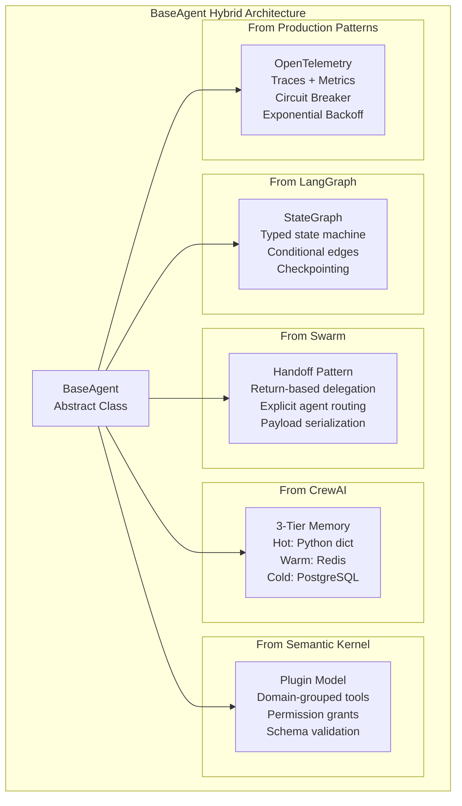
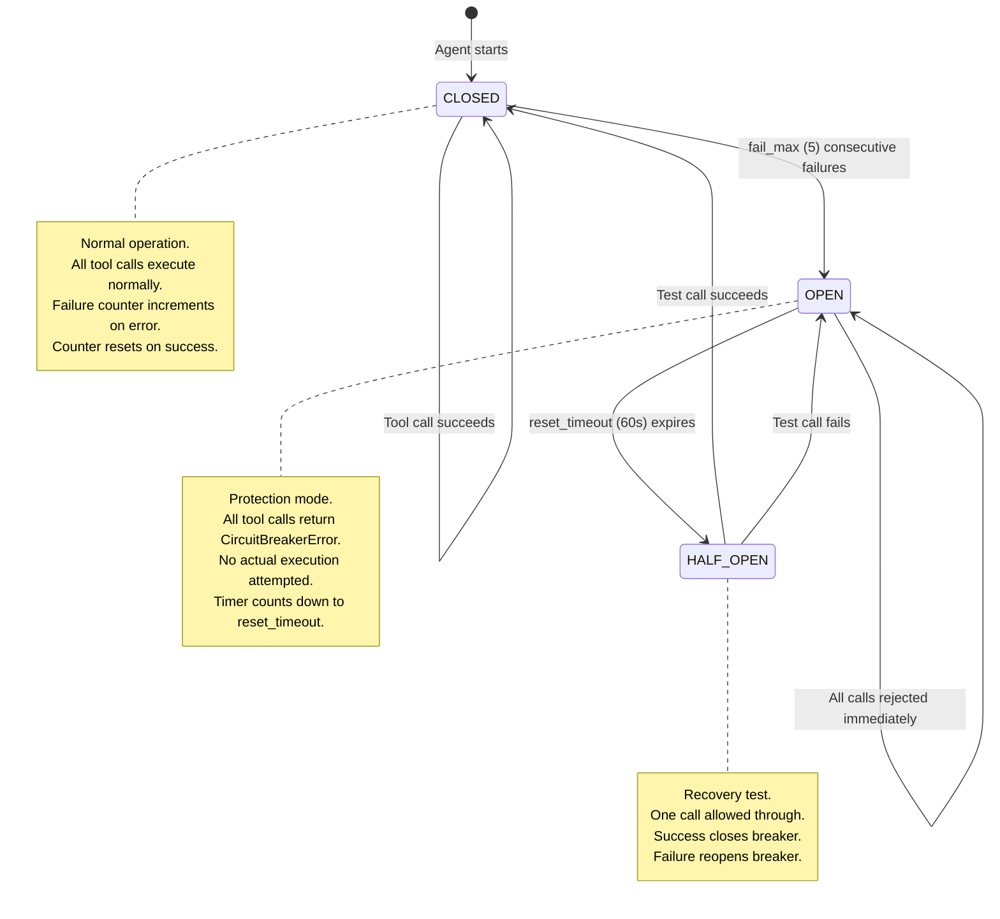
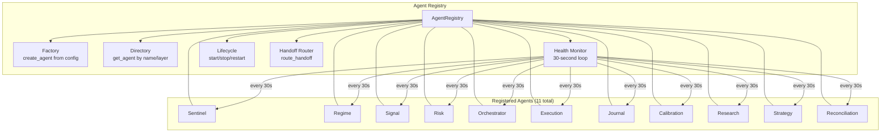
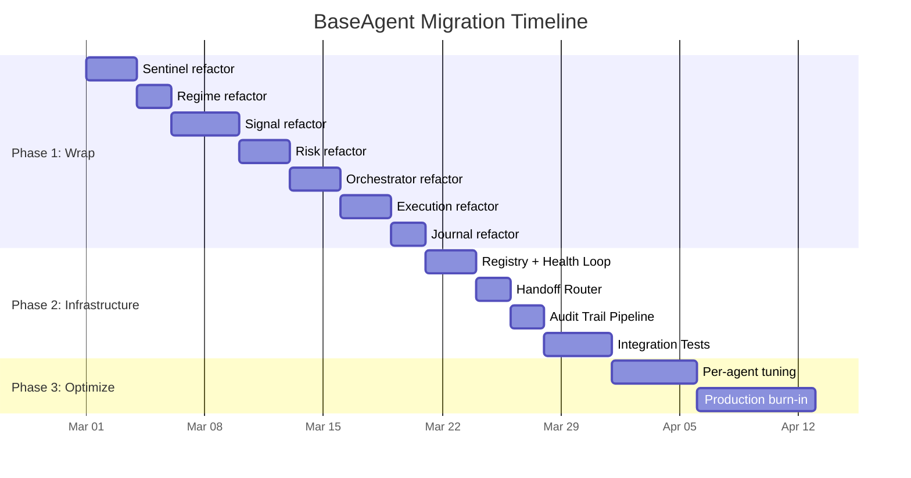
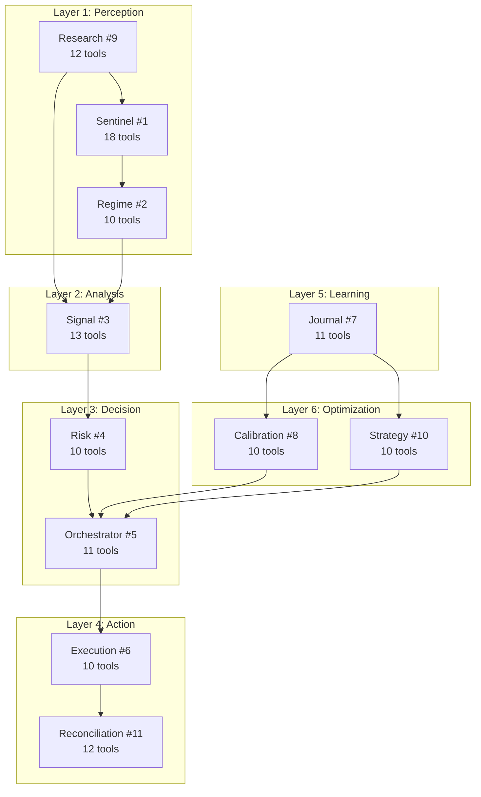
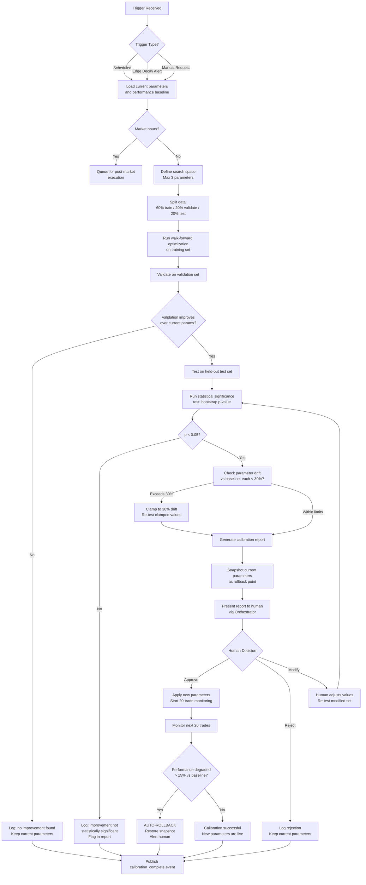
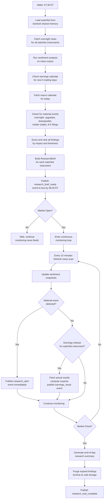
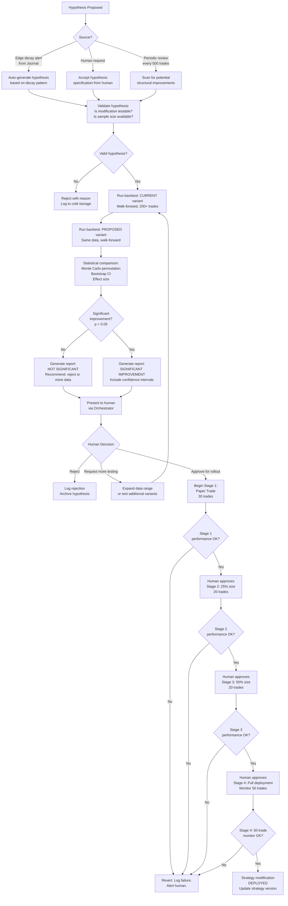
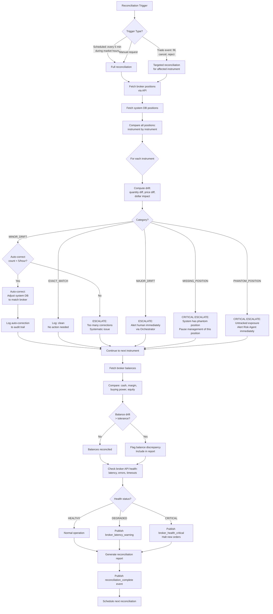
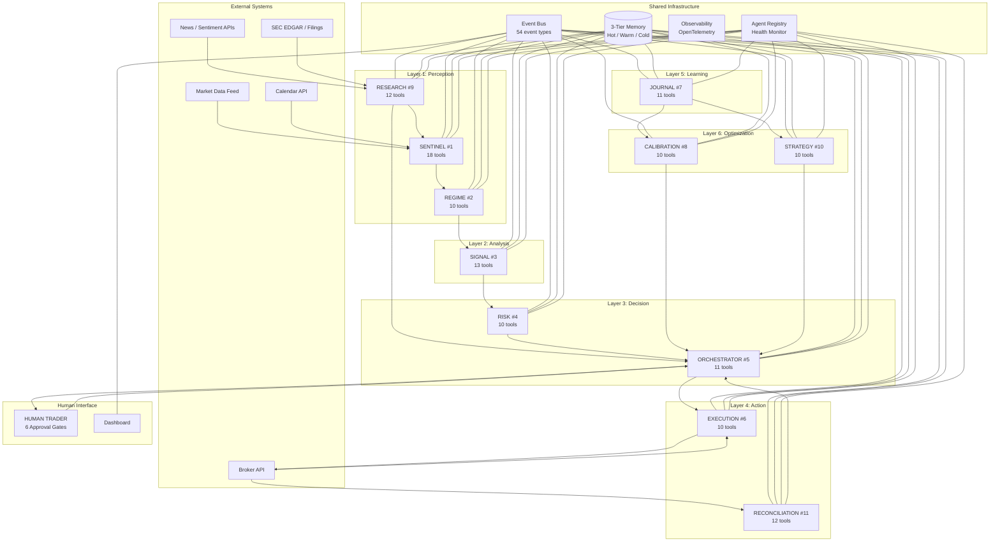

# PCTT Agentic System Architecture (Part 6)

## New Agents: Base Structure, Calibration, Research, Technical Strategy, and Reconciliation

**Version:** 1.0
**Author:** Kimal Honour Djam
**Extends:** Parts 1-5 (Sections 1-24)
**Scope:** Battle-tested BaseAgent framework, and 4 new specialized agents expanding the system from 7 to 11 agents.

---

## 25. Base Agent Structure (Battle-Tested Framework)

Parts 1 through 4 specified seven agents individually. Each agent received its own system prompt, memory dataclass, tools table, guardrails, and workflow diagram. That approach was correct for rapid prototyping. It let us define each agent's responsibilities without premature abstraction. But now, with four new agents joining the fleet and production deployment on the horizon, we need a formal BaseAgent abstract class that every agent inherits from.

This section designs that class. It is not a theoretical exercise. Every method, every hook, every interface maps to a concrete production requirement discovered across the first seven agent specifications.

---

### 25.1 Design Philosophy: Why a Hybrid Framework

No single agentic framework solves every problem the PCTT system faces. After evaluating five production frameworks, we selected the best pattern from each and combined them into a unified architecture.

#### 25.1.1 Framework Comparison Matrix

| Dimension | CrewAI | AutoGen | LangGraph | Semantic Kernel | Swarm/OpenAI SDK | **PCTT Choice** |
|-----------|--------|---------|-----------|-----------------|------------------|-----------------|
| **State Management** | Implicit (agent memory) | Chat history list | TypedDict state graph | Kernel context | context_variables dict | **LangGraph TypedDict** (typed, auditable, serializable) |
| **Tool Registration** | @tool decorator | register_function(caller, executor) | ToolNode with schema | @kernel_function plugin groups | Agent(functions=[...]) | **Semantic Kernel plugin model** (grouped by domain) |
| **Agent Communication** | Task delegation via crew | ConversableAgent.send() | State transitions via edges | Kernel orchestration | handoff via return Agent | **Swarm handoff-as-return** (explicit, traceable) |
| **Memory Architecture** | 4-tier (short/long/entity/contextual) | Chat history only | External via checkpointer | Semantic memory plugin | None built-in | **CrewAI 3-tier** (hot/warm/cold, mapped to Redis/Postgres/S3) |
| **Human-in-Loop** | human_input=True flag | Human proxy agent | interrupt_before nodes | Planner approval step | No native support | **LangGraph interrupt_before** (typed approval gates) |
| **Checkpointing** | None built-in | None built-in | PostgresSaver / SQLiteSaver | None built-in | None built-in | **LangGraph PostgresSaver** (audit trail, replay) |
| **Observability** | Callbacks | Event hooks | LangSmith integration | Telemetry hooks | No native support | **OpenTelemetry** (vendor-neutral, custom spans) |
| **Error Handling** | Basic try/catch | Reply on error | Retry policies on nodes | Kernel retry middleware | No native support | **Circuit breaker + exponential backoff** (pybreaker + tenacity) |

#### 25.1.2 The Hybrid Recipe

The PCTT BaseAgent combines five patterns into one coherent class:

1. **LangGraph StateGraph as backbone.** Every agent's workflow is a typed state machine with explicit edges. This gives us auditability (every state transition is logged), replayability (checkpoint any state and resume), and testability (inject any state and verify output).

2. **Swarm's handoff-as-return pattern for inter-agent communication.** When an agent needs to delegate work, it returns a `Handoff` object specifying the target agent and payload. The Orchestrator routes the handoff. This eliminates hidden coupling between agents. Every handoff is explicit and logged.

3. **CrewAI's memory tiers for state persistence.** Hot memory (Python dict, sub-millisecond) for current-bar state. Warm memory (Redis, single-digit milliseconds) for session state shared across agents. Cold memory (PostgreSQL, tens of milliseconds) for historical state and audit trails.

4. **Semantic Kernel's plugin model for tool grouping.** Tools are organized into plugins by domain (market_data, risk_math, broker_api). Each plugin has its own permission model. An agent can only access plugins explicitly granted to it.

5. **OpenTelemetry instrumentation from day one.** Every tool call, every state transition, every handoff generates a span. Metrics (latency histograms, error counters, tool call counts) feed into Prometheus. Traces feed into Jaeger. This is non-negotiable for a system managing real capital.



---

### 25.2 BaseAgent Abstract Class

This is the complete production implementation. Every agent in the PCTT system (the original 7 and the 4 new ones) inherits from this class.

#### 25.2.1 Core Data Structures

```python
from __future__ import annotations

import abc
import asyncio
import time
import uuid
from dataclasses import dataclass, field
from datetime import datetime, timezone
from enum import Enum
from typing import Any, Callable, Dict, List, Optional, Set, Type


class AgentLayer(Enum):
    """The 5-layer architecture from Part 1."""
    PERCEPTION = "perception"
    ANALYSIS = "analysis"
    DECISION = "decision"
    ACTION = "action"
    LEARNING = "learning"


class AgentStatus(Enum):
    """Runtime status of an agent."""
    INITIALIZING = "initializing"
    READY = "ready"
    RUNNING = "running"
    PAUSED = "paused"
    ERROR = "error"
    STOPPED = "stopped"


class ToolPermission(Enum):
    """Permission levels for tool access."""
    READ_ONLY = "read_only"          # Can read market data, memory
    READ_WRITE = "read_write"        # Can read and write memory, publish events
    EXECUTE = "execute"              # Can place orders, modify positions
    ADMIN = "admin"                  # Can change system mode, halt trading


@dataclass
class ToolSpec:
    """
    Specification for a single tool available to an agent.
    Maps to the tools tables in Parts 1-4.
    """
    name: str
    description: str
    plugin: str                      # Domain group (market_data, risk_math, broker_api, etc.)
    permission: ToolPermission
    input_schema: Dict[str, Any]     # JSON Schema for input validation
    output_schema: Dict[str, Any]    # JSON Schema for output validation
    timeout_ms: int = 5000           # Per-tool timeout
    retryable: bool = True           # Whether this tool can be retried on failure
    idempotent: bool = False         # Whether retrying is safe (no side effects)
    circuit_breaker_enabled: bool = True
    rate_limit_per_minute: int = 60  # Max calls per minute

    def validate_input(self, input_data: Dict[str, Any]) -> bool:
        """Validate input against schema. Returns True if valid."""
        # In production, use jsonschema.validate()
        required = self.input_schema.get("required", [])
        for req in required:
            if req not in input_data:
                return False
        return True


@dataclass
class Handoff:
    """
    Swarm-style handoff object. Returned by an agent when it needs
    to delegate work to another agent.
    """
    source_agent: str
    target_agent: str
    payload: Dict[str, Any]
    priority: str = "NORMAL"         # LOW, NORMAL, HIGH, CRITICAL
    requires_response: bool = False  # Whether source needs a reply
    correlation_id: str = ""         # For tracking request/response pairs
    created_at: str = ""

    def __post_init__(self):
        if not self.correlation_id:
            self.correlation_id = str(uuid.uuid4())
        if not self.created_at:
            self.created_at = datetime.now(timezone.utc).isoformat()


@dataclass
class AgentHealthCheck:
    """Health check result for monitoring."""
    agent_name: str
    status: AgentStatus
    uptime_seconds: float
    last_execution_at: str
    error_count_last_hour: int
    avg_latency_ms: float
    circuit_breaker_state: str       # CLOSED, OPEN, HALF_OPEN
    memory_usage_mb: float
    tools_available: int
    tools_healthy: int
    checks_passed: List[str]
    checks_failed: List[str]
    timestamp: str = ""

    def __post_init__(self):
        if not self.timestamp:
            self.timestamp = datetime.now(timezone.utc).isoformat()

    @property
    def is_healthy(self) -> bool:
        return (
            self.status in (AgentStatus.READY, AgentStatus.RUNNING)
            and len(self.checks_failed) == 0
            and self.circuit_breaker_state != "OPEN"
        )


@dataclass
class AuditEntry:
    """
    Immutable audit trail entry. Every significant agent action
    generates one of these. Written to cold storage (PostgreSQL).
    """
    entry_id: str
    agent_name: str
    action: str                      # tool_call, state_transition, handoff, error, etc.
    input_summary: Dict[str, Any]
    output_summary: Dict[str, Any]
    duration_ms: float
    success: bool
    error_message: str = ""
    correlation_id: str = ""
    parent_span_id: str = ""
    timestamp: str = ""

    def __post_init__(self):
        if not self.entry_id:
            self.entry_id = str(uuid.uuid4())
        if not self.timestamp:
            self.timestamp = datetime.now(timezone.utc).isoformat()
```

#### 25.2.2 Memory Interface

```python
@dataclass
class MemoryInterface:
    """
    3-tier memory interface. Maps to the Hot/Warm/Cold architecture
    from Part 1 Section 5.
    """

    # Hot tier: in-process Python dict. Sub-millisecond access.
    # Scope: current bar, current pipeline run.
    # Lost on restart. Rebuilt from warm tier on startup.
    _hot: Dict[str, Any] = field(default_factory=dict)

    # Warm tier connection info (Redis)
    _warm_client: Any = None  # redis.asyncio.Redis instance

    # Cold tier connection info (PostgreSQL)
    _cold_pool: Any = None    # asyncpg.Pool instance

    # --- Hot Tier Operations ---

    def hot_get(self, key: str, default: Any = None) -> Any:
        """Read from hot tier. O(1) dict lookup."""
        return self._hot.get(key, default)

    def hot_set(self, key: str, value: Any) -> None:
        """Write to hot tier. O(1) dict insert."""
        self._hot[key] = value

    def hot_delete(self, key: str) -> None:
        """Remove from hot tier."""
        self._hot.pop(key, None)

    def hot_clear(self) -> None:
        """Clear all hot tier data. Used on session reset."""
        self._hot.clear()

    # --- Warm Tier Operations (Redis) ---

    async def warm_get(self, key: str) -> Optional[str]:
        """Read from warm tier. Returns JSON string or None."""
        if self._warm_client is None:
            raise RuntimeError("Warm memory not initialized")
        return await self._warm_client.get(key)

    async def warm_set(self, key: str, value: str, ttl_seconds: int = 0) -> None:
        """Write to warm tier with optional TTL."""
        if self._warm_client is None:
            raise RuntimeError("Warm memory not initialized")
        if ttl_seconds > 0:
            await self._warm_client.setex(key, ttl_seconds, value)
        else:
            await self._warm_client.set(key, value)

    async def warm_delete(self, key: str) -> None:
        """Remove from warm tier."""
        if self._warm_client is None:
            raise RuntimeError("Warm memory not initialized")
        await self._warm_client.delete(key)

    async def warm_publish(self, channel: str, message: str) -> None:
        """Publish to Redis pub/sub (event bus)."""
        if self._warm_client is None:
            raise RuntimeError("Warm memory not initialized")
        await self._warm_client.publish(channel, message)

    # --- Cold Tier Operations (PostgreSQL) ---

    async def cold_write(self, table: str, record: Dict[str, Any]) -> str:
        """Insert a record into cold storage. Returns record ID."""
        if self._cold_pool is None:
            raise RuntimeError("Cold memory not initialized")
        columns = ", ".join(record.keys())
        placeholders = ", ".join(f"${i+1}" for i in range(len(record)))
        query = f"INSERT INTO {table} ({columns}) VALUES ({placeholders}) RETURNING id"
        async with self._cold_pool.acquire() as conn:
            row = await conn.fetchrow(query, *record.values())
            return str(row["id"])

    async def cold_query(self, query: str, *args) -> List[Dict[str, Any]]:
        """Execute a read query against cold storage."""
        if self._cold_pool is None:
            raise RuntimeError("Cold memory not initialized")
        async with self._cold_pool.acquire() as conn:
            rows = await conn.fetch(query, *args)
            return [dict(row) for row in rows]
```

#### 25.2.3 Observability Layer

```python
from opentelemetry import trace, metrics
from opentelemetry.trace import StatusCode


@dataclass
class AgentObservability:
    """
    OpenTelemetry instrumentation for a single agent.
    Every agent gets its own tracer and meter with agent-scoped attributes.
    """
    agent_name: str
    _tracer: Any = None
    _meter: Any = None

    # Counters
    _tool_calls_counter: Any = None
    _tool_errors_counter: Any = None
    _handoffs_counter: Any = None
    _state_transitions_counter: Any = None

    # Histograms
    _tool_latency_histogram: Any = None
    _execution_latency_histogram: Any = None

    def initialize(self) -> None:
        """Set up OpenTelemetry tracer and meters."""
        self._tracer = trace.get_tracer(f"pctt.agent.{self.agent_name}")
        self._meter = metrics.get_meter(f"pctt.agent.{self.agent_name}")

        self._tool_calls_counter = self._meter.create_counter(
            name="pctt.agent.tool_calls",
            description="Number of tool calls made by this agent",
            unit="1",
        )
        self._tool_errors_counter = self._meter.create_counter(
            name="pctt.agent.tool_errors",
            description="Number of tool call errors",
            unit="1",
        )
        self._handoffs_counter = self._meter.create_counter(
            name="pctt.agent.handoffs",
            description="Number of handoffs initiated",
            unit="1",
        )
        self._state_transitions_counter = self._meter.create_counter(
            name="pctt.agent.state_transitions",
            description="Number of state transitions",
            unit="1",
        )
        self._tool_latency_histogram = self._meter.create_histogram(
            name="pctt.agent.tool_latency_ms",
            description="Tool call latency in milliseconds",
            unit="ms",
        )
        self._execution_latency_histogram = self._meter.create_histogram(
            name="pctt.agent.execution_latency_ms",
            description="Full execution cycle latency in milliseconds",
            unit="ms",
        )

    def start_span(self, name: str, attributes: Dict[str, str] = None) -> Any:
        """Start a new trace span."""
        attrs = {"agent.name": self.agent_name}
        if attributes:
            attrs.update(attributes)
        return self._tracer.start_span(name, attributes=attrs)

    def record_tool_call(self, tool_name: str, latency_ms: float, success: bool) -> None:
        """Record a tool call metric."""
        labels = {"agent": self.agent_name, "tool": tool_name}
        self._tool_calls_counter.add(1, labels)
        self._tool_latency_histogram.record(latency_ms, labels)
        if not success:
            self._tool_errors_counter.add(1, labels)

    def record_handoff(self, target_agent: str) -> None:
        """Record a handoff metric."""
        labels = {"agent": self.agent_name, "target": target_agent}
        self._handoffs_counter.add(1, labels)

    def record_state_transition(self, from_state: str, to_state: str) -> None:
        """Record a state transition metric."""
        labels = {
            "agent": self.agent_name,
            "from": from_state,
            "to": to_state,
        }
        self._state_transitions_counter.add(1, labels)
```

#### 25.2.4 Resilience Layer

```python
import pybreaker
from tenacity import (
    retry,
    stop_after_attempt,
    wait_exponential_jitter,
    retry_if_exception_type,
)


class CircuitBreakerState(Enum):
    CLOSED = "closed"          # Normal operation
    OPEN = "open"              # Failing, all calls rejected
    HALF_OPEN = "half_open"    # Testing if service recovered


@dataclass
class ResilienceConfig:
    """Configuration for retry and circuit breaker behavior."""
    max_retries: int = 3
    base_delay_seconds: float = 0.5
    max_delay_seconds: float = 30.0
    jitter_seconds: float = 1.0
    circuit_breaker_fail_max: int = 5        # Failures before opening
    circuit_breaker_reset_timeout: int = 60  # Seconds before half-open
    timeout_seconds: float = 10.0


class AgentCircuitBreaker:
    """
    Circuit breaker wrapping pybreaker for agent tool calls.

    State transitions:
    CLOSED (normal) -> OPEN (after fail_max failures)
    OPEN (rejecting) -> HALF_OPEN (after reset_timeout)
    HALF_OPEN (testing) -> CLOSED (if test succeeds) or OPEN (if test fails)
    """

    def __init__(self, agent_name: str, config: ResilienceConfig):
        self.agent_name = agent_name
        self._breaker = pybreaker.CircuitBreaker(
            fail_max=config.circuit_breaker_fail_max,
            reset_timeout=config.circuit_breaker_reset_timeout,
            name=f"pctt_{agent_name}_breaker",
        )

    @property
    def state(self) -> str:
        return self._breaker.current_state

    def call(self, func: Callable, *args, **kwargs) -> Any:
        """Execute function through circuit breaker."""
        return self._breaker.call(func, *args, **kwargs)
```



#### 25.2.5 The BaseAgent Abstract Class

```python
class BaseAgent(abc.ABC):
    """
    Abstract base class for all PCTT agents.

    Combines:
    - LangGraph: Typed state machine with checkpointing
    - Swarm: Handoff-as-return inter-agent communication
    - CrewAI: 3-tier memory (hot/warm/cold)
    - Semantic Kernel: Plugin-based tool grouping with permissions
    - OpenTelemetry: Traces, metrics, and audit trails

    All 11 agents (Sentinel, Regime, Signal, Risk, Orchestrator,
    Execution, Journal, Calibration, Research, Strategy, Reconciliation)
    inherit from this class.
    """

    def __init__(
        self,
        name: str,
        role: str,
        layer: AgentLayer,
        laws: List[int],
        instructions: str,
        tools: List[ToolSpec],
        resilience_config: ResilienceConfig = None,
    ):
        # Identity
        self.name = name
        self.role = role
        self.layer = layer
        self.laws = laws
        self.instructions = instructions
        self.agent_id = str(uuid.uuid4())

        # Tools (organized by plugin)
        self._tools: Dict[str, ToolSpec] = {}
        self._tool_implementations: Dict[str, Callable] = {}
        self._plugins: Dict[str, List[str]] = {}
        for tool in tools:
            self.register_tool(tool)

        # Memory
        self.memory = MemoryInterface()

        # Status
        self.status = AgentStatus.INITIALIZING
        self._start_time: Optional[float] = None
        self._last_execution: Optional[str] = None
        self._error_count: int = 0

        # Resilience
        self._resilience_config = resilience_config or ResilienceConfig()
        self._circuit_breaker = AgentCircuitBreaker(
            name, self._resilience_config
        )

        # Observability
        self._observability = AgentObservability(agent_name=name)
        self._observability.initialize()

        # Audit trail buffer (flushed to cold storage periodically)
        self._audit_buffer: List[AuditEntry] = []
        self._audit_flush_threshold: int = 50

    # --- Tool Registration (Semantic Kernel Plugin Model) ---

    def register_tool(self, spec: ToolSpec) -> None:
        """
        Register a tool with this agent. Tools are grouped by plugin.
        Only tools explicitly registered are available.
        """
        self._tools[spec.name] = spec
        if spec.plugin not in self._plugins:
            self._plugins[spec.plugin] = []
        self._plugins[spec.plugin].append(spec.name)

    def register_tool_implementation(
        self, tool_name: str, implementation: Callable
    ) -> None:
        """Bind a callable to a registered tool spec."""
        if tool_name not in self._tools:
            raise ValueError(
                f"Tool '{tool_name}' not registered. "
                f"Register the ToolSpec first."
            )
        self._tool_implementations[tool_name] = implementation

    def get_available_tools(self, plugin: str = None) -> List[ToolSpec]:
        """List available tools, optionally filtered by plugin."""
        if plugin:
            tool_names = self._plugins.get(plugin, [])
            return [self._tools[n] for n in tool_names]
        return list(self._tools.values())

    # --- Tool Execution with Resilience ---

    async def call_tool(
        self, tool_name: str, input_data: Dict[str, Any]
    ) -> Dict[str, Any]:
        """
        Execute a tool with full resilience stack:
        1. Input validation against schema
        2. Circuit breaker check
        3. Retry with exponential backoff + jitter
        4. Timeout enforcement
        5. OpenTelemetry span + metrics
        6. Audit trail entry
        """
        spec = self._tools.get(tool_name)
        if spec is None:
            raise ValueError(f"Tool '{tool_name}' not available to agent '{self.name}'")

        impl = self._tool_implementations.get(tool_name)
        if impl is None:
            raise ValueError(f"Tool '{tool_name}' has no implementation bound")

        # Step 1: Validate input
        if not spec.validate_input(input_data):
            raise ValueError(f"Invalid input for tool '{tool_name}'")

        # Step 2-5: Execute with resilience
        return await self._execute_with_resilience(
            tool_name=tool_name,
            spec=spec,
            impl=impl,
            input_data=input_data,
        )

    async def _execute_with_resilience(
        self,
        tool_name: str,
        spec: ToolSpec,
        impl: Callable,
        input_data: Dict[str, Any],
    ) -> Dict[str, Any]:
        """
        Core execution method with retry, circuit breaker, timeout,
        telemetry, and audit trail.
        """
        span = self._observability.start_span(
            f"tool.{tool_name}",
            attributes={"tool.name": tool_name, "tool.plugin": spec.plugin},
        )

        start_time = time.monotonic()
        attempt = 0
        last_error = None

        max_attempts = (
            self._resilience_config.max_retries + 1
            if spec.retryable
            else 1
        )

        while attempt < max_attempts:
            attempt += 1
            try:
                # Circuit breaker gate
                if self._circuit_breaker.state == "open":
                    raise pybreaker.CircuitBreakerError(
                        f"Circuit breaker OPEN for agent '{self.name}'"
                    )

                # Timeout enforcement
                result = await asyncio.wait_for(
                    impl(**input_data)
                    if asyncio.iscoroutinefunction(impl)
                    else asyncio.get_event_loop().run_in_executor(
                        None, lambda: impl(**input_data)
                    ),
                    timeout=spec.timeout_ms / 1000.0,
                )

                # Success path
                elapsed_ms = (time.monotonic() - start_time) * 1000
                self._observability.record_tool_call(tool_name, elapsed_ms, True)

                # Audit entry
                self._append_audit(
                    action=f"tool_call:{tool_name}",
                    input_summary={"keys": list(input_data.keys())},
                    output_summary={"type": type(result).__name__},
                    duration_ms=elapsed_ms,
                    success=True,
                )

                span.set_status(StatusCode.OK)
                span.end()
                return result

            except asyncio.TimeoutError:
                last_error = f"Timeout after {spec.timeout_ms}ms"
            except pybreaker.CircuitBreakerError as e:
                last_error = str(e)
                break  # Do not retry on circuit breaker open
            except Exception as e:
                last_error = str(e)

            # Retry delay with exponential backoff + jitter
            if attempt < max_attempts and spec.retryable:
                delay = min(
                    self._resilience_config.base_delay_seconds * (2 ** (attempt - 1)),
                    self._resilience_config.max_delay_seconds,
                )
                jitter = self._resilience_config.jitter_seconds * (
                    0.5 + 0.5 * (hash(f"{tool_name}{attempt}") % 100) / 100
                )
                await asyncio.sleep(delay + jitter)

        # All attempts failed
        elapsed_ms = (time.monotonic() - start_time) * 1000
        self._error_count += 1
        self._observability.record_tool_call(tool_name, elapsed_ms, False)

        self._append_audit(
            action=f"tool_call:{tool_name}",
            input_summary={"keys": list(input_data.keys())},
            output_summary={"error": last_error},
            duration_ms=elapsed_ms,
            success=False,
            error_message=last_error or "Unknown error",
        )

        span.set_status(StatusCode.ERROR, last_error)
        span.end()
        raise RuntimeError(
            f"Tool '{tool_name}' failed after {attempt} attempts: {last_error}"
        )

    # --- Abstract Methods (subclasses MUST implement) ---

    @abc.abstractmethod
    async def execute(self, state: Dict[str, Any]) -> Dict[str, Any]:
        """
        Core execution logic for this agent.
        Receives the current typed state, processes it, and returns
        the updated state (LangGraph pattern).

        Subclasses implement their specific pipeline here:
        - Sentinel: market scanning and brief generation
        - Signal: 12-stage PCTT pipeline
        - Risk: sizing and validation gates
        - etc.
        """
        ...

    @abc.abstractmethod
    def get_agent_memory(self) -> Any:
        """Return the agent-specific memory dataclass (e.g., SignalMemory)."""
        ...

    # --- Lifecycle Hooks ---

    async def on_start(self) -> None:
        """
        Called when the agent is initialized and ready to begin.
        Override to load persisted state, warm caches, verify connections.
        """
        self._start_time = time.monotonic()
        self.status = AgentStatus.READY

    async def on_stop(self) -> None:
        """
        Called when the agent is shutting down gracefully.
        Override to flush buffers, persist state, close connections.
        """
        await self._flush_audit_buffer()
        self.status = AgentStatus.STOPPED

    async def on_error(self, error: Exception, context: Dict[str, Any]) -> None:
        """
        Called when an unhandled error occurs during execution.
        Override to implement error-specific recovery logic.
        Default behavior: log error, increment counter, check circuit breaker.
        """
        self._error_count += 1
        self._append_audit(
            action="unhandled_error",
            input_summary=context,
            output_summary={"error_type": type(error).__name__},
            duration_ms=0,
            success=False,
            error_message=str(error),
        )

    async def on_handoff(self, handoff: Handoff) -> None:
        """
        Called when this agent initiates a handoff to another agent.
        Override to add pre-handoff validation or state cleanup.
        """
        self._observability.record_handoff(handoff.target_agent)

    # --- Handoff (Swarm Pattern) ---

    async def handoff_to(
        self,
        target_agent: str,
        payload: Dict[str, Any],
        priority: str = "NORMAL",
        requires_response: bool = False,
    ) -> Handoff:
        """
        Create a handoff to another agent. The Orchestrator routes it.

        This is the Swarm "handoff-as-return" pattern adapted for
        async operation. The agent does not call the target directly.
        It returns a Handoff object that the Orchestrator processes.
        """
        handoff = Handoff(
            source_agent=self.name,
            target_agent=target_agent,
            payload=payload,
            priority=priority,
            requires_response=requires_response,
        )
        await self.on_handoff(handoff)

        self._append_audit(
            action=f"handoff_to:{target_agent}",
            input_summary={"payload_keys": list(payload.keys())},
            output_summary={"correlation_id": handoff.correlation_id},
            duration_ms=0,
            success=True,
        )

        return handoff

    # --- Health Check ---

    async def health_check(self) -> AgentHealthCheck:
        """
        Run a comprehensive health check. Called by the Agent Registry
        on a regular interval.
        """
        checks_passed = []
        checks_failed = []

        # Check 1: Status
        if self.status in (AgentStatus.READY, AgentStatus.RUNNING):
            checks_passed.append("status_ok")
        else:
            checks_failed.append(f"status_{self.status.value}")

        # Check 2: Circuit breaker
        if self._circuit_breaker.state != "open":
            checks_passed.append("circuit_breaker_ok")
        else:
            checks_failed.append("circuit_breaker_open")

        # Check 3: Memory connectivity
        try:
            await self.memory.warm_get("health_check_ping")
            checks_passed.append("warm_memory_ok")
        except Exception:
            checks_failed.append("warm_memory_unreachable")

        # Check 4: Error rate
        if self._error_count < 10:
            checks_passed.append("error_rate_ok")
        else:
            checks_failed.append(f"high_error_count_{self._error_count}")

        uptime = (
            time.monotonic() - self._start_time
            if self._start_time
            else 0
        )

        tools_healthy = sum(
            1 for t in self._tools.values()
            if t.name in self._tool_implementations
        )

        return AgentHealthCheck(
            agent_name=self.name,
            status=self.status,
            uptime_seconds=uptime,
            last_execution_at=self._last_execution or "never",
            error_count_last_hour=self._error_count,
            avg_latency_ms=0.0,  # Computed from histogram
            circuit_breaker_state=self._circuit_breaker.state,
            memory_usage_mb=0.0,  # Computed from process metrics
            tools_available=len(self._tools),
            tools_healthy=tools_healthy,
            checks_passed=checks_passed,
            checks_failed=checks_failed,
        )

    # --- State Serialization (LangGraph Checkpointing) ---

    def serialize_state(self) -> Dict[str, Any]:
        """
        Serialize agent state for checkpointing.
        Returns a dict that can be stored via PostgresSaver.
        """
        return {
            "agent_id": self.agent_id,
            "agent_name": self.name,
            "status": self.status.value,
            "hot_memory": self.memory._hot.copy(),
            "error_count": self._error_count,
            "circuit_breaker_state": self._circuit_breaker.state,
            "last_execution": self._last_execution,
            "timestamp": datetime.now(timezone.utc).isoformat(),
        }

    async def restore_state(self, checkpoint: Dict[str, Any]) -> None:
        """
        Restore agent state from a checkpoint.
        Used on system restart or agent recovery.
        """
        self.memory._hot = checkpoint.get("hot_memory", {})
        self._error_count = checkpoint.get("error_count", 0)
        self._last_execution = checkpoint.get("last_execution")
        self.status = AgentStatus.READY

    # --- Audit Trail ---

    def _append_audit(
        self,
        action: str,
        input_summary: Dict[str, Any],
        output_summary: Dict[str, Any],
        duration_ms: float,
        success: bool,
        error_message: str = "",
    ) -> None:
        """Append an audit entry to the buffer."""
        entry = AuditEntry(
            entry_id=str(uuid.uuid4()),
            agent_name=self.name,
            action=action,
            input_summary=input_summary,
            output_summary=output_summary,
            duration_ms=duration_ms,
            success=success,
            error_message=error_message,
        )
        self._audit_buffer.append(entry)

        if len(self._audit_buffer) >= self._audit_flush_threshold:
            asyncio.create_task(self._flush_audit_buffer())

    async def _flush_audit_buffer(self) -> None:
        """Flush audit entries to cold storage."""
        if not self._audit_buffer:
            return

        entries = self._audit_buffer.copy()
        self._audit_buffer.clear()

        for entry in entries:
            try:
                await self.memory.cold_write(
                    "audit_trail",
                    {
                        "entry_id": entry.entry_id,
                        "agent_name": entry.agent_name,
                        "action": entry.action,
                        "input_summary": str(entry.input_summary),
                        "output_summary": str(entry.output_summary),
                        "duration_ms": entry.duration_ms,
                        "success": entry.success,
                        "error_message": entry.error_message,
                        "timestamp": entry.timestamp,
                    },
                )
            except Exception:
                pass  # Cold storage failure should not crash the agent

    # --- String Representation ---

    def __repr__(self) -> str:
        return (
            f"<{self.__class__.__name__} "
            f"name='{self.name}' "
            f"layer={self.layer.value} "
            f"status={self.status.value} "
            f"tools={len(self._tools)} "
            f"laws={self.laws}>"
        )
```

---

### 25.3 Agent Registry

The Agent Registry is the central directory for agent discovery, lifecycle management, and health monitoring. It implements the Factory pattern for agent creation and maintains a real-time health dashboard.

```python
from typing import Type


class AgentRegistry:
    """
    Central registry for all PCTT agents.

    Responsibilities:
    1. Agent registration and discovery
    2. Agent factory (create agents from config)
    3. Health monitoring loop
    4. Agent lifecycle management (start, stop, restart)
    5. Handoff routing (find target agent for handoffs)
    """

    def __init__(self):
        self._agents: Dict[str, BaseAgent] = {}
        self._agent_classes: Dict[str, Type[BaseAgent]] = {}
        self._health_interval_seconds: int = 30
        self._health_task: Optional[asyncio.Task] = None

    # --- Registration ---

    def register_class(self, name: str, agent_class: Type[BaseAgent]) -> None:
        """Register an agent class for factory creation."""
        self._agent_classes[name] = agent_class

    def register_instance(self, agent: BaseAgent) -> None:
        """Register a live agent instance."""
        self._agents[agent.name] = agent

    def get_agent(self, name: str) -> Optional[BaseAgent]:
        """Look up an agent by name."""
        return self._agents.get(name)

    def get_all_agents(self) -> Dict[str, BaseAgent]:
        """Return all registered agent instances."""
        return self._agents.copy()

    def get_agents_by_layer(self, layer: AgentLayer) -> List[BaseAgent]:
        """Find all agents in a specific architecture layer."""
        return [a for a in self._agents.values() if a.layer == layer]

    # --- Factory ---

    def create_agent(
        self, name: str, config: Dict[str, Any]
    ) -> BaseAgent:
        """
        Factory method: create an agent from a registered class and config.
        Config maps to constructor parameters.
        """
        agent_class = self._agent_classes.get(name)
        if agent_class is None:
            raise ValueError(f"No agent class registered for '{name}'")

        agent = agent_class(**config)
        self._agents[agent.name] = agent
        return agent

    # --- Lifecycle ---

    async def start_all(self) -> Dict[str, bool]:
        """Start all registered agents. Returns {name: success}."""
        results = {}
        for name, agent in self._agents.items():
            try:
                await agent.on_start()
                results[name] = True
            except Exception as e:
                results[name] = False
        return results

    async def stop_all(self) -> Dict[str, bool]:
        """Gracefully stop all agents."""
        if self._health_task:
            self._health_task.cancel()

        results = {}
        for name, agent in self._agents.items():
            try:
                await agent.on_stop()
                results[name] = True
            except Exception:
                results[name] = False
        return results

    async def restart_agent(self, name: str) -> bool:
        """Stop and restart a single agent."""
        agent = self._agents.get(name)
        if agent is None:
            return False

        await agent.on_stop()
        await agent.on_start()
        return True

    # --- Health Monitoring ---

    async def start_health_loop(self) -> None:
        """Start the periodic health check loop."""
        self._health_task = asyncio.create_task(self._health_loop())

    async def _health_loop(self) -> None:
        """Run health checks on all agents periodically."""
        while True:
            await asyncio.sleep(self._health_interval_seconds)
            for name, agent in self._agents.items():
                try:
                    health = await agent.health_check()
                    if not health.is_healthy:
                        await self._handle_unhealthy_agent(name, health)
                except Exception:
                    pass

    async def _handle_unhealthy_agent(
        self, name: str, health: AgentHealthCheck
    ) -> None:
        """
        Handle an unhealthy agent. Strategies:
        1. If circuit breaker open: wait for reset
        2. If error count high: attempt restart
        3. If memory unreachable: escalate to Orchestrator
        """
        if "circuit_breaker_open" in health.checks_failed:
            # Wait for automatic reset. Log the event.
            pass
        elif any("error_count" in f for f in health.checks_failed):
            await self.restart_agent(name)
        elif "warm_memory_unreachable" in health.checks_failed:
            # Escalate: memory failure affects all agents
            orchestrator = self._agents.get("orchestrator")
            if orchestrator:
                await orchestrator.handoff_to(
                    "orchestrator",
                    payload={
                        "alert_type": "MEMORY_FAILURE",
                        "affected_agent": name,
                        "health": health.__dict__,
                    },
                    priority="CRITICAL",
                )

    # --- Handoff Routing ---

    async def route_handoff(self, handoff: Handoff) -> Optional[Dict[str, Any]]:
        """
        Route a handoff from one agent to another.
        Called by the Orchestrator to process Handoff objects.
        """
        target = self._agents.get(handoff.target_agent)
        if target is None:
            raise ValueError(
                f"Handoff target '{handoff.target_agent}' not found in registry"
            )

        if target.status not in (AgentStatus.READY, AgentStatus.RUNNING):
            raise RuntimeError(
                f"Target agent '{handoff.target_agent}' is not available "
                f"(status: {target.status.value})"
            )

        result = await target.execute(handoff.payload)

        if handoff.requires_response:
            return result
        return None
```



---

### 25.4 How Existing 7 Agents Map to BaseAgent

Every agent from Parts 1 through 4 maps cleanly to the BaseAgent pattern. The table below shows how each agent's existing specification translates to BaseAgent constructor parameters.

#### 25.4.1 Mapping Table

| Agent | name | layer | laws | tools (count) | plugins used |
|-------|------|-------|------|---------------|-------------|
| Sentinel | "sentinel" | PERCEPTION | [3, 8, 9, 24, 30] | 18 | market_data, calendar, news, memory, events |
| Regime | "regime" | PERCEPTION | [8, 19, 28] | 10 | statistics, regime, memory, events |
| Signal | "signal" | ANALYSIS | [1, 5, 6, 11, 13, 15, 17] | 13 | pivots, boundaries, scoring, pipeline, events |
| Risk | "risk" | DECISION | [7, 21, 22, 23, 24, 29, 30] | 10 | risk_math, portfolio, circuit_breakers, memory, events |
| Orchestrator | "orchestrator" | DECISION | list(range(1, 31)) | 11 | coordination, approval, routing, memory, events |
| Execution | "execution" | ACTION | [4, 10, 14, 25] | 10 | broker_api, trailing_stops, position_mgmt, events |
| Journal | "journal" | LEARNING | [16, 17, 19, 20, 27] | 11 | analytics, reporting, edge_decay, memory, events |

#### 25.4.2 Concrete Example: Signal Agent as BaseAgent Subclass

This shows exactly how the Signal agent from Part 1 Section 3.3 would be refactored to inherit from BaseAgent.

```python
class SignalAgent(BaseAgent):
    """
    The core PCTT pipeline executor. Runs the complete 12-stage
    pipeline and produces trade entry proposals.

    Refactored from Part 1 Section 3.3 to inherit from BaseAgent.
    """

    SYSTEM_PROMPT = """
    You are the SIGNAL agent in the PCTT trading system. You execute the
    complete 12-stage Pivot-Constrained Trendline Trading pipeline to
    generate entry signals.

    PRIME DIRECTIVE: Generate high-quality, non-repainting trade signals
    by running every bar through the 12-stage cascading gate pipeline.
    Quality over quantity. Refuse 99%+ of price action.
    """

    def __init__(self):
        # Define tools (from Part 1 Section 3.3.3 + Part 4 Fix 9)
        tools = [
            ToolSpec(
                name="detect_pivots",
                description="Adaptive zigzag pivot detection",
                plugin="pivots",
                permission=ToolPermission.READ_ONLY,
                input_schema={
                    "required": ["bars"],
                    "properties": {
                        "bars": {"type": "array"},
                        "left": {"type": "integer", "default": 5},
                        "right": {"type": "integer", "default": 5},
                        "atr_thresh": {"type": "number", "default": 1.0},
                    },
                },
                output_schema={"type": "array", "items": {"type": "object"}},
                timeout_ms=2000,
                retryable=False,
                idempotent=True,
            ),
            ToolSpec(
                name="generate_candidates",
                description="Pivot-pair line generation",
                plugin="boundaries",
                permission=ToolPermission.READ_ONLY,
                input_schema={
                    "required": ["pivots"],
                    "properties": {
                        "pivots": {"type": "array"},
                        "min_touches": {"type": "integer", "default": 3},
                        "min_bars": {"type": "integer", "default": 10},
                    },
                },
                output_schema={"type": "array"},
                timeout_ms=3000,
                retryable=False,
                idempotent=True,
            ),
            ToolSpec(
                name="fit_huber",
                description="Huber boundary estimation",
                plugin="boundaries",
                permission=ToolPermission.READ_ONLY,
                input_schema={
                    "required": ["pivot_prices", "pivot_indices"],
                    "properties": {
                        "pivot_prices": {"type": "array"},
                        "pivot_indices": {"type": "array"},
                        "delta": {"type": "number", "default": 1.35},
                    },
                },
                output_schema={
                    "properties": {"slope": {"type": "number"}, "intercept": {"type": "number"}},
                },
                timeout_ms=1000,
                retryable=True,
                idempotent=True,
            ),
            # ... remaining 10 tools follow the same pattern:
            # fit_ransac, calculate_q_score, grade_setup, check_macro_gate,
            # detect_break, freeze_lines, detect_retest, score_rejection,
            # risk_geometry, publish_event
        ]

        super().__init__(
            name="signal",
            role="Core PCTT pipeline executor. 12-stage cascading gate filter.",
            layer=AgentLayer.ANALYSIS,
            laws=[1, 5, 6, 11, 13, 15, 17],
            instructions=self.SYSTEM_PROMPT,
            tools=tools,
        )

        # Agent-specific memory
        self._signal_memory = SignalMemory(
            instrument_states={},
            frozen_structures={},
            active_pivots={},
            candidate_lines={},
            pipeline_runs=0,
            signals_generated=0,
            rejection_rate=0.0,
            q_score_distribution=[],
            grade_distribution={"A": 0, "B": 0, "skip": 0},
            consumed_breaks=set(),
        )

    def get_agent_memory(self) -> SignalMemory:
        return self._signal_memory

    async def execute(self, state: Dict[str, Any]) -> Dict[str, Any]:
        """
        Run the 12-stage PCTT pipeline for a single bar.

        Input state must contain:
        - instrument: str
        - bars: list of OHLCV bars
        - regime: str (from Regime agent)
        - htf_slope: float (from Regime agent via shared memory)

        Returns updated state with entry_proposal (if generated)
        or pipeline_result showing which stage rejected.
        """
        instrument = state["instrument"]
        bars = state["bars"]
        regime = state["regime"]

        self._signal_memory.pipeline_runs += 1
        self._last_execution = datetime.now(timezone.utc).isoformat()

        # Stage 1: Pivot Detection
        pivots = await self.call_tool("detect_pivots", {"bars": bars})
        self._signal_memory.active_pivots[instrument] = pivots

        if len(pivots) < 3:
            return {**state, "pipeline_result": "REJECTED_STAGE_1", "reason": "Insufficient pivots"}

        # Stage 2: Candidate Line Generation
        candidates = await self.call_tool(
            "generate_candidates",
            {"pivots": pivots, "min_touches": 3, "min_bars": 10},
        )
        if not candidates:
            return {**state, "pipeline_result": "REJECTED_STAGE_2", "reason": "No valid candidates"}

        # Stage 3: Boundary Estimation (Huber + RANSAC)
        best_candidate = candidates[0]  # Highest touch count
        huber_result = await self.call_tool(
            "fit_huber",
            {
                "pivot_prices": best_candidate["prices"],
                "pivot_indices": best_candidate["indices"],
            },
        )

        # Stages 4-12 continue the same pattern...
        # Each stage calls a tool, checks the result, and either
        # continues to the next stage or returns a rejection.

        # If all 12 stages pass:
        # entry_proposal = {...}
        # self._signal_memory.signals_generated += 1
        # return handoff_to("risk", entry_proposal)

        return {**state, "pipeline_result": "FULL_PIPELINE_SHOWN_IN_PART_1"}

    async def on_start(self) -> None:
        """Load consumed breaks from warm storage on restart."""
        await super().on_start()

        # Restore consumed breaks (Fix 10 from Part 4)
        for instrument in self._signal_memory.instrument_states:
            stored = await self.memory.warm_get(f"consumed_breaks:{instrument}")
            if stored:
                import json
                data = json.loads(stored)
                if data.get("session_date") == datetime.now(timezone.utc).strftime("%Y-%m-%d"):
                    self._signal_memory.consumed_breaks.update(
                        data.get("structure_ids", [])
                    )

        self.status = AgentStatus.RUNNING
```

#### 25.4.3 Migration Path

Migrating from the Part 1 specifications to BaseAgent subclasses is a three-phase process.

**Phase 1: Wrap existing logic.** Each agent's current tools and workflow become `call_tool()` calls and state transitions inside the `execute()` method. No behavioral changes. Pure structural migration.

**Phase 2: Enable shared infrastructure.** Once all agents inherit from BaseAgent, the Registry, health monitoring, handoff routing, and audit trail activate automatically. Each agent gains resilience (retry, circuit breaker) and observability (traces, metrics) without any agent-specific code changes.

**Phase 3: Optimize per agent.** With the shared infrastructure running, optimize each agent's specific lifecycle hooks, memory patterns, and tool configurations based on production metrics.



---

### 25.5 Updated System Overview

With the BaseAgent framework formalized and four new agents added, the system totals expand:

| Metric | Parts 1-4 | Part 6 Update |
|--------|-----------|---------------|
| Agents | 7 | 11 |
| Tools | 83 | 127 (83 existing + 44 new across 4 agents) |
| Architecture Layers | 5 | 6 (adds Optimization layer) |
| Approval Gates | 4 | 6 (adds Calibration Apply + Strategy Modify) |
| Event Types | ~25 | ~40 |

The updated layer assignment:

| Layer | Agents |
|-------|--------|
| Perception | Sentinel (#1), Regime (#2), Research (#9) |
| Analysis | Signal (#3) |
| Decision | Risk (#4), Orchestrator (#5) |
| Action | Execution (#6), Reconciliation (#11) |
| Learning | Journal (#7) |
| Optimization | Calibration (#8), Strategy (#10) |



---

## 26. Calibration Agent (#8)

The Calibration Agent is the system's parameter optimizer. In physics, calibration is the process of adjusting an instrument so its readings match a known standard. In trading, calibration means adjusting the system's numerical parameters so they match the current market's statistical properties. Markets evolve. Parameters that worked in Q1 may underperform in Q3. The Calibration Agent detects this drift and proposes corrections.

This is distinct from the Strategy Agent (Section 28). The Calibration Agent tunes numbers within a fixed structure: Q-Score thresholds, ATR multipliers, trailing stop distances, retest windows. The Strategy Agent tests structural changes: different entry rules, alternative exit sequences, new filtering stages. Calibration is "turn the dial." Strategy is "redesign the dial."

---

### 26.1 Identity and Purpose

**Agent Number:** 8
**Name:** calibration
**Layer:** Optimization
**Architecture Role:** Periodic parameter optimization with walk-forward validation and human approval gates.

**Book Mapping:**
- **Law 19 (Edge Decay):** Parameters that were optimal 6 months ago may have decayed. The Calibration Agent is the operational response to edge decay.
- **Law 28 (Adaptation):** Adaptation means changing your parameters when the market changes its behavior, not when you feel like it.
- **Law 17 (Statistical Significance):** Every proposed parameter change must pass statistical significance tests. No changes on gut feeling.
- **Law 20 (Backtest Illusion):** Walk-forward validation prevents overfitting. In-sample optimization without out-of-sample validation is a trap.

**Core Responsibilities:**
1. Walk-forward parameter optimization on a scheduled or triggered basis
2. Regime-adaptive parameter tuning (different optimal parameters per regime)
3. Performance-based recalibration triggers (triggered by edge decay alerts from Journal)
4. Statistical significance testing of proposed parameter changes
5. Human approval gate before applying any new parameters to live trading
6. Rollback mechanism if new parameters underperform

---

### 26.2 System Prompt

```
You are the CALIBRATION agent in the PCTT trading system. Your role is
parameter optimization using walk-forward validation with human approval.

PRIME DIRECTIVE: Keep the system's numerical parameters aligned with
current market conditions through rigorous, statistically validated
optimization. Never auto-apply parameters. Always require human approval.

WHAT YOU TUNE (numbers, not structure):
- Q-Score thresholds (A-grade >= X, B-grade >= Y)
- ATR multipliers (trailing stop distances, break thresholds)
- Retest window (bars to wait for retest after break)
- Rejection scoring weights (the 4 rejection features)
- Risk geometry bounds (dGeom min and max in ATR units)
- Position sizing parameters (Kelly fraction, drawdown scale)
- Regime ensemble thresholds (ER cutoffs, Hurst boundaries)
- Circuit breaker triggers (consecutive loss count, daily loss limit)

WHAT YOU DO NOT TUNE (that is the Strategy Agent's job):
- Number of pipeline stages
- Which indicators are used
- Entry/exit logic structure
- Trailing stop phase sequence

OPTIMIZATION PROTOCOL:
1. Define search space (parameter ranges with step sizes)
2. Split data: 60% train, 20% validate, 20% test (anchored walk-forward)
3. Optimize on train set using objective function
4. Validate on validation set (reject if overfit)
5. Test on held-out test set (final confirmation)
6. Statistical significance test (bootstrap p < 0.05)
7. Present results to human with comparison report
8. Human approves or rejects
9. If approved, apply with rollback marker
10. Monitor for 20 trades under new parameters
11. If 20-trade performance degrades > 15%, auto-rollback

OBJECTIVE FUNCTION (default, configurable):
Maximize: Sharpe Ratio
Subject to:
- Max drawdown < 15%
- Profit factor > 1.3
- Win rate > 35%
- Minimum 50 trades in sample

LAW ALIGNMENT:
- Law 19: Edge decay is the trigger for recalibration
- Law 28: Adaptation through measured parameter adjustment
- Law 17: Statistical significance required for all changes
- Law 20: Walk-forward prevents backtest illusion

NEVER:
- Auto-apply parameters without human approval
- Optimize on less than 100 trades of historical data
- Allow parameter drift > 30% from baseline in a single calibration
- Run calibration during market hours (resource-intensive)
- Tune more than 3 parameters simultaneously (combinatorial explosion)
```

---

### 26.3 Memory Structure

```python
@dataclass
class CalibrationRun:
    """Record of a single calibration optimization run."""
    run_id: str
    triggered_by: str          # "scheduled", "edge_decay_alert", "manual_request"
    parameters_tuned: List[str]
    search_space: Dict[str, Dict[str, float]]  # {param: {min, max, step}}
    train_period: str          # "2025-06-01 to 2025-12-31"
    validate_period: str
    test_period: str
    objective_function: str    # "sharpe", "sortino", "profit_factor"
    current_values: Dict[str, float]
    proposed_values: Dict[str, float]
    current_performance: Dict[str, float]   # {sharpe, sortino, max_dd, pf, win_rate}
    proposed_performance: Dict[str, float]
    improvement_pct: Dict[str, float]       # Per metric improvement
    p_value: float             # Statistical significance
    is_significant: bool       # p_value < 0.05
    human_approved: Optional[bool]
    applied_at: Optional[str]  # ISO-8601 when applied to live system
    rollback_triggered: bool
    status: str                # "pending", "approved", "rejected", "applied", "rolled_back"
    timestamp: str


@dataclass
class ParameterSnapshot:
    """A complete snapshot of all system parameters at a point in time."""
    snapshot_id: str
    parameters: Dict[str, float]  # All tunable parameters with current values
    regime: str                   # Regime at time of snapshot
    performance_at_snapshot: Dict[str, float]  # Rolling 20-trade metrics
    created_at: str
    created_by: str               # "initial", "calibration_run_XYZ", "manual_override"


@dataclass
class CalibrationMemory:
    """
    Memory structure for the Calibration Agent.
    Hot: current parameter set and active calibration state.
    Warm: recent calibration runs and parameter history.
    Cold: full calibration history for long-term analysis.
    """
    # Current state (Hot)
    current_parameters: Dict[str, float]       # Live parameter values
    baseline_parameters: Dict[str, float]      # Original defaults (rollback target)
    parameter_drift: Dict[str, float]          # % change from baseline per parameter
    last_calibration_run: Optional[CalibrationRun]
    next_scheduled_calibration: str            # ISO-8601
    calibration_in_progress: bool

    # Recent history (Warm)
    parameter_snapshots: List[ParameterSnapshot]  # Last 20 snapshots
    calibration_runs: List[CalibrationRun]         # Last 10 runs
    rollback_count: int                            # Total rollbacks since system start
    regime_parameter_map: Dict[str, Dict[str, float]]  # {regime: {param: optimal_value}}

    # Monitoring (Hot)
    trades_since_last_calibration: int
    performance_since_last_calibration: Dict[str, float]  # Rolling metrics since last apply
    monitoring_active: bool                    # True for 20 trades after applying new params
    monitoring_trades_remaining: int
    monitoring_baseline: Dict[str, float]      # Pre-calibration performance for comparison
```

---

### 26.4 Tools Table

| # | Tool | Plugin | Description | Permission | Input | Output | Timeout | Retryable |
|---|------|--------|------------|------------|-------|--------|---------|-----------|
| 1 | `run_walk_forward` | optimization | Execute anchored walk-forward optimization over specified parameter search space and data range | READ_ONLY | search_space, train_range, validate_range, test_range, objective | WalkForwardResult with optimal params per fold | 120000ms | No |
| 2 | `optimize_q_score_thresholds` | optimization | Specifically optimize Q-Score grade boundaries (A/B cutoffs) using classification accuracy | READ_ONLY | historical_trades, grade_outcomes, search_range | Optimal A/B thresholds with accuracy metrics | 60000ms | No |
| 3 | `calibrate_trailing_stop` | optimization | Optimize trailing stop ATR multipliers per phase using exit quality analysis | READ_ONLY | historical_trades, phase_exits, atr_range | Optimal multipliers per trailing stop phase | 60000ms | No |
| 4 | `test_parameter_set` | optimization | Run a parameter set against historical data and compute performance metrics | READ_ONLY | parameter_set, data_range, instruments | PerformanceMetrics (Sharpe, Sortino, PF, DD, WR) | 30000ms | Yes |
| 5 | `compare_parameter_sets` | analysis | Statistical comparison of two parameter sets using bootstrap resampling | READ_ONLY | set_a_results, set_b_results, confidence_level | ComparisonReport with p-value and confidence intervals | 15000ms | Yes |
| 6 | `generate_calibration_report` | reporting | Produce a human-readable calibration report with charts and recommendations | READ_ONLY | calibration_run | CalibrationReport (markdown formatted) | 10000ms | Yes |
| 7 | `snapshot_parameters` | memory | Save a complete parameter snapshot to warm storage | READ_WRITE | parameters, metadata | snapshot_id | 2000ms | Yes |
| 8 | `apply_parameters` | system | Apply approved parameters to the live system config. Requires human_approval=True. | ADMIN | parameter_set, approval_token, rollback_marker | ApplyResult with confirmation | 5000ms | No |
| 9 | `rollback_parameters` | system | Revert to the previous parameter snapshot | ADMIN | rollback_to_snapshot_id | RollbackResult with confirmation | 5000ms | No |
| 10 | `publish_event` | events | Publish calibration events to the event bus | READ_WRITE | event_type, payload | event_id confirmation | 2000ms | Yes |

**Total Calibration Agent tools: 10**

---

### 26.5 Guardrails

| # | Guardrail | Severity | Action on Violation |
|---|-----------|----------|-------------------|
| 1 | Never auto-apply parameters without human approval | CRITICAL | Block apply, alert Orchestrator |
| 2 | Maximum parameter drift from baseline: 30% per parameter | HARD | Reject proposed values exceeding 30% drift |
| 3 | Minimum sample size: 100 trades in training set | HARD | Reject optimization run with insufficient data |
| 4 | Maximum simultaneous parameters to tune: 3 | HARD | Split into multiple calibration runs |
| 5 | Statistical significance required: p < 0.05 | HARD | Flag as "not significant" in report, recommend reject |
| 6 | No calibration during market hours (09:30 to 16:00 ET) | SOFT | Defer to post-market window, log warning |
| 7 | Auto-rollback if post-apply 20-trade performance degrades > 15% | HARD | Automatic rollback, alert human |
| 8 | Maximum calibration frequency: once per 50 trades or 7 calendar days | SOFT | Defer, log "too recent" |
| 9 | Walk-forward required for all optimizations (no in-sample-only results) | HARD | Reject any optimization without out-of-sample validation |
| 10 | All calibration runs must be reproducible (seed + data range logged) | HARD | Store random seed and exact data range in CalibrationRun |

---

### 26.6 Workflow



---

### 26.7 Calibration Pipeline Details

#### 26.7.1 Data Windowing

The Calibration Agent uses anchored walk-forward optimization. This means the training window always starts at the same anchor date and expands forward. This prevents the recency bias of rolling windows while still capturing evolving market behavior.

```python
@dataclass
class DataWindow:
    """Defines the train/validate/test split for calibration."""
    anchor_date: str          # Fixed start date for training
    train_end: str            # End of training period
    validate_start: str       # Start of validation (day after train_end)
    validate_end: str         # End of validation
    test_start: str           # Start of test (day after validate_end)
    test_end: str             # End of test (usually yesterday)
    total_trades: int         # Total trades across all periods
    train_trades: int         # Trades in training period
    validate_trades: int      # Trades in validation period
    test_trades: int          # Trades in test period


def create_data_window(
    all_trades: List[Dict],
    train_pct: float = 0.60,
    validate_pct: float = 0.20,
) -> DataWindow:
    """
    Create anchored walk-forward data window.
    Test period is the remainder after train + validate.
    """
    n = len(all_trades)
    train_n = int(n * train_pct)
    validate_n = int(n * validate_pct)
    test_n = n - train_n - validate_n

    return DataWindow(
        anchor_date=all_trades[0]["date"],
        train_end=all_trades[train_n - 1]["date"],
        validate_start=all_trades[train_n]["date"],
        validate_end=all_trades[train_n + validate_n - 1]["date"],
        test_start=all_trades[train_n + validate_n]["date"],
        test_end=all_trades[-1]["date"],
        total_trades=n,
        train_trades=train_n,
        validate_trades=validate_n,
        test_trades=test_n,
    )
```

#### 26.7.2 Parameter Search Space

```python
@dataclass
class ParameterSearchSpace:
    """Defines the search range for a single parameter."""
    name: str
    current_value: float
    min_value: float
    max_value: float
    step_size: float
    constraint: str = "none"  # "none", "integer", "positive", "percentage"

    @property
    def num_steps(self) -> int:
        return int((self.max_value - self.min_value) / self.step_size) + 1

    @property
    def max_drift_value(self) -> float:
        """Maximum allowed value based on 30% drift constraint."""
        return self.current_value * 1.30

    @property
    def min_drift_value(self) -> float:
        """Minimum allowed value based on 30% drift constraint."""
        return self.current_value * 0.70


# Standard search spaces for common PCTT parameters
STANDARD_SEARCH_SPACES = {
    "q_score_threshold_a": ParameterSearchSpace(
        name="q_score_threshold_a",
        current_value=0.70,
        min_value=0.55,
        max_value=0.85,
        step_size=0.05,
        constraint="percentage",
    ),
    "q_score_threshold_b": ParameterSearchSpace(
        name="q_score_threshold_b",
        current_value=0.55,
        min_value=0.40,
        max_value=0.70,
        step_size=0.05,
        constraint="percentage",
    ),
    "retest_window_bars": ParameterSearchSpace(
        name="retest_window_bars",
        current_value=12.0,
        min_value=6.0,
        max_value=20.0,
        step_size=1.0,
        constraint="integer",
    ),
    "trailing_stop_atr_phase1": ParameterSearchSpace(
        name="trailing_stop_atr_phase1",
        current_value=2.0,
        min_value=1.0,
        max_value=3.5,
        step_size=0.25,
        constraint="positive",
    ),
    "d_geom_min": ParameterSearchSpace(
        name="d_geom_min",
        current_value=0.5,
        min_value=0.3,
        max_value=1.0,
        step_size=0.1,
        constraint="positive",
    ),
    "d_geom_max": ParameterSearchSpace(
        name="d_geom_max",
        current_value=2.5,
        min_value=1.5,
        max_value=4.0,
        step_size=0.25,
        constraint="positive",
    ),
}
```

#### 26.7.3 Statistical Significance Testing

```python
import numpy as np


@dataclass
class SignificanceTestResult:
    """Result of a bootstrap significance test comparing two parameter sets."""
    metric: str                # "sharpe", "profit_factor", etc.
    current_mean: float
    proposed_mean: float
    difference: float
    p_value: float
    confidence_interval_95: tuple  # (lower, upper)
    is_significant: bool       # p_value < 0.05
    n_bootstrap_samples: int
    effect_size: float         # Cohen's d


def bootstrap_significance_test(
    current_returns: List[float],
    proposed_returns: List[float],
    n_bootstrap: int = 10000,
    confidence_level: float = 0.95,
) -> SignificanceTestResult:
    """
    Bootstrap permutation test to determine if the proposed parameter
    set produces statistically significantly better returns.

    Null hypothesis: there is no difference between current and proposed.
    If p < 0.05, reject null and conclude proposed is different.
    """
    current = np.array(current_returns)
    proposed = np.array(proposed_returns)

    observed_diff = np.mean(proposed) - np.mean(current)

    # Pool all returns and permute
    pooled = np.concatenate([current, proposed])
    n_current = len(current)
    bootstrap_diffs = np.zeros(n_bootstrap)

    for i in range(n_bootstrap):
        np.random.shuffle(pooled)
        perm_current = pooled[:n_current]
        perm_proposed = pooled[n_current:]
        bootstrap_diffs[i] = np.mean(perm_proposed) - np.mean(perm_current)

    p_value = np.mean(np.abs(bootstrap_diffs) >= np.abs(observed_diff))

    # Confidence interval
    alpha = 1 - confidence_level
    ci_lower = np.percentile(bootstrap_diffs, 100 * alpha / 2)
    ci_upper = np.percentile(bootstrap_diffs, 100 * (1 - alpha / 2))

    # Effect size (Cohen's d)
    pooled_std = np.sqrt(
        (np.var(current) + np.var(proposed)) / 2
    )
    effect_size = observed_diff / pooled_std if pooled_std > 0 else 0.0

    return SignificanceTestResult(
        metric="returns",
        current_mean=float(np.mean(current)),
        proposed_mean=float(np.mean(proposed)),
        difference=float(observed_diff),
        p_value=float(p_value),
        confidence_interval_95=(float(ci_lower), float(ci_upper)),
        is_significant=p_value < 0.05,
        n_bootstrap_samples=n_bootstrap,
        effect_size=float(effect_size),
    )
```

#### 26.7.4 Event Types

| Event | Publisher | Subscribers | Payload |
|-------|----------|------------|---------|
| `calibration_started` | Calibration | Journal, Orchestrator | `{run_id, trigger, parameters_being_tuned, search_space}` |
| `calibration_complete` | Calibration | Journal, Orchestrator | `{run_id, result: "improved"/"no_improvement"/"not_significant", report_summary}` |
| `calibration_approved` | Orchestrator | Calibration, Journal, All agents | `{run_id, approved_by: "human", new_parameters}` |
| `calibration_rejected` | Orchestrator | Calibration, Journal | `{run_id, rejected_by: "human", reason}` |
| `calibration_applied` | Calibration | All agents | `{run_id, new_parameters, rollback_snapshot_id}` |
| `calibration_rollback` | Calibration | All agents, Orchestrator | `{run_id, reason, rolled_back_to_snapshot_id}` |
| `calibration_monitoring` | Calibration | Journal | `{run_id, trades_monitored, current_performance, baseline_performance}` |

---

## 27. Research Agent (#9)

The Research Agent is the system's intelligence analyst. While the Sentinel Agent monitors real-time market conditions (price, volume, VIX), the Research Agent goes deeper: news analysis, fundamental data aggregation, earnings calendar intelligence, SEC filing summaries, social sentiment scanning, and macro event research. It is the agent that reads the newspaper before the market opens.

The Research Agent does not generate trade signals. It produces context that enriches the Signal Agent's decision quality and the Sentinel Agent's pre-market brief. A PCTT entry signal backed by a strong fundamental catalyst (e.g., positive earnings surprise, sector rotation into the instrument's sector) carries more conviction than one trading in an information vacuum.

---

### 27.1 Identity and Purpose

**Agent Number:** 9
**Name:** research
**Layer:** Perception
**Architecture Role:** Market research, news intelligence, fundamental data aggregation, and sentiment analysis. Advisory only. No direct trading authority.

**Book Mapping:**
- **Law 9 (Information Decay):** Information has a half-life. A news event that moved the market 3 days ago is already priced in. The Research Agent timestamps every piece of intelligence and flags stale information.
- **Law 18 (Uncertainty):** Markets operate under radical uncertainty. The Research Agent quantifies what we know, what we do not know, and how confident we should be in available information.
- **Law 15 (Signal Filtration):** Research context helps separate genuine signals from noise. An earnings miss is a filter; a random headline is noise.
- **Law 24 (Systemic Correlation):** Research detects when correlated catalysts affect multiple instruments (e.g., an FOMC statement affecting all rate-sensitive stocks simultaneously).

**Core Responsibilities:**
1. Pre-market research scan (overnight news, global developments, analyst upgrades/downgrades)
2. Event-driven research (earnings releases, FDA decisions, FOMC statements, macro data)
3. Continuous sentiment monitoring (news flow, social media, options flow)
4. Fundamental data aggregation (revenue growth, margins, PE ratios, sector comparisons)
5. Research confidence scoring (how reliable is this information?)
6. Context enrichment for Signal Agent (add fundamental context to technical signals)

---

### 27.2 System Prompt

```
You are the RESEARCH agent in the PCTT trading system. Your role is market
research, news intelligence, and fundamental data aggregation.

PRIME DIRECTIVE: Provide timely, accurate, and confidence-scored research
context that enriches trading decisions. You are the intelligence analyst,
not the decision maker. You inform. You do not trade.

RESEARCH DOMAINS:
1. News Analysis: Parse financial news, extract sentiment, flag material events
2. Earnings Intelligence: Calendar tracking, estimate aggregation, surprise detection
3. Macro Research: Economic indicators, central bank policy, yield curve analysis
4. Sector Analysis: Relative strength, rotation patterns, sector-specific catalysts
5. Sentiment: Options flow, put/call ratios, short interest, social media pulse
6. Fundamental: Revenue, EPS, margins, valuation multiples, growth rates
7. Insider Activity: Form 4 filings, institutional 13F changes

INFORMATION FRESHNESS RULES (Law 9):
- Breaking news (< 5 min): HIGH relevance, share immediately
- Recent news (5 min to 2 hours): MEDIUM relevance, include in context
- Stale news (2 to 24 hours): LOW relevance, flag as potentially priced in
- Old news (> 24 hours): EXPIRED, exclude unless multi-day catalyst

CONFIDENCE SCORING:
Every research finding gets a confidence score (0.0 to 1.0):
- 0.9-1.0: Verified from multiple authoritative sources (SEC filing, official release)
- 0.7-0.89: Single authoritative source (Reuters, Bloomberg, company PR)
- 0.5-0.69: Reputable secondary source (analyst note, financial press)
- 0.3-0.49: Unverified social media or blog source
- 0.0-0.29: Rumor or speculation. Flag clearly.

OUTPUT FORMAT:
Research findings are structured as ResearchBriefing objects:
{
  "instrument": "AAPL",
  "briefing_type": "earnings_preview",
  "headline": "AAPL Q1 2026 earnings Wednesday after close",
  "summary": "Consensus EPS $2.18, Revenue $94.3B...",
  "sentiment": "NEUTRAL_TO_BULLISH",
  "confidence": 0.85,
  "freshness": "RECENT",
  "source": "Bloomberg consensus",
  "impact_assessment": "HIGH",
  "expires_at": "2026-02-25T21:00:00Z"
}

BOUNDARY RULES:
- NEVER generate trade signals (that is Signal agent's job)
- NEVER recommend buy/sell/hold (that is human's decision)
- ALWAYS cite sources with URLs or reference IDs
- ALWAYS include confidence scores
- ALWAYS flag stale information explicitly
- ALWAYS note when information conflicts with other sources

LAW ALIGNMENT:
- Law 9: Information freshness tracking and decay detection
- Law 18: Uncertainty quantification through confidence scores
- Law 15: Help filter signal from noise using fundamental context
- Law 24: Detect correlated catalysts across instruments
```

---

### 27.3 Memory Structure

```python
@dataclass
class ResearchFinding:
    """A single research finding with metadata."""
    finding_id: str
    instrument: str            # Ticker or "MACRO" for broad market
    finding_type: str          # "news", "earnings", "macro", "sentiment", "fundamental", "insider"
    headline: str
    summary: str
    sentiment: str             # BULLISH, BEARISH, NEUTRAL, NEUTRAL_TO_BULLISH, NEUTRAL_TO_BEARISH
    confidence: float          # 0.0 to 1.0
    freshness: str             # BREAKING, RECENT, STALE, EXPIRED
    source: str
    source_url: str
    impact_assessment: str     # HIGH, MEDIUM, LOW, NEGLIGIBLE
    related_instruments: List[str]  # Other tickers affected
    expires_at: str            # ISO-8601: when this info becomes stale
    tags: List[str]            # ["earnings", "guidance", "beat", etc.]
    created_at: str


@dataclass
class EarningsCalendarEntry:
    """Upcoming earnings event."""
    instrument: str
    report_date: str
    report_time: str           # "BMO" (before market open), "AMC" (after market close)
    consensus_eps: float
    consensus_revenue: float
    whisper_number: Optional[float]
    previous_eps: float
    previous_revenue: float
    analyst_count: int
    implied_move_pct: float    # From options pricing
    historical_surprise_avg: float  # Average EPS surprise over last 4 quarters


@dataclass
class SentimentSnapshot:
    """Point-in-time sentiment aggregation for an instrument."""
    instrument: str
    news_sentiment: float      # -1.0 (bearish) to +1.0 (bullish)
    social_sentiment: float    # -1.0 to +1.0
    options_sentiment: float   # Put/call ratio inverted and normalized
    analyst_sentiment: float   # Consensus rating normalized
    composite_sentiment: float # Weighted average
    sample_size: int           # Number of data points
    timestamp: str


@dataclass
class ResearchMemory:
    """
    Memory structure for the Research Agent.
    """
    # Current session (Hot)
    active_findings: Dict[str, List[ResearchFinding]]  # {instrument: [findings]}
    earnings_calendar: List[EarningsCalendarEntry]      # Next 5 trading days
    macro_events_today: List[Dict[str, Any]]            # Today's economic calendar
    current_sentiment: Dict[str, SentimentSnapshot]     # {instrument: snapshot}
    pre_market_brief_published: bool

    # Recent history (Warm)
    findings_24h: List[ResearchFinding]                 # All findings from last 24 hours
    sentiment_history: Dict[str, List[SentimentSnapshot]]  # {instrument: last 20 snapshots}
    earnings_results: List[Dict[str, Any]]              # Last 20 earnings results (for surprise tracking)

    # Configuration (Hot)
    watchlist: List[str]                                # Instruments to research
    research_focus: str                                 # "broad", "earnings_week", "macro_event", "crisis"
    update_interval_minutes: int                        # How often to refresh (default 15)
    last_update: str                                    # ISO-8601

    # Quality metrics (Hot)
    findings_today: int
    average_confidence: float
    stale_findings_purged: int
```

---

### 27.4 Tools Table

| # | Tool | Plugin | Description | Permission | Input | Output | Timeout | Retryable |
|---|------|--------|------------|------------|-------|--------|---------|-----------|
| 1 | `search_news` | news | Search financial news for an instrument or topic. Returns headlines, summaries, sentiment, and source URLs. | READ_ONLY | query, instruments, time_range, max_results | List[NewsResult] with sentiment scores | 10000ms | Yes |
| 2 | `analyze_sentiment` | nlp | Run NLP sentiment analysis on a text corpus (headlines, articles, social posts). Returns aggregate sentiment score. | READ_ONLY | texts, source_type | SentimentScore with breakdown | 5000ms | Yes |
| 3 | `fetch_earnings_calendar` | fundamental | Get upcoming earnings dates and consensus estimates for instruments. | READ_ONLY | instruments, days_ahead | List[EarningsCalendarEntry] | 8000ms | Yes |
| 4 | `get_earnings_results` | fundamental | Fetch actual earnings results after release. Computes surprise vs consensus. | READ_ONLY | instrument, quarter | EarningsResult with surprise metrics | 5000ms | Yes |
| 5 | `get_macro_data` | macro | Fetch latest economic indicators (GDP, CPI, NFP, PPI, retail sales, ISM, etc.). | READ_ONLY | indicators, date_range | List[MacroDataPoint] | 8000ms | Yes |
| 6 | `summarize_sec_filing` | fundamental | Fetch and summarize SEC filings (10-K, 10-Q, 8-K, Form 4). Extract key financial data and material events. | READ_ONLY | instrument, filing_type, date_range | FilingSummary with key metrics | 15000ms | Yes |
| 7 | `scan_social_sentiment` | sentiment | Scan social media platforms (Twitter/X, Reddit, StockTwits) for instrument mentions and sentiment. | READ_ONLY | instruments, platforms, time_range | SocialSentimentResult | 10000ms | Yes |
| 8 | `research_sector` | fundamental | Analyze sector performance, relative strength, and rotation patterns. | READ_ONLY | sector, timeframe | SectorAnalysis with RS rankings | 10000ms | Yes |
| 9 | `compare_fundamentals` | fundamental | Side-by-side fundamental comparison of multiple instruments (PE, PS, margins, growth). | READ_ONLY | instruments, metrics | FundamentalComparison matrix | 8000ms | Yes |
| 10 | `get_analyst_ratings` | fundamental | Aggregate analyst ratings, price targets, and recent upgrades/downgrades. | READ_ONLY | instrument | AnalystConsensus with target and ratings distribution | 5000ms | Yes |
| 11 | `check_insider_trades` | fundamental | Fetch recent insider buying/selling from Form 4 filings. | READ_ONLY | instrument, days_back | List[InsiderTransaction] | 5000ms | Yes |
| 12 | `publish_event` | events | Publish research events to the event bus. | READ_WRITE | event_type, payload | event_id confirmation | 2000ms | Yes |

**Total Research Agent tools: 12**

---

### 27.5 Guardrails

| # | Guardrail | Severity | Action on Violation |
|---|-----------|----------|-------------------|
| 1 | Never generate trade signals or buy/sell recommendations | CRITICAL | Block output, log violation |
| 2 | Always include confidence score (0.0 to 1.0) on every finding | HARD | Reject finding without confidence score |
| 3 | Always cite source with URL or reference ID | HARD | Flag as "unverified" if source missing |
| 4 | Flag information older than 24 hours as EXPIRED | HARD | Auto-set freshness to EXPIRED |
| 5 | Flag conflicting sources explicitly | HARD | Add "conflicting_sources" tag to finding |
| 6 | Rate limit external API calls (respect provider limits) | HARD | Queue requests, apply backoff |
| 7 | Do not store PII or material non-public information (MNPI) | CRITICAL | Filter and reject MNPI indicators |
| 8 | Maximum research findings per instrument per hour: 50 | SOFT | Aggregate into summaries |
| 9 | Sentiment scores must be based on minimum 5 data points | SOFT | Flag as "low sample" if fewer |
| 10 | Pre-market brief must publish by 09:15 ET | HARD | Publish partial brief if data incomplete |

---

### 27.6 Workflow



---

### 27.7 Research Pipeline Details

#### 27.7.1 Integration with Sentinel Agent

The Research Agent feeds into the Sentinel Agent's pre-market workflow. The flow is:

1. Research Agent wakes at 07:30 ET (30 minutes before Sentinel's 08:00 wake).
2. Research Agent builds per-instrument research briefs by 08:30 ET.
3. Research Agent publishes `research_brief_ready` event.
4. Sentinel Agent includes research context in the MarketBrief at 08:45 ET.

The Research Agent writes to shared memory keys that the Sentinel reads:

| Key Pattern | Owner | Readers | Tier | TTL |
|-------------|-------|---------|------|-----|
| `research:brief:{instrument}` | Research | Sentinel, Signal | Warm (Redis) | 12 hours |
| `research:sentiment:{instrument}` | Research | Signal, Risk | Warm (Redis) | 1 hour |
| `research:earnings:{instrument}` | Research | Sentinel, Signal, Risk | Warm (Redis) | 24 hours |
| `research:macro:today` | Research | Sentinel, All agents | Warm (Redis) | Until EOD |

#### 27.7.2 Integration with Signal Agent (Context Enrichment)

The Research Agent does not participate in the 12-stage pipeline. Instead, it provides context that the Orchestrator includes when presenting a trade proposal to the human at Gate 1. This enrichment works as follows:

1. Signal Agent generates an entry proposal for instrument X.
2. Risk Agent validates sizing and risk parameters.
3. Before presenting to the human, the Orchestrator reads `research:brief:{X}` from shared memory.
4. The Orchestrator includes the research context in the approval request: "AAPL LONG. Q-Score 0.78, Grade A. Research context: earnings in 3 days, consensus beat expected, analyst upgrades from 2 banks this week, sentiment BULLISH (0.72)."
5. The human sees both the technical signal and the fundamental context.

This enrichment never modifies the signal itself. It adds information for human judgment. The system can operate without the Research Agent (graceful degradation); it simply presents proposals without fundamental context.

#### 27.7.3 Research Confidence Scoring

```python
@dataclass
class ConfidenceScorer:
    """
    Computes confidence scores for research findings based on
    source quality, corroboration, and freshness.
    """

    SOURCE_WEIGHTS = {
        "sec_filing": 0.95,
        "company_press_release": 0.90,
        "bloomberg": 0.85,
        "reuters": 0.85,
        "wsj": 0.80,
        "financial_times": 0.80,
        "analyst_note": 0.70,
        "cnbc": 0.65,
        "seeking_alpha": 0.55,
        "social_media": 0.35,
        "reddit": 0.30,
        "unknown": 0.20,
    }

    FRESHNESS_MULTIPLIERS = {
        "BREAKING": 1.0,
        "RECENT": 0.95,
        "STALE": 0.70,
        "EXPIRED": 0.30,
    }

    @classmethod
    def score(
        cls,
        source_type: str,
        freshness: str,
        corroboration_count: int,
    ) -> float:
        """
        Compute confidence score.
        Base score from source quality, multiplied by freshness,
        boosted by corroboration (diminishing returns).
        """
        base = cls.SOURCE_WEIGHTS.get(source_type, 0.20)
        freshness_mult = cls.FRESHNESS_MULTIPLIERS.get(freshness, 0.50)
        corroboration_boost = min(0.15, corroboration_count * 0.05)

        confidence = min(1.0, base * freshness_mult + corroboration_boost)
        return round(confidence, 2)
```

#### 27.7.4 Event Types

| Event | Publisher | Subscribers | Payload |
|-------|----------|------------|---------|
| `research_brief_ready` | Research | Sentinel, Orchestrator | `{instruments: [...], findings_count, avg_confidence}` |
| `research_alert` | Research | Sentinel, Orchestrator, Risk | `{instrument, alert_type, headline, impact: "HIGH", confidence}` |
| `earnings_result` | Research | Signal, Risk, Journal | `{instrument, actual_eps, consensus_eps, surprise_pct, reaction_direction}` |
| `sentiment_shift` | Research | Sentinel, Signal | `{instrument, old_sentiment, new_sentiment, magnitude, trigger}` |
| `macro_event_published` | Research | Sentinel, All agents | `{event_name, actual, expected, deviation, impact_assessment}` |
| `research_eod_complete` | Research | Journal | `{findings_today, avg_confidence, stale_purged}` |

---

## 28. Technical Strategy Agent (#10)

The Technical Strategy Agent tests structural changes to the trading system. Where the Calibration Agent (Section 26) tunes numbers within a fixed pipeline, the Strategy Agent asks: "What if the pipeline itself were different?" What if we added a volume profile filter as Stage 6.5? What if we replaced the Huber boundary estimator with a quantile regression? What if we tested a 3-phase trailing stop instead of the current 7-phase sequence?

These are structural hypotheses, not parameter sweeps. Each hypothesis requires a full backtest, out-of-sample validation, Monte Carlo significance testing, and human approval before it can touch the live system. The Strategy Agent is the R&D department. It proposes innovations. The human decides whether to adopt them.

---

### 28.1 Identity and Purpose

**Agent Number:** 10
**Name:** strategy
**Layer:** Optimization
**Architecture Role:** Strategy variant testing, structural modification proposals, A/B comparison with statistical rigor, and human-approved gradual rollouts.

**Book Mapping:**
- **Law 17 (Statistical Significance):** Every proposed strategy modification must demonstrate statistically significant improvement. No "it looks better on the chart" reasoning.
- **Law 20 (Backtest Illusion / Sample Size):** Walk-forward testing, Monte Carlo permutation tests, and bootstrap confidence intervals protect against overfitting. Small sample sizes are flagged and rejected.
- **Law 19 (Edge Decay):** Strategy modifications are often triggered by edge decay that parameter tuning alone cannot fix.
- **Law 28 (Adaptation):** Structural adaptation for when the market has fundamentally changed how it delivers edge.

**Core Responsibilities:**
1. Strategy variant definition and hypothesis formulation
2. Backtest execution (in-sample, out-of-sample, walk-forward)
3. A/B comparison of current strategy vs proposed variant
4. Statistical significance testing (Monte Carlo permutation, bootstrap CI)
5. Human-readable comparison reports with confidence intervals
6. Approval gate with explicit human sign-off
7. Gradual rollout protocol (paper trade, then 25% size, then 50%, then full)

**Relationship with Calibration Agent:**

| Dimension | Calibration Agent | Strategy Agent |
|-----------|------------------|----------------|
| What it changes | Numbers (thresholds, multipliers, windows) | Structure (stages, logic, sequences) |
| Example | Q-Score A threshold: 0.70 to 0.75 | Add volume profile as new pipeline stage |
| Frequency | Every 50-100 trades | Every 200-500 trades (rare) |
| Risk level | Low (bounded by 30% drift limit) | High (structural changes affect everything) |
| Approval | Single human approval | Multi-stage rollout with checkpoints |
| Rollback | Instant (restore parameter snapshot) | Complex (may require code changes) |

---

### 28.2 System Prompt

```
You are the STRATEGY agent in the PCTT trading system. Your role is
testing structural strategy modifications through rigorous backtesting
and statistical validation.

PRIME DIRECTIVE: Propose strategy improvements backed by statistically
significant evidence. Never modify live strategy structure without
explicit human approval and gradual rollout confirmation at each stage.

WHAT YOU TEST (structural changes):
- New pipeline stages (additional filters or confirmations)
- Alternative estimators (replacing Huber with quantile regression)
- Modified exit sequences (different trailing stop phase order)
- Entry rule variations (alternative rejection scoring)
- New confluence factors (adding market breadth, options flow)
- Filter modifications (different macro gate criteria)

WHAT YOU DO NOT TEST (that is the Calibration Agent's job):
- Threshold values for existing stages
- ATR multiplier adjustments
- Window size changes
- Weight adjustments within existing scoring

HYPOTHESIS FRAMEWORK:
Every strategy test starts with a formal hypothesis:
{
  "hypothesis_id": "H-2026-007",
  "description": "Adding a volume profile filter after Stage 6 reduces
                  false signals by 15%+ without reducing valid signals
                  by more than 5%",
  "modification": "Insert volume_profile_check between stages 6 and 7",
  "expected_improvement": "Higher win rate, fewer stopped-out trades",
  "risk": "May filter out some valid trades in low-volume instruments",
  "test_plan": "Walk-forward backtest, minimum 200 trades per variant"
}

STATISTICAL REQUIREMENTS:
- Minimum sample size: 200 trades per variant
- Significance level: p < 0.05 (Monte Carlo permutation test)
- Confidence intervals: 95% bootstrap CI on key metrics
- Multiple comparison correction: Bonferroni if testing 3+ variants
- Effect size: Report Cohen's d alongside p-value

ROLLOUT PROTOCOL:
Stage 1: Paper trade for 30 trades. Must match or exceed backtest metrics.
Stage 2: Live at 25% position size for 20 trades. Monitor carefully.
Stage 3: Live at 50% position size for 20 trades. Compare to control.
Stage 4: Full deployment. Monitor for 50 trades. Auto-revert if degraded.

Each stage requires explicit human approval to proceed.

LAW ALIGNMENT:
- Law 17: Statistical significance or no deployment
- Law 20: Walk-forward prevents backtest illusion
- Law 19: Structural adaptation for persistent edge decay
- Law 28: Measured adaptation, not reckless experimentation
```

---

### 28.3 Memory Structure

```python
@dataclass
class StrategyHypothesis:
    """A formal hypothesis for a strategy modification."""
    hypothesis_id: str
    description: str
    modification_type: str     # "add_stage", "replace_estimator", "modify_exit", "add_filter", "modify_entry"
    modification_detail: str   # Technical description of the change
    expected_improvement: str
    risk_assessment: str
    minimum_sample_size: int
    created_at: str
    status: str                # "proposed", "testing", "validated", "rejected", "deploying", "deployed", "reverted"


@dataclass
class BacktestResult:
    """Results from a single backtest run."""
    result_id: str
    hypothesis_id: str
    variant: str               # "current" or "proposed"
    data_range: str
    data_type: str             # "in_sample", "out_of_sample", "walk_forward"
    total_trades: int
    win_rate: float
    profit_factor: float
    sharpe_ratio: float
    sortino_ratio: float
    max_drawdown_pct: float
    avg_r_multiple: float
    expectancy: float
    trades_per_month: float
    per_trade_returns: List[float]  # For statistical testing
    timestamp: str


@dataclass
class VariantComparison:
    """Statistical comparison between current and proposed strategy."""
    comparison_id: str
    hypothesis_id: str
    current_result: BacktestResult
    proposed_result: BacktestResult
    metrics_comparison: Dict[str, Dict[str, float]]  # {metric: {current, proposed, diff_pct}}
    p_value_sharpe: float
    p_value_profit_factor: float
    p_value_win_rate: float
    ci_95_sharpe: tuple        # (lower, upper) for difference
    ci_95_pf: tuple
    effect_size_sharpe: float  # Cohen's d
    is_significant: bool       # All primary metrics p < 0.05
    recommendation: str        # "deploy", "more_testing", "reject"
    report_markdown: str       # Full human-readable report


@dataclass
class RolloutState:
    """Tracks the gradual rollout of a strategy modification."""
    hypothesis_id: str
    current_stage: int         # 1=paper, 2=25%, 3=50%, 4=full
    stage_trades_completed: int
    stage_trades_required: int
    stage_performance: Dict[str, float]
    control_performance: Dict[str, float]  # Simultaneous control group metrics
    human_approved_stages: List[int]
    auto_revert_triggered: bool
    started_at: str
    last_updated: str


@dataclass
class StrategyMemory:
    """
    Memory structure for the Strategy Agent.
    """
    # Current state (Hot)
    active_hypotheses: List[StrategyHypothesis]
    active_rollout: Optional[RolloutState]
    current_strategy_version: str    # "v1.0.0" (semantic versioning)
    pending_comparisons: List[str]   # hypothesis_ids awaiting human review

    # Recent history (Warm)
    completed_hypotheses: List[StrategyHypothesis]  # Last 20
    backtest_results: List[BacktestResult]           # Last 50
    comparisons: List[VariantComparison]             # Last 10
    rollout_history: List[RolloutState]              # Last 5

    # Statistics (Hot)
    hypotheses_tested_total: int
    hypotheses_deployed: int
    hypotheses_rejected: int
    hypotheses_reverted: int
    average_improvement_deployed: float  # Mean Sharpe improvement of deployed changes
```

---

### 28.4 Tools Table

| # | Tool | Plugin | Description | Permission | Input | Output | Timeout | Retryable |
|---|------|--------|------------|------------|-------|--------|---------|-----------|
| 1 | `run_backtest` | backtesting | Execute a full backtest of a strategy variant against historical data. Returns trade-by-trade results. | READ_ONLY | variant_config, data_range, instruments | BacktestResult | 180000ms | No |
| 2 | `compare_variants` | analysis | Statistical comparison of two backtest results. Computes p-values, confidence intervals, effect sizes. | READ_ONLY | current_result, proposed_result, significance_level | VariantComparison | 30000ms | Yes |
| 3 | `optimize_entry_rules` | backtesting | Test modifications to entry detection logic (rejection scoring weights, break confirmation criteria). | READ_ONLY | modification_spec, data_range | BacktestResult | 120000ms | No |
| 4 | `test_exit_modification` | backtesting | Test modifications to exit logic (trailing stop phases, partial exit rules, time stops). | READ_ONLY | exit_modification_spec, data_range | BacktestResult | 120000ms | No |
| 5 | `analyze_parameter_sensitivity` | analysis | Sensitivity analysis: how much does performance change as a structural parameter varies? Produces sensitivity plots. | READ_ONLY | parameter_name, range, step, data_range | SensitivityReport with elasticity measures | 60000ms | No |
| 6 | `run_monte_carlo_permutation` | statistics | Monte Carlo permutation test for comparing two return series. More robust than parametric tests for trading data. | READ_ONLY | returns_a, returns_b, n_permutations, metric | MonteCarloResult with p-value distribution | 30000ms | Yes |
| 7 | `generate_strategy_report` | reporting | Produce a comprehensive human-readable strategy comparison report in markdown format. | READ_ONLY | comparison, hypothesis | StrategyReport (markdown) | 10000ms | Yes |
| 8 | `propose_modification` | system | Submit a strategy modification proposal for human review. Includes full backtest evidence and recommendation. | READ_WRITE | hypothesis, comparison, recommendation | ProposalSubmission with approval_request_id | 5000ms | Yes |
| 9 | `advance_rollout_stage` | system | Move a strategy rollout to the next stage (requires human approval token). | ADMIN | hypothesis_id, approval_token, next_stage | RolloutAdvanceResult | 5000ms | No |
| 10 | `publish_event` | events | Publish strategy events to the event bus. | READ_WRITE | event_type, payload | event_id confirmation | 2000ms | Yes |

**Total Strategy Agent tools: 10**

---

### 28.5 Guardrails

| # | Guardrail | Severity | Action on Violation |
|---|-----------|----------|-------------------|
| 1 | Never modify live strategy structure without explicit human approval | CRITICAL | Block modification, alert Orchestrator |
| 2 | Minimum 200 trades per variant for any comparison | HARD | Reject hypothesis test with insufficient data |
| 3 | Statistical significance p < 0.05 required for deployment recommendation | HARD | Report as "not significant," recommend rejection |
| 4 | Bonferroni correction when testing 3+ variants simultaneously | HARD | Adjust significance threshold automatically |
| 5 | Gradual rollout mandatory (paper, 25%, 50%, full) | HARD | Cannot skip stages. Each requires human approval. |
| 6 | Auto-revert if any rollout stage underperforms control by > 20% | HARD | Automatic revert, alert human |
| 7 | Maximum 1 structural modification in testing at any time | HARD | Queue additional hypotheses |
| 8 | No strategy testing during active positions (may alter live behavior) | HARD | Defer until flat |
| 9 | All backtest results must include transaction cost modeling | HARD | Reject results without slippage and commission deductions |
| 10 | Walk-forward validation required for all comparisons | HARD | Reject in-sample-only evidence |

---

### 28.6 Workflow



---

### 28.7 Strategy Optimization Pipeline Details

#### 28.7.1 Hypothesis Generation

The Strategy Agent generates hypotheses from three sources:

**Source 1: Edge Decay Pattern Analysis.** When the Journal Agent fires edge decay alerts that Calibration cannot resolve (parameter tuning did not restore performance), the Strategy Agent analyzes the failure pattern. For example: "Win rate dropped because the rejection scoring feature 3 (wick ratio) no longer discriminates in current market conditions." This generates a hypothesis to modify the rejection scoring formula.

**Source 2: Human Intuition.** The human trader observes something the system misses and proposes a structural change. Example: "I noticed the system misses breakouts when volume is extremely high. What if we added a volume confirmation stage?"

**Source 3: Periodic Structural Review.** Every 500 trades, the Strategy Agent runs an automated scan looking for structural weaknesses: stages that rarely filter anything (possible redundancy), stages that filter too aggressively (possible missed edge), and exit phases that are rarely reached (possible premature exits).

#### 28.7.2 Monte Carlo Permutation Test for Strategy Comparison

```python
def monte_carlo_strategy_comparison(
    current_trades: List[float],
    proposed_trades: List[float],
    metric_fn: Callable,
    n_permutations: int = 10000,
) -> Dict[str, Any]:
    """
    Monte Carlo permutation test for strategy comparison.

    Instead of assuming a distribution (like t-test), we directly
    estimate the probability that the observed difference could
    arise by chance.

    Steps:
    1. Compute observed difference in metric between current and proposed.
    2. Pool all trades together.
    3. Randomly split into two groups of original sizes.
    4. Compute metric difference for each random split.
    5. P-value = fraction of random splits with difference >= observed.
    """
    current = np.array(current_trades)
    proposed = np.array(proposed_trades)

    observed_current_metric = metric_fn(current)
    observed_proposed_metric = metric_fn(proposed)
    observed_diff = observed_proposed_metric - observed_current_metric

    pooled = np.concatenate([current, proposed])
    n_current = len(current)
    permutation_diffs = np.zeros(n_permutations)

    for i in range(n_permutations):
        perm = np.random.permutation(pooled)
        perm_current = perm[:n_current]
        perm_proposed = perm[n_current:]
        permutation_diffs[i] = metric_fn(perm_proposed) - metric_fn(perm_current)

    # One-sided p-value: is proposed better than current?
    p_value_one_sided = np.mean(permutation_diffs >= observed_diff)
    # Two-sided p-value: is there any significant difference?
    p_value_two_sided = np.mean(np.abs(permutation_diffs) >= np.abs(observed_diff))

    return {
        "observed_diff": float(observed_diff),
        "current_metric": float(observed_current_metric),
        "proposed_metric": float(observed_proposed_metric),
        "p_value_one_sided": float(p_value_one_sided),
        "p_value_two_sided": float(p_value_two_sided),
        "permutation_mean": float(np.mean(permutation_diffs)),
        "permutation_std": float(np.std(permutation_diffs)),
        "n_permutations": n_permutations,
    }
```

#### 28.7.3 Gradual Rollout Protocol

```python
@dataclass
class RolloutStageConfig:
    """Configuration for each rollout stage."""
    stage: int
    name: str
    position_size_multiplier: float   # 0.0 = paper, 0.25, 0.50, 1.0
    required_trades: int
    max_degradation_pct: float        # Auto-revert if exceeded
    requires_human_approval: bool


ROLLOUT_STAGES = [
    RolloutStageConfig(
        stage=1,
        name="Paper Trade",
        position_size_multiplier=0.0,
        required_trades=30,
        max_degradation_pct=25.0,  # Lenient for paper
        requires_human_approval=True,
    ),
    RolloutStageConfig(
        stage=2,
        name="Quarter Size",
        position_size_multiplier=0.25,
        required_trades=20,
        max_degradation_pct=20.0,
        requires_human_approval=True,
    ),
    RolloutStageConfig(
        stage=3,
        name="Half Size",
        position_size_multiplier=0.50,
        required_trades=20,
        max_degradation_pct=15.0,
        requires_human_approval=True,
    ),
    RolloutStageConfig(
        stage=4,
        name="Full Deployment",
        position_size_multiplier=1.0,
        required_trades=50,
        max_degradation_pct=15.0,
        requires_human_approval=True,
    ),
]
```

#### 28.7.4 Event Types

| Event | Publisher | Subscribers | Payload |
|-------|----------|------------|---------|
| `strategy_hypothesis_created` | Strategy | Journal, Orchestrator | `{hypothesis_id, description, modification_type}` |
| `strategy_backtest_complete` | Strategy | Journal | `{hypothesis_id, variant, total_trades, sharpe, win_rate}` |
| `strategy_comparison_ready` | Strategy | Orchestrator | `{hypothesis_id, is_significant, p_value, recommendation, report_summary}` |
| `strategy_approved` | Orchestrator | Strategy, Journal, All agents | `{hypothesis_id, approved_by, rollout_plan}` |
| `strategy_rejected` | Orchestrator | Strategy, Journal | `{hypothesis_id, rejected_by, reason}` |
| `strategy_rollout_stage_complete` | Strategy | Orchestrator, Journal | `{hypothesis_id, stage, performance, control_performance}` |
| `strategy_deployed` | Strategy | All agents | `{hypothesis_id, new_version, change_summary}` |
| `strategy_reverted` | Strategy | All agents, Orchestrator | `{hypothesis_id, stage_failed, reason, reverted_to_version}` |

---

## 29. Reconciliation Agent (#11)

The Reconciliation Agent is the system's accountant. Every automated trading system faces a fundamental problem: the system's internal state (what it thinks positions and balances are) can drift from the broker's actual state (what positions and balances actually are). This drift happens silently. A partially filled order. A broker-initiated margin liquidation. A network timeout that prevented a fill confirmation from arriving. A dividend adjustment that changes a position's cost basis. A stock split that doubles the share count.

Left undetected, state drift causes cascading failures. The Risk Agent computes position sizes against incorrect equity. The Execution Agent tries to close a position that no longer exists. The Journal Agent records phantom P&L. In the worst case, the system believes it has a hedge when it does not, leaving the portfolio exposed to a risk it thinks is covered.

The Reconciliation Agent eliminates this category of failure by performing periodic, systematic comparison between the system's database and the broker's actual state. It detects discrepancies, categorizes them by severity, auto-corrects minor drift, and escalates major discrepancies for human resolution.

---

### 29.1 Identity and Purpose

**Agent Number:** 11
**Name:** reconciliation
**Layer:** Action
**Architecture Role:** Periodic broker/DB position reconciliation, drift detection, balance verification, and auto-correction of minor discrepancies with escalation of major ones.

**Book Mapping:**
- **Law 30 (Survival):** Survival requires knowing your actual risk exposure at all times. If the system's internal state disagrees with the broker, you do not know your actual risk.
- **Law 22 (Invalidation):** A position whose state is inconsistent with the broker is invalidated. It must be reconciled before any further management decisions are made on it.
- **Law 25 (Transaction Costs):** Reconciliation catches fill quality issues (slippage worse than expected, unexpected fees) that the Transaction Cost Law demands you track.
- **Law 29 (Probability of Ruin):** Unknown state increases ruin probability. The Reconciliation Agent reduces this unknown to near zero.

**Core Responsibilities:**
1. Scheduled position reconciliation (every 5 minutes during market hours)
2. Balance reconciliation (cash, margin, buying power, equity)
3. Order reconciliation (every sent order has a broker acknowledgment)
4. Drift detection and categorization (EXACT_MATCH, MINOR_DRIFT, MAJOR_DRIFT, MISSING_POSITION, PHANTOM_POSITION)
5. Auto-correction of minor discrepancies (< $10 or < 1 share)
6. Escalation of major discrepancies to human via Orchestrator
7. Broker API health monitoring (latency, error rate, timeout tracking)
8. Fill quality verification (actual fill vs expected fill comparison)

---

### 29.2 System Prompt

```
You are the RECONCILIATION agent in the PCTT trading system. Your role
is maintaining consistency between the system's internal state and the
broker's actual state.

PRIME DIRECTIVE: Ensure the system always knows its true position,
balance, and risk exposure. Detect drift immediately. Correct minor
drift automatically. Escalate major drift to humans immediately.

RECONCILIATION SCHEDULE:
- During market hours (09:30-16:00 ET): Every 5 minutes
- Pre-market (08:00-09:30 ET): Every 15 minutes
- After hours (16:00-20:00 ET): Every 30 minutes
- Overnight (20:00-08:00 ET): Every 60 minutes
- On any trade event (fill, cancel, reject): Immediate

WHAT YOU RECONCILE:
1. POSITIONS: {instrument, quantity, avg_price, unrealized_pnl, side}
   - Compare system DB position records vs broker API positions
   - Match on instrument, verify quantity, avg_price, side

2. BALANCES: {cash, margin_used, buying_power, equity, day_pnl}
   - Compare system computed balances vs broker reported balances
   - Acceptable variance: $1.00 (rounding) for cash, 0.1% for equity

3. ORDERS: {order_id, status, filled_qty, avg_fill_price}
   - Every order placed must have a broker acknowledgment
   - Every fill must be recorded in the system DB
   - Detect orphaned orders (system forgot about them)

DRIFT CATEGORIES:
- EXACT_MATCH: System and broker agree completely. Normal state.
- MINOR_DRIFT: Difference < $10 or < 1 share. Usually rounding.
  Auto-correct by adjusting system state to match broker.
- MAJOR_DRIFT: Difference >= $10 and >= 1 share but position exists both sides.
  Escalate to human immediately. Do not auto-correct.
- MISSING_POSITION: System has a position that broker does not.
  CRITICAL. Possible phantom position. Escalate immediately.
- PHANTOM_POSITION: Broker has a position that system does not.
  CRITICAL. Possible untracked exposure. Escalate immediately.

AUTO-CORRECTION RULES (MINOR_DRIFT only):
- Adjust system quantity to match broker quantity
- Adjust system avg_price to match broker avg_price
- Log every auto-correction to cold storage
- Publish reconciliation_auto_corrected event
- If more than 5 auto-corrections in one hour: escalate (systematic issue)

BROKER API HEALTH:
- Track latency of every API call (p50, p95, p99)
- Track error rate (errors / total calls per 5 min window)
- Track timeout rate
- If latency p95 > 2000ms: publish broker_latency_warning
- If error rate > 5%: publish broker_health_degraded
- If error rate > 20%: publish broker_health_critical, halt new orders

LAW ALIGNMENT:
- Law 30: Survival requires knowing your true state
- Law 22: Inconsistent positions are invalidated
- Law 25: Fill quality tracking for transaction cost analysis
- Law 29: Unknown state increases ruin probability

NEVER:
- Auto-correct MAJOR_DRIFT, MISSING_POSITION, or PHANTOM_POSITION
- Place orders to "fix" discrepancies (only adjust internal state)
- Ignore reconciliation failures (always log and escalate)
- Skip scheduled reconciliation (even if last one found no issues)
```

---

### 29.3 Memory Structure

```python
@dataclass
class PositionRecord:
    """A position as recorded in either system DB or broker."""
    instrument: str
    quantity: float
    avg_price: float
    side: str                  # "LONG", "SHORT", "FLAT"
    unrealized_pnl: float
    market_value: float
    cost_basis: float
    source: str                # "system" or "broker"
    timestamp: str


@dataclass
class BalanceRecord:
    """Account balance as recorded in either system DB or broker."""
    cash: float
    margin_used: float
    buying_power: float
    equity: float
    day_pnl: float
    source: str                # "system" or "broker"
    timestamp: str


@dataclass
class DriftRecord:
    """A detected discrepancy between system and broker."""
    drift_id: str
    instrument: str
    category: str              # EXACT_MATCH, MINOR_DRIFT, MAJOR_DRIFT, MISSING_POSITION, PHANTOM_POSITION
    system_quantity: Optional[float]
    broker_quantity: Optional[float]
    quantity_diff: float
    system_avg_price: Optional[float]
    broker_avg_price: Optional[float]
    price_diff: float
    dollar_impact: float       # Estimated $ impact of the discrepancy
    auto_corrected: bool
    escalated: bool
    resolution: str            # "auto_corrected", "human_resolved", "pending", "ignored_exact"
    detected_at: str
    resolved_at: Optional[str]


@dataclass
class BrokerHealthMetrics:
    """Real-time broker API health tracking."""
    latency_p50_ms: float
    latency_p95_ms: float
    latency_p99_ms: float
    error_count_5min: int
    total_calls_5min: int
    error_rate_pct: float
    timeout_count_5min: int
    health_status: str         # "HEALTHY", "DEGRADED", "CRITICAL"
    last_successful_call: str
    last_error: Optional[str]
    last_error_at: Optional[str]


@dataclass
class ReconciliationMemory:
    """
    Memory structure for the Reconciliation Agent.
    """
    # Current state (Hot)
    last_reconciliation_at: str
    last_reconciliation_result: str    # "clean", "minor_drift", "major_drift", "critical"
    positions_system: Dict[str, PositionRecord]    # {instrument: record}
    positions_broker: Dict[str, PositionRecord]    # {instrument: record}
    balance_system: BalanceRecord
    balance_broker: BalanceRecord
    active_drifts: List[DriftRecord]               # Unresolved drifts
    broker_health: BrokerHealthMetrics

    # Recent history (Warm)
    drift_history_24h: List[DriftRecord]           # All drifts detected in last 24 hours
    auto_corrections_today: int                    # Count for escalation threshold
    reconciliation_run_count_today: int
    broker_health_history: List[BrokerHealthMetrics]  # Last 50 health snapshots

    # Statistics (Hot)
    total_reconciliations: int
    total_drifts_detected: int
    total_auto_corrections: int
    total_escalations: int
    avg_reconciliation_latency_ms: float
    worst_drift_ever: Optional[DriftRecord]
```

---

### 29.4 Tools Table

| # | Tool | Plugin | Description | Permission | Input | Output | Timeout | Retryable |
|---|------|--------|------------|------------|-------|--------|---------|-----------|
| 1 | `fetch_broker_positions` | broker_api | Fetch all current positions from the broker API. | READ_ONLY | None | Dict[str, PositionRecord] | 10000ms | Yes |
| 2 | `fetch_db_positions` | memory | Fetch all current positions from the system database. | READ_ONLY | None | Dict[str, PositionRecord] | 2000ms | Yes |
| 3 | `compare_positions` | reconciliation | Compare system and broker positions. Produce per-instrument drift records. | READ_ONLY | system_positions, broker_positions | List[DriftRecord] | 5000ms | Yes |
| 4 | `detect_drift` | reconciliation | Categorize a position discrepancy: EXACT_MATCH, MINOR_DRIFT, MAJOR_DRIFT, MISSING_POSITION, or PHANTOM_POSITION. | READ_ONLY | system_record, broker_record | DriftRecord with category | 1000ms | Yes |
| 5 | `reconcile_balances` | reconciliation | Compare system and broker balances. Flag discrepancies exceeding thresholds ($1 cash, 0.1% equity). | READ_ONLY | system_balance, broker_balance | BalanceReconciliationResult | 3000ms | Yes |
| 6 | `check_fill_quality` | reconciliation | Compare actual fill prices vs expected prices for recent orders. Compute slippage metrics. | READ_ONLY | recent_orders, expected_prices | FillQualityReport | 5000ms | Yes |
| 7 | `verify_orders` | broker_api | Verify all pending orders in the system have corresponding broker acknowledgments. Detect orphaned orders. | READ_ONLY | system_pending_orders | OrderVerificationResult | 10000ms | Yes |
| 8 | `detect_orphaned_orders` | reconciliation | Find orders that exist at the broker but are not tracked by the system. | READ_ONLY | broker_orders, system_orders | List[OrphanedOrder] | 5000ms | Yes |
| 9 | `auto_correct_minor_drift` | memory | Adjust system database to match broker for minor drifts (< $10 or < 1 share). Logs correction to audit trail. | READ_WRITE | drift_record | CorrectionResult with before/after state | 3000ms | No |
| 10 | `generate_reconciliation_report` | reporting | Produce a reconciliation summary report: positions matched, drifts found, corrections applied, escalations raised. | READ_ONLY | reconciliation_results | ReconciliationReport (markdown) | 5000ms | Yes |
| 11 | `alert_major_discrepancy` | events | Send an urgent alert to the Orchestrator and human about a MAJOR_DRIFT, MISSING_POSITION, or PHANTOM_POSITION. | READ_WRITE | drift_record, severity | AlertResult with notification_ids | 3000ms | Yes |
| 12 | `check_broker_health` | broker_api | Measure broker API latency, error rate, and timeout rate. Update health metrics. | READ_ONLY | None | BrokerHealthMetrics | 5000ms | Yes |

**Total Reconciliation Agent tools: 12**

---

### 29.5 Guardrails

| # | Guardrail | Severity | Action on Violation |
|---|-----------|----------|-------------------|
| 1 | Auto-correct only MINOR_DRIFT (< $10 or < 1 share) | CRITICAL | Block auto-correction for anything larger |
| 2 | Escalate MAJOR_DRIFT, MISSING_POSITION, PHANTOM_POSITION immediately | CRITICAL | Alert Orchestrator and human within 30 seconds |
| 3 | Never place orders to fix discrepancies (adjust internal state only) | CRITICAL | Block any attempt to place corrective orders |
| 4 | If > 5 auto-corrections per hour, escalate as systematic issue | HARD | Alert human: "Frequent minor drift indicates deeper problem" |
| 5 | If broker API health is CRITICAL (error rate > 20%), halt new orders | HARD | Publish broker_health_critical to Orchestrator |
| 6 | Never skip scheduled reconciliation | HARD | Log missed reconciliation, alert if 2+ consecutive misses |
| 7 | All auto-corrections must be logged to cold storage (audit trail) | HARD | Block correction if audit write fails |
| 8 | Balance reconciliation tolerance: $1.00 cash, 0.1% equity | HARD | Anything beyond tolerance is a drift |
| 9 | Reconciliation must complete within 30 seconds | SOFT | Log slow reconciliation, investigate |
| 10 | After any CRITICAL drift, force full reconciliation on next cycle | HARD | Override normal schedule with immediate full recheck |

---

### 29.6 Workflow



---

### 29.7 Reconciliation Pipeline Details

#### 29.7.1 Position Comparison Logic

```python
def compare_single_position(
    system: Optional[PositionRecord],
    broker: Optional[PositionRecord],
    minor_threshold_dollars: float = 10.0,
    minor_threshold_shares: float = 1.0,
) -> DriftRecord:
    """
    Compare a single position between system and broker.
    Returns a DriftRecord with the appropriate drift category.
    """
    instrument = (system.instrument if system else broker.instrument)

    # Case 1: System has it, broker does not
    if system is not None and broker is None:
        return DriftRecord(
            drift_id=str(uuid.uuid4()),
            instrument=instrument,
            category="MISSING_POSITION",
            system_quantity=system.quantity,
            broker_quantity=None,
            quantity_diff=system.quantity,
            system_avg_price=system.avg_price,
            broker_avg_price=None,
            price_diff=0.0,
            dollar_impact=abs(system.quantity * system.avg_price),
            auto_corrected=False,
            escalated=True,
            resolution="pending",
            detected_at=datetime.now(timezone.utc).isoformat(),
            resolved_at=None,
        )

    # Case 2: Broker has it, system does not
    if system is None and broker is not None:
        return DriftRecord(
            drift_id=str(uuid.uuid4()),
            instrument=instrument,
            category="PHANTOM_POSITION",
            system_quantity=None,
            broker_quantity=broker.quantity,
            quantity_diff=broker.quantity,
            system_avg_price=None,
            broker_avg_price=broker.avg_price,
            price_diff=0.0,
            dollar_impact=abs(broker.quantity * broker.avg_price),
            auto_corrected=False,
            escalated=True,
            resolution="pending",
            detected_at=datetime.now(timezone.utc).isoformat(),
            resolved_at=None,
        )

    # Case 3: Both exist. Compare quantities and prices.
    qty_diff = abs(system.quantity - broker.quantity)
    price_diff = abs(system.avg_price - broker.avg_price)
    dollar_impact = abs(qty_diff * broker.avg_price) + abs(
        broker.quantity * price_diff
    )

    if qty_diff == 0 and price_diff < 0.01:
        category = "EXACT_MATCH"
    elif dollar_impact < minor_threshold_dollars and qty_diff < minor_threshold_shares:
        category = "MINOR_DRIFT"
    else:
        category = "MAJOR_DRIFT"

    return DriftRecord(
        drift_id=str(uuid.uuid4()),
        instrument=instrument,
        category=category,
        system_quantity=system.quantity,
        broker_quantity=broker.quantity,
        quantity_diff=qty_diff,
        system_avg_price=system.avg_price,
        broker_avg_price=broker.avg_price,
        price_diff=price_diff,
        dollar_impact=dollar_impact,
        auto_corrected=False,
        escalated=category in ("MAJOR_DRIFT", "MISSING_POSITION", "PHANTOM_POSITION"),
        resolution="pending" if category != "EXACT_MATCH" else "ignored_exact",
        detected_at=datetime.now(timezone.utc).isoformat(),
        resolved_at=None,
    )
```

#### 29.7.2 Reconciliation Schedule

```python
@dataclass
class ReconciliationSchedule:
    """Defines reconciliation frequency by market session."""
    market_hours_interval_seconds: int = 300      # 5 minutes
    pre_market_interval_seconds: int = 900         # 15 minutes
    after_hours_interval_seconds: int = 1800       # 30 minutes
    overnight_interval_seconds: int = 3600         # 60 minutes
    on_trade_event: bool = True                    # Immediate reconciliation on fills

    def get_interval(self, session: str) -> int:
        """Return reconciliation interval for current session."""
        intervals = {
            "PRE_MARKET": self.pre_market_interval_seconds,
            "OPEN": self.market_hours_interval_seconds,
            "LUNCH": self.market_hours_interval_seconds,
            "POWER_HOUR": self.market_hours_interval_seconds,
            "AFTER_HOURS": self.after_hours_interval_seconds,
            "OVERNIGHT": self.overnight_interval_seconds,
        }
        return intervals.get(session, self.overnight_interval_seconds)
```

#### 29.7.3 Broker Health Monitoring

```python
from collections import deque


class BrokerHealthMonitor:
    """
    Tracks broker API health across a sliding window.
    Publishes health status changes to the event bus.
    """

    def __init__(self, window_size: int = 60):
        self._latencies: deque = deque(maxlen=window_size)
        self._errors: deque = deque(maxlen=window_size)
        self._timeouts: deque = deque(maxlen=window_size)
        self._last_status: str = "HEALTHY"

    def record_call(
        self, latency_ms: float, is_error: bool, is_timeout: bool
    ) -> BrokerHealthMetrics:
        """Record a single broker API call result."""
        self._latencies.append(latency_ms)
        self._errors.append(1 if is_error else 0)
        self._timeouts.append(1 if is_timeout else 0)

        return self.compute_metrics()

    def compute_metrics(self) -> BrokerHealthMetrics:
        """Compute current health metrics from the sliding window."""
        latencies = sorted(self._latencies)
        n = len(latencies)

        if n == 0:
            return BrokerHealthMetrics(
                latency_p50_ms=0, latency_p95_ms=0, latency_p99_ms=0,
                error_count_5min=0, total_calls_5min=0, error_rate_pct=0,
                timeout_count_5min=0, health_status="UNKNOWN",
                last_successful_call="never", last_error=None, last_error_at=None,
            )

        p50 = latencies[int(n * 0.50)]
        p95 = latencies[int(n * 0.95)] if n >= 20 else latencies[-1]
        p99 = latencies[int(n * 0.99)] if n >= 100 else latencies[-1]

        error_count = sum(self._errors)
        timeout_count = sum(self._timeouts)
        error_rate = (error_count / n * 100) if n > 0 else 0

        if error_rate > 20:
            status = "CRITICAL"
        elif error_rate > 5 or p95 > 2000:
            status = "DEGRADED"
        else:
            status = "HEALTHY"

        return BrokerHealthMetrics(
            latency_p50_ms=p50,
            latency_p95_ms=p95,
            latency_p99_ms=p99,
            error_count_5min=error_count,
            total_calls_5min=n,
            error_rate_pct=round(error_rate, 2),
            timeout_count_5min=timeout_count,
            health_status=status,
            last_successful_call=datetime.now(timezone.utc).isoformat(),
            last_error=None,
            last_error_at=None,
        )
```

#### 29.7.4 Escalation Matrix

| Drift Category | Auto-Correct? | Escalation Target | Response Time | Required Action |
|---------------|---------------|-------------------|---------------|-----------------|
| EXACT_MATCH | N/A | None | N/A | None |
| MINOR_DRIFT | Yes (auto) | None (unless > 5/hour) | Immediate auto-fix | Adjust system DB to match broker |
| MAJOR_DRIFT | No | Human via Orchestrator | < 1 minute notification | Human investigates cause, resolves manually |
| MISSING_POSITION | No | Human + Risk Agent | < 30 seconds notification | Pause management of phantom position, human investigates |
| PHANTOM_POSITION | No | Human + Risk Agent + Orchestrator | < 30 seconds notification | Risk Agent recalculates true exposure, human investigates origin |

#### 29.7.5 Event Types

| Event | Publisher | Subscribers | Payload |
|-------|----------|------------|---------|
| `reconciliation_complete` | Reconciliation | Journal, Orchestrator | `{status: "clean"/"drift_found", positions_checked, drifts: [...], balances_ok}` |
| `reconciliation_auto_corrected` | Reconciliation | Journal | `{instrument, old_system_qty, new_system_qty, broker_qty, dollar_impact}` |
| `reconciliation_major_drift` | Reconciliation | Orchestrator, Risk, Human | `{instrument, drift_record, recommended_action}` |
| `reconciliation_missing_position` | Reconciliation | Orchestrator, Risk, Execution, Human | `{instrument, system_position, investigation_needed}` |
| `reconciliation_phantom_position` | Reconciliation | Orchestrator, Risk, Human | `{instrument, broker_position, untracked_exposure}` |
| `broker_health_degraded` | Reconciliation | Orchestrator, Execution | `{latency_p95, error_rate, recommendation: "monitor"}` |
| `broker_health_critical` | Reconciliation | Orchestrator, Execution, Human | `{error_rate, recommendation: "halt_new_orders"}` |
| `reconciliation_systematic_issue` | Reconciliation | Orchestrator, Human | `{auto_corrections_this_hour, pattern, recommendation: "investigate"}` |

---

## 30. Part 6 Summary and Updated System Inventory

### 30.1 Complete Agent Inventory (11 Agents)

| # | Agent | Layer | Primary Laws | Tools | Core Responsibility | Part Defined |
|---|-------|-------|-------------|-------|-------------------|-------------|
| 1 | Sentinel | Perception | 3, 8, 9, 24, 30 | 18 | Market monitoring, session management, watchlist curation | Part 1 |
| 2 | Regime | Perception | 8, 19, 28 | 10 | 6-method ensemble regime detection, transition alerts | Part 1 |
| 3 | Signal | Analysis | 1, 5, 6, 11, 13, 15, 17 | 13 | 12-stage PCTT pipeline, entry signal generation | Part 1 |
| 4 | Risk | Decision | 7, 21, 22, 23, 24, 29, 30 | 10 | Position sizing, portfolio heat, circuit breakers, survival | Part 1 |
| 5 | Orchestrator | Decision | All 30 | 11 | Workflow coordination, human approval, conflict resolution | Part 1 (tools in Part 4) |
| 6 | Execution | Action | 4, 10, 14, 25 | 10 | Order management, trailing stops, fail-fast, partial exits | Part 1 |
| 7 | Journal | Learning | 16, 17, 19, 20, 27 | 11 | Trade recording, analytics, edge decay, performance reviews | Part 1 (tools in Part 4) |
| 8 | Calibration | Optimization | 17, 19, 20, 28 | 10 | Walk-forward parameter optimization, human-approved tuning | **Part 6** |
| 9 | Research | Perception | 9, 15, 18, 24 | 12 | News intelligence, fundamental data, sentiment analysis | **Part 6** |
| 10 | Strategy | Optimization | 17, 19, 20, 28 | 10 | Strategy variant testing, structural modification proposals | **Part 6** |
| 11 | Reconciliation | Action | 22, 25, 29, 30 | 12 | Broker/DB reconciliation, drift detection, balance verification | **Part 6** |

### 30.2 Complete Tool Inventory (127 Tools)

| Agent | Tools from Parts 1-4 | Tools from Part 6 | Total |
|-------|---------------------|-------------------|-------|
| Sentinel | 18 | 0 | 18 |
| Regime | 10 | 0 | 10 |
| Signal | 13 | 0 | 13 |
| Risk | 10 | 0 | 10 |
| Orchestrator | 11 | 0 | 11 |
| Execution | 10 | 0 | 10 |
| Journal | 11 | 0 | 11 |
| Calibration | 0 | 10 | 10 |
| Research | 0 | 12 | 12 |
| Strategy | 0 | 10 | 10 |
| Reconciliation | 0 | 12 | 12 |
| **Total** | **83** | **44** | **127** |

### 30.3 Updated Approval Gates (6 Gates)

| Gate | Owner | Trigger | Human Action | Timeout Behavior |
|------|-------|---------|-------------|------------------|
| G1: Trade Entry | Orchestrator | Signal + Risk approve | Approve / Modify / Reject | Auto-expire after 2 bars |
| G2: Pyramiding | Orchestrator | Add-to-winner conditions met | Approve / Reject addition | Auto-reject (conservative) |
| G3: Override Stop | Human | Human wants to widen/tighten | Must provide reason | No timeout (manual action) |
| G4: Crisis Mode | Orchestrator | Circuit breaker triggered | Confirm halt / Resume | Auto-halt (Law 30) |
| **G5: Calibration Apply** | **Orchestrator** | **Calibration proposes new parameters** | **Approve / Modify / Reject** | **Auto-reject after 24 hours** |
| **G6: Strategy Modify** | **Orchestrator** | **Strategy proposes structural change** | **Approve for rollout / Reject** | **Auto-reject after 48 hours** |

### 30.4 Updated Event Bus Summary

Part 6 adds 21 new event types to the system:

| Category | Events | Count |
|----------|--------|-------|
| Calibration events | calibration_started, calibration_complete, calibration_approved, calibration_rejected, calibration_applied, calibration_rollback, calibration_monitoring | 7 |
| Research events | research_brief_ready, research_alert, earnings_result, sentiment_shift, macro_event_published, research_eod_complete | 6 |
| Strategy events | strategy_hypothesis_created, strategy_backtest_complete, strategy_comparison_ready, strategy_approved, strategy_rejected, strategy_rollout_stage_complete, strategy_deployed, strategy_reverted | 8 |
| Reconciliation events | reconciliation_complete, reconciliation_auto_corrected, reconciliation_major_drift, reconciliation_missing_position, reconciliation_phantom_position, broker_health_degraded, broker_health_critical, reconciliation_systematic_issue | 8 |
| **Part 6 Total** | | **29** |

Combined with the approximately 25 events from Parts 1 through 4, the system now publishes approximately 54 distinct event types.

### 30.5 Updated Architecture Diagram



### 30.6 What Comes Next

Part 6 established the formal BaseAgent framework and added four new specialized agents. The system now covers the complete trading lifecycle: perception (Sentinel, Regime, Research), analysis (Signal), decision (Risk, Orchestrator), action (Execution, Reconciliation), learning (Journal), and optimization (Calibration, Strategy).

Remaining work for future parts:

1. **Inter-agent integration tests.** Define test scenarios where multiple agents interact (e.g., Calibration proposes changes during edge decay while Reconciliation detects drift).
2. **Dashboard specification.** The human interface that displays all 11 agents' states, 6 approval gates, and real-time event flow.
3. **Deployment architecture.** Containerization, orchestration, secret management, and production infrastructure.
4. **Disaster recovery.** What happens when the system crashes mid-trade. Recovery protocols for each agent.
5. **Performance benchmarks.** Expected latencies, throughput limits, and scaling characteristics for the 11-agent system.

---

*End of Part 6. Total system: 11 agents, 127 tools, 6 approval gates, 54 event types, 6 architecture layers.*
