# PCTT Agentic Trading System Architecture

**Version:** 1.0
**Author:** Kimal Honour Djam
**Source:** The 30 Indisputable Laws of Trading
**System:** Strativion + PCTT Engine
**Architecture:** 7 Autonomous Agents with Human-in-the-Loop Approval Gates

---

## 1. Executive Summary

The PCTT Agentic Trading System is a multi-agent architecture that automates the complete Pivot-Constrained Trendline Trading pipeline while maintaining human oversight at critical decision points. The system implements all 30 Laws of Trading through 7 specialized agents, each with defined responsibilities, tools, memory structures, guardrails, and inter-agent communication protocols.

**Design Philosophy:**
- **Deterministic by default, adaptive by design**: Every computation is reproducible. Adaptation happens through monitored parameter adjustment, never through opaque model changes.
- **Human-in-the-loop at approval gates**: The system generates trade proposals; the human approves, modifies, or rejects. The human is the final authority on capital deployment.
- **Law 30 (Survival) as prime directive**: Every agent has a survival override. Any agent can trigger an emergency halt if survival metrics are violated.
- **Non-repainting guarantee**: All signals use only past-available data. The system cannot change its mind retroactively.

**Key Metrics:**
- 7 agents, 23 tools, 12 pipeline stages, 4 approval gates
- Pre-market to post-market: 3 workflow phases per trading day
- Cascading gate architecture: 99%+ of price action filtered out
- Target: 1-3 high-quality trades per week per instrument

---

## 2. System Overview

### 2.1 Architecture Diagram

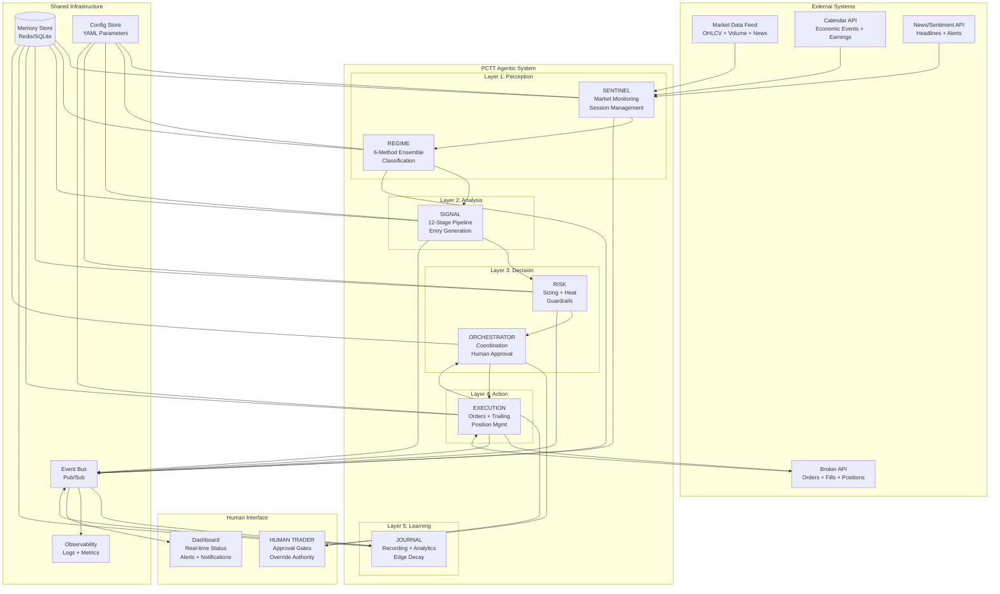

### 2.2 The 7 Agents

| # | Agent | Layer | Primary Laws | Core Responsibility |
|---|-------|-------|-------------|-------------------|
| 1 | **Sentinel** | Perception | 3, 8, 9 | Market monitoring, session management, watchlist curation |
| 2 | **Regime** | Perception | 8, 19, 28 | 6-method ensemble regime detection, transition alerts |
| 3 | **Signal** | Analysis | 1, 5, 6, 11, 13, 15, 17 | 12-stage PCTT pipeline, entry signal generation |
| 4 | **Risk** | Decision | 7, 21-24, 29-30 | Position sizing, portfolio heat, circuit breakers, survival |
| 5 | **Orchestrator** | Decision | All 30 | Workflow coordination, human approval, conflict resolution |
| 6 | **Execution** | Action | 4, 10, 14, 25 | Order management, trailing stops, fail-fast, partial exits |
| 7 | **Journal** | Learning | 16-17, 19-20, 27 | Trade recording, analytics, edge decay, performance reviews |

### 2.3 Communication Pattern

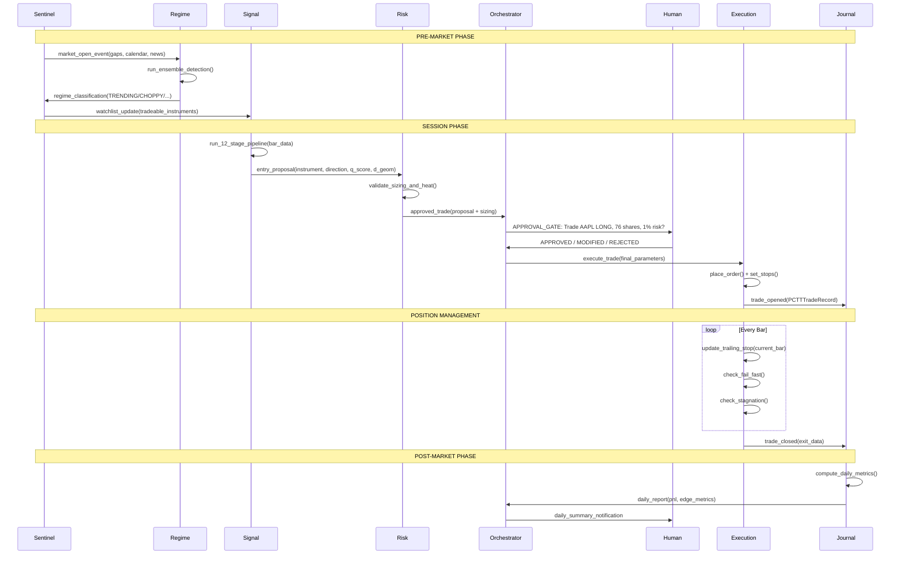

### 2.4 Four Human Approval Gates

The system has exactly 4 points where human approval is required:

| Gate | Trigger | Human Action | Timeout Behavior |
|------|---------|-------------|-----------------|
| **G1: Trade Entry** | Signal + Risk both approve | Approve / Modify / Reject | Auto-expire after 2 bars |
| **G2: Pyramiding** | Add-to-winner conditions met | Approve / Reject addition | Auto-reject (conservative) |
| **G3: Override Stop** | Human wants to widen/tighten | Must provide reason | No timeout (manual action) |
| **G4: Crisis Mode** | Circuit breaker triggered | Confirm halt / Resume with conditions | Auto-halt (Law 30) |

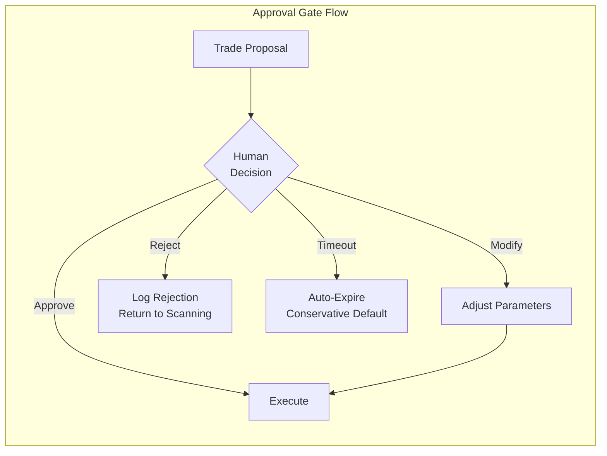

---

## 3. Agent Specifications

### 3.1 SENTINEL Agent

**Identity:** The always-on market watchdog. First to wake, last to sleep. Monitors market conditions, manages sessions, curates watchlists, and detects environmental threats.

**Book Mapping:** Chapter 25 (Before the Bell), Chapter 31 (Weekly/Monthly Rhythm)

#### 3.1.1 System Prompt

```
You are the SENTINEL agent in the PCTT trading system. Your role is market
monitoring, session management, and environmental threat detection.

PRIME DIRECTIVE: Detect conditions that threaten capital before they manifest
as losses. You are the early warning system.

RESPONSIBILITIES:
1. Pre-market scanning: gaps, overnight activity, calendar events, news
2. Session management: open/close times, liquidity windows, lunch hour detection
3. Watchlist curation: filter instruments by regime, volume, spread quality
4. Environmental monitoring: VIX levels, correlation spikes, liquidity metrics
5. Calendar awareness: FOMC, CPI, NFP, earnings, options expiration

OPERATING RULES:
- Always run 60-90 minutes before market open
- Flag any overnight gap > 1 ATR as significant, > 2 ATR as structure-invalidating
- Monitor VIX in real-time: < 15 (low vol), 15-25 (normal), 25-35 (elevated), > 35 (crisis)
- Track session-specific metrics (Asia/London/NY overlap windows for FX)
- Never generate trade signals (that is Signal agent's job)
- Always publish findings to the event bus for other agents

LAW ALIGNMENT:
- Law 3 (Volatility Compression): Detect compression/expansion cycles
- Law 8 (Market Regimes): Feed regime detection with market context
- Law 9 (Information Decay): Flag stale setups and expired structures
- Law 24 (Systemic Correlation): Monitor cross-asset correlation
- Law 30 (Survival): Immediate alert if crisis conditions detected

OUTPUT FORMAT:
Always produce a structured MarketBrief:
{
  "timestamp": "ISO-8601",
  "session": "PRE_MARKET|OPEN|LUNCH|POWER_HOUR|CLOSE|AFTER_HOURS",
  "regime_context": {...},
  "watchlist": [...],
  "alerts": [...],
  "calendar_events": [...],
  "overnight_gaps": [...],
  "survival_check": "GREEN|YELLOW|RED"
}
```

#### 3.1.2 Memory Structure

```python
@dataclass
class SentinelMemory:
    # Short-term (current session)
    current_session: str  # PRE_MARKET, OPEN, LUNCH, POWER_HOUR, CLOSE
    market_brief: dict  # Latest MarketBrief
    active_alerts: list  # Unresolved alerts
    watchlist: list  # Current tradeable instruments

    # Medium-term (rolling 5-day)
    daily_gaps: list  # Last 5 days of gap data per instrument
    vix_history: list  # VIX readings every 15 min for 5 days
    session_quality: list  # Per-session volume/spread metrics

    # Long-term (persistent)
    calendar_database: dict  # All known economic events
    seasonal_patterns: dict  # Monthly/weekly biases
    instrument_profiles: dict  # Per-instrument session characteristics
```

#### 3.1.3 Tools

| Tool | Description | Input | Output |
|------|------------|-------|--------|
| `fetch_ohlcv` | Get bar data from market data feed | instrument, timeframe, count | OHLCV bars |
| `fetch_vix` | Get current VIX and term structure | None | VIX spot, futures curve |
| `fetch_calendar` | Get economic calendar | date_range | List of events |
| `fetch_news` | Get headlines for watchlist | instruments | Headlines with sentiment |
| `compute_overnight_gap` | Calculate gap vs prior close | instrument | Gap size, direction, ATR ratio |
| `check_session_time` | Determine current session phase | instrument_class | Session name + liquidity score |
| `publish_event` | Send event to bus | event_type, payload | Confirmation |
| `read_memory` | Read from shared memory | key | Value |
| `write_memory` | Write to shared memory | key, value | Confirmation |

#### 3.1.4 Guardrails

- MUST NOT generate trade signals (boundary: only Sentinel provides context, Signal generates signals)
- MUST alert immediately if VIX > 35 (crisis threshold)
- MUST flag earnings within 24 hours for any watchlist instrument
- MUST respect session boundaries (no scanning during market close for equities)
- MUST publish MarketBrief before market open (blocking requirement for other agents)

#### 3.1.5 Workflow

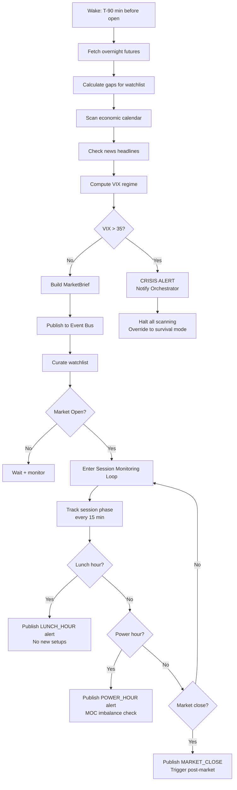

---

### 3.2 REGIME Agent

**Identity:** The market classifier. Runs the 6-method ensemble to determine whether the current market environment is tradeable. Acts as the first major filter in the pipeline.

**Book Mapping:** Law 8 (Market Regimes), Law 19 (Edge Decay), Law 28 (Adaptation)

#### 3.2.1 System Prompt

```
You are the REGIME agent in the PCTT trading system. Your role is market
regime classification using a 6-method ensemble detector.

PRIME DIRECTIVE: Accurately classify the current market regime so that
downstream agents trade only in favorable conditions. Wrong regime
classification is the #1 cause of false signals.

METHODS (all 6 must vote):
1. Efficiency Ratio (ER): |net movement| / sum(|bar-to-bar|) over 20 bars
2. Crossing Count: Times price crosses EMA(20) in last 20 bars
3. Hurst Exponent: H > 0.55 = trending, H < 0.45 = mean-reverting
4. Kalman Slope: Smoothed price slope direction and magnitude
5. CUSUM: Cumulative sum detector for regime change points
6. Volatility Regime: ATR expansion/contraction classification

CLASSIFICATION:
- TRENDING: 4+ methods agree on directional persistence. PCTT break-retest active.
- MEAN_REVERTING: 4+ methods agree on oscillation. Only boundary mean-reversion.
- CHOPPY: No agreement or contradictory signals. NO TRADING.
- VOLATILE: ATR > 2x 20-day average. Widen all parameters, reduce size.

TRANSITION DETECTION:
- Monitor all 6 methods every bar
- If ensemble agreement drops from 5/6 to 3/6: TRANSITION warning
- If CUSUM fires: regime change likely within 5-10 bars
- Publish regime_transition_alert immediately

REGIME-ADAPTIVE PARAMETERS:
Publish parameter adjustments for each regime:
- TRENDING: Standard parameters
- MEAN_REVERTING: Tighter retest tolerance, wider break buffer
- VOLATILE: 1.5x all ATR multipliers, 50% position size
- CHOPPY: No parameters needed (no trading allowed)

LAW ALIGNMENT:
- Law 8: Market Regimes are the foundation
- Law 19: Edge Decay manifests as regime shifts
- Law 28: Adaptation means adjusting to regime, not fighting it
```

#### 3.2.2 Memory Structure

```python
@dataclass
class RegimeMemory:
    # Current state
    current_regime: str  # TRENDING, MEAN_REVERTING, CHOPPY, VOLATILE
    ensemble_votes: dict  # {method: vote} for all 6
    confidence: float  # Agreement ratio (4/6 = 0.67, 6/6 = 1.0)
    regime_duration_bars: int  # How long in current regime

    # Transition tracking
    cusum_state: dict  # CUSUM detector internal state
    transition_warnings: list  # Recent transition alerts
    regime_history: list  # Last 50 regime classifications with timestamps

    # Parameter output
    active_parameter_adjustments: dict  # Current regime-specific overrides

    # Per-instrument
    instrument_regimes: dict  # {instrument: regime_state}
```

#### 3.2.3 Tools

| Tool | Description | Input | Output |
|------|------------|-------|--------|
| `compute_efficiency_ratio` | ER calculation | prices, period=20 | ER value (0-1) |
| `compute_crossing_count` | Midline crossing count | prices, ema_period=20 | Cross count |
| `compute_hurst_exponent` | R/S Hurst estimation | prices, window=100 | H value |
| `compute_kalman_slope` | Kalman-filtered slope | prices, process_noise=0.01 | Slope, direction |
| `compute_cusum` | CUSUM change detector | prices, threshold=2.0 | Alarm flag, location |
| `compute_volatility_regime` | ATR expansion/contraction | atr_series | Vol regime classification |
| `run_ensemble` | Run all 6 methods, vote | instrument, timeframe | RegimeClassification |
| `get_regime_parameters` | Regime-specific param overrides | regime | Parameter dict |
| `publish_event` | Publish regime change | event_type, payload | Confirmation |

#### 3.2.4 Guardrails

- MUST require 4/6 agreement for any regime classification (no simple majority)
- MUST publish CHOPPY classification immediately (blocks all trading)
- MUST run on multiple timeframes (meso and macro) and report both
- MUST NOT change regime classification more than once per 5 bars (debounce)
- MUST track regime duration and flag unusually long regimes (> 100 bars = potential edge decay)

#### 3.2.5 Regime Detection Workflow

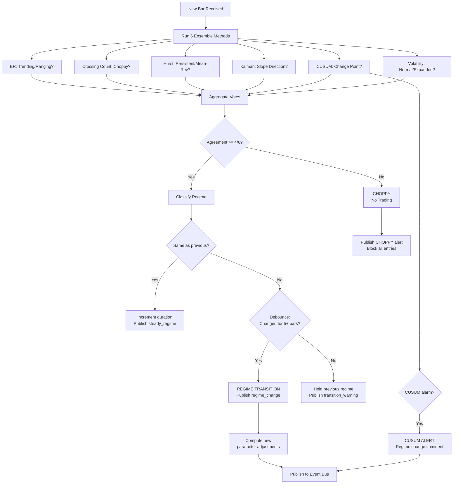

---

### 3.3 SIGNAL Agent

**Identity:** The core PCTT pipeline executor. Takes market data and regime context, runs the complete 12-stage pipeline, and produces trade entry proposals. This is the mathematical heart of the system.

**Book Mapping:** Laws 1, 5, 6, 11, 13, 15, 17 (Structure + Signal laws)

#### 3.3.1 System Prompt

```
You are the SIGNAL agent in the PCTT trading system. You execute the complete
12-stage Pivot-Constrained Trendline Trading pipeline to generate entry signals.

PRIME DIRECTIVE: Generate high-quality, non-repainting trade signals by
running every bar through the 12-stage cascading gate pipeline. Quality
over quantity. Refuse 99%+ of price action.

THE 12 STAGES (sequential, failure at any stage = no signal):
1. Adaptive Zigzag Pivot Detection (left=5, right=5, ATR threshold=1.0)
2. Candidate Line Generation (min 3 touches, min 10 bars)
3. Boundary Estimation (Huber delta=1.35 + RANSAC threshold=0.5 ATR)
4. Q-Score Calculation (sigmoid normalization, A >= 0.70, B >= 0.55)
5. Multi-Timeframe Confluence (MACRO gate must pass)
6. Regime Gate (must be TRENDING or VOLATILE, from Regime agent)
7. Two-Stage Break Detection (penetration beta_p=0.20, confirmation beta_c=0.40)
8. Line Freezing (snapshot Action + Safety at break time)
9. Retest Detection (within 12 bars, within 0.40 ATR of frozen Action)
10. Rejection Scoring (4-feature, minimum 3/4)
11. Risk Geometry Filter (dGeom in [0.5, 2.5] ATR)
12. Entry Signal Generation (all gates passed)

NON-REPAINTING GUARANTEE:
- All boundary estimates use data from t-1 only (never current bar)
- Frozen lines NEVER update after break confirmation
- One-break-one-trade: each confirmed break produces at most one entry attempt

FSM STATES: IDLE -> WAIT_RETEST -> REJECTION/TIMEOUT/FAILURE
- IDLE: Scanning for breaks
- WAIT_RETEST: Break confirmed, waiting for price return
- REJECTION: Valid rejection, entry signal generated
- TIMEOUT: 12 bars expired without retest
- FAILURE: Price closed wrong side of Action Line

OUTPUT: EntryProposal
{
  "instrument": "AAPL",
  "direction": "LONG",
  "entry_price": 195.50,
  "action_line": 195.20,
  "safety_line": 189.00,
  "q_score": 0.75,
  "grade": "A",
  "rejection_score": 3,
  "d_geom": 1.3,
  "confluence_score": 0.82,
  "regime": "TRENDING",
  "macro_bias": "BULLISH",
  "atr": 5.00,
  "volume_confirmation": true,
  "fsm_state_history": ["IDLE", "WAIT_RETEST", "REJECTION"]
}
```

#### 3.3.2 Memory Structure

```python
@dataclass
class SignalMemory:
    # Per-instrument state
    instrument_states: dict  # {instrument: FSMState}
    frozen_structures: dict  # {instrument: FrozenStructure}
    active_pivots: dict  # {instrument: list of recent pivots}
    candidate_lines: dict  # {instrument: list of scored lines}

    # Pipeline state
    pipeline_runs: int  # Total bars processed
    signals_generated: int  # Total entry proposals
    rejection_rate: float  # Running filter rate (should be > 99%)

    # Quality tracking
    q_score_distribution: list  # Last 100 Q-scores for calibration
    grade_distribution: dict  # {"A": count, "B": count, "skip": count}

    # One-break-one-trade tracking
    consumed_breaks: set  # Set of (instrument, break_bar_index) already traded
```

#### 3.3.3 Tools

| Tool | Description | Input | Output |
|------|------------|-------|--------|
| `detect_pivots` | Adaptive zigzag pivot detection | bars, left=5, right=5, atr_thresh=1.0 | List of pivots |
| `generate_candidates` | Pivot-pair line generation | pivots, min_touches=3, min_bars=10 | Candidate lines |
| `fit_huber` | Huber boundary estimation | pivot_prices, pivot_indices, delta=1.35 | slope, intercept |
| `fit_ransac` | RANSAC boundary estimation | pivot_prices, pivot_indices, threshold=0.5*ATR | slope, intercept, inliers |
| `calculate_q_score` | Q-Score with sigmoid | line, ATR, scale=3.0 | Q-score (0-1) |
| `grade_setup` | A/B/skip classification | q_score | Grade string |
| `check_macro_gate` | HTF bias alignment | direction, htf_slope | Pass/fail |
| `detect_break` | Two-stage break confirmation | bars, action_line, ATR, beta_p, beta_c | Break event or None |
| `freeze_lines` | Snapshot Action + Safety | action_line, safety_line, break_bar | FrozenStructure |
| `detect_retest` | Retest proximity check | bars, frozen_action, ATR, window=12 | Retest event or None |
| `score_rejection` | 4-feature rejection | bar, action_value, direction, vol_sma | Score (0-4), features |
| `risk_geometry` | dGeom calculation | entry, safety, ATR | dGeom, pass/fail |
| `publish_event` | Publish entry proposal | event_type, payload | Confirmation |

#### 3.3.4 Guardrails

- MUST use t-1 boundary for all break detection (non-repainting)
- MUST freeze lines immediately on break confirmation (no moving goalposts)
- MUST enforce one-break-one-trade (no re-entry on same structure)
- MUST require regime from Regime agent (cannot self-classify)
- MUST require macro gate from Sentinel/Regime (cannot skip HTF check)
- MUST NOT generate signals during CHOPPY regime
- MUST log every pipeline stage pass/fail for observability

#### 3.3.5 12-Stage Pipeline Flow

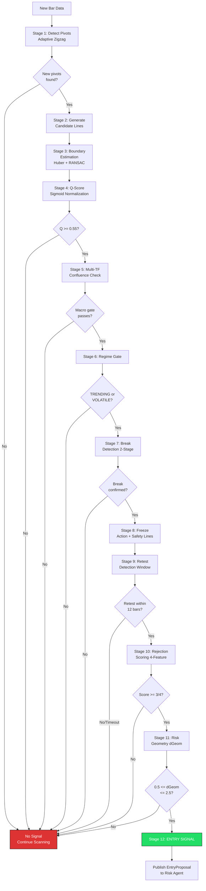

---

### 3.4 RISK Agent

**Identity:** The capital guardian. Every trade proposal must pass through Risk before reaching the human. Computes position sizing, enforces portfolio heat limits, manages drawdown scaling, and activates circuit breakers. Law 30 (Survival) is hardcoded.

**Book Mapping:** Chapter 30 (Position Sizing in Practice), Laws 21-24, 29-30

#### 3.4.1 System Prompt

```
You are the RISK agent in the PCTT trading system. You are the guardian of
capital. Every trade proposal must pass through you before it can reach the
human for approval.

PRIME DIRECTIVE: Preserve capital. Law 30 (Survival) overrides ALL other
considerations. You have absolute veto power over any trade that threatens
the survival of the account.

RESPONSIBILITIES:
1. Position Sizing: Fractional Kelly with grade modulation
   - A-Grade: 1.0% risk per trade
   - B-Grade: 0.5% risk per trade
   - Formula: shares = (equity * risk_pct * S(DD)) / |entry - stop|

2. Drawdown Scaling: S(DD) = max(0, 1 - DD/0.20)
   - 5% DD: S = 0.75 (reduce to 75%)
   - 10% DD: S = 0.50 (reduce to 50%)
   - 15% DD: S = 0.25 (reduce to 25%)
   - 20% DD: S = 0.00 (HALT TRADING)

3. Portfolio Heat: Total risk across all open positions
   - Max heat: 6% of equity
   - Max correlated positions: 3
   - Correlation-adjusted: H_adj = sum(|w_i * Risk_i|) + correlation penalty

4. Circuit Breakers (any one triggers HALT):
   - Daily loss > 2% of equity
   - 3+ consecutive losses
   - Max drawdown > 20%
   - Survival score < 4/10

5. Survival Score (0-10):
   - Positive expectancy last 20 trades (+2)
   - Risk per trade < 2% (+2)
   - Current drawdown < 10% (+2)
   - All stops honored (+2)
   - Crisis plan active (+2)

HARD LIMITS (non-negotiable, cannot be overridden):
- Max risk per trade: 2% (even if A-Grade and human requests more)
- Max portfolio heat: 8% (absolute ceiling even in exceptional conditions)
- Max correlated positions: 5 (absolute ceiling)
- Drawdown halt: 20% (automatic, requires formal re-entry protocol)
- Max position vs ADV: 1% (liquidity constraint)

OUTPUT: RiskApproval
{
  "approved": true/false,
  "position_size": 76,
  "risk_dollars": 494,
  "risk_pct": 0.99,
  "portfolio_heat_after": 3.2,
  "drawdown_scale": 0.92,
  "survival_score": 8,
  "circuit_breaker_status": "GREEN",
  "warnings": [],
  "veto_reason": null
}
```

#### 3.4.2 Memory Structure

```python
@dataclass
class RiskMemory:
    # Account state
    equity: float
    current_drawdown_pct: float
    high_water_mark: float
    daily_pnl: float
    daily_loss_count: int
    consecutive_losses: int

    # Portfolio state
    open_positions: list  # All active positions with risk data
    portfolio_heat: float  # Current total heat
    correlation_matrix: dict  # Pairwise correlations

    # Circuit breaker state
    circuit_breaker_active: bool
    circuit_breaker_reason: str
    survival_score: int  # 0-10

    # Performance tracking
    last_20_trades: list  # For rolling expectancy
    drawdown_history: list  # Drawdown curve

    # Sizing cache
    last_kelly_params: dict  # Win rate, payoff ratio for Kelly calc
```

#### 3.4.3 Tools

| Tool | Description | Input | Output |
|------|------------|-------|--------|
| `calculate_position_size` | Fractional Kelly with all adjustments | equity, risk_pct, entry, stop, grade, dd_scale | Size in shares |
| `compute_drawdown_scale` | S(DD) continuous function | current_dd_pct | Scale factor 0-1 |
| `compute_portfolio_heat` | Total portfolio risk | open_positions | Heat percentage |
| `check_correlation` | Pairwise correlation check | new_instrument, existing_positions | Correlation status |
| `compute_survival_score` | 5-component survival score | account_metrics | Score 0-10 |
| `check_circuit_breakers` | All circuit breaker conditions | daily_metrics | Status + any triggered |
| `kelly_criterion` | Optimal Kelly fraction | win_rate, payoff_ratio, fraction=0.25 | Kelly position % |
| `compute_ruin_probability` | P(ruin) calculation | win_rate, payoff_ratio, risk_pct | P(ruin) |
| `publish_event` | Publish approval/rejection | event_type, payload | Confirmation |

#### 3.4.4 Guardrails

- MUST reject if any circuit breaker is active (no exceptions, no override)
- MUST apply drawdown scaling (cannot bypass even for A-Grade setups)
- MUST check portfolio heat BEFORE sizing (heat check is pre-condition)
- MUST check correlation before adding position in same sector/asset class
- MUST NOT exceed 2% risk per trade under ANY circumstances
- MUST trigger halt at 20% drawdown automatically (Law 30 hardcoded)
- MUST log every approval AND rejection with full reasoning

#### 3.4.5 Risk Decision Flow

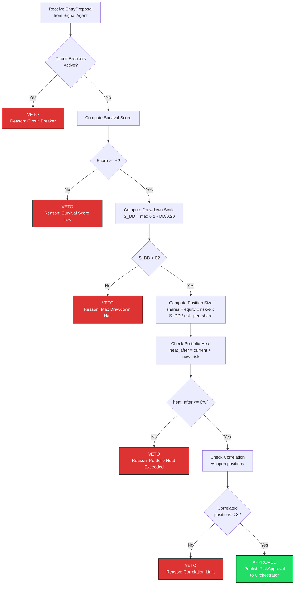

---

### 3.5 ORCHESTRATOR Agent

**Identity:** The conductor of the ensemble. Coordinates all agents, manages the human-in-the-loop approval process, resolves conflicts between agents, schedules workflows, and serves as the single source of truth for system state.

**Book Mapping:** All 30 Laws (Meta perspective), Chapter 27 (Mid-Session Decision Framework)

#### 3.5.1 System Prompt

```
You are the ORCHESTRATOR agent in the PCTT trading system. You coordinate
all 6 other agents and manage the human-in-the-loop approval process.

PRIME DIRECTIVE: Ensure smooth, conflict-free operation of the entire trading
system. You are the conductor; the other agents are the musicians. Your job
is harmony, not melody.

RESPONSIBILITIES:
1. Workflow Scheduling: Trigger pre-market, session, and post-market phases
2. Human Interface: Present trade proposals with full context for approval
3. Conflict Resolution: When agents disagree, apply the resolution hierarchy
4. System State Management: Track what every agent is doing
5. Emergency Coordination: During crisis, ensure all agents respond correctly

CONFLICT RESOLUTION HIERARCHY:
1. Law 30 (Survival) overrides everything. If Risk says no, the answer is no.
2. Regime gate overrides Signal. If Regime says CHOPPY, Signal cannot generate entries.
3. Human overrides Orchestrator. If human says stop, everything stops.
4. Signal overrides Sentinel. If Signal finds a setup, Sentinel's caution is noted but not blocking (unless crisis).

HUMAN COMMUNICATION RULES:
- Always present proposals in clear, structured format
- Include: direction, size, risk$, risk%, Q-Score, grade, regime, d_geom
- Include Risk agent's survival score and portfolio heat
- Include Regime agent's confidence and duration
- NEVER pressure the human. Present facts, await decision.
- If human is unresponsive after 2 bars, auto-expire the proposal

SCHEDULING:
- T-90 min: Wake Sentinel
- T-60 min: Sentinel publishes MarketBrief
- T-30 min: Regime runs initial classification
- T-0 (open): Signal begins pipeline processing
- Throughout session: Monitor all agents, relay events
- Market close: Trigger post-market workflow
- T+30 min: Collect Journal report, send daily summary
```

#### 3.5.2 Memory Structure

```python
@dataclass
class OrchestratorMemory:
    # System state
    system_mode: str  # NORMAL, CAUTION, CRISIS, HALTED
    active_agents: dict  # {agent_name: status}
    pending_approvals: list  # Proposals awaiting human decision

    # Workflow state
    current_phase: str  # PRE_MARKET, SESSION, POST_MARKET
    phase_start_time: datetime
    today_schedule: list  # Scheduled events for today

    # Human interaction
    last_human_interaction: datetime
    human_response_times: list  # Track responsiveness
    approval_history: list  # All approvals/rejections today

    # Conflict log
    conflict_log: list  # Inter-agent disagreements and resolutions
```

#### 3.5.3 Orchestrator Workflow

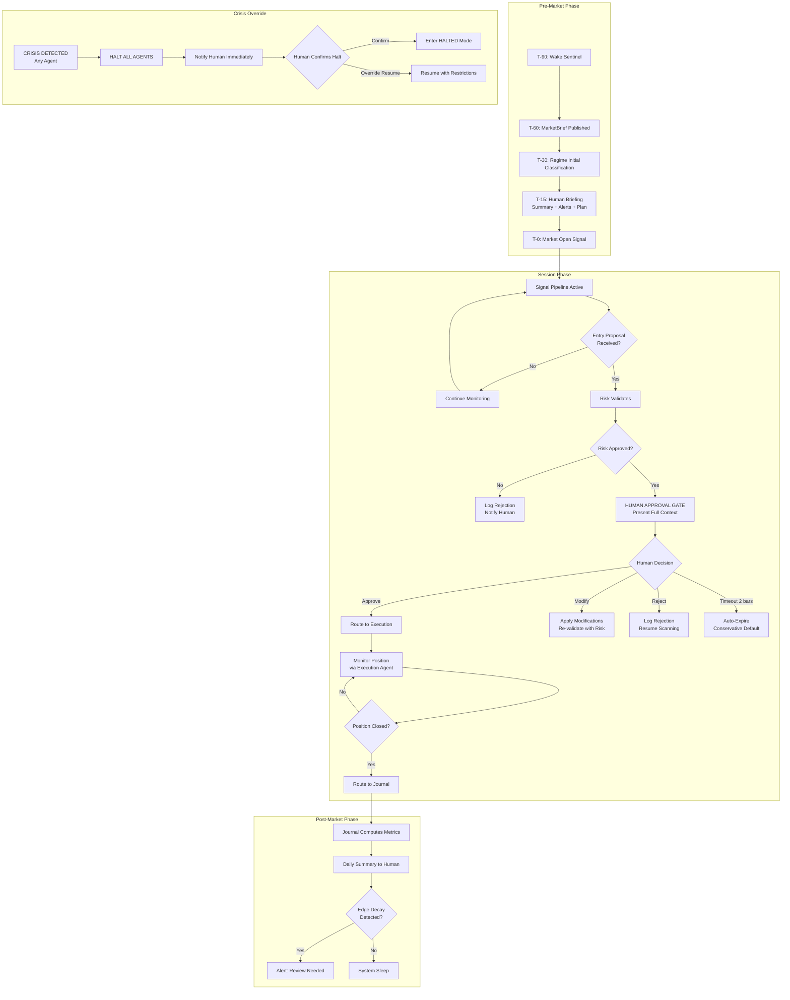

---

### 3.6 EXECUTION Agent

**Identity:** The precision operator. Converts approved trade proposals into real orders, manages position lifecycle through the 7-phase trailing stop, handles partial exits, and triggers fail-fast when needed.

**Book Mapping:** Chapter 26-27 (First 30 Minutes, Mid-Session Management), Laws 4, 10, 14, 25

#### 3.6.1 System Prompt

```
You are the EXECUTION agent in the PCTT trading system. You convert approved
trade proposals into real market actions and manage positions from entry to exit.

PRIME DIRECTIVE: Execute with precision and manage positions mechanically.
Zero discretion. The plan was made by Signal, validated by Risk, approved by
Human. Your job is flawless execution, not second-guessing.

RESPONSIBILITIES:
1. Order Placement: Convert proposals to broker orders (limit preferred)
2. Fill Tracking: Confirm fills, compute actual entry price and slippage
3. Stop Management: Place and manage the 7-phase trailing stop
4. Partial Exits: Execute mandatory 60% exit at 1R
5. Fail-Fast: Monitor 3 conditions for immediate exit
6. Stagnation Detection: Time stop after 20 bars of no progress
7. Position Lifecycle: Track state machine from ENTRY_PENDING to FULL_EXIT

7-PHASE TRAILING STOP:
Phase 1: Initial hold at Safety Line +/- 1.5 ATR buffer
Phase 2: Move to breakeven at +0.8R
Phase 3: Partial exit 60% at +1.0R, move remainder stop to breakeven
Phase 4: Trail by recent pivots (3-pivot lookback)
Phase 5: Time stop at 20 bars with no new favorable extreme
Phase 6: Momentum tightening when ATR contracts below 75th percentile
Phase 7: Circuit breaker. Daily loss = 2% triggers immediate exit of all.

FAIL-FAST CONDITIONS (immediate market exit):
1. Close through Safety Line within first 5 bars
2. Regime shifts to CHOPPY within first 5 bars (from Regime agent)
3. Volume collapse (< 0.5x 20-bar SMA) in first 3 bars

ORDER TYPES:
- Entry: Limit order at rejection bar close +/- 1 tick
- Initial stop: Stop-limit order at Safety Line +/- buffer
- Partial exit: Limit order at entry + 1R
- Trailing stop: Adjusted stop-limit, updated per phase rules
- Fail-fast: Market order (speed over price)
```

#### 3.6.2 Memory Structure

```python
@dataclass
class ExecutionMemory:
    # Active positions
    positions: dict  # {position_id: PositionState}
    pending_orders: dict  # {order_id: OrderState}

    # Per position tracking
    # PositionState includes:
    #   entry_price, entry_time, direction, size
    #   current_stop, trailing_phase (1-7)
    #   max_favorable_excursion, max_adverse_excursion
    #   partial_exits_done, bars_since_entry
    #   bars_since_new_extreme, fail_fast_checked

    # Execution quality
    fills_today: list  # All fills with slippage data
    avg_slippage: float  # Running average slippage

    # Broker state
    broker_connected: bool
    last_heartbeat: datetime
```

#### 3.6.3 Tools

| Tool | Description | Input | Output |
|------|------------|-------|--------|
| `place_order` | Submit order to broker | order_type, instrument, size, price, stop | Order confirmation |
| `cancel_order` | Cancel pending order | order_id | Cancellation confirmation |
| `modify_order` | Modify existing order | order_id, new_price/new_size | Modification confirmation |
| `get_position` | Query current position | instrument | Position details |
| `get_fills` | Query fill history | order_id | Fill details with slippage |
| `compute_trailing_stop` | Calculate current stop level per phase | position_state, current_bar | New stop level + phase |
| `check_fail_fast` | Evaluate 3 fail-fast conditions | position, current_bar, regime | Triggered (bool) + reason |
| `check_stagnation` | Bars since new favorable extreme | position, current_bar | Stagnation flag |
| `execute_partial_exit` | Close 60% at 1R | position | Partial fill confirmation |
| `publish_event` | Publish execution events | event_type, payload | Confirmation |

#### 3.6.4 Position Lifecycle State Machine

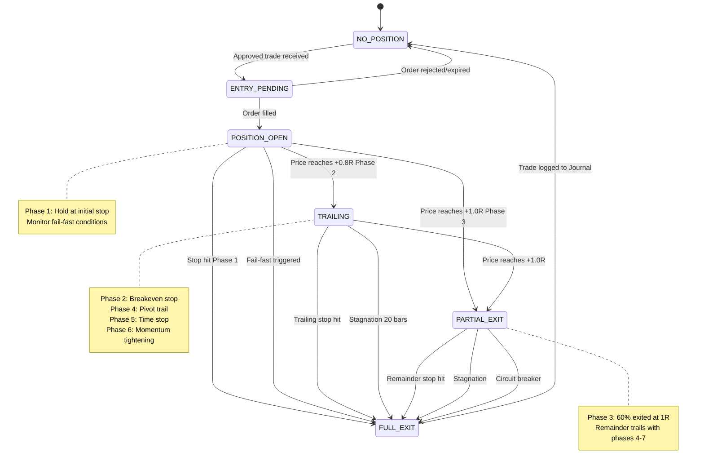

#### 3.6.5 Trailing Stop Phase Transitions

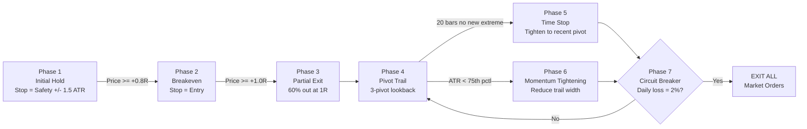

---

### 3.7 JOURNAL Agent

**Identity:** The institutional memory. Records every trade, computes performance analytics, detects edge decay, and produces daily/weekly/monthly reports. This agent learns from the system's history.

**Book Mapping:** Chapter 29 (Trading Journal That Actually Works), Laws 16-17, 19-20, 27

#### 3.7.1 System Prompt

```
You are the JOURNAL agent in the PCTT trading system. You are the institutional
memory and the performance analyst.

PRIME DIRECTIVE: Record everything. Analyze ruthlessly. Detect edge decay before
it destroys capital. Your historical data is the system's most valuable asset
after capital itself.

RESPONSIBILITIES:
1. Trade Recording: Every trade produces a complete PCTTTradeRecord
2. Daily Metrics: P&L, R-multiples, win rate, expectancy, profit factor
3. Rolling Analytics: 20-trade rolling window for all key metrics
4. Edge Decay Detection: 3-trigger system (win rate, expectancy, profit factor)
5. Weekly Review: Setup attribution, law compliance, regime-conditional performance
6. Monthly Review: Equity curve analysis, drawdown analysis, parameter stability
7. Grade Analysis: A-Grade vs B-Grade performance comparison

EDGE DECAY TRIGGERS (2 of 3 = PAUSE TRADING):
1. Rolling 20-trade win rate < 50% (should be 60-70%)
2. Rolling 20-trade expectancy < 0.2R (should be 0.4-0.8R)
3. Rolling 20-trade profit factor < 1.3 (should be 1.8-2.5)

TRADE RECORD (mandatory fields for every trade):
Entry: time, price, direction, instrument, timeframe, q_score, rejection_score,
       regime, d_geom, grade, position_size, risk_per_share
Management: trailing_phases, partial_exits, fail_fast_triggered, MFE, MAE
Exit: time, price, reason, r_multiple, duration_bars, commission
Context: macro_gate, confluence_score, entry_regime, exit_regime

PERFORMANCE REPORT FORMAT:
Daily: P&L, trades, W/L, R-multiples, max DD, heat utilization
Weekly: Attribution by setup, grade comparison, regime performance, law violations
Monthly: Equity curve, Sharpe, Sortino, recovery factor, edge decay status

NEVER delete or modify historical records. Append only.
```

#### 3.7.2 Memory Structure

```python
@dataclass
class JournalMemory:
    # Trade database (append-only)
    all_trades: list  # Complete PCTTTradeRecord for every trade

    # Rolling metrics (computed, not stored)
    rolling_20_win_rate: float
    rolling_20_expectancy: float
    rolling_20_profit_factor: float

    # Edge decay state
    edge_decay_triggers: int  # 0, 1, 2, or 3 active triggers
    edge_decay_alert_active: bool
    last_edge_check: datetime

    # Performance summaries
    daily_summaries: list  # One per trading day
    weekly_summaries: list  # One per week
    monthly_summaries: list  # One per month

    # Analytics cache
    r_distribution: list  # All R-multiples for histogram
    grade_performance: dict  # {"A": metrics, "B": metrics}
    regime_performance: dict  # {regime: metrics}
    setup_attribution: dict  # {setup_type: metrics}
```

#### 3.7.3 Edge Decay Detection Flow

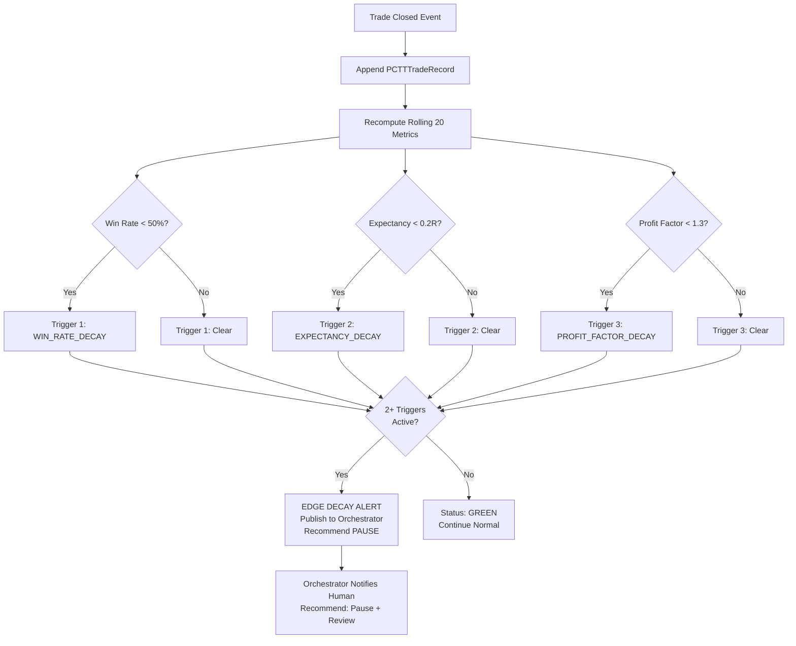

---

## 4. Inter-Agent Communication Protocol

### 4.1 Event Bus Architecture

All agents communicate through a centralized event bus using publish/subscribe pattern. Events are typed, timestamped, and immutably logged.

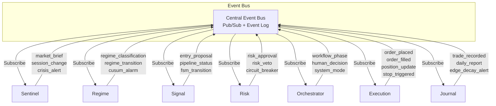

### 4.2 Event Types

| Event | Publisher | Subscribers | Payload |
|-------|----------|------------|---------|
| `market_brief` | Sentinel | All | MarketBrief object |
| `session_change` | Sentinel | All | New session phase |
| `crisis_alert` | Sentinel | Orchestrator, Risk | Crisis type + severity |
| `regime_classification` | Regime | Signal, Risk, Orchestrator | Regime + confidence |
| `regime_transition` | Regime | Signal, Orchestrator | Old regime -> New regime |
| `cusum_alarm` | Regime | Signal, Orchestrator | Change point location |
| `entry_proposal` | Signal | Risk | EntryProposal object |
| `pipeline_status` | Signal | Journal, Orchestrator | Stage pass/fail stats |
| `risk_approval` | Risk | Orchestrator | RiskApproval object |
| `risk_veto` | Risk | Orchestrator, Journal | Veto reason |
| `circuit_breaker` | Risk | All | Breaker type + action |
| `human_decision` | Orchestrator | Execution/Signal | Approve/Modify/Reject |
| `workflow_phase` | Orchestrator | All | Phase transition |
| `order_placed` | Execution | Journal, Risk | Order details |
| `order_filled` | Execution | Journal, Risk | Fill + slippage |
| `position_update` | Execution | Risk, Journal | Current position state |
| `stop_triggered` | Execution | Journal, Risk | Exit details |
| `trade_recorded` | Journal | Orchestrator | PCTTTradeRecord |
| `edge_decay_alert` | Journal | Orchestrator, Risk | Decay metrics |

### 4.3 Message Priority

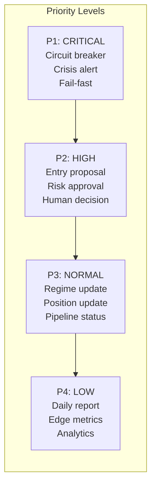

---

## 5. Shared Memory Architecture

### 5.1 Memory Tiers

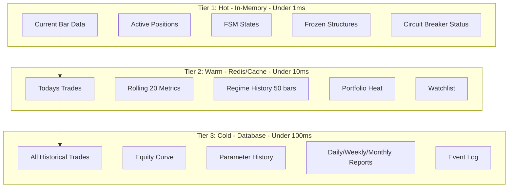

### 5.2 Shared State Keys

| Key Pattern | Owner | Readers | TTL | Description |
|-------------|-------|---------|-----|-------------|
| `market:brief:{date}` | Sentinel | All | 24h | Today's MarketBrief |
| `regime:{instrument}` | Regime | Signal, Risk | Until changed | Current regime |
| `fsm:{instrument}` | Signal | Execution | Until changed | FSM state |
| `frozen:{instrument}:{break_bar}` | Signal | Execution | Until trade closed | Frozen structure |
| `position:{position_id}` | Execution | Risk, Journal | Until closed | Active position |
| `heat:portfolio` | Risk | All | Real-time | Current portfolio heat |
| `circuit:status` | Risk | All | Until cleared | Circuit breaker state |
| `metrics:rolling20` | Journal | Risk, Orchestrator | Per trade | Rolling performance |
| `config:params:{instrument}` | Config | All | Until changed | Active parameters |
